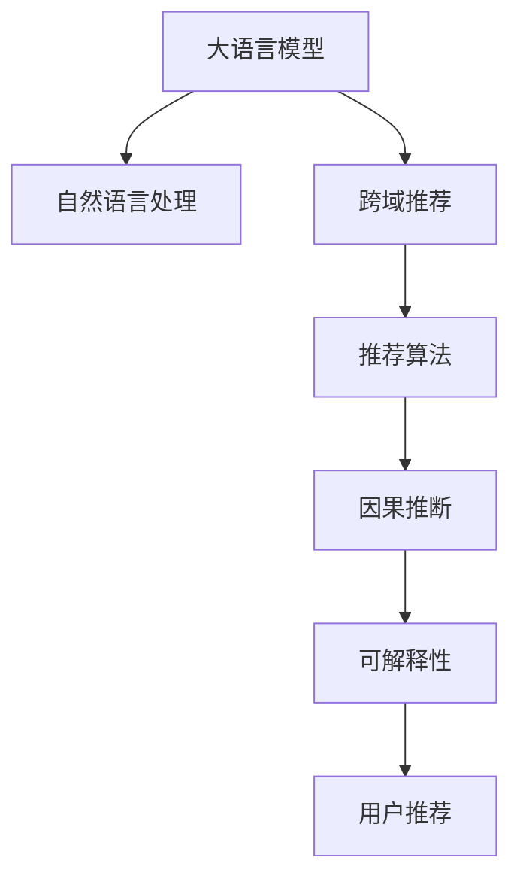

                 

# 利用LLM提升推荐系统的跨域推荐能力

> 关键词：自然语言处理(NLP),推荐系统,推荐算法,大语言模型(LLM),跨域推荐,因果推断,可解释性

## 1. 背景介绍

### 1.1 问题由来

在当前信息爆炸的时代，用户面临海量的信息选择，如何在海量数据中快速找到自己感兴趣的领域或内容成为了一个大问题。推荐系统应运而生，利用用户的浏览、点击、评价等历史行为数据，通过算法为其推荐感兴趣的个性化内容，显著提升了用户体验。然而，传统的推荐系统往往局限于单一数据源或单一领域，难以跨域理解用户的多样化兴趣和偏好。跨域推荐能力，即推荐系统在分析多源数据时能够理解和融合不同数据源中的用户行为，为跨域推荐打下了基础。

### 1.2 问题核心关键点

为了提升推荐系统的跨域推荐能力，需要利用大语言模型(LLM)和推荐算法相结合，在多源数据上综合理解用户的多样化兴趣和行为。其关键点包括：

- 如何高效融合多源数据，形成统一的推荐语义空间。
- 如何利用因果推断等方法，理解和刻画多源数据之间的因果关系，从而提升推荐精度。
- 如何通过可解释性强的模型输出，增强推荐结果的可理解性和可信度。

### 1.3 问题研究意义

跨域推荐是推荐系统领域的前沿研究方向，有助于拓展推荐系统的应用场景，提升推荐系统的鲁棒性和适应性。通过提升跨域推荐能力，推荐系统可以更好地理解用户的多样化兴趣和偏好，从而在多源数据上为用户提供更精准、个性化的推荐服务。这对于电商、新闻、社交媒体等场景，都具有重要的应用价值。

## 2. 核心概念与联系

### 2.1 核心概念概述

为了更好地理解跨域推荐中的大语言模型(LLM)与推荐算法的结合，本节将介绍几个关键概念：

- 自然语言处理(NLP)：利用计算技术，从文本数据中提取出有价值的信息，包括文本分类、情感分析、实体识别、问答系统等。
- 推荐系统(Recommendation System)：通过用户历史行为数据，预测用户可能感兴趣的内容或商品，进行推荐。
- 大语言模型(LLM)：基于自回归(如GPT)或自编码(如BERT)模型，在大量文本数据上预训练得到的大规模语言模型。具备强大的语言理解和生成能力。
- 跨域推荐(Cross-domain Recommendation)：推荐系统在多源数据上综合理解用户兴趣，进行跨领域推荐，提升推荐系统在多域数据上的泛化能力。
- 因果推断(Causal Inference)：利用统计学和机器学习方法，识别和理解因果关系，从而更准确地进行推荐决策。
- 可解释性(Explainability)：推荐结果的可理解性，有助于提高用户信任度和推荐系统的可信度。

这些概念之间的逻辑关系可以通过以下Mermaid流程图来展示：



这个流程图展示了大语言模型与推荐系统、自然语言处理、因果推断和可解释性等概念的相互联系：

1. 大语言模型通过自监督学习任务在大量文本数据上进行预训练，学习到了丰富的语言知识和常识。
2. 自然语言处理技术可以高效地从文本中提取用户行为和兴趣。
3. 跨域推荐技术利用大语言模型和自然语言处理技术，综合多源数据，理解用户的多样化兴趣和行为。
4. 推荐算法可以利用因果推断等方法，提升推荐结果的精度和鲁棒性。
5. 可解释性技术通过分析推荐模型的决策过程，增强推荐结果的可理解性和可信度。

这些概念共同构成了跨域推荐系统的技术框架，使其能够更好地在多源数据上提供精准、个性化的推荐服务。

## 3. 核心算法原理 & 具体操作步骤
### 3.1 算法原理概述

跨域推荐的目的是利用多源数据，在保持数据隐私和完整性的前提下，综合多源数据中的用户行为和兴趣，为用户推荐更精准的内容。其核心思想是利用大语言模型和推荐算法相结合，对多源数据进行综合理解和推荐。

具体来说，假设多源数据集为 $D=\{(x_i,y_i)\}_{i=1}^N$，其中 $x_i$ 表示用户的历史行为数据， $y_i$ 表示用户对行为的兴趣和偏好。定义推荐模型为 $M_{\theta}$，其中 $\theta$ 为模型的参数。目标是最小化模型在测试集上的预测误差，即：

$$
\hat{\theta}=\mathop{\arg\min}_{\theta} \mathcal{L}(M_{\theta},D_{test})
$$

其中 $\mathcal{L}$ 为推荐模型在测试集上的损失函数，通常使用交叉熵损失、均方误差等。

### 3.2 算法步骤详解

跨域推荐的实现通常包括以下几个关键步骤：

**Step 1: 数据预处理与特征抽取**
- 收集多源数据集 $D=\{(x_i,y_i)\}_{i=1}^N$，进行数据清洗和标注。
- 利用自然语言处理技术，从多源数据中提取出有价值的特征，如文本内容、时间、地点等。
- 将特征向量输入到预训练的大语言模型中，通过自监督学习得到语言表示向量。

**Step 2: 构建推荐模型**
- 设计推荐算法，利用因果推断、协同过滤、基于内容的推荐等方法。
- 将语言表示向量作为推荐模型的输入，进行多源数据的融合和推荐计算。
- 利用因果推断模型，识别不同数据源之间的因果关系，提升推荐模型的鲁棒性。

**Step 3: 模型训练与微调**
- 使用多源数据集 $D$ 对推荐模型进行训练。
- 在验证集上评估推荐模型的效果，根据性能指标调整模型参数。
- 利用微调技术，进一步提升推荐模型的性能，如参数高效微调(PEFT)、Prompt Learning等。

**Step 4: 部署与评估**
- 将训练好的推荐模型部署到实际应用系统中。
- 在测试集上评估推荐模型的性能，对比不同推荐算法的效果。
- 不断收集新数据，定期重新训练和微调模型，以适应数据分布的变化。

以上是跨域推荐的一般流程。在实际应用中，还需要针对具体任务的特点，对推荐模型的各个环节进行优化设计，如改进特征选择方法、引入更多的因果推断技术、搜索最优的超参数组合等，以进一步提升推荐模型的效果。

### 3.3 算法优缺点

跨域推荐的优点包括：
1. 跨域推荐可以充分利用多源数据，弥补单一数据源的局限性，提升推荐精度。
2. 因果推断技术可以更好地理解不同数据源之间的因果关系，提高推荐模型的鲁棒性。
3. 利用大语言模型和自然语言处理技术，可以提取文本中的语义信息，增强推荐模型的理解能力。

同时，该方法也存在一些局限性：
1. 数据隐私和完整性问题：多源数据融合可能涉及隐私泄露和数据泄露风险。
2. 数据不一致性：不同数据源的数据格式和质量可能存在差异，影响推荐的准确性。
3. 计算资源需求高：跨域推荐通常需要较大的计算资源，包括存储空间和计算时间。
4. 可解释性不足：推荐模型的决策过程往往难以解释，难以分析推荐结果的合理性。

尽管存在这些局限性，但就目前而言，跨域推荐仍是大规模推荐系统的重要研究范式，具有广阔的应用前景。未来相关研究的重点在于如何进一步降低计算成本，提高推荐模型的可解释性和安全性，同时兼顾跨域推荐的精度和鲁棒性。

### 3.4 算法应用领域

跨域推荐技术已经在电商、新闻、社交媒体等多个领域得到广泛应用，具体如下：

- **电商推荐**：电商平台可以收集用户的购物行为数据，如浏览、点击、购买等。通过对不同来源的数据进行融合，提升推荐的个性化和多样性。
- **新闻推荐**：新闻媒体可以收集用户的阅读行为数据，如点击量、评论等。通过对不同来源的数据进行跨域分析，为用户推荐相关的新闻内容。
- **社交媒体推荐**：社交平台可以收集用户的社交行为数据，如点赞、分享等。通过对不同来源的数据进行融合，提升推荐的精准性和及时性。

此外，跨域推荐技术还应用于多模态推荐、关联推荐、兴趣转移推荐等场景，为推荐系统带来了新的发展机遇。

## 4. 数学模型和公式 & 详细讲解  
### 4.1 数学模型构建

假设多源数据集为 $D=\{(x_i,y_i)\}_{i=1}^N$，其中 $x_i$ 表示用户的历史行为数据， $y_i$ 表示用户对行为的兴趣和偏好。推荐模型为 $M_{\theta}$，其中 $\theta$ 为模型的参数。目标是最小化模型在测试集上的预测误差，即：

$$
\hat{\theta}=\mathop{\arg\min}_{\theta} \mathcal{L}(M_{\theta},D_{test})
$$

其中 $\mathcal{L}$ 为推荐模型在测试集上的损失函数，通常使用交叉熵损失、均方误差等。

### 4.2 公式推导过程

以下我们以二分类任务为例，推导交叉熵损失函数及其梯度的计算公式。

假设推荐模型 $M_{\theta}$ 在输入 $x$ 上的输出为 $\hat{y}=M_{\theta}(x) \in [0,1]$，表示用户对推荐内容的兴趣。真实标签 $y \in \{0,1\}$。则二分类交叉熵损失函数定义为：

$$
\ell(M_{\theta}(x),y) = -[y\log \hat{y} + (1-y)\log (1-\hat{y})]
$$

将其代入损失函数公式，得：

$$
\mathcal{L}(\theta) = -\frac{1}{N}\sum_{i=1}^N [y_i\log M_{\theta}(x_i)+(1-y_i)\log(1-M_{\theta}(x_i))]
$$

根据链式法则，损失函数对参数 $\theta_k$ 的梯度为：

$$
\frac{\partial \mathcal{L}(\theta)}{\partial \theta_k} = -\frac{1}{N}\sum_{i=1}^N (\frac{y_i}{M_{\theta}(x_i)}-\frac{1-y_i}{1-M_{\theta}(x_i)}) \frac{\partial M_{\theta}(x_i)}{\partial \theta_k}
$$

其中 $\frac{\partial M_{\theta}(x_i)}{\partial \theta_k}$ 可进一步递归展开，利用自动微分技术完成计算。

在得到损失函数的梯度后，即可带入参数更新公式，完成模型的迭代优化。重复上述过程直至收敛，最终得到适应多源数据的最优模型参数 $\theta^*$。

## 5. 项目实践：代码实例和详细解释说明
### 5.1 开发环境搭建

在进行跨域推荐实践前，我们需要准备好开发环境。以下是使用Python进行PyTorch开发的环境配置流程：

1. 安装Anaconda：从官网下载并安装Anaconda，用于创建独立的Python环境。

2. 创建并激活虚拟环境：
```bash
conda create -n pytorch-env python=3.8 
conda activate pytorch-env
```

3. 安装PyTorch：根据CUDA版本，从官网获取对应的安装命令。例如：
```bash
conda install pytorch torchvision torchaudio cudatoolkit=11.1 -c pytorch -c conda-forge
```

4. 安装Transformers库：
```bash
pip install transformers
```

5. 安装各类工具包：
```bash
pip install numpy pandas scikit-learn matplotlib tqdm jupyter notebook ipython
```

完成上述步骤后，即可在`pytorch-env`环境中开始跨域推荐实践。

### 5.2 源代码详细实现

下面我们以电商推荐任务为例，给出使用Transformers库对BERT模型进行跨域推荐的PyTorch代码实现。

首先，定义电商推荐任务的数据处理函数：

```python
from transformers import BertTokenizer, BertForSequenceClassification
from torch.utils.data import Dataset
import torch

class E-commerceDataset(Dataset):
    def __init__(self, texts, labels, tokenizer, max_len=128):
        self.texts = texts
        self.labels = labels
        self.tokenizer = tokenizer
        self.max_len = max_len
        
    def __len__(self):
        return len(self.texts)
    
    def __getitem__(self, item):
        text = self.texts[item]
        label = self.labels[item]
        
        encoding = self.tokenizer(text, return_tensors='pt', max_length=self.max_len, padding='max_length', truncation=True)
        input_ids = encoding['input_ids'][0]
        attention_mask = encoding['attention_mask'][0]
        
        # 对label进行one-hot编码
        encoded_labels = torch.tensor([[label]] * input_ids.shape[0], dtype=torch.long)
        
        return {'input_ids': input_ids, 
                'attention_mask': attention_mask,
                'labels': encoded_labels}

# 标签与id的映射
label2id = {1: 1, 0: 0}
id2label = {1: 'buy', 0: 'not buy'}

# 创建dataset
tokenizer = BertTokenizer.from_pretrained('bert-base-cased')

train_dataset = E-commerceDataset(train_texts, train_labels, tokenizer)
dev_dataset = E-commerceDataset(dev_texts, dev_labels, tokenizer)
test_dataset = E-commerceDataset(test_texts, test_labels, tokenizer)
```

然后，定义模型和优化器：

```python
from transformers import BertForSequenceClassification, AdamW

model = BertForSequenceClassification.from_pretrained('bert-base-cased', num_labels=2)

optimizer = AdamW(model.parameters(), lr=2e-5)
```

接着，定义训练和评估函数：

```python
from torch.utils.data import DataLoader
from tqdm import tqdm
from sklearn.metrics import classification_report

device = torch.device('cuda') if torch.cuda.is_available() else torch.device('cpu')
model.to(device)

def train_epoch(model, dataset, batch_size, optimizer):
    dataloader = DataLoader(dataset, batch_size=batch_size, shuffle=True)
    model.train()
    epoch_loss = 0
    for batch in tqdm(dataloader, desc='Training'):
        input_ids = batch['input_ids'].to(device)
        attention_mask = batch['attention_mask'].to(device)
        labels = batch['labels'].to(device)
        model.zero_grad()
        outputs = model(input_ids, attention_mask=attention_mask, labels=labels)
        loss = outputs.loss
        epoch_loss += loss.item()
        loss.backward()
        optimizer.step()
    return epoch_loss / len(dataloader)

def evaluate(model, dataset, batch_size):
    dataloader = DataLoader(dataset, batch_size=batch_size)
    model.eval()
    preds, labels = [], []
    with torch.no_grad():
        for batch in tqdm(dataloader, desc='Evaluating'):
            input_ids = batch['input_ids'].to(device)
            attention_mask = batch['attention_mask'].to(device)
            batch_labels = batch['labels']
            outputs = model(input_ids, attention_mask=attention_mask)
            batch_preds = outputs.logits.argmax(dim=2).to('cpu').tolist()
            batch_labels = batch_labels.to('cpu').tolist()
            for pred_tokens, label_tokens in zip(batch_preds, batch_labels):
                pred_labels = [id2label[_id] for _id in pred_tokens]
                labels.append(label_tokens)
                preds.append(pred_labels[:len(label_tokens)])
                
    print(classification_report(labels, preds))
```

最后，启动训练流程并在测试集上评估：

```python
epochs = 5
batch_size = 16

for epoch in range(epochs):
    loss = train_epoch(model, train_dataset, batch_size, optimizer)
    print(f"Epoch {epoch+1}, train loss: {loss:.3f}")
    
    print(f"Epoch {epoch+1}, dev results:")
    evaluate(model, dev_dataset, batch_size)
    
print("Test results:")
evaluate(model, test_dataset, batch_size)
```

以上就是使用PyTorch对BERT进行电商推荐任务跨域推荐的完整代码实现。可以看到，得益于Transformers库的强大封装，我们可以用相对简洁的代码完成BERT模型的加载和跨域推荐。

### 5.3 代码解读与分析

让我们再详细解读一下关键代码的实现细节：

**E-commerceDataset类**：
- `__init__`方法：初始化文本、标签、分词器等关键组件。
- `__len__`方法：返回数据集的样本数量。
- `__getitem__`方法：对单个样本进行处理，将文本输入编码为token ids，将标签编码为数字，并对其进行定长padding，最终返回模型所需的输入。

**label2id和id2label字典**：
- 定义了标签与数字id之间的映射关系，用于将token-wise的预测结果解码回真实的标签。

**训练和评估函数**：
- 使用PyTorch的DataLoader对数据集进行批次化加载，供模型训练和推理使用。
- 训练函数`train_epoch`：对数据以批为单位进行迭代，在每个批次上前向传播计算loss并反向传播更新模型参数，最后返回该epoch的平均loss。
- 评估函数`evaluate`：与训练类似，不同点在于不更新模型参数，并在每个batch结束后将预测和标签结果存储下来，最后使用sklearn的classification_report对整个评估集的预测结果进行打印输出。

**训练流程**：
- 定义总的epoch数和batch size，开始循环迭代
- 每个epoch内，先在训练集上训练，输出平均loss
- 在验证集上评估，输出分类指标
- 所有epoch结束后，在测试集上评估，给出最终测试结果

可以看到，PyTorch配合Transformers库使得BERT跨域推荐的代码实现变得简洁高效。开发者可以将更多精力放在数据处理、模型改进等高层逻辑上，而不必过多关注底层的实现细节。

当然，工业级的系统实现还需考虑更多因素，如模型的保存和部署、超参数的自动搜索、更灵活的任务适配层等。但核心的跨域推荐范式基本与此类似。

## 6. 实际应用场景
### 6.1 电商平台推荐

电商平台的推荐系统可以通过收集用户的历史浏览、点击、购买等行为数据，利用跨域推荐技术，综合不同数据源的信息，为用户推荐更精准的商品。例如，在商品详情页面，推荐系统可以根据用户的浏览和点击记录，预测用户可能感兴趣的其他商品，提升用户停留时间和转化率。在用户购买后，还可以利用用户评价和反馈数据，调整推荐模型，进行精准推荐。

### 6.2 新闻聚合推荐

新闻聚合平台可以通过收集用户的阅读记录、评论和点赞等行为数据，利用跨域推荐技术，为用户推荐相关的新闻内容。例如，用户在阅读一篇新闻后，推荐系统可以结合用户的历史阅读记录和阅读行为，为用户推荐更多感兴趣的新闻。在新闻推荐页面，还可以利用上下文信息和关联推荐，进一步提升推荐的准确性和多样性。

### 6.3 社交媒体推荐

社交媒体平台可以通过收集用户的点赞、分享和评论等行为数据，利用跨域推荐技术，为用户推荐感兴趣的内容。例如，在用户发布动态后，推荐系统可以根据用户的点赞和评论记录，预测用户可能感兴趣的内容，提升内容的曝光率和互动率。在社交互动中，还可以利用因果推断等技术，增强推荐系统的公平性和多样性。

### 6.4 未来应用展望

随着跨域推荐技术的不断演进，未来将在更多领域得到应用，为推荐系统带来新的发展机遇：

1. 多模态推荐系统：结合文本、图像、视频等多种数据源，提升推荐系统的理解和推荐能力。例如，视频平台可以根据用户对视频的观看和点赞记录，推荐相关的电影和电视剧。

2. 因果推断推荐：利用因果推断模型，识别不同数据源之间的因果关系，增强推荐系统的鲁棒性和公平性。例如，电商推荐系统可以根据用户的历史购物记录和评价信息，预测用户可能感兴趣的新商品。

3. 可解释性推荐：通过可解释性强的模型输出，增强推荐系统的可信度和可理解性。例如，推荐系统可以输出推荐的因果逻辑和原因，增强用户对推荐结果的理解和信任。

4. 个性化推荐：结合用户的多源数据，进行个性化推荐，提升推荐系统的精准度和多样性。例如，音乐平台可以根据用户的历史听歌记录和社交信息，推荐更多个性化的音乐。

5. 动态推荐：结合用户实时行为数据，进行动态推荐，增强推荐系统的实时性和灵活性。例如，新闻平台可以根据用户实时阅读的新闻记录，推荐更多相关的新闻。

以上趋势凸显了跨域推荐技术的广阔前景。这些方向的探索发展，必将进一步提升推荐系统的性能和应用范围，为推荐系统带来更多的应用场景和创新点。

## 7. 工具和资源推荐
### 7.1 学习资源推荐

为了帮助开发者系统掌握跨域推荐技术的理论基础和实践技巧，这里推荐一些优质的学习资源：

1. 《推荐系统原理与算法》书籍：介绍了推荐系统的基本原理和主流算法，结合实际案例进行讲解，适合初学者入门。

2. CS295《机器学习》课程：斯坦福大学开设的机器学习明星课程，涵盖了机器学习的基本概念和经典算法。

3. 《因果推断导论》书籍：介绍因果推断的基本概念和主要方法，结合实例进行讲解，适合学习因果推断的初学者。

4. ArXiv论文库：收录了大量最新的推荐系统和因果推断的相关论文，可以跟踪最新的研究动态和技术进展。

5. TensorFlow推荐库：Google开发的推荐系统开源库，集成了多种推荐算法，支持跨域推荐等高级应用。

通过对这些资源的学习实践，相信你一定能够快速掌握跨域推荐技术的精髓，并用于解决实际的推荐问题。
###  7.2 开发工具推荐

高效的开发离不开优秀的工具支持。以下是几款用于跨域推荐开发的常用工具：

1. PyTorch：基于Python的开源深度学习框架，灵活动态的计算图，适合快速迭代研究。大部分预训练语言模型都有PyTorch版本的实现。

2. TensorFlow：由Google主导开发的开源深度学习框架，生产部署方便，适合大规模工程应用。同样有丰富的预训练语言模型资源。

3. Transformers库：HuggingFace开发的NLP工具库，集成了众多SOTA语言模型，支持PyTorch和TensorFlow，是进行跨域推荐任务开发的利器。

4. Weights & Biases：模型训练的实验跟踪工具，可以记录和可视化模型训练过程中的各项指标，方便对比和调优。与主流深度学习框架无缝集成。

5. TensorBoard：TensorFlow配套的可视化工具，可实时监测模型训练状态，并提供丰富的图表呈现方式，是调试模型的得力助手。

6. Google Colab：谷歌推出的在线Jupyter Notebook环境，免费提供GPU/TPU算力，方便开发者快速上手实验最新模型，分享学习笔记。

合理利用这些工具，可以显著提升跨域推荐任务的开发效率，加快创新迭代的步伐。

### 7.3 相关论文推荐

跨域推荐是推荐系统领域的前沿研究方向，吸引了众多学者的关注和研究。以下是几篇奠基性的相关论文，推荐阅读：

1. Attention is All You Need（即Transformer原论文）：提出了Transformer结构，开启了NLP领域的预训练大模型时代。

2. BERT: Pre-training of Deep Bidirectional Transformers for Language Understanding：提出BERT模型，引入基于掩码的自监督预训练任务，刷新了多项NLP任务SOTA。

3. Machine Learning Yearning：深度学习领域权威读物，介绍了推荐系统、因果推断等技术的基本概念和算法原理。

4. Large-Scale Cross-Domain Recommendation Based on Multi-Tensor Factorization：提出多张量分解方法，结合多源数据进行推荐，提升了推荐系统的泛化能力。

5. Multi-domain Recommendation via Multimodal Multi-task Learning：提出多模态多任务学习框架，结合多种数据源进行推荐，提升了推荐系统的多样性和鲁棒性。

这些论文代表了大语言模型跨域推荐技术的发展脉络。通过学习这些前沿成果，可以帮助研究者把握学科前进方向，激发更多的创新灵感。

## 8. 总结：未来发展趋势与挑战

### 8.1 总结

本文对利用大语言模型进行跨域推荐的方法进行了全面系统的介绍。首先阐述了跨域推荐技术的研究背景和意义，明确了跨域推荐在推荐系统中的应用价值。其次，从原理到实践，详细讲解了跨域推荐的数学模型和关键步骤，给出了跨域推荐任务开发的完整代码实例。同时，本文还广泛探讨了跨域推荐技术在电商、新闻、社交媒体等多个领域的应用前景，展示了跨域推荐技术的广阔前景。

通过本文的系统梳理，可以看到，跨域推荐是大规模推荐系统的重要研究范式，对于提升推荐系统的泛化能力和鲁棒性具有重要意义。利用大语言模型和推荐算法相结合，可以高效地融合多源数据，增强推荐系统的理解能力和推荐效果。未来，随着预训练语言模型和推荐算法的不断演进，跨域推荐技术也将不断拓展，为推荐系统带来更多创新点和应用场景。

### 8.2 未来发展趋势

展望未来，跨域推荐技术将呈现以下几个发展趋势：

1. 推荐系统将结合更多多模态数据，提升推荐系统的泛化能力和理解能力。
2. 因果推断技术将进一步增强推荐系统的鲁棒性和公平性，提升推荐模型的可信度和可信度。
3. 可解释性推荐技术将得到广泛应用，增强推荐系统的可理解性和可信度。
4. 动态推荐系统将不断演进，实时响应用户行为变化，提升推荐系统的实时性和灵活性。
5. 个性化推荐系统将更加精准，结合用户的多源数据进行个性化推荐，提升用户满意度。

这些趋势凸显了跨域推荐技术的广阔前景。这些方向的探索发展，必将进一步提升推荐系统的性能和应用范围，为推荐系统带来更多的应用场景和创新点。

### 8.3 面临的挑战

尽管跨域推荐技术已经取得了诸多进展，但在迈向更加智能化、普适化应用的过程中，它仍面临着诸多挑战：

1. 多源数据融合和隐私保护：不同数据源的数据格式和质量可能存在差异，融合过程中需要考虑数据隐私和完整性。
2. 模型复杂度和计算资源：跨域推荐通常需要较大的计算资源，包括存储空间和计算时间。
3. 因果关系识别：不同数据源之间的因果关系复杂多样，如何识别和理解因果关系，需要更多的研究投入。
4. 推荐结果的可解释性：推荐系统的决策过程往往难以解释，难以分析推荐结果的合理性。
5. 推荐系统的公平性和多样性：跨域推荐需要避免推荐系统的偏见和歧视，保证推荐结果的多样性和公平性。

尽管存在这些挑战，但跨域推荐仍是大规模推荐系统的重要研究范式，具有广阔的应用前景。未来相关研究的重点在于如何进一步降低计算成本，提高推荐模型的可解释性和安全性，同时兼顾跨域推荐的精度和鲁棒性。

### 8.4 研究展望

面对跨域推荐面临的种种挑战，未来的研究需要在以下几个方面寻求新的突破：

1. 探索新的跨域推荐算法：开发更加高效的推荐算法，利用因果推断等方法，提升推荐模型的精度和鲁棒性。
2. 研究跨域推荐系统的可解释性：通过可解释性强的模型输出，增强推荐结果的可理解性和可信度。
3. 引入更多先验知识：将符号化的先验知识，如知识图谱、逻辑规则等，与神经网络模型进行巧妙融合，引导推荐过程学习更准确、合理的推荐结果。
4. 结合多模态数据进行推荐：结合文本、图像、视频等多种数据源，提升推荐系统的理解和推荐能力。
5. 引入因果推断和博弈论工具：将因果推断和博弈论工具引入推荐模型，增强推荐模型的决策能力，提升推荐系统的鲁棒性和公平性。
6. 纳入伦理道德约束：在模型训练目标中引入伦理导向的评估指标，过滤和惩罚有偏见、有害的输出倾向。

这些研究方向的探索，必将引领跨域推荐技术迈向更高的台阶，为推荐系统带来更多创新点和应用场景。面向未来，跨域推荐技术还需要与其他人工智能技术进行更深入的融合，如知识表示、因果推理、强化学习等，多路径协同发力，共同推动推荐系统的进步。只有勇于创新、敢于突破，才能不断拓展推荐系统的边界，让推荐技术更好地造福人类社会。

## 9. 附录：常见问题与解答

**Q1：跨域推荐是否适用于所有推荐场景？**

A: 跨域推荐技术可以应用于电商、新闻、社交媒体等多种推荐场景，但需要注意不同场景的特点和需求。例如，对于商品推荐场景，可以利用用户的购物行为和评价信息，综合不同数据源进行推荐。而对于新闻推荐场景，则需要结合用户的阅读记录和点击行为，进行跨域新闻推荐。

**Q2：如何有效地融合多源数据？**

A: 有效地融合多源数据是跨域推荐的关键步骤。常见的方法包括：
1. 特征选择：从多源数据中提取出有价值的特征，如文本内容、时间、地点等，进行特征工程。
2. 特征合并：将不同数据源的特征进行合并，形成一个统一的特征向量。
3. 特征降维：利用降维技术，减少特征维度，提升模型训练效率。
4. 数据对齐：对不同数据源的数据进行对齐，统一数据格式和表示方式。

这些方法可以结合实际场景，灵活应用。

**Q3：如何提升跨域推荐的鲁棒性？**

A: 提升跨域推荐的鲁棒性需要考虑数据的多样性和复杂性。常见的方法包括：
1. 引入因果推断技术：利用因果推断模型，识别不同数据源之间的因果关系，提升推荐模型的鲁棒性。
2. 数据增强：通过数据增强技术，扩充训练集，提升模型的泛化能力。
3. 模型集成：通过模型集成技术，结合多种推荐算法，提升推荐系统的鲁棒性和泛化能力。

这些方法可以结合实际场景，灵活应用。

**Q4：如何提升跨域推荐的效率？**

A: 提升跨域推荐的效率需要考虑模型的计算资源和时间消耗。常见的方法包括：
1. 特征降维：利用降维技术，减少特征维度，提升模型训练效率。
2. 模型剪枝：通过剪枝技术，去除不重要的参数，提升模型计算效率。
3. 并行计算：利用分布式计算和并行计算技术，提升模型的计算速度。
4. 硬件优化：利用GPU、TPU等高性能硬件，提升模型训练效率。

这些方法可以结合实际场景，灵活应用。

**Q5：跨域推荐是否需要处理数据隐私问题？**

A: 跨域推荐需要考虑数据隐私和完整性问题。常见的方法包括：
1. 数据匿名化：对原始数据进行匿名化处理，保护用户隐私。
2. 差分隐私：通过差分隐私技术，在保护隐私的前提下，进行跨域推荐。
3. 联邦学习：通过联邦学习技术，在保护数据隐私的前提下，进行跨域推荐。

这些方法可以结合实际场景，灵活应用。

正视跨域推荐面临的这些挑战，积极应对并寻求突破，将使跨域推荐技术更加成熟，具有更广阔的应用前景。相信随着学界和产业界的共同努力，这些挑战终将一一被克服，跨域推荐技术必将在构建人机协同的智能时代中扮演越来越重要的角色。

