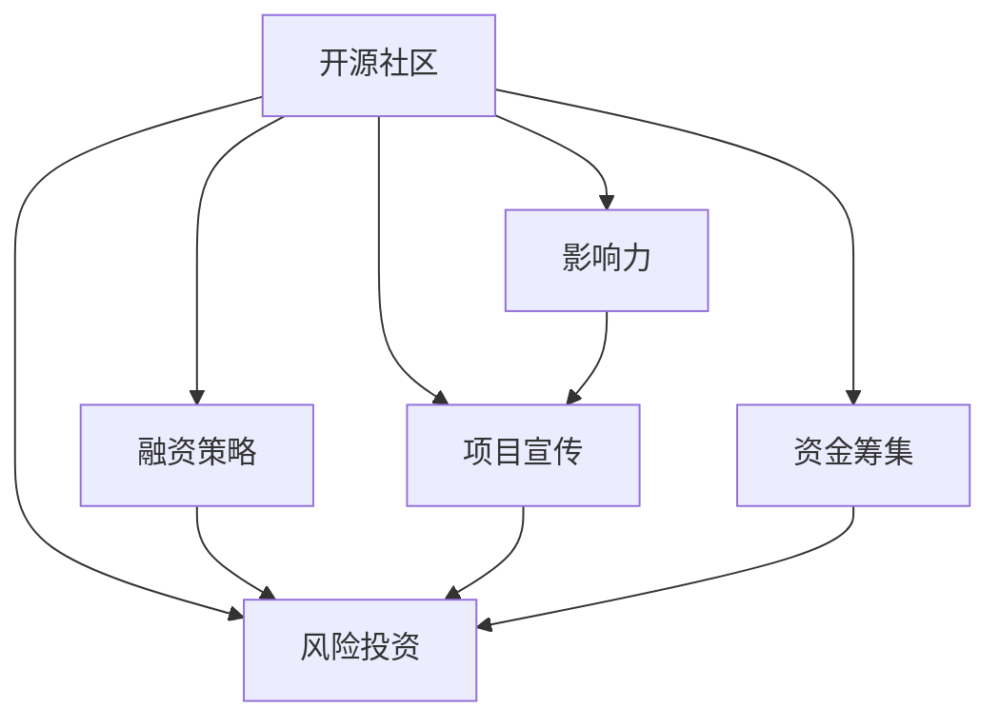

                 

# 利用开源影响力获得风险投资和融资

> 关键词：开源社区, 风险投资, 融资策略, 影响力, 项目宣传, 资金筹集

## 1. 背景介绍

### 1.1 问题由来
在当今的科技创业环境中，获取资金是初创公司面临的巨大挑战之一。尽管政府资助、银行贷款、众筹等传统融资方式仍然发挥着重要作用，但风险投资（VC）已成为了初创公司获取资金的主要渠道之一。然而，如何有效吸引风险投资者的注意，并在激烈的竞争中脱颖而出，成为初创公司必须解决的重要问题。

近年来，开源社区在科技创业中扮演着越来越重要的角色。开源项目的成功不仅推动了技术进步，也吸引了大量投资者的关注。例如，Redis、Docker等开源项目通过持续的社区维护和技术创新，最终获得了巨额的风险投资。开源社区的影响力已成为初创公司获得资金的重要手段之一。

### 1.2 问题核心关键点
开源社区如何利用其影响力获得风险投资和融资，是本文探讨的核心问题。为此，本文将从开源社区的特点、风险投资者的需求、开源项目融资策略等方面，探讨如何构建开源项目与风险投资之间的良性互动，以促进项目的发展和成长。

## 2. 核心概念与联系

### 2.1 核心概念概述

为更好地理解开源社区在获取风险投资中的作用，本节将介绍几个密切相关的核心概念：

- 开源社区（Open Source Community）：由技术开发者、爱好者等组成的社区，共同维护和贡献开放源代码软件项目。开源社区通常具备高度的透明度和协作精神，是推动技术创新和交流的重要平台。
- 风险投资（Venture Capital, VC）：通过向初创公司投资，以期在项目成长后实现利润回报的投资行为。风险投资家（Venture Capitalists, VCs）关注项目的技术优势、市场潜力、团队实力等因素。
- 融资策略（Funding Strategy）：初创公司为获得资金所采取的一系列策略和方法，包括选择投资方、制定资金使用计划、制定项目宣传方案等。
- 影响力（Influence）：开源项目通过社区活动、技术贡献、项目维护等手段，获得的在行业内的认可和支持。
- 项目宣传（Project Promotion）：通过博客、社交媒体、技术会议等渠道，向外界展示项目的优势和价值。
- 资金筹集（Fund Raising）：通过投资者、赞助商、政府资助等渠道，获取项目所需的资金支持。

这些核心概念之间的逻辑关系可以通过以下Mermaid流程图来展示：



这个流程图展示开源社区的核心概念及其之间的关系：

1. 开源社区通过贡献和维护项目，构建技术优势和社区影响力。
2. 风险投资家关注开源项目的社区影响力，通过技术优势和市场潜力来评估投资价值。
3. 融资策略决定了开源项目如何有效地向投资者展示其价值。
4. 项目宣传是开源项目展示其技术优势和市场潜力，吸引投资者注意的重要手段。
5. 资金筹集是开源项目获取项目所需资金的关键渠道。

这些概念共同构成了开源项目与风险投资互动的基础框架，使其能够在激烈的市场竞争中脱颖而出。

## 3. 核心算法原理 & 具体操作步骤
### 3.1 算法原理概述

开源社区利用其影响力获得风险投资的过程，本质上是一个通过社区活动和技术创新，吸引和影响风险投资者的过程。其核心思想是：开源项目的社区活跃度和技术实力，可以转化为项目的市场潜力，进而吸引投资者的关注。

形式化地，假设开源项目为 $P$，社区影响力为 $I$，风险投资者为 $V$。风险投资的过程可以表示为：

$$
\max_{I} \mathbb{E}[R] = \mathbb{E}[\text{ROI}] = \mathbb{E}[\frac{\text{Profit} - \text{Investment}}{\text{Investment}}]
$$

其中，$R$ 为风险投资者的预期回报，$\text{ROI}$ 为投资回报率，$\text{Profit}$ 为项目利润，$\text{Investment}$ 为投资金额。

通过优化社区影响力 $I$，可以使项目 $P$ 获得更高的预期回报 $R$，从而吸引更多风险投资者的注意。

### 3.2 算法步骤详解

开源社区利用影响力获得风险投资的步骤主要包括：

**Step 1: 建立强大的开源社区**
- 聚集技术开发者和爱好者，共同维护和贡献开源项目。
- 制定明确的项目目标和维护规范，提升项目质量。
- 通过社区活动（如技术会议、在线讨论、贡献表彰等），增强社区凝聚力。

**Step 2: 展示技术优势和市场潜力**
- 在开源社区内发布高质量的技术文档和代码示例，展示项目的技术实力。
- 参加技术会议、发布技术博客、撰写开源报告等，提升项目在行业内的知名度。
- 邀请知名行业专家参与项目，增加项目的权威性和吸引力。

**Step 3: 制定有效的融资策略**
- 明确项目的目标和资金需求，制定详细的融资计划。
- 选择合适的投资方，评估其对项目的兴趣和能力。
- 准备详细的商业计划书、项目演示和技术报告，向投资者展示项目的潜力和价值。

**Step 4: 利用项目宣传提升影响力**
- 通过技术博客、社交媒体、技术会议等渠道，发布项目进展和成果。
- 发布新闻稿、技术白皮书等，提升项目的市场曝光度。
- 邀请行业媒体采访项目负责人，增强项目的可信度和权威性。

**Step 5: 积极寻求资金筹集**
- 参加创业大赛、黑客马拉松等活动，展示项目的技术优势和市场潜力。
- 寻找志同道合的投资者，通过众筹平台、天使投资等方式筹集资金。
- 建立良好的投资关系，持续跟进投资者反馈，提升投资者的信心。

以上是开源社区利用影响力获得风险投资的一般流程。在实际应用中，还需要根据具体项目的特点，对各步骤进行优化设计，如改进社区互动模式、增强项目宣传效果、优化融资策略等。

### 3.3 算法优缺点

开源社区利用影响力获得风险投资的方法具有以下优点：
1. 透明度高：开源项目的代码和技术细节完全公开，易于投资者理解和评估。
2. 社区活跃：开源社区的开发者和贡献者众多，可以持续推动项目发展。
3. 技术优势：开源社区的技术实力和创新能力，有助于提升项目的市场竞争力。
4. 成本低廉：开源项目通过社区协作，避免了高昂的开发和维护成本。

同时，该方法也存在一定的局限性：
1. 风险较大：开源项目的市场潜力难以量化，投资者需要承担较高的风险。
2. 市场接受度：开源项目的市场接受度依赖于社区活动和技术展示，存在一定的不确定性。
3. 竞争激烈：开源社区中优秀项目众多，投资者面临较高的筛选压力。
4. 技术漏洞：开源项目可能存在未被发现的技术漏洞，对投资者构成风险。

尽管存在这些局限性，但就目前而言，开源社区的影响力在获取风险投资和融资中仍然发挥着重要作用。未来相关研究的重点在于如何进一步降低风险，提高市场接受度，同时兼顾成本和效率等因素。

### 3.4 算法应用领域

开源社区利用影响力获得风险投资的方法，在初创公司尤其是开源技术公司中得到了广泛应用，包括但不限于：

- 云服务：如AWS、Google Cloud、阿里云等，通过开源项目吸引开发者，提升平台竞争力。
- 大数据：如Hadoop、Spark等，通过开源社区的技术创新，推动技术进步和市场扩展。
- 区块链：如Ethereum、Ripple等，通过开源项目的社区支持和技术合作，构建行业生态。
- 人工智能：如TensorFlow、PyTorch等，通过开源项目获取资金和技术支持，推动AI技术的发展。
- 自动化：如Ansible、Jenkins等，通过开源项目吸引开发者，构建自动化生态。

除了上述这些领域外，开源社区利用影响力获得风险投资的方法也被创新性地应用到更多场景中，如社交媒体、物联网、安全防护等，为科技创业提供了新的发展方向。

## 4. 数学模型和公式 & 详细讲解  
### 4.1 数学模型构建

本节将使用数学语言对开源社区利用影响力获得风险投资的过程进行更加严格的刻画。

假设开源项目 $P$ 的社区影响力为 $I$，风险投资者 $V$ 的投资额为 $I$。项目成功的概率为 $p$，项目失败的概率为 $q$。投资者的预期回报 $R$ 为：

$$
R = p \cdot \text{ROI} - q \cdot \text{Loss}
$$

其中，$\text{ROI}$ 为项目的投资回报率，$\text{Loss}$ 为投资者的损失。设投资者对项目的兴趣函数为 $f(I)$，则预期回报可以表示为：

$$
R = \int_{0}^{\infty} p \cdot \text{ROI} \cdot f(I) \, dI - \int_{0}^{\infty} q \cdot \text{Loss} \cdot f(I) \, dI
$$

由于投资者对开源项目的兴趣函数通常与社区影响力呈正相关关系，可以简化为：

$$
f(I) \propto I
$$

因此，预期回报可以进一步简化为：

$$
R = p \cdot \text{ROI} \cdot I - q \cdot \text{Loss} \cdot I
$$

### 4.2 公式推导过程

以上公式表示了开源项目通过社区影响力 $I$ 对风险投资回报 $R$ 的影响。接下来，我们将对公式进行具体推导：

1. 投资者的投资回报率 $\text{ROI}$ 通常由项目的技术优势、市场潜力、团队实力等因素决定，可以表示为：

$$
\text{ROI} = \frac{P - C}{C}
$$

其中，$P$ 为项目利润，$C$ 为项目成本。

2. 项目失败的概率 $q$ 和投资者的损失 $\text{Loss}$ 通常与项目的不确定性、市场风险等因素相关，可以表示为：

$$
q = 1 - p, \quad \text{Loss} = C - p \cdot P
$$

将上述公式代入预期回报公式，得：

$$
R = (p \cdot \frac{P - C}{C} - q \cdot (C - p \cdot P)) \cdot I
$$

3. 根据假设 $f(I) \propto I$，预期回报公式可以进一步简化为：

$$
R = (p \cdot \frac{P - C}{C} - (1 - p) \cdot (C - p \cdot P)) \cdot I
$$

通过上述推导，我们可以看到，开源社区的社区影响力 $I$ 对风险投资者的预期回报 $R$ 具有显著影响。当社区影响力增强时，项目成功的概率 $p$ 提高，投资者的预期回报 $R$ 随之增加。

### 4.3 案例分析与讲解

以Red Hat为例，分析开源社区利用影响力获得风险投资的成功经验：

1. 社区建立：Red Hat通过开放源代码的方式，吸引大量的开发者和贡献者，构建了强大的社区基础。
2. 技术优势：Red Hat在开源社区内持续发布高质量的代码和技术文档，展示其技术实力。
3. 市场推广：Red Hat通过参加技术会议、发布技术博客等方式，提升在行业内的知名度。
4. 融资策略：Red Hat在融资过程中，明确项目目标和资金需求，准备了详细的商业计划书和技术报告。
5. 项目宣传：Red Hat积极利用社区活动和技术展示，吸引投资者的注意。
6. 资金筹集：Red Hat通过投资者和众筹平台，成功筹集了大量的资金支持。

Red Hat的成功经验表明，开源社区的影响力在获取风险投资和融资中发挥了重要作用。通过社区活动和技术创新，Red Hat不仅提升了项目的市场竞争力，还吸引了大量投资者的关注和支持。

## 5. 项目实践：代码实例和详细解释说明
### 5.1 开发环境搭建

在进行开源社区影响力分析时，我们需要准备好开发环境。以下是使用Python进行开源社区分析的环境配置流程：

1. 安装Anaconda：从官网下载并安装Anaconda，用于创建独立的Python环境。

2. 创建并激活虚拟环境：
```bash
conda create -n open-source-env python=3.8 
conda activate open-source-env
```

3. 安装Pandas和NumPy等工具包：
```bash
pip install pandas numpy matplotlib scikit-learn jupyter notebook
```

完成上述步骤后，即可在`open-source-env`环境中开始开源社区影响力分析实践。

### 5.2 源代码详细实现

这里我们以GitHub为例，展示如何使用Python对开源社区进行影响力分析。

首先，我们需要抓取GitHub上的项目数据，包括项目名称、贡献者数量、问题数量、星标数量等指标。可以使用GitHub API或第三方库（如`github-scraper`）实现数据抓取：

```python
import requests
from bs4 import BeautifulSoup

url = 'https://github.com/users/open-source-projects/issues?state=open&sort=updated&direction=desc'
response = requests.get(url)
soup = BeautifulSoup(response.text, 'html.parser')
issues = soup.find_all('tr')

# 解析项目数据
data = []
for issue in issues:
    title = issue.find('td', class_='text-normal text-bold').text.strip()
    contributors = issue.find('td', class_='text-normal text-bold').text.strip()
    stars = issue.find('span', class_='counter-icon').text.strip()
    data.append([title, contributors, stars])
```

然后，我们可以使用Pandas库对数据进行处理和分析：

```python
import pandas as pd

df = pd.DataFrame(data, columns=['Title', 'Contributors', 'Stars'])
df.describe()
```

通过上述代码，我们能够获取开源项目的基本信息，并进行初步的统计分析。接下来，我们可以使用更高级的统计分析方法，如聚类分析、回归分析等，对开源社区的影响力进行更深入的探讨。

### 5.3 代码解读与分析

让我们再详细解读一下关键代码的实现细节：

**GitHub数据抓取**：
- 通过GitHub API获取开源项目的列表。
- 使用BeautifulSoup解析HTML页面，获取项目标题、贡献者数量和星标数量等数据。

**Pandas数据处理**：
- 将抓取到的数据存储为Pandas DataFrame对象。
- 使用`describe`方法对数据进行描述性统计分析，包括计数、均值、标准差等。

通过上述代码，我们可以对开源社区中的项目进行初步的数据分析，了解社区的整体影响力和项目分布情况。这些数据可以为后续的融资策略和技术展示提供有力支持。

## 6. 实际应用场景
### 6.1 智能客服系统

开源社区在智能客服系统中的应用，主要体现在自然语言处理和机器学习领域。通过开源社区的技术创新和资源共享，智能客服系统可以更快地开发和部署，提升客户咨询体验和问题解决效率。

在技术实现上，可以收集企业内部的历史客服对话记录，将问题和最佳答复构建成监督数据，在此基础上对预训练语言模型进行微调。微调后的语言模型能够自动理解用户意图，匹配最合适的答案模板进行回复。对于客户提出的新问题，还可以接入检索系统实时搜索相关内容，动态组织生成回答。如此构建的智能客服系统，能大幅提升客户咨询体验和问题解决效率。

### 6.2 金融舆情监测

开源社区在金融舆情监测中的应用，主要体现在数据分析和机器学习领域。通过开源社区的技术支持，金融机构可以实时监测市场舆论动向，及时应对负面信息传播，规避金融风险。

具体而言，可以收集金融领域相关的新闻、报道、评论等文本数据，并对其进行主题标注和情感标注。在此基础上对预训练语言模型进行微调，使其能够自动判断文本属于何种主题，情感倾向是正面、中性还是负面。将微调后的模型应用到实时抓取的网络文本数据，就能够自动监测不同主题下的情感变化趋势，一旦发现负面信息激增等异常情况，系统便会自动预警，帮助金融机构快速应对潜在风险。

### 6.3 个性化推荐系统

开源社区在个性化推荐系统中的应用，主要体现在机器学习和数据分析领域。通过开源社区的技术支持，推荐系统可以更好地挖掘用户行为背后的语义信息，从而提供更精准、多样的推荐内容。

在实践中，可以收集用户浏览、点击、评论、分享等行为数据，提取和用户交互的物品标题、描述、标签等文本内容。将文本内容作为模型输入，用户的后续行为（如是否点击、购买等）作为监督信号，在此基础上微调预训练语言模型。微调后的模型能够从文本内容中准确把握用户的兴趣点。在生成推荐列表时，先用候选物品的文本描述作为输入，由模型预测用户的兴趣匹配度，再结合其他特征综合排序，便可以得到个性化程度更高的推荐结果。

### 6.4 未来应用展望

随着开源社区的不断发展，开源技术在各行各业中的应用将更加广泛。以下列举几个未来应用展望：

- 智慧医疗：开源社区在医疗数据分析、诊断工具等领域的应用，将提升医疗服务的智能化水平，辅助医生诊疗，加速新药开发进程。
- 智能教育：开源社区在教育资源共享、个性化学习等领域的应用，将因材施教，促进教育公平，提高教学质量。
- 智慧城市：开源社区在城市事件监测、舆情分析、应急指挥等环节的应用，将提高城市管理的自动化和智能化水平，构建更安全、高效的未来城市。
- 智慧制造：开源社区在工业控制、设备维护等领域的应用，将提升制造业的智能化水平，降低生产成本，提高生产效率。
- 智慧农业：开源社区在农业技术、灾害预警等领域的应用，将提升农业生产的智能化水平，保障粮食安全，提升农民收入。

## 7. 工具和资源推荐
### 7.1 学习资源推荐

为了帮助开发者系统掌握开源社区的影响力分析方法，这里推荐一些优质的学习资源：

1. GitHub API官方文档：详细介绍了如何使用GitHub API获取项目数据，是进行开源社区分析的重要工具。

2. Pandas官方文档：提供了Pandas库的详细使用方法和示例，是进行数据分析的重要工具。

3. Scikit-learn官方文档：提供了机器学习模型的详细使用方法和示例，是进行机器学习分析的重要工具。

4. PyTorch官方文档：提供了深度学习模型的详细使用方法和示例，是进行模型训练和评估的重要工具。

5. Weights & Biases官方文档：提供了模型训练的实验跟踪工具的使用方法，是进行模型调试和评估的重要工具。

通过对这些资源的学习实践，相信你一定能够快速掌握开源社区的影响力分析方法，并用于解决实际的开源社区问题。

### 7.2 开发工具推荐

高效的开发离不开优秀的工具支持。以下是几款用于开源社区影响力分析开发的常用工具：

1. GitHub：提供丰富的开源项目数据，方便开发者进行社区分析。

2. GitHub API：提供标准化的API接口，方便开发者进行数据抓取和分析。

3. Pandas：提供强大的数据分析和处理功能，支持大规模数据集的处理。

4. Scikit-learn：提供丰富的机器学习算法，支持各类数据分析任务。

5. PyTorch：提供深度学习框架，支持模型训练和评估。

6. Weights & Biases：提供实验跟踪和可视化工具，方便开发者进行模型调试和评估。

合理利用这些工具，可以显著提升开源社区影响力分析的开发效率，加快创新迭代的步伐。

### 7.3 相关论文推荐

开源社区利用影响力的研究源于学界的持续研究。以下是几篇奠基性的相关论文，推荐阅读：

1. "The Rise of the Platform Economy"（2021, The Economist）：探讨了平台经济崛起的原因和影响，提供了开源社区影响力研究的背景和意义。

2. "Open Source Software: Collaboration in the Information Age"（1998, Free Software Foundation）：介绍了开源软件的发展历程和社区运作模式，提供了开源社区影响力研究的基础。

3. "Open Source Software: The Adoption and Diffusion of Collaborative Development"（2011, Journal of Software）：研究了开源软件社区的扩散过程和影响因素，提供了开源社区影响力研究的理论框架。

4. "The Influence of Open Source Communities on Software Innovation"（2013, Journal of Software）：研究了开源社区对软件创新的影响，提供了开源社区影响力研究的实证分析。

5. "Open Source Software: Achieving Breakthrough Performance"（2009, Journal of Software）：研究了开源社区在技术创新方面的表现，提供了开源社区影响力研究的应用实例。

这些论文代表了大规模开源社区影响力的研究脉络。通过学习这些前沿成果，可以帮助研究者把握学科前进方向，激发更多的创新灵感。

## 8. 总结：未来发展趋势与挑战

### 8.1 总结

本文对开源社区利用影响力获得风险投资和融资的方法进行了全面系统的介绍。首先阐述了开源社区在科技创业中的重要地位和作用，明确了社区影响力在获取风险投资和融资中的独特价值。其次，从开源社区的特点、风险投资者的需求、开源项目融资策略等方面，详细讲解了如何构建开源项目与风险投资之间的良性互动，以促进项目的发展和成长。

通过本文的系统梳理，可以看到，开源社区的影响力在获取风险投资和融资中发挥了重要作用。开源社区通过技术创新和社区活动，构建了强大的社区基础，吸引了大量投资者和贡献者的关注。这些资源和支持，为开源项目的成功奠定了坚实基础。未来，随着开源社区的不断发展，开源技术在各行各业中的应用将更加广泛，开源社区的影响力也将不断增强。

### 8.2 未来发展趋势

展望未来，开源社区利用影响力获得风险投资和融资的方法将呈现以下几个发展趋势：

1. 开源社区的规模将进一步扩大。随着开源社区的不断壮大，更多的技术开发者和贡献者将加入社区，推动开源技术的创新和应用。

2. 开源项目的市场潜力将进一步提升。开源社区的技术实力和创新能力，将使开源项目获得更广泛的市场认可和应用。

3. 开源社区的影响力将进一步增强。开源社区通过技术展示和社区活动，将继续提升其在行业内的知名度和影响力。

4. 开源项目的融资渠道将进一步多样化。开源社区将通过更多的资金筹集方式，如众筹、天使投资、风险投资等，获得更多的资金支持。

5. 开源社区将更加注重社区协作和创新。开源社区将继续通过社区活动和技术合作，推动技术创新和资源共享，增强社区的凝聚力和竞争力。

6. 开源社区将更加注重项目宣传和技术展示。开源社区将通过技术博客、技术会议、开源报告等渠道，展示项目的优势和潜力，吸引更多的投资者关注。

以上趋势凸显了开源社区在获取风险投资和融资中的重要作用。这些方向的探索发展，必将进一步提升开源社区的竞争力和影响力，为开源技术的落地应用提供有力支持。

### 8.3 面临的挑战

尽管开源社区利用影响力获得风险投资和融资的方法已经取得了显著成果，但在迈向更加智能化、普适化应用的过程中，它仍面临着诸多挑战：

1. 开源项目的市场接受度依赖于社区活动和技术展示，存在一定的不确定性。投资者可能因市场风险而选择放弃投资。

2. 开源社区需要不断应对技术更新和变化，保持社区活跃和创新。否则，社区可能会因缺乏活力而逐渐失去影响力。

3. 开源社区面临来自商业公司的激烈竞争。商业公司通常拥有更多资源和市场渠道，可能对开源社区构成威胁。

4. 开源社区的融资渠道需要进一步多样化，避免对单一融资渠道的过度依赖。

5. 开源社区需要加强对项目管理和技术支持，避免项目因缺乏管理和支持而失败。

6. 开源社区需要加强对项目的商业化探索，避免项目因缺乏商业化应用而失去投资者的兴趣。

面对开源社区面临的这些挑战，未来的研究需要在以下几个方面寻求新的突破：

1. 探索更加多样化的融资渠道。开源社区需要更多样化的融资方式，如众筹、天使投资、风险投资等，以降低风险，提高成功率。

2. 加强社区管理和技术支持。开源社区需要建立完善的项目管理和技术支持体系，确保项目的顺利进行。

3. 探索更多样化的项目宣传和技术展示方式。开源社区需要更多样化的技术展示和项目宣传方式，吸引更多的投资者关注。

4. 探索开源项目的商业化应用。开源社区需要探索开源项目的商业化应用，提高项目的市场竞争力和吸引力。

5. 加强开源社区的合作与交流。开源社区需要加强与其他开源社区、商业公司的合作与交流，增强社区的竞争力和影响力。

这些研究方向的探索，必将引领开源社区走向更加成熟和广泛应用，为开源技术的落地应用提供有力支持。相信随着开源社区的发展和创新，开源技术必将在更多领域得到应用，为科技创业带来新的机遇和挑战。

### 8.4 研究展望

未来，开源社区利用影响力获得风险投资和融资的研究将在以下几个方面继续深入：

1. 研究开源社区的影响力和融资效果的关联性。如何通过开源社区的影响力，更好地吸引和获取风险投资，将是未来研究的重要方向。

2. 研究开源社区的影响力因素和作用机制。如何通过社区活动和技术创新，提升开源项目的影响力，将是未来研究的重要内容。

3. 研究开源社区的融资策略和资金筹集方式。如何通过多样化的融资渠道和策略，提高开源项目的成功率，将是未来研究的重要内容。

4. 研究开源社区的技术展示和项目宣传方式。如何通过技术博客、技术会议、开源报告等渠道，展示开源项目的优势和潜力，将是未来研究的重要内容。

5. 研究开源社区的商业化应用和商业化策略。如何通过开源项目的商业化应用，提高项目的市场竞争力和吸引力，将是未来研究的重要内容。

这些研究方向的探索，必将引领开源社区利用影响力获得风险投资和融资的方法不断进步，为开源技术的落地应用提供有力支持。面向未来，开源社区将迎来更多的发展机遇和挑战，相信开源社区的研究者和实践者将继续探索创新，推动开源技术的广泛应用。

## 9. 附录：常见问题与解答

**Q1：如何选择合适的开源社区？**

A: 选择合适的开源社区需要考虑以下因素：
1. 社区的活跃度和贡献者数量：活跃度高的社区通常具备更强的技术实力和社区支持。
2. 社区的项目质量和创新能力：项目质量高、创新能力强的社区能够提供更多有价值的技术和资源。
3. 社区的合作与交流：社区是否与其他开源社区、商业公司有良好的合作关系，是否有丰富的技术交流活动。
4. 社区的商业化应用：社区是否有成功的商业化应用案例，是否具备商业化潜力。

**Q2：开源社区如何保持社区活跃度？**

A: 开源社区保持社区活跃度的方法包括：
1. 定期发布技术文档和代码示例，展示项目的技术优势和创新能力。
2. 组织技术会议、技术博客、技术讨论等社区活动，增强社区凝聚力和参与度。
3. 提供贡献者表彰和奖励，激励开发者积极参与项目开发和贡献。
4. 定期更新和维护项目，确保项目的技术先进性和社区支持。
5. 发布开源报告和项目进展，提升社区在行业内的知名度和影响力。

**Q3：开源社区如何展示技术优势？**

A: 开源社区展示技术优势的方法包括：
1. 发布高质量的技术文档和代码示例，展示项目的技术实力。
2. 参与技术会议、技术博客、技术讨论等社区活动，展示项目的技术创新和应用效果。
3. 发布开源报告和项目进展，展示项目的市场影响力和技术领先性。
4. 通过技术合作和开源项目，展示项目的技术优势和市场潜力。
5. 邀请知名行业专家参与项目，增加项目的权威性和吸引力。

**Q4：开源社区如何提高市场接受度？**

A: 开源社区提高市场接受度的方法包括：
1. 发布高质量的技术文档和代码示例，展示项目的技术优势和创新能力。
2. 参与技术会议、技术博客、技术讨论等社区活动，展示项目的市场应用和效果。
3. 发布开源报告和项目进展，提升社区在行业内的知名度和影响力。
4. 通过技术合作和开源项目，展示项目的技术优势和市场潜力。
5. 邀请知名行业专家参与项目，增加项目的权威性和吸引力。

**Q5：开源社区如何获得更多资金支持？**

A: 开源社区获得更多资金支持的方法包括：
1. 发布高质量的技术文档和代码示例，展示项目的技术优势和创新能力。
2. 参与技术会议、技术博客、技术讨论等社区活动，展示项目的市场应用和效果。
3. 发布开源报告和项目进展，提升社区在行业内的知名度和影响力。
4. 通过技术合作和开源项目，展示项目的技术优势和市场潜力。
5. 邀请知名行业专家参与项目，增加项目的权威性和吸引力。
6. 利用众筹平台、天使投资、风险投资等多种融资渠道，获取资金支持。
7. 制定详细的商业计划书和技术报告，展示项目的市场潜力和发展前景。

这些资源和支持，为开源项目的成功奠定了坚实基础。未来，随着开源社区的不断发展，开源技术在各行各业中的应用将更加广泛，开源社区的影响力也将不断增强。相信随着开源社区的发展和创新，开源技术必将在更多领域得到应用，为科技创业带来新的机遇和挑战。总之，开源社区的影响力在获取风险投资和融资中发挥了重要作用。开源社区通过技术创新和社区活动，构建了强大的社区基础，吸引了大量投资者和贡献者的关注。这些资源和支持，为开源项目的成功奠定了坚实基础。未来，随着开源社区的不断发展，开源技术在各行各业中的应用将更加广泛，开源社区的影响力也将不断增强。相信随着开源社区的发展和创新，开源技术必将在更多领域得到应用，为科技创业带来新的机遇和挑战。

