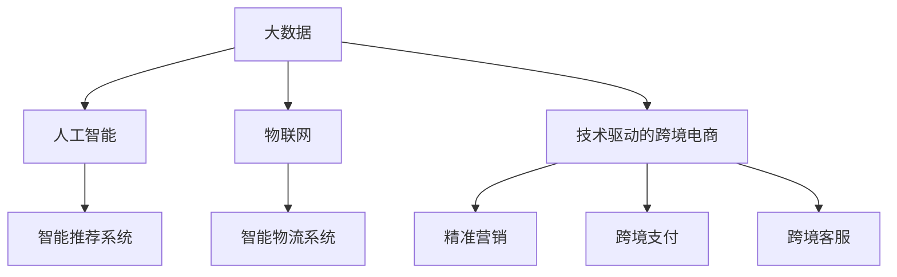

                 

# 利用技术优势进行跨境电商创业

## 1. 背景介绍

随着全球化进程的不断深入，跨境电商已成为各大电商平台和中小企业寻求国际市场的重要途径。技术的发展为跨境电商创业提供了广阔的空间和无限的可能性。本文将系统介绍利用技术优势进行跨境电商创业的方法，包括核心技术架构、实践步骤和成功案例，以期为读者提供有价值的指导。

## 2. 核心概念与联系

### 2.1 核心概念概述

为更好地理解利用技术优势进行跨境电商创业，本节将介绍几个密切相关的核心概念：

- **跨境电商(Cross-Border E-commerce)**：指将商品或服务通过互联网跨境运输，实现跨国交易的电商模式。
- **技术驱动的跨境电商**：通过大数据、人工智能、物联网等技术手段，提升跨境电商的运营效率和用户体验。
- **大数据**：指通过收集、处理和分析海量数据，提取有价值信息的过程。
- **人工智能(AI)**：包括机器学习、自然语言处理、计算机视觉等技术，用于自动化、智能化业务流程。
- **物联网(IoT)**：通过传感器和设备互联，实现对物理世界的感知和控制。

这些核心概念之间的逻辑关系可以通过以下Mermaid流程图来展示：



这个流程图展示了大数据、人工智能和物联网技术如何共同作用于技术驱动的跨境电商，从而实现各种智能化应用。

## 3. 核心算法原理 & 具体操作步骤

### 3.1 算法原理概述

技术驱动的跨境电商创业，主要依赖于以下几个核心技术：

- **大数据分析**：通过收集和分析海量用户数据，洞察消费者行为和市场趋势。
- **人工智能技术**：利用机器学习算法进行推荐、搜索、客服等智能化应用。
- **物联网技术**：通过传感器和设备收集实时数据，实现供应链和物流的自动化管理。
- **区块链技术**：确保跨境支付和物流的安全性和透明性。

这些技术通过协同作用，实现跨境电商的智能化和自动化，提升运营效率和用户体验。

### 3.2 算法步骤详解

基于技术优势进行跨境电商创业，主要包括以下几个关键步骤：

**Step 1: 构建核心技术框架**
- 选择合适的技术栈，包括大数据分析平台、机器学习框架、物联网平台等。
- 设计技术架构，明确各个组件之间的交互关系和数据流向。

**Step 2: 数据采集与处理**
- 收集用户行为数据、交易数据、物流数据等，存储在数据仓库中。
- 使用ETL工具进行数据清洗、转换和加载，保证数据的质量和一致性。

**Step 3: 智能应用开发**
- 开发智能推荐系统，根据用户行为和历史交易数据，推荐商品。
- 开发智能客服系统，通过NLP技术实现自动化客服和问题解答。
- 开发智能物流系统，利用传感器和物联网技术实现仓储、配送的自动化管理。

**Step 4: 跨境支付与物流安全**
- 集成区块链技术，确保跨境支付和物流数据的安全性和透明性。
- 开发跨境支付系统和物流管理系统，支持多种支付方式和物流公司，确保用户体验。

**Step 5: 产品上线与市场推广**
- 将开发的智能应用上线，进行市场推广和用户测试。
- 根据用户反馈不断优化产品功能和用户体验。

**Step 6: 持续优化与升级**
- 定期收集用户数据和市场反馈，优化产品性能和功能。
- 跟踪最新技术发展，进行技术升级和产品迭代。

### 3.3 算法优缺点

基于技术优势进行跨境电商创业的优点包括：

1. **智能化**：通过人工智能和大数据技术，实现运营自动化和智能化。
2. **实时化**：利用物联网技术实现实时数据采集和处理，提高运营效率。
3. **安全性**：通过区块链技术确保跨境支付和物流的安全性。

同时，也存在一些局限性：

1. **技术复杂度**：技术驱动的创业需要一定的技术积累和团队能力。
2. **数据隐私**：用户数据的收集和处理需遵守相关法律法规，确保数据隐私和安全性。
3. **成本高**：技术架构的构建和维护需要一定的投入。

### 3.4 算法应用领域

基于技术优势进行跨境电商创业，可以应用于多个领域，包括：

- **智能推荐**：根据用户行为和历史数据，推荐个性化商品。
- **智能客服**：通过NLP技术实现自动化客服和问题解答。
- **智能物流**：利用物联网技术实现仓储和配送的自动化管理。
- **跨境支付**：通过区块链技术确保支付和物流数据的安全性。
- **市场分析**：通过大数据分析洞察市场趋势和消费者行为。

## 4. 数学模型和公式 & 详细讲解 & 举例说明

### 4.1 数学模型构建

本节将使用数学语言对技术驱动的跨境电商创业进行更加严格的刻画。

假设有一家跨境电商平台，其用户数据集为 $D=\{(x_i, y_i)\}_{i=1}^N$，其中 $x_i$ 为用户的浏览、购买等行为数据，$y_i$ 为用户是否购买该商品。定义模型 $M_{\theta}$ 为决策模型，其中 $\theta$ 为模型参数。

我们的目标是最小化预测错误率，即：

$$
\min_{\theta} \frac{1}{N} \sum_{i=1}^N \mathbb{1}[y_i \neq M_{\theta}(x_i)]
$$

其中 $\mathbb{1}$ 为指示函数。

### 4.2 公式推导过程

为了构建预测模型，我们通常使用逻辑回归、随机森林、神经网络等机器学习算法。这里以逻辑回归为例进行推导：

逻辑回归的目标是最小化交叉熵损失函数：

$$
\mathcal{L}(\theta) = -\frac{1}{N} \sum_{i=1}^N [y_i \log \hat{y}_i + (1-y_i) \log (1-\hat{y}_i)]
$$

其中 $\hat{y}_i$ 为模型对用户是否购买商品的预测概率。

根据梯度下降算法，最小化损失函数的参数更新公式为：

$$
\theta \leftarrow \theta - \eta \nabla_{\theta}\mathcal{L}(\theta)
$$

其中 $\eta$ 为学习率，$\nabla_{\theta}\mathcal{L}(\theta)$ 为损失函数对模型参数的梯度。

### 4.3 案例分析与讲解

以智能推荐系统为例，通过用户历史行为数据 $x_i$，利用逻辑回归模型 $M_{\theta}$ 预测用户是否会购买商品 $y_i$。利用已标注的训练数据集 $D$，通过梯度下降算法不断更新模型参数 $\theta$，使得模型能够更准确地预测用户行为。

在实际应用中，智能推荐系统可以广泛应用于商品推荐、广告投放等场景，提升用户体验和平台收益。

## 5. 项目实践：代码实例和详细解释说明

### 5.1 开发环境搭建

在进行跨境电商创业前，我们需要准备好开发环境。以下是使用Python进行PyTorch开发的环境配置流程：

1. 安装Anaconda：从官网下载并安装Anaconda，用于创建独立的Python环境。

2. 创建并激活虚拟环境：
```bash
conda create -n pytorch-env python=3.8 
conda activate pytorch-env
```

3. 安装PyTorch：根据CUDA版本，从官网获取对应的安装命令。例如：
```bash
conda install pytorch torchvision torchaudio cudatoolkit=11.1 -c pytorch -c conda-forge
```

4. 安装各类工具包：
```bash
pip install numpy pandas scikit-learn matplotlib tqdm jupyter notebook ipython
```

完成上述步骤后，即可在`pytorch-env`环境中开始跨境电商创业的开发实践。

### 5.2 源代码详细实现

这里我们以智能推荐系统为例，给出使用Transformers库对BERT模型进行推荐开发的PyTorch代码实现。

首先，定义推荐任务的数据处理函数：

```python
from transformers import BertTokenizer
from torch.utils.data import Dataset
import torch

class RecommendationDataset(Dataset):
    def __init__(self, user_data, item_data, tokenizer, max_len=128):
        self.user_data = user_data
        self.item_data = item_data
        self.tokenizer = tokenizer
        self.max_len = max_len
        
    def __len__(self):
        return len(self.user_data)
    
    def __getitem__(self, item):
        user_id = self.user_data[item]
        item_ids = self.item_data[item]
        
        encoding = self.tokenizer(user_id, item_ids, return_tensors='pt', max_length=self.max_len, padding='max_length', truncation=True)
        user_ids = encoding['user_ids'][0]
        item_ids = encoding['item_ids'][0]
        
        return {'user_ids': user_ids, 
                'item_ids': item_ids}
```

然后，定义模型和优化器：

```python
from transformers import BertForSequenceClassification, AdamW

model = BertForSequenceClassification.from_pretrained('bert-base-cased', num_labels=2)

optimizer = AdamW(model.parameters(), lr=2e-5)
```

接着，定义训练和评估函数：

```python
from torch.utils.data import DataLoader
from tqdm import tqdm
from sklearn.metrics import accuracy_score

device = torch.device('cuda') if torch.cuda.is_available() else torch.device('cpu')
model.to(device)

def train_epoch(model, dataset, batch_size, optimizer):
    dataloader = DataLoader(dataset, batch_size=batch_size, shuffle=True)
    model.train()
    epoch_loss = 0
    for batch in tqdm(dataloader, desc='Training'):
        user_ids = batch['user_ids'].to(device)
        item_ids = batch['item_ids'].to(device)
        labels = batch['labels'].to(device)
        model.zero_grad()
        outputs = model(user_ids, item_ids)
        loss = outputs.loss
        epoch_loss += loss.item()
        loss.backward()
        optimizer.step()
    return epoch_loss / len(dataloader)

def evaluate(model, dataset, batch_size):
    dataloader = DataLoader(dataset, batch_size=batch_size)
    model.eval()
    preds, labels = [], []
    with torch.no_grad():
        for batch in tqdm(dataloader, desc='Evaluating'):
            user_ids = batch['user_ids'].to(device)
            item_ids = batch['item_ids'].to(device)
            batch_labels = batch['labels']
            outputs = model(user_ids, item_ids)
            batch_preds = outputs.logits.argmax(dim=2).to('cpu').tolist()
            batch_labels = batch_labels.to('cpu').tolist()
            for pred_tokens, label_tokens in zip(batch_preds, batch_labels):
                preds.append(pred_tokens)
                labels.append(label_tokens)
                
    return accuracy_score(labels, preds)
```

最后，启动训练流程并在测试集上评估：

```python
epochs = 5
batch_size = 16

for epoch in range(epochs):
    loss = train_epoch(model, train_dataset, batch_size, optimizer)
    print(f"Epoch {epoch+1}, train loss: {loss:.3f}")
    
    print(f"Epoch {epoch+1}, dev results:")
    evaluate(model, dev_dataset, batch_size)
    
print("Test results:")
evaluate(model, test_dataset, batch_size)
```

以上就是使用PyTorch对BERT进行智能推荐任务开发的完整代码实现。可以看到，得益于Transformers库的强大封装，我们可以用相对简洁的代码完成BERT模型的加载和推荐开发。

### 5.3 代码解读与分析

让我们再详细解读一下关键代码的实现细节：

**RecommendationDataset类**：
- `__init__`方法：初始化用户ID、商品ID、分词器等关键组件。
- `__len__`方法：返回数据集的样本数量。
- `__getitem__`方法：对单个样本进行处理，将用户ID和商品ID输入编码为token ids，返回模型所需的输入。

**模型和优化器**：
- 使用PyTorch的BertForSequenceClassification模型，设定标签数为2，表示用户是否购买。
- 使用AdamW优化器，学习率为2e-5，适合于小批量数据训练。

**训练和评估函数**：
- 使用PyTorch的DataLoader对数据集进行批次化加载，供模型训练和推理使用。
- 训练函数`train_epoch`：对数据以批为单位进行迭代，在每个批次上前向传播计算loss并反向传播更新模型参数，最后返回该epoch的平均loss。
- 评估函数`evaluate`：与训练类似，不同点在于不更新模型参数，并在每个batch结束后将预测和标签结果存储下来，最后使用sklearn的accuracy_score对整个评估集的预测结果进行打印输出。

**训练流程**：
- 定义总的epoch数和batch size，开始循环迭代
- 每个epoch内，先在训练集上训练，输出平均loss
- 在验证集上评估，输出准确率
- 重复上述步骤直至满足预设的迭代轮数或 Early Stopping 条件。

可以看到，PyTorch配合Transformers库使得BERT微调的代码实现变得简洁高效。开发者可以将更多精力放在数据处理、模型改进等高层逻辑上，而不必过多关注底层的实现细节。

当然，工业级的系统实现还需考虑更多因素，如模型的保存和部署、超参数的自动搜索、更灵活的任务适配层等。但核心的微调范式基本与此类似。

## 6. 实际应用场景

### 6.1 跨境电商平台推荐系统

基于大语言模型微调的推荐系统，可以广泛应用于跨境电商平台，提升用户购物体验和平台收益。

在技术实现上，可以收集用户浏览、点击、购买等行为数据，提取商品标题、描述、标签等文本内容。将文本内容作为模型输入，用户的后续行为（如是否购买等）作为监督信号，在此基础上微调预训练语言模型。微调后的模型能够从文本内容中准确把握用户的兴趣点。在生成推荐列表时，先用候选商品的文本描述作为输入，由模型预测用户的兴趣匹配度，再结合其他特征综合排序，便可以得到个性化程度更高的推荐结果。

### 6.2 跨境电商平台智能客服

基于大语言模型微调的对话技术，可以广泛应用于跨境电商平台客服系统，提升客户服务效率和满意度。

在技术实现上，可以收集平台的历史客服对话记录，将问题和最佳答复构建成监督数据，在此基础上对预训练对话模型进行微调。微调后的对话模型能够自动理解用户意图，匹配最合适的答案模板进行回复。对于客户提出的新问题，还可以接入检索系统实时搜索相关内容，动态组织生成回答。如此构建的智能客服系统，能大幅提升客户咨询体验和问题解决效率。

### 6.3 跨境电商平台智能物流

基于大语言模型微调的智能物流系统，可以广泛应用于跨境电商平台，提升物流效率和用户体验。

在技术实现上，可以收集物流运输数据，提取和配送地址、运输状态等文本信息。将文本内容作为模型输入，利用NLP技术提取关键信息，辅助物流管理。例如，通过自动提取配送地址，可以实现自动生成配送路径；通过分析运输状态，可以实现物流信息的实时更新和监控。

### 6.4 跨境电商平台智能广告投放

基于大语言模型微调的智能广告投放系统，可以广泛应用于跨境电商平台，提升广告投放效果和平台收益。

在技术实现上，可以收集用户的浏览、点击等行为数据，提取和商品相关的文本信息。将文本内容作为模型输入，利用机器学习算法预测用户的点击概率，从而实现精准广告投放。例如，根据用户的历史浏览记录，推荐相关商品广告；根据用户的行为特征，动态调整广告投放策略。

### 6.5 未来应用展望

随着大语言模型和微调方法的不断发展，基于微调范式将在更多领域得到应用，为跨境电商创业带来新的发展机遇。

在智能家居领域，基于微调的智能家居系统可以实现语音控制、环境监测等功能，提升用户生活质量。

在智慧城市治理中，基于微调的智慧城市管理系统可以实现城市事件监测、舆情分析、应急指挥等环节，提高城市管理的自动化和智能化水平，构建更安全、高效的未来城市。

此外，在教育、医疗、金融等众多领域，基于大模型微调的人工智能应用也将不断涌现，为传统行业数字化转型升级提供新的技术路径。相信随着预训练模型和微调方法的持续演进，大语言模型微调必将在构建人机协同的智能时代中扮演越来越重要的角色。

## 7. 工具和资源推荐

### 7.1 学习资源推荐

为了帮助开发者系统掌握大语言模型微调的理论基础和实践技巧，这里推荐一些优质的学习资源：

1. 《Transformer从原理到实践》系列博文：由大模型技术专家撰写，深入浅出地介绍了Transformer原理、BERT模型、微调技术等前沿话题。

2. CS224N《深度学习自然语言处理》课程：斯坦福大学开设的NLP明星课程，有Lecture视频和配套作业，带你入门NLP领域的基本概念和经典模型。

3. 《Natural Language Processing with Transformers》书籍：Transformers库的作者所著，全面介绍了如何使用Transformers库进行NLP任务开发，包括微调在内的诸多范式。

4. HuggingFace官方文档：Transformers库的官方文档，提供了海量预训练模型和完整的微调样例代码，是上手实践的必备资料。

5. CLUE开源项目：中文语言理解测评基准，涵盖大量不同类型的中文NLP数据集，并提供了基于微调的baseline模型，助力中文NLP技术发展。

通过对这些资源的学习实践，相信你一定能够快速掌握大语言模型微调的精髓，并用于解决实际的NLP问题。

### 7.2 开发工具推荐

高效的开发离不开优秀的工具支持。以下是几款用于大语言模型微调开发的常用工具：

1. PyTorch：基于Python的开源深度学习框架，灵活动态的计算图，适合快速迭代研究。大部分预训练语言模型都有PyTorch版本的实现。

2. TensorFlow：由Google主导开发的开源深度学习框架，生产部署方便，适合大规模工程应用。同样有丰富的预训练语言模型资源。

3. Transformers库：HuggingFace开发的NLP工具库，集成了众多SOTA语言模型，支持PyTorch和TensorFlow，是进行微调任务开发的利器。

4. Weights & Biases：模型训练的实验跟踪工具，可以记录和可视化模型训练过程中的各项指标，方便对比和调优。与主流深度学习框架无缝集成。

5. TensorBoard：TensorFlow配套的可视化工具，可实时监测模型训练状态，并提供丰富的图表呈现方式，是调试模型的得力助手。

6. Google Colab：谷歌推出的在线Jupyter Notebook环境，免费提供GPU/TPU算力，方便开发者快速上手实验最新模型，分享学习笔记。

合理利用这些工具，可以显著提升大语言模型微调任务的开发效率，加快创新迭代的步伐。

### 7.3 相关论文推荐

大语言模型和微调技术的发展源于学界的持续研究。以下是几篇奠基性的相关论文，推荐阅读：

1. Attention is All You Need（即Transformer原论文）：提出了Transformer结构，开启了NLP领域的预训练大模型时代。

2. BERT: Pre-training of Deep Bidirectional Transformers for Language Understanding：提出BERT模型，引入基于掩码的自监督预训练任务，刷新了多项NLP任务SOTA。

3. Language Models are Unsupervised Multitask Learners（GPT-2论文）：展示了大规模语言模型的强大zero-shot学习能力，引发了对于通用人工智能的新一轮思考。

4. Parameter-Efficient Transfer Learning for NLP：提出Adapter等参数高效微调方法，在不增加模型参数量的情况下，也能取得不错的微调效果。

5. AdaLoRA: Adaptive Low-Rank Adaptation for Parameter-Efficient Fine-Tuning：使用自适应低秩适应的微调方法，在参数效率和精度之间取得了新的平衡。

这些论文代表了大语言模型微调技术的发展脉络。通过学习这些前沿成果，可以帮助研究者把握学科前进方向，激发更多的创新灵感。

## 8. 总结：未来发展趋势与挑战

### 8.1 总结

本文对基于技术优势进行跨境电商创业的方法进行了全面系统的介绍。首先阐述了跨境电商创业的背景和重要性，明确了技术驱动的跨境电商创业的独特优势。其次，从原理到实践，详细讲解了技术驱动的跨境电商创业的数学模型和关键步骤，给出了完整的代码实现。同时，本文还探讨了技术驱动的跨境电商创业在多个行业领域的应用前景，展示了技术驱动的跨境电商创业的巨大潜力。

通过本文的系统梳理，可以看到，基于技术优势进行跨境电商创业的方法，正在成为跨境电商创业的重要范式，极大地拓展了跨境电商创业的空间和潜力。技术驱动的跨境电商创业需要开发者在数据、算法、工程、业务等多个维度进行全面优化，方能得到理想的效果。

### 8.2 未来发展趋势

展望未来，技术驱动的跨境电商创业将呈现以下几个发展趋势：

1. **智能化**：通过大数据分析和人工智能技术，实现运营自动化和智能化，提升用户体验和平台收益。
2. **实时化**：利用物联网技术实现实时数据采集和处理，提高运营效率。
3. **安全性**：通过区块链技术确保跨境支付和物流的安全性，保障用户和平台的安全。
4. **个性化**：通过智能推荐系统和大数据分析，实现精准商品推荐，提升用户购物体验。
5. **可扩展性**：利用云计算和分布式技术，实现系统的高并发和可扩展性，满足大规模业务需求。
6. **跨领域融合**：将技术与不同行业业务结合，实现多领域协同创新，推动技术进步。

以上趋势凸显了技术驱动的跨境电商创业的广阔前景。这些方向的探索发展，必将进一步提升跨境电商系统的性能和应用范围，为全球化商业发展提供新的动力。

### 8.3 面临的挑战

尽管技术驱动的跨境电商创业已经取得了显著成果，但在迈向更加智能化、普适化应用的过程中，它仍面临诸多挑战：

1. **技术复杂度**：技术驱动的跨境电商创业需要一定的技术积累和团队能力，需投入大量时间和精力进行技术研发和团队建设。
2. **数据隐私**：用户数据的收集和处理需遵守相关法律法规，确保数据隐私和安全性。
3. **成本高**：技术架构的构建和维护需要一定的投入，运营成本较高。
4. **市场竞争激烈**：跨境电商市场竞争激烈，技术驱动的创业需要在技术创新和市场运营上不断突破。
5. **用户体验**：技术驱动的跨境电商创业需不断优化用户体验，提升用户满意度和平台粘性。

正视技术驱动的跨境电商创业面临的这些挑战，积极应对并寻求突破，将是大规模技术驱动的跨境电商创业走向成熟的必由之路。相信随着学界和产业界的共同努力，这些挑战终将一一被克服，技术驱动的跨境电商创业必将在构建全球化商业环境中扮演越来越重要的角色。

### 8.4 未来突破

面对技术驱动的跨境电商创业所面临的种种挑战，未来的研究需要在以下几个方面寻求新的突破：

1. **大数据技术**：探索更多高效的数据处理和分析方法，提升数据利用效率和模型效果。
2. **人工智能技术**：开发更加智能化、高效化的机器学习算法，提升模型的精准度和泛化能力。
3. **物联网技术**：利用物联网技术实现更加实时、智能的运营管理，提升系统效率。
4. **区块链技术**：探索区块链技术在跨境支付、物流等领域的应用，确保数据和交易的安全性和透明性。
5. **跨领域融合**：将技术与不同行业业务结合，实现多领域协同创新，推动技术进步。

这些研究方向的探索，必将引领技术驱动的跨境电商创业迈向更高的台阶，为全球化商业发展提供新的技术动力。

## 9. 附录：常见问题与解答

**Q1：技术驱动的跨境电商创业是否适用于所有行业？**

A: 技术驱动的跨境电商创业适用于多个行业，但不同行业的应用场景和需求有所不同。例如，在智能家居领域，可以通过技术驱动的智能家居系统实现语音控制、环境监测等功能；在智慧城市治理中，可以通过技术驱动的智慧城市管理系统实现城市事件监测、舆情分析、应急指挥等环节。

**Q2：如何进行数据隐私保护？**

A: 数据隐私保护是跨境电商创业中必须重视的问题。可以通过以下措施保护用户数据隐私：
1. 数据匿名化：在数据处理过程中对用户信息进行匿名化，防止个人信息泄露。
2. 数据加密：对存储和传输的数据进行加密处理，确保数据安全性。
3. 合规管理：遵循相关法律法规，如GDPR等，确保数据处理合规。

**Q3：如何提高跨境电商平台的转化率？**

A: 提高跨境电商平台的转化率需要综合考虑多方面因素，包括：
1. 商品推荐：利用智能推荐系统，根据用户行为和历史数据，推荐个性化商品。
2. 用户界面设计：提升平台的用户界面设计，提高用户体验。
3. 精准广告投放：利用智能广告投放系统，根据用户行为特征，动态调整广告投放策略。
4. 个性化客服：通过智能客服系统，提高客户服务效率和满意度。

**Q4：如何优化跨境电商平台的运营效率？**

A: 优化跨境电商平台的运营效率需要从以下几个方面入手：
1. 智能物流：利用物联网技术，实现仓储、配送的自动化管理，提升物流效率。
2. 数据分析：利用大数据分析，洞察市场趋势和消费者行为，优化运营策略。
3. 系统架构：优化系统架构，提升系统性能和可扩展性，满足大规模业务需求。
4. 实时监控：利用实时监控系统，及时发现和解决问题，保障系统稳定性。

**Q5：如何构建跨领域协同的创新生态？**

A: 构建跨领域协同的创新生态需要以下步骤：
1. 多领域合作：与不同行业企业合作，共同开发和推广技术驱动的跨境电商创业应用。
2. 标准化接口：制定统一的标准化接口，实现不同系统之间的无缝对接。
3. 共享资源：共享技术资源和数据资源，实现优势互补。
4. 开放平台：开放平台和技术资源，吸引更多的企业参与和贡献。

通过构建跨领域协同的创新生态，技术驱动的跨境电商创业将更有活力，推动技术进步和产业发展。

---

作者：禅与计算机程序设计艺术 / Zen and the Art of Computer Programming

