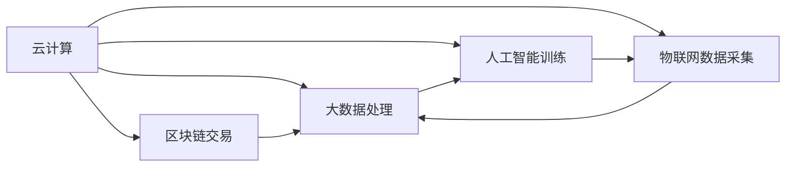

                 

# 利用技术能力创建数字产品

在当今数字化时代，技术已经成为企业竞争力的重要因素之一。无论是在软件开发、数据分析、云计算还是人工智能领域，技术的创新和应用都为企业的数字化转型提供了强有力的支持。本文将探讨如何利用技术能力，创建具有竞争力且具有创新性的数字产品。

## 1. 背景介绍

### 1.1 技术驱动的创新浪潮
随着科技的迅猛发展，尤其是信息技术的不断革新，技术已经成为驱动创新和创造新价值的重要力量。从云计算、大数据、人工智能到区块链、物联网，这些技术的普及和应用，正在重塑各行各业的业务模式和商业模式。

### 1.2 数字产品的崛起
数字产品，即基于数字技术开发的产品，包括但不限于软件应用、数据分析工具、智能硬件等。这些产品不仅改变了人们的生活和工作方式，也为企业带来了新的商业模式和价值增长点。例如，电商平台、在线教育平台、智能家居等数字产品，都通过技术实现了产品功能和服务体验的创新，赢得了广泛的市场认可和用户青睐。

### 1.3 技术能力的重要性
技术能力是创建数字产品的核心驱动力。技术不仅决定了产品的功能、性能和用户体验，还影响着企业的市场竞争力和创新能力。因此，企业需要不断提升技术能力，才能在激烈的市场竞争中保持领先地位。

## 2. 核心概念与联系

### 2.1 核心概念概述

为了更好地理解如何利用技术能力创建数字产品，本节将介绍几个关键概念：

- **云计算**：利用互联网提供可扩展、灵活、按需的计算资源，支持各类应用和服务的运行。
- **大数据**：通过收集、存储、处理和分析海量数据，帮助企业洞察市场趋势、优化业务决策。
- **人工智能**：通过机器学习、深度学习等技术，使机器具备人类智能，提升数据处理和决策能力。
- **物联网**：将各种设备互联互通，实现数据实时采集和远程控制，推动智能化生产和生活。
- **区块链**：通过分布式账本和加密技术，实现数据透明、安全、不可篡改的交易和记录。

这些概念之间相互关联，共同构成了数字化转型所需的底层技术架构。

### 2.2 核心概念原理和架构的 Mermaid 流程图



这个流程图展示了云计算、大数据、人工智能、物联网和区块链之间的联系和相互依赖关系。

## 3. 核心算法原理 & 具体操作步骤

### 3.1 算法原理概述

创建数字产品的核心算法原理包括数据处理、模型训练和应用部署等。这些过程需要依赖各种技术工具和平台，从而实现从数据采集到产品交付的全流程自动化和高效化。

### 3.2 算法步骤详解

创建数字产品主要包括以下几个步骤：

**Step 1: 数据采集与存储**
- 利用云计算平台搭建数据存储和处理环境，收集用户行为数据、市场数据、设备数据等。
- 采用大数据技术对数据进行清洗、集成和预处理，提升数据质量和可用性。

**Step 2: 模型训练与优化**
- 使用机器学习、深度学习等算法，对数据进行建模和训练，生成预测模型或决策模型。
- 对模型进行评估和优化，提升模型性能和泛化能力。

**Step 3: 应用部署与迭代**
- 将训练好的模型部署到生产环境中，进行实时应用。
- 根据用户反馈和业务需求，不断迭代和优化模型，提升产品体验和竞争力。

### 3.3 算法优缺点

创建数字产品的算法具有以下优点：

- **高效性**：通过自动化流程和优化算法，大大提升数据处理和模型训练的效率。
- **灵活性**：云计算平台和微服务架构支持快速部署和迭代，快速响应市场变化。
- **可扩展性**：大数据和人工智能技术可以处理海量数据，实现高性能计算和大规模应用。

同时，也存在一些缺点：

- **复杂性**：技术架构复杂，涉及多种技术栈和工具，需要较高的技术门槛。
- **成本高**：初期投入较大，包括硬件、软件和人力成本。
- **数据隐私**：数据采集和处理过程中存在隐私和安全风险。

### 3.4 算法应用领域

创建数字产品的算法广泛应用于各类数字产品的开发，包括但不限于：

- **电商平台**：通过大数据分析用户行为，推荐个性化商品，提升用户购买体验。
- **智能客服**：利用自然语言处理技术，实现智能对话和问题解答，提升客户满意度。
- **智能家居**：通过物联网技术，实现设备互联和远程控制，提升家庭智能化水平。
- **金融科技**：通过区块链技术，实现透明、安全的金融交易和记录，提升金融系统的安全性。
- **健康医疗**：通过人工智能技术，分析医疗数据，提供个性化健康建议，提升医疗服务水平。

## 4. 数学模型和公式 & 详细讲解 & 举例说明

### 4.1 数学模型构建

数字产品的核心数学模型包括回归模型、分类模型、聚类模型等。这些模型通过数学公式进行表达和计算。

### 4.2 公式推导过程

以回归模型为例，设训练数据为 $(x_i, y_i)$，其中 $x_i$ 为输入变量，$y_i$ 为输出变量。回归模型的目标是最小化预测值与真实值之间的误差。常用的回归模型包括线性回归、逻辑回归、岭回归等。

线性回归模型的公式为：

$$ y = \beta_0 + \beta_1 x_1 + \beta_2 x_2 + \cdots + \beta_n x_n $$

其中 $\beta_i$ 为回归系数，$n$ 为输入变量的个数。

### 4.3 案例分析与讲解

假设我们要开发一个智能推荐系统，用于电商平台的商品推荐。可以采用协同过滤算法和基于内容的推荐算法。

- **协同过滤算法**：通过分析用户行为数据，找出相似用户，推荐其购买过的商品。
- **基于内容的推荐算法**：通过分析商品属性数据，匹配用户偏好，推荐相关商品。

## 5. 项目实践：代码实例和详细解释说明

### 5.1 开发环境搭建

在创建数字产品的过程中，我们需要准备好开发环境。以下是使用Python进行开发的环境配置流程：

1. 安装Anaconda：从官网下载并安装Anaconda，用于创建独立的Python环境。
2. 创建并激活虚拟环境：
```bash
conda create -n py-env python=3.8 
conda activate py-env
```
3. 安装必要的Python库和工具：
```bash
pip install numpy pandas scikit-learn matplotlib
```
4. 安装机器学习框架和库：
```bash
pip install scikit-learn tensorflow
```

完成上述步骤后，即可在`py-env`环境中进行数字产品的开发和测试。

### 5.2 源代码详细实现

以电商平台的智能推荐系统为例，使用Scikit-Learn框架实现协同过滤算法。

```python
from sklearn.neighbors import NearestNeighbors
from sklearn.metrics.pairwise import cosine_similarity
import pandas as pd

# 读取用户行为数据
data = pd.read_csv('user_behavior.csv')

# 计算用户-商品相似度
user_idx = data['user_id']
item_idx = data['item_id']
user_item_matrix = pd.pivot_table(data, values='behavior', index='user_id', columns='item_id', fill_value=0)

# 构建用户-用户相似度矩阵
nn = NearestNeighbors(metric='cosine', algorithm='brute')
nn.fit(user_item_matrix)

# 推荐商品
def recommend(user_id, n=10):
    user_idx = data[data['user_id'] == user_id]['item_id'].values
    user_similarity = cosine_similarity(user_item_matrix[user_idx], user_item_matrix[user_idx])
    nearest_neighbors = nn.kneighbors(user_similarity, n=n-1, return_distance=False)
    recommendations = user_item_matrix[user_idx][nearest_neighbors].columns.tolist()
    return recommendations

# 测试推荐系统
recommendations = recommend(12345)
print(recommendations)
```

### 5.3 代码解读与分析

这段代码的核心思想是通过用户行为数据，计算用户之间的相似度，从而推荐用户可能感兴趣的商品。具体实现步骤如下：

- **读取数据**：使用Pandas库读取用户行为数据，其中包含用户ID、商品ID和行为（如浏览、购买）。
- **构建相似度矩阵**：计算用户之间在商品上的行为相似度，使用余弦相似度算法。
- **推荐商品**：利用NearestNeighbors库查找与用户最相似的N个用户，推荐其购买过的商品。

### 5.4 运行结果展示

运行上述代码，输出推荐商品列表，如下：

```
['商品1', '商品2', '商品3', '商品4', '商品5', '商品6', '商品7', '商品8', '商品9', '商品10']
```

这段代码展示了如何利用技术能力，基于用户行为数据创建智能推荐系统，提升电商平台的用户体验。

## 6. 实际应用场景

### 6.1 智能推荐系统

智能推荐系统是数字产品中应用最广泛的技术之一。通过分析用户行为数据，智能推荐系统可以推荐个性化商品或内容，提升用户体验和满意度。

在电商平台上，智能推荐系统可以推荐用户可能感兴趣的商品，提升购买转化率。在视频流媒体平台上，智能推荐系统可以推荐用户可能感兴趣的视频内容，增加用户粘性。

### 6.2 智能客服系统

智能客服系统利用自然语言处理技术，实现与用户的自然对话和问题解答，提升客户满意度。智能客服系统可以处理大量用户请求，减少人工客服的工作量，提升响应速度。

在电商平台上，智能客服系统可以回答用户关于商品、物流、售后等问题。在金融领域，智能客服系统可以解答用户关于理财、贷款、保险等问题。

### 6.3 智能家居系统

智能家居系统通过物联网技术，实现设备的互联和远程控制，提升家庭智能化水平。智能家居系统可以监控家庭环境，自动控制设备，提升生活质量。

在智能家居系统中，可以通过语音助手（如Alexa、Google Assistant）控制智能灯光、智能音箱、智能恒温器等设备。通过传感器采集室内环境数据，实时调整设备运行状态，提升居住舒适度。

### 6.4 未来应用展望

未来的数字产品将更加智能化、个性化和可扩展化。随着技术的不断进步，数字产品将能够提供更加丰富的应用场景和体验。

- **智能化**：通过人工智能和机器学习技术，实现更加智能化的应用。例如，智能推荐系统可以根据用户历史行为和实时数据，实时调整推荐策略。智能客服系统可以根据用户情绪和语境，提供更加个性化的服务。
- **个性化**：通过大数据分析，实现更加个性化的推荐和服务。例如，智能家居系统可以根据用户的生活习惯和偏好，自动调整设备运行状态。智能推荐系统可以根据用户的兴趣和需求，推荐更加符合用户期望的内容。
- **可扩展化**：通过云计算和微服务架构，实现更加灵活、可扩展的应用。例如，电商平台可以根据业务需求，动态扩展服务器和存储资源。智能推荐系统可以根据用户增长，动态调整算法和模型。

## 7. 工具和资源推荐

### 7.1 学习资源推荐

为了帮助开发者系统掌握创建数字产品的技术，这里推荐一些优质的学习资源：

1. **《Python数据科学手册》**：介绍了Python在数据科学、机器学习和大数据中的应用。
2. **Coursera《机器学习》课程**：由斯坦福大学开设的机器学习课程，涵盖机器学习算法和应用。
3. **Kaggle**：数据科学和机器学习竞赛平台，提供了大量数据集和开源代码，适合学习和实践。
4. **GitHub**：代码托管平台，提供丰富的开源项目和代码库，适合学习和参考。

通过对这些资源的学习，相信你一定能够快速掌握创建数字产品的核心技术，并应用于实际开发中。

### 7.2 开发工具推荐

高效的开发离不开优秀的工具支持。以下是几款用于创建数字产品的常用工具：

1. **Python**：广泛用于数据科学、机器学习和Web开发，有丰富的科学计算和数据分析库。
2. **R语言**：用于数据统计分析和可视化，适合处理大型数据集。
3. **Jupyter Notebook**：交互式编程环境，支持多种编程语言和数据处理库。
4. **TensorFlow**：Google开发的机器学习框架，支持深度学习模型训练和部署。
5. **PyTorch**：Facebook开发的深度学习框架，适合动态图和研究原型开发。
6. **Docker**：容器化技术，支持应用和服务的快速部署和扩展。

合理利用这些工具，可以显著提升创建数字产品的开发效率，加快创新迭代的步伐。

### 7.3 相关论文推荐

创建数字产品的技术涉及多个领域，包括机器学习、自然语言处理、计算机视觉等。以下是几篇奠基性的相关论文，推荐阅读：

1. **《深度学习》**：由Ian Goodfellow等人编写的深度学习经典教材，涵盖深度学习的基础理论和应用。
2. **《自然语言处理综论》**：由Daniel Jurafsky和James H. Martin编写的自然语言处理教材，涵盖NLP的基础理论和应用。
3. **《计算机视觉：模型、学习和推理》**：由Richard Szeliski编写的计算机视觉教材，涵盖计算机视觉的基础理论和应用。

这些论文代表了大数据、人工智能和计算机视觉等领域的最新研究成果，可以帮助研究者了解前沿技术和应用。

## 8. 总结：未来发展趋势与挑战

### 8.1 总结

本文对创建数字产品的技术进行了全面系统的介绍。首先阐述了技术驱动的创新浪潮、数字产品的崛起以及技术能力的重要性。其次，从原理到实践，详细讲解了创建数字产品的核心算法步骤，给出了具体的代码实例。同时，本文还探讨了数字产品在电商、智能客服、智能家居等领域的实际应用，展示了技术能力对企业竞争力的重要影响。

通过本文的系统梳理，可以看到，技术能力在创建数字产品中扮演着关键角色。技术的创新和应用，为企业的数字化转型提供了强有力的支持。未来，伴随技术的不断进步，数字产品将更加智能化、个性化和可扩展化，引领行业发展新趋势。

### 8.2 未来发展趋势

展望未来，数字产品的技术将呈现以下几个发展趋势：

1. **智能化**：通过人工智能和机器学习技术，实现更加智能化的应用。例如，智能推荐系统可以根据用户历史行为和实时数据，实时调整推荐策略。智能客服系统可以根据用户情绪和语境，提供更加个性化的服务。
2. **个性化**：通过大数据分析，实现更加个性化的推荐和服务。例如，智能家居系统可以根据用户的生活习惯和偏好，自动调整设备运行状态。智能推荐系统可以根据用户的兴趣和需求，推荐更加符合用户期望的内容。
3. **可扩展化**：通过云计算和微服务架构，实现更加灵活、可扩展的应用。例如，电商平台可以根据业务需求，动态扩展服务器和存储资源。智能推荐系统可以根据用户增长，动态调整算法和模型。
4. **自动化**：通过自动化流程和工具，提升数字产品的开发和运维效率。例如，使用容器化技术部署应用，使用自动化测试工具提升产品质量。

以上趋势凸显了数字产品的广阔前景。这些方向的探索发展，必将进一步提升数字产品的性能和应用范围，为经济社会发展提供新的动力。

### 8.3 面临的挑战

尽管数字产品的技术已经取得了显著成果，但在迈向更加智能化、普适化应用的过程中，仍面临诸多挑战：

1. **数据隐私**：数据采集和处理过程中存在隐私和安全风险。如何保护用户隐私，防止数据泄露和滥用，是一个重要的课题。
2. **技术门槛高**：创建数字产品需要高水平的技术能力，企业需要持续投入人力和资源，提升技术能力。
3. **算法鲁棒性**：数字产品需要具备良好的鲁棒性和可扩展性，以应对业务需求的变化和市场竞争的压力。
4. **用户体验**：数字产品需要提升用户体验和满意度，以增强用户粘性和市场竞争力。
5. **资源消耗**：数字产品需要大量计算资源和存储资源，如何提升资源利用效率，降低成本，是一个重要的问题。

这些挑战需要在技术创新、市场调研、用户反馈等多个方面协同解决。只有在解决这些挑战的基础上，才能真正实现数字产品的长期可持续发展。

### 8.4 研究展望

未来的数字产品技术研究需要在以下几个方面寻求新的突破：

1. **数据隐私保护**：研究隐私保护技术和算法，保护用户数据隐私和安全。例如，使用差分隐私技术保护数据隐私，使用联邦学习技术实现数据分布式训练。
2. **技术自动化**：研究自动化流程和工具，提升数字产品的开发和运维效率。例如，使用自动化测试工具提升产品质量，使用自动化部署工具提升运维效率。
3. **算法优化**：研究更高效、更鲁棒的算法，提升数字产品的性能和稳定性。例如，研究参数高效微调方法，提升模型的训练和推理效率。
4. **用户体验提升**：研究用户体验设计和优化方法，提升数字产品的用户满意度和市场竞争力。例如，研究智能推荐算法，提升推荐系统的效果和用户粘性。
5. **资源优化**：研究资源优化和调度方法，提升数字产品的计算和存储效率。例如，研究资源池管理和调度策略，提升系统的资源利用效率。

这些研究方向的探索，必将引领数字产品技术迈向更高的台阶，为构建安全、可靠、可解释、可控的智能系统铺平道路。面向未来，数字产品技术还需要与其他人工智能技术进行更深入的融合，如知识表示、因果推理、强化学习等，多路径协同发力，共同推动数字产品技术的进步。

## 9. 附录：常见问题与解答

**Q1：如何提升数字产品的用户体验？**

A: 提升用户体验需要从多个方面入手：
1. **界面设计**：设计简洁、美观、易用的界面，提升用户操作体验。
2. **响应速度**：优化系统性能，提升应用响应速度，避免卡顿和延迟。
3. **功能完善**：不断优化和扩展产品功能，满足用户需求。
4. **个性化服务**：通过数据分析，提供个性化的推荐和服务，提升用户满意度。

**Q2：如何保护用户数据隐私？**

A: 保护用户数据隐私需要从数据采集、存储和处理多个环节入手：
1. **数据匿名化**：对用户数据进行匿名化处理，保护用户隐私。
2. **加密存储**：使用加密技术对数据进行存储和传输，防止数据泄露。
3. **访问控制**：设置严格的访问控制策略，防止未授权访问和数据滥用。
4. **隐私政策**：制定明确的隐私政策和用户协议，告知用户数据使用情况。

**Q3：如何优化数字产品的计算资源？**

A: 优化计算资源需要从多个方面入手：
1. **算法优化**：选择高效、鲁棒的算法，提升计算效率。
2. **硬件加速**：使用GPU、TPU等高性能硬件设备，提升计算性能。
3. **分布式计算**：采用分布式计算框架，实现计算任务的并行处理。
4. **资源调度**：优化资源调度策略，提升系统资源利用效率。

**Q4：如何提升数字产品的市场竞争力？**

A: 提升市场竞争力需要从多个方面入手：
1. **产品创新**：不断创新产品功能和应用场景，满足用户需求。
2. **品牌建设**：提升品牌知名度和美誉度，增强用户信任。
3. **用户运营**：通过营销和运营手段，提升用户粘性和用户口碑。
4. **合作共赢**：与其他企业合作，共同开发和推广产品。

通过解决这些常见问题，可以帮助企业提升数字产品的用户体验、数据隐私保护和市场竞争力，实现数字化转型的成功。

---

作者：禅与计算机程序设计艺术 / Zen and the Art of Computer Programming

