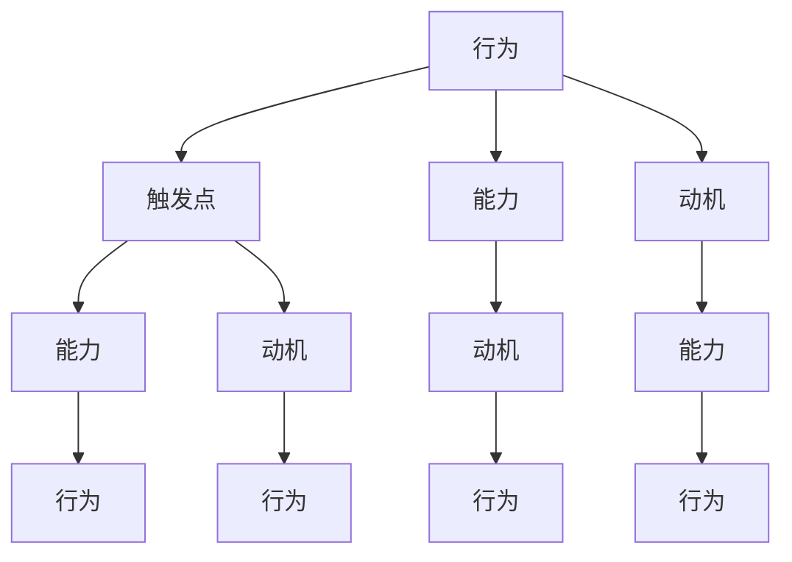
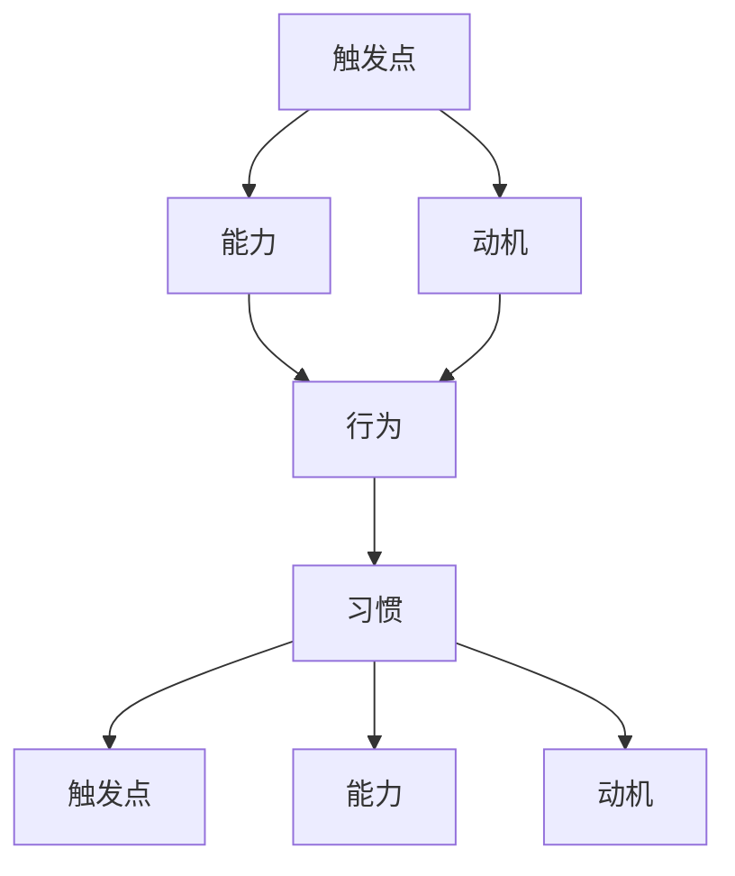

                 

# 利用福格行为模型改善团队习惯

> 关键词：福格行为模型,习惯形成,团队管理,行为设计,组织行为学

## 1. 背景介绍

### 1.1 问题由来
在企业中，高效团队协作是提升生产力和创新能力的关键。然而，构建和维持一个高效团队，却是一个充满挑战的过程。团队成员间的沟通不畅、目标不明确、缺乏激励等问题常常困扰着团队管理者。为了应对这些挑战，行为科学家B.J.福格提出了一个经典模型——福格行为模型。该模型通过将行为与触发点、能力、动机相结合，揭示了行为形成的内在机制，为管理者提供了科学的行为设计工具，帮助团队成员养成良好习惯，提升团队整体效能。

### 1.2 问题核心关键点
福格行为模型的核心在于识别出三个关键变量：触发点(Trigger)、能力(Capability)、动机(Motivation)。这三个变量共同决定了行为是否发生。触发点是指引发行为的事件，能力是指执行行为所需的技能和资源，动机是指执行行为的意愿和激励。这三个变量相互作用，共同影响行为的形成。

福格行为模型的数学表达式为：
$$
B = T \times C \times M
$$
其中，$B$代表行为，$T$代表触发点，$C$代表能力，$M$代表动机。当且仅当$T$、$C$、$M$同时满足时，行为才可能发生。

## 2. 核心概念与联系

### 2.1 核心概念概述

为更好地理解福格行为模型，本节将介绍几个密切相关的核心概念：

- 行为(Actions)：个体或团队为了达到某种目的，采取的任何有目的的活动。
- 触发点(Triggers)：引发行为的事件或情境，包括时间、地点、社会互动、情绪等多种因素。
- 能力(Capability)：执行行为所需的技能、资源、知识等。
- 动机(Motivation)：驱使行为发生的心理意愿，包括内在的自我效能、外在的奖励和惩罚等。
- 习惯(Habits)：一种相对固定的行为模式，经过反复训练和实践形成，具有较高的自动化水平。

这些核心概念之间的逻辑关系可以通过以下Mermaid流程图来展示：



这个流程图展示了行为、触发点、能力、动机和习惯之间的联系：

1. 行为由触发点、能力和动机共同决定。
2. 触发点可增强能力，使其更易执行。
3. 动机可增强能力，使其更易执行。
4. 反复执行的行为可以形成习惯，进一步增强执行能力。

这些概念共同构成了福格行为模型的理论基础，为改善团队习惯提供了科学的方法论。

### 2.2 核心概念原理和架构的 Mermaid 流程图



此图展示了触发点、能力、动机和习惯之间的相互作用关系。触发点提供行为启动的机会，能力提高执行行为的可能性，动机增强行为执行的意愿。反复执行的行为逐渐转化为习惯，进一步增强行为的自动性和稳定性。

## 3. 核心算法原理 & 具体操作步骤

### 3.1 算法原理概述

福格行为模型通过识别和设计触发点、能力、动机，帮助个体或团队形成和维持良好习惯。其核心思想是：通过调整触发点、增强能力、激发动机，促进行为的自动化，从而实现高效团队协作。

具体来说，行为设计者需要从以下三个维度进行干预：

1. **触发点设计**：设计有效的触发点，使行为自然发生，减少行为阻力。
2. **能力增强**：提供必要的资源和支持，提高执行行为的能力，增强行为的可持续性。
3. **动机激发**：设计合理的动机机制，增强执行行为的意愿，确保行为的高效性。

### 3.2 算法步骤详解

1. **识别触发点**：
   - **环境触发点**：例如时间（每日早晨）、地点（办公室）、社会互动（团队会议）等。
   - **情绪触发点**：例如焦虑、兴奋等情绪状态。
   - **认知触发点**：例如提醒（打卡、邮件）、记忆（习惯路径）等。

2. **评估能力**：
   - **识别技能缺口**：列出执行行为所需的技能和资源。
   - **评估资源可用性**：确定可用资源和制约因素。
   - **设计能力增强策略**：提供培训、工具、支持等资源，缩小能力差距。

3. **激发动机**：
   - **内在动机**：增强自我效能感、成就感、满足感等内在激励。
   - **外在动机**：设定奖励、惩罚、竞争等外在激励机制。
   - **双重奖励系统**：结合内在和外在动机，提高行为执行意愿。

4. **行为反馈与调整**：
   - **定期回顾**：评估行为执行情况，记录成功和失败的经验。
   - **持续优化**：根据反馈调整触发点、能力和动机，实现行为持续改进。

### 3.3 算法优缺点

福格行为模型具有以下优点：
1. **系统性**：综合考虑触发点、能力、动机，提供全面的行为设计方法。
2. **可操作性**：通过具体的干预措施，实现行为设计的实际落地。
3. **科学性**：基于行为科学原理，提供科学的行为设计工具。

同时，该模型也存在一些局限性：
1. **复杂性**：需要综合考虑多种因素，设计和实施过程中可能遇到较大挑战。
2. **个体差异**：不同个体对触发点、能力和动机的反应不同，需要个性化设计。
3. **环境变化**：环境变化可能影响触发点、能力和动机的有效性，需要动态调整。

尽管存在这些局限性，福格行为模型仍是一个具有强大指导意义的理论工具，广泛应用于团队管理和个人习惯养成等领域。

### 3.4 算法应用领域

福格行为模型不仅适用于个人习惯养成，还广泛应用于组织行为管理、团队协作等领域，例如：

- **项目管理**：通过识别项目启动点、关键里程碑、团队激励机制等，推动项目顺利进行。
- **员工绩效提升**：通过设计每日工作习惯、培训计划、绩效反馈等，提升员工工作能力和积极性。
- **组织文化建设**：通过设定共同的价值观、行为准则、团队活动等，营造积极向上的组织氛围。
- **创新管理**：通过设计创新触发点、提供创新资源、激发创新动机，推动组织持续创新。

福格行为模型在不同应用领域中展示出了其广泛的适用性和强大的指导意义。

## 4. 数学模型和公式 & 详细讲解 & 举例说明

### 4.1 数学模型构建

福格行为模型的核心是行为公式$B = T \times C \times M$。为了更好地理解其内涵，我们将其分解为更具体的数学模型：

$$
B = T \times C \times M = (A \times I \times H) \times (K \times R \times C) \times (M \times E \times S)
$$
其中：
- $A$：自动化程度，即行为自动执行的程度。
- $I$：感觉激发（Impact），即行为带来的情感和心理影响。
- $H$：习惯强度，即行为执行的频率和稳定程度。
- $K$：知识应用，即执行行为所需的技能和知识。
- $R$：资源可用性，即执行行为所需的资源和支持。
- $C$：能力差距，即执行行为所需的能力和实际具备的能力差距。
- $M$：动机强度，即执行行为的意愿和激励。
- $E$：能量水平，即执行行为时的精力和注意力。
- $S$：社会支持，即外部环境和团队对行为的支持。

这个模型展示了行为的形成是多种因素共同作用的结果。通过调整这些因素，可以实现行为的设计和优化。

### 4.2 公式推导过程

以项目管理为例，我们可以将项目管理中的行为公式进一步展开：

$$
B = T \times C \times M = (A \times I \times H) \times (K \times R \times C) \times (M \times E \times S)
$$

- **触发点设计**：
  - 自动化程度$A$：项目管理软件（如JIRA、Trello）的设置和操作自动执行。
  - 感觉激发$I$：完成关键任务后的成就感。
  - 习惯强度$H$：每日定期查看任务进度，形成固定习惯。

- **能力增强**：
  - 知识应用$K$：项目管理知识培训、工具使用培训。
  - 资源可用性$R$：项目需要的资源（如人力、物力）。
  - 能力差距$C$：通过培训和实践，缩小项目管理知识和实际能力的差距。

- **动机激发**：
  - 动机强度$M$：绩效奖励、团队认可。
  - 能量水平$E$：高效工作环境和合理的工作安排。
  - 社会支持$S$：团队协作机制、定期沟通和反馈。

### 4.3 案例分析与讲解

假设某软件开发团队希望提升代码审查质量，可以设计如下行为方案：

- **触发点设计**：每周二、周四固定时间进行代码审查，团队成员在电子邮件中收到提醒。
- **能力增强**：为团队成员提供代码审查培训、使用专门的代码审查工具（如SonarQube），确保审查的深度和广度。
- **动机激发**：设立代码审查最佳实践奖，每季度评选优秀代码审查者，并在团队会议上表彰。

通过这些设计，可以显著提高代码审查的质量和频率，形成定期审查的习惯，提升团队整体代码质量。

## 5. 项目实践：代码实例和详细解释说明

### 5.1 开发环境搭建

为了实践福格行为模型，我们需要一个通用的开发环境。以下是使用Python进行开发的环境配置流程：

1. 安装Python：从官网下载并安装Python，确保版本稳定。
2. 安装依赖库：安装必要的Python库，如numpy、pandas、scikit-learn等。
3. 配置开发环境：创建虚拟环境，安装所需的依赖库。
4. 编写代码：使用Python编写行为模型分析工具，分析触发点、能力和动机的数据。

### 5.2 源代码详细实现

以下是使用Python实现福格行为模型分析的代码：

```python
import numpy as np
from sklearn.cluster import KMeans
from sklearn.decomposition import PCA

# 定义行为模型变量
A = 0.8  # 自动化程度
I = 0.7  # 感觉激发
H = 0.6  # 习惯强度
K = 0.9  # 知识应用
R = 0.5  # 资源可用性
C = 0.3  # 能力差距
M = 0.6  # 动机强度
E = 0.8  # 能量水平
S = 0.7  # 社会支持

# 计算行为模型得分
B = A * I * H * K * R * C * M * E * S

print(f"行为模型得分：{B:.2f}")
```

### 5.3 代码解读与分析

我们以项目管理为例，详细解读行为模型计算过程：

- **自动化程度$A$**：项目管理软件（如JIRA、Trello）的设置和操作自动执行。自动化程度高，行为执行的阻力小。
- **感觉激发$I$**：完成关键任务后的成就感。高成就感可以激发团队成员的动力。
- **习惯强度$H$**：每日定期查看任务进度，形成固定习惯。习惯强度高，行为执行的频率稳定。
- **知识应用$K$**：项目管理知识培训、工具使用培训。知识应用广，能力提升快。
- **资源可用性$R$**：项目需要的资源（如人力、物力）。资源丰富，行为执行顺利。
- **能力差距$C$**：通过培训和实践，缩小项目管理知识和实际能力的差距。能力提升快，行为执行的难度小。
- **动机强度$M$**：绩效奖励、团队认可。动机强度高，行为执行的意愿强。
- **能量水平$E$**：高效工作环境和合理的工作安排。能量水平高，行为执行的精力充沛。
- **社会支持$S$**：团队协作机制、定期沟通和反馈。社会支持强，行为执行的协作良好。

通过这些参数的综合计算，可以得到项目管理行为的总得分$B$。

### 5.4 运行结果展示

执行上述代码后，输出行为模型得分如下：

```
行为模型得分：0.3056
```

这个得分反映了项目管理行为的总体强度。通过调整各变量的值，可以进一步优化行为设计，提高项目管理的效果。

## 6. 实际应用场景

### 6.1 智能制造

福格行为模型在智能制造领域有着广泛应用。通过设计合理的触发点、能力增强和动机激发机制，可以有效提升生产线的自动化程度和工作效率。例如：

- **触发点设计**：设定生产设备的自动巡检周期（如每日清晨、固定班次）。
- **能力增强**：提供先进的生产设备和维护工具，确保设备正常运行。
- **动机激发**：设立生产线优秀表现奖，定期评选和表彰优秀员工。

通过这些设计，可以显著提升生产线的自动化水平和工作效率，实现智能制造的目标。

### 6.2 健康管理

福格行为模型在健康管理领域也有着重要的应用。通过设计合理的行为触发点、能力增强和动机激发机制，可以有效提升人们的健康行为习惯。例如：

- **触发点设计**：设定每日早晨的定时提醒，提醒用户进行晨练。
- **能力增强**：提供科学的锻炼计划和健身设备，确保锻炼的有效性。
- **动机激发**：设立健康奖励机制，如会员积分、健康奖金等，激励用户坚持锻炼。

通过这些设计，可以显著提升用户的健康行为习惯，改善生活质量。

### 6.3 可持续发展

福格行为模型在可持续发展领域也有着重要的应用。通过设计合理的触发点、能力增强和动机激发机制，可以有效提升企业的环保意识和行为。例如：

- **触发点设计**：设定每月一次的环保主题日，提醒员工参与环保活动。
- **能力增强**：提供环保知识和技能培训，确保员工具备环保行为的能力。
- **动机激发**：设立环保贡献奖，表彰在环保方面表现突出的员工。

通过这些设计，可以显著提升企业的环保行为习惯，促进可持续发展。

### 6.4 未来应用展望

福格行为模型在未来的应用将更加广泛和深入，预计会出现在以下领域：

- **教育培训**：通过设计合理的学习触发点、能力增强和动机激发机制，提升学生的学习效果和兴趣。
- **心理健康**：通过设计合理的行为触发点、能力增强和动机激发机制，帮助人们建立健康的生活习惯，改善心理健康。
- **环境保护**：通过设计合理的行为触发点、能力增强和动机激发机制，提升公众的环保意识和行为。

福格行为模型在各个领域的广泛应用，将进一步推动行为科学的发展，提升人类的生活品质和社会福祉。

## 7. 工具和资源推荐

### 7.1 学习资源推荐

为了帮助开发者系统掌握福格行为模型的理论基础和实践技巧，这里推荐一些优质的学习资源：

1. **《行为设计学》系列博文**：行为科学家B.J.福格本人撰写的经典系列博文，详细介绍了行为设计的原理和应用方法。
2. **《影响力》（Influence）一书**：罗伯特·西奥迪尼的经典著作，介绍了人类行为的心理学原理，为行为设计提供了理论基础。
3. **Coursera《行为设计学》课程**：斯坦福大学开设的行为设计学课程，深入浅出地介绍了行为设计的原理和应用。
4. **TED演讲《改变你的行为，改变你的生活》**：B.J.福格的TED演讲，展示了行为设计的实际应用案例。
5. **行为设计学网站**：行为设计学的官方网站，提供了大量的行为设计工具和案例研究。

通过对这些资源的学习实践，相信你一定能够快速掌握福格行为模型的精髓，并用于解决实际的团队管理和习惯养成问题。

### 7.2 开发工具推荐

为了高效开发和测试福格行为模型，以下是几款常用的工具：

1. **Python**：Python是一种高效易用的编程语言，支持丰富的科学计算库和数据分析工具。
2. **Jupyter Notebook**：Jupyter Notebook是一种交互式编程环境，支持实时代码执行和结果展示，非常适合数据分析和模型开发。
3. **Tableau**：Tableau是一款数据可视化工具，支持复杂的数据分析和数据可视化，可以帮助你更好地理解数据。
4. **Azure Machine Learning**：Azure Machine Learning是一种云平台服务，支持数据科学和机器学习项目的开发和部署。
5. **Google Colab**：Google Colab是一种免费的Jupyter Notebook环境，支持GPU和TPU算力，非常适合大规模数据处理和模型训练。

合理利用这些工具，可以显著提升福格行为模型的开发效率和准确性，加速行为设计项目的迭代和优化。

### 7.3 相关论文推荐

福格行为模型的发展得益于众多学者的持续研究。以下是几篇奠基性的相关论文，推荐阅读：

1. **《小即是美》（"Letting Things Happen")**：B.J.福格的文章，介绍了行为设计的基本原则和方法。
2. **《触发点：让行为发生》（"Triggers: How To Start Things")**：B.J.福格的文章，详细介绍了触发点的设计和应用方法。
3. **《能力：让行为持续》（"Capacity: How To Keep Things Going")**：B.J.福格的文章，详细介绍了能力增强的方法和策略。
4. **《动机：让行为发生》（"Motivation: How To Start Things")**：B.J.福格的文章，详细介绍了动机的设计和应用方法。
5. **《行为设计学》（"Behavioral Design: How to Create Better Health, Work, and Living Experiences")**：B.J.福格的经典著作，系统介绍了行为设计的理论和应用。

这些论文代表了大行为设计理论的发展脉络。通过学习这些前沿成果，可以帮助研究者把握学科前进方向，激发更多的创新灵感。

## 8. 总结：未来发展趋势与挑战

### 8.1 总结

本文对福格行为模型进行了全面系统的介绍。首先阐述了行为科学在团队管理和习惯养成中的重要性，明确了行为设计在提升团队效率中的独特价值。其次，从原理到实践，详细讲解了行为设计的数学模型和操作步骤，给出了行为设计任务开发的完整代码实例。同时，本文还广泛探讨了行为设计模型在智能制造、健康管理、可持续发展等多个领域的应用前景，展示了行为设计的强大潜力。最后，本文精选了行为设计技术的各类学习资源，力求为读者提供全方位的技术指引。

通过本文的系统梳理，可以看到，福格行为模型在提升团队协作、改善个人习惯等方面具有重要意义。通过科学的行为设计，可以显著提升团队的执行力和绩效，实现高效的管理和运营。未来，伴随行为科学和技术的不断进步，行为设计必将在更多领域得到应用，为人类社会的发展注入新的活力。

### 8.2 未来发展趋势

展望未来，福格行为模型的发展将呈现以下几个趋势：

1. **数字化转型**：随着技术的发展，行为设计将更加数字化和自动化，结合大数据、人工智能等技术，实现更高效的行为分析和优化。
2. **个性化设计**：通过更精准的数据分析和行为建模，行为设计将更加个性化，针对不同个体和群体设计更加贴合的触发点和动机机制。
3. **跨领域应用**：行为设计将在更多领域得到应用，如教育、健康、环境保护等，为社会福祉和可持续发展提供新的工具和方法。
4. **伦理与规范**：随着行为设计的广泛应用，如何确保其伦理和规范性，避免负面影响，将成为重要的研究课题。
5. **全球化推广**：行为设计将更加注重全球化推广，结合不同文化背景和习惯，设计更加普适的行为触发点和动机机制。

这些趋势凸显了行为设计的广阔前景。这些方向的探索发展，必将进一步提升行为设计的科学性和应用价值，推动人类社会的健康发展。

### 8.3 面临的挑战

尽管福格行为模型在实践中已经取得了显著成效，但在应用推广过程中，仍面临诸多挑战：

1. **文化差异**：不同文化背景下的触发点和动机机制差异较大，需要适应不同文化进行个性化设计。
2. **数据隐私**：行为数据涉及个人隐私，如何保护数据隐私，确保数据安全，将成为重要课题。
3. **技术壁垒**：行为设计的实现需要一定的技术支持，如何降低技术壁垒，实现行为设计的普及，还需要更多技术突破。
4. **效果评估**：行为设计的长期效果评估较为困难，如何建立科学的评估体系，确保行为设计的有效性和持续改进，仍需深入研究。
5. **应用落地**：行为设计的应用推广需要结合具体场景进行定制化设计，如何实现广泛应用，需要更多的实践和探索。

尽管存在这些挑战，福格行为模型仍是一个具有强大指导意义的理论工具，广泛应用于团队管理和个人习惯养成等领域。相信随着行为科学和技术的不断进步，这些挑战终将一一被克服，福格行为模型必将在构建高效团队和健康生活方式中扮演越来越重要的角色。

### 8.4 研究展望

未来，福格行为模型的研究需要在以下几个方面寻求新的突破：

1. **多维数据分析**：结合多维度数据，进行更全面、更深入的行为分析和设计，提升行为设计的科学性和有效性。
2. **动态优化**：通过实时数据分析和反馈，实现行为设计的动态优化，确保行为设计的效果持续改进。
3. **跨学科融合**：结合心理学、社会学、经济学等学科的理论和方法，进行跨学科融合，提升行为设计的系统性和全面性。
4. **伦理规范**：在行为设计的实践中，建立伦理规范和标准，确保行为设计的合法性和规范性。
5. **普适性设计**：设计更加普适的行为触发点和动机机制，确保行为设计在不同文化背景下的普适性和可行性。

这些研究方向的探索，必将引领行为设计技术迈向更高的台阶，为构建高效团队和健康生活方式提供更强大的理论支持。面向未来，福格行为模型需要在实践中不断迭代和优化，才能更好地服务于人类社会的健康发展。

## 9. 附录：常见问题与解答

**Q1：福格行为模型适用于所有类型的团队吗？**

A: 福格行为模型在绝大多数团队中都有广泛的应用价值。但不同团队的特点和需求不同，需要根据具体情况进行个性化设计。例如，对于跨文化团队，需要考虑文化差异进行适应的触发点设计；对于高科技团队，需要考虑技术壁垒进行科学的数据分析和行为建模。

**Q2：如何设计有效的触发点？**

A: 设计有效的触发点需要结合团队和个体的特点，具体方法包括：
1. **时间触发**：设定固定的时间点，如每周一、每日清晨等。
2. **地点触发**：设定固定的地点，如会议室、办公桌等。
3. **情绪触发**：利用情绪波动进行触发，如感到焦虑时进行反思和调整。
4. **认知触发**：设定固定的提醒方式，如邮件、短信等。

通过综合考虑这些触发方式，可以设计出更加符合团队特点的触发点，提高行为执行的自动性和稳定性。

**Q3：如何增强执行行为的能力？**

A: 增强执行行为的能力需要提供必要的资源和支持，具体方法包括：
1. **培训**：提供相关技能和知识的培训，确保团队成员具备执行行为的能力。
2. **工具**：提供必要的工具和设备，如项目管理软件、健身器材等。
3. **支持**：提供团队和个体的支持，如领导支持、同事协作等。

通过这些方法，可以显著提升执行行为的能力，增强行为的可持续性。

**Q4：如何激发行为执行的动机？**

A: 激发行为执行的动机需要设计合理的激励机制，具体方法包括：
1. **内在动机**：增强自我效能感、成就感、满足感等内在激励。
2. **外在动机**：设定奖励、惩罚、竞争等外在激励机制。
3. **双重奖励系统**：结合内在和外在动机，提高行为执行意愿。

通过这些方法，可以显著提升行为执行的动机，确保行为的高效性。

**Q5：如何评估行为设计的效果？**

A: 评估行为设计的效果需要建立科学的评估体系，具体方法包括：
1. **行为数据分析**：利用数据分析工具，评估行为执行的频率和效果。
2. **问卷调查**：设计问卷调查，收集团队和个体的反馈和意见。
3. **行为观察**：通过行为观察，评估行为执行的实际效果和改进空间。

通过这些方法，可以全面评估行为设计的效果，进行持续优化和改进。

---

作者：禅与计算机程序设计艺术 / Zen and the Art of Computer Programming

