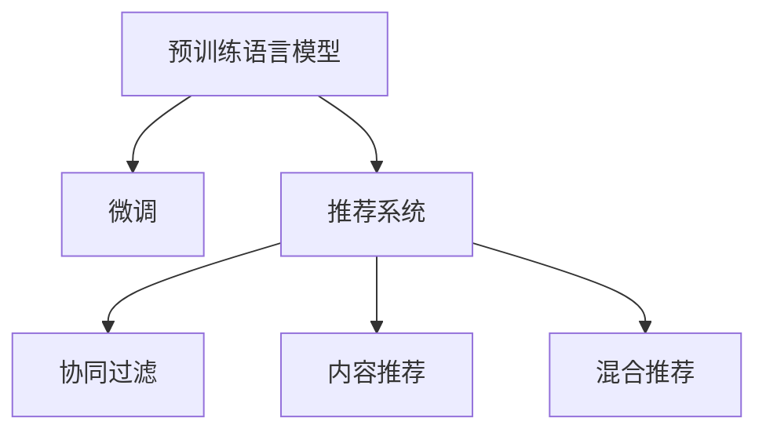

                 

## 1. 背景介绍

在信息爆炸的时代，推荐系统已成为互联网应用中不可或缺的一部分。通过推荐系统，用户可以快速发现感兴趣的内容，提升用户体验和满意度。然而，传统的推荐系统往往依赖用户行为数据进行特征工程和模型训练，难以充分挖掘用户内在的隐式偏好和复杂兴趣。近年来，随着深度学习和大规模预训练语言模型的兴起，推荐系统的发展进入了一个新的阶段。

预训练语言模型（如BERT、GPT等）在自然语言理解任务上取得了巨大成功。其背后的原理是通过在海量无标签数据上预训练，学习到语言知识，然后通过微调在特定任务上取得优异表现。这种从无监督学习到有监督微调的范式，为推荐系统提供了新的思考和实践方向。本文将深入探讨利用预训练语言模型进行推荐任务的优势，并结合具体案例进行详细分析。

## 2. 核心概念与联系

### 2.1 核心概念概述

为更好地理解利用预训练语言模型进行推荐任务的方法，本节将介绍几个密切相关的核心概念：

- 预训练语言模型：以自回归（如GPT）或自编码（如BERT）模型为代表的大规模预训练语言模型。通过在大规模无标签文本语料上进行预训练，学习通用的语言表示，具备强大的语言理解和生成能力。
- 推荐系统：根据用户的历史行为和兴趣，自动推荐其可能感兴趣的内容，包括商品、文章、视频等。常见的推荐策略包括基于协同过滤、基于内容、基于混合等。
- 微调：指在预训练模型的基础上，使用推荐任务的数据集进行有监督学习优化模型在特定推荐任务上的性能。通过微调，模型能够更好地匹配用户的隐式偏好，提高推荐准确性。
- 自监督学习：利用未标注数据进行预训练，学习语言表示，提升模型的泛化能力。常见的自监督学习任务包括掩码语言模型、句子相似性学习等。

这些核心概念之间的逻辑关系可以通过以下Mermaid流程图来展示：



这个流程图展示了大语言模型的核心概念及其之间的关系：

1. 预训练语言模型通过自监督学习获得语言表示。
2. 微调是预训练模型对推荐任务的适配过程。
3. 推荐系统可以基于协同过滤、内容推荐、混合推荐等多种策略进行设计。
4. 预训练-微调结合的方式，可以提升推荐系统的性能和泛化能力。

## 3. 核心算法原理 & 具体操作步骤

### 3.1 算法原理概述

利用预训练语言模型进行推荐任务的基本原理，是将预训练语言模型的强大语义表示能力应用于推荐系统的用户行为分析中。通过在推荐数据集上进行微调，模型能够学习到用户的隐式偏好，从而在推荐过程中提供更准确、多样化的建议。

具体来说，假设推荐任务为给定用户 $u$ 和商品 $i$ 是否被购买的关系，即二分类问题。预训练语言模型 $M_{\theta}$ 的输出 $M_{\theta}(x)$ 表示文本 $x$ 的语义表示。对于用户 $u$ 的行为记录 $x_u$，将其输入到模型中，可以得到对应的语义表示 $M_{\theta}(x_u)$。通过学习用户与商品之间的语义相似度，模型可以对用户行为进行预测和推荐。

形式化地，假设推荐任务数据集为 $D=\{(x_u,y_u)\}_{u=1}^N$，其中 $x_u$ 为用户的行为记录，$y_u$ 为是否购买的标签。微调的目标是最小化经验风险，即：

$$
\theta^* = \mathop{\arg\min}_{\theta} \mathcal{L}(M_{\theta},D)
$$

其中 $\mathcal{L}$ 为推荐任务设计的损失函数，用于衡量模型预测输出与真实标签之间的差异。常见的损失函数包括交叉熵损失、均方误差损失等。

### 3.2 算法步骤详解

基于预训练语言模型进行推荐任务的一般步骤包括：

**Step 1: 准备预训练模型和数据集**
- 选择合适的预训练语言模型 $M_{\theta}$ 作为初始化参数，如 BERT、GPT等。
- 准备推荐任务的数据集 $D$，划分为训练集、验证集和测试集。一般要求标注数据与预训练数据的分布不要差异过大。

**Step 2: 添加推荐适配层**
- 根据推荐任务类型，在预训练模型顶层设计合适的输出层和损失函数。
- 对于二分类任务，通常在顶层添加线性分类器和交叉熵损失函数。
- 对于多分类任务，通常使用softmax函数输出概率分布，并以交叉熵损失函数进行优化。

**Step 3: 设置微调超参数**
- 选择合适的优化算法及其参数，如 AdamW、SGD 等，设置学习率、批大小、迭代轮数等。
- 设置正则化技术及强度，包括权重衰减、Dropout、Early Stopping 等。
- 确定冻结预训练参数的策略，如仅微调顶层，或全部参数都参与微调。

**Step 4: 执行梯度训练**
- 将训练集数据分批次输入模型，前向传播计算损失函数。
- 反向传播计算参数梯度，根据设定的优化算法和学习率更新模型参数。
- 周期性在验证集上评估模型性能，根据性能指标决定是否触发 Early Stopping。
- 重复上述步骤直到满足预设的迭代轮数或 Early Stopping 条件。

**Step 5: 测试和部署**
- 在测试集上评估微调后模型 $M_{\hat{\theta}}$ 的性能，对比微调前后的推荐精度提升。
- 使用微调后的模型对新商品进行推荐，集成到实际的应用系统中。
- 持续收集新的数据，定期重新微调模型，以适应数据分布的变化。

以上是基于预训练语言模型进行推荐任务的一般流程。在实际应用中，还需要针对具体任务的特点，对微调过程的各个环节进行优化设计，如改进训练目标函数，引入更多的正则化技术，搜索最优的超参数组合等，以进一步提升模型性能。

### 3.3 算法优缺点

利用预训练语言模型进行推荐任务具有以下优点：

1. 语义表示能力强。预训练语言模型具备强大的语义理解和生成能力，能够捕捉用户隐式偏好的深层次语义信息。
2. 泛化能力强。预训练模型在多种自然语言处理任务上表现优异，能够迁移到推荐任务中，提升推荐效果。
3. 需要标注数据少。基于预训练语言模型的推荐系统，可以通过少量标注数据进行微调，大大降低推荐任务开发的成本和难度。
4. 实时性高。利用预训练模型进行推荐，可以实时计算用户行为特征，提供即时推荐，增强用户体验。

然而，这种方法也存在一定的局限性：

1. 数据依赖性强。尽管需要的标注数据较少，但预训练模型的语义表示需要大量未标注文本数据进行训练，这可能限制模型在不同领域的应用。
2. 泛化能力有待提升。预训练模型虽然在通用任务上表现优异，但对于特定领域的推荐任务，可能仍需要进一步的微调来提升性能。
3. 模型复杂度高。预训练语言模型通常参数量巨大，对硬件和计算资源的要求较高。

尽管如此，基于预训练语言模型的推荐方法已经在电商、新闻、视频等多个领域得到应用，取得了显著的推荐效果。未来，相关研究将进一步探索如何更好地利用预训练语言模型，提高推荐系统的效率和精度，同时兼顾可解释性和伦理安全性等因素。

### 3.4 算法应用领域

基于预训练语言模型的推荐方法在多个领域都有广泛的应用，例如：

- 电商推荐：基于用户浏览、购买行为，推荐其可能感兴趣的商品。利用预训练模型对商品描述进行语义表示，匹配用户行为语义，进行推荐。
- 新闻推荐：根据用户阅读历史和兴趣标签，推荐其可能感兴趣的新闻文章。利用预训练模型对文章内容进行语义编码，学习用户与文章的语义相似度，进行推荐。
- 视频推荐：根据用户观看历史和评分数据，推荐其可能感兴趣的视频内容。利用预训练模型对视频描述进行语义表示，匹配用户行为语义，进行推荐。
- 音乐推荐：根据用户听歌历史和评分数据，推荐其可能喜欢的音乐作品。利用预训练模型对歌曲信息进行语义编码，学习用户与音乐的语义相似度，进行推荐。

除了上述这些经典任务外，预训练语言模型在推荐系统中的应用还在不断扩展，如可控文本生成、交互式推荐等，为推荐系统带来了新的思路和方向。

## 4. 数学模型和公式 & 详细讲解  
### 4.1 数学模型构建

本节将使用数学语言对基于预训练语言模型的推荐任务进行更加严格的刻画。

假设推荐任务为给定用户 $u$ 和商品 $i$ 是否被购买的关系，即二分类问题。记预训练语言模型为 $M_{\theta}$，其输出为 $M_{\theta}(x_u)$，表示用户行为记录 $x_u$ 的语义表示。定义模型 $M_{\theta}$ 在用户 $u$ 的行为记录 $x_u$ 上的损失函数为 $\ell(M_{\theta}(x_u),y_u)$，则在数据集 $D$ 上的经验风险为：

$$
\mathcal{L}(\theta) = \frac{1}{N}\sum_{u=1}^N \ell(M_{\theta}(x_u),y_u)
$$

微调的优化目标是最小化经验风险，即找到最优参数：

$$
\theta^* = \mathop{\arg\min}_{\theta} \mathcal{L}(\theta)
$$

在实践中，我们通常使用基于梯度的优化算法（如SGD、Adam等）来近似求解上述最优化问题。设 $\eta$ 为学习率，$\lambda$ 为正则化系数，则参数的更新公式为：

$$
\theta \leftarrow \theta - \eta \nabla_{\theta}\mathcal{L}(\theta) - \eta\lambda\theta
$$

其中 $\nabla_{\theta}\mathcal{L}(\theta)$ 为损失函数对参数 $\theta$ 的梯度，可通过反向传播算法高效计算。

### 4.2 公式推导过程

以下我们以电商推荐任务为例，推导基于预训练语言模型的推荐模型及其梯度计算。

假设用户 $u$ 的行为记录为 $x_u$，商品 $i$ 的描述为 $x_i$。用户是否购买商品 $i$ 的关系为 $y_u$。记预训练语言模型为 $M_{\theta}$，其输出为 $M_{\theta}(x_u)$ 和 $M_{\theta}(x_i)$。则推荐任务的目标是最大化用户行为 $x_u$ 与商品描述 $x_i$ 的语义相似度，即：

$$
\max_{\theta} \mathcal{L}_{\text{rec}}(M_{\theta},D) = \max_{\theta} \frac{1}{N}\sum_{u=1}^N y_u\log \frac{e^{M_{\theta}(x_u)^T M_{\theta}(x_i)}}{\sum_{i' \in D} e^{M_{\theta}(x_u)^T M_{\theta}(x_{i'})}}
$$

其中 $\mathcal{L}_{\text{rec}}$ 为推荐任务设计的损失函数。模型输出为 $M_{\theta}(x_u)$ 和 $M_{\theta}(x_i)$ 的相似度得分，表示用户行为与商品描述之间的匹配度。

将上述目标函数对模型参数 $\theta$ 求导，得到推荐模型的梯度更新公式为：

$$
\frac{\partial \mathcal{L}_{\text{rec}}}{\partial \theta} = \frac{1}{N}\sum_{u=1}^N \sum_{i \in D} y_u\left(M_{\theta}(x_u)^T \nabla_{\theta}M_{\theta}(x_i) - \frac{1}{|D|}\sum_{i' \in D} e^{M_{\theta}(x_u)^T M_{\theta}(x_{i'})} \nabla_{\theta}M_{\theta}(x_i)\right)
$$

其中 $\nabla_{\theta}M_{\theta}(x_i)$ 可以通过自动微分技术计算得到。

在得到推荐模型的梯度后，即可带入参数更新公式，完成模型的迭代优化。重复上述过程直至收敛，最终得到适应电商推荐任务的最优模型参数 $\theta^*$。

## 5. 项目实践：代码实例和详细解释说明
### 5.1 开发环境搭建

在进行推荐系统开发前，我们需要准备好开发环境。以下是使用Python进行PyTorch开发的环境配置流程：

1. 安装Anaconda：从官网下载并安装Anaconda，用于创建独立的Python环境。

2. 创建并激活虚拟环境：
```bash
conda create -n pytorch-env python=3.8 
conda activate pytorch-env
```

3. 安装PyTorch：根据CUDA版本，从官网获取对应的安装命令。例如：
```bash
conda install pytorch torchvision torchaudio cudatoolkit=11.1 -c pytorch -c conda-forge
```

4. 安装Transformers库：
```bash
pip install transformers
```

5. 安装各类工具包：
```bash
pip install numpy pandas scikit-learn matplotlib tqdm jupyter notebook ipython
```

完成上述步骤后，即可在`pytorch-env`环境中开始推荐系统开发。

### 5.2 源代码详细实现

下面我们以电商推荐任务为例，给出使用Transformers库对BERT模型进行推荐微调的PyTorch代码实现。

首先，定义推荐任务的数据处理函数：

```python
from transformers import BertTokenizer
from torch.utils.data import Dataset
import torch

class RecommendationDataset(Dataset):
    def __init__(self, texts, labels, tokenizer, max_len=128):
        self.texts = texts
        self.labels = labels
        self.tokenizer = tokenizer
        self.max_len = max_len
        
    def __len__(self):
        return len(self.texts)
    
    def __getitem__(self, item):
        text = self.texts[item]
        label = self.labels[item]
        
        encoding = self.tokenizer(text, return_tensors='pt', max_length=self.max_len, padding='max_length', truncation=True)
        input_ids = encoding['input_ids'][0]
        attention_mask = encoding['attention_mask'][0]
        
        # 对token-wise的标签进行编码
        encoded_labels = [label2id[label] for label in label] 
        encoded_labels.extend([label2id['negative']] * (self.max_len - len(encoded_labels)))
        labels = torch.tensor(encoded_labels, dtype=torch.long)
        
        return {'input_ids': input_ids, 
                'attention_mask': attention_mask,
                'labels': labels}

# 标签与id的映射
label2id = {'positive': 1, 'negative': 0}
id2label = {v: k for k, v in label2id.items()}

# 创建dataset
tokenizer = BertTokenizer.from_pretrained('bert-base-cased')

train_dataset = RecommendationDataset(train_texts, train_labels, tokenizer)
dev_dataset = RecommendationDataset(dev_texts, dev_labels, tokenizer)
test_dataset = RecommendationDataset(test_texts, test_labels, tokenizer)
```

然后，定义模型和优化器：

```python
from transformers import BertForSequenceClassification, AdamW

model = BertForSequenceClassification.from_pretrained('bert-base-cased', num_labels=2)

optimizer = AdamW(model.parameters(), lr=2e-5)
```

接着，定义训练和评估函数：

```python
from torch.utils.data import DataLoader
from tqdm import tqdm
from sklearn.metrics import roc_auc_score

device = torch.device('cuda') if torch.cuda.is_available() else torch.device('cpu')
model.to(device)

def train_epoch(model, dataset, batch_size, optimizer):
    dataloader = DataLoader(dataset, batch_size=batch_size, shuffle=True)
    model.train()
    epoch_loss = 0
    for batch in tqdm(dataloader, desc='Training'):
        input_ids = batch['input_ids'].to(device)
        attention_mask = batch['attention_mask'].to(device)
        labels = batch['labels'].to(device)
        model.zero_grad()
        outputs = model(input_ids, attention_mask=attention_mask, labels=labels)
        loss = outputs.loss
        epoch_loss += loss.item()
        loss.backward()
        optimizer.step()
    return epoch_loss / len(dataloader)

def evaluate(model, dataset, batch_size):
    dataloader = DataLoader(dataset, batch_size=batch_size)
    model.eval()
    preds, labels = [], []
    with torch.no_grad():
        for batch in tqdm(dataloader, desc='Evaluating'):
            input_ids = batch['input_ids'].to(device)
            attention_mask = batch['attention_mask'].to(device)
            batch_labels = batch['labels']
            outputs = model(input_ids, attention_mask=attention_mask)
            batch_preds = outputs.logits.argmax(dim=1).to('cpu').tolist()
            batch_labels = batch_labels.to('cpu').tolist()
            for pred, label in zip(batch_preds, batch_labels):
                preds.append(pred)
                labels.append(label)
                
    print(roc_auc_score(labels, preds))
```

最后，启动训练流程并在测试集上评估：

```python
epochs = 5
batch_size = 16

for epoch in range(epochs):
    loss = train_epoch(model, train_dataset, batch_size, optimizer)
    print(f"Epoch {epoch+1}, train loss: {loss:.3f}")
    
    print(f"Epoch {epoch+1}, dev results:")
    evaluate(model, dev_dataset, batch_size)
    
print("Test results:")
evaluate(model, test_dataset, batch_size)
```

以上就是使用PyTorch对BERT进行电商推荐任务微调的完整代码实现。可以看到，得益于Transformers库的强大封装，我们可以用相对简洁的代码完成BERT模型的加载和微调。

### 5.3 代码解读与分析

让我们再详细解读一下关键代码的实现细节：

**RecommendationDataset类**：
- `__init__`方法：初始化文本、标签、分词器等关键组件。
- `__len__`方法：返回数据集的样本数量。
- `__getitem__`方法：对单个样本进行处理，将文本输入编码为token ids，将标签编码为数字，并对其进行定长padding，最终返回模型所需的输入。

**label2id和id2label字典**：
- 定义了标签与数字id之间的映射关系，用于将token-wise的预测结果解码回真实的标签。

**训练和评估函数**：
- 使用PyTorch的DataLoader对数据集进行批次化加载，供模型训练和推理使用。
- 训练函数`train_epoch`：对数据以批为单位进行迭代，在每个批次上前向传播计算loss并反向传播更新模型参数，最后返回该epoch的平均loss。
- 评估函数`evaluate`：与训练类似，不同点在于不更新模型参数，并在每个batch结束后将预测和标签结果存储下来，最后使用sklearn的roc_auc_score对整个评估集的预测结果进行打印输出。

**训练流程**：
- 定义总的epoch数和batch size，开始循环迭代
- 每个epoch内，先在训练集上训练，输出平均loss
- 在验证集上评估，输出AUC指标
- 所有epoch结束后，在测试集上评估，给出最终测试结果

可以看到，PyTorch配合Transformers库使得BERT微调的代码实现变得简洁高效。开发者可以将更多精力放在数据处理、模型改进等高层逻辑上，而不必过多关注底层的实现细节。

当然，工业级的系统实现还需考虑更多因素，如模型的保存和部署、超参数的自动搜索、更灵活的任务适配层等。但核心的微调范式基本与此类似。

## 6. 实际应用场景
### 6.1 电商推荐

电商推荐是推荐系统最为典型的应用场景之一。传统电商推荐往往依赖于用户的历史行为数据进行协同过滤或基于内容的推荐，难以深入理解用户的隐式偏好。利用预训练语言模型进行电商推荐，能够更好地捕捉用户的语义兴趣，提升推荐效果。

在技术实现上，可以收集用户浏览、点击、购买等行为数据，将用户行为和商品描述构建成监督数据。在此基础上对预训练语言模型进行微调，使其能够学习到用户与商品的语义匹配度。通过比较不同商品与用户行为的语义相似度，模型能够提供更准确、多样的推荐结果。例如，通过训练用户购买记录和商品描述之间的匹配度，模型可以预测用户可能感兴趣的商品，并在推荐结果中给予更高的权重。

### 6.2 新闻推荐

新闻推荐系统通过分析用户的阅读行为，推荐其可能感兴趣的新闻文章。传统的基于关键词的推荐方法往往难以理解文章深层次的主题和语义，导致推荐结果泛泛而泛。利用预训练语言模型进行新闻推荐，能够更深入地理解文章内容，提升推荐的精准度和相关性。

具体而言，可以收集用户的阅读历史和兴趣标签，将其与新闻文章的语义表示进行匹配，预测用户对文章的态度。利用预训练语言模型对文章进行语义编码，学习用户与文章的语义相似度，进行推荐。例如，通过训练用户阅读记录和新闻标题之间的匹配度，模型可以预测用户可能感兴趣的新闻，并在推荐结果中给予更高的权重。

### 6.3 视频推荐

视频推荐系统通过分析用户的观看历史和评分数据，推荐其可能感兴趣的视频内容。传统的基于用户历史行为数据的推荐方法往往难以考虑视频内容的语义信息，导致推荐结果不够精准。利用预训练语言模型进行视频推荐，能够更好地理解视频内容的语义信息，提升推荐的准确性和多样性。

具体而言，可以收集用户的观看历史和评分数据，将其与视频描述的语义表示进行匹配，预测用户对视频的兴趣度。利用预训练语言模型对视频描述进行语义编码，学习用户与视频的语义相似度，进行推荐。例如，通过训练用户观看记录和视频描述之间的匹配度，模型可以预测用户可能感兴趣的视频，并在推荐结果中给予更高的权重。

### 6.4 音乐推荐

音乐推荐系统通过分析用户的听歌历史和评分数据，推荐其可能喜欢的音乐作品。传统的基于用户历史行为数据的推荐方法往往难以考虑音乐作品的语义信息，导致推荐结果不够精准。利用预训练语言模型进行音乐推荐，能够更好地理解音乐作品的语义信息，提升推荐的准确性和多样性。

具体而言，可以收集用户的听歌历史和评分数据，将其与音乐作品的语义表示进行匹配，预测用户对音乐的兴趣度。利用预训练语言模型对音乐信息进行语义编码，学习用户与音乐的语义相似度，进行推荐。例如，通过训练用户听歌记录和音乐信息之间的匹配度，模型可以预测用户可能喜欢的音乐，并在推荐结果中给予更高的权重。

## 7. 工具和资源推荐
### 7.1 学习资源推荐

为了帮助开发者系统掌握预训练语言模型在推荐系统中的应用，这里推荐一些优质的学习资源：

1. 《Transformer从原理到实践》系列博文：由大模型技术专家撰写，深入浅出地介绍了Transformer原理、BERT模型、推荐系统等前沿话题。

2. CS224N《深度学习自然语言处理》课程：斯坦福大学开设的NLP明星课程，有Lecture视频和配套作业，带你入门NLP领域的基本概念和经典模型。

3. 《Natural Language Processing with Transformers》书籍：Transformers库的作者所著，全面介绍了如何使用Transformers库进行NLP任务开发，包括推荐系统的微调范式。

4. Weights & Biases：模型训练的实验跟踪工具，可以记录和可视化模型训练过程中的各项指标，方便对比和调优。与主流深度学习框架无缝集成。

5. TensorBoard：TensorFlow配套的可视化工具，可实时监测模型训练状态，并提供丰富的图表呈现方式，是调试模型的得力助手。

通过对这些资源的学习实践，相信你一定能够快速掌握预训练语言模型在推荐系统中的应用精髓，并用于解决实际的推荐问题。
###  7.2 开发工具推荐

高效的开发离不开优秀的工具支持。以下是几款用于预训练语言模型推荐系统开发的常用工具：

1. PyTorch：基于Python的开源深度学习框架，灵活动态的计算图，适合快速迭代研究。大部分预训练语言模型都有PyTorch版本的实现。

2. TensorFlow：由Google主导开发的开源深度学习框架，生产部署方便，适合大规模工程应用。同样有丰富的预训练语言模型资源。

3. Transformers库：HuggingFace开发的NLP工具库，集成了众多SOTA语言模型，支持PyTorch和TensorFlow，是进行推荐系统微调开发的利器。

4. Weights & Biases：模型训练的实验跟踪工具，可以记录和可视化模型训练过程中的各项指标，方便对比和调优。与主流深度学习框架无缝集成。

5. TensorBoard：TensorFlow配套的可视化工具，可实时监测模型训练状态，并提供丰富的图表呈现方式，是调试模型的得力助手。

6. Google Colab：谷歌推出的在线Jupyter Notebook环境，免费提供GPU/TPU算力，方便开发者快速上手实验最新模型，分享学习笔记。

合理利用这些工具，可以显著提升预训练语言模型推荐系统的开发效率，加快创新迭代的步伐。

### 7.3 相关论文推荐

预训练语言模型和推荐系统的发展源于学界的持续研究。以下是几篇奠基性的相关论文，推荐阅读：

1. Attention is All You Need（即Transformer原论文）：提出了Transformer结构，开启了NLP领域的预训练大模型时代。

2. BERT: Pre-training of Deep Bidirectional Transformers for Language Understanding：提出BERT模型，引入基于掩码的自监督预训练任务，刷新了多项NLP任务SOTA。

3. Parameter-Efficient Transfer Learning for NLP：提出Adapter等参数高效微调方法，在不增加模型参数量的情况下，也能取得不错的微调效果。

4. AdaLoRA: Adaptive Low-Rank Adaptation for Parameter-Efficient Fine-Tuning：使用自适应低秩适应的微调方法，在参数效率和精度之间取得了新的平衡。

5. TextRank: Bringing Order into Texts：提出了基于图模型的文本排序方法，通过语义相似度构建图模型，应用于信息检索、文本摘要等任务。

这些论文代表了大语言模型和推荐系统的发展脉络。通过学习这些前沿成果，可以帮助研究者把握学科前进方向，激发更多的创新灵感。

## 8. 总结：未来发展趋势与挑战

### 8.1 总结

本文对利用预训练语言模型进行推荐任务的方法进行了全面系统的介绍。首先阐述了预训练语言模型在推荐系统中的应用背景和意义，明确了预训练语言模型微调在提升推荐系统性能方面的独特价值。其次，从原理到实践，详细讲解了推荐任务数学模型和关键步骤，给出了推荐任务微调的完整代码实例。同时，本文还广泛探讨了推荐系统在电商、新闻、视频等多个领域的应用前景，展示了预训练语言模型的强大推荐能力。此外，本文精选了推荐系统的各类学习资源，力求为读者提供全方位的技术指引。

通过本文的系统梳理，可以看到，利用预训练语言模型进行推荐任务的方法在电商推荐、新闻推荐、视频推荐、音乐推荐等诸多领域展现了显著的效果。得益于预训练语言模型的强大语义表示能力，推荐系统能够更好地理解用户的深层次语义兴趣，从而提供更精准、个性化的推荐服务。预训练语言模型已经在多个推荐任务上取得了优异的效果，推动了推荐系统的不断发展。未来，随着预训练语言模型的持续演进，推荐系统将面临更多的挑战和机遇，不断发展出新的推荐范式。

### 8.2 未来发展趋势

展望未来，预训练语言模型在推荐系统中的应用将呈现以下几个发展趋势：

1. 推荐模型更加复杂化。预训练语言模型可以通过引入更多先验知识，如领域词汇、专家规则等，进一步提升推荐模型的语义理解能力。同时，利用多模态信息，如图像、视频、音频等，增强推荐系统的综合理解能力。

2. 推荐模型更加个性化。预训练语言模型可以与用户画像、行为数据等结合，实现更加个性化、多样化的推荐。通过细粒度的语义匹配，提供更加精准的推荐结果。

3. 推荐模型更加实时化。预训练语言模型可以通过分布式训练、模型裁剪等技术，实现更加高效的推理和部署。同时，利用微调后的模型，可以在实时计算用户行为特征，提供即时推荐，增强用户体验。

4. 推荐模型更加自适应。预训练语言模型可以通过持续学习机制，不断更新模型参数，提升模型的适应性和泛化能力。通过引入新的数据，实时调整推荐策略，保持推荐系统的时效性。

5. 推荐模型更加透明化。预训练语言模型可以通过输出可解释性、因果推理等技术，增强推荐系统的透明度和可信度。同时，利用对抗样本等技术，提升推荐系统的鲁棒性和安全性。

6. 推荐模型更加智能化。预训练语言模型可以与强化学习、因果推理等技术结合，构建更加智能化的推荐系统。通过引入智能决策机制，提升推荐系统的智能化水平，提供更加高效、灵活的推荐服务。

以上趋势凸显了预训练语言模型在推荐系统中的广阔前景。这些方向的探索发展，必将进一步提升推荐系统的性能和用户体验，推动智能推荐技术的发展。

### 8.3 面临的挑战

尽管预训练语言模型在推荐系统中的应用已经取得了显著效果，但在迈向更加智能化、普适化应用的过程中，它仍面临诸多挑战：

1. 数据依赖性强。预训练语言模型依赖于大量未标注文本数据进行预训练，这可能限制模型在不同领域的应用。对于特定领域的推荐任务，预训练模型仍需要进行微调来提升性能。

2. 推荐精度有待提升。预训练语言模型虽然具有强大的语义表示能力，但在推荐任务上的微调精度仍有一定提升空间。

3. 推荐模型复杂度高。预训练语言模型通常参数量巨大，对硬件和计算资源的要求较高。

4. 推荐系统鲁棒性不足。预训练语言模型在面对异常数据和对抗样本时，鲁棒性仍需进一步提升。

5. 推荐系统可解释性不足。预训练语言模型在推荐过程中的决策过程通常缺乏可解释性，难以对其推理逻辑进行分析和调试。

6. 推荐系统安全性有待保障。预训练语言模型在推荐过程中可能学习到有害信息，造成推荐结果的误导性和歧视性。

尽管如此，预训练语言模型在推荐系统中的应用前景广阔，未来仍有大量研究空间。通过不断优化预训练模型和推荐算法，提高模型的泛化能力和可解释性，增强推荐系统的鲁棒性和安全性，将是大语言模型在推荐系统中迈向成熟的必由之路。

### 8.4 研究展望

面对预训练语言模型在推荐系统中面临的挑战，未来的研究需要在以下几个方面寻求新的突破：

1. 探索无监督和半监督推荐方法。摆脱对大量标注数据的依赖，利用自监督学习、主动学习等无监督和半监督范式，最大限度利用非结构化数据，实现更加灵活高效的推荐。

2. 研究参数高效和计算高效的推荐范式。开发更加参数高效的推荐方法，在固定大部分预训练参数的情况下，只更新极少量的任务相关参数。同时优化推荐模型的计算图，减少前向传播和反向传播的资源消耗，实现更加轻量级、实时性的部署。

3. 引入更多先验知识。将符号化的先验知识，如知识图谱、逻辑规则等，与神经网络模型进行巧妙融合，引导推荐过程学习更准确、合理的语义表示。同时加强不同模态数据的整合，实现视觉、语音等多模态信息与文本信息的协同建模。

4. 结合因果分析和博弈论工具。将因果分析方法引入推荐系统，识别出推荐决策的关键特征，增强推荐结果的因果性和逻辑性。借助博弈论工具刻画人机交互过程，主动探索并规避推荐模型的脆弱点，提高系统稳定性。

5. 纳入伦理道德约束。在推荐目标中引入伦理导向的评估指标，过滤和惩罚有害的推荐结果。同时加强人工干预和审核，建立推荐行为的监管机制，确保输出的合理性和安全性。

这些研究方向的探索，必将引领预训练语言模型在推荐系统中的应用迈向更高的台阶，为推荐系统带来更加智能、高效、透明、可控的服务。面向未来，预训练语言模型推荐技术还需要与其他人工智能技术进行更深入的融合，如知识表示、因果推理、强化学习等，多路径协同发力，共同推动推荐系统的发展。只有勇于创新、敢于突破，才能不断拓展推荐系统的边界，让智能推荐技术更好地服务于人类社会。

## 9. 附录：常见问题与解答

**Q1：利用预训练语言模型进行推荐任务是否适用于所有推荐场景？**

A: 利用预训练语言模型进行推荐任务在大多数推荐场景上都能取得不错的效果，特别是对于数据量较小的推荐任务。但对于一些特定领域的推荐任务，如医学、法律等，仅仅依靠通用语料预训练的模型可能难以很好地适应。此时需要在特定领域语料上进一步预训练，再进行微调，才能获得理想效果。

**Q2：在推荐任务微调过程中，如何选择合适的学习率？**

A: 推荐任务微调的学习率一般要比预训练时小1-2个数量级，如果使用过大的学习率，容易破坏预训练权重，导致过拟合。一般建议从1e-5开始调参，逐步减小学习率，直至收敛。也可以使用warmup策略，在开始阶段使用较小的学习率，再逐渐过渡到预设值。需要注意的是，不同的优化器(如AdamW、Adafactor等)以及不同的学习率调度策略，可能需要设置不同的学习率阈值。

**Q3：在推荐任务微调过程中，如何解决过拟合问题？**

A: 过拟合是推荐任务微调面临的主要挑战，尤其是在标注数据不足的情况下。常见的缓解策略包括：
1. 数据增强：通过回译、近义替换等方式扩充训练集
2. 正则化：使用L2正则、Dropout、Early Stopping等避免过拟合
3. 对抗训练：引入对抗样本，提高模型鲁棒性
4. 参数高效微调：只调整少量参数(如Adapter、Prefix等)，减小过拟合风险
5. 多模型集成：训练多个微调模型，取平均输出，抑制过拟合

这些策略往往需要根据具体任务和数据特点进行灵活组合。只有在数据、模型、训练、推理等各环节进行全面优化，才能最大限度地发挥预训练语言模型在推荐系统中的潜力。

**Q4：在推荐任务微调过程中，如何提高推荐系统的实时性？**

A: 预训练语言模型推荐系统可以通过分布式训练、模型裁剪等技术，实现更加高效的推理和部署。同时，利用预训练语言模型进行推荐，可以实时计算用户行为特征，提供即时推荐，增强用户体验。

**Q5：如何评估推荐系统的推荐效果？**

A: 推荐系统的推荐效果可以使用多种指标进行评估，如准确率、召回率、F1分数、AUC、NDCG等。具体选择哪些指标，取决于推荐任务的具体需求和目标。例如，对于电商推荐任务，AUC和NDCG是常用的评估指标；对于新闻推荐任务，准确率和F1分数更为适合。

总之，预训练语言模型在推荐系统中的应用前景广阔，未来仍有大量研究空间。通过不断优化预训练模型和推荐算法，提高模型的泛化能力和可解释性，增强推荐系统的鲁棒性和安全性，将是大语言模型在推荐系统中迈向成熟的必由之路。

---

作者：禅与计算机程序设计艺术 / Zen and the Art of Computer Programming

