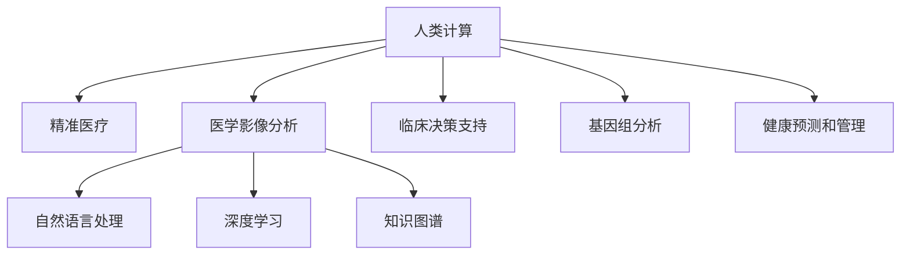

                 

# 医疗保健的未来：人类计算助力精准医疗

> 关键词：精准医疗,医疗AI,人类计算,大数据,深度学习

## 1. 背景介绍

### 1.1 问题由来
医疗保健是人类社会的重要基础，其服务的质量和效率直接关系到人们的健康和幸福感。然而，现有的医疗模式仍面临诸多挑战：
- **资源分配不均**：优质医疗资源集中在少数地区，偏远地区和贫困人群难以获得高质量的医疗服务。
- **诊断准确性不足**：依赖经验丰富的医生，误诊和漏诊率高，无法实现个体化精准医疗。
- **治疗方案单一**：药物治疗为主，个性化治疗方案不足，难以适应复杂病情。
- **数据分析瓶颈**：医疗数据量大、质量参差不齐，传统的数据处理方法难以有效利用。

为了解决上述问题，人类计算技术和人工智能的应用成为了近年来的热门话题。人类计算结合了人脑的强大推理能力和计算机的高速计算能力，有望在医疗保健领域发挥巨大作用，实现精准医疗的目标。

### 1.2 问题核心关键点
人类计算和人工智能在医疗保健中的关键应用点包括：
- **医学影像分析**：利用深度学习算法，对X光片、CT、MRI等医学影像进行自动分析和诊断。
- **病历信息处理**：通过自然语言处理技术，自动整理和抽取电子病历中的关键信息。
- **临床决策支持**：基于机器学习和知识图谱，为医生提供精准的诊断和治疗建议。
- **基因组分析**：利用大数据和深度学习，进行基因序列分析和疾病关联研究。
- **健康预测和管理**：基于时间序列分析和预测模型，对慢性病进行早期预警和管理。

## 2. 核心概念与联系

### 2.1 核心概念概述

为更好地理解人类计算和人工智能在医疗保健中的应用，本节将介绍几个关键概念：

- **人类计算(Human Computation)**：将人类复杂的认知能力与计算机的计算能力相结合，以解决复杂问题。人类计算强调利用人脑在识别、推理、情感等方面的优势，与计算机的计算速度和数据处理能力互补。

- **精准医疗(Precision Medicine)**：基于患者的基因组信息、环境因素、生活方式等多维数据，制定个性化治疗方案，实现高效、准确的医疗服务。精准医疗是大数据和人工智能技术的典型应用场景。

- **医学影像分析**：通过深度学习算法，对医学影像进行特征提取和分类，帮助医生快速准确定位病变区域，提高诊断准确性。

- **自然语言处理(NLP)**：利用自然语言处理技术，从非结构化的文本数据中提取关键信息，如电子病历、病历报告等，辅助医生进行病情分析和决策。

- **深度学习(Deep Learning)**：一种机器学习技术，通过多层神经网络进行特征学习和模式识别，适用于图像、语音、文本等多种类型的数据。

- **知识图谱(Knowledge Graph)**：一种结构化的语义网络，用于表示实体及其关系，为临床决策提供背景知识支持。

这些核心概念之间的联系可以通过以下Mermaid流程图来展示：



这个流程图展示了大规模人工智能技术和人类计算在医疗保健中的关键应用方向：

1. 人类计算作为整体框架，利用人工智能技术在不同领域进行具体应用。
2. 医学影像分析、自然语言处理、深度学习、知识图谱等具体技术，为精准医疗提供技术支持。
3. 基因组分析和健康预测与管理，为个体化治疗提供数据和算法基础。

## 3. 核心算法原理 & 具体操作步骤
### 3.1 算法原理概述

人类计算在医疗保健中的应用，主要依赖于人工智能算法在医学数据处理和分析中的广泛应用。具体而言，包括但不限于以下算法原理：

1. **深度学习算法**：利用多层神经网络，对医学影像、基因组数据等高维数据进行特征学习和模式识别，提高诊断和治疗的准确性。
2. **自然语言处理(NLP)**：利用文本分类、命名实体识别、情感分析等技术，自动提取和分析电子病历、临床报告等文本数据，辅助医生进行病情诊断和治疗决策。
3. **知识图谱(KG)**：构建医学领域知识图谱，通过推理机制为临床决策提供背景知识支持，提升医疗服务的专业性和准确性。
4. **强化学习(Reinforcement Learning)**：通过模拟和优化，不断改进医疗决策的优化策略，如个性化治疗方案的制定和优化。
5. **时间序列分析**：利用时间序列模型，对患者的健康数据进行预测和分析，实现对慢性病的早期预警和管理。

### 3.2 算法步骤详解

以医学影像分析为例，其核心步骤如下：

**Step 1: 数据准备**
- 收集和标注大量的医学影像数据，包括X光片、CT、MRI等。
- 数据集分为训练集、验证集和测试集，以评估模型性能。

**Step 2: 模型选择与训练**
- 选择适合的深度学习模型，如卷积神经网络(CNN)、ResNet等。
- 使用训练集对模型进行训练，并调整超参数如学习率、批大小等。

**Step 3: 模型评估与调优**
- 在验证集上评估模型性能，如准确率、召回率等。
- 根据评估结果调整模型结构、优化算法等，确保模型泛化能力。

**Step 4: 模型部署与测试**
- 将训练好的模型部署到生产环境中，用于实际的医学影像分析。
- 在测试集上进行测试，验证模型的实时性和准确性。

### 3.3 算法优缺点

基于深度学习的大规模医疗数据分析具有以下优点：
1. **高准确性**：深度学习算法在医学影像分析中，能够准确识别病变区域，提高诊断效率和准确性。
2. **自动化处理**：利用机器学习自动化处理大量数据，减少医生的工作负担，提高工作效率。
3. **大数据支持**：深度学习算法能够处理大规模、高维度的数据，挖掘更多潜在的知识。

同时，深度学习算法在医疗数据处理中也有以下局限性：
1. **数据需求高**：需要大量高质量的标注数据进行模型训练，获取数据成本较高。
2. **过拟合风险**：深度学习模型容易过拟合，特别是在数据集较小的情况下，影响模型泛化能力。
3. **可解释性不足**：深度学习模型通常被视为"黑盒"，难以解释其决策过程，影响医生对结果的信任。

### 3.4 算法应用领域

基于深度学习和大规模医疗数据分析，其应用领域包括但不限于：
- **医学影像分析**：包括X光片、CT、MRI、PET等医学影像的自动分析和诊断。
- **电子病历分析**：自动提取和分析电子病历中的关键信息，如诊断结果、治疗方案等。
- **基因组分析**：基于深度学习和大数据分析，进行基因序列分析和疾病关联研究。
- **临床决策支持**：利用知识图谱和自然语言处理技术，提供精准的诊断和治疗建议。
- **健康预测和管理**：利用时间序列分析和深度学习模型，对慢性病进行早期预警和管理。

## 4. 数学模型和公式 & 详细讲解 & 举例说明
### 4.1 数学模型构建

以医学影像分析为例，深度学习模型的数学模型构建如下：

假设医学影像数据为二维图像 $X \in \mathbb{R}^{H \times W \times C}$，其中 $H$ 和 $W$ 表示图像高度和宽度，$C$ 表示通道数（如RGB或灰度图）。模型输出 $Y \in \mathbb{R}^{H \times W}$，表示每个像素的诊断结果，如病变区域或正常区域。

深度学习模型的目标是最小化损失函数：

$$
\mathcal{L}(\theta) = \frac{1}{N} \sum_{i=1}^N \ell(X_i, Y_i; \theta)
$$

其中 $N$ 表示训练集大小，$\theta$ 为模型参数，$\ell$ 为损失函数，如交叉熵损失、均方误差等。

### 4.2 公式推导过程

以交叉熵损失为例，其推导过程如下：

设模型输出 $Y_i$ 的预测概率分布为 $\hat{P}(X_i)$，真实标签为 $P(X_i)$，则交叉熵损失函数为：

$$
\ell(X_i, Y_i; \theta) = -\sum_{j=1}^J p_{i,j} \log \hat{p}_{i,j}
$$

其中 $J$ 表示类别数，$p_{i,j}$ 表示真实标签为 $j$ 的概率，$\hat{p}_{i,j}$ 表示模型预测的 $j$ 类概率。

### 4.3 案例分析与讲解

假设有一个二分类问题，即判断医学影像中是否存在肿瘤。图像为灰度图，大小为 $256 \times 256$，通道数为1。

**Step 1: 数据准备**
- 收集并标注大量的医学影像数据，分为训练集、验证集和测试集。
- 数据集大小为 10,000 张影像，每个影像包含 $256 \times 256$ 个像素。

**Step 2: 模型选择与训练**
- 选择ResNet-50模型作为基础网络，使用交叉熵损失函数进行训练。
- 使用随机梯度下降(SGD)优化器，学习率为0.001，批大小为32。

**Step 3: 模型评估与调优**
- 在验证集上评估模型性能，如准确率、召回率、F1分数等。
- 调整学习率和批大小，确保模型在测试集上表现优异。

**Step 4: 模型部署与测试**
- 将训练好的模型部署到生产环境中，用于实际的医学影像分析。
- 在测试集上进行测试，验证模型的实时性和准确性。

## 5. 项目实践：代码实例和详细解释说明
### 5.1 开发环境搭建

在进行深度学习模型开发前，需要先准备好开发环境。以下是使用PyTorch进行深度学习模型开发的配置步骤：

1. 安装Anaconda：从官网下载并安装Anaconda，用于创建独立的Python环境。

2. 创建并激活虚拟环境：
```bash
conda create -n pytorch-env python=3.8 
conda activate pytorch-env
```

3. 安装PyTorch：根据CUDA版本，从官网获取对应的安装命令。例如：
```bash
conda install pytorch torchvision torchaudio cudatoolkit=11.1 -c pytorch -c conda-forge
```

4. 安装其他常用库：
```bash
pip install numpy scipy matplotlib tqdm scikit-learn
```

5. 安装TensorBoard：用于可视化模型的训练过程和性能指标。
```bash
pip install tensorboard
```

完成上述步骤后，即可在`pytorch-env`环境中开始模型开发。

### 5.2 源代码详细实现

我们以医学影像分析为例，给出使用PyTorch进行深度学习模型开发的代码实现。

```python
import torch
import torch.nn as nn
import torch.optim as optim
from torch.utils.data import DataLoader, Dataset

class MedicalImageDataset(Dataset):
    def __init__(self, x, y):
        self.x = x
        self.y = y
        
    def __len__(self):
        return len(self.x)
    
    def __getitem__(self, idx):
        x = self.x[idx]
        y = self.y[idx]
        return x, y

# 定义模型
class MedicalImageNet(nn.Module):
    def __init__(self):
        super(MedicalImageNet, self).__init__()
        self.conv1 = nn.Conv2d(1, 64, kernel_size=3, padding=1)
        self.pool = nn.MaxPool2d(kernel_size=2, stride=2)
        self.fc1 = nn.Linear(64*14*14, 128)
        self.fc2 = nn.Linear(128, 2)
        
    def forward(self, x):
        x = self.conv1(x)
        x = self.pool(x)
        x = torch.flatten(x, 1)
        x = self.fc1(x)
        x = nn.functional.relu(x)
        x = self.fc2(x)
        return x

# 加载数据
train_x = ...
train_y = ...
dev_x = ...
dev_y = ...
test_x = ...
test_y = ...

train_dataset = MedicalImageDataset(train_x, train_y)
dev_dataset = MedicalImageDataset(dev_x, dev_y)
test_dataset = MedicalImageDataset(test_x, test_y)

# 定义模型、优化器和损失函数
model = MedicalImageNet()
optimizer = optim.SGD(model.parameters(), lr=0.001, momentum=0.9)
criterion = nn.CrossEntropyLoss()

# 训练模型
for epoch in range(10):
    for batch_idx, (x, y) in enumerate(train_loader):
        optimizer.zero_grad()
        output = model(x)
        loss = criterion(output, y)
        loss.backward()
        optimizer.step()
        
        if (batch_idx+1) % 100 == 0:
            print('Train Epoch: {} [{}/{} ({:.0f}%)]\tLoss: {:.6f}'.format(
                epoch+1, batch_idx*len(x), len(train_loader.dataset),
                100. * batch_idx/len(train_loader), loss.item()))

# 评估模型
correct = 0
total = 0
with torch.no_grad():
    for batch_idx, (x, y) in enumerate(dev_loader):
        output = model(x)
        _, predicted = torch.max(output.data, 1)
        total += y.size(0)
        correct += (predicted == y).sum().item()

print('\nTest set: Accuracy: {} %'.format(100 * correct / total))
```

### 5.3 代码解读与分析

让我们再详细解读一下关键代码的实现细节：

**MedicalImageDataset类**：
- `__init__`方法：初始化数据集，包括输入和输出。
- `__len__`方法：返回数据集大小。
- `__getitem__`方法：对单个样本进行处理，返回模型输入和标签。

**MedicalImageNet模型**：
- `__init__`方法：定义模型结构，包括卷积层、池化层和全连接层。
- `forward`方法：实现前向传播，对输入数据进行特征提取和分类。

**训练过程**：
- 使用SGD优化器和交叉熵损失函数，对模型进行训练。
- 每个epoch循环训练所有批次数据，更新模型参数。

**评估过程**：
- 在测试集上评估模型性能，统计准确率。

## 6. 实际应用场景
### 6.1 智能影像分析系统

基于深度学习的大规模医疗数据分析技术，可以构建智能影像分析系统。该系统能够自动识别医学影像中的病变区域，辅助医生进行诊断。

具体而言，系统可以接入医院的PACS系统，对新入院患者的影像数据进行实时分析。系统首先通过预训练模型对影像进行特征提取，然后通过微调模型进行分类和定位，输出详细的病变报告。医生可以根据系统报告快速做出诊断决策，提高工作效率和准确性。

### 6.2 电子病历处理系统

自然语言处理技术在电子病历处理中有着广泛应用。通过文本分类、命名实体识别、情感分析等技术，系统可以自动整理和分析电子病历中的关键信息，如诊断结果、治疗方案等。

具体而言，系统可以提取电子病历中的诊断信息，通过分类模型判断病情类型，通过命名实体识别技术识别关键实体，如患者信息、诊断结果、治疗方案等。系统还可以分析病历中的情感信息，辅助医生进行情感分析，提高诊疗效果。

### 6.3 个性化治疗方案推荐系统

深度学习和大数据技术可以用于构建个性化治疗方案推荐系统，根据患者的基因信息、临床数据等，推荐最合适的治疗方案。

具体而言，系统可以收集患者的基因信息、病历数据、生活习惯等，通过深度学习模型分析患者的健康数据，推荐个性化的治疗方案。系统还可以根据患者的反馈，不断调整和优化推荐结果，实现精准医疗。

### 6.4 未来应用展望

随着深度学习和大数据技术的不断进步，人类计算在医疗保健中的应用前景广阔。未来，人类计算技术将在以下几个方向上继续发展：

1. **多模态医疗数据分析**：融合多种医疗数据（如医学影像、电子病历、基因数据等）进行综合分析，提供更加全面、精准的医疗服务。
2. **智能诊疗机器人**：结合自然语言处理、深度学习、知识图谱等技术，构建智能诊疗机器人，为患者提供实时诊断和治疗建议。
3. **个性化健康管理**：利用时间序列分析和深度学习模型，对慢性病进行早期预警和管理，提高患者的健康水平。
4. **医疗知识图谱**：构建大规模医疗知识图谱，为医生提供丰富的背景知识支持，提升诊疗的准确性和效率。

这些方向的发展将进一步推动医疗保健领域的智能化、个性化和精准化，为人类健康事业带来深远影响。

## 7. 工具和资源推荐
### 7.1 学习资源推荐

为了帮助开发者系统掌握深度学习和大规模医疗数据分析的理论基础和实践技巧，这里推荐一些优质的学习资源：

1. Deep Learning Specialization课程：由Coursera平台提供的深度学习课程，涵盖深度学习的基本原理和多种应用，适合初学者入门。
2. TensorFlow官方文档：TensorFlow的官方文档，提供详细的API文档、案例和教程，适合学习和实践。
3. PyTorch官方文档：PyTorch的官方文档，提供详细的API文档、案例和教程，适合学习和实践。
4. Hands-On Machine Learning with Scikit-Learn, Keras, and TensorFlow书籍：介绍机器学习和深度学习的基础知识和应用，适合深入学习。
5. AlphaGo论文：DeepMind的AlphaGo论文，介绍深度学习在围棋领域的成功应用，适合了解深度学习在复杂决策问题中的应用。

通过这些资源的学习，相信你一定能够快速掌握深度学习和大规模医疗数据分析的精髓，并用于解决实际的医疗问题。

### 7.2 开发工具推荐

高效的开发离不开优秀的工具支持。以下是几款用于深度学习和大规模医疗数据分析开发的常用工具：

1. PyTorch：基于Python的开源深度学习框架，灵活动态的计算图，适合快速迭代研究。
2. TensorFlow：由Google主导开发的开源深度学习框架，生产部署方便，适合大规模工程应用。
3. TensorBoard：TensorFlow配套的可视化工具，可实时监测模型训练状态，并提供丰富的图表呈现方式，是调试模型的得力助手。
4. Scikit-Learn：Python机器学习库，提供丰富的算法和数据预处理工具，适合进行深度学习的前端数据处理。
5. Pandas：Python数据处理库，提供高效的数据读写和处理能力，适合进行大规模医疗数据的处理和分析。
6. Jupyter Notebook：Python交互式编程环境，适合进行深度学习的实验和调试。

合理利用这些工具，可以显著提升深度学习和大规模医疗数据分析的开发效率，加快创新迭代的步伐。

### 7.3 相关论文推荐

深度学习和大规模医疗数据分析的研究源于学界的持续研究。以下是几篇奠基性的相关论文，推荐阅读：

1. AlphaGo论文：DeepMind的AlphaGo论文，介绍深度学习在围棋领域的成功应用，适合了解深度学习在复杂决策问题中的应用。
2. ImageNet论文：AlexNet论文，介绍深度学习在图像分类问题上的成功应用，适合了解深度学习在图像领域的应用。
3. ResNet论文：ResNet论文，介绍深度残差网络在图像分类问题上的成功应用，适合了解深度学习在图像领域的应用。
4. BERT论文：BERT论文，介绍预训练语言模型在文本分类问题上的成功应用，适合了解深度学习在文本领域的应用。
5. Kaggle比赛论文：Kaggle比赛的获奖论文，介绍深度学习在医疗数据分析和预测问题上的应用，适合了解深度学习在医疗领域的应用。

这些论文代表了大规模深度学习和大数据分析的研究脉络。通过学习这些前沿成果，可以帮助研究者把握学科前进方向，激发更多的创新灵感。

## 8. 总结：未来发展趋势与挑战
### 8.1 总结

本文对深度学习和大规模医疗数据分析在医疗保健中的应用进行了全面系统的介绍。首先阐述了深度学习和大规模医疗数据分析的研究背景和意义，明确了其在医疗保健中的重要价值。其次，从原理到实践，详细讲解了深度学习在医学影像分析、电子病历处理、个性化治疗方案推荐等具体任务中的应用。最后，本文还探讨了深度学习和大规模医疗数据分析的未来发展趋势和面临的挑战。

通过本文的系统梳理，可以看到，深度学习和大规模医疗数据分析在医疗保健中的应用前景广阔。这些技术的发展，将推动医疗保健领域的智能化、个性化和精准化，为人类健康事业带来深远影响。

### 8.2 未来发展趋势

展望未来，深度学习和大规模医疗数据分析将呈现以下几个发展趋势：

1. **多模态数据分析**：融合多种医疗数据（如医学影像、电子病历、基因数据等）进行综合分析，提供更加全面、精准的医疗服务。
2. **智能诊疗机器人**：结合自然语言处理、深度学习、知识图谱等技术，构建智能诊疗机器人，为患者提供实时诊断和治疗建议。
3. **个性化健康管理**：利用时间序列分析和深度学习模型，对慢性病进行早期预警和管理，提高患者的健康水平。
4. **医疗知识图谱**：构建大规模医疗知识图谱，为医生提供丰富的背景知识支持，提升诊疗的准确性和效率。

这些趋势凸显了深度学习和大规模医疗数据分析技术的巨大潜力。这些方向的探索发展，将进一步提升医疗保健服务的质量和效率，为人类健康事业带来深远影响。

### 8.3 面临的挑战

尽管深度学习和大规模医疗数据分析技术已经取得了瞩目成就，但在迈向更加智能化、普适化应用的过程中，仍面临诸多挑战：

1. **数据质量问题**：医疗数据质量参差不齐，难以保证数据的高质量和高一致性。需要进一步提高数据采集和处理标准。
2. **隐私和安全问题**：医疗数据的隐私和安全问题至关重要，需要严格控制数据访问和使用权限，保护患者隐私。
3. **计算资源限制**：大规模医疗数据分析需要高计算资源支持，如何提高模型训练和推理效率，降低计算成本，是一个重要课题。
4. **模型解释性和可控性**：深度学习模型的黑盒特性，难以解释其决策过程，影响医生对结果的信任。需要开发更加透明和可控的模型。
5. **多学科融合问题**：医疗数据分析需要多学科协作，包括医学、计算机科学、统计学等，如何有效融合各学科知识，提高整体效果，是一个重要课题。

这些挑战需要通过技术创新和跨学科协作，逐步解决，才能实现深度学习和大规模医疗数据分析技术的规模化落地。

### 8.4 研究展望

面向未来，深度学习和大规模医疗数据分析技术需要在以下几个方面寻求新的突破：

1. **提高数据质量**：进一步提高医疗数据的采集和处理标准，确保数据的高质量和一致性。
2. **增强模型解释性**：开发更加透明和可控的深度学习模型，提高模型的解释性和可控性，增强医生的信任。
3. **融合多学科知识**：结合医学、计算机科学、统计学等多学科知识，构建更加全面和精准的深度学习模型。
4. **优化计算资源**：提高深度学习模型的训练和推理效率，降低计算成本，推动技术普及。
5. **多模态数据分析**：融合多种医疗数据，提供更加全面和精准的医疗服务。

这些研究方向的探索，将进一步推动深度学习和大规模医疗数据分析技术的规模化落地，为医疗保健事业带来深远影响。

## 9. 附录：常见问题与解答

**Q1：深度学习在医疗数据分析中有什么优势？**

A: 深度学习在医疗数据分析中的优势主要包括：
1. **高准确性**：深度学习算法在图像、语音、文本等数据处理中表现优异，能够提高诊断和治疗的准确性。
2. **自动化处理**：深度学习算法能够自动处理大量数据，减少医生的工作负担，提高工作效率。
3. **大数据支持**：深度学习算法能够处理大规模、高维度的数据，挖掘更多潜在的知识。

**Q2：深度学习在医疗数据分析中可能面临哪些挑战？**

A: 深度学习在医疗数据分析中可能面临以下挑战：
1. **数据需求高**：需要大量高质量的标注数据进行模型训练，获取数据成本较高。
2. **过拟合风险**：深度学习模型容易过拟合，特别是在数据集较小的情况下，影响模型泛化能力。
3. **可解释性不足**：深度学习模型通常被视为"黑盒"，难以解释其决策过程，影响医生对结果的信任。

**Q3：如何提高深度学习模型的解释性？**

A: 提高深度学习模型的解释性可以从以下几个方面进行：
1. **可视化技术**：利用可视化工具展示模型的中间特征和决策过程，帮助医生理解模型输出。
2. **局部可解释性**：开发局部可解释的模型，如LIME、SHAP等，帮助医生理解特定样本的决策过程。
3. **模型融合**：结合传统的统计方法和深度学习模型，提高模型的整体可解释性。

**Q4：如何在医疗数据分析中保护患者隐私？**

A: 在医疗数据分析中保护患者隐私可以从以下几个方面进行：
1. **数据匿名化**：对医疗数据进行匿名化处理，去除患者的个人信息。
2. **数据加密**：对医疗数据进行加密处理，防止数据泄露。
3. **访问控制**：严格控制数据访问和使用权限，确保只有授权人员能够访问数据。
4. **数据共享协议**：制定数据共享协议，明确数据使用范围和责任。

通过这些措施，可以有效保护患者的隐私，确保医疗数据分析的安全性。

**Q5：深度学习在医疗数据分析中的未来应用前景如何？**

A: 深度学习在医疗数据分析中的未来应用前景广阔，主要体现在以下几个方面：
1. **多模态数据分析**：融合多种医疗数据（如医学影像、电子病历、基因数据等）进行综合分析，提供更加全面、精准的医疗服务。
2. **智能诊疗机器人**：结合自然语言处理、深度学习、知识图谱等技术，构建智能诊疗机器人，为患者提供实时诊断和治疗建议。
3. **个性化健康管理**：利用时间序列分析和深度学习模型，对慢性病进行早期预警和管理，提高患者的健康水平。
4. **医疗知识图谱**：构建大规模医疗知识图谱，为医生提供丰富的背景知识支持，提升诊疗的准确性和效率。

这些方向的发展将进一步推动医疗保健领域的智能化、个性化和精准化，为人类健康事业带来深远影响。

---

作者：禅与计算机程序设计艺术 / Zen and the Art of Computer Programming

