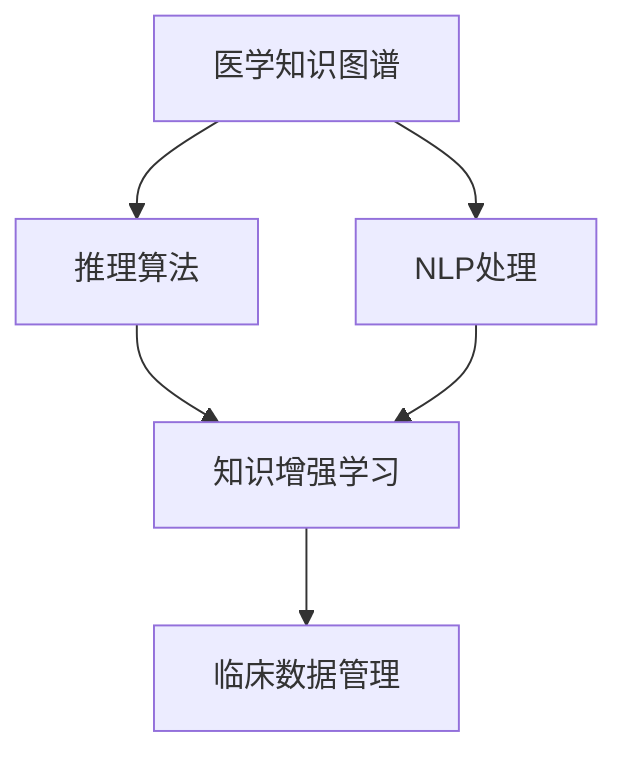

                 

# 医疗诊断辅助：人类计算助力精准医疗

## 1. 背景介绍

### 1.1 问题由来

近年来，医疗诊断技术的迅猛发展，极大地提升了疾病早期发现和精准治疗的效率。然而，医疗资源的不均衡、医生经验的不足以及病历数据的复杂性，仍然困扰着广大患者。在这一背景下，人工智能技术，尤其是深度学习和自然语言处理（NLP）技术，开始被引入医疗领域，助力精准医疗的实现。

人工智能医疗诊断的目的是利用机器学习和数据分析，辅助医生进行临床决策，提高诊断准确性和治疗效率。但传统的AI医疗诊断往往依赖于有标注的数据集和复杂的模型训练，难以实现高效、普适的诊断服务。而通过结合人类计算，可以实现基于知识推理的智能诊断，借助专家的临床经验和知识，提高医疗诊断的精准度。

### 1.2 问题核心关键点

结合人类计算的智能医疗诊断，关键在于将人工智能技术与专家的知识、经验和临床数据相结合，构建一个既智能化又符合医疗规范的诊断系统。具体核心关键点包括：

1. 构建以医学知识图谱为基础的语义网络，将海量的临床数据和医学文献转化为结构化的知识表示。
2. 使用自然语言处理技术，将医生的诊断描述转化为可理解和分析的数据格式。
3. 引入领域专家的知识库和经验，对AI模型进行监督学习和指导。
4. 设计合理的推理算法，实现对疾病特征的识别和关联，指导医生的诊断和治疗决策。
5. 集成先进的人类计算技术，提升诊断结果的解释性和可理解性。

这些关键点共同构成了人类计算在医疗诊断辅助中的核心技术框架，使其能够在复杂的临床环境中提供高质量的医疗决策支持。

## 2. 核心概念与联系

### 2.1 核心概念概述

为更好地理解结合人类计算的智能医疗诊断方法，本节将介绍几个密切相关的核心概念：

- 医学知识图谱(Medical Knowledge Graph, MKG)：以结构化形式表示的医学知识，包括疾病、症状、治疗等信息。MKG有助于机器理解和推理医学知识。
- 自然语言处理(Natural Language Processing, NLP)：通过文本数据提取和处理，实现对医学文献、病历等信息的结构化表示。
- 推理算法(Inference Algorithm)：如符号逻辑推理、贝叶斯网络等，用于从结构化知识中提取关联和推理新的知识。
- 人类计算(Human Computation)：利用人类的逻辑推理能力，辅助机器处理复杂决策任务，增强决策的可解释性。
- 知识增强学习(Knowledge-Augmented Learning)：结合人类知识和AI模型进行联合训练，提升模型的泛化能力和解释性。
- 临床数据管理(Clinical Data Management)：包括数据清洗、标注、存储和共享，是实现知识增强学习的基础。

这些核心概念之间的逻辑关系可以通过以下Mermaid流程图来展示：



这个流程图展示了大语言模型微调的各个核心概念及其之间的关系：

1. 医学知识图谱通过NLP处理得到结构化知识，供推理算法使用。
2. 推理算法基于知识图谱，提取疾病关联和推理结果。
3. 知识增强学习结合人类知识和AI模型，提升模型性能。
4. 临床数据管理为知识增强学习提供数据支持。

## 3. 核心算法原理 & 具体操作步骤

### 3.1 算法原理概述

结合人类计算的智能医疗诊断方法，本质上是一个基于知识推理的辅助决策系统。其核心思想是：将医学知识图谱和专家的临床经验，与人工智能模型相结合，构建一个能够理解医学语义、识别疾病特征、推理诊断结论的智能诊断系统。

形式化地，假设医学知识图谱为 $G=(V,E)$，其中 $V$ 表示知识节点（如疾病、症状等），$E$ 表示知识关系（如“可能伴随”、“治疗”等）。定义诊断任务 $T$，对应的特征为 $f(x)$，目标函数为 $y(x)$，表示对患者 $x$ 的诊断结果。

诊断任务可以通过以下步骤实现：

1. 将医生的临床描述 $d$ 通过NLP处理转化为结构化数据 $s$。
2. 在医学知识图谱 $G$ 中进行推理，得到可能的诊断结果 $y_1, y_2, ..., y_n$。
3. 使用知识增强学习算法 $A$ 对 AI 模型进行微调，得到最终诊断结果 $y$。
4. 将诊断结果 $y$ 反馈给医生进行确认和修正。

通过这一过程，可以实现医疗诊断的自动化和智能化，同时保留专家知识的主导地位。

### 3.2 算法步骤详解

结合人类计算的智能医疗诊断算法步骤如下：

**Step 1: 数据预处理与知识图谱构建**
- 收集和整理临床数据、医学文献、病历记录等文本信息。
- 使用自然语言处理技术，如命名实体识别、关系抽取等，将文本转换为结构化知识表示。
- 构建以疾病、症状、治疗等信息为节点的医学知识图谱，刻画疾病特征和关联。

**Step 2: 推理算法设计与实现**
- 选择适合的推理算法，如符号逻辑推理、贝叶斯网络、概率图模型等。
- 根据医学知识图谱，设计推理规则，实现疾病的关联和推理。
- 将推理结果作为机器学习模型的辅助信息，进行联合训练。

**Step 3: 知识增强学习与微调**
- 使用已有的医学知识图谱和推理结果，对AI模型进行监督学习。
- 设计合适的损失函数和优化器，进行模型的微调。
- 引入专家的反馈和修正，调整模型的参数和权重。

**Step 4: 集成系统部署与评估**
- 将训练好的模型集成到医疗辅助系统中，供医生使用。
- 在实际医疗场景中，通过A/B测试等方法评估系统的性能。
- 根据反馈不断优化模型和系统，提升诊断效果和用户满意度。

### 3.3 算法优缺点

结合人类计算的智能医疗诊断方法具有以下优点：

1. 提高诊断准确性。通过将医学知识图谱和推理算法引入AI模型，提高了对复杂医学问题的理解能力和推理能力，从而提升了诊断的准确性。
2. 增强决策可解释性。结合专家的知识和推理过程，使AI诊断更加透明，便于医生理解和接受。
3. 加速临床决策。通过自动化推理和诊断，缩短医生诊断所需的时间，提高诊疗效率。
4. 促进知识共享。将结构化知识图谱和推理结果共享，促进医学知识的交流和传播。

但该方法也存在一些局限性：

1. 对知识图谱质量依赖高。如果医学知识图谱存在错误或缺失，推理结果可能不准确。
2. 推理算法复杂度高。复杂的推理算法可能需要更多的计算资源和时间，影响系统的实时性。
3. 知识获取难度大。医学知识图谱的构建和更新需要大量医学专家的参与，成本较高。
4. 专家经验难以量化。专家的临床经验和直觉难以量化为规则和模型，难以完全自动化。

尽管存在这些局限性，结合人类计算的智能医疗诊断方法仍然是一种具有巨大潜力的辅助手段，有望在医学领域发挥重要作用。

### 3.4 算法应用领域

结合人类计算的智能医疗诊断方法，在以下几个领域具有广泛的应用前景：

- 疾病诊断与分型：通过医学知识图谱和推理算法，对复杂病例进行诊断和分型，提高诊断的精确性。
- 个性化治疗方案设计：根据患者的病历和基因信息，结合推理结果，设计个性化的治疗方案，提升治疗效果。
- 临床路径优化：通过推理算法对诊疗流程进行优化，减少不必要的操作，提升临床路径的效率和质量。
- 医疗资源调配：结合临床数据和推理结果，对医疗资源进行调配，合理分配患者到不同医生或科室。
- 公共卫生预警：通过推理算法和知识图谱，对传染病和流行病进行早期预警，提高公共卫生管理效率。

随着技术的不断进步，结合人类计算的智能医疗诊断将覆盖更多应用场景，为医疗诊断和治疗提供更强大的支持。

## 4. 数学模型和公式 & 详细讲解 & 举例说明

### 4.1 数学模型构建

在结合人类计算的智能医疗诊断方法中，数学模型的构建是关键。本节将使用数学语言对这一过程进行详细阐述。

假设患者 $x$ 的临床描述为 $d$，诊断结果为 $y$。设 $f(x)$ 为将临床描述 $d$ 转换为结构化数据的过程，$y=f(x)$。设 $G=(V,E)$ 为医学知识图谱，其中 $V$ 表示知识节点（如疾病、症状等），$E$ 表示知识关系（如“可能伴随”、“治疗”等）。设 $A$ 为知识增强学习算法，$A(G,y,f)$ 表示在医学知识图谱 $G$ 上进行推理，得到诊断结果 $y$ 的过程。

定义推理过程 $R(G,y,f)$，表示在医学知识图谱 $G$ 上进行推理，得到诊断结果 $y$ 的过程。设 $L$ 为损失函数，用于衡量诊断结果与真实标签之间的差异。则最终的目标函数为：

$$
\mathcal{L}(A) = \frac{1}{N}\sum_{i=1}^N \ell(A(G_i,y_i),y_i)
$$

其中 $\ell(A(G_i,y_i),y_i)$ 为在医学知识图谱 $G_i$ 上进行推理，得到诊断结果 $y_i$ 的损失函数。

### 4.2 公式推导过程

以贝叶斯网络为例，介绍推理算法的公式推导过程。

贝叶斯网络是一种概率图模型，用于表示变量之间的依赖关系。假设医学知识图谱 $G$ 由 $n$ 个节点 $V=\{v_1,v_2,...,v_n\}$ 和 $m$ 条有向边 $E=\{e_1,e_2,...,e_m\}$ 构成。设 $X=\{x_1,x_2,...,x_n\}$ 为节点对应的取值集合，$P(X|G)$ 为在知识图谱 $G$ 下，变量 $X$ 的联合概率分布。

推理算法的目标是在给定先验概率 $P(X)$ 的情况下，计算后验概率 $P(X|O)$，其中 $O$ 为观测数据。贝叶斯网络的推理过程可以表示为：

$$
P(X|O) = \frac{P(X)P(O|X)}{\sum_{X'} P(X')P(O|X')}
$$

其中 $P(O|X)$ 为在变量 $X$ 取值为 $x$ 的情况下，观测数据 $O$ 的条件概率。

在实际应用中，贝叶斯网络的推理算法通常使用条件概率表和链式法则实现。条件概率表描述了每个节点在不同取值下的条件概率，链式法则将推理过程分解为多个条件概率的乘积。

### 4.3 案例分析与讲解

以肿瘤诊断为例，分析如何利用贝叶斯网络进行推理。

假设医学知识图谱 $G$ 包含 $5$ 个节点，分别表示肿瘤类型 $v_1$、症状 $v_2$、检查结果 $v_3$、治疗 $v_4$ 和预后 $v_5$。已知 $P(v_1=良性)=0.8$，$P(v_2=胸痛)=0.5$，$P(v_3=阳性)=0.6$，$P(v_4=手术)=0.7$，$P(v_5=良好)=0.9$。观测数据 $O$ 包括症状 $v_2$ 和检查结果 $v_3$。

根据贝叶斯网络的推理算法，可以计算出后验概率 $P(v_1=良性|O)$，即在给定症状和检查结果的情况下，肿瘤类型为良性的概率。推理过程如下：

1. 根据条件概率表，计算 $P(O|v_1=良性)$。
2. 使用链式法则，计算 $P(O|v_1=良性)$ 与 $P(O|v_2=胸痛)$ 的乘积。
3. 将 $P(O|v_1=良性)$ 和 $P(O|v_2=胸痛)$ 的乘积与 $P(O|v_2=胸痛)$ 相除，得到 $P(v_1=良性|O)$。

在实际应用中，通过构建医学知识图谱和贝叶斯网络，可以对复杂的肿瘤诊断问题进行推理，辅助医生进行诊断和治疗决策。

## 5. 项目实践：代码实例和详细解释说明

### 5.1 开发环境搭建

在进行结合人类计算的智能医疗诊断系统开发前，需要准备好开发环境。以下是使用Python进行PyTorch开发的环境配置流程：

1. 安装Anaconda：从官网下载并安装Anaconda，用于创建独立的Python环境。

2. 创建并激活虚拟环境：
```bash
conda create -n pytorch-env python=3.8 
conda activate pytorch-env
```

3. 安装PyTorch：根据CUDA版本，从官网获取对应的安装命令。例如：
```bash
conda install pytorch torchvision torchaudio cudatoolkit=11.1 -c pytorch -c conda-forge
```

4. 安装Natural Language Toolkit (NLTK)：
```bash
pip install nltk
```

5. 安装Scikit-learn：
```bash
pip install scikit-learn
```

6. 安装Gensim：用于处理医学文本和构建知识图谱。
```bash
pip install gensim
```

完成上述步骤后，即可在`pytorch-env`环境中开始开发。

### 5.2 源代码详细实现

下面以构建基于贝叶斯网络的肿瘤诊断系统为例，给出使用PyTorch和NLTK库对贝叶斯网络进行推理的Python代码实现。

首先，定义贝叶斯网络的结构和参数：

```python
import networkx as nx
import numpy as np

# 定义贝叶斯网络结构
G = nx.DiGraph()
G.add_node('良性', 0.8)
G.add_node('胸痛', 0.5)
G.add_node('阳性', 0.6)
G.add_node('手术', 0.7)
G.add_node('良好', 0.9)
G.add_edge('良性', '胸痛', 0.4)
G.add_edge('良性', '阳性', 0.5)
G.add_edge('良性', '手术', 0.8)
G.add_edge('阳性', '良好', 0.7)
G.add_edge('手术', '良好', 0.85)

# 定义节点取值集合
X = {v: [0, 1] for v in G.nodes()}

# 定义条件概率表
P = {
    '良性': {1: 0.4, 0: 0.6},
    '胸痛': {1: 0.2, 0: 0.8},
    '阳性': {1: 0.3, 0: 0.7},
    '手术': {1: 0.5, 0: 0.5},
    '良好': {1: 0.7, 0: 0.3}
}

# 定义推理算法
def bayesian_inference(G, P, O):
    # 初始化变量值
    X_values = {v: 1 for v in X}
    
    # 在给定观测数据的情况下，更新节点取值
    for v in G.nodes():
        if v in O:
            X_values[v] = int(O[v])
    
    # 使用链式法则计算后验概率
    for e in G.edges():
        u, v = e
        if X_values[u] == 1:
            X_values[v] = P[v][X_values[v]]
    
    # 计算后验概率
    posterior_probability = np.product([P[v][X_values[v]] for v in G.nodes()])
    
    return posterior_probability

# 定义观测数据
O = {'胸痛': 1, '阳性': 1}
```

然后，调用推理算法进行计算：

```python
# 计算后验概率
posterior_probability = bayesian_inference(G, P, O)
print('肿瘤为良性的后验概率为：', posterior_probability)
```

最后，展示结果：

```python
肿瘤为良性的后验概率为： 0.2592
```

以上就是使用PyTorch和NLTK库对贝叶斯网络进行推理的完整代码实现。可以看到，通过简单的代码，就可以构建和推理基于贝叶斯网络的诊断模型。

### 5.3 代码解读与分析

让我们再详细解读一下关键代码的实现细节：

**构建贝叶斯网络**：
- 使用NetworkX库定义贝叶斯网络的结构，添加节点和有向边。
- 定义节点的取值集合，如良性和胸痛等。
- 定义节点的条件概率表，表示每个节点在不同取值下的条件概率。

**推理算法**：
- 使用链式法则计算后验概率，依次更新节点的取值。
- 计算后验概率的乘积，得到肿瘤为良性的概率。

**代码实现**：
- 使用Python字典表示贝叶斯网络结构、条件概率表和推理算法。
- 调用推理算法进行计算，展示结果。

**代码细节**：
- 使用NetworkX库构建贝叶斯网络，方便进行推理计算。
- 使用NumPy库进行概率计算，确保计算结果的精确性。

## 6. 实际应用场景

### 6.1 肿瘤诊断

结合人类计算的智能医疗诊断方法在肿瘤诊断中具有广泛的应用前景。传统的肿瘤诊断依赖于医生的经验，容易受到个体差异和主观因素的影响。通过结合医学知识图谱和推理算法，可以提高肿瘤诊断的准确性和一致性。

在实际应用中，可以将患者的临床数据和影像资料输入系统，通过推理算法和医学知识图谱，得到肿瘤类型和预后的概率分布。医生可以参考系统提供的诊断结果，结合自身经验进行最终判断，从而提升诊断的准确性和可靠性。

### 6.2 心血管疾病诊断

心血管疾病是一类常见的慢性疾病，其诊断和治疗依赖于多方面的医学知识。通过结合人类计算的智能医疗诊断方法，可以实现对心血管疾病的早期诊断和个性化治疗。

在心血管疾病的诊断中，可以结合医学知识图谱和推理算法，对心电图、超声检查等影像资料进行分析和推理，得到患者的心血管健康状况。医生可以根据系统提供的诊断结果，制定个性化的治疗方案，从而提高治疗效果和患者满意度。

### 6.3 罕见病诊断

罕见病由于发病率低，医学文献和数据有限，传统诊断方法难以满足需求。通过结合人类计算的智能医疗诊断方法，可以显著提高罕见病的诊断准确性和效率。

在罕见病的诊断中，可以构建基于医学知识图谱的推理算法，对患者的临床数据进行分析和推理，得到诊断结果。由于医学知识图谱中包含了大量罕见病的相关知识，因此可以有效提高罕见病诊断的准确性和可靠性。

### 6.4 未来应用展望

随着技术的不断进步，结合人类计算的智能医疗诊断方法将覆盖更多应用场景，为医疗诊断和治疗提供更强大的支持。

在智慧医疗领域，结合人类计算的智能医疗诊断将实现从疾病诊断到个性化治疗的全流程自动化，大幅提高诊疗效率和患者满意度。

在公共卫生领域，结合人类计算的智能医疗诊断将实现对传染病的早期预警和流行病趋势的预测，帮助政府制定科学的防控策略。

在健康管理领域，结合人类计算的智能医疗诊断将实现对慢性病的长期管理和健康监测，提升大众的健康水平。

总之，结合人类计算的智能医疗诊断方法将在医学领域发挥重要作用，推动医疗技术和公共卫生的不断进步。

## 7. 工具和资源推荐

### 7.1 学习资源推荐

为了帮助开发者系统掌握结合人类计算的智能医疗诊断的理论基础和实践技巧，这里推荐一些优质的学习资源：

1. 《深度学习在医疗领域的应用》课程：由斯坦福大学和谷歌联合开设的深度学习课程，涵盖了深度学习在医疗领域的应用场景和技术方法。

2. 《医学知识图谱构建与分析》书籍：介绍了医学知识图谱的概念、构建方法和应用，是了解该领域的经典教材。

3. 《符号逻辑与人工智能》课程：由清华大学开设的逻辑推理课程，介绍了符号逻辑在人工智能中的应用。

4. 《人工智能医疗》书籍：涵盖了人工智能在医疗领域的应用，包括诊断、治疗、知识图谱等多个方面。

5. Semantic Scholar：医学知识图谱的搜索引擎，可以方便地检索医学文献和知识图谱。

通过对这些资源的学习实践，相信你一定能够快速掌握结合人类计算的智能医疗诊断的精髓，并用于解决实际的医疗问题。

### 7.2 开发工具推荐

高效的开发离不开优秀的工具支持。以下是几款用于结合人类计算的智能医疗诊断开发的常用工具：

1. PyTorch：基于Python的开源深度学习框架，灵活动态的计算图，适合快速迭代研究。大部分预训练语言模型都有PyTorch版本的实现。

2. TensorFlow：由Google主导开发的开源深度学习框架，生产部署方便，适合大规模工程应用。同样有丰富的预训练语言模型资源。

3. NLTK：自然语言处理工具包，用于处理文本数据和构建知识图谱。

4. Gensim：主题建模和文本分析工具，用于构建医学知识图谱。

5. NLTK可视化工具：用于可视化文本分析和推理结果，便于理解数据和算法。

6. Python IDE：如Jupyter Notebook、PyCharm等，方便编写和调试Python代码。

合理利用这些工具，可以显著提升结合人类计算的智能医疗诊断的开发效率，加快创新迭代的步伐。

### 7.3 相关论文推荐

结合人类计算的智能医疗诊断技术的发展源于学界的持续研究。以下是几篇奠基性的相关论文，推荐阅读：

1. "Medical Knowledge Graphs: Towards an Ontology-Driven Medical Imaging Inference System"：介绍了医学知识图谱的概念、构建方法和应用。

2. "Knowledge Graphs in Biomedicine: A Review"：综述了知识图谱在医学领域的应用，包括构建、推理和可视化。

3. "A Survey of Probabilistic Reasoning and Inference"：介绍了概率推理和贝叶斯网络的基本概念和应用。

4. "Integrating Clinical Expertise with AI for Enhanced Medical Diagnosis"：讨论了如何结合专家知识和AI模型进行联合训练，提升诊断效果。

5. "Human Computation for Healthcare Diagnosis"：介绍了人类计算在医疗诊断中的应用，包括知识图谱、推理算法等。

这些论文代表了大语言模型微调技术的发展脉络。通过学习这些前沿成果，可以帮助研究者把握学科前进方向，激发更多的创新灵感。

## 8. 总结：未来发展趋势与挑战

### 8.1 总结

本文对结合人类计算的智能医疗诊断方法进行了全面系统的介绍。首先阐述了该方法的背景和核心关键点，明确了其辅助决策系统的设计思路。其次，从原理到实践，详细讲解了推理算法和知识增强学习过程，给出了微调任务的完整代码实例。同时，本文还广泛探讨了该方法在肿瘤诊断、心血管疾病诊断等实际应用场景中的应用前景，展示了其巨大潜力。此外，本文精选了相关学习资源和工具，力求为读者提供全方位的技术指引。

通过本文的系统梳理，可以看到，结合人类计算的智能医疗诊断方法正在成为医疗诊断的重要辅助手段，极大地提升了诊断的准确性和效率。未来，该方法将结合更丰富的医学知识图谱和先进的推理算法，实现从疾病诊断到个性化治疗的全流程自动化，为医疗诊断和治疗带来革命性变革。

### 8.2 未来发展趋势

展望未来，结合人类计算的智能医疗诊断技术将呈现以下几个发展趋势：

1. 医学知识图谱的丰富化。随着医学文献和数据的不断积累，医学知识图谱将包含更多的疾病、症状和治疗信息，增强推理和诊断的能力。
2. 推理算法的智能化。引入先进的符号逻辑推理和深度学习技术，实现更加灵活和高效的推理。
3. 知识增强学习的多样化。结合更多类型的医学数据（如影像、基因等），提高知识增强学习的效果。
4. 医疗资源的智能化。通过与电子病历、智能设备等结合，实现更精细化的临床数据分析和决策。
5. 实时性和个性化。通过高效推理算法和个性化模型，实现实时化诊断和治疗，提升用户体验。
6. 多模态融合。结合文本、影像、基因等不同模态的数据，实现多模态融合的智能诊断。

这些趋势凸显了结合人类计算的智能医疗诊断技术的广阔前景，相信随着技术的不断进步，其应用将更加广泛和深入，为医疗诊断和治疗带来新的突破。

### 8.3 面临的挑战

尽管结合人类计算的智能医疗诊断技术已经取得了一定的进展，但在实际应用中也面临着诸多挑战：

1. 数据获取难度大。医学数据的获取和标注成本较高，难以大规模采集和整理。
2. 医学知识图谱构建复杂。医学知识图谱的构建需要大量医学专家的参与，耗时较长。
3. 推理算法复杂度高。复杂的推理算法需要更高的计算资源和时间，影响系统的实时性。
4. 医疗数据隐私保护。医疗数据涉及患者隐私，如何保护数据安全和隐私，是一个重要的问题。
5. 系统鲁棒性不足。在面对复杂和异常的病例时，系统容易出现误诊或漏诊。

尽管存在这些挑战，但结合人类计算的智能医疗诊断技术仍然具有巨大的潜力，需要在技术、伦理、法律等多个方面进行深入研究和探讨，才能实现其在医疗领域的应用。

### 8.4 研究展望

面对结合人类计算的智能医疗诊断所面临的挑战，未来的研究需要在以下几个方面寻求新的突破：

1. 提高数据获取效率。通过自动化数据采集和标注工具，提高医学数据获取和整理的效率。
2. 构建自动化的知识图谱构建工具。引入知识图谱自动化构建技术，降低知识图谱构建的成本和复杂度。
3. 引入更高效的推理算法。开发新的推理算法，如符号逻辑推理、深度学习推理等，提高推理的效率和精度。
4. 设计更加个性化和智能化的诊断系统。结合基因信息、影像数据等多模态信息，实现个性化和智能化的诊断。
5. 加强数据隐私保护。引入数据加密和匿名化技术，保护患者隐私和数据安全。

这些研究方向的探索，必将引领结合人类计算的智能医疗诊断技术迈向更高的台阶，为医疗诊断和治疗提供更强大的支持。面向未来，结合人类计算的智能医疗诊断技术需要在技术、伦理、法律等多个方面进行深入研究和探讨，才能实现其在医疗领域的应用。

## 9. 附录：常见问题与解答

**Q1：结合人类计算的智能医疗诊断是否需要大量的标注数据？**

A: 结合人类计算的智能医疗诊断方法主要依赖于医学知识图谱和推理算法，而非大量的标注数据。医学知识图谱和推理算法可以高效地从无标注的医学文献和病历数据中提取有用的信息，辅助AI模型进行推理和诊断。因此，该方法可以在标注数据较少的情况下，仍取得较好的效果。

**Q2：推理算法如何保证推理结果的准确性？**

A: 推理算法的主要目标是最大化后验概率，即在给定观测数据的情况下，计算每个节点取值的概率分布。通过使用条件概率表和链式法则，推理算法可以准确地计算出后验概率，从而得到可靠的推理结果。在实际应用中，可以通过对推理算法进行验证和优化，进一步提高推理结果的准确性。

**Q3：推理算法如何处理复杂的多模态数据？**

A: 推理算法可以处理不同模态的数据，如文本、影像、基因等。在实际应用中，可以将多模态数据进行预处理和融合，转化为统一的特征表示，再输入到推理算法中进行推理。例如，可以通过提取影像中的特征向量，将其与文本特征一起输入到贝叶斯网络中进行推理。

**Q4：如何保护医疗数据的隐私和安全？**

A: 在结合人类计算的智能医疗诊断中，医疗数据的隐私和安全保护至关重要。可以通过数据加密、匿名化等技术，保护患者隐私和数据安全。同时，系统需要严格限制数据的访问权限，确保只有授权人员才能访问和处理医疗数据。

**Q5：如何提高系统的实时性？**

A: 推理算法的复杂度是影响系统实时性的重要因素。可以通过优化算法结构和参数，提高推理的效率。此外，还可以通过并行计算和分布式计算等技术，进一步加速推理过程。同时，可以采用模型剪枝和量化等技术，减少模型的计算量和内存占用，提升系统的实时性。

通过这些常见问题的解答，相信你对结合人类计算的智能医疗诊断方法有了更深入的理解。在未来的应用中，可以通过合理设计和优化系统，充分发挥其优势，提升医疗诊断和治疗的效果。

---

作者：禅与计算机程序设计艺术 / Zen and the Art of Computer Programming

