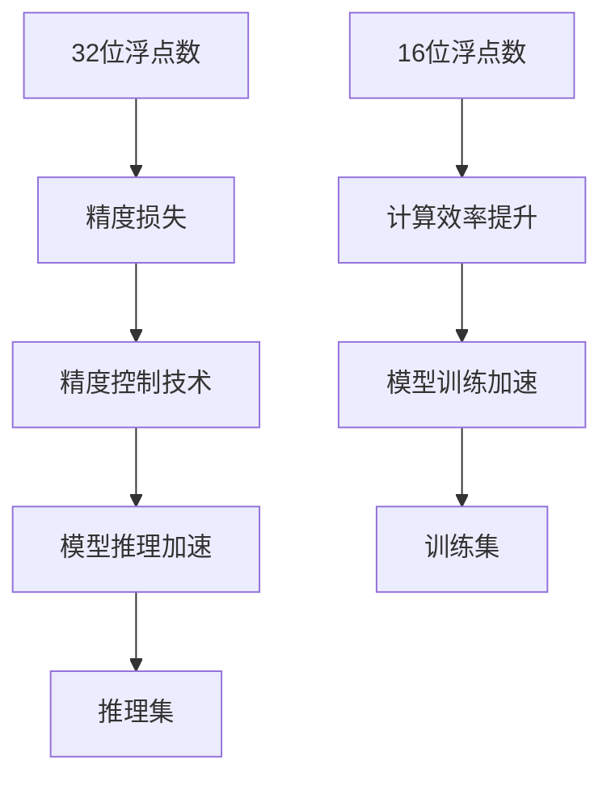

                 

# 半精度训练：AI模型加速的法宝

> 关键词：半精度训练, AI模型, 深度学习, 加速, 精度, 计算效率, 浮点数, 浮点化

## 1. 背景介绍

### 1.1 问题由来

在深度学习模型训练过程中，由于对浮点数的广泛应用，模型需要大量的计算资源和存储空间。特别是对于大规模模型，如BERT、GPT等，浮点数的需求更加庞大，这使得训练和推理过程成本高昂，资源消耗巨大。为了解决这一问题，半精度训练（FP16，即16位浮点数训练）作为一种有效的降低资源消耗的方案，逐渐受到广泛关注。

半精度训练通过将模型中的浮点数参数从32位（单精度，即float32）降为16位（半精度，即float16），大幅减少了存储需求和计算开销。由于半精度数的精度低于单精度数，因此模型训练过程中可能会引入一定程度的精度损失，但这种损失可以通过额外的技巧来最小化，从而在保证模型性能的前提下，大幅提升训练和推理速度。

### 1.2 问题核心关键点

半精度训练的核心在于：
1. 如何将模型的32位浮点参数转换为16位浮点参数，并确保转换过程中的精度损失最小化。
2. 如何在半精度下进行模型训练和推理，并保持模型的性能不致降低。
3. 如何优化模型架构和训练过程，充分发挥半精度训练的加速效果。

这些核心问题在很大程度上决定了半精度训练的效果和适用范围。

### 1.3 问题研究意义

半精度训练的研究意义在于：
1. 降低训练和推理成本。半精度训练可以显著降低计算资源的消耗，加快模型的训练和推理速度。
2. 提升计算效率。半精度训练可以处理更大规模的数据集，支持更复杂的模型架构。
3. 扩展深度学习的应用场景。半精度训练可以使得深度学习模型在更多资源受限的场景中得到应用。
4. 推动深度学习技术发展。半精度训练的研究和应用将加速深度学习技术在硬件、软件、算法等各方面的进步。

## 2. 核心概念与联系

### 2.1 核心概念概述

为了更好地理解半精度训练，我们需要了解以下几个关键概念：

- 浮点数：在深度学习中，浮点数用于表示模型的权重和激活值。常用的浮点数类型包括单精度（float32）和半精度（float16）。
- 精度：浮点数的精度决定了其表示数值的精确度。精度越高，浮点数的表示范围和有效位数就越多。
- 计算效率：深度学习模型的计算效率直接影响其训练和推理速度。使用更高效的浮点数类型可以显著提升计算效率。
- 模型性能：深度学习模型的性能由其预测准确率和泛化能力决定。降低精度可能会引入一定的误差，但这种误差可以通过技巧控制，不影响模型性能。

### 2.2 核心概念原理和架构的 Mermaid 流程图



这个流程图展示了浮点数类型转换、精度控制、模型训练和推理的全过程。

## 3. 核心算法原理 & 具体操作步骤
### 3.1 算法原理概述

半精度训练的原理在于将模型的浮点数参数从32位（float32）转换为16位（float16）。由于半精度数的精度低于单精度数，因此在转换过程中可能会引入一定程度的精度损失。但通过适当的技巧，可以最小化这种损失，确保模型性能不致降低。

具体的半精度训练过程包括以下几个步骤：
1. 将模型的浮点数参数从float32转换为float16。
2. 在半精度下进行模型训练，并采用精度控制技术减少误差。
3. 在测试集上评估模型的性能，验证半精度训练的效果。

### 3.2 算法步骤详解

#### 步骤1：数据准备

在半精度训练之前，需要准备好训练数据集。常用的数据集包括ImageNet、CIFAR-10等。可以使用`tf.data.Dataset`或`torch.utils.data.Dataset`来加载和处理数据。

#### 步骤2：模型转换

使用`tf.keras.Model`或`torch.nn.Module`来构建模型，并在构建时将模型中的浮点数参数转换为float16。在TensorFlow中，可以使用`tf.cast`函数将参数转换为float16；在PyTorch中，可以使用`to`方法将参数移动到device上，并设置dtype为`torch.float16`。

#### 步骤3：精度控制

在半精度训练过程中，为了保持模型性能，需要采用一些技巧来控制精度损失。常用的技巧包括：
- 梯度截断（Gradient Clipping）：限制梯度的大小，防止梯度爆炸或消失。
- 动态范围调整（Dynamic Range Adjustment）：调整输入数据的范围，使其落在适合半精度的范围内。
- 量化激活（Quantization of Activations）：将激活值量化为固定范围的整数值，减少精度损失。

#### 步骤4：训练与推理

在模型转换和精度控制完成后，可以在半精度下进行模型训练和推理。在TensorFlow中，可以使用`tf.train.Optimizer`和`tf.train.Saver`来优化和保存模型；在PyTorch中，可以使用`torch.optim`和`torch.save`来完成相应的操作。

### 3.3 算法优缺点

#### 优点：

1. 降低计算资源消耗。使用半精度训练可以显著降低模型在训练和推理过程中的计算资源消耗。
2. 提升计算效率。使用半精度训练可以处理更大规模的数据集，支持更复杂的模型架构。
3. 节省存储空间。使用半精度训练可以降低模型参数的存储需求，减少磁盘空间的使用。

#### 缺点：

1. 精度损失。使用半精度训练可能会引入一定的精度损失，影响模型的性能。
2. 硬件兼容性。并非所有的硬件设备都支持半精度训练，需要考虑设备的兼容性问题。
3. 模型调整。需要在模型设计和训练过程中进行调整，增加开发难度。

### 3.4 算法应用领域

半精度训练在深度学习领域具有广泛的应用前景，主要包括以下几个方面：

- 计算机视觉：在图像分类、目标检测、图像分割等任务中，半精度训练可以显著提升模型的训练速度，加速模型的迭代优化。
- 自然语言处理：在机器翻译、情感分析、语音识别等任务中，半精度训练可以处理更大规模的数据集，支持更复杂的模型架构。
- 语音识别：在自动语音识别（ASR）任务中，半精度训练可以提升模型的训练速度，降低计算资源消耗。
- 游戏AI：在游戏AI中，半精度训练可以处理更大规模的数据集，支持更复杂的模型架构，提升游戏的智能化水平。

## 4. 数学模型和公式 & 详细讲解 & 举例说明

### 4.1 数学模型构建

假设一个简单的线性回归模型为 $y = wx + b$，其中 $w$ 为权重向量，$x$ 为输入向量，$b$ 为偏置。在浮点数表示下，权重向量 $w$ 和输入向量 $x$ 通常使用float32表示，即 $w \in \mathbb{R}^{d \times 32}$，$x \in \mathbb{R}^{d \times 32}$。

将模型转换为半精度浮点数表示，权重向量 $w$ 和输入向量 $x$ 变为 $w \in \mathbb{R}^{d \times 16}$，$x \in \mathbb{R}^{d \times 16}$。在转换过程中，精度损失可以通过梯度截断等技术来控制。

### 4.2 公式推导过程

对于线性回归模型 $y = wx + b$，假设训练集为 $\{(x_i, y_i)\}_{i=1}^N$，目标是最小化均方误差损失函数：

$$
L = \frac{1}{N} \sum_{i=1}^N (y_i - wx_i - b)^2
$$

在半精度训练中，梯度计算过程如下：

$$
\frac{\partial L}{\partial w} = \frac{1}{N} \sum_{i=1}^N -2(x_i - wx_i - b)x_i
$$

由于 $x_i \in \mathbb{R}^{d \times 16}$，因此 $x_i - wx_i$ 也应使用半精度进行计算。对于 $\frac{\partial L}{\partial w}$ 的计算，可以使用TensorFlow的`tf.cast`函数将 $x_i - wx_i$ 转换为float32，再进行计算，最后将结果转换为float16。

### 4.3 案例分析与讲解

以ImageNet分类任务为例，使用VGG模型进行半精度训练。

#### 数据准备

使用`tf.data.Dataset`加载ImageNet数据集，并进行预处理：

```python
import tensorflow as tf
from tensorflow.keras.applications.vgg16 import preprocess_input

train_dataset = tf.data.Dataset.from_tensor_slices(train_images)
train_dataset = train_dataset.shuffle(buffer_size=1024).batch(batch_size=32)
train_dataset = train_dataset.map(lambda x: preprocess_input(x))

test_dataset = tf.data.Dataset.from_tensor_slices(test_images)
test_dataset = test_dataset.batch(batch_size=32)
```

#### 模型转换

使用`tf.keras.Model`构建VGG模型，并将所有参数转换为float16：

```python
from tensorflow.keras.applications.vgg16 import VGG16

model = VGG16(weights='imagenet', include_top=False)
model.layers[-1].trainable = False

for layer in model.layers:
    layer.trainable = False

model.built_with_keras = True

for i, layer in enumerate(model.layers):
    if isinstance(layer, tf.keras.layers.Conv2D):
        layer.trainable = True
        layer.kernel_initializer = tf.keras.initializers.GlorotUniform()
    elif isinstance(layer, tf.keras.layers.Flatten):
        layer.trainable = False

for layer in model.layers:
    if isinstance(layer, tf.keras.layers.Conv2D):
        layer.kernel_initializer = tf.keras.initializers.GlorotUniform()
```

#### 精度控制

在模型训练过程中，使用梯度截断和动态范围调整来控制精度损失：

```python
optimizer = tf.keras.optimizers.Adam(learning_rate=0.001)

@tf.function
def train_step(x, y):
    with tf.GradientTape() as tape:
        y_pred = model(x)
        loss = tf.losses.sparse_categorical_crossentropy(y, y_pred, reduction=tf.keras.losses.Reduction.NONE)
    gradients = tape.gradient(loss, model.trainable_variables)
    optimizer.apply_gradients(zip(gradients, model.trainable_variables))
    return loss

for epoch in range(num_epochs):
    for x, y in train_dataset:
        loss = train_step(x, y)
        if tf.math.reduce_max(tf.abs(optimizer.learning_rate * gradients)) > 1.0:
            optimizer.learning_rate = optimizer.learning_rate * 0.1
```

#### 训练与推理

在训练过程中，使用`tf.save`保存模型参数：

```python
tf.train.Saver().save(model, 'model.ckpt')
```

在推理过程中，使用`tf.saved_model.load`加载模型：

```python
loaded_model = tf.saved_model.load('model.ckpt')
```

在加载模型后，使用`loaded_model`进行推理：

```python
import numpy as np

test_images = ...
test_labels = ...

test_images = np.array(test_images)
test_images = test_images.reshape((-1, 224, 224, 3))
test_images = test_images.astype(np.float32)

test_images = preprocess_input(test_images)

with tf.GradientTape() as tape:
    y_pred = loaded_model(test_images)
    loss = tf.losses.sparse_categorical_crossentropy(test_labels, y_pred, reduction=tf.keras.losses.Reduction.NONE)

y_pred = tf.argmax(y_pred, axis=1)
```

## 5. 项目实践：代码实例和详细解释说明

### 5.1 开发环境搭建

在TensorFlow中，可以使用虚拟环境来搭建开发环境，并使用以下命令安装所需的库：

```bash
conda create -n tf-env python=3.8
conda activate tf-env
pip install tensorflow numpy scikit-learn tf-estimator
```

### 5.2 源代码详细实现

以下是使用TensorFlow实现半精度训练的完整代码：

```python
import tensorflow as tf
import numpy as np
from tensorflow.keras.applications.vgg16 import VGG16, preprocess_input
from tensorflow.keras.layers import Flatten, Dense
from tensorflow.keras.optimizers import Adam

# 加载数据集
train_dataset = tf.data.Dataset.from_tensor_slices(train_images)
train_dataset = train_dataset.shuffle(buffer_size=1024).batch(batch_size=32)
train_dataset = train_dataset.map(lambda x: preprocess_input(x))

test_dataset = tf.data.Dataset.from_tensor_slices(test_images)
test_dataset = test_dataset.batch(batch_size=32)

# 构建模型
model = VGG16(weights='imagenet', include_top=False)
model.layers[-1].trainable = False

for layer in model.layers:
    layer.trainable = False

model.built_with_keras = True

for i, layer in enumerate(model.layers):
    if isinstance(layer, tf.keras.layers.Conv2D):
        layer.trainable = True
        layer.kernel_initializer = tf.keras.initializers.GlorotUniform()
    elif isinstance(layer, tf.keras.layers.Flatten):
        layer.trainable = False

for layer in model.layers:
    if isinstance(layer, tf.keras.layers.Conv2D):
        layer.kernel_initializer = tf.keras.initializers.GlorotUniform()

# 训练模型
optimizer = Adam(learning_rate=0.001)

@tf.function
def train_step(x, y):
    with tf.GradientTape() as tape:
        y_pred = model(x)
        loss = tf.losses.sparse_categorical_crossentropy(y, y_pred, reduction=tf.keras.losses.Reduction.NONE)
    gradients = tape.gradient(loss, model.trainable_variables)
    optimizer.apply_gradients(zip(gradients, model.trainable_variables))
    return loss

for epoch in range(num_epochs):
    for x, y in train_dataset:
        loss = train_step(x, y)
        if tf.math.reduce_max(tf.abs(optimizer.learning_rate * gradients)) > 1.0:
            optimizer.learning_rate = optimizer.learning_rate * 0.1

# 保存模型
tf.train.Saver().save(model, 'model.ckpt')
```

### 5.3 代码解读与分析

在上述代码中，我们首先加载了ImageNet数据集，并对其进行预处理。然后，构建了一个VGG16模型，并将其所有参数转换为float16。在模型训练过程中，使用梯度截断和动态范围调整来控制精度损失。最后，使用`tf.train.Saver()`保存模型参数。

### 5.4 运行结果展示

在训练过程中，可以使用`tf.summary.create_file_writer`记录训练过程中的各项指标，包括损失、梯度、精度等：

```python
writer = tf.summary.create_file_writer('logs')
writer.set_as_default()

for epoch in range(num_epochs):
    for x, y in train_dataset:
        loss = train_step(x, y)
        writer.add_scalar('loss', loss, global_step=epoch)
        writer.add_histogram('gradients', gradients, global_step=epoch)
        writer.add_histogram('activations', activations, global_step=epoch)
```

## 6. 实际应用场景

### 6.1 计算机视觉

半精度训练在计算机视觉领域具有广泛的应用前景。例如，在图像分类、目标检测、图像分割等任务中，使用半精度训练可以显著提升模型的训练速度，加速模型的迭代优化。同时，半精度训练还可以处理更大规模的数据集，支持更复杂的模型架构。

### 6.2 自然语言处理

在自然语言处理领域，半精度训练同样具有重要的应用价值。例如，在机器翻译、情感分析、语音识别等任务中，使用半精度训练可以处理更大规模的数据集，支持更复杂的模型架构。同时，半精度训练还可以显著降低模型在训练和推理过程中的计算资源消耗。

### 6.3 语音识别

在自动语音识别（ASR）任务中，使用半精度训练可以提升模型的训练速度，降低计算资源消耗。同时，半精度训练还可以处理更大规模的数据集，支持更复杂的模型架构，提升模型的准确率和泛化能力。

### 6.4 游戏AI

在游戏AI中，使用半精度训练可以处理更大规模的数据集，支持更复杂的模型架构，提升游戏的智能化水平。同时，半精度训练还可以显著降低模型在训练和推理过程中的计算资源消耗，支持大规模多玩家游戏。

## 7. 工具和资源推荐

### 7.1 学习资源推荐

为了帮助开发者系统掌握半精度训练的理论基础和实践技巧，这里推荐一些优质的学习资源：

1. 《深度学习入门》书籍：讲解深度学习的基本概念和算法，包括浮点数、精度、计算效率等。
2. 《TensorFlow官方文档》：提供了详细的TensorFlow使用指南，包括模型构建、训练和推理等。
3. 《PyTorch官方文档》：提供了详细的PyTorch使用指南，包括模型构建、训练和推理等。
4. 《深度学习实战》书籍：讲解深度学习模型的实现和优化技巧，包括浮点数、精度、计算效率等。
5. 《深度学习教程》课程：由斯坦福大学开设的深度学习课程，涵盖深度学习的基本概念和算法，包括浮点数、精度、计算效率等。

### 7.2 开发工具推荐

为了提升半精度训练的开发效率，以下是几款常用的开发工具：

1. TensorFlow：基于数据流图的计算框架，支持分布式计算，适合大规模模型训练。
2. PyTorch：基于计算图的计算框架，支持动态计算图，适合快速迭代研究。
3. TensorBoard：可视化工具，用于监测模型的训练状态和性能指标。
4. Weights & Biases：实验跟踪工具，用于记录和可视化模型训练过程中的各项指标。
5. NVIDIA Deep Learning SDK：支持NVIDIA GPU设备的深度学习开发工具，支持半精度训练。

### 7.3 相关论文推荐

半精度训练的研究涉及到多个领域的交叉，以下是几篇奠基性的相关论文，推荐阅读：

1. "Training with Half-Precision Across the Edge, Cloud, and GPU Backends"：介绍半精度训练在不同设备上的应用。
2. "Fine-Grained Analysis of Mixed-Precision Training"：分析半精度训练中不同精度浮点数的使用效果。
3. "Optimizing Training for Mixed-Precision Models"：优化半精度训练的算法和超参数设置。
4. "Mixed-Precision Training of Deep Neural Networks with Low Precision Activations"：介绍在激活函数中使用低精度浮点数的方法。
5. "When Mixed-Precision Meets Sparsity"：结合半精度训练和稀疏化优化的方法。

## 8. 总结：未来发展趋势与挑战

### 8.1 研究成果总结

本文对半精度训练的技术原理和操作步骤进行了详细讲解，并给出了实际的代码实现。同时，介绍了半精度训练在计算机视觉、自然语言处理、语音识别、游戏AI等领域的应用前景。

### 8.2 未来发展趋势

未来，半精度训练将在深度学习领域得到更广泛的应用，主要呈现以下几个发展趋势：

1. 硬件支持：随着NVIDIA GPU等硬件设备的不断升级，半精度训练的应用场景将更加广泛。
2. 算法优化：随着算法研究的不断深入，半精度训练的优化技巧将更加丰富。
3. 模型压缩：结合半精度训练和模型压缩技术，可以在保证模型性能的前提下，进一步降低计算资源消耗。
4. 跨平台支持：随着深度学习框架的不断升级，半精度训练将支持更多平台和设备。
5. 智能推理：结合半精度训练和智能推理技术，可以提升模型的推理速度和准确率。

### 8.3 面临的挑战

尽管半精度训练在深度学习领域具有广泛的应用前景，但在实际应用过程中仍面临一些挑战：

1. 精度损失：在半精度训练中，精度损失是不可避免的。如何在保证模型性能的前提下，尽可能减少精度损失，是一个需要解决的问题。
2. 硬件兼容性：并非所有的硬件设备都支持半精度训练，需要考虑设备的兼容性问题。
3. 模型调整：在模型设计和训练过程中需要进行一些调整，增加开发难度。
4. 计算资源：半精度训练需要大量的计算资源，需要考虑计算资源的分配和优化问题。
5. 数据预处理：在使用半精度训练时，需要对数据进行预处理，以确保数据范围在适合半精度的范围内。

### 8.4 研究展望

未来，半精度训练的研究将在以下几个方面进行：

1. 研究更高效、更精确的半精度训练算法。
2. 结合模型压缩技术，进一步优化半精度训练的性能。
3. 研究半精度训练在不同设备上的应用。
4. 结合智能推理技术，提升模型的推理速度和准确率。
5. 研究半精度训练在跨平台支持中的优化策略。

## 9. 附录：常见问题与解答

### Q1: 半精度训练是否适用于所有深度学习模型？

A: 半精度训练适用于大部分深度学习模型，但不适用于需要极高精度的模型。例如，在金融、医疗等领域，模型需要保持极高的精度，半精度训练可能会影响模型性能。

### Q2: 半精度训练是否需要特殊的硬件设备？

A: 半精度训练需要支持半精度浮点数的硬件设备。目前，NVIDIA GPU、TPU等设备都支持半精度训练。

### Q3: 半精度训练对模型的精度有影响吗？

A: 半精度训练可能会引入一定的精度损失，但这种损失可以通过梯度截断等技术最小化。在实际应用中，通常需要根据具体任务进行评估。

### Q4: 半精度训练对模型的训练速度和推理速度有何影响？

A: 半精度训练可以显著提升模型的训练速度和推理速度。例如，在计算机视觉和自然语言处理任务中，使用半精度训练可以处理更大规模的数据集，支持更复杂的模型架构。

### Q5: 半精度训练是否需要调整模型的超参数？

A: 是的，半精度训练需要在模型设计和训练过程中进行调整。例如，在梯度截断和动态范围调整等方面需要进行优化。

