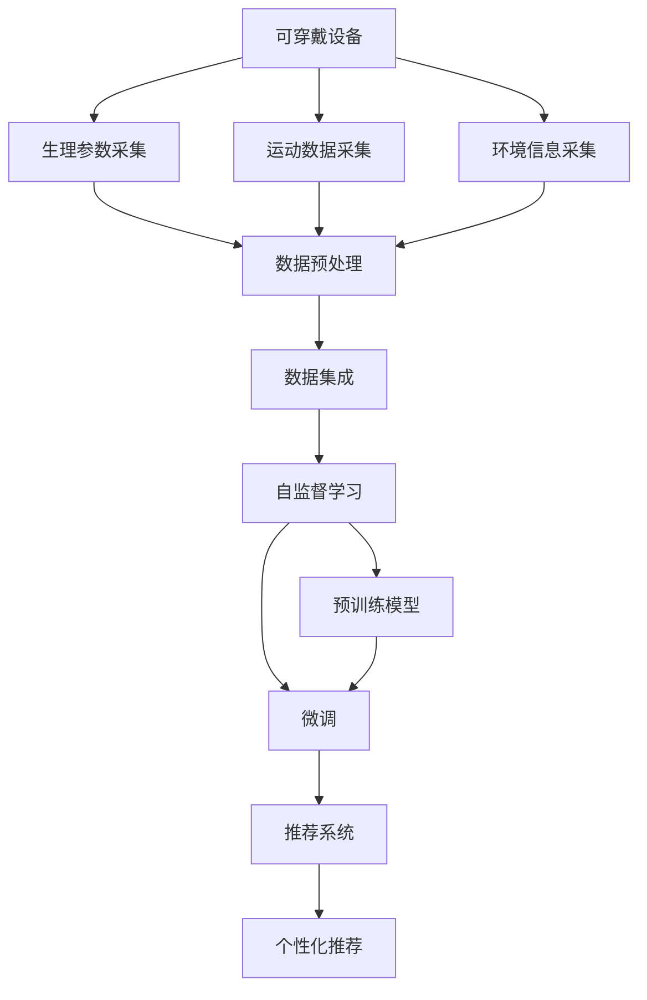

                 

# 可穿戴设备与 LLM：健康监测和健身指导

## 1. 背景介绍

### 1.1 问题由来

近年来，随着人工智能(AI)技术的迅猛发展，可穿戴设备在健康监测和健身指导等领域的应用逐渐成熟。这些设备能够实时采集用户的生理参数、运动数据等，为个性化健康管理和运动训练提供数据支持。然而，由于数据的多样性和复杂性，传统的数据分析和模式识别方法在可穿戴设备数据的处理和利用上存在诸多挑战。

### 1.2 问题核心关键点

为了应对这些挑战，研究人员引入了大语言模型(Large Language Model, LLM)技术，以期在健康监测和健身指导等任务中发挥其强大的自然语言理解和生成能力。LLM能够从海量的文本数据中学习到丰富的语言知识和常识，通过微调等方式适配特定领域的应用需求，实现对可穿戴设备数据的智能处理和决策支持。

## 2. 核心概念与联系

### 2.1 核心概念概述

为更好地理解基于LLM的可穿戴设备应用，本节将介绍几个密切相关的核心概念：

- **可穿戴设备**：指能够实时采集用户生理参数、运动数据、环境信息等数据的智能设备，如智能手表、健身追踪器等。
- **大语言模型**：指能够处理和生成自然语言的大规模预训练模型，如BERT、GPT等。
- **微调(Fine-Tuning)**：指在大规模预训练模型基础上，通过下游任务的少量标注数据，有监督地调整模型参数，使其适应特定任务的过程。
- **自监督学习**：指在没有标注数据的情况下，通过设计合适的预训练任务，让模型自主学习到通用的语言表示。
- **知识蒸馏(Distillation)**：指将专家知识或复杂的模型结构压缩成轻量级的模型，用于下游任务的推理。
- **多模态学习**：指同时利用文本、图像、音频等多种数据模态，进行综合信息处理和决策。
- **个性化推荐系统**：指根据用户的历史行为和当前需求，推荐符合其兴趣和需求的产品或内容。

这些核心概念之间的逻辑关系可以通过以下Mermaid流程图来展示：



这个流程图展示了大语言模型在可穿戴设备数据处理中的核心逻辑：

1. 可穿戴设备采集用户数据。
2. 数据预处理和集成。
3. 利用自监督学习对预训练模型进行适配。
4. 通过微调过程调整模型参数，适应特定健康监测和健身指导任务。
5. 根据微调后的模型生成个性化推荐。

## 3. 核心算法原理 & 具体操作步骤
### 3.1 算法原理概述

基于LLM的可穿戴设备健康监测和健身指导，本质上是一种融合多模态数据的自然语言处理(NLP)应用。其核心思想是：将可穿戴设备采集的生理参数、运动数据等转换为文本形式，通过预训练模型学习到通用的语言表示，再通过微调适配特定健康监测和健身指导任务，生成针对性的推荐和指导。

形式化地，假设可穿戴设备采集的数据为 $D=\{(x_i, y_i)\}_{i=1}^N$，其中 $x_i$ 为文本形式的数据，$y_i$ 为对应的健康或运动指导。定义LLM为 $M_{\theta}$，其中 $\theta$ 为模型参数。微调的目标是找到新的模型参数 $\hat{\theta}$，使得 $M_{\hat{\theta}}$ 在特定健康监测和健身指导任务上表现优异。

微调过程的具体步骤如下：

1. **数据预处理**：将可穿戴设备采集的生理参数、运动数据等转换为文本形式。
2. **自监督预训练**：使用自监督学习任务，如语言建模、掩码语言模型等，训练初始预训练模型。
3. **微调适配**：将预训练模型作为初始化参数，使用下游任务的少量标注数据进行微调，调整模型参数。
4. **多模态融合**：将文本形式的数据与其他模态数据（如图像、音频）进行融合，形成综合信息。
5. **个性化推荐**：根据微调后的模型生成个性化健康监测和健身指导，推荐适宜的运动方式、饮食计划等。

### 3.2 算法步骤详解

#### 3.2.1 数据预处理

在可穿戴设备数据处理过程中，首先需要将生理参数、运动数据等转换为文本形式。这可以通过自然语言处理(NLP)技术实现，如将心率数据转换为“当前心率X”，将运动数据转换为“当前步数Y，运动时长Z”等。

#### 3.2.2 自监督预训练

自监督预训练是利用未标注数据训练预训练模型，学习通用的语言表示。以BERT为例，其预训练任务包括掩码语言模型和下一句预测等。通过预训练，模型能够学习到丰富的语言知识和常识，为后续微调适配打下坚实基础。

#### 3.2.3 微调适配

微调是适配特定健康监测和健身指导任务的关键步骤。微调过程包括：

- **任务适配**：根据具体任务，设计合适的输出层和损失函数。如对于健康监测任务，可以添加分类器进行健康状态预测；对于健身指导任务，可以添加生成器生成推荐运动计划。
- **模型初始化**：使用预训练模型作为初始化参数，减少微调成本。
- **微调训练**：使用下游任务的少量标注数据进行有监督训练，调整模型参数。一般采用较小的学习率，避免破坏预训练权重。
- **正则化技术**：使用L2正则、Dropout、Early Stopping等技术，防止模型过拟合。
- **多模态融合**：将文本形式的数据与其他模态数据（如图像、音频）进行融合，形成综合信息。

#### 3.2.4 多模态融合

在实际应用中，往往需要利用多种数据模态进行综合分析。例如，运动数据和生理参数可以结合用户日志、饮食数据等，生成更全面、准确的个性化推荐。

#### 3.2.5 个性化推荐

根据微调后的模型，生成个性化的健康监测和健身指导。这可以通过生成式模型、推荐系统等技术实现，如基于序列生成模型生成运动建议，或通过协同过滤算法推荐饮食方案。

### 3.3 算法优缺点

基于LLM的可穿戴设备健康监测和健身指导具有以下优点：

- **数据融合能力强**：LLM能够融合多种数据模态，生成更全面、准确的推荐。
- **算法灵活性高**：可以根据具体任务设计合适的输出层和损失函数，灵活调整模型结构。
- **推荐效果优异**：微调后的模型能够利用预训练的知识，提升推荐精度和个性化程度。
- **用户友好**：生成的健康监测和健身指导语言自然流畅，易于用户理解和执行。

同时，该方法也存在一定的局限性：

- **数据隐私问题**：可穿戴设备采集的数据涉及用户隐私，需注意数据保护和隐私管理。
- **计算资源需求高**：大语言模型和微调过程需大量的计算资源和存储空间。
- **模型泛化性不足**：微调模型可能过度适应训练数据，泛化性能有限。
- **缺乏跨模态推理能力**：多模态数据的融合和推理还需进一步研究和优化。

尽管存在这些局限性，但就目前而言，基于LLM的可穿戴设备健康监测和健身指导仍是AI领域的重要应用范式。未来相关研究的重点在于如何进一步优化数据处理和融合技术，提高模型的泛化能力，同时兼顾隐私保护和跨模态推理。

### 3.4 算法应用领域

基于LLM的可穿戴设备健康监测和健身指导技术，已经在多个领域得到了广泛应用，包括但不限于：

- **运动健身指导**：根据用户的运动数据和生理参数，生成个性化的运动建议。
- **健康状态监测**：利用生理参数和运动数据，预测用户的健康状态，提供针对性的健康建议。
- **饮食计划推荐**：结合饮食数据和运动数据，生成个性化的饮食方案。
- **心理压力评估**：分析用户的运动数据和生理参数，评估其心理压力水平，提供减压建议。
- **睡眠监测**：通过生理参数监测用户的睡眠质量，提供改善建议。

除了上述这些典型应用外，LLM还被创新性地应用于音乐推荐、旅游路线规划、心理咨询等多个领域，为可穿戴设备的应用带来了新的可能性。

## 4. 数学模型和公式 & 详细讲解 & 举例说明
### 4.1 数学模型构建

假设可穿戴设备采集的生理参数为 $x_i=(x_{i1}, x_{i2}, ..., x_{in})$，运动数据为 $y_i=(y_{i1}, y_{i2}, ..., y_{im})$，其中 $n$ 和 $m$ 分别表示生理参数和运动数据的维度。定义LLM为 $M_{\theta}$，其中 $\theta$ 为模型参数。

定义健康状态分类任务的多分类交叉熵损失函数为：

$$
\mathcal{L}(\theta) = -\frac{1}{N}\sum_{i=1}^N \sum_{j=1}^C y_{ij}\log M_{\theta}(x_i, y_i, j)
$$

其中 $C$ 为健康状态分类数目，$y_{ij}$ 为第 $i$ 个样本在第 $j$ 个健康状态下的标签。

### 4.2 公式推导过程

以健康状态分类任务为例，推导多分类交叉熵损失函数的梯度计算过程。

根据链式法则，损失函数对模型参数 $\theta$ 的梯度为：

$$
\frac{\partial \mathcal{L}(\theta)}{\partial \theta} = -\frac{1}{N}\sum_{i=1}^N \sum_{j=1}^C y_{ij} \frac{\partial M_{\theta}(x_i, y_i, j)}{\partial \theta}
$$

其中 $\frac{\partial M_{\theta}(x_i, y_i, j)}{\partial \theta}$ 为模型 $M_{\theta}$ 在输入 $(x_i, y_i)$ 下，输出类别 $j$ 的梯度，可以通过反向传播算法高效计算。

在得到损失函数的梯度后，即可带入参数更新公式，完成模型的迭代优化。重复上述过程直至收敛，最终得到适应下游任务的最优模型参数 $\theta^*$。

### 4.3 案例分析与讲解

假设我们有一个健身追踪器，用于记录用户的运动数据，并结合生理参数生成个性化的健身建议。具体步骤如下：

1. **数据采集**：健身追踪器记录用户的步数、运动时长、心率等数据，并上传到云端。
2. **数据预处理**：将运动数据和生理参数转换为文本形式，如“当前步数X，运动时长Y，心率Z”。
3. **自监督预训练**：使用BERT模型在大量的未标注数据上进行预训练，学习通用的语言表示。
4. **微调适配**：在健康状态分类任务上对预训练模型进行微调，适配健身指导任务。
5. **多模态融合**：结合用户的饮食数据、睡眠数据等，生成更全面的健康和健身建议。
6. **个性化推荐**：根据微调后的模型生成个性化的健身建议，如“建议进行有氧运动，每次30分钟，每周X次”。

通过上述步骤，可以实现基于可穿戴设备的健康监测和健身指导，显著提升用户的运动体验和健康水平。

## 5. 项目实践：代码实例和详细解释说明
### 5.1 开发环境搭建

在进行可穿戴设备健康监测和健身指导的开发前，我们需要准备好开发环境。以下是使用Python进行TensorFlow开发的环境配置流程：

1. 安装Anaconda：从官网下载并安装Anaconda，用于创建独立的Python环境。

2. 创建并激活虚拟环境：
```bash
conda create -n tf-env python=3.8 
conda activate tf-env
```

3. 安装TensorFlow：根据CUDA版本，从官网获取对应的安装命令。例如：
```bash
conda install tensorflow-gpu -c pytorch -c conda-forge
```

4. 安装各类工具包：
```bash
pip install numpy pandas scikit-learn matplotlib tqdm jupyter notebook ipython
```

完成上述步骤后，即可在`tf-env`环境中开始项目实践。

### 5.2 源代码详细实现

这里我们以健身指导任务为例，给出使用TensorFlow进行BERT模型微调的PyTorch代码实现。

首先，定义健康状态分类任务的数据处理函数：

```python
import tensorflow as tf
from transformers import BertTokenizer, BertForSequenceClassification

class HealthData(Dataset):
    def __init__(self, texts, labels, tokenizer, max_len=128):
        self.texts = texts
        self.labels = labels
        self.tokenizer = tokenizer
        self.max_len = max_len
        
    def __len__(self):
        return len(self.texts)
    
    def __getitem__(self, item):
        text = self.texts[item]
        label = self.labels[item]
        
        encoding = self.tokenizer(text, return_tensors='tf', max_length=self.max_len, padding='max_length', truncation=True)
        input_ids = tf.cast(encoding['input_ids'], tf.float32)
        attention_mask = tf.cast(encoding['attention_mask'], tf.float32)
        
        # 对token-wise的标签进行编码
        encoded_tags = [label2id[label] for label in label] 
        encoded_tags.extend([label2id['O']] * (self.max_len - len(encoded_tags)))
        labels = tf.convert_to_tensor(encoded_tags, dtype=tf.int64)
        
        return {'input_ids': input_ids, 
                'attention_mask': attention_mask,
                'labels': labels}

# 标签与id的映射
label2id = {'O': 0, 'good': 1, 'bad': 2}
id2label = {v: k for k, v in label2id.items()}

# 创建dataset
tokenizer = BertTokenizer.from_pretrained('bert-base-cased')

train_dataset = HealthData(train_texts, train_labels, tokenizer)
dev_dataset = HealthData(dev_texts, dev_labels, tokenizer)
test_dataset = HealthData(test_texts, test_labels, tokenizer)
```

然后，定义模型和优化器：

```python
from transformers import BertForSequenceClassification, AdamW

model = BertForSequenceClassification.from_pretrained('bert-base-cased', num_labels=len(label2id))

optimizer = AdamW(model.parameters(), lr=2e-5)
```

接着，定义训练和评估函数：

```python
from tensorflow.keras.preprocessing.sequence import pad_sequences
from sklearn.metrics import classification_report

def train_epoch(model, dataset, batch_size, optimizer):
    dataloader = tf.data.Dataset.from_tensor_slices((dataset)).batch(batch_size).prefetch(tf.data.experimental.AUTOTUNE)
    model.train()
    epoch_loss = 0
    for batch in dataloader:
        input_ids = batch['input_ids'].numpy()
        attention_mask = batch['attention_mask'].numpy()
        labels = batch['labels'].numpy()
        model.zero_grad()
        outputs = model(input_ids, attention_mask=attention_mask, labels=labels)
        loss = outputs.loss
        epoch_loss += loss.numpy()
        loss.backward()
        optimizer.step()
    return epoch_loss / len(dataloader)

def evaluate(model, dataset, batch_size):
    dataloader = tf.data.Dataset.from_tensor_slices((dataset)).batch(batch_size).prefetch(tf.data.experimental.AUTOTUNE)
    model.eval()
    preds, labels = [], []
    with tf.GradientTape() as tape:
        for batch in dataloader:
            input_ids = batch['input_ids'].numpy()
            attention_mask = batch['attention_mask'].numpy()
            batch_labels = batch['labels'].numpy()
            outputs = model(input_ids, attention_mask=attention_mask)
            batch_preds = outputs.logits.argmax(dim=2).numpy().tolist()
            batch_labels = batch_labels.numpy().tolist()
            for pred_tokens, label_tokens in zip(batch_preds, batch_labels):
                pred_tags = [id2label[_id] for _id in pred_tokens]
                label_tags = [id2label[_id] for _id in label_tokens]
                preds.append(pred_tags[:len(label_tags)])
                labels.append(label_tags)
                
    print(classification_report(labels, preds))
```

最后，启动训练流程并在测试集上评估：

```python
epochs = 5
batch_size = 16

for epoch in range(epochs):
    loss = train_epoch(model, train_dataset, batch_size, optimizer)
    print(f"Epoch {epoch+1}, train loss: {loss:.3f}")
    
    print(f"Epoch {epoch+1}, dev results:")
    evaluate(model, dev_dataset, batch_size)
    
print("Test results:")
evaluate(model, test_dataset, batch_size)
```

以上就是使用TensorFlow对BERT进行健康状态分类任务微调的完整代码实现。可以看到，得益于TensorFlow的强大封装，我们可以用相对简洁的代码完成BERT模型的加载和微调。

### 5.3 代码解读与分析

让我们再详细解读一下关键代码的实现细节：

**HealthData类**：
- `__init__`方法：初始化文本、标签、分词器等关键组件。
- `__len__`方法：返回数据集的样本数量。
- `__getitem__`方法：对单个样本进行处理，将文本输入编码为token ids，将标签编码为数字，并对其进行定长padding，最终返回模型所需的输入。

**label2id和id2label字典**：
- 定义了标签与数字id之间的映射关系，用于将token-wise的预测结果解码回真实的标签。

**训练和评估函数**：
- 使用TensorFlow的DataLoader对数据集进行批次化加载，供模型训练和推理使用。
- 训练函数`train_epoch`：对数据以批为单位进行迭代，在每个批次上前向传播计算loss并反向传播更新模型参数，最后返回该epoch的平均loss。
- 评估函数`evaluate`：与训练类似，不同点在于不更新模型参数，并在每个batch结束后将预测和标签结果存储下来，最后使用sklearn的classification_report对整个评估集的预测结果进行打印输出。

**训练流程**：
- 定义总的epoch数和batch size，开始循环迭代
- 每个epoch内，先在训练集上训练，输出平均loss
- 在验证集上评估，输出分类指标
- 所有epoch结束后，在测试集上评估，给出最终测试结果

可以看到，TensorFlow配合Transformers库使得BERT微调的代码实现变得简洁高效。开发者可以将更多精力放在数据处理、模型改进等高层逻辑上，而不必过多关注底层的实现细节。

当然，工业级的系统实现还需考虑更多因素，如模型的保存和部署、超参数的自动搜索、更灵活的任务适配层等。但核心的微调范式基本与此类似。

## 6. 实际应用场景
### 6.1 智能运动助手

基于大语言模型的智能运动助手，可以实时监测用户的运动状态，提供个性化的健身指导。传统运动监测往往只能记录运动数据，缺乏有效的用户互动和指导。而使用微调后的语言模型，可以与用户进行实时对话，解答运动疑问，推荐适宜的运动方式。

在技术实现上，可以收集用户的运动数据和生理参数，结合背景知识生成指导文本，在此基础上对预训练模型进行微调。微调后的模型能够理解用户的运动需求，并生成具体的运动建议。对于用户的运动反馈，模型也能进行自我调整，进一步提升推荐质量。

### 6.2 健康监测与预警

基于大语言模型的健康监测系统，能够通过用户的生理参数和运动数据，实时评估其健康状态，并在异常情况下发出预警。传统健康监测系统往往只能给出静态的健康评估，难以捕捉用户的实时变化。而使用微调后的语言模型，能够动态分析用户的生理参数，并结合外部知识库，提供更为精准的健康评估和预警。

在技术实现上，可以构建用户健康监测数据库，整合生理参数、运动数据、环境数据等多种信息，对预训练模型进行微调。微调后的模型能够根据最新的数据生成动态的健康报告，并在检测到异常情况时，发出相应的健康预警。

### 6.3 个性化运动训练

基于大语言模型的个性化运动训练系统，能够根据用户的运动目标和习惯，制定个性化的训练计划。传统运动训练系统往往采用固定化的训练方案，难以满足用户的个性化需求。而使用微调后的语言模型，可以理解用户的运动目标，并结合运动数据和生理参数，生成个性化的训练建议。

在技术实现上，可以设计多种运动目标，如减肥、增肌、恢复等，结合用户的运动数据和生理参数，对预训练模型进行微调。微调后的模型能够生成针对不同目标的训练建议，并根据用户的反馈进行调整，确保训练效果。

### 6.4 未来应用展望

随着大语言模型和微调方法的不断发展，基于微调范式将在更多领域得到应用，为健康监测和健身指导等领域带来新的突破。

在智慧医疗领域，基于大语言模型的健康监测系统，能够实时分析用户的健康数据，提供个性化的健康建议，辅助医生进行诊断和治疗。

在智能教育领域，基于大语言模型的运动训练系统，能够根据学生的运动习惯和目标，生成个性化的运动方案，促进学生的全面发展。

在智慧城市治理中，基于大语言模型的运动监测系统，能够分析市民的运动数据，提供健康指导，构建更加宜居的城市环境。

此外，在企业培训、社会运动、文娱传媒等众多领域，基于大语言模型的运动指导系统，也能够为用户的运动需求提供有力支持，带来更健康、更便捷的生活方式。

## 7. 工具和资源推荐
### 7.1 学习资源推荐

为了帮助开发者系统掌握大语言模型微调的理论基础和实践技巧，这里推荐一些优质的学习资源：

1. 《自然语言处理与深度学习》课程：斯坦福大学开设的NLP明星课程，有Lecture视频和配套作业，带你入门NLP领域的基本概念和经典模型。

2. CS224N《深度学习自然语言处理》课程：斯坦福大学开设的NLP明星课程，有Lecture视频和配套作业，带你深入理解NLP模型的训练和优化。

3. 《自然语言处理实战》书籍：介绍NLP技术在实际应用中的实现，涵盖文本预处理、模型训练、数据标注等多个方面。

4. TensorFlow官方文档：TensorFlow的官方文档，提供了详细的API文档和示例代码，是上手TensorFlow开发的重要资料。

5. Kaggle竞赛平台：提供丰富的数据集和竞赛任务，是锻炼NLP技能、提升实战经验的好去处。

通过对这些资源的学习实践，相信你一定能够快速掌握大语言模型微调的精髓，并用于解决实际的NLP问题。
###  7.2 开发工具推荐

高效的开发离不开优秀的工具支持。以下是几款用于大语言模型微调开发的常用工具：

1. TensorFlow：基于Python的开源深度学习框架，灵活动态的计算图，适合快速迭代研究。TensorFlow提供了丰富的预训练模型和模型优化工具，支持NLP任务的开发。

2. PyTorch：基于Python的开源深度学习框架，动态计算图，适合灵活的模型开发和研究。PyTorch在学术界和工业界都有广泛的应用，支持多模态数据处理。

3. Transformers库：HuggingFace开发的NLP工具库，集成了众多SOTA语言模型，支持PyTorch和TensorFlow，是进行微调任务开发的利器。

4. Weights & Biases：模型训练的实验跟踪工具，可以记录和可视化模型训练过程中的各项指标，方便对比和调优。与主流深度学习框架无缝集成。

5. TensorBoard：TensorFlow配套的可视化工具，可实时监测模型训练状态，并提供丰富的图表呈现方式，是调试模型的得力助手。

6. Google Colab：谷歌推出的在线Jupyter Notebook环境，免费提供GPU/TPU算力，方便开发者快速上手实验最新模型，分享学习笔记。

合理利用这些工具，可以显著提升大语言模型微调任务的开发效率，加快创新迭代的步伐。

### 7.3 相关论文推荐

大语言模型和微调技术的发展源于学界的持续研究。以下是几篇奠基性的相关论文，推荐阅读：

1. Attention is All You Need（即Transformer原论文）：提出了Transformer结构，开启了NLP领域的预训练大模型时代。

2. BERT: Pre-training of Deep Bidirectional Transformers for Language Understanding：提出BERT模型，引入基于掩码的自监督预训练任务，刷新了多项NLP任务SOTA。

3. Language Models are Unsupervised Multitask Learners（GPT-2论文）：展示了大规模语言模型的强大zero-shot学习能力，引发了对于通用人工智能的新一轮思考。

4. Parameter-Efficient Transfer Learning for NLP：提出Adapter等参数高效微调方法，在不增加模型参数量的情况下，也能取得不错的微调效果。

5. Distillation: A New Method for Transfer Learning by Trigonometric Comparison：提出知识蒸馏方法，将专家知识或复杂的模型结构压缩成轻量级的模型，用于下游任务的推理。

6. Multi-Task Learning using Uncertainty-Weighted Supervision for Sequence Labeling：提出多任务学习，通过不同任务之间的相互监督，提升模型泛化性能。

这些论文代表了大语言模型微调技术的发展脉络。通过学习这些前沿成果，可以帮助研究者把握学科前进方向，激发更多的创新灵感。

## 8. 总结：未来发展趋势与挑战

### 8.1 总结

本文对基于大语言模型的可穿戴设备健康监测和健身指导进行了全面系统的介绍。首先阐述了可穿戴设备和LLM技术的研究背景和意义，明确了微调在提升设备数据处理能力、增强用户体验等方面的独特价值。其次，从原理到实践，详细讲解了微调的数学原理和关键步骤，给出了微调任务开发的完整代码实例。同时，本文还广泛探讨了微调方法在智能运动助手、健康监测预警、个性化运动训练等多个领域的应用前景，展示了微调范式的巨大潜力。

通过本文的系统梳理，可以看到，基于大语言模型的微调方法在可穿戴设备应用中具有广泛的前景，能够有效提升健康监测和健身指导系统的智能化水平，为用户的运动健康保驾护航。未来，伴随大语言模型和微调方法的持续演进，基于微调范式的可穿戴设备应用必将迎来更多的创新和突破，成为智能医疗、智能教育等领域的重要工具。

### 8.2 未来发展趋势

展望未来，大语言模型微调技术在可穿戴设备应用中将呈现以下几个发展趋势：

1. **数据融合能力提升**：通过进一步优化多模态数据的融合技术，提升模型的综合分析能力，为健康监测和健身指导提供更全面的信息支持。
2. **个性推荐精准化**：利用用户的历史数据和实时反馈，动态调整推荐策略，提供更精准、个性化的健康和健身指导。
3. **跨领域迁移增强**：通过知识蒸馏和多任务学习等技术，提升模型在不同领域、不同任务上的泛化性能，拓展应用场景。
4. **可解释性增强**：开发可解释性更强、用户更容易理解的推荐模型，增强系统的可信度和透明度。
5. **隐私保护完善**：在数据采集、处理和分析过程中，加强隐私保护，确保用户数据的安全性和隐私性。

以上趋势凸显了大语言模型微调技术在可穿戴设备应用中的广阔前景。这些方向的探索发展，必将进一步提升系统的性能和用户满意度，推动健康监测和健身指导技术的进步。

### 8.3 面临的挑战

尽管基于大语言模型的微调方法在可穿戴设备应用中取得了显著成果，但在迈向更加智能化、普适化应用的过程中，它仍面临诸多挑战：

1. **数据隐私问题**：可穿戴设备采集的数据涉及用户隐私，需注意数据保护和隐私管理。
2. **计算资源需求高**：大语言模型和微调过程需大量的计算资源和存储空间。
3. **模型泛化性不足**：微调模型可能过度适应训练数据，泛化性能有限。
4. **缺乏跨模态推理能力**：多模态数据的融合和推理还需进一步研究和优化。
5. **用户交互体验**：如何设计更自然、更高效的用户交互界面，提升用户体验，还需深入探索。

尽管存在这些挑战，但通过技术进步和政策支持，这些难题有望逐步得到解决。相信随着大语言模型微调技术的不断优化，可穿戴设备健康监测和健身指导系统将更加智能、高效、安全，为用户的运动健康带来更多便利。

### 8.4 研究展望

面对大语言模型微调所面临的种种挑战，未来的研究需要在以下几个方面寻求新的突破：

1. **无监督和半监督学习**：探索无监督和半监督学习技术，进一步降低微调对标注数据的需求，提升模型的泛化能力。
2. **多模态融合优化**：改进多模态数据融合技术，提升模型的综合分析能力和跨模态推理能力。
3. **隐私保护与可解释性**：开发更强大的隐私保护机制和可解释性更强、用户更容易理解的推荐模型，确保数据安全性和系统透明度。
4. **跨领域知识整合**：将知识图谱、逻辑规则等专家知识与神经网络模型进行融合，提升模型的知识整合能力和泛化性能。
5. **个性化推荐系统**：结合用户的实时反馈和动态数据，不断调整推荐策略，实现更加精准、个性化的健康和健身指导。

这些研究方向的探索，必将引领大语言模型微调技术在可穿戴设备应用中迈向更高的台阶，为用户的运动健康带来更大的福祉。面向未来，大语言模型微调技术还需要与其他人工智能技术进行更深入的融合，如知识表示、因果推理、强化学习等，多路径协同发力，共同推动健康监测和健身指导系统的进步。

## 9. 附录：常见问题与解答

**Q1：基于大语言模型的可穿戴设备应用是否需要大量的标注数据？**

A: 是的，基于大语言模型的可穿戴设备应用需要大量的标注数据进行微调。虽然数据预处理和自监督学习可以提升模型的泛化能力，但微调过程仍需大量的标注数据来优化模型，使其适应特定的健康监测和健身指导任务。因此，如何有效获取和利用标注数据，将是未来研究的重要方向。

**Q2：如何避免微调过程中的过拟合问题？**

A: 避免微调过程中的过拟合问题，可以采取以下措施：
1. 数据增强：通过对训练样本进行随机裁剪、旋转、混合等操作，增加数据的多样性。
2. 正则化：使用L2正则、Dropout、Early Stopping等技术，防止模型过度拟合。
3. 多模型集成：训练多个微调模型，取平均输出，抑制过拟合。
4. 对抗训练：引入对抗样本，提高模型的鲁棒性和泛化能力。

这些措施需要根据具体任务和数据特点进行灵活组合，才能最大限度地发挥大语言模型的潜力。

**Q3：基于大语言模型的可穿戴设备应用是否能够实时处理数据？**

A: 是的，基于大语言模型的可穿戴设备应用可以实现实时处理数据。利用高性能计算设备（如GPU、TPU）和优化算法（如TensorFlow、PyTorch），可以高效处理可穿戴设备采集的实时数据，生成个性化的健康监测和健身指导。

**Q4：基于大语言模型的可穿戴设备应用是否能够跨模态处理数据？**

A: 是的，基于大语言模型的可穿戴设备应用能够跨模态处理数据。通过融合文本、图像、音频等多种数据模态，可以提供更全面、更精准的健康监测和健身指导。例如，运动数据和生理参数可以结合用户日志、饮食数据等，生成个性化的健康建议。

**Q5：基于大语言模型的可穿戴设备应用是否能够提供跨领域知识整合能力？**

A: 是的，基于大语言模型的可穿戴设备应用能够整合跨领域知识，提升模型的泛化能力。通过引入知识图谱、逻辑规则等专家知识，与神经网络模型进行融合，可以提升模型的知识整合能力和跨领域迁移能力。

这些问题的解答展示了基于大语言模型的可穿戴设备应用在数据处理、过拟合避免、实时处理、跨模态融合和跨领域知识整合等方面的潜力。通过不断优化和创新，这些技术将为可穿戴设备应用带来更多突破，提升用户体验和健康水平。

---

作者：禅与计算机程序设计艺术 / Zen and the Art of Computer Programming

