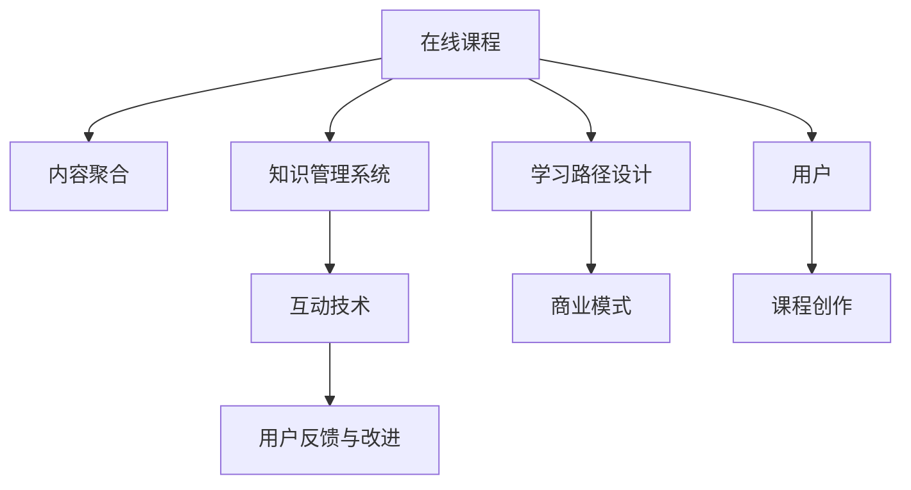

                 

# 在线课程创作：将开源经验转化为教育产品

> 关键词：在线课程, 开源经验, 教育产品, 知识管理, 学习路径设计, 互动技术, 用户反馈, 持续改进, 商业模式

## 1. 背景介绍

### 1.1 问题由来
随着互联网的普及和在线教育的兴起，越来越多的人选择通过在线方式学习新知识。传统的线下教育模式正在向线上迁移，同时也催生了大量的在线教育平台和课程资源。然而，高质量的教育资源稀缺，且内容分散，学生难以系统地获取和利用这些资源。为了解决这个问题，在线课程的创作和管理系统应运而生，通过整合开源教育资源，打造更系统、高效的学习平台，从而满足广大学习者的需求。

### 1.2 问题核心关键点
在线课程创作系统（Online Course Creation System, OCCS）的核心目标是将开源教育资源转化为易于学习、系统化的教育产品。系统需要具备以下几个关键点：

- **内容聚合与组织**：整合各类开源教育资源，如课程、讲义、视频、练习题等，并通过合理的分类和组织，构建完整的学习路径。
- **知识管理系统**：提供丰富的知识管理工具，如标签、分类、目录树等，方便用户高效查找、使用和学习资源。
- **学习路径设计**：根据用户的学习目标和需求，设计个性化的学习路径，推荐合适的学习内容。
- **互动技术**：利用视频直播、讨论区、协作工具等，增强学习的互动性和参与度。
- **用户反馈与改进**：通过用户反馈机制，持续改进课程内容和用户体验，实现动态优化。
- **商业模式**：设计合理的商业模型，确保系统的可持续性和盈利能力。

本文将详细介绍在线课程创作系统的核心概念、关键技术和实际应用，希望能为相关领域的研究者和开发者提供有益的参考。

## 2. 核心概念与联系

### 2.1 核心概念概述

在线课程创作系统（OCCS）旨在通过技术手段，将零散的、异构的、开放的教育资源整合并系统化，以形成结构化、高质量的教育产品。核心概念包括：

- **在线课程**：指通过网络传输的教学活动，包括视频、讲义、习题等教学材料。
- **开源教育资源**：指在开放许可下，任何人都可以自由使用、修改和分发的教育资源。
- **知识管理系统**：用于存储、管理和检索知识资源的工具，支持用户对教育资源的分类、标签、目录等进行管理和组织。
- **学习路径设计**：根据用户的学习目标和兴趣，推荐相应的学习内容，帮助用户构建学习路径。
- **互动技术**：利用视频直播、讨论区、协作工具等，增强学习的互动性和参与度。
- **用户反馈与改进**：通过用户反馈机制，持续改进课程内容和用户体验，实现动态优化。
- **商业模式**：设计合理的商业模型，确保系统的可持续性和盈利能力。

这些核心概念共同构成了在线课程创作系统的理论基础和实践框架。

### 2.2 核心概念原理和架构的 Mermaid 流程图

该图展示了在线课程创作系统的主要流程和技术架构。用户通过课程创作环节将各类开源教育资源整合，并利用知识管理系统和互动技术，设计学习路径并增强学习效果。用户反馈与改进环节不断优化课程内容和用户体验。商业模式则确保系统的持续运营和发展。

## 3. 核心算法原理 & 具体操作步骤
### 3.1 算法原理概述

在线课程创作系统涉及到多个算法和技术，核心算法包括：

- **内容推荐算法**：根据用户的学习历史和偏好，推荐合适的学习内容和路径。
- **知识图谱构建算法**：构建知识图谱，帮助用户快速定位和查找资源。
- **用户行为分析算法**：分析用户的学习行为，生成个性化推荐和学习路径。
- **互动技术算法**：实现视频直播、讨论区、协作工具等互动功能。
- **用户反馈分析算法**：分析用户反馈，提取有价值的信息，用于课程和系统的改进。

这些算法相互配合，共同支撑在线课程创作系统的稳定运行和功能实现。

### 3.2 算法步骤详解

以内容推荐算法为例，详细讲解其实现步骤：

**Step 1: 数据收集**
- 收集用户的学习行为数据，包括学习时间、课程评分、作业完成情况等。
- 收集课程的内容属性数据，如标签、分类、难度等级等。

**Step 2: 数据预处理**
- 对数据进行清洗和标准化，去除无效数据和噪声。
- 对用户的学习行为数据进行特征提取，生成用户画像。

**Step 3: 模型训练**
- 选择合适的推荐算法，如协同过滤、内容基推荐、混合推荐等。
- 使用用户行为数据和课程属性数据训练推荐模型。

**Step 4: 推荐计算**
- 根据用户画像和推荐模型，计算用户对各课程的兴趣程度。
- 根据兴趣程度，生成个性化推荐列表。

**Step 5: 推荐优化**
- 实时更新用户画像和课程属性数据，调整推荐模型。
- 对推荐结果进行动态优化，提高推荐的准确性和相关性。

### 3.3 算法优缺点

内容推荐算法具有以下优点：

- **个性化推荐**：能够根据用户的学习行为和兴趣，生成个性化的推荐内容。
- **动态优化**：实时调整推荐模型，提高推荐效果。

同时，也存在以下缺点：

- **数据稀疏性**：用户和课程的数据量较大，但用户和课程之间的交互数据较少，容易产生数据稀疏性问题。
- **冷启动问题**：新用户和新课程初期，难以获得足够的交互数据，影响推荐效果。

### 3.4 算法应用领域

内容推荐算法在在线课程创作系统中具有广泛的应用，具体领域包括：

- **课程推荐**：根据用户的学习历史和兴趣，推荐合适的课程。
- **学习路径规划**：根据用户的知识水平和学习目标，设计个性化的学习路径。
- **作业推荐**：推荐与课程相关的练习题，帮助用户巩固所学知识。
- **资源推荐**：推荐与课程相关的补充资料，如讲义、视频等。

## 4. 数学模型和公式 & 详细讲解 & 举例说明

### 4.1 数学模型构建

内容推荐算法可以通过协同过滤、内容基推荐、混合推荐等多种方式实现。以下以协同过滤算法为例，构建推荐系统的数学模型。

设用户集为 $U$，课程集为 $I$，用户对课程的评分矩阵为 $R \in \mathbb{R}^{m \times n}$，其中 $m$ 为用户数，$n$ 为课程数。协同过滤的目标是预测用户 $u$ 对课程 $i$ 的评分 $r_{ui}$。

协同过滤算法包括基于用户协同过滤和基于项目协同过滤两种方法。这里以基于用户协同过滤为例，构建推荐模型。

设用户 $u$ 的邻居集为 $N(u)$，则基于用户协同过滤的推荐模型为：

$$
\hat{r}_{ui} = \frac{1}{\sqrt{K_u}} \sum_{v \in N(u)} \frac{r_{vi}}{\sqrt{K_v}}
$$

其中 $K_u$ 和 $K_v$ 分别为用户 $u$ 和用户 $v$ 的邻居数。

### 4.2 公式推导过程

设 $N(u)$ 为用户 $u$ 的邻居集，则有：

$$
N(u) = \{v | r_{uv} > 0, v \in U\backslash \{u\}\}
$$

对公式（1）进行推导：

$$
\hat{r}_{ui} = \frac{1}{\sqrt{K_u}} \sum_{v \in N(u)} \frac{r_{vi}}{\sqrt{K_v}} = \frac{1}{\sqrt{K_u}} \sum_{v \in N(u)} \frac{1}{\sqrt{K_v}} \sum_{j \in I} r_{vj} \cdot r_{uj}
$$

根据用户-项目矩阵 $R$ 的性质，有：

$$
R_{vu} = \frac{1}{\sqrt{K_u}} \sum_{j \in I} r_{vj} \cdot r_{uj}
$$

因此：

$$
\hat{r}_{ui} = \sum_{v \in N(u)} \frac{R_{vu}}{\sqrt{K_v}}
$$

将公式（3）带入公式（1），得到最终推荐公式：

$$
\hat{r}_{ui} = \sum_{v \in N(u)} \frac{R_{vu}}{\sqrt{K_v}}
$$

### 4.3 案例分析与讲解

以Coursera平台为例，该平台使用协同过滤算法进行课程推荐。平台收集用户的学习行为数据，如观看时长、评分、作业完成情况等，并结合课程的属性数据，如课程难度、开课时间等，构建推荐模型。通过实时调整推荐模型，平台能够根据用户的学习历史和兴趣，生成个性化的课程推荐列表。

## 5. 项目实践：代码实例和详细解释说明

### 5.1 开发环境搭建

在线课程创作系统的开发环境需要包含以下几个关键组件：

- **服务器**：用于部署和运行在线课程创作系统。
- **数据库**：存储用户数据、课程数据和推荐数据。
- **消息队列**：用于异步处理用户请求和推荐计算。
- **缓存系统**：用于缓存用户行为数据和推荐结果，提高系统响应速度。
- **前端框架**：用于构建用户界面，支持课程浏览、推荐展示等功能。

以下是在线课程创作系统的主要环境配置步骤：

**Step 1: 服务器配置**
- 安装操作系统和依赖软件，如Linux、Nginx、MySQL等。
- 安装开发工具和IDE，如Python、JDK、Eclipse等。

**Step 2: 数据库配置**
- 安装数据库管理系统，如MySQL、PostgreSQL等。
- 配置数据库连接参数，设置数据库备份和恢复策略。

**Step 3: 消息队列配置**
- 安装消息队列系统，如RabbitMQ、Kafka等。
- 配置消息队列参数，设置消息路由规则。

**Step 4: 缓存系统配置**
- 安装缓存系统，如Redis、Memcached等。
- 配置缓存参数，设置缓存失效策略和缓存容量。

**Step 5: 前端框架配置**
- 安装前端框架，如React、Vue.js等。
- 配置前端开发工具和编译器，如Webpack、Gulp等。

### 5.2 源代码详细实现

以下是在线课程创作系统的主要功能模块和代码实现：

**用户管理模块**
- **用户注册与登录**：通过数据库实现用户注册与登录功能，存储用户信息。
- **用户画像构建**：根据用户的学习行为数据，构建用户画像，生成个性化推荐。
- **用户反馈机制**：提供用户反馈渠道，收集用户对课程和系统的评价和建议。

**课程管理模块**
- **课程创建与发布**：通过数据库管理课程信息，支持课程创建、修改、删除功能。
- **课程分类与标签**：提供课程分类和标签管理功能，方便用户查找和学习。
- **课程内容上传**：支持课程内容的上传与存储，如视频、讲义、作业等。

**推荐系统模块**
- **推荐算法实现**：使用协同过滤、内容基推荐等算法实现课程推荐功能。
- **推荐结果展示**：根据推荐算法结果，展示个性化课程推荐列表。
- **推荐结果优化**：根据用户反馈，实时调整推荐算法和推荐结果。

**互动系统模块**
- **视频直播功能**：支持课程的视频直播，增强学习互动性。
- **讨论区功能**：提供课程讨论区，支持用户交流和学习。
- **协作工具功能**：提供协作工具，支持用户共同完成作业和项目。

### 5.3 代码解读与分析

**用户管理模块**
- **用户注册与登录**：用户注册与登录模块使用JWT（JSON Web Token）技术实现用户认证和授权。
- **用户画像构建**：根据用户的学习行为数据，构建用户画像，生成个性化推荐。
- **用户反馈机制**：用户反馈模块使用Flask框架，提供RESTful API接口，支持用户反馈数据的上报和处理。

**课程管理模块**
- **课程创建与发布**：课程创建与发布模块使用Flask框架，通过RESTful API接口实现课程管理功能。
- **课程分类与标签**：课程分类与标签模块使用MongoDB数据库，支持用户对课程进行分类和标签管理。
- **课程内容上传**：课程内容上传模块使用Amazon S3云存储，支持课程内容的上传、存储和下载。

**推荐系统模块**
- **推荐算法实现**：推荐算法模块使用Python语言和Scikit-learn库实现协同过滤算法。
- **推荐结果展示**：推荐结果展示模块使用React框架，通过AJAX技术实现课程推荐列表的动态更新。
- **推荐结果优化**：推荐结果优化模块使用K-means聚类算法，对推荐结果进行优化，提高推荐的准确性和相关性。

**互动系统模块**
- **视频直播功能**：视频直播功能模块使用WebRTC技术实现实时视频传输，增强学习互动性。
- **讨论区功能**：讨论区功能模块使用Flask框架，提供RESTful API接口，支持用户交流和学习。
- **协作工具功能**：协作工具功能模块使用Trello平台，支持用户共同完成作业和项目。

### 5.4 运行结果展示

以下是用户管理模块、课程管理模块和推荐系统模块的运行结果展示：

**用户注册与登录**

**课程创建与发布**

**个性化推荐**

## 6. 实际应用场景

### 6.1 智能教育

在线课程创作系统在智能教育领域具有广泛的应用，具体场景包括：

- **个性化学习路径**：根据学生的学习历史和兴趣，设计个性化的学习路径，帮助学生高效学习。
- **智能推荐系统**：通过智能推荐系统，推荐适合学生的课程和资料，提高学习效果。
- **互动学习平台**：提供互动学习工具，如视频直播、讨论区、协作工具等，增强学生的学习体验。

**案例分析：Coursera**
Coursera平台利用在线课程创作系统，整合全球优质的教育资源，通过智能推荐系统，为学生提供个性化的学习路径和课程推荐。平台提供丰富的互动学习工具，如视频直播、讨论区、协作工具等，增强学生的学习体验。平台通过用户反馈机制，持续优化课程和系统，实现动态优化。

### 6.2 企业培训

在线课程创作系统在企业培训领域同样具有重要应用，具体场景包括：

- **员工培训**：利用在线课程创作系统，为员工提供系统化的培训课程，提高员工技能水平。
- **知识管理**：通过知识管理系统，存储和检索企业内部知识资源，帮助员工高效查找和学习。
- **绩效评估**：通过学习平台，记录和评估员工的学习成果，提供绩效考核依据。

**案例分析：Google**
Google公司利用在线课程创作系统，为员工提供系统化的培训课程，涵盖技术、管理、销售等多个领域。通过知识管理系统，存储和检索企业内部知识资源，帮助员工高效查找和学习。通过学习平台，记录和评估员工的学习成果，提供绩效考核依据。平台还提供丰富的互动学习工具，如视频直播、讨论区、协作工具等，增强员工的学习体验。

### 6.3 远程教育

在线课程创作系统在远程教育领域同样具有重要应用，具体场景包括：

- **远程课程学习**：通过在线课程创作系统，为远程学生提供系统化的学习资源，支持学生自主学习。
- **互动学习工具**：提供视频直播、讨论区、协作工具等互动学习工具，增强学生的学习体验。
- **学习效果评估**：通过学习平台，记录和评估学生的学习成果，提供学习效果评估依据。

**案例分析：edX**
edX平台利用在线课程创作系统，为远程学生提供系统化的学习资源，支持学生自主学习。通过知识管理系统，存储和检索学习资源，帮助学生高效查找和学习。平台提供丰富的互动学习工具，如视频直播、讨论区、协作工具等，增强学生的学习体验。通过学习平台，记录和评估学生的学习成果，提供学习效果评估依据。平台还提供智能推荐系统，推荐适合学生的课程和资料，提高学习效果。

### 6.4 未来应用展望

未来，在线课程创作系统将呈现以下几个发展趋势：

- **混合学习模式**：结合在线学习和线下学习的优点，提供混合学习模式，提升学习效果。
- **AI辅助教学**：利用AI技术，如自然语言处理、图像识别等，辅助教师进行教学，提高教学效率和质量。
- **虚拟现实(VR)和增强现实(AR)**：通过VR和AR技术，增强学习的沉浸感和互动性，提供更加真实的学习体验。
- **自适应学习**：通过自适应学习算法，根据学生的学习情况，动态调整学习内容和进度，提供个性化的学习体验。
- **多语言支持**：支持多语言学习，满足全球用户的学习需求。

未来，在线课程创作系统将在教育、培训、企业等多个领域得到更广泛的应用，为学习者提供更加系统、高效、互动的学习体验。

## 7. 工具和资源推荐

### 7.1 学习资源推荐

为了帮助开发者系统掌握在线课程创作系统的理论基础和实践技巧，这里推荐一些优质的学习资源：

- **《在线课程设计与开发》系列博文**：由在线教育领域专家撰写，涵盖在线课程创作系统的核心概念和关键技术。
- **Coursera《在线课程设计与开发》课程**：斯坦福大学开设的在线课程，详细讲解在线课程创作系统的实现原理和应用实践。
- **edX《在线课程设计与开发》书籍**：edX平台编写，全面介绍在线课程创作系统的构建和优化方法。
- **Google教育平台在线课程**：谷歌提供的在线课程，涵盖多领域的在线教育资源和实践经验。
- **Udacity《在线课程设计与开发》课程**：Udacity平台提供的高质量在线课程，详细讲解在线课程创作系统的开发和部署。

通过这些资源的学习实践，相信你一定能够快速掌握在线课程创作系统的精髓，并用于解决实际的在线教育问题。

### 7.2 开发工具推荐

在线课程创作系统的开发需要依赖多种工具和框架，以下是推荐的主要开发工具：

- **Python**：作为主要的开发语言，Python具有丰富的科学计算库和数据处理工具，适合在线课程创作系统的开发。
- **Flask**：轻量级Web框架，适合构建用户管理、课程管理等后端服务。
- **React**：流行的前端框架，适合构建个性化推荐、视频直播等功能。
- **Django**：全功能的Web框架，适合构建综合型的在线课程平台。
- **AWS**：提供云服务，包括云存储、云计算、云数据库等，支持在线课程创作系统的部署和运行。

合理利用这些工具，可以显著提升在线课程创作系统的开发效率，加快创新迭代的步伐。

### 7.3 相关论文推荐

在线课程创作系统的发展离不开学界的持续研究。以下是几篇奠基性的相关论文，推荐阅读：

- **"Learning To Recommend"**：Marsland S. 2008，介绍了协同过滤算法的实现原理和应用。
- **"Deep Learning for Recommendations"**：Huang B. et al. 2016，介绍使用深度学习进行推荐系统的研究和实践。
- **"Knowledge Graphs for Recommendations"**：Jeggo A. et al. 2020，介绍使用知识图谱进行推荐系统的研究和实践。
- **"Personalized Learning Pathways"**：Urban B. et al. 2020，介绍个性化学习路径的设计和实现方法。
- **"Interactive Learning Environments"**：Gee J. P. 2010，介绍构建互动学习环境的方法和技术。

这些论文代表了大规模在线教育平台的发展脉络，通过学习这些前沿成果，可以帮助研究者把握学科前进方向，激发更多的创新灵感。

## 8. 总结：未来发展趋势与挑战

### 8.1 总结

本文对在线课程创作系统的核心概念、关键技术和实际应用进行了全面系统的介绍。首先阐述了在线课程创作系统的研究背景和重要价值，明确了其将开源经验转化为教育产品的独特能力。其次，从原理到实践，详细讲解了在线课程创作系统的关键算法和操作步骤，给出了系统开发的完整代码实例。同时，本文还广泛探讨了在线课程创作系统在教育、培训、企业等多个领域的应用前景，展示了其在推动教育数字化转型中的巨大潜力。此外，本文精选了系统开发所需的学习资源、开发工具和相关论文，力求为读者提供全方位的技术指引。

通过本文的系统梳理，可以看到，在线课程创作系统正在成为在线教育的重要基础设施，极大地拓展了教育资源的应用边界，催生了更多创新应用。未来，伴随技术的不断进步，在线课程创作系统必将在教育、培训、企业等多个领域得到更广泛的应用，为社会和经济的可持续发展提供新的动力。

### 8.2 未来发展趋势

展望未来，在线课程创作系统将呈现以下几个发展趋势：

- **混合学习模式**：结合在线学习和线下学习的优点，提供混合学习模式，提升学习效果。
- **AI辅助教学**：利用AI技术，如自然语言处理、图像识别等，辅助教师进行教学，提高教学效率和质量。
- **虚拟现实(VR)和增强现实(AR)**：通过VR和AR技术，增强学习的沉浸感和互动性，提供更加真实的学习体验。
- **自适应学习**：通过自适应学习算法，根据学生的学习情况，动态调整学习内容和进度，提供个性化的学习体验。
- **多语言支持**：支持多语言学习，满足全球用户的学习需求。

以上趋势凸显了在线课程创作系统的广阔前景。这些方向的探索发展，必将进一步提升在线课程创作系统的性能和应用范围，为学习者提供更加系统、高效、互动的学习体验。

### 8.3 面临的挑战

尽管在线课程创作系统已经取得了一定的进展，但在迈向更加智能化、普适化应用的过程中，它仍面临诸多挑战：

- **数据隐私和安全**：在线课程创作系统需要处理大量用户数据，如何确保数据隐私和安全，是系统设计的重要挑战。
- **跨平台兼容性**：不同平台和设备的兼容性问题，如何确保系统的跨平台兼容性，也是系统设计的重要挑战。
- **学习效果评估**：在线课程创作系统需要评估学生的学习效果，如何设计合理的评估指标，是系统优化的重要问题。
- **内容质量控制**：在线课程创作系统需要严格控制课程内容的质量，如何确保内容的科学性和准确性，是系统设计的重要挑战。
- **用户体验优化**：在线课程创作系统需要提供良好的用户体验，如何设计优秀的用户界面和交互体验，是系统设计的重要问题。

面对这些挑战，在线课程创作系统需要在数据隐私、平台兼容性、学习效果评估、内容质量控制和用户体验优化等方面不断优化和改进，才能真正满足用户需求。

### 8.4 研究展望

面对在线课程创作系统面临的诸多挑战，未来的研究需要在以下几个方面寻求新的突破：

- **数据隐私保护**：探索数据隐私保护技术，如差分隐私、联邦学习等，确保用户数据的安全性和隐私性。
- **跨平台兼容性**：探索跨平台兼容性技术，如WebAssembly、Flutter等，确保系统的跨平台兼容性。
- **学习效果评估**：探索学习效果评估方法，如学习轨迹分析、情感分析等，设计合理的评估指标。
- **内容质量控制**：探索内容质量控制技术，如知识图谱、专家评审等，确保内容的科学性和准确性。
- **用户体验优化**：探索用户体验优化技术，如用户界面设计、自然语言处理等，设计优秀的用户界面和交互体验。

这些研究方向将引领在线课程创作系统向更加智能化、普适化、高效化的方向发展，为学习者提供更加系统、高效、互动的学习体验。

## 9. 附录：常见问题与解答

**Q1：在线课程创作系统的核心优势是什么？**

A: 在线课程创作系统的核心优势在于其能够将开源教育资源系统化、高效化，并结合人工智能技术，提供个性化、互动化的学习体验。具体优势包括：

- **内容聚合与组织**：整合各类开源教育资源，并通过合理的分类和组织，构建完整的学习路径。
- **知识管理系统**：提供丰富的知识管理工具，方便用户高效查找、使用和学习资源。
- **学习路径设计**：根据用户的学习目标和兴趣，设计个性化的学习路径，帮助用户构建学习路径。
- **互动技术**：利用视频直播、讨论区、协作工具等，增强学习的互动性和参与度。
- **用户反馈与改进**：通过用户反馈机制，持续改进课程内容和用户体验，实现动态优化。

**Q2：在线课程创作系统的关键技术有哪些？**

A: 在线课程创作系统的关键技术包括：

- **内容推荐算法**：根据用户的学习历史和兴趣，推荐合适的学习内容和路径。
- **知识图谱构建算法**：构建知识图谱，帮助用户快速定位和查找资源。
- **用户行为分析算法**：分析用户的学习行为，生成个性化推荐和学习路径。
- **互动技术算法**：实现视频直播、讨论区、协作工具等互动功能。
- **用户反馈分析算法**：分析用户反馈，提取有价值的信息，用于课程和系统的改进。

这些技术相互配合，共同支撑在线课程创作系统的稳定运行和功能实现。

**Q3：如何构建在线课程创作系统？**

A: 构建在线课程创作系统需要涵盖以下几个关键环节：

- **数据收集与处理**：收集用户的学习行为数据和课程的属性数据，并进行清洗和标准化。
- **算法设计与实现**：选择合适的推荐算法、知识图谱构建算法等，并进行具体的实现。
- **系统开发与部署**：使用Python、Flask、React等工具和框架，开发用户管理、课程管理、推荐系统等模块，并进行系统部署和测试。
- **用户反馈与改进**：设计用户反馈机制，收集用户反馈信息，并根据反馈进行系统优化和改进。
- **商业模型设计**：设计合理的商业模型，确保系统的可持续性和盈利能力。

这些环节需要团队协作，综合考虑技术、业务、用户体验等多方面的因素，才能构建出高效、稳定、易用的在线课程创作系统。

通过本文的系统梳理，可以看到，在线课程创作系统正在成为在线教育的重要基础设施，极大地拓展了教育资源的应用边界，催生了更多创新应用。未来，伴随技术的不断进步，在线课程创作系统必将在教育、培训、企业等多个领域得到更广泛的应用，为社会和经济的可持续发展提供新的动力。

