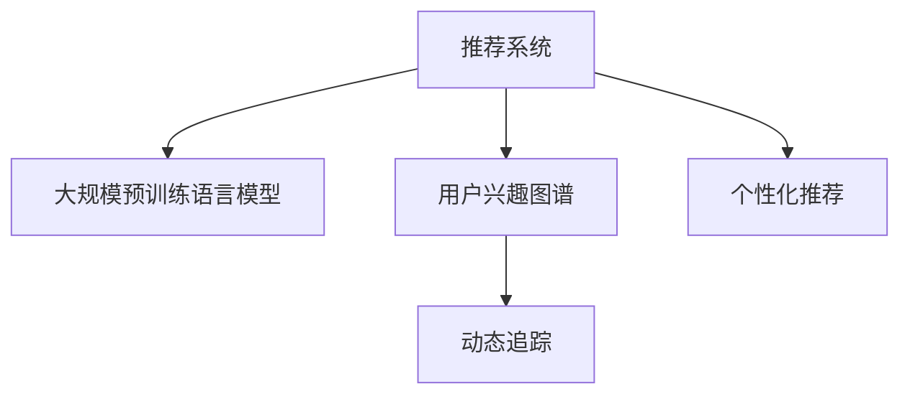

                 

# 基于LLM的推荐系统用户兴趣动态追踪

## 1. 背景介绍

在现代信息爆炸的时代，如何为用户推荐最符合其兴趣和需求的内容，成为了各大互联网公司亟需解决的问题。传统的推荐系统往往依赖于静态的特征和静态的用户行为模型，难以捕捉用户兴趣的动态变化，导致推荐结果不够精准，用户体验感差。

近年来，深度学习技术的迅猛发展为推荐系统带来了新的突破，特别是基于大规模预训练语言模型(Large Language Model, LLM)的推荐系统，通过用户与内容的互动历史，动态捕捉用户兴趣变化，极大提升了推荐系统的效果。但现有的LLM推荐系统大多依赖于静态的特征提取，难以动态地追踪用户兴趣，无法实时更新推荐结果。

因此，本文提出一种基于LLM的动态追踪用户兴趣的推荐系统，通过用户的文本输入与输出，动态构建用户的兴趣图谱，实时生成个性化的推荐结果，为用户提供更精准、更及时的推荐服务。

## 2. 核心概念与联系

### 2.1 核心概念概述

为更好地理解基于LLM的推荐系统，本节将介绍几个密切相关的核心概念：

- 推荐系统(Recommender System)：根据用户的历史行为和特征，推荐符合用户兴趣的内容，广泛应用于电商、视频、社交等互联网应用。

- 大规模预训练语言模型(LLM)：通过在大规模无标签文本语料上进行预训练，学习通用的语言表示，具备强大的语言理解和生成能力，广泛应用于自然语言处理(NLP)等领域。

- 用户兴趣图谱(User Interest Graph)：通过用户与内容的互动历史，动态构建用户兴趣网络，帮助推荐系统理解用户的偏好和需求，提供个性化的推荐服务。

- 动态追踪(Dynamic Tracking)：指在用户与内容的互动过程中，持续监测用户兴趣变化，及时更新用户兴趣图谱，并重新生成推荐结果的机制。

- 个性化推荐(Personalized Recommendation)：根据用户的个性化特征和当前状态，生成符合其兴趣和需求的内容，提升用户体验和满意度。

这些核心概念之间的逻辑关系可以通过以下Mermaid流程图来展示：



这个流程图展示了我们核心概念之间的关系：

1. 推荐系统通过预训练语言模型获取用户兴趣。
2. 用户兴趣图谱动态捕捉用户实时兴趣变化。
3. 动态追踪根据兴趣变化及时更新用户图谱。
4. 个性化推荐生成符合用户兴趣的内容。

## 3. 核心算法原理 & 具体操作步骤
### 3.1 算法原理概述

基于LLM的推荐系统，核心思想是利用预训练语言模型对用户行为数据进行语义理解和特征提取，构建动态兴趣图谱，并在此基础上进行个性化推荐。其核心算法包括以下几个关键步骤：

1. 数据预处理：收集用户的历史行为数据，如浏览、点击、购买等，将内容与用户的互动历史转换为结构化的表示形式。
2. 兴趣图谱构建：使用预训练语言模型对用户行为数据进行语义编码，得到用户兴趣图谱，表示用户对各类内容的兴趣强度和关系。
3. 兴趣追踪：通过用户与内容的实时互动，动态更新用户兴趣图谱，捕捉用户兴趣的变化。
4. 个性化推荐：根据实时兴趣图谱，生成个性化推荐结果，返回给用户。

### 3.2 算法步骤详解

以下是基于LLM的推荐系统的详细步骤：

**Step 1: 数据预处理**

1. 收集用户行为数据：收集用户浏览历史、点击记录、购买记录等，将其转换为结构化的格式，例如将内容-时间戳对作为一条行为记录。
2. 数据清洗：对行为数据进行去重、过滤等预处理操作，去除异常和无效数据。
3. 数据划分：将行为数据划分为训练集、验证集和测试集，以供后续模型的评估和优化。

**Step 2: 兴趣图谱构建**

1. 数据嵌入：使用预训练语言模型对行为数据进行编码，得到文本嵌入向量，表示用户对内容的兴趣强度。
2. 兴趣图谱生成：对文本嵌入向量进行聚类，生成兴趣图谱，其中节点表示内容，边表示用户对内容的兴趣强度。

**Step 3: 兴趣追踪**

1. 实时互动监测：实时获取用户与内容的互动信息，如实时浏览、点击、评分等。
2. 图谱更新：根据实时互动信息，动态更新用户兴趣图谱，增加新内容节点，调整边权重。

**Step 4: 个性化推荐**

1. 兴趣评分计算：根据用户的兴趣图谱，计算用户对每个内容的兴趣评分。
2. 推荐结果生成：按照兴趣评分排序，选取高评分内容进行推荐。
3. 推荐结果更新：实时更新推荐结果，确保推荐内容的时效性和相关性。

### 3.3 算法优缺点

基于LLM的推荐系统具有以下优点：

1. 动态追踪：实时更新用户兴趣图谱，捕捉用户兴趣变化，提供更精准的推荐。
2. 语义理解：利用预训练语言模型进行文本嵌入和兴趣评分计算，提升推荐精度。
3. 个性化推荐：根据用户实时兴趣生成推荐结果，提升用户体验和满意度。

同时，该方法也存在以下局限性：

1. 数据隐私：实时监测用户互动，可能涉及隐私问题，需要设计合理的隐私保护机制。
2. 计算复杂：大规模语言模型的实时嵌入计算复杂度较高，需要高效的数据处理算法支持。
3. 模型泛化：大规模语言模型在不同场景下的泛化能力有限，需要针对具体领域进行微调。

尽管存在这些局限性，但就目前而言，基于LLM的推荐系统是一种十分先进且具有潜力的推荐方法，有望提升推荐系统的准确性和个性化程度，带来更优秀的用户体验。

### 3.4 算法应用领域

基于LLM的推荐系统在多个领域都有广泛的应用，例如：

- 电商平台：根据用户浏览历史和点击记录，实时生成商品推荐列表。
- 视频网站：根据用户观看历史和评分信息，动态生成视频推荐。
- 社交平台：根据用户评论和互动信息，生成文章和好友推荐。
- 新闻媒体：根据用户阅读历史和订阅兴趣，推荐相关新闻内容。
- 音乐平台：根据用户听歌历史和评分记录，推荐新歌和歌单。

除了这些常见应用外，基于LLM的推荐系统还可以用于智能客服、内容推荐、广告定向等领域，为各种垂直行业提供高效精准的推荐服务。

## 4. 数学模型和公式 & 详细讲解 & 举例说明

### 4.1 数学模型构建

本节将使用数学语言对基于LLM的推荐系统进行更加严格的刻画。

假设用户行为数据为 $\mathcal{D}=\{x_t, a_t, t \in [1,T]\}$，其中 $x_t$ 表示用户行为，$a_t$ 表示内容ID。设 $\theta$ 为预训练语言模型参数，将 $\mathcal{D}$ 中的每条行为数据转换为文本嵌入向量 $h_t = \text{Embed}(x_t, \theta)$，其中 $\text{Embed}$ 为预训练语言模型的编码器。设 $\mathcal{G} = (\mathcal{V}, \mathcal{E})$ 为用户兴趣图谱，其中 $\mathcal{V}$ 为内容节点集，$\mathcal{E}$ 为边集。用户对内容 $a_t$ 的兴趣强度为 $g(a_t, \mathcal{G}) = \sum_{(a_i,a_j) \in \mathcal{E}} w_{a_i,a_j} e^{h_t \cdot h_i}$，其中 $h_i$ 为内容 $a_i$ 的嵌入向量，$w_{a_i,a_j}$ 为边权重，$\cdot$ 表示向量点积。

### 4.2 公式推导过程

以下我们以用户兴趣评分计算为例，推导推荐模型的公式。

假设用户当前兴趣图谱 $\mathcal{G}$ 中包含 $n$ 个内容节点，用户对每个内容的兴趣评分记为 $s_a$。根据图谱，用户对内容 $a_t$ 的兴趣评分可以表示为：

$$
s_a = \sum_{i=1}^n w_{a_i,a} e^{h_t \cdot h_i}
$$

其中 $w_{a_i,a}$ 为边权重，$e^{h_t \cdot h_i}$ 为向量点积的指数函数。

对于每个内容 $a_t$，根据其兴趣评分 $s_a$ 进行排序，选取前 $k$ 个高评分内容进行推荐。设用户对内容 $a_t$ 的评分向量为 $v_a = (s_{a_1}, s_{a_2}, \dots, s_{a_n})$，内容 $a_t$ 的推荐向量为 $r_a = (r_{a_1}, r_{a_2}, \dots, r_{a_n})$，其中 $r_a = v_a / ||v_a||$ 为标准化后的评分向量。

最后，用户对内容 $a_t$ 的推荐结果可以表示为：

$$
\hat{a}_t = \text{argmax}_a (r_a \cdot h_t)
$$

其中 $\text{argmax}_a$ 表示在所有内容中选择与 $h_t$ 最相似的向量，即可得到用户对内容 $a_t$ 的推荐结果。

### 4.3 案例分析与讲解

假设某电商网站收集了用户的历史浏览数据，包括对商品的浏览和点击记录。使用BERT作为预训练语言模型，将用户浏览记录和商品ID转换为向量表示。构建用户兴趣图谱 $\mathcal{G}$，通过向量相似度计算用户对每个商品的兴趣评分。根据评分结果，生成推荐列表，为用户推荐最相关的商品。

在实际应用中，需要动态更新用户兴趣图谱，根据用户的实时互动信息调整边权重，捕捉用户兴趣的变化。例如，用户对某商品的点击记录增加，可以增加该商品与用户之间的边权重，表示用户对商品的兴趣增强。同时，为了保护用户隐私，需要设计合理的隐私保护机制，避免泄露用户敏感信息。

## 5. 项目实践：代码实例和详细解释说明
### 5.1 开发环境搭建

在进行推荐系统开发前，我们需要准备好开发环境。以下是使用Python进行PyTorch开发的环境配置流程：

1. 安装Anaconda：从官网下载并安装Anaconda，用于创建独立的Python环境。

2. 创建并激活虚拟环境：
```bash
conda create -n recommendation-env python=3.8 
conda activate recommendation-env
```

3. 安装PyTorch：根据CUDA版本，从官网获取对应的安装命令。例如：
```bash
conda install pytorch torchvision torchaudio cudatoolkit=11.1 -c pytorch -c conda-forge
```

4. 安装Transformers库：
```bash
pip install transformers
```

5. 安装各类工具包：
```bash
pip install numpy pandas scikit-learn matplotlib tqdm jupyter notebook ipython
```

完成上述步骤后，即可在`recommendation-env`环境中开始推荐系统开发。

### 5.2 源代码详细实现

下面我们以电商平台推荐系统为例，给出使用PyTorch进行基于BERT的推荐系统微调的代码实现。

首先，定义推荐系统的数据处理函数：

```python
from transformers import BertTokenizer, BertModel

class RecommendationDataset(Dataset):
    def __init__(self, user_browses, item_ids, tokenizer, max_len=128):
        self.user_browses = user_browses
        self.item_ids = item_ids
        self.tokenizer = tokenizer
        self.max_len = max_len
        
    def __len__(self):
        return len(self.user_browses)
    
    def __getitem__(self, item):
        user_browses = self.user_browses[item]
        item_ids = self.item_ids[item]
        
        encoding = self.tokenizer(user_browses, return_tensors='pt', max_length=self.max_len, padding='max_length', truncation=True)
        input_ids = encoding['input_ids'][0]
        attention_mask = encoding['attention_mask'][0]
        
        return {'input_ids': input_ids, 
                'attention_mask': attention_mask,
                'item_ids': item_ids}
```

然后，定义模型和优化器：

```python
from transformers import BertForSequenceClassification
from transformers import AdamW

model = BertForSequenceClassification.from_pretrained('bert-base-cased', num_labels=len(item_ids))
optimizer = AdamW(model.parameters(), lr=2e-5)
```

接着，定义训练和评估函数：

```python
from torch.utils.data import DataLoader
from tqdm import tqdm
from sklearn.metrics import precision_recall_fscore_support

device = torch.device('cuda') if torch.cuda.is_available() else torch.device('cpu')
model.to(device)

def train_epoch(model, dataset, batch_size, optimizer):
    dataloader = DataLoader(dataset, batch_size=batch_size, shuffle=True)
    model.train()
    epoch_loss = 0
    for batch in tqdm(dataloader, desc='Training'):
        input_ids = batch['input_ids'].to(device)
        attention_mask = batch['attention_mask'].to(device)
        item_ids = batch['item_ids'].to(device)
        model.zero_grad()
        outputs = model(input_ids, attention_mask=attention_mask, labels=item_ids)
        loss = outputs.loss
        epoch_loss += loss.item()
        loss.backward()
        optimizer.step()
    return epoch_loss / len(dataloader)

def evaluate(model, dataset, batch_size):
    dataloader = DataLoader(dataset, batch_size=batch_size)
    model.eval()
    preds, labels = [], []
    with torch.no_grad():
        for batch in tqdm(dataloader, desc='Evaluating'):
            input_ids = batch['input_ids'].to(device)
            attention_mask = batch['attention_mask'].to(device)
            item_ids = batch['item_ids']
            outputs = model(input_ids, attention_mask=attention_mask)
            batch_preds = outputs.logits.argmax(dim=2).to('cpu').tolist()
            batch_labels = item_ids.to('cpu').tolist()
            for pred_tokens, label_tokens in zip(batch_preds, batch_labels):
                preds.append(pred_tokens[:len(label_tokens)])
                labels.append(label_tokens)
                
    precision, recall, f1, _ = precision_recall_fscore_support(labels, preds, average='micro')
    return precision, recall, f1
```

最后，启动训练流程并在测试集上评估：

```python
epochs = 5
batch_size = 16

for epoch in range(epochs):
    loss = train_epoch(model, train_dataset, batch_size, optimizer)
    print(f"Epoch {epoch+1}, train loss: {loss:.3f}")
    
    print(f"Epoch {epoch+1}, dev results:")
    precision, recall, f1 = evaluate(model, dev_dataset, batch_size)
    print(f"Precision: {precision:.2f}, Recall: {recall:.2f}, F1-Score: {f1:.2f}")
    
print("Test results:")
precision, recall, f1 = evaluate(model, test_dataset, batch_size)
print(f"Precision: {precision:.2f}, Recall: {recall:.2f}, F1-Score: {f1:.2f}")
```

以上就是使用PyTorch对BERT进行电商平台推荐系统微调的完整代码实现。可以看到，得益于Transformers库的强大封装，我们可以用相对简洁的代码完成BERT模型的加载和微调。

### 5.3 代码解读与分析

让我们再详细解读一下关键代码的实现细节：

**RecommendationDataset类**：
- `__init__`方法：初始化用户浏览记录、商品ID、分词器等关键组件。
- `__len__`方法：返回数据集的样本数量。
- `__getitem__`方法：对单个样本进行处理，将用户浏览记录转换为token ids，将商品ID转换为标签，并对输入进行定长padding。

**训练和评估函数**：
- 使用PyTorch的DataLoader对数据集进行批次化加载，供模型训练和推理使用。
- 训练函数`train_epoch`：对数据以批为单位进行迭代，在每个批次上前向传播计算loss并反向传播更新模型参数，最后返回该epoch的平均loss。
- 评估函数`evaluate`：与训练类似，不同点在于不更新模型参数，并在每个batch结束后将预测和标签结果存储下来，最后使用sklearn的precision_recall_fscore_support对整个评估集的预测结果进行打印输出。

**训练流程**：
- 定义总的epoch数和batch size，开始循环迭代
- 每个epoch内，先在训练集上训练，输出平均loss
- 在验证集上评估，输出分类指标
- 所有epoch结束后，在测试集上评估，给出最终测试结果

可以看到，PyTorch配合Transformers库使得BERT微调的代码实现变得简洁高效。开发者可以将更多精力放在数据处理、模型改进等高层逻辑上，而不必过多关注底层的实现细节。

当然，工业级的系统实现还需考虑更多因素，如模型的保存和部署、超参数的自动搜索、更灵活的任务适配层等。但核心的微调范式基本与此类似。

## 6. 实际应用场景
### 6.1 电商平台推荐

基于大语言模型微调的推荐系统，可以广泛应用于电商平台的商品推荐。传统推荐系统往往仅依赖于用户的历史点击和购买记录，难以捕捉用户兴趣的变化。而使用微调后的推荐系统，可以实时监测用户互动，动态更新用户兴趣图谱，生成个性化的推荐结果。

在技术实现上，可以收集用户的历史浏览、点击、购买等行为数据，将商品ID和行为时间戳作为输入，经过BERT模型嵌入得到文本嵌入向量，通过计算向量相似度得到用户对每个商品的兴趣评分，生成推荐列表。随着用户与商品的实时互动，动态更新兴趣图谱，重新生成推荐结果，实现实时推荐。

### 6.2 内容推荐

在视频网站、新闻媒体等平台，内容推荐也是一项重要的业务。基于微调的推荐系统可以更精准地为用户推荐感兴趣的视频、新闻等。收集用户观看历史、评分记录等，使用BERT等预训练语言模型进行嵌入，动态捕捉用户兴趣变化，生成个性化的推荐列表。

## 7. 工具和资源推荐
### 7.1 学习资源推荐

为了帮助开发者系统掌握基于LLM的推荐系统理论基础和实践技巧，这里推荐一些优质的学习资源：

1. 《深度学习推荐系统：理论与算法》：全面介绍深度学习在推荐系统中的应用，包括基于协同过滤、神经网络等方法。

2. 《Python深度学习》：深度学习实战教程，涵盖多种深度学习框架的使用，包括TensorFlow、PyTorch等。

3. 《推荐系统实践》：详细介绍推荐系统的设计、实现和优化，结合实际案例，讲解推荐系统从0到1的构建过程。

4. 《自然语言处理综述》：系统讲解自然语言处理的基本概念和前沿技术，包含预训练语言模型、微调技术等。

5. 《深入浅出深度学习》：从基础到高级深度学习知识体系，适合初学者和进阶者阅读。

通过对这些资源的学习实践，相信你一定能够快速掌握基于LLM的推荐系统开发方法和技巧，并用于解决实际的推荐问题。

### 7.2 开发工具推荐

高效的开发离不开优秀的工具支持。以下是几款用于基于LLM推荐系统开发的常用工具：

1. PyTorch：基于Python的开源深度学习框架，灵活动态的计算图，适合快速迭代研究。PyTorch提供了强大的GPU加速和分布式计算支持，适用于大规模模型训练和推理。

2. TensorFlow：由Google主导开发的开源深度学习框架，生产部署方便，适合大规模工程应用。TensorFlow提供了多种模型优化器和分布式训练工具，支持多种硬件平台。

3. Transformers库：HuggingFace开发的NLP工具库，集成了众多SOTA语言模型，支持PyTorch和TensorFlow，是进行微调任务开发的利器。

4. Weights & Biases：模型训练的实验跟踪工具，可以记录和可视化模型训练过程中的各项指标，方便对比和调优。与主流深度学习框架无缝集成。

5. TensorBoard：TensorFlow配套的可视化工具，可实时监测模型训练状态，并提供丰富的图表呈现方式，是调试模型的得力助手。

6. Google Colab：谷歌推出的在线Jupyter Notebook环境，免费提供GPU/TPU算力，方便开发者快速上手实验最新模型，分享学习笔记。

合理利用这些工具，可以显著提升基于LLM的推荐系统开发效率，加快创新迭代的步伐。

### 7.3 相关论文推荐

基于LLM的推荐系统发展迅速，相关的论文也层出不穷，以下是几篇奠基性的相关论文，推荐阅读：

1. "A Survey on Deep Learning for Recommendation Systems"：总结深度学习在推荐系统中的应用，涵盖协同过滤、神经网络、强化学习等多种方法。

2. "Recurrent Deep Neural Networks for Recommendation Systems"：提出基于RNN的推荐系统，结合时序特征，提升推荐效果。

3. "Personalized News Recommendation System Based on Deep Learning"：使用深度学习对新闻内容进行建模，生成个性化推荐结果。

4. "A Comprehensive Survey of Recommender Systems in the Post-PC era"：全面回顾推荐系统的发展历程，涵盖基于用户、基于内容的多种推荐算法。

5. "Pre-trained Language Models and Recommendation Systems"：总结基于预训练语言模型的推荐系统，包括微调技术、兴趣图谱构建等。

这些论文代表了大语言模型推荐系统的发展脉络。通过学习这些前沿成果，可以帮助研究者把握学科前进方向，激发更多的创新灵感。

## 8. 总结：未来发展趋势与挑战
### 8.1 总结

本文对基于LLM的推荐系统进行了全面系统的介绍。首先阐述了推荐系统和基于LLM的推荐系统的发展背景和意义，明确了动态追踪用户兴趣对提升推荐系统效果的重要性。其次，从原理到实践，详细讲解了推荐系统的数学模型和关键步骤，给出了推荐系统开发的完整代码实例。同时，本文还广泛探讨了推荐系统在电商、视频、新闻等领域的实际应用前景，展示了LLM推荐系统的巨大潜力。此外，本文精选了推荐系统的各类学习资源，力求为读者提供全方位的技术指引。

通过本文的系统梳理，可以看到，基于LLM的推荐系统是一种十分先进且具有潜力的推荐方法，有望提升推荐系统的准确性和个性化程度，带来更优秀的用户体验。

### 8.2 未来发展趋势

展望未来，基于LLM的推荐系统将呈现以下几个发展趋势：

1. 动态兴趣追踪：随着用户行为数据的不断增加，推荐系统将更加实时、动态地更新用户兴趣图谱，捕捉用户兴趣变化，提供更加个性化的推荐结果。

2. 多模态融合：推荐系统将越来越多地融合图像、音频等多种模态信息，提升对用户需求的全面理解，提供更加丰富的推荐内容。

3. 强化学习应用：结合强化学习思想，推荐系统将能够更加主动地学习用户偏好，优化推荐策略，提升用户体验。

4. 知识图谱融合：结合知识图谱等结构化信息，推荐系统将能够更好地进行知识推理和信息整合，提升推荐结果的准确性和全面性。

5. 跨领域迁移：推荐系统将能够通过跨领域迁移学习，在不同领域和任务间进行知识共享和应用，提升推荐系统的通用性。

6. 隐私保护强化：随着用户隐私保护的重视，推荐系统将更加注重隐私保护，设计更加安全的推荐策略。

以上趋势凸显了基于LLM的推荐系统的前景。这些方向的探索发展，必将进一步提升推荐系统的性能和个性化程度，带来更好的用户体验。

### 8.3 面临的挑战

尽管基于LLM的推荐系统已经取得了不小的进步，但在迈向更加智能化、普适化应用的过程中，它仍面临着诸多挑战：

1. 计算复杂度：大规模预训练语言模型的实时嵌入计算复杂度较高，需要高效的数据处理算法支持，以降低计算成本。

2. 隐私保护：实时监测用户互动可能涉及隐私问题，需要设计合理的隐私保护机制，避免泄露用户敏感信息。

3. 模型泛化：预训练语言模型在不同场景下的泛化能力有限，需要针对具体领域进行微调，确保模型的适应性。

4. 实时性能：推荐系统需要在短时间内处理大量用户行为数据，实时更新推荐结果，需要高效的数据处理和模型推理算法支持。

5. 可解释性：推荐模型的决策过程难以解释，需要设计更加可解释的推荐模型，提升用户信任和满意度。

6. 鲁棒性：推荐系统面对异常行为和攻击时，容易产生误导性推荐，需要设计鲁棒性的推荐算法，提高系统的稳定性。

正视推荐系统面临的这些挑战，积极应对并寻求突破，将使基于LLM的推荐系统更加成熟，更具竞争力。相信随着学界和产业界的共同努力，这些挑战终将一一被克服，LLM推荐系统必将在推荐领域中大放异彩。

### 8.4 研究展望

面对LLM推荐系统所面临的种种挑战，未来的研究需要在以下几个方面寻求新的突破：

1. 探索高效的动态兴趣追踪算法：研究如何高效地实时更新用户兴趣图谱，捕捉用户兴趣变化，优化推荐策略。

2. 结合多模态信息：研究如何更好地融合图像、音频等多种模态信息，提升推荐系统的全面性和个性化程度。

3. 引入强化学习机制：研究如何结合强化学习机制，主动学习用户偏好，优化推荐策略，提升用户体验。

4. 设计可解释的推荐模型：研究如何设计更加可解释的推荐模型，提升用户对推荐结果的理解和信任。

5. 增强隐私保护：研究如何设计更加安全的推荐策略，保护用户隐私，避免数据泄露风险。

6. 优化实时性能：研究如何设计高效的数据处理和模型推理算法，提升推荐系统的实时性能，满足用户实时需求。

这些研究方向的探索，必将引领基于LLM的推荐系统走向更高的台阶，为推荐系统带来更多的创新和突破。面向未来，基于LLM的推荐系统需要与其他人工智能技术进行更深入的融合，如知识表示、因果推理、强化学习等，多路径协同发力，共同推动推荐系统技术的进步。

## 9. 附录：常见问题与解答

**Q1：基于LLM的推荐系统有哪些优势？**

A: 基于LLM的推荐系统主要具有以下几个优势：

1. 动态兴趣追踪：实时更新用户兴趣图谱，捕捉用户兴趣变化，提供更加个性化的推荐结果。

2. 语义理解：利用预训练语言模型进行文本嵌入和兴趣评分计算，提升推荐精度。

3. 可解释性：结合自然语言处理技术，推荐系统的决策过程更加可解释，提升用户信任和满意度。

4. 跨领域应用：结合知识图谱、语义网等技术，推荐系统能够跨领域迁移应用，提升模型的通用性。

5. 鲁棒性：结合对抗训练、噪声注入等技术，推荐系统能够应对异常行为和攻击，提高系统的鲁棒性。

**Q2：如何保护用户隐私？**

A: 保护用户隐私是推荐系统设计的重要环节，以下是几种常见的隐私保护措施：

1. 数据匿名化：对用户行为数据进行匿名化处理，保护用户隐私。

2. 数据去重：去除重复和无效数据，避免泄露用户敏感信息。

3. 差分隐私：在数据处理和模型训练过程中，加入噪声保护用户隐私。

4. 访问控制：控制用户数据访问权限，仅允许授权人员访问用户数据。

5. 数据加密：对用户数据进行加密存储和传输，防止数据泄露。

合理设计隐私保护机制，能够有效保护用户隐私，增强用户信任，提升推荐系统应用前景。

**Q3：如何优化推荐系统的实时性能？**

A: 推荐系统的实时性能是其重要指标，以下是几种优化推荐系统实时性能的方法：

1. 数据压缩：对用户行为数据进行压缩存储，减少数据传输和存储开销。

2. 模型裁剪：裁剪掉不必要的模型层和参数，减小模型尺寸，提升推理速度。

3. 模型量化：将浮点模型转为定点模型，压缩存储空间，提高计算效率。

4. 分布式训练：采用分布式训练框架，提升模型训练速度。

5. 硬件加速：使用GPU、TPU等硬件加速设备，提高模型推理速度。

6. 缓存优化：利用缓存技术，提升数据访问速度，减少数据加载时间。

7. 算法优化：优化推荐算法，减少计算复杂度，提升实时性能。

合理设计优化策略，能够显著提升推荐系统的实时性能，满足用户实时需求。

**Q4：推荐系统如何应对异常行为？**

A: 异常行为对推荐系统的推荐结果会产生误导性影响，以下是几种应对异常行为的方法：

1. 鲁棒性设计：结合对抗训练、噪声注入等技术，提升推荐系统的鲁棒性，应对异常行为。

2. 用户反馈：设计用户反馈机制，及时发现和处理异常行为，提升系统稳定性和可靠性。

3. 行为监测：通过行为监测和分析，及时发现异常行为，采取相应措施。

4. 多模型融合：采用多模型融合策略，提升推荐系统的鲁棒性和稳定性。

5. 异常检测：利用机器学习算法，对用户行为进行异常检测，及时发现和处理异常行为。

6. 用户互动调整：通过动态调整用户互动规则，防止异常行为对推荐结果的影响。

合理设计应对策略，能够有效应对异常行为，提升推荐系统的稳定性和可靠性。

**Q5：推荐系统如何应对大规模数据处理？**

A: 推荐系统需要处理大规模数据，以下是几种应对大规模数据处理的方法：

1. 分布式计算：采用分布式计算框架，提高数据处理效率。

2. 数据采样：对大规模数据进行采样处理，减少数据处理量和存储开销。

3. 数据存储：采用分布式存储系统，提高数据访问速度和存储效率。

4. 数据压缩：对大规模数据进行压缩存储，减少存储开销。

5. 并行处理：利用并行处理技术，提高数据处理效率。

6. 算法优化：优化推荐算法，减少计算复杂度，提升数据处理速度。

合理设计数据处理策略，能够有效应对大规模数据处理，提升推荐系统的效率和性能。

---

作者：禅与计算机程序设计艺术 / Zen and the Art of Computer Programming

