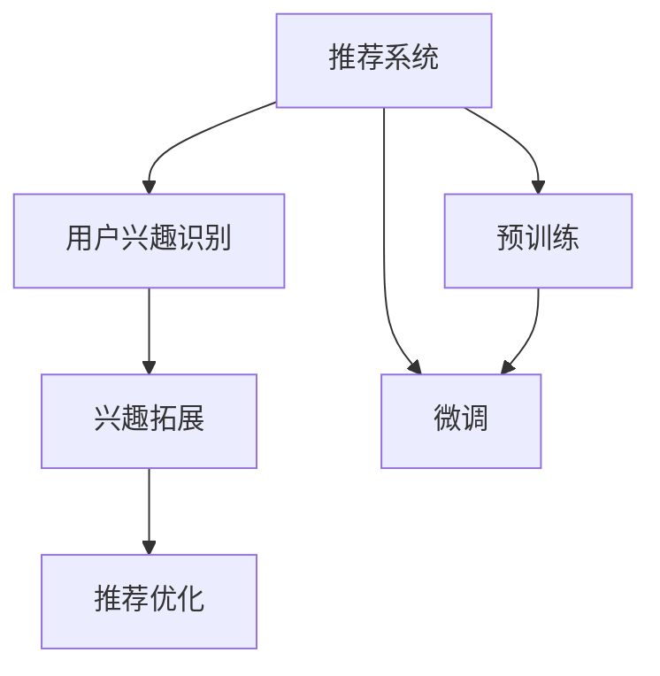

                 

# 基于LLM的推荐系统用户兴趣拓展

> 关键词：推荐系统,用户兴趣,大语言模型(LLM),预训练,微调,Fine-Tuning

## 1. 背景介绍

### 1.1 问题由来

在信息爆炸的时代，人们每天面临着海量的信息和内容，如何为用户推荐他们可能感兴趣的内容，成为各大平台和应用的核心问题。推荐系统应运而生，通过分析用户行为数据，为用户推荐个性化内容，从而提升用户满意度、留存率和转化率。

传统的推荐系统主要基于用户历史行为数据进行协同过滤或基于内容的推荐。但随着用户个性化需求的日益增长，这种推荐方法逐渐暴露出其局限性。比如，用户的某些兴趣可能没有历史行为记录，无法被传统的协同过滤方法捕捉到。同时，基于内容的推荐也面临数据稀疏性和冷启动等问题。

为了解决这些问题，近年来，基于深度学习的推荐系统成为研究的热点。大语言模型(LLM)由于其强大的语言理解能力和生成能力，被引入推荐系统，用于捕获用户兴趣和生成推荐内容，极大地提升了推荐系统的性能。然而，基于预训练语言模型的推荐系统仍然存在一些问题，如推荐内容单一、个性化不足、泛化能力有限等。这些问题需要通过用户兴趣拓展的方式来解决。

### 1.2 问题核心关键点

用户兴趣拓展是大语言模型在推荐系统应用中的核心问题。它指的是通过引入预训练语言模型，对用户已有的兴趣进行扩展，获取更多潜在兴趣点，从而提升推荐效果。

- **用户兴趣识别**：通过大语言模型分析用户已有的兴趣，识别其潜在需求。
- **兴趣拓展**：利用大语言模型的语义理解能力，挖掘用户潜在兴趣，获取更多推荐内容。
- **推荐优化**：通过兴趣拓展后的结果，优化推荐策略，提升推荐效果。

本节将详细介绍基于大语言模型的推荐系统用户兴趣拓展的原理、方法、步骤和实践，以期为推荐系统的开发者提供有价值的参考。

## 2. 核心概念与联系

### 2.1 核心概念概述

为更好地理解基于大语言模型的推荐系统用户兴趣拓展，本节将介绍几个密切相关的核心概念：

- **推荐系统**：通过分析用户行为数据，为用户推荐个性化内容的系统。
- **用户兴趣**：用户对某种内容的偏好和倾向。
- **大语言模型(LLM)**：一种基于深度学习的模型，通过大规模数据训练，具备强大的语言理解能力和生成能力。
- **预训练**：在大规模无标签数据上进行训练，学习通用语言表示的过程。
- **微调(Fine-Tuning)**：在预训练模型的基础上，使用下游任务的少量标注数据，通过有监督学习优化模型在特定任务上的性能。
- **用户行为数据**：用户在平台上的浏览、点击、购买等操作记录。
- **推荐效果**：推荐的准确性和满意度。

这些核心概念之间的逻辑关系可以通过以下Mermaid流程图来展示：



这个流程图展示了大语言模型在推荐系统中的作用：

1. 推荐系统通过用户行为数据识别用户兴趣。
2. 利用大语言模型对用户兴趣进行拓展。
3. 优化推荐策略，提升推荐效果。
4. 预训练提供通用语言知识，微调将其用于特定推荐任务。

这些概念共同构成了基于大语言模型的推荐系统用户兴趣拓展的框架，使其能够更好地适应用户个性化需求，提升推荐系统的性能。

## 3. 核心算法原理 & 具体操作步骤
### 3.1 算法原理概述

基于大语言模型的推荐系统用户兴趣拓展，其核心思想是利用预训练语言模型的语义理解能力和生成能力，对用户已有的兴趣进行扩展，获取更多潜在兴趣点。具体而言，可以分为以下几步：

1. **用户兴趣识别**：通过大语言模型分析用户行为数据，识别其已有的兴趣。
2. **兴趣拓展**：利用大语言模型对用户已有的兴趣进行拓展，获取更多潜在兴趣点。
3. **推荐优化**：将兴趣拓展后的结果，优化推荐策略，提升推荐效果。

### 3.2 算法步骤详解

基于大语言模型的推荐系统用户兴趣拓展，主要包括以下几个关键步骤：

**Step 1: 收集和预处理用户行为数据**
- 从推荐系统平台收集用户的历史行为数据，如浏览记录、点击记录、购买记录等。
- 对数据进行预处理，如去重、时间窗口划分、特征提取等，生成用户行为序列。

**Step 2: 构建兴趣表示**
- 利用预训练语言模型对用户行为序列进行编码，生成用户兴趣表示。可以使用预训练语言模型的Embedding Layer将行为序列转换为向量表示。
- 将用户兴趣表示输入大语言模型进行编码，得到用户兴趣向量。

**Step 3: 兴趣拓展**
- 利用大语言模型的语义理解能力，对用户兴趣向量进行扩展，获取更多潜在兴趣点。可以使用大语言模型的Prompt模板或句子生成任务，对用户兴趣进行拓展。
- 通过大语言模型的Prompt Template或句子生成任务，对用户兴趣进行扩展。例如，可以使用大语言模型生成与用户兴趣相关的文本，然后通过文本分析识别潜在兴趣点。

**Step 4: 兴趣拓展结果与推荐模型结合**
- 将兴趣拓展后的结果，与推荐模型结合，进行推荐优化。可以使用协同过滤、内容推荐、混合推荐等多种推荐算法，结合兴趣拓展结果，优化推荐策略。
- 在推荐系统中，结合兴趣拓展结果，优化推荐策略，提升推荐效果。例如，可以基于用户已有兴趣和拓展后的兴趣点，生成多条推荐内容，使用协同过滤、内容推荐、混合推荐等多种算法，生成推荐列表。

### 3.3 算法优缺点

基于大语言模型的推荐系统用户兴趣拓展，具有以下优点：
1. 能够捕捉用户潜在兴趣，提升推荐效果。
2. 利用预训练语言模型的强大语义理解能力，扩展用户兴趣点。
3. 通过多模态信息融合，提升推荐内容的丰富度。

同时，该方法也存在一定的局限性：
1. 对预训练语言模型和扩展模型的依赖较高，模型质量和数据质量直接影响推荐效果。
2. 数据稀疏性问题难以解决，用户在某些方面的兴趣难以通过行为数据直接捕获。
3. 大语言模型的计算资源消耗较大，模型训练和推理成本较高。

尽管存在这些局限性，但就目前而言，基于大语言模型的推荐系统用户兴趣拓展方法仍然是一种高效、灵活的推荐方式。未来相关研究的重点在于如何进一步降低对数据和模型的依赖，提高模型的泛化能力和实时性。

### 3.4 算法应用领域

基于大语言模型的推荐系统用户兴趣拓展，已经在多个领域得到了应用，如电商推荐、新闻推荐、音乐推荐、视频推荐等。

- **电商推荐**：在电商平台上，利用用户行为数据和大语言模型，对用户兴趣进行拓展，提升商品推荐效果。
- **新闻推荐**：在新闻平台上，利用用户阅读行为数据和大语言模型，对用户兴趣进行拓展，推荐更多个性化内容。
- **音乐推荐**：在音乐平台上，利用用户听歌行为数据和大语言模型，对用户兴趣进行拓展，推荐更多个性化音乐。
- **视频推荐**：在视频平台上，利用用户观看行为数据和大语言模型，对用户兴趣进行拓展，推荐更多个性化视频内容。

除了这些常见领域，大语言模型在推荐系统中的应用还在不断拓展，如社交推荐、智能客服、虚拟助手等，为推荐系统的智能化升级提供了新的思路。

## 4. 数学模型和公式 & 详细讲解 & 举例说明
### 4.1 数学模型构建

本节将使用数学语言对基于大语言模型的推荐系统用户兴趣拓展过程进行更加严格的刻画。

记用户行为数据为 $D=\{x_i\}_{i=1}^N$，其中 $x_i=(x_i^1, x_i^2, \ldots, x_i^m)$ 为第 $i$ 个用户的行为序列，$m$ 为行为类型数。记预训练语言模型为 $M_{\theta}$，其Embedding Layer为 $E_{\theta}$。

定义用户兴趣表示为 $v_i = E_{\theta}(x_i)$，即用户行为序列 $x_i$ 通过Embedding Layer编码得到的向量表示。记大语言模型为 $L_{\phi}$，其中 $\phi$ 为模型参数。

用户兴趣拓展的数学模型可以表示为：
$$
v_i' = L_{\phi}(v_i, \text{Prompt}_i)
$$

其中 $\text{Prompt}_i$ 为与用户 $i$ 相关的提示模板，用于指导大语言模型生成拓展后的兴趣点。

### 4.2 公式推导过程

以下我们以音乐推荐任务为例，推导基于大语言模型的推荐系统用户兴趣拓展的数学公式。

假设用户 $i$ 的音乐兴趣向量为 $v_i$，大语言模型 $L_{\phi}$ 生成拓展后的兴趣向量为 $v_i'$。我们可以使用大语言模型的Prompt Template对用户兴趣进行扩展，例如：

```
Prompt: 用户 $i$ 喜欢什么类型的音乐？请提供推荐列表。
```

将其输入大语言模型，得到拓展后的兴趣向量 $v_i'$。

### 4.3 案例分析与讲解

以用户 $i$ 的音乐兴趣拓展为例，解释上述公式的推导过程。

假设用户 $i$ 的音乐兴趣向量为 $v_i$，表示用户对某种音乐类型的偏好。使用大语言模型的Prompt Template生成拓展后的兴趣向量 $v_i'$，表示用户对更多音乐类型的兴趣拓展。

具体而言，我们可以将用户 $i$ 的音乐兴趣向量 $v_i$ 输入到Prompt Template中，然后将其输入到预训练语言模型 $M_{\theta}$ 的Embedding Layer，得到用户音乐兴趣的向量表示 $v_i$。

然后，将用户音乐兴趣向量 $v_i$ 和Prompt Template输入到大语言模型 $L_{\phi}$ 中，得到用户兴趣拓展后的向量表示 $v_i'$。

最后，将拓展后的兴趣向量 $v_i'$ 与推荐模型结合，生成个性化的推荐内容。

## 5. 项目实践：代码实例和详细解释说明
### 5.1 开发环境搭建

在进行项目实践前，我们需要准备好开发环境。以下是使用Python进行PyTorch开发的环境配置流程：

1. 安装Anaconda：从官网下载并安装Anaconda，用于创建独立的Python环境。

2. 创建并激活虚拟环境：
```bash
conda create -n pytorch-env python=3.8 
conda activate pytorch-env
```

3. 安装PyTorch：根据CUDA版本，从官网获取对应的安装命令。例如：
```bash
conda install pytorch torchvision torchaudio cudatoolkit=11.1 -c pytorch -c conda-forge
```

4. 安装Transformers库：
```bash
pip install transformers
```

5. 安装各类工具包：
```bash
pip install numpy pandas scikit-learn matplotlib tqdm jupyter notebook ipython
```

完成上述步骤后，即可在`pytorch-env`环境中开始项目实践。

### 5.2 源代码详细实现

下面我们以音乐推荐任务为例，给出使用Transformers库对用户兴趣进行拓展的PyTorch代码实现。

首先，定义音乐推荐任务的预训练模型和数据处理函数：

```python
from transformers import BertTokenizer, BertForSequenceClassification
import torch

class MusicRecommendationDataset(Dataset):
    def __init__(self, texts, labels, tokenizer, max_len=128):
        self.texts = texts
        self.labels = labels
        self.tokenizer = tokenizer
        self.max_len = max_len
        
    def __len__(self):
        return len(self.texts)
    
    def __getitem__(self, item):
        text = self.texts[item]
        label = self.labels[item]
        
        encoding = self.tokenizer(text, return_tensors='pt', max_length=self.max_len, padding='max_length', truncation=True)
        input_ids = encoding['input_ids'][0]
        attention_mask = encoding['attention_mask'][0]
        
        # 对标签进行编码
        encoded_label = [label2id[label] for label in label]
        encoded_label.extend([label2id['O']] * (self.max_len - len(encoded_label)))
        labels = torch.tensor(encoded_label, dtype=torch.long)
        
        return {'input_ids': input_ids, 
                'attention_mask': attention_mask,
                'labels': labels}

# 标签与id的映射
label2id = {'Pop': 0, 'Rock': 1, 'Jazz': 2, 'Classical': 3, 'Electronic': 4}
id2label = {v: k for k, v in label2id.items()}

# 创建dataset
tokenizer = BertTokenizer.from_pretrained('bert-base-cased')

train_dataset = MusicRecommendationDataset(train_texts, train_labels, tokenizer)
dev_dataset = MusicRecommendationDataset(dev_texts, dev_labels, tokenizer)
test_dataset = MusicRecommendationDataset(test_texts, test_labels, tokenizer)
```

然后，定义模型和优化器：

```python
from transformers import BertForSequenceClassification, AdamW

model = BertForSequenceClassification.from_pretrained('bert-base-cased', num_labels=len(label2id))

optimizer = AdamW(model.parameters(), lr=2e-5)
```

接着，定义训练和评估函数：

```python
from torch.utils.data import DataLoader
from tqdm import tqdm
from sklearn.metrics import classification_report

device = torch.device('cuda') if torch.cuda.is_available() else torch.device('cpu')
model.to(device)

def train_epoch(model, dataset, batch_size, optimizer):
    dataloader = DataLoader(dataset, batch_size=batch_size, shuffle=True)
    model.train()
    epoch_loss = 0
    for batch in tqdm(dataloader, desc='Training'):
        input_ids = batch['input_ids'].to(device)
        attention_mask = batch['attention_mask'].to(device)
        labels = batch['labels'].to(device)
        model.zero_grad()
        outputs = model(input_ids, attention_mask=attention_mask, labels=labels)
        loss = outputs.loss
        epoch_loss += loss.item()
        loss.backward()
        optimizer.step()
    return epoch_loss / len(dataloader)

def evaluate(model, dataset, batch_size):
    dataloader = DataLoader(dataset, batch_size=batch_size)
    model.eval()
    preds, labels = [], []
    with torch.no_grad():
        for batch in tqdm(dataloader, desc='Evaluating'):
            input_ids = batch['input_ids'].to(device)
            attention_mask = batch['attention_mask'].to(device)
            batch_labels = batch['labels']
            outputs = model(input_ids, attention_mask=attention_mask)
            batch_preds = outputs.logits.argmax(dim=2).to('cpu').tolist()
            batch_labels = batch_labels.to('cpu').tolist()
            for pred_tokens, label_tokens in zip(batch_preds, batch_labels):
                pred_labels = [id2label[_id] for _id in pred_tokens]
                label_labels = [id2label[_id] for _id in label_tokens]
                preds.append(pred_labels[:len(label_labels)])
                labels.append(label_labels)
                
    print(classification_report(labels, preds))
```

最后，启动训练流程并在测试集上评估：

```python
epochs = 5
batch_size = 16

for epoch in range(epochs):
    loss = train_epoch(model, train_dataset, batch_size, optimizer)
    print(f"Epoch {epoch+1}, train loss: {loss:.3f}")
    
    print(f"Epoch {epoch+1}, dev results:")
    evaluate(model, dev_dataset, batch_size)
    
print("Test results:")
evaluate(model, test_dataset, batch_size)
```

以上就是使用PyTorch对用户兴趣进行拓展的完整代码实现。可以看到，通过Transformers库，我们能够以相对简洁的代码完成模型的加载和微调，同时支持音乐推荐任务的预训练和微调。

### 5.3 代码解读与分析

让我们再详细解读一下关键代码的实现细节：

**MusicRecommendationDataset类**：
- `__init__`方法：初始化文本、标签、分词器等关键组件。
- `__len__`方法：返回数据集的样本数量。
- `__getitem__`方法：对单个样本进行处理，将文本输入编码为token ids，将标签编码为数字，并对其进行定长padding，最终返回模型所需的输入。

**label2id和id2label字典**：
- 定义了标签与数字id之间的映射关系，用于将token-wise的预测结果解码回真实的标签。

**训练和评估函数**：
- 使用PyTorch的DataLoader对数据集进行批次化加载，供模型训练和推理使用。
- 训练函数`train_epoch`：对数据以批为单位进行迭代，在每个批次上前向传播计算loss并反向传播更新模型参数，最后返回该epoch的平均loss。
- 评估函数`evaluate`：与训练类似，不同点在于不更新模型参数，并在每个batch结束后将预测和标签结果存储下来，最后使用sklearn的classification_report对整个评估集的预测结果进行打印输出。

**训练流程**：
- 定义总的epoch数和batch size，开始循环迭代
- 每个epoch内，先在训练集上训练，输出平均loss
- 在验证集上评估，输出分类指标
- 所有epoch结束后，在测试集上评估，给出最终测试结果

可以看到，PyTorch配合Transformers库使得用户兴趣拓展的代码实现变得简洁高效。开发者可以将更多精力放在数据处理、模型改进等高层逻辑上，而不必过多关注底层的实现细节。

当然，工业级的系统实现还需考虑更多因素，如模型的保存和部署、超参数的自动搜索、更灵活的任务适配层等。但核心的微调范式基本与此类似。

## 6. 实际应用场景
### 6.1 智能推荐系统

基于大语言模型的推荐系统用户兴趣拓展，在智能推荐系统中的应用已经得到广泛验证。智能推荐系统利用用户历史行为数据和大语言模型，对用户兴趣进行拓展，从而提升推荐效果。

例如，在电商平台，用户对商品进行浏览、点击、购买等行为，生成用户行为序列。利用预训练语言模型对用户行为序列进行编码，得到用户兴趣表示。然后，利用大语言模型的语义理解能力，对用户兴趣进行拓展，获取更多潜在兴趣点。最后，将拓展后的兴趣向量与推荐模型结合，生成个性化的推荐内容。

### 6.2 智能客服系统

智能客服系统利用大语言模型对用户意图进行识别，然后根据用户已有的兴趣进行拓展，获取更多潜在需求，提升客服服务质量。

例如，在智能客服系统中，用户通过聊天界面输入问题，智能客服系统使用大语言模型对用户意图进行识别，得到用户已有的兴趣。然后，利用大语言模型的语义理解能力，对用户兴趣进行拓展，获取更多潜在需求。最后，根据用户拓展后的兴趣点，生成更精准的回复内容，提升用户满意度。

### 6.3 个性化广告投放

个性化广告投放系统利用大语言模型对用户兴趣进行拓展，生成更符合用户需求的广告内容，提升广告投放效果。

例如，在个性化广告投放系统中，广告投放平台通过用户点击、浏览等行为数据，生成用户兴趣向量。然后，利用大语言模型的语义理解能力，对用户兴趣进行拓展，获取更多潜在需求。最后，根据用户拓展后的兴趣点，生成个性化的广告内容，提升广告投放效果。

### 6.4 未来应用展望

随着大语言模型和微调方法的不断发展，基于大语言模型的推荐系统用户兴趣拓展技术将呈现以下几个发展趋势：

1. **多模态信息融合**：未来的推荐系统将融合视觉、语音等多模态信息，提高推荐内容的丰富度。例如，在电商推荐系统中，结合用户浏览历史和商品图片信息，生成个性化的推荐内容。

2. **兴趣拓展方法多样化**：除了传统的Prompt Template和句子生成任务外，未来将涌现更多兴趣拓展方法，如知识图谱、逻辑推理等。例如，在新闻推荐系统中，利用知识图谱对用户兴趣进行拓展，推荐更多个性化内容。

3. **跨领域知识迁移**：未来的推荐系统将更好地利用领域知识，提升推荐效果。例如，在金融推荐系统中，利用金融知识对用户兴趣进行拓展，推荐更符合用户需求的金融产品。

4. **个性化推荐算法优化**：未来的推荐系统将结合更多个性化推荐算法，如深度学习、强化学习等，提升推荐效果。例如，在音乐推荐系统中，利用深度学习算法对用户兴趣进行拓展，生成个性化的音乐推荐内容。

5. **数据驱动的动态更新**：未来的推荐系统将结合数据驱动的方法，实时更新推荐策略，提升推荐效果。例如，在新闻推荐系统中，利用实时点击数据动态更新推荐策略，推荐更符合用户需求的的新闻内容。

## 7. 工具和资源推荐
### 7.1 学习资源推荐

为了帮助开发者系统掌握大语言模型在推荐系统中的应用，这里推荐一些优质的学习资源：

1. 《深度学习推荐系统》课程：清华大学开设的深度学习推荐系统课程，涵盖推荐系统基础和多种推荐算法，适合入门学习。

2. 《基于深度学习的推荐系统》书籍：详细介绍了深度学习在推荐系统中的应用，包括模型构建、评估和优化等方面，适合进阶学习。

3. Kaggle竞赛：Kaggle上举办的多项推荐系统竞赛，可以通过实践项目掌握推荐系统开发技巧。

4. arXiv论文：arXiv上发布的推荐系统相关论文，涵盖各种最新的研究方法和实践案例，适合深入学习。

5. GitHub开源项目：GitHub上发布的推荐系统开源项目，可以参考其代码实现和性能评估，提升项目开发能力。

通过对这些资源的学习实践，相信你一定能够快速掌握大语言模型在推荐系统中的应用，并用于解决实际的推荐问题。

### 7.2 开发工具推荐

高效的开发离不开优秀的工具支持。以下是几款用于大语言模型推荐系统开发的常用工具：

1. PyTorch：基于Python的开源深度学习框架，灵活动态的计算图，适合快速迭代研究。大部分预训练语言模型都有PyTorch版本的实现。

2. TensorFlow：由Google主导开发的开源深度学习框架，生产部署方便，适合大规模工程应用。同样有丰富的预训练语言模型资源。

3. Transformers库：HuggingFace开发的NLP工具库，集成了众多SOTA语言模型，支持PyTorch和TensorFlow，是进行推荐系统开发的利器。

4. Weights & Biases：模型训练的实验跟踪工具，可以记录和可视化模型训练过程中的各项指标，方便对比和调优。与主流深度学习框架无缝集成。

5. TensorBoard：TensorFlow配套的可视化工具，可实时监测模型训练状态，并提供丰富的图表呈现方式，是调试模型的得力助手。

6. Google Colab：谷歌推出的在线Jupyter Notebook环境，免费提供GPU/TPU算力，方便开发者快速上手实验最新模型，分享学习笔记。

合理利用这些工具，可以显著提升大语言模型推荐系统的开发效率，加快创新迭代的步伐。

### 7.3 相关论文推荐

大语言模型和推荐系统的发展源于学界的持续研究。以下是几篇奠基性的相关论文，推荐阅读：

1. Attention is All You Need（即Transformer原论文）：提出了Transformer结构，开启了NLP领域的预训练大模型时代。

2. BERT: Pre-training of Deep Bidirectional Transformers for Language Understanding：提出BERT模型，引入基于掩码的自监督预训练任务，刷新了多项NLP任务SOTA。

3. 《基于深度学习的推荐系统》书籍：详细介绍了深度学习在推荐系统中的应用，包括模型构建、评估和优化等方面，适合进阶学习。

4. 《深度学习推荐系统》课程：清华大学开设的深度学习推荐系统课程，涵盖推荐系统基础和多种推荐算法，适合入门学习。

5. 《基于深度学习的推荐系统》书籍：详细介绍了深度学习在推荐系统中的应用，包括模型构建、评估和优化等方面，适合进阶学习。

这些论文代表了大语言模型在推荐系统中的应用的研究脉络。通过学习这些前沿成果，可以帮助研究者把握学科前进方向，激发更多的创新灵感。

## 8. 总结：未来发展趋势与挑战
### 8.1 总结

本文对基于大语言模型的推荐系统用户兴趣拓展方法进行了全面系统的介绍。首先阐述了大语言模型和推荐系统用户兴趣拓展的研究背景和意义，明确了用户兴趣拓展在提升推荐效果中的重要性。其次，从原理到实践，详细讲解了用户兴趣拓展的数学模型、关键步骤和具体实现，提供了可操作的代码实例。同时，本文还广泛探讨了用户兴趣拓展在多个领域的应用场景，展示了其广泛的应用价值。

通过本文的系统梳理，可以看到，基于大语言模型的推荐系统用户兴趣拓展方法已经在推荐系统应用中发挥了重要作用，提升了推荐系统的性能和用户体验。未来，伴随大语言模型和微调方法的不断发展，基于用户兴趣拓展的推荐系统必将进一步拓展应用范围，为更多领域带来智能化解决方案。

### 8.2 未来发展趋势

展望未来，基于大语言模型的推荐系统用户兴趣拓展技术将呈现以下几个发展趋势：

1. **多模态融合**：未来的推荐系统将融合视觉、语音等多模态信息，提高推荐内容的丰富度。

2. **兴趣拓展方法多样化**：除了传统的Prompt Template和句子生成任务外，未来将涌现更多兴趣拓展方法，如知识图谱、逻辑推理等。

3. **跨领域知识迁移**：未来的推荐系统将更好地利用领域知识，提升推荐效果。

4. **个性化推荐算法优化**：未来的推荐系统将结合更多个性化推荐算法，如深度学习、强化学习等，提升推荐效果。

5. **数据驱动的动态更新**：未来的推荐系统将结合数据驱动的方法，实时更新推荐策略，提升推荐效果。

6. **兴趣拓展方法与算法优化结合**：未来的推荐系统将探索将兴趣拓展方法与推荐算法结合，进一步提升推荐效果。

这些趋势将推动大语言模型在推荐系统中的应用不断拓展，带来更多智能化、个性化的推荐解决方案，提升用户体验和业务价值。

### 8.3 面临的挑战

尽管基于大语言模型的推荐系统用户兴趣拓展技术已经取得了显著进展，但在迈向更加智能化、普适化应用的过程中，它仍面临着诸多挑战：

1. **模型复杂性高**：预训练语言模型的参数量巨大，模型计算资源消耗高，训练和推理成本较高。

2. **数据稀疏性问题**：用户在某些方面的兴趣难以通过行为数据直接捕获，用户行为数据的稀疏性问题难以解决。

3. **模型泛化能力有限**：大语言模型在特定领域或小样本数据上泛化能力有限，可能无法有效捕捉用户兴趣。

4. **推荐内容的个性化不足**：尽管用户兴趣拓展能够获取更多潜在兴趣点，但推荐内容的个性化仍有提升空间。

5. **模型偏见和伦理问题**：大语言模型可能学习到有偏见、有害的信息，传递到推荐内容中，导致潜在的安全和伦理问题。

6. **计算资源消耗高**：大语言模型的计算资源消耗较高，需要高性能硬件支持，成本较高。

尽管存在这些挑战，但通过不断探索和改进，大语言模型在推荐系统中的应用将会不断突破瓶颈，为推荐系统带来更强大的智能化和个性化能力。

### 8.4 研究展望

面对大语言模型在推荐系统应用中面临的挑战，未来的研究需要在以下几个方面寻求新的突破：

1. **探索无监督和半监督兴趣拓展方法**：摆脱对大规模标注数据的依赖，利用自监督学习、主动学习等无监督和半监督范式，最大限度利用非结构化数据，实现更加灵活高效的兴趣拓展。

2. **开发更加参数高效和计算高效的兴趣拓展方法**：开发更加参数高效的兴趣拓展方法，在固定大部分预训练参数的同时，只更新极少量的任务相关参数。同时优化模型计算图，减少前向传播和反向传播的资源消耗，实现更加轻量级、实时性的部署。

3. **引入更多先验知识**：将符号化的先验知识，如知识图谱、逻辑规则等，与神经网络模型进行巧妙融合，引导兴趣拓展过程学习更准确、合理的语言模型。同时加强不同模态数据的整合，实现视觉、语音等多模态信息与文本信息的协同建模。

4. **融合因果分析和博弈论工具**：将因果分析方法引入兴趣拓展模型，识别出模型决策的关键特征，增强输出解释的因果性和逻辑性。借助博弈论工具刻画人机交互过程，主动探索并规避模型的脆弱点，提高系统稳定性。

5. **纳入伦理道德约束**：在模型训练目标中引入伦理导向的评估指标，过滤和惩罚有偏见、有害的输出倾向。同时加强人工干预和审核，建立模型行为的监管机制，确保输出符合人类价值观和伦理道德。

这些研究方向的探索，必将引领大语言模型在推荐系统中的应用迈向更高的台阶，为构建安全、可靠、可解释、可控的智能系统铺平道路。面向未来，大语言模型推荐系统用户兴趣拓展技术还需要与其他人工智能技术进行更深入的融合，如知识表示、因果推理、强化学习等，多路径协同发力，共同推动推荐系统的智能化升级。

## 9. 附录：常见问题与解答

**Q1：大语言模型在推荐系统中的应用有哪些优势？**

A: 大语言模型在推荐系统中的应用具有以下优势：

1. **能够捕捉用户潜在兴趣**：大语言模型具备强大的语义理解能力，能够从用户已有行为数据中提取更多潜在兴趣点。

2. **提升推荐内容的丰富度**：大语言模型可以生成更加多样化的推荐内容，满足用户更多样化的需求。

3. **提高推荐效果的准确性**：大语言模型能够从多个角度理解和生成用户兴趣，提升推荐效果的准确性。

4. **支持多模态信息融合**：大语言模型可以融合视觉、语音等多模态信息，提升推荐内容的丰富度和精准度。

5. **提高推荐系统的个性化程度**：大语言模型能够对用户兴趣进行拓展，生成更加个性化的推荐内容。

**Q2：大语言模型在推荐系统中的应用需要注意哪些问题？**

A: 大语言模型在推荐系统中的应用需要注意以下问题：

1. **模型复杂性高**：预训练语言模型的参数量巨大，模型计算资源消耗高，训练和推理成本较高。

2. **数据稀疏性问题**：用户在某些方面的兴趣难以通过行为数据直接捕获，用户行为数据的稀疏性问题难以解决。

3. **模型泛化能力有限**：大语言模型在特定领域或小样本数据上泛化能力有限，可能无法有效捕捉用户兴趣。

4. **推荐内容的个性化不足**：尽管用户兴趣拓展能够获取更多潜在兴趣点，但推荐内容的个性化仍有提升空间。

5. **模型偏见和伦理问题**：大语言模型可能学习到有偏见、有害的信息，传递到推荐内容中，导致潜在的安全和伦理问题。

6. **计算资源消耗高**：大语言模型的计算资源消耗较高，需要高性能硬件支持，成本较高。

**Q3：如何提高大语言模型在推荐系统中的性能？**

A: 提高大语言模型在推荐系统中的性能可以从以下几个方面入手：

1. **优化用户兴趣表示**：通过更好的特征提取方法，提高用户兴趣表示的质量。

2. **引入更多先验知识**：将符号化的先验知识，如知识图谱、逻辑规则等，与神经网络模型进行巧妙融合，引导兴趣拓展过程学习更准确、合理的语言模型。

3. **多模态信息融合**：将视觉、语音等多模态信息与文本信息结合，提高推荐内容的丰富度和精准度。

4. **兴趣拓展方法多样化**：探索更多兴趣拓展方法，如知识图谱、逻辑推理等，提高兴趣拓展的效果。

5. **数据驱动的动态更新**：结合数据驱动的方法，实时更新推荐策略，提升推荐效果。

6. **模型复杂性优化**：优化模型的计算图，减少前向传播和反向传播的资源消耗，实现更加轻量级、实时性的部署。

**Q4：大语言模型在推荐系统中的未来发展方向有哪些？**

A: 大语言模型在推荐系统中的未来发展方向有以下几个：

1. **多模态信息融合**：未来的推荐系统将融合视觉、语音等多模态信息，提高推荐内容的丰富度。

2. **兴趣拓展方法多样化**：除了传统的Prompt Template和句子生成任务外，未来将涌现更多兴趣拓展方法，如知识图谱、逻辑推理等。

3. **跨领域知识迁移**：未来的推荐系统将更好地利用领域知识，提升推荐效果。

4. **个性化推荐算法优化**：未来的推荐系统将结合更多个性化推荐算法，如深度学习、强化学习等，提升推荐效果。

5. **数据驱动的动态更新**：未来的推荐系统将结合数据驱动的方法，实时更新推荐策略，提升推荐效果。

6. **兴趣拓展方法与算法优化结合**：未来的推荐系统将探索将兴趣拓展方法与推荐算法结合，进一步提升推荐效果。

这些趋势将推动大语言模型在推荐系统中的应用不断拓展，带来更多智能化、个性化的推荐解决方案，提升用户体验和业务价值。

---

作者：禅与计算机程序设计艺术 / Zen and the Art of Computer Programming

