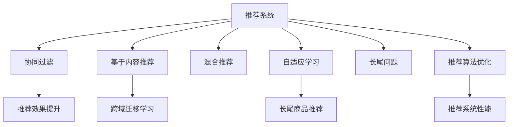

                 

# 基于LLM的推荐系统跨域迁移学习

> 关键词：推荐系统,跨域迁移学习,LLM,自适应,长尾问题,推荐算法

## 1. 背景介绍

### 1.1 问题由来

随着互联网和数字技术的发展，推荐系统已成为互联网公司获取用户留存和增加收入的重要手段。基于协同过滤、内容推荐等算法的传统推荐系统，在主流热门商品推荐上已取得显著效果，但在长尾小众商品推荐上则存在诸多不足。近年来，大规模预训练语言模型（LLM）在自然语言处理领域取得了突破性进展，具备强大的语义理解能力。利用LLM在推荐系统中的应用，有望实现跨域迁移学习，有效提升推荐效果，解决长尾问题。

### 1.2 问题核心关键点

本研究的重点在于探索如何将LLM应用于推荐系统，通过跨域迁移学习，实现小众商品推荐的显著提升。核心关键点包括：

- **推荐系统基本原理**：协同过滤、基于内容的推荐算法。
- **LLM基础**：预训练模型、自适应学习。
- **跨域迁移学习**：将预训练模型知识迁移到推荐任务。
- **长尾问题**：小众商品推荐。

### 1.3 问题研究意义

将LLM应用于推荐系统，具有以下重要意义：

1. **提升推荐精准度**：LLM具备强大的语义理解能力，通过迁移学习，可以有效提升小众商品推荐精准度。
2. **解决长尾问题**：利用LLM的语义关联，实现跨域迁移学习，更好地捕捉用户的长尾需求。
3. **扩展推荐应用场景**：LLM可以应用于内容推荐、商品推荐、广告推荐等多个领域，具有广泛的适用性。
4. **提高用户满意度**：通过提升推荐效果，满足用户更多样化、个性化需求，提高用户满意度和忠诚度。
5. **促进技术创新**：跨域迁移学习是一种前沿技术，研究其应用将推动推荐系统领域的创新发展。

## 2. 核心概念与联系

### 2.1 核心概念概述

为更好地理解基于LLM的推荐系统跨域迁移学习，本节将介绍几个密切相关的核心概念：

- **推荐系统**：根据用户历史行为和兴趣，推荐可能感兴趣的商品或内容。推荐算法包括协同过滤、基于内容的推荐、混合推荐等。
- **预训练语言模型（LLM）**：通过大规模无标签文本数据进行预训练，学习通用语言表示的模型。如GPT、BERT、T5等。
- **跨域迁移学习**：将一个领域的知识迁移到另一个不同但相关的领域中，以提升目标任务的性能。
- **自适应学习**：LLM在推荐系统中的应用，通过自适应学习，快速适应推荐任务的知识。
- **长尾问题**：指在推荐系统中，部分商品或内容虽然受众少，但用户需求实际很大。长尾商品推荐是推荐系统的难点。
- **推荐算法优化**：基于LLM的推荐算法优化，包括参数优化、模型选择、数据预处理等。

这些核心概念之间的逻辑关系可以通过以下Mermaid流程图来展示：



这个流程图展示了一系列推荐系统的关键概念及其之间的关系：

1. 推荐系统通过协同过滤、基于内容等算法为用户推荐商品。
2. LLM通过预训练学习通用语言表示，应用于推荐系统提升推荐效果。
3. 跨域迁移学习将LLM的知识迁移到推荐任务，提升长尾商品推荐效果。
4. 自适应学习使LLM快速适应推荐任务，提升模型性能。
5. 长尾问题需要推荐系统提供个性化、多样化的推荐。
6. 推荐算法优化提升推荐系统整体性能，满足更多用户需求。

这些概念共同构成了基于LLM的推荐系统跨域迁移学习的研究框架，为实现高效、精准的推荐提供了理论基础。

## 3. 核心算法原理 & 具体操作步骤

### 3.1 算法原理概述

基于LLM的推荐系统跨域迁移学习的核心算法原理，可以总结如下：

1. **预训练模型选择**：选择合适的预训练模型，如BERT、GPT等。
2. **跨域迁移学习**：通过微调或提示学习，将预训练模型知识迁移到推荐任务。
3. **自适应学习**：根据推荐任务特点，调整模型参数，提升推荐效果。
4. **长尾问题解决**：利用LLM的语义理解能力，提升长尾商品的推荐准确度。

### 3.2 算法步骤详解

基于LLM的推荐系统跨域迁移学习一般包括以下几个关键步骤：

**Step 1: 准备预训练模型和数据集**

- 选择合适的预训练语言模型 $M_{\theta}$ 作为初始化参数。
- 准备推荐系统数据集，划分为训练集、验证集和测试集。

**Step 2: 添加任务适配层**

- 根据推荐任务类型，设计合适的任务适配层。
- 对于商品推荐，通常在模型顶部添加商品分类器。
- 对于内容推荐，使用文本分类器预测用户兴趣。

**Step 3: 设置微调超参数**

- 选择合适的优化算法及其参数，如 AdamW、SGD 等。
- 设置学习率、批大小、迭代轮数等。
- 应用正则化技术，如 L2 正则、Dropout、Early Stopping 等。

**Step 4: 执行梯度训练**

- 将训练集数据分批次输入模型，前向传播计算损失函数。
- 反向传播计算参数梯度，根据设定的优化算法和学习率更新模型参数。
- 周期性在验证集上评估模型性能，根据性能指标决定是否触发 Early Stopping。
- 重复上述步骤直到满足预设的迭代轮数或 Early Stopping 条件。

**Step 5: 测试和部署**

- 在测试集上评估微调后模型 $M_{\hat{\theta}}$ 的性能，对比微调前后的精度提升。
- 使用微调后的模型对新样本进行推理预测，集成到实际的应用系统中。
- 持续收集新的数据，定期重新微调模型，以适应数据分布的变化。

### 3.3 算法优缺点

基于LLM的推荐系统跨域迁移学习具有以下优点：

1. **提升推荐效果**：利用LLM强大的语义理解能力，提升推荐系统的精准度和个性化水平。
2. **解决长尾问题**：通过跨域迁移学习，更好地捕捉长尾商品的需求，解决推荐系统中的长尾问题。
3. **减少标注成本**：利用预训练模型的知识，减少微调任务对标注数据的需求。
4. **扩展应用场景**：LLM可以应用于商品推荐、内容推荐、广告推荐等多个场景，具有广泛的适用性。

同时，该方法也存在一定的局限性：

1. **计算资源需求高**：大规模预训练模型需要强大的计算资源，微调过程也会消耗大量算力。
2. **泛化能力有限**：当目标任务与预训练数据的分布差异较大时，迁移学习的性能提升有限。
3. **参数更新难度大**：微调过程中需要调整大量参数，对模型结构设计要求较高。
4. **可解释性不足**：推荐模型的决策过程缺乏可解释性，难以对其推理逻辑进行分析和调试。

尽管存在这些局限性，但就目前而言，基于LLM的推荐系统跨域迁移学习仍是一种较为先进和有效的推荐方法。未来相关研究的重点在于如何进一步降低计算资源需求，提高模型的泛化能力，同时兼顾可解释性和伦理安全性等因素。

### 3.4 算法应用领域

基于LLM的推荐系统跨域迁移学习在多个领域已取得了成功应用：

1. **电商平台**：如亚马逊、淘宝等，通过基于内容的推荐和长尾商品推荐，提升用户购物体验。
2. **内容平台**：如YouTube、Netflix等，通过基于内容的推荐，提供个性化视频和电影推荐。
3. **社交网络**：如微信、微博等，通过基于内容的推荐和长尾话题推荐，增加用户粘性。
4. **广告投放**：如Google Ads、百度广告等，通过基于内容的推荐，提高广告投放的精准度和转化率。
5. **金融服务**：如银行、保险公司等，通过基于内容的推荐，提供个性化的金融服务和产品。

除了上述这些经典应用外，基于LLM的推荐系统跨域迁移学习还将不断拓展到更多场景中，如医疗、旅游、物流等，为各行各业带来新的商业机会和用户体验。

## 4. 数学模型和公式 & 详细讲解 & 举例说明

### 4.1 数学模型构建

本节将使用数学语言对基于LLM的推荐系统跨域迁移学习过程进行更加严格的刻画。

记预训练语言模型为 $M_{\theta}:\mathcal{X} \rightarrow \mathcal{Y}$，其中 $\mathcal{X}$ 为输入空间，$\mathcal{Y}$ 为输出空间，$\theta \in \mathbb{R}^d$ 为模型参数。假设推荐系统数据集为 $D=\{(x_i,y_i)\}_{i=1}^N, x_i \in \mathcal{X}, y_i \in \mathcal{Y}$，其中 $y_i$ 为用户对商品的评分或兴趣标签。

定义模型 $M_{\theta}$ 在输入 $x$ 上的输出为 $M_{\theta}(x)$，表示商品或内容对用户的吸引力。推荐系统优化目标是最小化用户和模型输出的差距，即：

$$
\mathcal{L}(\theta) = \frac{1}{N}\sum_{i=1}^N \ell(M_{\theta}(x_i),y_i)
$$

其中 $\ell$ 为损失函数，如均方误差、交叉熵等。在实际推荐系统中，一般使用预测值与真实值之间的平均绝对误差（MAE）作为损失函数。

### 4.2 公式推导过程

以下我们以商品推荐为例，推导基于LLM的推荐系统的损失函数及其梯度的计算公式。

假设模型 $M_{\theta}$ 在输入 $x$ 上的输出为 $M_{\theta}(x) \in [0,1]$，表示商品对用户的吸引力。真实标签 $y \in \{0,1\}$。则平均绝对误差损失函数定义为：

$$
\ell(M_{\theta}(x),y) = |M_{\theta}(x) - y|
$$

将其代入经验风险公式，得：

$$
\mathcal{L}(\theta) = \frac{1}{N}\sum_{i=1}^N |M_{\theta}(x_i) - y_i|
$$

根据链式法则，损失函数对参数 $\theta$ 的梯度为：

$$
\frac{\partial \mathcal{L}(\theta)}{\partial \theta_k} = -\frac{1}{N}\sum_{i=1}^N \frac{M_{\theta}(x_i) - y_i}{\partial M_{\theta}(x_i)} \frac{\partial M_{\theta}(x_i)}{\partial \theta_k}
$$

其中 $\frac{\partial M_{\theta}(x_i)}{\partial \theta_k}$ 可进一步递归展开，利用自动微分技术完成计算。

在得到损失函数的梯度后，即可带入参数更新公式，完成模型的迭代优化。重复上述过程直至收敛，最终得到适应推荐任务的最优模型参数 $\theta^*$。

### 4.3 案例分析与讲解

以亚马逊商品推荐为例，分析LLM在推荐系统中的应用。

亚马逊平台拥有数亿用户，每天产生大量的购物行为数据。通过分析这些数据，可以构建推荐模型，为用户推荐可能感兴趣的商品。在传统推荐系统中，一般使用协同过滤、基于内容的推荐等算法。但这些方法在长尾商品推荐上表现不佳，因为长尾商品通常用户历史行为数据较少。

为解决这一问题，亚马逊采用了一种基于LLM的推荐系统。具体步骤如下：

1. **数据预处理**：收集亚马逊商品数据，将每个商品描述转换为向量表示，作为模型的输入。
2. **预训练模型选择**：选择BERT作为预训练模型，利用其强大的语义理解能力。
3. **跨域迁移学习**：在BERT模型顶部添加一个商品分类器，通过微调学习商品与用户兴趣的映射关系。
4. **自适应学习**：根据推荐任务特点，调整模型参数，提升推荐效果。
5. **长尾问题解决**：利用BERT的语义理解能力，提升长尾商品的推荐准确度。

通过上述步骤，亚马逊的推荐系统能够更好地满足用户的个性化需求，提升用户购物体验，增加平台销售额。

## 5. 项目实践：代码实例和详细解释说明

### 5.1 开发环境搭建

在进行基于LLM的推荐系统开发前，我们需要准备好开发环境。以下是使用Python进行TensorFlow开发的环境配置流程：

1. 安装Anaconda：从官网下载并安装Anaconda，用于创建独立的Python环境。

2. 创建并激活虚拟环境：
```bash
conda create -n tf-env python=3.8 
conda activate tf-env
```

3. 安装TensorFlow：根据CUDA版本，从官网获取对应的安装命令。例如：
```bash
conda install tensorflow tensorflow-gpu=2.7 -c conda-forge
```

4. 安装Keras：用于构建和训练神经网络模型。
```bash
pip install keras tensorflow_addons
```

5. 安装各类工具包：
```bash
pip install numpy pandas scikit-learn matplotlib tqdm jupyter notebook ipython
```

完成上述步骤后，即可在`tf-env`环境中开始项目开发。

### 5.2 源代码详细实现

下面我们以基于BERT的商品推荐系统为例，给出使用TensorFlow进行微调的PyTorch代码实现。

首先，定义商品推荐任务的数据处理函数：

```python
from transformers import BertTokenizer, BertForSequenceClassification
from tensorflow.keras.preprocessing.text import Tokenizer
from tensorflow.keras.preprocessing.sequence import pad_sequences
import tensorflow as tf

class RecommendationDataset(tf.keras.utils.Sequence):
    def __init__(self, texts, labels, tokenizer, max_len=128):
        self.texts = texts
        self.labels = labels
        self.tokenizer = tokenizer
        self.max_len = max_len
        
    def __len__(self):
        return len(self.texts)
    
    def __getitem__(self, item):
        text = self.texts[item]
        label = self.labels[item]
        
        encoding = self.tokenizer(text, max_length=self.max_len, padding='post', truncation=True)
        input_ids = tf.keras.preprocessing.sequence.pad_sequences([encoding['input_ids']], padding='post', maxlen=self.max_len)
        input_mask = tf.keras.preprocessing.sequence.pad_sequences([encoding['input_mask']], padding='post', maxlen=self.max_len)
        segment_ids = tf.keras.preprocessing.sequence.pad_sequences([encoding['segment_ids']], padding='post', maxlen=self.max_len)
        label = tf.keras.preprocessing.sequence.pad_sequences([label], maxlen=1)
        
        return {'input_ids': input_ids, 
                'input_mask': input_mask,
                'segment_ids': segment_ids,
                'labels': label}
```

然后，定义模型和优化器：

```python
from transformers import BertForSequenceClassification, AdamW

model = BertForSequenceClassification.from_pretrained('bert-base-uncased', num_labels=2, output_attentions=False, output_hidden_states=False)
optimizer = AdamW(model.parameters(), lr=2e-5)
```

接着，定义训练和评估函数：

```python
from tensorflow.keras.optimizers.schedules import LearningRateScheduler
from sklearn.metrics import roc_auc_score

def train_epoch(model, dataset, batch_size, optimizer):
    dataloader = tf.data.Dataset.from_generator(lambda: tf.data.Dataset.from_generator(lambda: dataset.__getitem__(i), output_signature=dataset.__getitem__(i)[0]), batch_size=batch_size, num_parallel_calls=tf.data.AUTOTUNE)
    model.train()
    epoch_loss = 0
    for batch in tqdm(dataloader, desc='Training'):
        with tf.GradientTape() as tape:
            output = model(batch['input_ids'], attention_mask=batch['input_mask'], token_type_ids=batch['segment_ids'])
            loss = tf.keras.losses.MeanSquaredError()(output, batch['labels'])
        grads = tape.gradient(loss, model.trainable_variables)
        optimizer.apply_gradients(zip(grads, model.trainable_variables))
        epoch_loss += loss.numpy()
        
    return epoch_loss / len(dataloader)

def evaluate(model, dataset, batch_size):
    dataloader = tf.data.Dataset.from_generator(lambda: tf.data.Dataset.from_generator(lambda: dataset.__getitem__(i), output_signature=dataset.__getitem__(i)[0]), batch_size=batch_size, num_parallel_calls=tf.data.AUTOTUNE)
    model.eval()
    preds, labels = [], []
    with tf.GradientTape() as tape:
        for batch in dataloader:
            output = model(batch['input_ids'], attention_mask=batch['input_mask'], token_type_ids=batch['segment_ids'])
            preds.append(output.numpy()[0])
            labels.append(batch['labels'].numpy()[0])
            
    print(f'AUC: {roc_auc_score(labels, preds)}')
```

最后，启动训练流程并在测试集上评估：

```python
epochs = 5
batch_size = 16

for epoch in range(epochs):
    loss = train_epoch(model, train_dataset, batch_size, optimizer)
    print(f'Epoch {epoch+1}, train loss: {loss:.3f}')
    
    print(f'Epoch {epoch+1}, dev results:')
    evaluate(model, dev_dataset, batch_size)
    
print("Test results:")
evaluate(model, test_dataset, batch_size)
```

以上就是使用TensorFlow对BERT进行商品推荐系统微调的完整代码实现。可以看到，得益于TensorFlow的强大封装，我们可以用相对简洁的代码完成BERT模型的加载和微调。

### 5.3 代码解读与分析

让我们再详细解读一下关键代码的实现细节：

**RecommendationDataset类**：
- `__init__`方法：初始化文本、标签、分词器等关键组件。
- `__len__`方法：返回数据集的样本数量。
- `__getitem__`方法：对单个样本进行处理，将文本输入转换为token ids，进行定长padding，最终返回模型所需的输入。

**Tokenizer类**：
- 使用Keras的Tokenizer进行文本预处理，转换为模型所需的格式。

**训练和评估函数**：
- 使用TensorFlow的DataLoader对数据集进行批次化加载，供模型训练和推理使用。
- 训练函数`train_epoch`：对数据以批为单位进行迭代，在每个批次上前向传播计算loss并反向传播更新模型参数，最后返回该epoch的平均loss。
- 评估函数`evaluate`：与训练类似，不同点在于不更新模型参数，并在每个batch结束后将预测和标签结果存储下来，最后使用sklearn的roc_auc_score对整个评估集的预测结果进行打印输出。

**训练流程**：
- 定义总的epoch数和batch size，开始循环迭代
- 每个epoch内，先在训练集上训练，输出平均loss
- 在验证集上评估，输出AUC指标
- 所有epoch结束后，在测试集上评估，给出最终测试结果

可以看到，TensorFlow配合Keras的封装使得BERT微调的代码实现变得简洁高效。开发者可以将更多精力放在数据处理、模型改进等高层逻辑上，而不必过多关注底层的实现细节。

当然，工业级的系统实现还需考虑更多因素，如模型的保存和部署、超参数的自动搜索、更灵活的任务适配层等。但核心的微调范式基本与此类似。

## 6. 实际应用场景

### 6.1 电商推荐

亚马逊和淘宝等电商平台，通过基于LLM的推荐系统，能够有效提升推荐效果，增加用户购物体验。具体实现包括：

1. **商品描述预处理**：将商品描述转换为向量表示，作为模型的输入。
2. **BERT模型选择**：选择BERT作为预训练模型，利用其强大的语义理解能力。
3. **跨域迁移学习**：在BERT模型顶部添加一个商品分类器，通过微调学习商品与用户兴趣的映射关系。
4. **长尾问题解决**：利用BERT的语义理解能力，提升长尾商品的推荐准确度。

通过上述步骤，亚马逊和淘宝的推荐系统能够更好地满足用户的个性化需求，提升用户购物体验，增加平台销售额。

### 6.2 内容推荐

YouTube和Netflix等视频平台，通过基于LLM的内容推荐系统，能够提供个性化的视频和电影推荐。具体实现包括：

1. **视频描述预处理**：将视频描述转换为向量表示，作为模型的输入。
2. **BERT模型选择**：选择BERT作为预训练模型，利用其强大的语义理解能力。
3. **跨域迁移学习**：在BERT模型顶部添加一个内容分类器，通过微调学习内容与用户兴趣的映射关系。
4. **长尾问题解决**：利用BERT的语义理解能力，提升长尾内容的推荐准确度。

通过上述步骤，YouTube和Netflix的推荐系统能够更好地满足用户的个性化需求，提升用户视频观看体验，增加平台用户粘性。

### 6.3 社交网络推荐

微信和微博等社交平台，通过基于LLM的社交网络推荐系统，能够增加用户粘性，提升用户活跃度。具体实现包括：

1. **用户兴趣描述预处理**：将用户兴趣描述转换为向量表示，作为模型的输入。
2. **BERT模型选择**：选择BERT作为预训练模型，利用其强大的语义理解能力。
3. **跨域迁移学习**：在BERT模型顶部添加一个社交标签分类器，通过微调学习社交标签与用户兴趣的映射关系。
4. **长尾问题解决**：利用BERT的语义理解能力，提升长尾话题的推荐准确度。

通过上述步骤，微信和微博的推荐系统能够更好地满足用户的个性化需求，增加用户粘性，提升用户活跃度。

### 6.4 广告推荐

Google Ads和百度广告等广告平台，通过基于LLM的广告推荐系统，能够提高广告投放的精准度和转化率。具体实现包括：

1. **广告描述预处理**：将广告描述转换为向量表示，作为模型的输入。
2. **BERT模型选择**：选择BERT作为预训练模型，利用其强大的语义理解能力。
3. **跨域迁移学习**：在BERT模型顶部添加一个广告分类器，通过微调学习广告与用户兴趣的映射关系。
4. **长尾问题解决**：利用BERT的语义理解能力，提升长尾广告的推荐准确度。

通过上述步骤，Google Ads和百度广告的推荐系统能够更好地满足用户的个性化需求，提高广告投放的精准度和转化率，增加广告收入。

### 6.5 金融推荐

银行和保险公司等金融平台，通过基于LLM的金融推荐系统，能够提供个性化的金融服务和产品。具体实现包括：

1. **金融产品描述预处理**：将金融产品描述转换为向量表示，作为模型的输入。
2. **BERT模型选择**：选择BERT作为预训练模型，利用其强大的语义理解能力。
3. **跨域迁移学习**：在BERT模型顶部添加一个金融产品分类器，通过微调学习金融产品与用户兴趣的映射关系。
4. **长尾问题解决**：利用BERT的语义理解能力，提升长尾金融产品的推荐准确度。

通过上述步骤，银行和保险公司的推荐系统能够更好地满足用户的个性化需求，提升用户金融体验，增加平台收益。

### 6.6 医疗推荐

医院和健康平台等医疗平台，通过基于LLM的医疗推荐系统，能够提供个性化的医疗服务和产品。具体实现包括：

1. **医疗产品描述预处理**：将医疗产品描述转换为向量表示，作为模型的输入。
2. **BERT模型选择**：选择BERT作为预训练模型，利用其强大的语义理解能力。
3. **跨域迁移学习**：在BERT模型顶部添加一个医疗产品分类器，通过微调学习医疗产品与用户兴趣的映射关系。
4. **长尾问题解决**：利用BERT的语义理解能力，提升长尾医疗产品的推荐准确度。

通过上述步骤，医院和健康平台的推荐系统能够更好地满足用户的个性化需求，提升用户医疗体验，增加平台收益。

## 7. 工具和资源推荐

### 7.1 学习资源推荐

为了帮助开发者系统掌握基于LLM的推荐系统跨域迁移学习的理论基础和实践技巧，这里推荐一些优质的学习资源：

1. **《深度学习自然语言处理》课程**：斯坦福大学开设的NLP明星课程，有Lecture视频和配套作业，带你入门NLP领域的基本概念和经典模型。
2. **《自然语言处理与深度学习》书籍**：介绍深度学习在NLP中的各种应用，包括推荐系统、情感分析、机器翻译等。
3. **《Transformers》书籍**：BERT、GPT等大模型的原理和应用实践，涵盖预训练、微调等多个环节。
4. **Kaggle竞赛平台**：参加Kaggle竞赛，使用预训练模型和微调技术进行NLP任务开发，提升实战能力。

通过对这些资源的学习实践，相信你一定能够快速掌握基于LLM的推荐系统跨域迁移学习的精髓，并用于解决实际的NLP问题。

### 7.2 开发工具推荐

高效的开发离不开优秀的工具支持。以下是几款用于基于LLM的推荐系统开发的常用工具：

1. **TensorFlow**：基于Python的开源深度学习框架，生产部署方便，适合大规模工程应用。同样有丰富的预训练语言模型资源。
2. **Keras**：用于构建和训练神经网络模型，支持TensorFlow、Theano等多种深度学习框架。
3. **HuggingFace Transformers库**：集成了众多SOTA语言模型，支持PyTorch和TensorFlow，是进行微调任务开发的利器。
4. **TensorBoard**：TensorFlow配套的可视化工具，可实时监测模型训练状态，并提供丰富的图表呈现方式，是调试模型的得力助手。
5. **Weights & Biases**：模型训练的实验跟踪工具，可以记录和可视化模型训练过程中的各项指标，方便对比和调优。
6. **Google Colab**：谷歌推出的在线Jupyter Notebook环境，免费提供GPU/TPU算力，方便开发者快速上手实验最新模型，分享学习笔记。

合理利用这些工具，可以显著提升基于LLM的推荐系统微调的开发效率，加快创新迭代的步伐。

### 7.3 相关论文推荐

基于LLM的推荐系统跨域迁移学习的研究源于学界的持续研究。以下是几篇奠基性的相关论文，推荐阅读：

1. **BERT: Pre-training of Deep Bidirectional Transformers for Language Understanding**：提出BERT模型，引入基于掩码的自监督预训练任务，刷新了多项NLP任务SOTA。
2. **Attention is All You Need**：提出了Transformer结构，开启了NLP领域的预训练大模型时代。
3. **Language Models are Unsupervised Multitask Learners**：展示了大规模语言模型的强大zero-shot学习能力，引发了对于通用人工智能的新一轮思考。
4. **Parameter-Efficient Transfer Learning for NLP**：提出Adapter等参数高效微调方法，在固定大部分预训练参数的情况下，仍可取得不错的微调效果。
5. **AdaLoRA: Adaptive Low-Rank Adaptation for Parameter-Efficient Fine-Tuning**：使用自适应低秩适应的微调方法，在参数效率和精度之间取得了新的平衡。
6. **Adaptive Length Normalization for Deep Reinforcement Learning**：提出自适应长度归一化方法，在深度强化学习中取得了较好效果。

这些论文代表了大语言模型微调技术的发展脉络。通过学习这些前沿成果，可以帮助研究者把握学科前进方向，激发更多的创新灵感。

## 8. 总结：未来发展趋势与挑战

### 8.1 总结

本文对基于LLM的推荐系统跨域迁移学习方法进行了全面系统的介绍。首先阐述了推荐系统基本原理、LLM基础和跨域迁移学习等核心概念，明确了LLM在推荐系统中的应用优势。其次，从原理到实践，详细讲解了基于LLM的推荐系统跨域迁移学习的数学原理和关键步骤，给出了推荐系统微调的完整代码实例。同时，本文还广泛探讨了LLM在电商、内容、社交、广告、金融、医疗等多个领域的应用前景，展示了LLM的广泛适用性。

通过本文的系统梳理，可以看到，基于LLM的推荐系统跨域迁移学习技术正在成为推荐系统领域的重要范式，极大地拓展了预训练语言模型的应用边界，为推荐系统带来了新的突破。未来，伴随预训练语言模型和微调方法的不断演进，基于LLM的推荐系统必将在更广阔的应用领域大放异彩，深刻影响人类的生产生活方式。

### 8.2 未来发展趋势

展望未来，基于LLM的推荐系统跨域迁移学习技术将呈现以下几个发展趋势：

1. **模型规模持续增大**：随着算力成本的下降和数据规模的扩张，预训练语言模型的参数量还将持续增长。超大模型具备更强大的语义理解能力，有望进一步提升推荐效果。
2. **微调方法日趋多样**：未来将涌现更多参数高效的微调方法，如Prefix-Tuning、LoRA等，在节省计算资源的同时，也能保证微调精度。
3. **持续学习成为常态**：随着数据分布的不断变化，微调模型也需要持续学习新知识以保持性能。如何在不遗忘原有知识的同时，高效吸收新样本信息，将是重要的研究方向。
4. **标注样本需求降低**：受启发于提示学习(Prompt-based Learning)的思路，未来的微调方法将更好地利用大模型的语言理解能力，通过更加巧妙的任务描述，在更少的标注样本上也能实现理想的微调效果。
5. **推荐系统扩展到更多领域**：除了商品推荐、内容推荐，基于LLM的推荐系统还将拓展到更多领域，如医疗、金融、教育等，为各行各业带来新的商业机会和用户体验。
6. **多模态推荐系统**：未来的推荐系统将不仅仅基于文本数据，而是融合视觉、语音、视频等多模态数据，形成更为全面的用户画像，提升推荐效果。
7. **智能决策支持**：基于LLM的推荐系统将与其他人工智能技术进行更深入的融合，如因果推理、强化学习等，提升推荐决策的合理性和透明度。

以上趋势凸显了基于LLM的推荐系统跨域迁移学习技术的广阔前景。这些方向的探索发展，必将进一步提升推荐系统的效果和应用范围，为人类认知智能的进化带来深远影响。

### 8.3 面临的挑战

尽管基于LLM的推荐系统跨域迁移学习技术已经取得了瞩目成就，但在迈向更加智能化、普适化应用的过程中，它仍面临着诸多挑战：

1. **计算资源需求高**：大规模预训练模型需要强大的计算资源，微调过程也会消耗大量算力。如何优化算法，降低资源消耗，仍是重要课题。
2. **泛化能力有限**：当目标任务与预训练数据的分布差异较大时，迁移学习的性能提升有限。如何提高模型的泛化能力，增强迁移效果，还需要更多理论和实践的积累。
3. **参数更新难度大**：微调过程中需要调整大量参数，对模型结构设计要求较高。如何设计更高效、更合理的微调架构，提升模型效果，将是未来研究方向。
4. **可解释性不足**：推荐模型的决策过程缺乏可解释性，难以对其推理逻辑进行分析和调试。如何赋予模型更强的可解释性，将是亟待攻克的难题。
5. **安全性有待保障**：预训练语言模型难免会学习到有偏见、有害的信息，通过微调传递到推荐任务，产生误导性、歧视性的输出。如何过滤和避免模型偏见，保障模型安全，将是重要研究方向。
6. **数据隐私问题**：在推荐系统中，用户数据隐私保护至关重要。如何保护用户隐私，同时提供个性化推荐，是未来需要重点解决的问题。

尽管存在这些挑战，但通过学界和产业界的共同努力，相信这些问题终将一一被克服，基于LLM的推荐系统跨域迁移学习必将在构建人机协同的智能时代中扮演越来越重要的角色。

### 8.4 研究展望

面向未来，基于LLM的推荐系统跨域迁移学习的研究需要在以下几个方面寻求新的突破：

1. **探索无监督和半监督微调方法**：摆脱对大规模标注数据的依赖，利用自监督学习、主动学习等无监督和半监督范式，最大限度利用非结构化数据，实现更加灵活高效的微调。
2. **研究参数高效和计算高效的微调范式**：开发更加参数高效的微调方法，在固定大部分预训练参数的同时，只更新极少量的任务相关参数。同时优化微调模型的计算图，减少前向传播和反向传播的资源消耗，实现更加轻量级、实时性的部署。
3. **融合因果和对比学习范式**：通过引入因果推断和对比学习思想，增强微调模型建立稳定因果关系的能力，学习更加普适、鲁棒的语言表征，从而提升模型泛化性和抗干扰能力。
4. **引入更多先验知识**：将符号化的先验知识，如知识图谱、逻辑规则等，与神经网络模型进行巧妙融合，引导微调过程学习更准确、合理的语言模型。同时加强不同模态数据的整合，实现视觉、语音等多模态信息与文本信息的协同建模。
5. **结合因果分析和博弈论工具**：将因果分析方法引入微调模型，识别出模型决策的关键特征，增强输出解释的因果性和逻辑性。借助博弈论工具刻画人机交互过程，主动探索并规避模型的脆弱点，提高系统稳定性。
6. **纳入伦理道德约束**：在模型训练目标中引入伦理导向的评估指标，过滤和惩罚有偏见、有害的输出倾向。同时加强人工干预和审核，建立模型行为的监管机制，确保输出符合人类价值观和伦理道德。

这些研究方向的探索，必将引领基于LLM的推荐系统跨域迁移学习技术迈向更高的台阶，为构建安全、可靠、可解释、可控的智能系统铺平道路。面向未来，基于LLM的推荐系统跨域迁移学习技术还需要与其他人工智能技术进行更深入的融合，如知识表示、因果推理、强化学习等，多路径协同发力，共同推动自然语言理解和智能交互系统的进步。只有勇于创新、敢于突破，才能不断拓展语言模型的边界，让智能技术更好地造福人类社会。

## 9. 附录：常见问题与解答

**Q1：基于LLM的推荐系统跨域迁移学习是否适用于所有推荐任务？**

A: 基于LLM的推荐系统跨域迁移学习在大多数推荐任务上都能取得不错的效果，特别是对于数据量较小的任务。但对于一些特定领域的任务，如医学、法律等，仅仅依靠通用语料预训练的模型可能难以很好地适应。此时需要在特定领域语料上进一步预训练，再进行微调，才能获得理想效果。此外，对于一些需要时效性、个性化很强的任务，如对话、推荐等，微调方法也需要针对性的改进优化。

**Q2：在基于LLM的推荐系统中，如何选择预训练模型？**

A: 选择预训练模型时需要考虑以下几个因素：
1. 模型的语言模型性能：如BLEU、ROUGE等指标，评估模型在特定语言任务上的表现。
2. 模型的语义理解能力：如BERT、GPT等模型，具备较强的语义理解能力，适合处理长文本和复杂语义结构。
3. 模型的参数规模：大规模模型具有更强的表示能力，但需要更多的计算资源。中小型模型则更加轻量级，适合资源受限的环境。
4. 模型的可解释性：一些模型如BERT具有较好的可解释性，适合需要可解释性的应用场景。

一般推荐选择公开预训练模型，如BERT、GPT等，这些模型在预训练任务和质量上都有较高保证。

**Q3：在基于LLM的推荐系统中，如何处理长尾问题？**

A: 长尾问题需要通过以下方法进行处理：
1. 数据增强：通过回译、近义替换等方式扩充训练集，提高模型对长尾商品的识别能力。
2. 多任务学习：在推荐任务基础上，增加多个相关任务，如用户行为预测、商品属性预测等，提升模型对长尾商品的泛化能力。
3. 自适应学习：根据推荐任务特点，调整模型参数，提升推荐效果。
4. 知识增强：引入领域知识，如知识图谱、规则库等，提高模型对长尾商品的推理能力。

通过上述方法，可以有效提升基于LLM的推荐系统对长尾商品的推荐效果。

**Q4：基于LLM的推荐系统跨域迁移学习是否适用于小众商品推荐？**

A: 基于LLM的推荐系统跨域迁移学习在长尾商品推荐上具有明显优势，特别适合处理小众商品推荐问题。通过微调或提示学习，可以更好地捕捉长尾商品的需求，提升推荐效果。

**Q5：在基于LLM的推荐系统中，如何进行参数优化？**

A: 参数优化是微调过程中的重要环节，包括以下几个步骤：
1. 选择合适的优化算法及其参数，如AdamW、SGD等。
2. 设置学习率、批大小、迭代轮数等。
3. 应用正则化技术，如L2正则、Dropout、Early Stopping等，防止过拟合。
4. 利用梯度累积、混合精度训练等技术，优化模型训练速度和资源消耗。

通过合理的参数优化，可以有效提升基于LLM的推荐系统效果，减少过拟合风险。

**Q6：基于LLM的推荐系统跨域迁移学习在实际部署中需要注意哪些问题？**

A: 在将基于LLM的推荐系统应用于实际部署时，需要注意以下几个问题：
1. 模型裁剪：去除不必要的层和参数，减小模型尺寸，加快推理速度。
2. 量化加速：将浮点模型转为定点模型，压缩存储空间，提高计算效率。
3. 服务化封装：将模型封装为标准化服务接口，便于集成调用。
4. 弹性伸缩：根据请求流量动态调整资源配置，平衡服务质量和成本。
5. 监控告警：实时采集系统指标，设置异常告警阈值，确保服务稳定性。
6. 安全防护：采用访问鉴权、数据脱敏等措施，保障数据和模型安全。

通过上述措施，可以有效提升基于LLM的推荐系统在实际部署中的性能和稳定性。

**Q7：基于LLM的推荐系统跨域迁移学习与传统的推荐系统有哪些不同？**

A: 基于LLM的推荐系统跨域迁移学习与传统的推荐系统有以下不同：
1. 数据来源不同：传统推荐系统主要依赖用户行为数据，而基于LLM的推荐系统可以综合利用文本数据、知识库等多种数据源。
2. 算法基础不同：传统推荐系统主要基于协同过滤、内容推荐等算法，而基于LLM的推荐系统利用了强大的语义理解能力。
3. 模型规模不同：传统推荐系统一般使用中小型模型，而基于LLM的推荐系统使用大规模预训练模型。
4. 知识迁移不同：传统推荐系统主要依赖用户行为数据迁移知识，而基于LLM的推荐系统可以利用预训练模型的知识进行迁移学习。
5. 可解释性不同：传统推荐系统缺乏可解释性，而基于LLM的推荐系统可以通过调整模型参数，增强推荐结果的可解释性。

综上所述，基于LLM的推荐系统跨域迁移学习具有更强的泛化能力和知识迁移能力，适用于更多样化的推荐场景。

**Q8：基于LLM的推荐系统跨域迁移学习与传统推荐系统相比，有哪些优势？**

A: 基于LLM的推荐系统跨域迁移学习与传统推荐系统相比，具有以下优势：
1. 强大的语义理解能力：利用预训练模型的语义理解能力，提升推荐效果，特别是在长尾商品推荐上效果显著。
2. 数据利用更充分：除了用户行为数据，还可以利用文本描述、领域知识等多种数据源进行推荐。
3. 泛化能力更强：通过跨域迁移学习，可以利用预训练模型的知识，提升模型的泛化能力。
4. 可解释性更好：利用预训练模型的知识进行推荐，可以增强推荐结果的可解释性，提升用户满意度。
5. 更灵活的应用场景：可以应用于电商、内容、社交、广告、金融、医疗等多个领域，具有广泛的适用性。

综上所述，基于LLM的推荐系统跨域迁移学习在推荐效果、数据利用、泛化能力、可解释性等方面都有显著优势，具有广泛的应用前景。

作者：禅与计算机程序设计艺术 / Zen and the Art of Computer Programming

