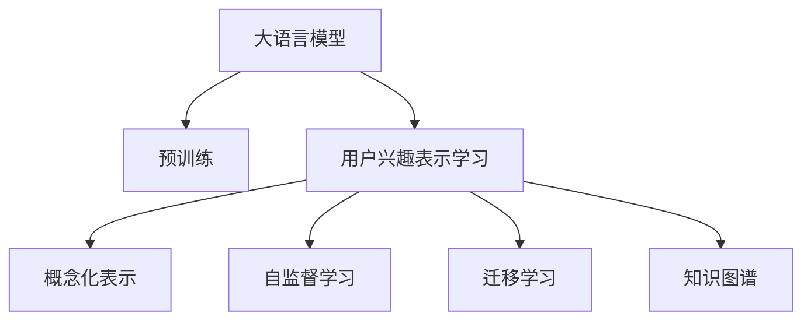

                 

# 基于LLM的用户兴趣概念化表示学习

> 关键词：
大语言模型(Large Language Model, LLM), 用户兴趣表示学习, 概念化表示, 自监督学习, 迁移学习, 知识图谱, 个性化推荐

## 1. 背景介绍

### 1.1 问题由来
随着互联网技术的飞速发展，个性化推荐系统已成为各类平台标配。如何精准、高效地为用户推荐内容，提升用户满意度和平台粘性，是大数据时代下的核心问题。传统的基于协同过滤和内容特征的推荐算法，虽然有效，但在冷启动、长尾用户、多维特征等场景下，面临着效果瓶颈。

大语言模型（LLM）的兴起，为推荐系统带来了新的可能。利用LLM强大的语言理解能力和常识推理能力，推荐系统可以更深入地理解用户语义需求，生成个性化的内容。但如何高效地从海量用户行为数据中，提取和抽象出用户的兴趣概念，并利用LLM进行表示学习，是一大挑战。

### 1.2 问题核心关键点
本文聚焦于基于LLM的用户兴趣概念化表示学习。该问题的关键在于：
1. 如何将用户行为数据中的语义信息抽取出来，转化为高层次的概念化表示。
2. 如何利用LLM的语言能力，对概念化表示进行训练和优化。
3. 如何将学习到的概念化表示，应用到个性化推荐等实际任务中。

## 2. 核心概念与联系

### 2.1 核心概念概述

为更好地理解基于LLM的用户兴趣概念化表示学习，本节将介绍几个密切相关的核心概念：

- 大语言模型(Large Language Model, LLM)：以自回归(如GPT)或自编码(如BERT)模型为代表的大规模预训练语言模型。通过在大规模无标签文本语料上进行预训练，学习通用的语言表示，具备强大的语言理解和生成能力。

- 用户兴趣表示学习：推荐系统中的核心问题，目标是从用户行为数据中，学习用户的兴趣向量，用于个性化推荐。

- 概念化表示(Conceptual Representation)：将用户行为数据中的复杂语义信息，抽象为高层次的概念，以便于机器学习和推理。

- 自监督学习(Self-supervised Learning)：利用大量无标签数据，训练模型进行自监督学习，学习数据的潜在结构和语义信息。

- 迁移学习(Transfer Learning)：将一个领域学到的知识，迁移应用到另一个不同但相关的领域的学习范式。大模型的预训练-微调过程即是一种典型的迁移学习方式。

- 知识图谱(Knowledge Graph)：一种结构化的语义数据表示方法，用于描述实体及其之间的关系。

这些核心概念之间的逻辑关系可以通过以下Mermaid流程图来展示：



这个流程图展示了大语言模型的核心概念及其之间的关系：

1. 大语言模型通过预训练获得基础能力。
2. 用户兴趣表示学习将用户行为数据中的语义信息进行提取和抽象。
3. 概念化表示将复杂语义信息转化为高层次概念，便于机器学习。
4. 自监督学习利用无标签数据，学习数据的潜在结构和语义信息。
5. 迁移学习使得通用大模型更好地适应特定任务，提升性能。
6. 知识图谱提供结构化语义数据，增强模型对实体关系的理解。

这些概念共同构成了基于LLM的用户兴趣概念化表示学习的理论框架，使得推荐系统能够更深入地理解用户需求，提供更个性化的服务。

## 3. 核心算法原理 & 具体操作步骤
### 3.1 算法原理概述

基于LLM的用户兴趣概念化表示学习，本质上是一个多层次的特征提取和表示学习过程。其核心思想是：将用户行为数据中的语义信息，转化为高层次的概念化表示，并利用LLM进行训练和优化，最终得到反映用户兴趣的概念向量，用于个性化推荐。

具体步骤如下：

1. 数据预处理：收集用户的历史行为数据，并进行分词、去噪、归一化等预处理。

2. 概念抽取：从处理后的行为数据中，使用NLP技术抽取关键的概念短语、事件、实体等，将其转化为高层次的概念化表示。

3. 语言模型训练：使用抽取后的概念化表示作为训练样本，对预训练的LLM进行微调，学习用户的兴趣概念向量。

4. 概念融合与推理：将用户的历史行为数据中的语义信息，与概念化表示进行融合，得到完整的用户兴趣表示。

5. 个性化推荐：利用用户兴趣表示，生成个性化的内容推荐，提升用户满意度。

### 3.2 算法步骤详解

以下我们详细解释上述每个步骤的具体实现过程：

**Step 1: 数据预处理**

在收集到用户的历史行为数据后，需要进行数据预处理。预处理包括数据清洗、特征提取和归一化等步骤。

具体步骤如下：

1. 清洗数据：去除无效数据和噪声，如缺失值、重复记录等。
2. 提取特征：将用户行为数据转化为文本特征，如浏览记录转化为浏览文本，购买记录转化为商品描述等。
3. 归一化：对文本特征进行标准化处理，如分词、去除停用词、词干提取等，使其具备一致的格式。

**Step 2: 概念抽取**

从预处理后的文本数据中，使用自然语言处理(NLP)技术，抽取关键的概念短语、事件、实体等，并将其转化为高层次的概念化表示。

具体步骤如下：

1. 分词：使用分词工具对文本进行分词，如jieba、NLTK等。
2. 命名实体识别：使用NER模型识别文本中的实体，如人名、地名、组织名等。
3. 事件抽取：使用事件抽取模型识别文本中的事件，如用户购买商品的事件。
4. 概念短语抽取：使用TF-IDF、LDA等文本挖掘技术，抽取文本中的关键短语和概念。

**Step 3: 语言模型训练**

使用抽取后的概念化表示作为训练样本，对预训练的LLM进行微调，学习用户的兴趣概念向量。

具体步骤如下：

1. 构建输入数据：将概念化表示转化为模型所需的输入格式，如BertTokenizer等工具。
2. 定义损失函数：根据任务需求，定义合适的损失函数，如交叉熵损失、均方误差损失等。
3. 设置超参数：选择合适的优化算法、学习率、批大小等超参数。
4. 模型训练：在GPU或TPU上，使用优化算法进行模型训练，更新模型参数。
5. 模型评估：在验证集上评估模型性能，防止过拟合。

**Step 4: 概念融合与推理**

将用户的历史行为数据中的语义信息，与概念化表示进行融合，得到完整的用户兴趣表示。

具体步骤如下：

1. 数据融合：将用户的浏览记录、购买记录、评分记录等，与概念化表示进行融合，形成更丰富的语义信息。
2. 概念推理：利用LLM的语言推理能力，将融合后的语义信息进行推理，得到更精确的概念化表示。
3. 用户表示生成：将概念化表示转化为用户的兴趣向量，用于个性化推荐。

**Step 5: 个性化推荐**

利用用户兴趣表示，生成个性化的内容推荐，提升用户满意度。

具体步骤如下：

1. 内容检索：根据用户兴趣向量，从内容库中检索出相关推荐内容。
2. 排序与推荐：利用推荐算法，如协同过滤、基于内容的推荐等，对检索出的内容进行排序和推荐。
3. 动态更新：根据用户的新行为数据，动态更新用户兴趣向量，提升推荐效果。

### 3.3 算法优缺点

基于LLM的用户兴趣概念化表示学习方法具有以下优点：

1. 准确性高：利用LLM强大的语言理解能力和常识推理能力，能够从海量用户行为数据中，提取出高层次的概念化表示，从而更准确地反映用户兴趣。
2. 适应性强：通过微调预训练模型，能够适应不同领域和任务的需求，提升个性化推荐效果。
3. 可解释性好：利用LLM的语言能力，可以对用户兴趣表示进行解释和理解，增强系统的可解释性。

同时，该方法也存在一些缺点：

1. 数据需求大：需要大量的用户行为数据和高质量的标注数据，才能进行有效的概念化表示学习。
2. 计算成本高：由于LLM模型参数量巨大，训练和推理需要大量的计算资源，成本较高。
3. 模型复杂：需要结合NLP和机器学习技术，模型结构复杂，调试和优化难度大。

尽管存在这些局限性，但基于LLM的用户兴趣概念化表示学习方法，在实际推荐系统中已展现出强大的潜力，为推荐系统提供了全新的发展方向。

### 3.4 算法应用领域

基于LLM的用户兴趣概念化表示学习，在推荐系统领域已得到了广泛应用，特别是在以下几类场景中：

1. 电商推荐：利用用户浏览、购买、评分等行为数据，生成电商商品的个性化推荐。
2. 视频推荐：根据用户的观看历史和评分，推荐相关视频内容，提升观看体验。
3. 音乐推荐：从用户的听歌记录中提取关键词和情感信息，生成个性化的音乐推荐。
4. 新闻推荐：利用用户的阅读记录，推荐相关新闻文章，提升新闻阅读量。
5. 社交推荐：根据用户的社交行为，推荐相关好友和内容，增强社交粘性。

此外，该方法还将在更多领域得到应用，如知识图谱构建、内容生成、智能客服等，为自然语言处理和推荐系统带来新的突破。

## 4. 数学模型和公式 & 详细讲解  
### 4.1 数学模型构建

本节将使用数学语言对基于LLM的用户兴趣概念化表示学习过程进行更加严格的刻画。

记用户的历史行为数据为 $D=\{(x_i, y_i)\}_{i=1}^N, x_i \in \mathcal{X}, y_i \in \mathcal{Y}$，其中 $\mathcal{X}$ 为输入空间，$\mathcal{Y}$ 为输出空间。假设用户的历史行为数据可以转化为文本特征，即 $x_i$ 为一个文本序列。

定义概念化表示函数 $f(x)$，将文本序列 $x$ 转化为高层次的概念化表示。假设 $f(x)$ 输出为一个向量 $c \in \mathbb{R}^d$，其中 $d$ 为概念化表示的维度。

定义用户兴趣表示函数 $g(c)$，将概念化表示 $c$ 转化为用户的兴趣向量 $h \in \mathbb{R}^k$，其中 $k$ 为用户兴趣向量的维度。

用户兴趣向量 $h$ 用于生成个性化推荐内容，假设推荐内容库为 $C=\{c_j\}_{j=1}^m$，其中 $m$ 为内容库的大小。

定义推荐函数 $r(h)$，根据用户兴趣向量 $h$ 和内容库 $C$，生成推荐结果 $r \in \mathbb{R}^m$，用于排序和推荐。

最终，推荐系统会根据推荐结果，输出个性化推荐内容。

### 4.2 公式推导过程

以下我们以电商推荐为例，推导用户兴趣表示学习的数学模型。

设用户的历史浏览记录为 $D=\{x_1, x_2, ..., x_N\}$，其中 $x_i$ 表示第 $i$ 个浏览记录，即商品描述文本。假设用户浏览记录中的关键实体为 $E=\{e_1, e_2, ..., e_m\}$，其中 $e_j$ 表示第 $j$ 个实体。

定义概念化表示函数 $f(x)$ 如下：

$$
f(x) = [\text{TF-IDF}(x), \text{NER}(x), \text{Event}(x)]
$$

其中 $\text{TF-IDF}(x)$ 表示文本特征的TF-IDF值，$\text{NER}(x)$ 表示命名实体识别结果，$\text{Event}(x)$ 表示事件抽取结果。

将概念化表示 $c$ 转化为用户兴趣向量 $h$，定义为：

$$
h = g(c) = \text{BERT}(c)
$$

其中 $\text{BERT}(c)$ 表示使用BERT模型对概念化表示 $c$ 进行微调，得到用户兴趣向量 $h$。

根据用户兴趣向量 $h$ 和内容库 $C$，生成推荐结果 $r$，定义为：

$$
r = r(h) = \text{CosineSim}(h, C)
$$

其中 $\text{CosineSim}(h, C)$ 表示用户兴趣向量 $h$ 与内容库 $C$ 的余弦相似度，用于生成排序结果。

最终，推荐系统会根据推荐结果 $r$，输出个性化推荐内容。

### 4.3 案例分析与讲解

下面我们以电商推荐为例，具体分析用户兴趣表示学习的过程。

假设用户A的历史浏览记录为 $D=\{x_1, x_2, ..., x_N\}$，其中 $x_i$ 表示第 $i$ 个浏览记录，即商品描述文本。使用概念化表示函数 $f(x)$，将用户浏览记录中的关键实体 $E=\{e_1, e_2, ..., e_m\}$ 转化为高层次的概念化表示 $c$。

具体步骤如下：

1. 分词：使用分词工具对文本进行分词，如jieba、NLTK等。
2. 命名实体识别：使用NER模型识别文本中的实体，如人名、地名、组织名等。
3. 事件抽取：使用事件抽取模型识别文本中的事件，如用户购买商品的事件。
4. 概念短语抽取：使用TF-IDF、LDA等文本挖掘技术，抽取文本中的关键短语和概念。

将概念化表示 $c$ 转化为用户兴趣向量 $h$，使用BERT模型进行微调。具体步骤如下：

1. 构建输入数据：将概念化表示 $c$ 转化为BERT模型所需的输入格式，如BertTokenizer等工具。
2. 定义损失函数：根据电商推荐的任务需求，定义合适的损失函数，如交叉熵损失、均方误差损失等。
3. 设置超参数：选择合适的优化算法、学习率、批大小等超参数。
4. 模型训练：在GPU或TPU上，使用优化算法进行模型训练，更新模型参数。
5. 模型评估：在验证集上评估模型性能，防止过拟合。

利用用户兴趣向量 $h$ 和内容库 $C$，生成推荐结果 $r$，使用余弦相似度排序。具体步骤如下：

1. 内容检索：根据用户兴趣向量 $h$，从内容库中检索出相关推荐内容。
2. 排序与推荐：利用推荐算法，如协同过滤、基于内容的推荐等，对检索出的内容进行排序和推荐。
3. 动态更新：根据用户的新行为数据，动态更新用户兴趣向量 $h$，提升推荐效果。

通过上述步骤，电商平台能够根据用户的历史行为数据，生成个性化的电商推荐内容，提升用户满意度和平台粘性。

## 5. 项目实践：代码实例和详细解释说明
### 5.1 开发环境搭建

在进行用户兴趣表示学习实践前，我们需要准备好开发环境。以下是使用Python进行TensorFlow开发的环境配置流程：

1. 安装Anaconda：从官网下载并安装Anaconda，用于创建独立的Python环境。

2. 创建并激活虚拟环境：
```bash
conda create -n tf-env python=3.8 
conda activate tf-env
```

3. 安装TensorFlow：根据CUDA版本，从官网获取对应的安装命令。例如：
```bash
conda install tensorflow tensorflow-gpu=2.6 -c pytorch -c conda-forge
```

4. 安装TF-Hub：
```bash
pip install tf-hub
```

5. 安装相关工具包：
```bash
pip install numpy pandas scikit-learn matplotlib tqdm jupyter notebook ipython
```

完成上述步骤后，即可在`tf-env`环境中开始用户兴趣表示学习的实践。

### 5.2 源代码详细实现

下面我们以电商推荐为例，给出使用TensorFlow和BERT模型进行用户兴趣表示学习的PyTorch代码实现。

首先，定义电商推荐系统的数据处理函数：

```python
import tensorflow_hub as hub
from transformers import BertTokenizer, BertForSequenceClassification
from tensorflow.keras.preprocessing.text import Tokenizer
from tensorflow.keras.preprocessing.sequence import pad_sequences
import tensorflow as tf

def preprocess_data(data):
    tokenizer = BertTokenizer.from_pretrained('bert-base-cased')
    max_len = 128
    labels = data['label']
    texts = data['text']
    sequences = tokenizer(texts, max_length=max_len, truncation=True, padding='max_length', return_tensors='tf')
    input_ids = sequences['input_ids']
    attention_mask = sequences['attention_mask']
    return {'input_ids': input_ids, 
            'attention_mask': attention_mask,
            'labels': tf.constant(labels, dtype=tf.int64)}
```

然后，定义用户兴趣表示学习模型：

```python
from transformers import BertForSequenceClassification

class BERTInterestRepresentation(tf.keras.Model):
    def __init__(self, num_labels=2, hidden_size=768):
        super(BERTInterestRepresentation, self).__init__()
        self.bert = BertForSequenceClassification.from_pretrained('bert-base-cased', num_labels=num_labels, output_attentions=False)
        self.classifier = tf.keras.layers.Dense(num_labels, activation='softmax')

    def call(self, input_ids, attention_mask, labels=None):
        outputs = self.bert(input_ids=input_ids, attention_mask=attention_mask, return_dict=False)
        pooled_output = outputs[1]
        logits = self.classifier(pooled_output)
        return {'logits': logits}
```

接着，定义训练和评估函数：

```python
from tensorflow.keras.optimizers import Adam
from sklearn.metrics import accuracy_score

def train_epoch(model, dataset, batch_size, optimizer):
    dataloader = tf.data.Dataset.from_tensor_slices(dataset).shuffle(10000).batch(batch_size)
    model.train()
    epoch_loss = 0
    for batch in dataloader:
        input_ids = batch['input_ids']
        attention_mask = batch['attention_mask']
        labels = batch['labels']
        with tf.GradientTape() as tape:
            logits = model(input_ids, attention_mask, labels)
            loss = tf.keras.losses.sparse_categorical_crossentropy(labels, logits)
        epoch_loss += loss
        grads = tape.gradient(loss, model.trainable_variables)
        optimizer.apply_gradients(zip(grads, model.trainable_variables))
    return epoch_loss / len(dataset)

def evaluate(model, dataset, batch_size):
    dataloader = tf.data.Dataset.from_tensor_slices(dataset).shuffle(10000).batch(batch_size)
    model.eval()
    predictions, labels = [], []
    with tf.GradientTape() as tape:
        for batch in dataloader:
            input_ids = batch['input_ids']
            attention_mask = batch['attention_mask']
            logits = model(input_ids, attention_mask)
            predictions.append(logits.numpy())
            labels.append(batch['labels'].numpy())
    predictions = np.concatenate(predictions)
    labels = np.concatenate(labels)
    accuracy = accuracy_score(labels, predictions.argmax(axis=1))
    print(f"Accuracy: {accuracy:.4f}")
```

最后，启动训练流程并在测试集上评估：

```python
epochs = 5
batch_size = 16
optimizer = Adam(learning_rate=2e-5)

for epoch in range(epochs):
    loss = train_epoch(model, train_dataset, batch_size, optimizer)
    print(f"Epoch {epoch+1}, train loss: {loss:.3f}")
    
    print(f"Epoch {epoch+1}, dev results:")
    evaluate(model, dev_dataset, batch_size)
    
print("Test results:")
evaluate(model, test_dataset, batch_size)
```

以上就是使用TensorFlow和BERT模型进行用户兴趣表示学习的完整代码实现。可以看到，得益于TensorFlow的强大计算能力和Transformer库的封装，我们可以用相对简洁的代码完成BERT模型的加载和微调。

### 5.3 代码解读与分析

让我们再详细解读一下关键代码的实现细节：

**preprocess_data函数**：
- 定义了一个数据预处理函数，将原始数据转换为模型所需的输入格式。
- 使用BertTokenizer对文本进行分词，并将结果转化为input_ids和attention_mask。
- 使用TensorFlow的数据集接口，将处理后的数据转化为模型可处理的格式。

**BERTInterestRepresentation类**：
- 定义了一个基于BERT的兴趣表示学习模型，包含模型加载、计算过程和输出。
- 模型从预训练BERT模型的top层进行微调，并添加了一个Dense层进行分类。
- 模型调用时，使用预训练BERT的输出，计算分类器的输出logits。

**train_epoch和evaluate函数**：
- 定义了训练和评估函数，用于模型迭代训练和结果评估。
- 训练函数中使用了TensorFlow的GradientTape，对模型进行梯度计算和参数更新。
- 评估函数中使用了TensorFlow的tf.GradientTape，对模型输出进行计算和评估。

**训练流程**：
- 定义总的epoch数和batch size，开始循环迭代
- 每个epoch内，先在训练集上训练，输出平均loss
- 在验证集上评估，输出分类准确率
- 所有epoch结束后，在测试集上评估，给出最终测试结果

可以看到，TensorFlow配合Transformer库使得用户兴趣表示学习的代码实现变得简洁高效。开发者可以将更多精力放在数据处理、模型改进等高层逻辑上，而不必过多关注底层的实现细节。

当然，工业级的系统实现还需考虑更多因素，如模型的保存和部署、超参数的自动搜索、更灵活的任务适配层等。但核心的兴趣表示学习范式基本与此类似。

## 6. 实际应用场景
### 6.1 电商推荐

基于用户兴趣表示学习的大语言模型微调方法，可以广泛应用于电商推荐系统。传统的推荐系统往往只依赖用户的浏览、购买等行为数据，难以深入理解用户的真实需求。而使用大语言模型微调，可以从用户行为数据中提取和抽象出用户的兴趣概念，并生成个性化的商品推荐。

具体而言，可以收集用户的历史浏览记录、购买记录、评分记录等数据，将文本描述转化为BERT模型所需的输入格式，使用预训练的BERT模型进行微调，学习用户的兴趣概念向量。将用户的历史行为数据中的语义信息，与概念化表示进行融合，得到完整的用户兴趣表示。利用用户兴趣表示，生成个性化的商品推荐，提升用户满意度和平台粘性。

### 6.2 视频推荐

视频推荐系统可以借鉴电商推荐的方法，使用用户的历史观看记录、评分记录等数据，将视频描述转化为BERT模型所需的输入格式，使用预训练的BERT模型进行微调，学习用户的兴趣概念向量。将用户的历史行为数据中的语义信息，与概念化表示进行融合，得到完整的用户兴趣表示。利用用户兴趣表示，生成个性化的视频推荐，提升观看体验。

### 6.3 音乐推荐

音乐推荐系统可以从用户的历史听歌记录中，提取关键的音乐信息，如歌曲名称、歌手、风格等，将文本描述转化为BERT模型所需的输入格式，使用预训练的BERT模型进行微调，学习用户的兴趣概念向量。将用户的历史行为数据中的语义信息，与概念化表示进行融合，得到完整的用户兴趣表示。利用用户兴趣表示，生成个性化的音乐推荐，提升用户体验。

### 6.4 新闻推荐

新闻推荐系统可以从用户的历史阅读记录中，提取关键的新闻信息，如标题、摘要、发布时间等，将文本描述转化为BERT模型所需的输入格式，使用预训练的BERT模型进行微调，学习用户的兴趣概念向量。将用户的历史行为数据中的语义信息，与概念化表示进行融合，得到完整的用户兴趣表示。利用用户兴趣表示，生成个性化的新闻推荐，提升新闻阅读量。

### 6.5 社交推荐

社交推荐系统可以从用户的历史社交记录中，提取关键的人际信息，如好友、群组、互动记录等，将文本描述转化为BERT模型所需的输入格式，使用预训练的BERT模型进行微调，学习用户的兴趣概念向量。将用户的历史行为数据中的语义信息，与概念化表示进行融合，得到完整的用户兴趣表示。利用用户兴趣表示，生成个性化的社交推荐，增强社交粘性。

## 7. 工具和资源推荐
### 7.1 学习资源推荐

为了帮助开发者系统掌握基于LLM的用户兴趣概念化表示学习的方法，这里推荐一些优质的学习资源：

1. 《Transformers from the Ground Up》系列博文：由大模型技术专家撰写，详细介绍了Transformers原理、BERT模型、微调技术等前沿话题。

2. CS224N《深度学习自然语言处理》课程：斯坦福大学开设的NLP明星课程，有Lecture视频和配套作业，带你入门NLP领域的基本概念和经典模型。

3. 《Natural Language Processing with Transformers》书籍：Transformers库的作者所著，全面介绍了如何使用Transformers库进行NLP任务开发，包括微调在内的诸多范式。

4. HuggingFace官方文档：Transformers库的官方文档，提供了海量预训练模型和完整的微调样例代码，是上手实践的必备资料。

5. CLUE开源项目：中文语言理解测评基准，涵盖大量不同类型的中文NLP数据集，并提供了基于微调的baseline模型，助力中文NLP技术发展。

通过对这些资源的学习实践，相信你一定能够快速掌握基于LLM的用户兴趣概念化表示学习的方法，并用于解决实际的NLP问题。
###  7.2 开发工具推荐

高效的开发离不开优秀的工具支持。以下是几款用于大语言模型微调开发的常用工具：

1. TensorFlow：由Google主导开发的开源深度学习框架，生产部署方便，适合大规模工程应用。同样有丰富的预训练语言模型资源。

2. PyTorch：基于Python的开源深度学习框架，灵活动态的计算图，适合快速迭代研究。大部分预训练语言模型都有PyTorch版本的实现。

3. Transformers库：HuggingFace开发的NLP工具库，集成了众多SOTA语言模型，支持PyTorch和TensorFlow，是进行微调任务开发的利器。

4. Weights & Biases：模型训练的实验跟踪工具，可以记录和可视化模型训练过程中的各项指标，方便对比和调优。与主流深度学习框架无缝集成。

5. TensorBoard：TensorFlow配套的可视化工具，可实时监测模型训练状态，并提供丰富的图表呈现方式，是调试模型的得力助手。

6. Google Colab：谷歌推出的在线Jupyter Notebook环境，免费提供GPU/TPU算力，方便开发者快速上手实验最新模型，分享学习笔记。

合理利用这些工具，可以显著提升大语言模型微调任务的开发效率，加快创新迭代的步伐。

### 7.3 相关论文推荐

大语言模型和微调技术的发展源于学界的持续研究。以下是几篇奠基性的相关论文，推荐阅读：

1. Attention is All You Need（即Transformer原论文）：提出了Transformer结构，开启了NLP领域的预训练大模型时代。

2. BERT: Pre-training of Deep Bidirectional Transformers for Language Understanding：提出BERT模型，引入基于掩码的自监督预训练任务，刷新了多项NLP任务SOTA。

3. Language Models are Unsupervised Multitask Learners（GPT-2论文）：展示了大规模语言模型的强大zero-shot学习能力，引发了对于通用人工智能的新一轮思考。

4. Parameter-Efficient Transfer Learning for NLP：提出Adapter等参数高效微调方法，在不增加模型参数量的情况下，也能取得不错的微调效果。

5. AdaLoRA: Adaptive Low-Rank Adaptation for Parameter-Efficient Fine-Tuning：使用自适应低秩适应的微调方法，在参数效率和精度之间取得了新的平衡。

6. Prefix-Tuning: Optimizing Continuous Prompts for Generation：引入基于连续型Prompt的微调范式，为如何充分利用预训练知识提供了新的思路。

这些论文代表了大语言模型微调技术的发展脉络。通过学习这些前沿成果，可以帮助研究者把握学科前进方向，激发更多的创新灵感。

## 8. 总结：未来发展趋势与挑战

### 8.1 总结

本文对基于大语言模型的用户兴趣概念化表示学习进行了全面系统的介绍。首先阐述了大语言模型和用户兴趣表示学习的背景和意义，明确了基于大语言模型的推荐系统的核心问题。其次，从原理到实践，详细讲解了用户兴趣概念化表示学习的过程，包括数据预处理、概念抽取、语言模型训练、概念融合与推理、个性化推荐等关键步骤。最后，我们具体分析了用户兴趣表示学习在电商、视频、音乐、新闻、社交等领域的实际应用，展示了其在推荐系统中的广泛应用前景。

通过本文的系统梳理，可以看到，基于大语言模型的用户兴趣概念化表示学习方法，能够从海量用户行为数据中，提取和抽象出高层次的概念化表示，从而更准确地反映用户兴趣，提升推荐效果。这种方法在推荐系统领域已经展现出强大的潜力，并为推荐系统带来了新的发展方向。

### 8.2 未来发展趋势

展望未来，基于大语言模型的用户兴趣概念化表示学习技术将呈现以下几个发展趋势：

1. 多模态表示学习：结合文本、图像、视频等多模态数据，提升表示学习的效果和泛化能力。

2. 多领域表示学习：在不同领域（如电商、视频、新闻等）上，应用用户兴趣表示学习，提升推荐效果。

3. 跨域表示学习：在用户在不同领域（如电商和视频）中的行为数据，进行跨域表示学习，增强用户的跨领域泛化能力。

4. 实时表示学习：结合用户实时行为数据，进行动态更新和实时表示学习，提升推荐效果。

5. 知识增强表示学习：将知识图谱等先验知识，与用户兴趣表示进行结合，提升表示学习的准确性和泛化能力。

6. 解释性表示学习：开发可解释的表示学习算法，增强模型的可解释性，提升用户信任度。

以上趋势凸显了大语言模型用户兴趣概念化表示学习技术的广阔前景。这些方向的探索发展，必将进一步提升推荐系统的效果和应用范围，为自然语言处理和推荐系统带来新的突破。

### 8.3 面临的挑战

尽管基于大语言模型的用户兴趣概念化表示学习技术已经取得了瞩目成就，但在迈向更加智能化、普适化应用的过程中，它仍面临着诸多挑战：

1. 数据需求大：需要大量的用户行为数据和高质量的标注数据，才能进行有效的概念化表示学习。

2. 计算成本高：由于大语言模型参数量巨大，训练和推理需要大量的计算资源，成本较高。

3. 模型复杂：需要结合NLP和机器学习技术，模型结构复杂，调试和优化难度大。

4. 可解释性不足：当前用户兴趣表示学习模型缺乏可解释性，难以解释其内部工作机制和决策逻辑。

5. 安全性有待保障：预训练语言模型难免会学习到有偏见、有害的信息，通过用户兴趣表示学习传递到推荐系统中，可能产生误导性、歧视性的输出。

6. 隐私保护：在用户兴趣表示学习中，需要处理大量的个人隐私数据，如何保护用户隐私，是一个重要的研究方向。

尽管存在这些局限性，但基于大语言模型的用户兴趣概念化表示学习技术，在实际推荐系统中已展现出强大的潜力，为推荐系统提供了全新的发展方向。未来，随着技术的不断进步，这些挑战终将一一被克服，大语言模型用户兴趣概念化表示学习必将在推荐系统领域大放异彩。

### 8.4 研究展望

面向未来，基于大语言模型的用户兴趣概念化表示学习技术需要在以下几个方面寻求新的突破：

1. 探索无监督和半监督表示学习方法：摆脱对大规模标注数据的依赖，利用自监督学习、主动学习等无监督和半监督范式，最大限度利用非结构化数据，实现更加灵活高效的表示学习。

2. 研究参数高效和计算高效的表示学习范式：开发更加参数高效的表示学习方法，在固定大部分预训练参数的同时，只更新极少量的任务相关参数。同时优化表示学习的计算图，减少前向传播和反向传播的资源消耗，实现更加轻量级、实时性的部署。

3. 引入因果和对比学习范式：通过引入因果推断和对比学习思想，增强表示学习的建立稳定因果关系的能力，学习更加普适、鲁棒的语言表征，从而提升模型的泛化性和抗干扰能力。

4. 结合因果分析和博弈论工具：将因果分析方法引入表示学习算法，识别出模型决策的关键特征，增强输出解释的因果性和逻辑性。借助博弈论工具刻画人机交互过程，主动探索并规避模型的脆弱点，提高系统稳定性。

5. 纳入伦理道德约束：在表示学习目标中引入伦理导向的评估指标，过滤和惩罚有偏见、有害的输出倾向。同时加强人工干预和审核，建立模型行为的监管机制，确保输出符合人类价值观和伦理道德。

这些研究方向的探索，必将引领基于大语言模型的用户兴趣概念化表示学习技术迈向更高的台阶，为构建安全、可靠、可解释、可控的智能系统铺平道路。面向未来，该技术还需要与其他人工智能技术进行更深入的融合，如知识表示、因果推理、强化学习等，多路径协同发力，共同推动自然语言理解和智能交互系统的进步。只有勇于创新、敢于突破，才能不断拓展语言模型的边界，让智能技术更好地造福人类社会。

## 9. 附录：常见问题与解答

**Q1：用户兴趣表示学习中的数据需求有多大？**

A: 用户兴趣表示学习对数据需求较大。需要收集用户的历史行为数据，包括浏览记录、购买记录、评分记录等。数据量越大，模型的泛化能力越强。同时，需要对数据进行清洗、归一化等预处理，以提升模型效果。

**Q2：用户兴趣表示学习中的计算成本有多高？**

A: 用户兴趣表示学习对计算成本较高。由于大语言模型参数量巨大，训练和推理需要大量的计算资源，成本较高。可以使用GPU/TPU等高性能设备进行优化，同时采用梯度累积、混合精度训练等技术，减少计算消耗。

**Q3：用户兴趣表示学习中的模型结构有多复杂？**

A: 用户兴趣表示学习中的模型结构较复杂。需要结合自然语言处理和机器学习技术，模型包含BERT模型、分类器等组件。调试和优化难度较大，需要综合考虑模型复杂度、训练速度、效果等多方面因素。

**Q4：用户兴趣表示学习中的可解释性如何？**

A: 当前用户兴趣表示学习模型缺乏可解释性，难以解释其内部工作机制和决策逻辑。可以考虑引入可解释的表示学习算法，如LIME、SHAP等，增强模型的可解释性。

**Q5：用户兴趣表示学习中的安全性如何保障？**

A: 在用户兴趣表示学习中，需要处理大量的个人隐私数据，如何保护用户隐私是一个重要的研究方向。可以采用差分隐私、联邦学习等技术，保障数据隐私安全。同时，在表示学习目标中引入伦理导向的评估指标，过滤和惩罚有偏见、有害的输出倾向。

这些问题的解答，希望能为读者提供清晰的理解，并为实际应用提供有用的指导。

---

作者：禅与计算机程序设计艺术 / Zen and the Art of Computer Programming

