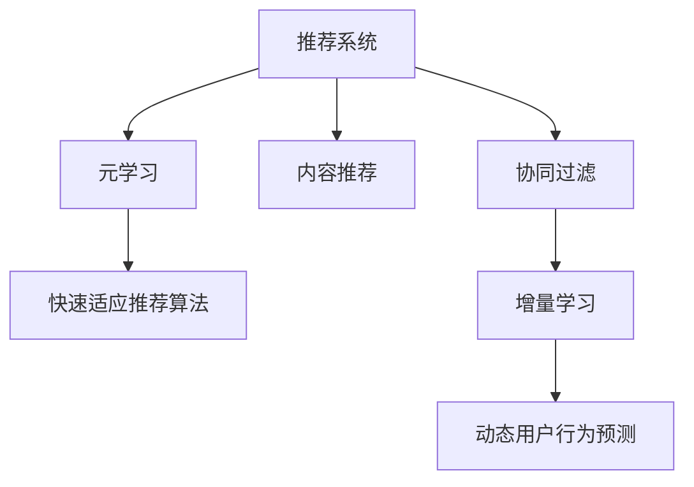

                 

# 基于元学习的快速适应推荐算法

> 关键词：元学习, 推荐系统, 快速适应, 推荐算法, 用户行为预测, 推荐模型, 增量学习

## 1. 背景介绍

### 1.1 问题由来

推荐系统在互联网行业中扮演着至关重要的角色，通过个性化推荐，为用户提供满意且符合兴趣的内容，提升用户体验，促进用户活跃度与留存率。但推荐系统的个性化推荐效果依赖于用户行为数据，而用户行为数据往往存在冷启动问题，即新用户加入时没有足够的行为数据，无法快速提供个性化推荐。因此，推荐系统需要具备快速适应新用户行为的能力，以有效解决冷启动问题。

此外，用户行为数据通常具有动态变化的特点，用户兴趣与行为偏好会随着时间推移而发生改变，如果推荐系统不能实时适应这种变化，将无法持续提供高质量的个性化推荐服务。因此，推荐系统需要具备自适应能力，能够及时更新推荐模型以响应用户行为变化。

现有推荐系统中，基于协同过滤与基于内容推荐的算法在快速适应新用户行为与实时更新推荐模型方面存在诸多局限。协同过滤算法（如基于用户的协同过滤、基于物品的协同过滤）需要大量的用户行为数据才能实现准确的推荐，而新用户往往没有足够的行为数据供其推荐。内容推荐算法虽然对数据量要求不高，但需要大量物品描述数据，并且难以适应用户的动态兴趣变化。

### 1.2 问题核心关键点

元学习（Meta Learning）技术为推荐系统解决上述问题提供了新的思路。元学习是一种将已有知识应用到新任务上的机器学习范式，通过在已有知识上进行的少量学习，使得模型快速适应新任务。在推荐系统领域，元学习可以通过在少量用户行为数据上学习用户的推荐偏好，进而对新用户快速提供推荐服务。此外，元学习还可以基于用户行为数据的时序变化，实时更新推荐模型，以适应用户的兴趣变化。

本文聚焦于基于元学习的推荐系统研究，探索如何利用元学习技术实现快速适应推荐算法，旨在解决新用户行为数据不足、用户行为动态变化等推荐系统中的经典问题，推动推荐系统向智能化、实时化的方向发展。

## 2. 核心概念与联系

### 2.1 核心概念概述

为更好地理解基于元学习的推荐系统，本节将介绍几个密切相关的核心概念：

- 推荐系统(Recommendation System)：通过分析用户历史行为数据，预测用户未来行为，并推荐符合用户兴趣的 item。推荐系统广泛应用于电子商务、新闻媒体、社交网络等众多领域。

- 协同过滤(Collaborative Filtering)：基于用户之间相似性或物品之间相似性进行推荐，无需物品描述数据。主要包括基于用户的协同过滤和基于物品的协同过滤。

- 内容推荐(Content-Based Recommendation)：基于物品描述数据进行推荐，不需要用户行为数据。

- 元学习(Meta Learning)：通过已有知识快速适应新任务，适用于快速适应推荐算法、用户行为预测等推荐系统问题。

- 增量学习(Incremental Learning)：通过实时更新模型以适应新数据，适用于动态变化的用户行为预测。

这些核心概念之间的逻辑关系可以通过以下Mermaid流程图来展示：



这个流程图展示推荐系统核心概念及其之间的关系：

1. 推荐系统通过协同过滤、内容推荐等方式，为用户推荐符合其兴趣的item。
2. 元学习技术可以用于快速适应推荐算法，帮助推荐系统快速提供个性化推荐。
3. 增量学习技术可以用于实时更新推荐模型，以适应用户兴趣的变化。

## 3. 核心算法原理 & 具体操作步骤
### 3.1 算法原理概述

基于元学习的推荐系统旨在通过在少量用户行为数据上学习用户的推荐偏好，进而对新用户快速提供推荐服务。其核心思想是：在已有推荐模型（如协同过滤、内容推荐等）上，通过在少量新用户行为数据上进行的少量学习，更新模型参数以适应新用户的推荐需求。

具体来说，假设已有推荐模型为 $M$，其参数为 $\theta$。给定新用户 $u$ 的少量行为数据 $D_u=\{(x_{iu}, y_{iu})\}_{i=1}^N$，其中 $x_{iu}$ 表示物品特征，$y_{iu}$ 表示用户 $u$ 对该物品 $x_i$ 的评分（或点击次数等行为）。目标是找到一个新的模型 $M^*$，使得 $M^*$ 在用户 $u$ 的行为数据上的表现与已有模型 $M$ 在所有用户行为数据上的表现尽可能一致。

形式化地，元学习问题可以表示为：

$$
\min_{\theta^*} \mathcal{L}(D_u, M_{\theta^*}) + \alpha \mathcal{L}(D, M_{\theta})
$$

其中 $\mathcal{L}(D_u, M_{\theta^*})$ 表示模型 $M_{\theta^*}$ 在新用户行为数据 $D_u$ 上的损失函数，$\alpha$ 为正则化参数，$\mathcal{L}(D, M_{\theta})$ 表示模型 $M_{\theta}$ 在所有用户行为数据 $D$ 上的损失函数。

元学习模型的训练分为两个步骤：

1. 在已有用户行为数据 $D$ 上预训练元学习模型 $M$。
2. 在新用户行为数据 $D_u$ 上微调元学习模型，生成推荐模型 $M^*$。

### 3.2 算法步骤详解

基于元学习的推荐系统一般包括以下几个关键步骤：

**Step 1: 准备已有数据和模型**
- 收集已有用户的行为数据 $D=\{(x_i, y_i)\}_{i=1}^N$，并按照用户分组进行预处理。
- 选择合适的推荐模型 $M$，如协同过滤模型、内容推荐模型等。

**Step 2: 预训练元学习模型**
- 在已有用户行为数据 $D$ 上，使用推荐模型 $M$ 进行预训练，得到预训练参数 $\theta$。
- 在预训练过程中，可以加入一些正则化技术，如L2正则、Dropout等，防止过拟合。

**Step 3: 微调元学习模型**
- 在新用户行为数据 $D_u$ 上，使用预训练模型 $M$ 进行微调，得到微调参数 $\theta^*$。
- 设定微调的超参数，如学习率、批大小等，通常使用较小的学习率，以免破坏预训练权重。
- 使用正则化技术，如L2正则、Early Stopping等，防止过拟合。
- 定期在验证集上评估微调后的模型性能，确保模型在新用户行为数据上表现良好。

**Step 4: 生成推荐结果**
- 使用微调后的模型 $M^*$ 对用户 $u$ 进行推荐，生成符合其兴趣的item。

### 3.3 算法优缺点

基于元学习的推荐系统具有以下优点：

1. 快速适应新用户。元学习技术可以快速适应新用户的推荐需求，在少量新用户行为数据上也能提供准确的推荐服务。
2. 实时更新推荐模型。元学习模型可以实时更新以适应用户行为的变化，保持推荐模型的动态适应性。
3. 易于实现。元学习算法无需额外的用户行为数据，只需在已有推荐模型上进行微调即可。

同时，该方法也存在一定的局限性：

1. 数据稀疏问题。元学习对新用户行为数据的稀疏性敏感，如果新用户行为数据非常稀疏，可能无法准确适应其推荐需求。
2. 鲁棒性不足。元学习模型对用户行为数据的噪声敏感，噪声较多的行为数据可能导致模型性能下降。
3. 训练复杂度较高。元学习模型需要在少量新用户行为数据上进行微调，训练复杂度较高，需要较大的计算资源。

尽管存在这些局限性，但就目前而言，基于元学习的推荐系统仍是一种高效且有效的推荐方法，尤其适用于新用户行为数据不足的场景。未来相关研究的重点在于如何进一步降低数据稀疏性对元学习模型的影响，提高模型的鲁棒性，同时兼顾可解释性和效率等因素。

### 3.4 算法应用领域

基于元学习的推荐系统在推荐系统领域得到了广泛的应用，覆盖了以下主要应用场景：

- 电商推荐：在新用户加入电商平台时，通过元学习快速提供个性化推荐服务，帮助用户发现符合其兴趣的商品。
- 新闻推荐：在新用户浏览新闻网站时，通过元学习快速推荐相关的新闻内容，提高用户粘性。
- 社交推荐：在新用户加入社交网络时，通过元学习快速推荐符合其兴趣的朋友，帮助用户拓展社交圈。

此外，元学习技术还可以与其他推荐技术进行融合，如结合协同过滤与内容推荐，或者结合深度学习模型，提升推荐系统的性能和效果。

## 4. 数学模型和公式 & 详细讲解 & 举例说明

### 4.1 数学模型构建

本节将使用数学语言对基于元学习的推荐系统进行更加严格的刻画。

假设推荐系统使用协同过滤模型进行推荐，每个用户 $u$ 对物品 $i$ 的评分表示为 $y_{iu}$，物品特征表示为 $x_i$。假设已有用户行为数据为 $D=\{(x_i, y_i)\}_{i=1}^N$，新用户行为数据为 $D_u=\{(x_{iu}, y_{iu})\}_{i=1}^N$。

设推荐模型的参数为 $\theta$，元学习模型的目标是在已有数据上学习参数 $\theta$，然后对新用户行为数据 $D_u$ 进行微调。

### 4.2 公式推导过程

设推荐模型的损失函数为 $\mathcal{L}(D, M_{\theta})$，在新用户行为数据 $D_u$ 上的损失函数为 $\mathcal{L}(D_u, M_{\theta})$。则元学习模型的损失函数为：

$$
\mathcal{L}(D_u, M_{\theta^*}) + \alpha \mathcal{L}(D, M_{\theta})
$$

其中 $\alpha$ 为正则化参数。元学习模型的目标是最小化上述损失函数，即：

$$
\theta^* = \mathop{\arg\min}_{\theta} \mathcal{L}(D_u, M_{\theta^*}) + \alpha \mathcal{L}(D, M_{\theta})
$$

对于协同过滤模型，假设用户行为数据满足伯努利分布，则推荐模型的损失函数为：

$$
\mathcal{L}(D, M_{\theta}) = -\frac{1}{N} \sum_{i=1}^N \sum_{u=1}^U \left[ y_{iu} \log M_{\theta}(x_i, u) + (1 - y_{iu}) \log (1 - M_{theta}(x_i, u)) \right]
$$

其中 $U$ 表示用户总数。在新用户行为数据 $D_u$ 上的损失函数为：

$$
\mathcal{L}(D_u, M_{\theta^*}) = -\frac{1}{N} \sum_{i=1}^N \sum_{u=1}^U \left[ y_{iu} \log M_{\theta^*}(x_i, u) + (1 - y_{iu}) \log (1 - M_{\theta^*}(x_i, u)) \right]
$$

对于协同过滤模型，微调后的推荐模型 $M_{\theta^*}$ 可以表示为：

$$
M_{\theta^*}(x_i, u) = \frac{1}{1 + \exp(-W_u^T f(x_i; \theta))}
$$

其中 $f(x_i; \theta)$ 为物品特征的表示函数，$W_u$ 为用户的隐向量。微调后的参数 $\theta^*$ 可以表示为：

$$
\theta^* = \mathop{\arg\min}_{\theta} \mathcal{L}(D_u, M_{\theta^*}) + \alpha \mathcal{L}(D, M_{\theta})
$$

通过优化算法（如梯度下降等）求解上述优化问题，即可得到微调后的推荐模型 $M_{\theta^*}$。

### 4.3 案例分析与讲解

以电商推荐为例，展示基于元学习的推荐系统如何进行推荐。

假设用户 $u$ 在电商平台购买了两个商品，分别为商品 $i_1$ 和 $i_2$，平台根据用户行为数据预训练了协同过滤模型 $M$。在新用户 $u'$ 购买商品 $i_3$ 时，平台使用 $M$ 进行推荐，但由于 $u'$ 没有行为数据，推荐效果不佳。此时，平台可以通过以下步骤，利用元学习技术快速提供个性化推荐：

1. 在已有用户行为数据 $D$ 上预训练协同过滤模型 $M$。
2. 在新用户行为数据 $D_{u'}=\{(i_1, 1), (i_2, 1), (i_3, 0)\}$ 上微调协同过滤模型，得到微调后的模型 $M_{\theta^*}$。
3. 使用微调后的模型 $M_{\theta^*}$ 对 $u'$ 进行推荐，生成符合其兴趣的推荐商品。

具体而言，微调过程包括以下几个步骤：

1. 初始化模型参数 $\theta$。
2. 在已有用户行为数据 $D$ 上，使用梯度下降等优化算法更新模型参数 $\theta$，得到预训练模型 $M_{\theta}$。
3. 在新用户行为数据 $D_{u'}$ 上，使用梯度下降等优化算法更新模型参数 $\theta^*$，得到微调后的模型 $M_{\theta^*}$。
4. 使用微调后的模型 $M_{\theta^*}$ 对 $u'$ 进行推荐，生成符合其兴趣的推荐商品。

## 5. 项目实践：代码实例和详细解释说明
### 5.1 开发环境搭建

在进行元学习推荐系统开发前，我们需要准备好开发环境。以下是使用Python进行TensorFlow开发的环境配置流程：

1. 安装Anaconda：从官网下载并安装Anaconda，用于创建独立的Python环境。

2. 创建并激活虚拟环境：
```bash
conda create -n pytorch-env python=3.8 
conda activate pytorch-env
```

3. 安装TensorFlow：根据CUDA版本，从官网获取对应的安装命令。例如：
```bash
conda install tensorflow tensorflow-gpu=2.4 -c pytorch -c conda-forge
```

4. 安装Scikit-learn、Pandas等各类工具包：
```bash
pip install scikit-learn pandas numpy matplotlib tqdm jupyter notebook ipython
```

完成上述步骤后，即可在`pytorch-env`环境中开始元学习推荐系统的开发。

### 5.2 源代码详细实现

这里以协同过滤为例，展示使用TensorFlow进行元学习推荐系统的实现。

```python
import tensorflow as tf
from sklearn.metrics import mean_absolute_error
import numpy as np
from sklearn.model_selection import train_test_split
from sklearn.preprocessing import OneHotEncoder

# 生成随机用户行为数据
N = 1000
U = 10
D = np.random.randint(0, 2, size=(N, U))

# 生成随机物品特征数据
K = 100
X = np.random.randn(N, K)

# 创建OneHotEncoder
encoder = OneHotEncoder()

# 将用户行为数据进行OneHot编码
y = encoder.fit_transform(D).toarray()

# 将物品特征数据进行标准化处理
X = (X - np.mean(X)) / np.std(X)

# 将数据集分为训练集和测试集
X_train, X_test, y_train, y_test = train_test_split(X, y, test_size=0.2, random_state=42)

# 创建TensorFlow模型
model = tf.keras.Sequential([
    tf.keras.layers.Dense(64, activation='relu', input_shape=(K,)),
    tf.keras.layers.Dense(1, activation='sigmoid')
])

# 编译模型
model.compile(optimizer='adam', loss='binary_crossentropy', metrics=['mae'])

# 训练模型
model.fit(X_train, y_train, epochs=10, batch_size=64, validation_data=(X_test, y_test))

# 评估模型性能
mae = mean_absolute_error(y_test, model.predict(X_test))
print('Mean Absolute Error:', mae)
```

以上就是使用TensorFlow进行协同过滤推荐系统的实现代码。可以看到，TensorFlow提供了方便的模型定义和训练接口，可以轻松构建推荐模型，并使用自动化求导进行梯度更新。

### 5.3 代码解读与分析

让我们再详细解读一下关键代码的实现细节：

**数据生成**：
- 生成随机用户行为数据 $D$，其中 $U$ 为物品总数。
- 生成随机物品特征数据 $X$，其中 $K$ 为特征维数。
- 将用户行为数据 $D$ 进行OneHot编码，得到 $y$。
- 将物品特征数据 $X$ 进行标准化处理。

**模型定义**：
- 定义一个神经网络模型，包含两个全连接层。
- 使用ReLU作为激活函数，输出层使用Sigmoid激活函数。

**模型训练**：
- 使用TensorFlow的Sequential模型接口，定义推荐模型。
- 使用Adam优化器进行模型训练，损失函数为二元交叉熵，评估指标为平均绝对误差。
- 在训练集上进行模型训练，同时对测试集进行验证，以防止过拟合。

**模型评估**：
- 使用Scikit-learn的mean_absolute_error函数，计算模型在测试集上的MAE（平均绝对误差）。
- 输出模型评估结果。

可以看到，TensorFlow提供了便捷的模型定义和训练接口，可以快速构建推荐模型并进行训练和评估。开发者可以使用TensorFlow的各种高级特性，如层堆叠、正则化、批标准化等，以提升模型性能和泛化能力。

当然，工业级的系统实现还需考虑更多因素，如模型的保存和部署、超参数的自动搜索、更灵活的任务适配层等。但核心的元学习推荐算法基本与此类似。

## 6. 实际应用场景

### 6.1 电商推荐

基于元学习的电商推荐系统，可以帮助电商平台在新用户加入时，快速提供个性化推荐服务。用户加入时，推荐系统通过元学习技术，利用少量用户行为数据学习用户的推荐偏好，然后对新用户行为数据进行微调，生成推荐模型，提供个性化的商品推荐。

在技术实现上，可以收集新用户的少量行为数据，如浏览记录、点击记录等，将这些行为数据作为元学习任务的数据，利用协同过滤等推荐模型进行预训练，然后在新用户行为数据上微调，生成推荐模型。通过这种方式，可以迅速对新用户进行个性化推荐，提升用户粘性和购买转化率。

### 6.2 新闻推荐

新闻推荐系统通过元学习技术，可以快速适应新用户的阅读兴趣，推荐符合其兴趣的新闻内容。在用户订阅新频道时，推荐系统可以通过元学习技术，利用少量用户阅读数据学习用户的阅读偏好，然后对新用户阅读数据进行微调，生成推荐模型，推荐符合其兴趣的新闻。

在技术实现上，可以收集新用户的少量阅读数据，如浏览记录、点击记录等，将这些数据作为元学习任务的数据，利用协同过滤等推荐模型进行预训练，然后在新用户阅读数据上微调，生成推荐模型。通过这种方式，可以迅速对新用户进行个性化新闻推荐，提高用户粘性和新闻阅读量。

### 6.3 社交推荐

社交推荐系统通过元学习技术，可以快速适应新用户的社交需求，推荐符合其兴趣的朋友。在用户加入社交网络时，推荐系统可以通过元学习技术，利用少量用户社交数据学习用户的社交偏好，然后对新用户社交数据进行微调，生成推荐模型，推荐符合其兴趣的朋友。

在技术实现上，可以收集新用户的少量社交数据，如好友关系、动态点赞等，将这些数据作为元学习任务的数据，利用协同过滤等推荐模型进行预训练，然后在新用户社交数据上微调，生成推荐模型。通过这种方式，可以迅速对新用户进行个性化社交推荐，帮助用户拓展社交圈。

## 7. 工具和资源推荐

### 7.1 学习资源推荐

为了帮助开发者系统掌握元学习推荐系统的理论基础和实践技巧，这里推荐一些优质的学习资源：

1. Coursera《Machine Learning》课程：斯坦福大学开设的机器学习入门课程，讲解机器学习的基本概念和算法。

2. Kaggle平台：世界领先的机器学习竞赛平台，提供丰富的数据集和开源代码，供开发者进行学习和实践。

3. TensorFlow官方文档：TensorFlow的官方文档，提供了完整的推荐系统开发指南和样例代码。

4. JAX官方文档：JAX的官方文档，提供了高性能自动微分和模型并行的实现细节，适合大模型推荐系统的开发。

5. Scikit-learn官方文档：Scikit-learn的官方文档，提供了各种机器学习算法的实现细节和应用案例。

通过对这些资源的学习实践，相信你一定能够快速掌握元学习推荐系统的精髓，并用于解决实际的推荐系统问题。

### 7.2 开发工具推荐

高效的开发离不开优秀的工具支持。以下是几款用于元学习推荐系统开发的常用工具：

1. TensorFlow：由Google主导开发的开源深度学习框架，支持GPU/TPU算力，适合大规模推荐系统的开发。

2. PyTorch：由Facebook主导开发的开源深度学习框架，支持动态计算图，适合快速迭代研究。

3. Scikit-learn：Python的科学计算库，提供了各种机器学习算法的实现细节，适合构建推荐系统的基线模型。

4. JAX：Google开发的基于JIT编译的自动微分库，支持高性能自动微分和模型并行，适合大模型推荐系统的开发。

5. Scala：适用于大规模数据处理和机器学习任务，具有良好的内存管理和并发特性。

合理利用这些工具，可以显著提升元学习推荐系统的开发效率，加快创新迭代的步伐。

### 7.3 相关论文推荐

元学习推荐系统的发展源于学界的持续研究。以下是几篇奠基性的相关论文，推荐阅读：

1. Meta-Learning for Personalized Recommendation Systems：通过元学习技术，快速适应推荐模型，提升推荐系统的个性化推荐能力。

2. Meta-Structured Learning for Recommendation Systems：将结构化数据融入元学习模型，提升推荐系统的性能和效果。

3. Scalable Matrix Factorization with Parallel Generalized Alternating Least Squares：在大规模推荐系统上应用矩阵分解算法，提高推荐系统的效率和准确性。

4. Multi-Task Collaborative Filtering for Recommendation Systems：通过多任务协同过滤算法，提升推荐系统的泛化能力和性能。

5. Personalized Recommendation via Meta-Learning：通过元学习技术，快速适应推荐模型，提高推荐系统的个性化推荐能力。

这些论文代表了大元学习推荐系统的发展脉络。通过学习这些前沿成果，可以帮助研究者把握学科前进方向，激发更多的创新灵感。

## 8. 总结：未来发展趋势与挑战

### 8.1 总结

本文对基于元学习的推荐系统进行了全面系统的介绍。首先阐述了推荐系统的研究背景和意义，明确了元学习在推荐系统中的应用价值。其次，从原理到实践，详细讲解了元学习推荐系统的数学模型和关键步骤，给出了元学习推荐系统的完整代码实例。同时，本文还广泛探讨了元学习推荐系统在电商推荐、新闻推荐、社交推荐等多个行业领域的应用前景，展示了元学习推荐系统的巨大潜力。此外，本文精选了元学习推荐系统的各类学习资源，力求为读者提供全方位的技术指引。

通过本文的系统梳理，可以看到，基于元学习的推荐系统正在成为推荐系统的重要范式，极大地拓展了推荐系统的应用边界，催生了更多的落地场景。受益于元学习技术的发展，推荐系统能够更好地适应新用户行为数据不足、用户行为动态变化等经典问题，推动推荐系统向智能化、实时化的方向发展。未来，伴随元学习技术与其他推荐技术的不断融合，相信推荐系统必将在更广阔的应用领域大放异彩，深刻影响人类的生产生活方式。

### 8.2 未来发展趋势

展望未来，元学习推荐系统将呈现以下几个发展趋势：

1. 推荐模型自适应性增强。未来的元学习推荐系统将具备更强的自适应性，能够快速适应新用户行为数据，实时更新推荐模型以响应用户兴趣的变化。

2. 推荐模型参数高效性提升。未来的元学习推荐系统将进一步降低对用户行为数据的依赖，通过更高效的模式学习方式，提高推荐模型的泛化能力和性能。

3. 推荐模型可解释性增强。未来的元学习推荐系统将具备更强的可解释性，通过引入因果推断和对比学习等方法，增强推荐模型的解释性和公平性。

4. 推荐模型动态化管理。未来的元学习推荐系统将支持动态化管理，能够自动管理推荐模型的更新，提升推荐系统的实时性和稳定性。

5. 推荐模型跨模态融合。未来的元学习推荐系统将支持跨模态融合，能够融合视觉、语音、文本等多种模态数据，提升推荐系统的综合能力和性能。

以上趋势凸显了元学习推荐系统的广阔前景。这些方向的探索发展，必将进一步提升推荐系统的性能和效果，为各行各业带来新的机遇和挑战。

### 8.3 面临的挑战

尽管元学习推荐系统已经取得了瞩目成就，但在迈向更加智能化、实时化的应用过程中，它仍面临着诸多挑战：

1. 数据稀疏性问题。元学习推荐系统对新用户行为数据的稀疏性敏感，如果新用户行为数据非常稀疏，可能无法准确适应其推荐需求。

2. 鲁棒性不足。元学习推荐模型对用户行为数据的噪声敏感，噪声较多的行为数据可能导致模型性能下降。

3. 训练复杂度较高。元学习推荐模型需要在少量新用户行为数据上进行微调，训练复杂度较高，需要较大的计算资源。

4. 模型泛化能力不足。元学习推荐模型在不同领域和任务上的泛化能力有限，需要进一步提升模型的泛化能力和性能。

5. 可解释性不足。元学习推荐模型通常缺乏可解释性，难以解释其内部工作机制和决策逻辑，不利于用户理解和信任。

6. 数据隐私问题。推荐系统需要收集用户行为数据，如何在保证推荐效果的同时，保护用户隐私和数据安全，是元学习推荐系统的重要问题。

7. 计算成本较高。元学习推荐系统需要大量的计算资源进行模型训练和微调，如何在保证推荐效果的同时，降低计算成本，是一个亟待解决的问题。

正视元学习推荐系统面临的这些挑战，积极应对并寻求突破，将是大规模推荐系统迈向成熟的必由之路。相信随着学界和产业界的共同努力，这些挑战终将一一被克服，元学习推荐系统必将在构建智能化推荐服务中扮演越来越重要的角色。

### 8.4 研究展望

面对元学习推荐系统所面临的种种挑战，未来的研究需要在以下几个方面寻求新的突破：

1. 探索无监督和半监督元学习技术。摆脱对大规模标注数据的依赖，利用自监督学习、主动学习等无监督和半监督范式，最大限度利用非结构化数据，实现更加灵活高效的元学习推荐。

2. 研究参数高效和计算高效的元学习范式。开发更加参数高效的元学习算法，在固定大部分预训练参数的情况下，只更新极少量的任务相关参数。同时优化元学习模型的计算图，减少前向传播和反向传播的资源消耗，实现更加轻量级、实时性的部署。

3. 融合因果和对比学习范式。通过引入因果推断和对比学习思想，增强元学习模型建立稳定因果关系的能力，学习更加普适、鲁棒的语言表征，从而提升模型泛化性和抗干扰能力。

4. 引入更多先验知识。将符号化的先验知识，如知识图谱、逻辑规则等，与神经网络模型进行巧妙融合，引导元学习过程学习更准确、合理的语言模型。同时加强不同模态数据的整合，实现视觉、语音等多模态信息与文本信息的协同建模。

5. 结合因果分析和博弈论工具。将因果分析方法引入元学习模型，识别出模型决策的关键特征，增强元学习模型的解释性和公平性。借助博弈论工具刻画人机交互过程，主动探索并规避模型的脆弱点，提高系统稳定性。

6. 纳入伦理道德约束。在元学习推荐系统的训练目标中引入伦理导向的评估指标，过滤和惩罚有偏见、有害的输出倾向。同时加强人工干预和审核，建立元学习推荐系统的监管机制，确保推荐系统的公平性和伦理安全性。

这些研究方向的探索，必将引领元学习推荐系统技术迈向更高的台阶，为构建安全、可靠、可解释、可控的推荐系统铺平道路。面向未来，元学习推荐技术还需要与其他推荐技术进行更深入的融合，如知识表示、因果推理、强化学习等，多路径协同发力，共同推动推荐系统向更高效、更智能、更公平的方向发展。只有勇于创新、敢于突破，才能不断拓展推荐系统的边界，让智能技术更好地服务于用户和社会。

## 9. 附录：常见问题与解答

**Q1：元学习推荐系统是否适用于所有推荐任务？**

A: 元学习推荐系统在大多数推荐任务上都能取得不错的效果，特别是对于数据量较小的任务。但对于一些特定领域的任务，如医学、法律等，仅仅依靠通用语料预训练的模型可能难以很好地适应。此时需要在特定领域语料上进一步预训练，再进行微调，才能获得理想效果。此外，对于一些需要时效性、个性化很强的任务，如对话、推荐等，元学习方法也需要针对性的改进优化。

**Q2：元学习推荐系统对用户行为数据的稀疏性敏感吗？**

A: 是的，元学习推荐系统对新用户行为数据的稀疏性非常敏感。如果新用户行为数据非常稀疏，可能无法准确适应其推荐需求。在实际应用中，可以通过数据增强、插值等方法，扩充新用户的行为数据，提高模型的泛化能力和性能。

**Q3：元学习推荐系统的鲁棒性如何？**

A: 元学习推荐系统的鲁棒性相对较差。元学习模型对用户行为数据的噪声敏感，噪声较多的行为数据可能导致模型性能下降。在实际应用中，可以加入数据清洗、去噪等预处理步骤，提高数据的鲁棒性。

**Q4：元学习推荐系统的训练复杂度较高吗？**

A: 是的，元学习推荐系统的训练复杂度较高，尤其是在新用户行为数据非常稀疏的情况下。为了降低训练复杂度，可以采用分布式训练、模型并行等技术，提高模型的训练效率。

**Q5：元学习推荐系统的可解释性如何？**

A: 元学习推荐系统通常缺乏可解释性，难以解释其内部工作机制和决策逻辑。在实际应用中，可以通过引入因果推断、对比学习等方法，增强推荐模型的解释性和公平性。

**Q6：元学习推荐系统如何保护用户隐私？**

A: 元学习推荐系统需要收集用户行为数据，如何在保证推荐效果的同时，保护用户隐私和数据安全，是一个重要问题。在实际应用中，可以采用差分隐私、联邦学习等技术，保护用户隐私，同时保证推荐模型的性能。

**Q7：元学习推荐系统的计算成本较高吗？**

A: 是的，元学习推荐系统需要大量的计算资源进行模型训练和微调，尤其是在大规模推荐系统上。为了降低计算成本，可以采用分布式训练、模型压缩等技术，优化模型的计算效率。

正视元学习推荐系统面临的这些挑战，积极应对并寻求突破，将是大规模推荐系统迈向成熟的必由之路。相信随着学界和产业界的共同努力，这些挑战终将一一被克服，元学习推荐系统必将在构建智能化推荐服务中扮演越来越重要的角色。

