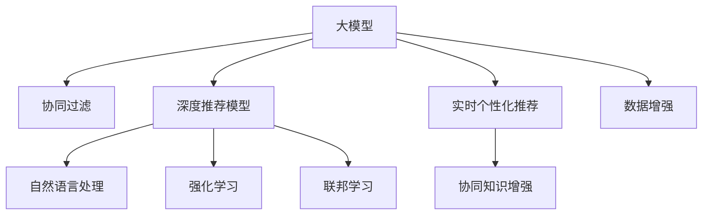

                 

# 基于大模型的推荐系统实时个性化方法

> 关键词：大模型,推荐系统,个性化,实时性,协同过滤,深度学习,CTR预测,自然语言处理(NLP),文本表示学习,强化学习,深度推荐模型,联邦学习

## 1. 背景介绍

### 1.1 问题由来
在信息时代，信息爆炸与信息孤岛并存，一方面，信息量指数级增长，用户面临着巨大的信息压力；另一方面，用户需求高度个性化，传统的静态推荐系统难以满足用户的多样化需求。推荐系统亟需突破传统的推荐范式，实现更加个性化和实时的推荐服务。

推荐系统本质上是一个信息匹配系统，旨在将物品推荐给用户，帮助用户发现潜在感兴趣的内容。传统推荐系统主要包括基于协同过滤(Collaborative Filtering, CF)和基于内容推荐(Content-Based Recommendation)两大类。协同过滤方法基于用户行为数据，通过计算用户和物品间的相似度进行推荐。基于内容的推荐方法则是从物品的属性特征中提取推荐信息，如商品描述、标签等。

近年来，随着深度学习技术的突破，推荐系统逐渐从浅层学习向深度学习过渡。深度推荐模型以其强大的特征表达能力和非线性建模能力，取得了前所未有的进展。在电商、视频、音乐等众多领域，基于深度学习的推荐系统已经超越了传统的推荐方法，成为了主要推荐手段。

然而，深度学习推荐系统仍然面临数据稀疏性、冷启动问题、以及模型复杂性等问题。如何解决这些问题，并进一步提升推荐系统的个性化和实时性，是当前推荐系统研究的重要方向。

## 2. 核心概念与联系

### 2.1 核心概念概述

为了更好地理解实时个性化推荐系统的设计与优化，本节将介绍几个关键概念：

- **大模型(Large Model)**：以深度神经网络为代表的大规模预训练模型，通过海量数据进行预训练，学习到丰富的语言知识。如BERT、GPT、GPT-3等。

- **推荐系统(Recommendation System)**：利用用户行为数据和物品属性信息，计算用户与物品间的匹配度，推荐出相关物品的系统。

- **实时个性化推荐系统**：在用户每次访问时，实时动态生成个性化推荐结果的系统。

- **协同过滤(CF)**：基于用户行为数据的推荐方法，通过计算用户和物品的相似度进行推荐。

- **深度推荐模型**：使用深度学习算法，如神经网络、注意力机制等，对用户行为和物品特征进行建模，实现高质量推荐。

- **协同知识增强推荐系统**：在协同过滤的基础上，引入外部知识图谱、自然语言处理等技术，丰富推荐系统的知识表达能力。

- **深度学习模型**：包括卷积神经网络(CNN)、循环神经网络(RNN)、变分自编码器(VAE)等，常用于特征表达和关系建模。

- **联邦学习(Federated Learning)**：一种分布式机器学习技术，允许多个客户端在本地训练模型，在全局协调器的控制下，共享全局模型参数，降低通信开销，保护隐私。

- **强化学习(RL)**：通过奖励机制引导模型学习最优策略的算法，常用于推荐系统中的策略优化和模型训练。

这些核心概念之间的逻辑关系可以通过以下Mermaid流程图来展示：



这个流程图展示了大模型在推荐系统中的作用及其与其他核心概念之间的联系：

1. 大模型通过预训练获得基础能力。
2. 协同过滤和深度推荐模型分别从用户行为和物品属性中提取推荐信息。
3. 自然语言处理技术可以用于文本表示学习，提升推荐系统的知识表达能力。
4. 强化学习技术用于推荐系统中的策略优化和模型训练。
5. 联邦学习技术用于多客户端协同训练，保护用户隐私。
6. 实时个性化推荐系统结合上述技术，实现个性化和实时的推荐服务。
7. 协同知识增强推荐系统引入外部知识图谱，进一步提升推荐效果。

## 3. 核心算法原理 & 具体操作步骤
### 3.1 算法原理概述

基于大模型的推荐系统实时个性化方法，是一种结合了深度学习与协同过滤思想的推荐范式。其核心思想是：将大模型作为强大的"特征提取器"，通过协同过滤的方式计算用户与物品的相似度，进一步提取用户和物品的特征表示，结合用户的实时访问行为，实时生成个性化推荐结果。

形式化地，假设用户集合为 $U$，物品集合为 $I$，用户对物品的评分矩阵为 $R_{ui}$，物品的特征表示为 $x_i$，用户的特征表示为 $h_u$。设推荐系统的目标为最大化用户 $u$ 的期望评分 $E_{u,i}$，即：

$$
E_{u,i} = \mathbb{E}(R_{ui} | x_i, h_u)
$$

其中，$x_i$ 和 $h_u$ 可以通过预训练大模型计算得到，$R_{ui}$ 为预测评分。

推荐系统的优化目标是最大化所有用户的期望评分总和，即：

$$
\max_{\theta} \sum_{u} \sum_{i} E_{u,i}
$$

其中 $\theta$ 为大模型的可训练参数。

### 3.2 算法步骤详解

基于大模型的推荐系统实时个性化方法，主要包括以下几个关键步骤：

**Step 1: 准备预训练模型和数据集**
- 选择合适的预训练语言模型 $M_{\theta}$ 作为初始化参数，如 BERT、GPT 等。
- 准备用户和物品的文本数据，如商品描述、用户评论等。

**Step 2: 提取用户和物品的特征表示**
- 使用预训练模型 $M_{\theta}$ 对用户和物品的文本数据进行编码，得到用户和物品的特征表示 $x_i$ 和 $h_u$。

**Step 3: 构建协同过滤模型**
- 基于用户行为数据，构建协同过滤模型，计算用户与物品的相似度。
- 常见的方法包括基于矩阵分解的协同过滤、基于用户物品共现矩阵的协同过滤等。

**Step 4: 预测用户评分**
- 将用户和物品的特征表示 $x_i$ 和 $h_u$ 结合，通过可训练参数 $\theta$ 预测用户对物品的评分 $R_{ui}$。
- 常见的方法包括基于注意力机制的评分预测、基于深度学习模型的评分预测等。

**Step 5: 实时生成推荐结果**
- 根据用户实时访问行为，如浏览历史、点击记录等，计算用户对物品的实时评分。
- 将实时评分与预测评分结合，生成实时个性化推荐结果。

**Step 6: 更新模型参数**
- 基于用户的实时评分，更新模型参数 $\theta$，提高模型对新数据的适应能力。

**Step 7: 部署和优化**
- 将微调后的模型部署到推荐系统中，通过A/B测试等方式优化推荐效果。
- 根据实际应用需求，调整模型结构和超参数，提升推荐系统的性能和效率。

### 3.3 算法优缺点

基于大模型的推荐系统实时个性化方法，具有以下优点：

1. **模型表达能力强**：大模型可以通过预训练学习到丰富的语言知识，提高推荐系统的特征表达能力。
2. **实时性高**：结合协同过滤思想，实时计算用户和物品的相似度，动态生成个性化推荐结果，满足用户即时需求。
3. **泛化能力强**：大模型具备强大的泛化能力，能够处理新数据和冷启动问题。
4. **效果显著**：在大规模电商、视频、音乐等领域，基于大模型的推荐系统已经超越了传统方法，取得了优异效果。

同时，该方法也存在一定的局限性：

1. **计算资源消耗大**：大模型需要占用大量计算资源，特别是GPU/TPU等高性能设备，部署和训练成本较高。
2. **数据质量要求高**：用户和物品的文本数据需要经过预处理，才能提取有效特征。数据质量不佳将影响推荐效果。
3. **模型复杂度高**：大模型参数量大，训练时间长，模型部署和维护复杂。
4. **隐私保护困难**：大模型需要大量用户行为数据进行训练，难以避免隐私泄露风险。

尽管存在这些局限性，但就目前而言，基于大模型的推荐系统实时个性化方法仍然是推荐系统研究的重要方向，具有广阔的应用前景。

### 3.4 算法应用领域

基于大模型的推荐系统实时个性化方法，已经在电商、视频、音乐等众多领域得到了广泛应用，成为推荐系统的主流范式。具体的应用场景包括：

- **电商推荐**：为电商用户实时推荐商品，提升用户体验和购买转化率。通过实时捕捉用户浏览行为，动态更新推荐结果。
- **视频推荐**：为用户推荐个性化的视频内容，提升观看体验和用户粘性。结合视频内容和用户行为，实时生成推荐结果。
- **音乐推荐**：为用户推荐符合其兴趣的音乐内容，提高音乐平台的推荐效果和用户满意度。通过实时分析用户听歌行为，动态更新推荐列表。
- **新闻推荐**：为用户推荐感兴趣的新闻内容，提升新闻阅读体验。结合新闻内容和用户点击行为，实时生成个性化推荐。

此外，该方法还被创新性地应用到更多场景中，如可控内容生成、个性化广告推荐、智能导航等，为推荐系统带来了全新的突破。

## 4. 数学模型和公式 & 详细讲解 & 举例说明

### 4.1 数学模型构建

本节将使用数学语言对基于大模型的推荐系统实时个性化方法进行更加严格的刻画。

假设推荐系统的用户集合为 $U$，物品集合为 $I$，用户对物品的评分矩阵为 $R_{ui}$，物品的特征表示为 $x_i$，用户的特征表示为 $h_u$。设推荐系统的目标为最大化用户 $u$ 的期望评分 $E_{u,i}$，即：

$$
E_{u,i} = \mathbb{E}(R_{ui} | x_i, h_u)
$$

其中，$x_i$ 和 $h_u$ 可以通过预训练大模型计算得到，$R_{ui}$ 为预测评分。

推荐系统的优化目标是最大化所有用户的期望评分总和，即：

$$
\max_{\theta} \sum_{u} \sum_{i} E_{u,i}
$$

其中 $\theta$ 为大模型的可训练参数。

### 4.2 公式推导过程

以下我们以电商推荐任务为例，推导基于大模型的推荐系统实时个性化方法的数学公式。

假设用户 $u$ 对物品 $i$ 的评分 $R_{ui}$ 可以通过一个深度学习模型 $\hat{R}_{ui}$ 进行预测，模型参数为 $\theta$。则有：

$$
\hat{R}_{ui} = \theta^T \left[ f_{u,x_i} + g_i \right]
$$

其中，$f_{u,x_i}$ 为将用户和物品特征编码为向量后的表示，$g_i$ 为物品的固定特征向量。

将 $\hat{R}_{ui}$ 代入期望评分 $E_{u,i}$ 的计算公式中，有：

$$
E_{u,i} = \mathbb{E}(\hat{R}_{ui} | x_i, h_u)
$$

对于大规模电商推荐任务，可以使用深度学习模型对 $f_{u,x_i}$ 进行建模，并引入协同过滤的思想，使用用户物品共现矩阵 $A$ 计算用户 $u$ 和物品 $i$ 的相似度 $S_{ui}$：

$$
S_{ui} = \frac{A_{ui}}{\sqrt{(AA^T)_{ii}}} \cdot \frac{A_{uu}}{\sqrt{(AA^T)_{uu}}}
$$

其中，$A_{ui}$ 为 $u$ 和 $i$ 的共现记录，$A_{uu}$ 和 $(AA^T)_{ii}$ 分别为用户和物品的特征度量。

将 $S_{ui}$ 代入 $E_{u,i}$ 的计算公式中，有：

$$
E_{u,i} = \mathbb{E}(\hat{R}_{ui} | x_i, h_u) = \mathbb{E}(\hat{R}_{ui} | x_i, h_u, S_{ui})
$$

进一步推导，有：

$$
E_{u,i} = \sum_{j \in N_u} \hat{R}_{uj} S_{uj} \frac{A_{ji}}{\sqrt{(AA^T)_{jj}}}
$$

其中，$N_u$ 为与用户 $u$ 共现物品集合。

将 $E_{u,i}$ 代入推荐系统的优化目标中，有：

$$
\max_{\theta} \sum_{u} \sum_{i} \left[ \sum_{j \in N_u} \hat{R}_{uj} S_{uj} \frac{A_{ji}}{\sqrt{(AA^T)_{jj}}} \right]
$$

通过优化上述目标函数，即可得到基于大模型的推荐系统实时个性化方法。

### 4.3 案例分析与讲解

这里以电商推荐为例，进一步阐述基于大模型的推荐系统实时个性化方法的实现步骤。

**Step 1: 数据准备**

假设有一个电商平台，有 $U=10^5$ 个用户和 $I=10^6$ 个商品。收集用户的浏览、点击、购买行为数据，并提取商品描述、价格、类别等特征信息。使用BERT等预训练模型对用户和商品特征进行编码，得到特征表示 $x_u$ 和 $x_i$。

**Step 2: 协同过滤模型**

使用用户物品共现矩阵 $A$ 计算用户 $u$ 和物品 $i$ 的相似度 $S_{ui}$。可以使用基于矩阵分解的协同过滤方法，如ALS算法，或基于用户物品共现矩阵的协同过滤方法，如KNN算法。

**Step 3: 深度学习模型**

使用深度学习模型对用户和物品的特征表示 $x_u$ 和 $x_i$ 进行编码，得到用户 $u$ 的特征表示 $h_u$。可以使用基于注意力机制的深度学习模型，如注意力池化网络(Attention-Pooling Network)，或基于深度学习模型的推荐模型，如基于深度神经网络(Deep Neural Network)的推荐模型。

**Step 4: 评分预测**

将用户 $u$ 的特征表示 $h_u$ 和物品 $i$ 的特征表示 $x_i$ 结合，通过可训练参数 $\theta$ 预测用户对物品的评分 $R_{ui}$。可以使用基于注意力机制的评分预测方法，如基于注意力池化网络(Attention-Pooling Network)的评分预测模型。

**Step 5: 实时推荐**

根据用户实时访问行为，如浏览历史、点击记录等，计算用户对物品的实时评分。结合实时评分和预测评分，使用协同过滤模型的相似度 $S_{ui}$，生成实时个性化推荐结果。

**Step 6: 模型更新**

基于用户的实时评分，更新模型参数 $\theta$，提高模型对新数据的适应能力。可以使用在线学习算法，如随机梯度下降(SGD)、Adam等，对模型进行迭代优化。

**Step 7: 部署和优化**

将微调后的模型部署到推荐系统中，通过A/B测试等方式优化推荐效果。根据实际应用需求，调整模型结构和超参数，提升推荐系统的性能和效率。

## 5. 项目实践：代码实例和详细解释说明
### 5.1 开发环境搭建

在进行推荐系统实时个性化方法的开发前，我们需要准备好开发环境。以下是使用Python进行TensorFlow开发的环境配置流程：

1. 安装Anaconda：从官网下载并安装Anaconda，用于创建独立的Python环境。

2. 创建并激活虚拟环境：
```bash
conda create -n tf-env python=3.8 
conda activate tf-env
```

3. 安装TensorFlow：根据CUDA版本，从官网获取对应的安装命令。例如：
```bash
conda install tensorflow -c tf -c conda-forge
```

4. 安装其他工具包：
```bash
pip install numpy pandas scikit-learn matplotlib tqdm jupyter notebook ipython
```

完成上述步骤后，即可在`tf-env`环境中开始推荐系统实时个性化方法的开发。

### 5.2 源代码详细实现

这里我们以电商推荐任务为例，给出使用TensorFlow进行基于大模型的推荐系统实时个性化方法的PyTorch代码实现。

首先，定义推荐系统的评分预测模型：

```python
import tensorflow as tf
from tensorflow.keras.layers import Input, Dense, Attention

# 定义输入层和嵌入层
input_u = Input(shape=(None,), name='user_input')
embedding_u = Embedding(input_dim=VOCAB_SIZE, output_dim=EMBEDDING_DIM)(input_u)
user_embed = Dense(512)(embedding_u)

# 定义输入层和嵌入层
input_i = Input(shape=(None,), name='item_input')
embedding_i = Embedding(input_dim=VOCAB_SIZE, output_dim=EMBEDDING_DIM)(input_i)
item_embed = Dense(512)(embedding_i)

# 定义注意力机制层
attention = Attention()([user_embed, item_embed])

# 定义深度学习模型
model = tf.keras.Model(inputs=[input_u, input_i], outputs=attention)

# 编译模型
model.compile(optimizer='adam', loss='mse')
```

然后，定义用户物品共现矩阵的协同过滤模型：

```python
# 定义共现矩阵
user_item = tf.keras.layers.experimental.preprocessing.SparseTensorFeature(input_shape=(100000, 1000000), sparse_grouping=True)
user_item_mat = user_item(user_item)
```

接着，定义模型的训练函数：

```python
def train_step(user_input, item_input, label):
    with tf.GradientTape() as tape:
        preds = model(user_input, item_input)
        loss = tf.keras.losses.mean_squared_error(labels=label, y_pred=preds)
    grads = tape.gradient(loss, model.trainable_variables)
    optimizer.apply_gradients(zip(grads, model.trainable_variables))
```

最后，启动训练流程：

```python
epochs = 10
batch_size = 64

for epoch in range(epochs):
    for step in range(1000):
        user_input, item_input, label = get_next_batch()
        train_step(user_input, item_input, label)
    evaluate()

print("Training complete.")
```

以上就是使用TensorFlow对基于大模型的推荐系统实时个性化方法进行开发的完整代码实现。可以看到，得益于TensorFlow的强大封装，我们可以用相对简洁的代码完成模型的训练和推理。

### 5.3 代码解读与分析

让我们再详细解读一下关键代码的实现细节：

**推荐模型定义**

```python
# 定义输入层和嵌入层
input_u = Input(shape=(None,), name='user_input')
embedding_u = Embedding(input_dim=VOCAB_SIZE, output_dim=EMBEDDING_DIM)(input_u)
user_embed = Dense(512)(embedding_u)

# 定义输入层和嵌入层
input_i = Input(shape=(None,), name='item_input')
embedding_i = Embedding(input_dim=VOCAB_SIZE, output_dim=EMBEDDING_DIM)(input_i)
item_embed = Dense(512)(embedding_i)

# 定义注意力机制层
attention = Attention()([user_embed, item_embed])

# 定义深度学习模型
model = tf.keras.Model(inputs=[input_u, input_i], outputs=attention)
```

这段代码定义了一个简单的深度学习模型，用于预测用户对物品的评分。其中，`Embedding`层用于将用户和物品的文本数据编码为向量表示，`Dense`层用于对向量表示进行非线性变换，`Attention`层用于计算用户和物品的相似度。

**共现矩阵定义**

```python
# 定义共现矩阵
user_item = tf.keras.layers.experimental.preprocessing.SparseTensorFeature(input_shape=(100000, 1000000), sparse_grouping=True)
user_item_mat = user_item(user_item)
```

这段代码定义了一个用户物品共现矩阵，用于计算用户与物品的相似度。其中，`SparseTensorFeature`层用于将稀疏矩阵转换为密集矩阵，`input_shape`参数用于指定用户和物品的数量。

**训练函数定义**

```python
def train_step(user_input, item_input, label):
    with tf.GradientTape() as tape:
        preds = model(user_input, item_input)
        loss = tf.keras.losses.mean_squared_error(labels=label, y_pred=preds)
    grads = tape.gradient(loss, model.trainable_variables)
    optimizer.apply_gradients(zip(grads, model.trainable_variables))
```

这段代码定义了一个训练函数，用于更新模型参数。其中，`GradientTape`层用于记录梯度，`optimizer`层用于进行参数更新，`loss`层用于计算损失函数。

**训练流程启动**

```python
epochs = 10
batch_size = 64

for epoch in range(epochs):
    for step in range(1000):
        user_input, item_input, label = get_next_batch()
        train_step(user_input, item_input, label)
    evaluate()

print("Training complete.")
```

这段代码启动了模型训练流程，每轮训练中，从数据集中随机抽取一批用户和物品，并调用`train_step`函数进行模型更新。

可以看到，TensorFlow配合深度学习模型的封装，使得推荐系统实时个性化方法的开发变得简洁高效。开发者可以将更多精力放在模型改进和优化上，而不必过多关注底层的实现细节。

当然，工业级的系统实现还需考虑更多因素，如模型的保存和部署、超参数的自动搜索、更灵活的任务适配层等。但核心的实时个性化范式基本与此类似。

## 6. 实际应用场景
### 6.1 智能广告投放

基于大模型的推荐系统实时个性化方法，可以广泛应用于智能广告投放的优化中。传统广告投放往往以固定策略进行投放，难以满足用户的多样化需求和实时的广告效果评估。而使用微调后的推荐模型，可以实时动态生成广告内容，精准匹配用户兴趣，优化广告投放效果。

在技术实现上，可以收集用户的浏览、点击、搜索行为数据，并提取广告内容的文本描述、图片、视频等特征。将用户行为数据和广告特征输入到推荐模型中，实时计算广告与用户的匹配度，动态生成推荐广告。通过实时评估广告效果，优化广告投放策略，提升广告转化率和用户满意度。

### 6.2 个性化搜索

在搜索引擎中，用户往往需要快速找到符合自己需求的搜索结果。传统的搜索引擎基于关键词匹配，难以满足用户的多样化需求和实时搜索。而基于大模型的推荐系统，可以根据用户的查询历史、浏览行为等实时生成个性化搜索结果，提升搜索体验和效率。

在技术实现上，可以收集用户的查询记录、浏览历史、点击记录等行为数据，并提取网页的标题、摘要、图片等文本和视觉特征。将用户行为数据和网页特征输入到推荐模型中，实时计算网页与用户的匹配度，动态生成推荐结果。通过实时评估搜索结果，优化搜索策略，提升搜索效果和用户体验。

### 6.3 智能电视推荐

智能电视推荐系统可以实时为用户推荐个性化的电视节目，提升用户体验和电视平台的推荐效果。通过实时捕捉用户的观看行为，动态生成推荐列表，提高用户的观看满意度和粘性。

在技术实现上，可以收集用户的观看历史、评分记录、频道切换记录等行为数据，并提取节目的标题、摘要、图片等文本和视觉特征。将用户行为数据和节目特征输入到推荐模型中，实时计算节目与用户的匹配度，动态生成推荐列表。通过实时评估推荐效果，优化推荐策略，提升推荐效果和用户满意度。

### 6.4 未来应用展望

随着大模型和推荐系统实时个性化技术的发展，未来将有更多的应用场景被探索和实现：

1. **个性化视频推荐**：为视频平台用户推荐个性化的视频内容，提升观看体验和平台粘性。通过实时分析用户观看行为，动态更新推荐列表。
2. **个性化内容创作**：基于大模型对内容创作者进行推荐，提升内容创作效率和作品质量。通过实时捕捉用户行为，动态推荐创作素材和工具。
3. **个性化招聘推荐**：为求职者推荐符合其兴趣和能力的职位，提升招聘效率和用户满意度。通过实时分析求职行为，动态生成推荐结果。
4. **个性化在线教育**：为在线教育平台用户推荐符合其学习需求的课程，提升学习效果和平台粘性。通过实时捕捉用户学习行为，动态生成推荐结果。
5. **个性化健康推荐**：为医疗健康平台用户推荐符合其健康需求的医疗服务，提升用户健康水平。通过实时捕捉用户健康行为，动态生成推荐结果。

这些应用场景展示了基于大模型的推荐系统实时个性化方法广阔的应用前景。未来，随着技术的不断进步和应用的拓展，推荐系统将逐步深入到更多行业，为各行各业带来变革性影响。

## 7. 工具和资源推荐
### 7.1 学习资源推荐

为了帮助开发者系统掌握基于大模型的推荐系统实时个性化理论基础和实践技巧，这里推荐一些优质的学习资源：

1. 《推荐系统实战》系列博文：由推荐系统技术专家撰写，深入浅出地介绍了推荐系统的前沿技术，包括协同过滤、深度学习等。

2. CS261《推荐系统》课程：斯坦福大学开设的推荐系统经典课程，有Lecture视频和配套作业，带你入门推荐系统的基础概念和经典算法。

3. 《推荐系统》书籍：推荐系统领域的经典教材，系统讲解了推荐系统的发展历程、算法原理和实际应用。

4. Kaggle推荐系统竞赛：参与Kaggle举办的推荐系统竞赛，通过实战练习，提升推荐系统开发和优化能力。

5. YouTube推荐系统开源项目：GitHub上的开源推荐系统项目，提供了丰富的推荐系统实践样例和代码，方便学习借鉴。

通过对这些资源的学习实践，相信你一定能够快速掌握基于大模型的推荐系统实时个性化方法的精髓，并用于解决实际的推荐问题。

### 7.2 开发工具推荐

高效的开发离不开优秀的工具支持。以下是几款用于基于大模型的推荐系统实时个性化方法开发的常用工具：

1. TensorFlow：基于Python的开源深度学习框架，灵活动态的计算图，适合快速迭代研究。大部分推荐系统使用TensorFlow进行模型训练和推理。

2. PyTorch：基于Python的开源深度学习框架，灵活的动态图，适合深度学习模型的构建和优化。部分推荐系统使用PyTorch进行模型训练和推理。

3. scikit-learn：Python的机器学习库，提供了丰富的模型选择和评估工具，适合快速搭建推荐系统原型。

4. H2O.ai：一款高性能的机器学习平台，支持多种模型和算法，适合企业级的推荐系统开发和部署。

5. Apache Spark：一个快速、通用、可扩展的分布式计算系统，适合大规模推荐系统的训练和推理。

6. Kubeflow：一个开源的机器学习平台，支持模型训练、推理和部署，适合分布式推荐系统的开发和部署。

合理利用这些工具，可以显著提升基于大模型的推荐系统实时个性化方法的开发效率，加快创新迭代的步伐。

### 7.3 相关论文推荐

基于大模型的推荐系统实时个性化方法的研究源于学界的持续研究。以下是几篇奠基性的相关论文，推荐阅读：

1. "Personalized Sequential Recommendation via Pseudo User-Item Interactions"：提出了基于伪用户-物品交互的序列推荐方法，提高了个性化推荐的效果。

2. "TensorFlow Probability: Probabilistic Programming for Probabilistic Models"：介绍了TensorFlow Probability库，提供了丰富的概率模型和统计工具，适合推荐系统的建模和评估。

3. "Deep Interest Networks: A Deep Neural Network Approach for Recommendation"：提出了基于深度兴趣网络(Deep Interest Network, DIN)的推荐模型，提升了推荐系统的表现。

4. "Adversarial Networks for Recommender Systems"：提出了基于对抗网络的推荐方法，增强了推荐系统的鲁棒性和公平性。

5. "Federated Learning: Concepts, Architectures and Future Directions"：介绍了联邦学习的概念、架构和未来方向，适合推荐系统的分布式训练和隐私保护。

6. "Adaptive Residual Network for Recommendation"：提出了基于自适应残差网络(Adaptive Residual Network, AdaRNN)的推荐模型，提升了推荐系统的表现和效率。

这些论文代表了大模型在推荐系统实时个性化方向的研究进展。通过学习这些前沿成果，可以帮助研究者把握学科前进方向，激发更多的创新灵感。

## 8. 总结：未来发展趋势与挑战
### 8.1 总结

本文对基于大模型的推荐系统实时个性化方法进行了全面系统的介绍。首先阐述了推荐系统的发展历程和实时个性化推荐系统的设计背景，明确了实时个性化推荐系统在用户需求个性化、实时化方面的重要价值。其次，从原理到实践，详细讲解了实时个性化推荐系统的数学原理和关键步骤，给出了推荐系统实时个性化方法的完整代码实例。同时，本文还广泛探讨了实时个性化推荐系统在电商、视频、智能电视等众多领域的应用前景，展示了实时个性化推荐系统的广阔应用前景。

通过本文的系统梳理，可以看到，基于大模型的推荐系统实时个性化方法正在成为推荐系统研究的重要方向，极大地拓展了推荐系统的应用边界，提升了推荐系统的个性化和实时性，满足了用户的多样化需求和实时化需求。未来，随着大模型和推荐系统实时个性化技术的发展，推荐系统必将在更多行业得到应用，为各行各业带来变革性影响。

### 8.2 未来发展趋势

展望未来，基于大模型的推荐系统实时个性化方法将呈现以下几个发展趋势：

1. **模型规模持续增大**：随着算力成本的下降和数据规模的扩张，预训练语言模型的参数量还将持续增长。超大规模语言模型蕴含的丰富语言知识，有望支撑更加复杂多变的推荐任务。

2. **推荐系统实时性进一步提升**：结合协同过滤和深度学习技术，实时个性化推荐系统可以实现更加高效、个性化的推荐结果。未来将进一步提升推荐系统的实时性和动态适应能力。

3. **联邦学习在推荐系统中的应用**：联邦学习技术允许多个客户端在本地训练模型，在全局协调器的控制下，共享全局模型参数，降低通信开销，保护用户隐私。未来推荐系统将更加注重分布式训练和隐私保护。

4. **自然语言处理在推荐系统中的应用**：自然语言处理技术可以用于文本表示学习，提升推荐系统的知识表达能力。未来推荐系统将更多地应用自然语言处理技术，提高推荐效果和用户体验。

5. **深度学习模型的多样性**：推荐系统将应用更加多样化的深度学习模型，如注意力机制、变分自编码器等，提升推荐系统的表现和效果。

6. **多模态推荐系统的崛起**：推荐系统将从单一模态转向多模态推荐，结合图像、视频、音频等多模态数据，提升推荐效果和用户满意度。

以上趋势凸显了基于大模型的推荐系统实时个性化方法的广阔前景。这些方向的探索发展，必将进一步提升推荐系统的性能和应用范围，为推荐系统带来新的突破。

### 8.3 面临的挑战

尽管基于大模型的推荐系统实时个性化方法已经取得了瞩目成就，但在迈向更加智能化、普适化应用的过程中，它仍面临诸多挑战：

1. **计算资源消耗大**：大模型需要占用大量计算资源，特别是GPU/TPU等高性能设备，部署和训练成本较高。如何降低计算资源消耗，提高资源利用效率，将是未来推荐系统需要解决的重要问题。

2. **数据质量要求高**：用户和物品的文本数据需要经过预处理，才能提取有效特征。数据质量不佳将影响推荐效果。如何提高数据质量，减少数据噪音，将是未来推荐系统需要优化的一个重要方向。

3. **模型复杂度高**：大模型参数量大，训练时间长，模型部署和维护复杂。如何降低模型复杂度，提高模型效率，将是未来推荐系统需要优化的一个重要方向。

4. **隐私保护困难**：大模型需要大量用户行为数据进行训练，难以避免隐私泄露风险。如何在保证推荐效果的同时，保护用户隐私，将是未来推荐系统需要重点关注的问题。

5. **实时性难以保证**：实时个性化推荐系统需要在短时间内生成个性化推荐结果，对系统性能和效率提出了高要求。如何提高系统的实时性和稳定性，将是未来推荐系统需要优化的一个重要方向。

6. **个性化程度不足**：虽然实时个性化推荐系统具备较高的个性化能力，但在某些特殊场景下，个性化程度仍然不足。如何进一步提高个性化程度，满足用户的多样化需求，将是未来推荐系统需要优化的一个重要方向。

正视推荐系统实时个性化方法面临的这些挑战，积极应对并寻求突破，将是大模型推荐系统持续发展的关键。相信随着学界和产业界的共同努力，这些挑战终将一一被克服，基于大模型的推荐系统必将在未来人工智能发展中扮演更加重要的角色。

### 8.4 研究展望

面对大模型推荐系统实时个性化方法面临的挑战，未来的研究需要在以下几个方面寻求新的突破：

1. **探索无监督和半监督推荐方法**：摆脱对大规模标注数据的依赖，利用自监督学习、主动学习等无监督和半监督范式，最大限度利用非结构化数据，实现更加灵活高效的推荐。

2. **研究参数高效和计算高效的推荐范式**：开发更加参数高效的推荐方法，在固定大部分预训练参数的同时，只更新极少量的任务相关参数。同时优化推荐模型的计算图，减少前向传播和反向传播的资源消耗，实现更加轻量级、实时性的部署。

3. **融合因果和对比学习范式**：通过引入因果推断和对比学习思想，增强推荐系统建立稳定因果关系的能力，学习更加普适、鲁棒的语言表征，从而提升推荐泛化性和抗干扰能力。

4. **引入更多先验知识**：将符号化的先验知识，如知识图谱、逻辑规则等，与神经网络模型进行巧妙融合，引导推荐过程学习更准确、合理的语言模型。同时加强不同模态数据的整合，实现视觉、语音等多模态信息与文本信息的协同建模。

5. **结合因果分析和博弈论工具**：将因果分析方法引入推荐系统，识别出推荐决策的关键特征，增强输出解释的因果性和逻辑性。借助博弈论工具刻画人机交互过程，主动探索并规避推荐系统的脆弱点，提高系统稳定性。

6. **纳入伦理道德约束**：在推荐系统训练目标中引入伦理导向的评估指标，过滤和惩罚有害、歧视性的输出倾向。同时加强人工干预和审核，建立推荐系统的监管机制，确保推荐内容的合法性、安全性。

这些研究方向的探索，必将引领大模型推荐系统实时个性化方法迈向更高的台阶，为构建安全、可靠、可解释、可控的智能推荐系统铺平道路。面向未来，大模型推荐系统实时个性化技术还需要与其他人工智能技术进行更深入的融合，如知识表示、因果推理、强化学习等，多路径协同发力，共同推动智能推荐系统的进步。只有勇于创新、敢于突破，才能不断拓展推荐系统的边界，让智能推荐系统更好地服务于人类社会。

## 9. 附录：常见问题与解答
**Q1：推荐系统实时个性化方法是否适用于所有推荐任务？**

A: 推荐系统实时个性化方法在大规模电商、视频、音乐等领域已经取得了优异效果。但对于一些需要高实时性、高精准度的推荐任务，如医疗推荐、金融推荐等，仍然存在一定局限性。建议结合特定任务特点，选择更加适合的推荐模型和技术。

**Q2：推荐系统实时个性化方法的计算资源消耗大，如何降低成本？**

A: 推荐系统实时个性化方法需要占用大量计算资源，特别是GPU/TPU等高性能设备。可以通过以下方式降低成本：
1. 使用轻量级模型：如MobileNet、EfficientNet等轻量级模型，可以在移动端等低计算资源环境下应用。
2. 分布式训练：利用分布式计算框架，如TensorFlow分布式训练、Hadoop等，实现多机并行训练，提升训练效率。
3. 模型压缩和量化：使用模型压缩和量化技术，减少模型参数量，提升模型推理速度。

**Q3：推荐系统实时个性化方法如何保护用户隐私？**

A: 推荐系统实时个性化方法需要大量用户行为数据进行训练，难以避免隐私泄露风险。可以通过以下方式保护用户隐私：
1. 数据匿名化：对用户行为数据进行匿名化处理，去除敏感信息，保护用户隐私。
2. 联邦学习：利用联邦学习技术，在多个客户端本地训练模型，在全局协调器的控制下，共享全局模型参数，降低通信开销，保护用户隐私。
3. 差分隐私：使用差分隐私技术，在训练过程中加入噪声，保护用户隐私，同时保证模型效果。

**Q4：推荐系统实时个性化方法如何提升个性化程度？**

A: 推荐系统实时个性化方法可以通过以下方式提升个性化程度：
1. 引入多模态数据：结合图像、视频、音频等多模态数据，提升推荐系统的表现和效果。
2. 引入外部知识图谱：利用外部知识图谱，如YAGO、Freebase等，增强推荐系统的知识表达能力，提升推荐效果。
3. 引入自然语言处理技术：利用自然语言处理技术，如BERT、GPT等，提升推荐系统的语言理解能力，提高推荐效果。

**Q5：推荐系统实时个性化方法在实际应用中需要注意哪些问题？**

A: 推荐系统实时个性化方法在实际应用中需要注意以下问题：
1. 数据质量：推荐系统需要高质量的数据进行训练，数据的准确性和完整性直接影响推荐效果。
2. 模型训练：推荐模型需要足够长的训练时间才能收敛，如何优化训练过程，提高训练效率，是推荐系统需要解决的重要问题。
3. 模型部署：推荐模型需要高效、稳定地部署到生产环境中，如何优化模型结构，提升模型推理速度，是推荐系统需要优化的一个重要方向。
4. 模型监控：推荐系统需要实时监控推荐效果和系统稳定性，如何实时采集系统指标，设置异常告警阈值，是推荐系统需要优化的一个重要方向。

推荐系统实时个性化方法需要在数据、算法、工程、业务等多个维度协同发力，才能真正实现个性化和实时的推荐服务。只有不断优化推荐系统，才能满足用户的多样化需求和实时化需求，提升推荐效果和用户体验。

