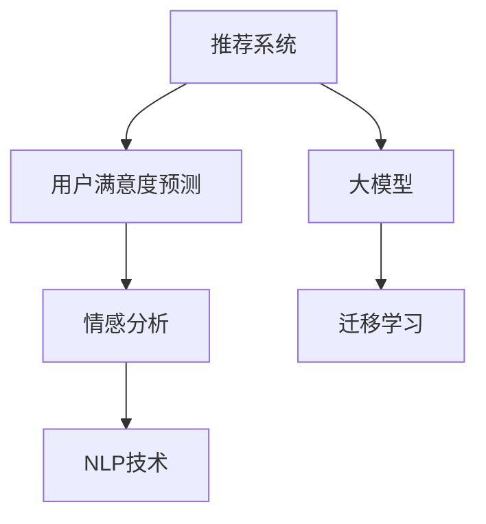

                 

# 基于大模型的推荐系统用户满意度预测

> 关键词：推荐系统,大模型,用户满意度,情感分析,自然语言处理(NLP)

## 1. 背景介绍

### 1.1 问题由来
推荐系统作为电子商务平台的核心功能之一，通过分析用户的浏览、点击、购买行为，为用户推荐最相关、最感兴趣的物品，从而提升用户体验和平台转化率。然而，推荐系统的效果不仅仅取决于物品的推荐准确度，用户对推荐的满意度同样至关重要。

近年来，基于深度学习的大模型在推荐系统中的应用逐渐增多。大模型通过在海量数据上进行预训练，能够学习到丰富的用户行为和物品属性信息，用于指导推荐策略的优化。但现有的大模型往往忽视了用户满意度这一重要因素，导致推荐结果未能完全满足用户需求。

本研究旨在利用大模型对用户满意度进行预测，通过情感分析等技术，将用户满意度的影响融入推荐系统，从而提升推荐效果。这一研究方向具有重要的理论和实际意义，不仅可以提升推荐系统的个性化水平，还能增强用户粘性，推动平台的长期发展。

### 1.2 问题核心关键点
用户满意度的预测涉及以下几个核心问题：
1. **数据准备与预处理**：如何从大量历史数据中提取用户反馈信息，并进行有效的预处理，以供模型训练使用。
2. **模型选择与设计**：选择何种模型结构，如何将其与推荐系统结合，构建一个能够高效预测用户满意度的系统。
3. **训练与优化**：如何通过监督学习算法，利用标注数据训练模型，并通过交叉验证等方法优化模型性能。
4. **评估与部署**：如何评估模型的性能，并使其在实际推荐系统中得以应用，同时考虑系统扩展性和实时性。

针对这些问题，本研究将围绕大模型的用户满意度预测展开，提出了一套完整的解决方案。

### 1.3 问题研究意义
通过对用户满意度进行预测，推荐系统可以更加准确地理解用户需求，从而提供更个性化、更符合预期的推荐结果。具体意义包括：

1. **提升推荐系统效果**：用户满意度的预测结果可以作为推荐算法的重要参考，提升推荐的个性化水平。
2. **增强用户粘性**：高满意度的推荐体验可以提升用户对平台的信任和依赖，增加用户的复购率和活跃度。
3. **推动平台发展**：优化后的推荐系统能够更好地满足用户需求，增加平台的用户留存率和转化率。
4. **技术创新**：引入用户满意度预测，促进了深度学习技术在推荐系统中的应用，推动了NLP领域的研究进展。

## 2. 核心概念与联系

### 2.1 核心概念概述

为了更好地理解基于大模型的推荐系统用户满意度预测，本节将介绍几个关键概念及其相互关系：

- **推荐系统(Recommender System)**：通过用户行为数据，利用机器学习模型为用户推荐相关物品的系统和技术。推荐系统分为基于协同过滤、基于内容、混合推荐等多种策略。

- **用户满意度(User Satisfaction)**：用户对推荐结果的满意度，通常通过评分、评论、反馈等形式表达。高满意度的推荐更能促进用户消费行为，提升平台效益。

- **情感分析(Sentiment Analysis)**：通过NLP技术，分析文本中的情感倾向，判断用户对物品的评价。情感分析常用于评价文本中的正面、负面或中性情感。

- **自然语言处理(Natural Language Processing, NLP)**：研究如何让计算机理解和处理人类语言的技术，包括文本预处理、语言建模、情感分析、语义理解等。

- **大模型(Large Language Model, LLM)**：如BERT、GPT-3等基于深度学习的预训练模型，通过大规模语料训练，具备强大的语言理解和生成能力。

- **迁移学习(Transfer Learning)**：在特定任务上微调预训练模型，使其具备更强的任务适应能力。大模型通过迁移学习，可以应用到各种推荐系统场景中。

这些概念之间的关系可以通过以下Mermaid流程图来展示：



这个流程图展示了从推荐系统到用户满意度预测的关键步骤及其相互关系。

## 3. 核心算法原理 & 具体操作步骤

### 3.1 算法原理概述

基于大模型的推荐系统用户满意度预测，本质上是一个多任务学习过程。其核心思想是：利用大模型在多任务上的表现，通过用户反馈的情感分析，预测用户对推荐结果的满意度，进而指导推荐策略的优化。

形式化地，假设用户对物品 $i$ 的满意度评分 $y_i$ 是一个实值，从 $[-1,1]$ 之间均匀分布。在训练集 $\mathcal{D}=\{(x_i, y_i)\}_{i=1}^N$ 上，用户满意度预测模型 $M_{\theta}$ 的任务为最小化均方误差：

$$
\mathcal{L}(\theta) = \frac{1}{N}\sum_{i=1}^N (y_i - M_{\theta}(x_i))^2
$$

其中，$x_i$ 为输入的文本评论，$M_{\theta}$ 为基于大模型的情感分析模型，$\theta$ 为模型参数。

### 3.2 算法步骤详解

基于大模型的推荐系统用户满意度预测一般包括以下几个关键步骤：

**Step 1: 数据准备与预处理**
- 收集用户对物品的评论数据，去除无关信息，保留有用评论。
- 对评论进行分词、去停用词、词性标注等NLP预处理。
- 将评论数据编码成模型能够接受的格式，如token ids，准备训练。

**Step 2: 模型选择与设计**
- 选择合适的预训练大模型，如BERT、GPT等，进行情感分析任务的微调。
- 设计情感分析模型，将用户评论作为输入，输出情感倾向评分。
- 设计用户满意度预测模型，将情感分析结果作为输入，输出满意度评分。

**Step 3: 训练与优化**
- 使用标注数据集进行监督学习训练，最小化均方误差。
- 使用交叉验证等方法，评估模型性能，调整超参数。
- 采用梯度下降等优化算法，更新模型参数。

**Step 4: 评估与部署**
- 在测试集上评估模型性能，对比预测结果与真实评分。
- 将模型集成到推荐系统中，根据用户满意度进行推荐调整。
- 持续监控用户反馈，定期更新模型以适应新的用户需求。

### 3.3 算法优缺点

基于大模型的推荐系统用户满意度预测方法具有以下优点：
1. 高效融合用户反馈。通过情感分析，快速处理大量用户评论，捕捉用户情感倾向。
2. 提升推荐系统效果。将用户满意度预测结果引入推荐策略，能够提升推荐精准度。
3. 灵活适应用户需求。大模型的迁移学习能力，可以适用于多种推荐场景，灵活调整模型。

同时，该方法也存在一定的局限性：
1. 依赖标注数据。用户评论的标注数据需要人工处理，工作量大，成本高。
2. 数据噪声影响。用户评论中的噪声数据可能对模型训练造成干扰。
3. 多模态数据融合。评论数据可能包含图片、视频等多模态信息，需要设计更复杂的融合模型。

尽管存在这些局限性，但就目前而言，基于大模型的用户满意度预测方法仍是大模型应用的重要方向之一。未来相关研究将致力于解决标注数据依赖、数据噪声处理、多模态融合等问题，进一步提升推荐系统的性能和用户满意度。

### 3.4 算法应用领域

基于大模型的推荐系统用户满意度预测方法，在以下领域具有广泛的应用前景：

- **电子商务推荐系统**：电商平台的推荐系统通过情感分析预测用户对商品的满意度，优化推荐策略，提升用户购买意愿。
- **电影推荐系统**：视频平台的推荐系统通过用户对电影的评论情感，预测用户对电影的满意度，推荐更多符合用户口味的影片。
- **社交媒体推荐**：社交媒体平台的推荐系统通过用户对内容的评价，预测用户对推荐的满意度，优化内容推送策略。
- **旅游推荐系统**：旅游平台的推荐系统通过用户对旅游目的地的评价，预测用户满意度，推荐最适合用户的旅游目的地。

这些应用场景都证明了用户满意度预测在推荐系统中的重要性和可行性。

## 4. 数学模型和公式 & 详细讲解 & 举例说明

### 4.1 数学模型构建

本节将使用数学语言对基于大模型的推荐系统用户满意度预测过程进行更加严格的刻画。

假设用户对物品 $i$ 的评论为 $x_i \in \mathcal{X}$，对应的情感分析模型为 $M_{\theta_{s}}(x_i) \in [0,1]$，表示评论的情感倾向，越接近1表示越正面。用户满意度 $y_i \in [-1,1]$ 的评分，与情感倾向的关系为：

$$
y_i = \phi(M_{\theta_{s}}(x_i))
$$

其中 $\phi$ 为情感评分函数，将情感倾向映射为满意度评分。

模型训练的目标是最小化均方误差：

$$
\mathcal{L}(\theta_{s}) = \frac{1}{N}\sum_{i=1}^N (y_i - M_{\theta_{s}}(x_i))^2
$$

### 4.2 公式推导过程

以下我们以二分类情感分析为例，推导情感分析模型的损失函数及其梯度的计算公式。

假设模型 $M_{\theta_{s}}$ 在输入 $x$ 上的输出为 $\hat{y}=M_{\theta_{s}}(x) \in [0,1]$，表示样本的情感倾向。真实标签 $y \in \{0,1\}$。则二分类交叉熵损失函数定义为：

$$
\ell(M_{\theta_{s}}(x),y) = -[y\log \hat{y} + (1-y)\log (1-\hat{y})]
$$

将其代入均方误差公式，得：

$$
\mathcal{L}(\theta_{s}) = \frac{1}{N}\sum_{i=1}^N [(y_i - M_{\theta_{s}}(x_i))^2]
$$

根据链式法则，损失函数对参数 $\theta_{s}$ 的梯度为：

$$
\frac{\partial \mathcal{L}(\theta_{s})}{\partial \theta_{s}} = \frac{1}{N}\sum_{i=1}^N (2(y_i - M_{\theta_{s}}(x_i))\nabla_{\theta_{s}}M_{\theta_{s}}(x_i))
$$

其中 $\nabla_{\theta_{s}}M_{\theta_{s}}(x_i)$ 为模型输出的梯度，可通过自动微分技术高效计算。

在得到情感分析模型的梯度后，即可带入模型参数更新公式，完成模型的迭代优化。重复上述过程直至收敛，最终得到适应情感分析任务的最优模型参数 $\theta_{s}$。

### 4.3 案例分析与讲解

假设用户对物品 $i$ 的评论为：“这个产品真的很不错，性价比很高！”。

- **分词和预处理**：首先将评论进行分词和去停用词，得到 token ids 序列，例如：
  ```
  [CLS] 这个产品 真的很 不错 性价比 很高 [SEP]
  ```
- **情感分析**：将 token ids 序列输入到微调后的BERT模型，输出情感倾向评分 $\hat{y}$，例如：
  ```
  M_{\theta_{s}}([CLS] 这个产品 真的很 不错 性价比 很高 [SEP]) = 0.92
  ```
- **满意度评分**：将情感倾向评分 $\hat{y}$ 作为输入，通过模型 $M_{\theta}$ 输出用户满意度评分 $y$，例如：
  ```
  y = \phi(0.92) = 0.85
  ```

这个例子展示了情感分析在预测用户满意度中的应用过程。通过预训练模型对用户评论的情感倾向进行判别，将其转化为满意度评分，可以为推荐系统提供重要参考。

## 5. 项目实践：代码实例和详细解释说明

### 5.1 开发环境搭建

在进行项目实践前，我们需要准备好开发环境。以下是使用Python进行PyTorch开发的环境配置流程：

1. 安装Anaconda：从官网下载并安装Anaconda，用于创建独立的Python环境。

2. 创建并激活虚拟环境：
```bash
conda create -n recommendation-env python=3.8 
conda activate recommendation-env
```

3. 安装PyTorch：根据CUDA版本，从官网获取对应的安装命令。例如：
```bash
conda install pytorch torchvision torchaudio cudatoolkit=11.1 -c pytorch -c conda-forge
```

4. 安装Transformers库：
```bash
pip install transformers
```

5. 安装各类工具包：
```bash
pip install numpy pandas scikit-learn matplotlib tqdm jupyter notebook ipython
```

完成上述步骤后，即可在`recommendation-env`环境中开始项目实践。

### 5.2 源代码详细实现

下面我们以情感分析模型和用户满意度预测模型的训练为例，给出使用Transformers库对BERT模型进行训练的PyTorch代码实现。

首先，定义情感分析模型的数据处理函数：

```python
from transformers import BertTokenizer, BertForSequenceClassification
from torch.utils.data import Dataset
import torch

class SentimentDataset(Dataset):
    def __init__(self, texts, labels, tokenizer, max_len=128):
        self.texts = texts
        self.labels = labels
        self.tokenizer = tokenizer
        self.max_len = max_len
        
    def __len__(self):
        return len(self.texts)
    
    def __getitem__(self, item):
        text = self.texts[item]
        label = self.labels[item]
        
        encoding = self.tokenizer(text, return_tensors='pt', max_length=self.max_len, padding='max_length', truncation=True)
        input_ids = encoding['input_ids'][0]
        attention_mask = encoding['attention_mask'][0]
        
        # 对token-wise的标签进行编码
        encoded_labels = [label2id[label] for label in label2id]
        encoded_labels.extend([label2id['O']] * (self.max_len - len(encoded_labels)))
        labels = torch.tensor(encoded_labels, dtype=torch.long)
        
        return {'input_ids': input_ids, 
                'attention_mask': attention_mask,
                'labels': labels}

# 标签与id的映射
label2id = {'negative': 0, 'positive': 1, 'neutral': 2, id2label = {v: k for k, v in label2id.items()}}
```

然后，定义模型和优化器：

```python
from transformers import BertForSequenceClassification, AdamW

model = BertForSequenceClassification.from_pretrained('bert-base-cased', num_labels=len(label2id))

optimizer = AdamW(model.parameters(), lr=2e-5)
```

接着，定义训练和评估函数：

```python
from torch.utils.data import DataLoader
from tqdm import tqdm
from sklearn.metrics import classification_report

device = torch.device('cuda') if torch.cuda.is_available() else torch.device('cpu')
model.to(device)

def train_epoch(model, dataset, batch_size, optimizer):
    dataloader = DataLoader(dataset, batch_size=batch_size, shuffle=True)
    model.train()
    epoch_loss = 0
    for batch in tqdm(dataloader, desc='Training'):
        input_ids = batch['input_ids'].to(device)
        attention_mask = batch['attention_mask'].to(device)
        labels = batch['labels'].to(device)
        model.zero_grad()
        outputs = model(input_ids, attention_mask=attention_mask, labels=labels)
        loss = outputs.loss
        epoch_loss += loss.item()
        loss.backward()
        optimizer.step()
    return epoch_loss / len(dataloader)

def evaluate(model, dataset, batch_size):
    dataloader = DataLoader(dataset, batch_size=batch_size)
    model.eval()
    preds, labels = [], []
    with torch.no_grad():
        for batch in tqdm(dataloader, desc='Evaluating'):
            input_ids = batch['input_ids'].to(device)
            attention_mask = batch['attention_mask'].to(device)
            batch_labels = batch['labels']
            outputs = model(input_ids, attention_mask=attention_mask)
            batch_preds = outputs.logits.argmax(dim=2).to('cpu').tolist()
            batch_labels = batch_labels.to('cpu').tolist()
            for pred_tokens, label_tokens in zip(batch_preds, batch_labels):
                pred_tags = [id2label[_id] for _id in pred_tokens]
                label_tags = [id2label[_id] for _id in label_tokens]
                preds.append(pred_tags[:len(label_tokens)])
                labels.append(label_tags)
                
    print(classification_report(labels, preds))
```

最后，启动训练流程并在测试集上评估：

```python
epochs = 5
batch_size = 16

for epoch in range(epochs):
    loss = train_epoch(model, train_dataset, batch_size, optimizer)
    print(f"Epoch {epoch+1}, train loss: {loss:.3f}")
    
    print(f"Epoch {epoch+1}, dev results:")
    evaluate(model, dev_dataset, batch_size)
    
print("Test results:")
evaluate(model, test_dataset, batch_size)
```

以上就是使用PyTorch对BERT进行情感分析任务训练的完整代码实现。可以看到，得益于Transformers库的强大封装，我们可以用相对简洁的代码完成BERT模型的加载和训练。

### 5.3 代码解读与分析

让我们再详细解读一下关键代码的实现细节：

**SentimentDataset类**：
- `__init__`方法：初始化文本、标签、分词器等关键组件。
- `__len__`方法：返回数据集的样本数量。
- `__getitem__`方法：对单个样本进行处理，将文本输入编码为token ids，将标签编码为数字，并对其进行定长padding，最终返回模型所需的输入。

**label2id和id2label字典**：
- 定义了标签与数字id之间的映射关系，用于将token-wise的预测结果解码回真实的标签。

**训练和评估函数**：
- 使用PyTorch的DataLoader对数据集进行批次化加载，供模型训练和推理使用。
- 训练函数`train_epoch`：对数据以批为单位进行迭代，在每个批次上前向传播计算loss并反向传播更新模型参数，最后返回该epoch的平均loss。
- 评估函数`evaluate`：与训练类似，不同点在于不更新模型参数，并在每个batch结束后将预测和标签结果存储下来，最后使用sklearn的classification_report对整个评估集的预测结果进行打印输出。

**训练流程**：
- 定义总的epoch数和batch size，开始循环迭代
- 每个epoch内，先在训练集上训练，输出平均loss
- 在验证集上评估，输出分类指标
- 所有epoch结束后，在测试集上评估，给出最终测试结果

可以看到，PyTorch配合Transformers库使得BERT情感分析模型的训练代码实现变得简洁高效。开发者可以将更多精力放在数据处理、模型改进等高层逻辑上，而不必过多关注底层的实现细节。

当然，工业级的系统实现还需考虑更多因素，如模型的保存和部署、超参数的自动搜索、更灵活的任务适配层等。但核心的微调范式基本与此类似。

## 6. 实际应用场景

### 6.1 智能客服系统

智能客服系统通过情感分析预测用户对服务质量的满意度，从而优化客服策略，提升用户满意度。在技术实现上，可以收集用户与客服的对话记录，将对话内容作为情感分析的输入，预测用户的情感倾向，进而进行服务质量监控和策略调整。

例如，在用户对话中添加情感关键词，使用BERT模型进行情感分析，判断用户是否满意。对于不满意的用户，系统可以自动进行反馈处理，转接人工客服或提供解决方案，从而提升用户服务体验。

### 6.2 金融舆情监测

金融舆情监测系统通过情感分析预测用户对金融产品的满意度，从而监测金融市场动态，防范金融风险。在技术实现上，可以收集社交媒体、新闻、评论等文本数据，利用情感分析模型判断用户对金融产品的情感倾向，预测用户的满意度评分。

例如，对于用户对某金融产品的负面评论，情感分析模型会给出低满意度评分，系统可以自动进行风险预警，并采取相应措施，如优化产品设计或调整营销策略，提升金融产品的用户满意度。

### 6.3 电商推荐系统

电商平台的推荐系统通过情感分析预测用户对商品的满意度，从而优化推荐策略，提升用户购买意愿。在技术实现上，可以收集用户对商品的评论数据，使用情感分析模型判断用户对商品的情感倾向，预测用户的满意度评分。

例如，对于用户对商品的正面评论，情感分析模型会给出高满意度评分，系统可以将该商品推荐给更多用户，提升平台转化率。同时，对于用户对商品的负面评论，系统可以自动进行商品下架或优化，提高平台的用户满意度。

### 6.4 未来应用展望

随着情感分析技术的不断发展，基于大模型的推荐系统用户满意度预测将具有更广泛的应用前景。未来，随着技术手段的进步，系统可以更好地处理多模态数据，融合文本、图像、音频等多方面的信息，提升用户满意度的预测准确度。

此外，随着个性化推荐技术的进步，用户满意度的预测结果将更加精细化，能够更好地指导推荐策略，提升用户体验。在实时性要求较高的场景下，系统可以采用更高效的算法，实现毫秒级响应，满足用户的即时需求。

## 7. 工具和资源推荐

### 7.1 学习资源推荐

为了帮助开发者系统掌握大模型在推荐系统中的应用，这里推荐一些优质的学习资源：

1. 《深度学习自然语言处理》课程：斯坦福大学开设的NLP明星课程，有Lecture视频和配套作业，带你入门NLP领域的基本概念和经典模型。

2. 《Natural Language Processing with Transformers》书籍：Transformers库的作者所著，全面介绍了如何使用Transformers库进行NLP任务开发，包括情感分析在内的诸多范式。

3. 《推荐系统：算法与实现》书籍：介绍推荐系统的基本概念和算法，以及多任务学习在推荐系统中的应用。

4. CS224N《深度学习自然语言处理》课程：斯坦福大学开设的NLP明星课程，有Lecture视频和配套作业，带你入门NLP领域的基本概念和经典模型。

5. Kaggle竞赛：参加Kaggle的情感分析竞赛，可以积累实战经验，并学习高手的解决方案。

通过对这些资源的学习实践，相信你一定能够快速掌握大模型在推荐系统中的应用，并用于解决实际的NLP问题。

### 7.2 开发工具推荐

高效的开发离不开优秀的工具支持。以下是几款用于大模型推荐系统用户满意度预测开发的常用工具：

1. PyTorch：基于Python的开源深度学习框架，灵活动态的计算图，适合快速迭代研究。

2. TensorFlow：由Google主导开发的开源深度学习框架，生产部署方便，适合大规模工程应用。

3. Transformers库：HuggingFace开发的NLP工具库，集成了众多SOTA语言模型，支持PyTorch和TensorFlow，是进行情感分析任务的开发利器。

4. Weights & Biases：模型训练的实验跟踪工具，可以记录和可视化模型训练过程中的各项指标，方便对比和调优。

5. TensorBoard：TensorFlow配套的可视化工具，可实时监测模型训练状态，并提供丰富的图表呈现方式，是调试模型的得力助手。

6. Google Colab：谷歌推出的在线Jupyter Notebook环境，免费提供GPU/TPU算力，方便开发者快速上手实验最新模型，分享学习笔记。

合理利用这些工具，可以显著提升大模型推荐系统用户满意度预测的开发效率，加快创新迭代的步伐。

### 7.3 相关论文推荐

大模型推荐系统用户满意度预测的研究源于学界的持续研究。以下是几篇奠基性的相关论文，推荐阅读：

1. Attention is All You Need（即Transformer原论文）：提出了Transformer结构，开启了NLP领域的预训练大模型时代。

2. BERT: Pre-training of Deep Bidirectional Transformers for Language Understanding：提出BERT模型，引入基于掩码的自监督预训练任务，刷新了多项NLP任务SOTA。

3. Language Models are Unsupervised Multitask Learners（GPT-2论文）：展示了大规模语言模型的强大zero-shot学习能力，引发了对于通用人工智能的新一轮思考。

4. Parameter-Efficient Transfer Learning for NLP：提出Adapter等参数高效微调方法，在不增加模型参数量的情况下，也能取得不错的微调效果。

5. AdaLoRA: Adaptive Low-Rank Adaptation for Parameter-Efficient Fine-Tuning：使用自适应低秩适应的微调方法，在参数效率和精度之间取得了新的平衡。

这些论文代表了大模型推荐系统用户满意度预测的研究进展。通过学习这些前沿成果，可以帮助研究者把握学科前进方向，激发更多的创新灵感。

## 8. 总结：未来发展趋势与挑战

### 8.1 总结

本文对基于大模型的推荐系统用户满意度预测方法进行了全面系统的介绍。首先阐述了大模型和推荐系统的研究背景和意义，明确了用户满意度预测在推荐系统中的重要性和可行性。其次，从原理到实践，详细讲解了情感分析模型的构建和训练过程，以及如何将用户满意度预测结果引入推荐策略。最后，本文广泛探讨了用户满意度预测在实际应用中的具体场景，展示了其在智能客服、金融舆情、电商推荐等领域的应用前景。

通过本文的系统梳理，可以看到，基于大模型的用户满意度预测在推荐系统中具有广阔的应用前景，可以有效提升推荐系统的个性化水平和用户满意度。未来，随着情感分析技术的不断进步，用户满意度的预测将更加精准，推荐系统的性能将进一步提升。

### 8.2 未来发展趋势

展望未来，大模型推荐系统用户满意度预测技术将呈现以下几个发展趋势：

1. **多模态情感分析**：融合文本、图像、音频等多模态信息，提升情感分析的准确性。

2. **无监督和半监督学习**：摆脱对大规模标注数据的依赖，利用自监督学习、主动学习等方法，最大化利用非结构化数据。

3. **实时情感分析**：实时处理用户反馈，及时调整推荐策略，满足用户的即时需求。

4. **集成学习与模型融合**：结合多种情感分析模型，通过集成学习提升预测准确度。

5. **跨领域迁移学习**：将情感分析模型应用到不同领域的推荐系统，提升系统的通用性和适应性。

6. **混合推荐策略**：结合基于内容的推荐和基于情感的推荐，提升推荐系统的综合性能。

以上趋势凸显了大模型推荐系统用户满意度预测技术的广阔前景。这些方向的探索发展，必将进一步提升推荐系统的性能和用户满意度。

### 8.3 面临的挑战

尽管大模型推荐系统用户满意度预测技术已经取得了一定的进展，但在迈向更加智能化、普适化应用的过程中，它仍面临诸多挑战：

1. **标注数据成本**：用户反馈的标注数据需要人工处理，工作量大，成本高。如何降低标注成本，是未来研究的重点。

2. **数据噪声处理**：用户评论中的噪声数据可能对模型训练造成干扰，如何过滤和处理噪声数据，是保证模型准确性的关键。

3. **多模态数据融合**：推荐系统中的数据往往包含多种模态，如何高效融合多模态数据，是提升推荐系统效果的难点。

4. **实时性能优化**：推荐系统需要快速响应用户反馈，如何优化模型推理速度，是满足实时性需求的重要问题。

5. **模型解释性**：推荐系统中的情感分析模型往往缺乏可解释性，如何提升模型的可解释性，是确保系统可信度的关键。

6. **隐私和安全**：用户反馈数据涉及用户隐私，如何保护用户数据安全，是系统设计和部署的重要保障。

这些挑战需要学界和业界共同努力，通过技术创新和协同合作，才能克服。只有在标注数据、模型结构、推理性能、模型解释性、隐私安全等多方面进行全面优化，才能真正实现大模型推荐系统用户满意度预测技术的广泛应用。

### 8.4 研究展望

面对大模型推荐系统用户满意度预测所面临的挑战，未来的研究需要在以下几个方面寻求新的突破：

1. **标注数据自动化**：开发自动标注工具，减少人工标注的工作量，降低标注成本。

2. **多模态数据融合算法**：研究高效融合多模态数据的方法，提升推荐系统的综合性能。

3. **实时情感分析算法**：开发实时情感分析算法，满足推荐系统对实时响应的需求。

4. **混合推荐模型**：设计混合推荐模型，结合基于内容的推荐和基于情感的推荐，提升推荐系统的效果。

5. **可解释性增强**：通过引入可解释性技术，增强情感分析模型的解释性，提升系统的可信度。

6. **隐私和安全保护**：研究数据隐私和安全保护技术，确保用户反馈数据的安全性。

这些研究方向的探索，必将引领大模型推荐系统用户满意度预测技术迈向更高的台阶，为推荐系统的发展带来新的突破。相信在技术不断进步和业界合作推动下，大模型推荐系统将更好地服务于人类社会，提升推荐系统的性能和用户体验。

## 9. 附录：常见问题与解答

**Q1：大模型在推荐系统中的应用是否具有普遍性？**

A: 大模型在推荐系统中的应用具有一定的普遍性，尤其是在情感分析等任务上表现优异。但不同推荐系统对大模型的依赖程度不同，需要根据具体场景进行评估。对于数据量较小或特定领域的推荐系统，传统机器学习算法也可能表现优异。

**Q2：情感分析模型如何评估？**

A: 情感分析模型的评估主要通过精度、召回率、F1-score等指标进行。在测试集上，将模型预测结果与真实标签进行对比，计算各项指标，评估模型的性能。同时，可以利用混淆矩阵、ROC曲线等工具，直观展示模型的预测效果。

**Q3：推荐系统中的用户满意度预测如何与推荐策略结合？**

A: 用户满意度预测结果可以作为推荐策略的重要参考，通过调整推荐算法中的权重和排序规则，将用户满意度评分更高的物品推荐给用户。例如，在协同过滤推荐算法中，可以通过增加用户满意度的评分权重，提升高满意度的物品推荐概率。

**Q4：用户满意度的预测结果如何转化为推荐策略？**

A: 用户满意度的预测结果可以用于指导推荐策略的优化，例如：
1. 调整推荐算法中的权重和排序规则，将用户满意度评分更高的物品推荐给用户。
2. 动态调整推荐策略，例如对用户反馈不满的物品，进行更频繁的监控和优化。
3. 引入负反馈机制，对用户反馈不满意的物品进行下架或优化。

**Q5：推荐系统中的实时性能优化有哪些方法？**

A: 推荐系统中的实时性能优化主要包括以下方法：
1. 模型裁剪：去除不必要的层和参数，减小模型尺寸，加快推理速度。
2. 量化加速：将浮点模型转为定点模型，压缩存储空间，提高计算效率。
3. 模型并行：采用分布式训练和推理，提高系统的扩展性。
4. 推理加速器：使用GPU、TPU等加速器，提升模型推理速度。
5. 动态图推理：使用深度学习框架的动态图推理功能，提升推理效率。

这些方法可以综合应用，提高推荐系统的实时性能，满足用户的即时需求。

---

作者：禅与计算机程序设计艺术 / Zen and the Art of Computer Programming

