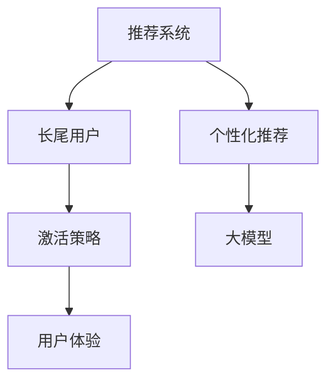

                 

# 基于大模型的推荐系统长尾用户激活策略

> 关键词：推荐系统,长尾用户,大模型,激活策略,用户体验,个性化推荐

## 1. 背景介绍

### 1.1 问题由来

随着互联网的迅猛发展，个性化推荐系统成为了各大电商、社交平台等互联网企业的主要业务支撑点。通过个性化的推荐，可以显著提升用户满意度、增加用户留存率，甚至增加平台收益。

然而，尽管主流推荐系统在头部用户（High-Interactive Users, HIU）上表现出色，但在长尾用户（Long-Tail Users, LTI）上的效果却大打折扣。这是因为长尾用户的行为数据较少，与主流用户的行为模式有较大差异，主流推荐模型难以对其精准推荐。

长尾用户缺乏足够的数据积累，其行为特征难以被模型学习。即便在头部用户达到稳定推荐后，长尾用户的个性化需求仍未被充分挖掘。这不仅造成了用户流失，也限制了推荐系统的总体用户满意度。因此，针对长尾用户的推荐策略成为个性化推荐系统的关键挑战。

### 1.2 问题核心关键点

长尾用户激活策略的研发，需要兼顾以下几个关键点：
1. 用户数据收集：长尾用户行为数据稀疏，需要采用特殊策略来收集更多数据，提高模型的训练质量。
2. 推荐算法设计：在模型设计上，需要针对长尾用户的行为模式进行优化，增强推荐的个性化和多样性。
3. 用户体验优化：长尾用户对推荐系统的满意度直接影响用户留存，需要在系统设计上强化长尾用户的使用体验。
4. 资源优化配置：大模型的训练和推理需要消耗大量资源，需要在资源利用上进行优化。
5. 反馈与迭代：长尾用户的反馈数据较少，需要构建有效的反馈机制，并持续迭代优化推荐效果。

## 2. 核心概念与联系

### 2.1 核心概念概述

为更好地理解长尾用户激活策略，本节将介绍几个核心概念：

- **推荐系统(Recommender System)**：利用用户行为数据，通过算法为用户推荐个性化内容的系统。推荐系统主要分为协同过滤、基于内容的推荐、混合推荐等。
- **长尾用户(Long-Tail User)**：指那些具有较少行为数据的用户群体，他们的需求往往在主流推荐系统中被忽视，需要通过特定的策略提升其活跃度和满意度。
- **大模型(Big Model)**：指通过海量的数据进行预训练，具备强大表达能力的深度学习模型，如BERT、GPT等。
- **激活策略(Activation Strategy)**：针对长尾用户，通过特殊的推荐策略，如强化推荐、多任务学习等，提升其使用频次和满意度。
- **个性化推荐(Personalized Recommendation)**：利用用户个性化特征，为用户推荐与其偏好和行为相匹配的内容。
- **用户体验(User Experience)**：推荐系统对用户交互的友好程度，直接影响用户对系统的满意度和忠诚度。

这些核心概念之间的逻辑关系可以通过以下Mermaid流程图来展示：



这个流程图展示了推荐系统与长尾用户激活策略的基本逻辑：

1. 推荐系统通过对用户行为数据进行分析，提供个性化推荐。
2. 长尾用户在主流推荐系统中往往被忽略，需要通过特定的激活策略提升其使用频次。
3. 大模型具备强大的表达能力，可以用于个性化推荐。
4. 用户体验直接影响用户对推荐系统的满意度，需要通过系统优化提升。

## 3. 核心算法原理 & 具体操作步骤

### 3.1 算法原理概述

长尾用户激活策略的核心思想是通过改进推荐算法和用户体验，增强长尾用户的互动和满意度，从而提高其使用频次。其关键在于：

1. 收集长尾用户行为数据：通过特殊数据收集策略，如KNN(K-Nearest Neighbors)推荐、用户行为标签等，获取更多长尾用户行为数据。
2. 设计针对长尾用户的推荐算法：通过模型优化和策略设计，提高长尾用户推荐效果。
3. 提升用户体验：通过界面设计、互动方式等改进，增强长尾用户的使用体验，提升其对推荐系统的满意度。

### 3.2 算法步骤详解

基于以上原理，长尾用户激活策略主要包含以下几个步骤：

**Step 1: 数据收集与处理**

1. **行为数据收集**：通过用户行为数据记录、协同过滤、交叉推荐等方式，收集长尾用户的行为数据。
2. **数据预处理**：对收集到的数据进行清洗、去重、归一化等处理，确保数据的可用性和准确性。
3. **数据划分**：将数据划分为训练集、验证集和测试集，确保模型训练、验证和测试的独立性。

**Step 2: 模型设计与训练**

1. **模型选择**：选择适用于长尾用户推荐任务的大模型，如BERT、GPT等，或者基于大模型的变种，如AdaLoRA等。
2. **参数调整**：根据长尾用户的行为特点，调整大模型的参数，优化推荐效果。
3. **微调策略**：利用长尾用户的数据进行模型微调，提升模型的精准度和泛化能力。

**Step 3: 个性化推荐**

1. **特征提取**：从用户行为数据中提取特征，如用户偏好、历史行为、社交关系等。
2. **模型推理**：将用户特征输入微调后的大模型，进行个性化推荐。
3. **推荐排序**：根据推荐结果排序，选择最符合用户偏好的内容进行推荐。

**Step 4: 用户体验优化**

1. **界面设计**：改进推荐界面设计，提供直观、易用的推荐展示方式。
2. **互动增强**：通过互动游戏、视频、问答等方式，增强用户对推荐内容的互动。
3. **用户反馈**：收集用户反馈数据，持续优化推荐策略。

**Step 5: 效果评估与迭代**

1. **效果评估**：通过点击率、留存率、满意度等指标，评估推荐效果。
2. **迭代优化**：根据评估结果，调整模型参数和策略，不断优化推荐效果。

### 3.3 算法优缺点

长尾用户激活策略的优点在于：

1. 提高长尾用户使用频次：通过个性化推荐和用户体验优化，提高长尾用户的满意度，增加其使用频次。
2. 提升系统整体效果：长尾用户的高满意度将提升系统的用户满意度，对推荐系统的整体效果有正面影响。
3. 优化资源利用：大模型在推荐系统中可以重复使用，减少计算资源消耗。
4. 增强系统可扩展性：长尾用户激活策略可以应用于不同领域，提升系统的可扩展性。

同时，该策略也存在一些局限性：

1. 数据收集成本高：长尾用户的行为数据稀疏，收集难度大，数据处理成本高。
2. 模型复杂度高：大模型复杂度高，对计算资源要求高。
3. 用户体验提升有限：用户体验的提升效果有限，难以达到主流用户的使用体验。
4. 反馈机制不足：长尾用户反馈数据较少，反馈机制设计困难。

尽管存在这些局限性，但通过合理设计，长尾用户激活策略仍可以在一定程度上提升推荐系统的性能，带来更多的业务价值。

### 3.4 算法应用领域

长尾用户激活策略在多个领域都有广泛的应用，包括但不限于：

- **电子商务**：通过个性化推荐，提升长尾用户对电商平台的满意度和粘性，增加购买率。
- **社交媒体**：在社交平台上，通过推荐用户感兴趣的内容，提升长尾用户的活跃度。
- **新闻媒体**：为新闻媒体平台提供个性化新闻推荐，增加用户的浏览量和满意度。
- **在线教育**：通过推荐个性化课程，提升长尾用户在在线教育平台上的学习体验和留存率。
- **视频流媒体**：通过推荐个性化的视频内容，增加长尾用户的观看频次和满意度。

以上领域中，长尾用户激活策略不仅有助于提升用户满意度，还能增加平台收益，具有重要的实际意义。

## 4. 数学模型和公式 & 详细讲解 & 举例说明

### 4.1 数学模型构建

长尾用户激活策略的数学模型主要包括以下几个部分：

1. **用户行为数据表示**：通过向量表示法，将用户行为数据转换为模型可接受的输入形式。
2. **推荐结果评估**：使用点击率、留存率、满意度等指标，对推荐结果进行评估。
3. **模型训练目标**：通过最大化用户满意度，优化模型参数。

设用户行为数据为 $\mathbf{x} \in \mathbb{R}^n$，推荐结果为 $\mathbf{y} \in \{0, 1\}$，满意度为 $\mathcal{L}(\mathbf{x}, \mathbf{y})$。则模型的训练目标为：

$$
\mathop{\arg\min}_{\theta} \mathbb{E}_{\mathbf{x}, \mathbf{y}}[\mathcal{L}(\mathbf{x}, \mathbf{y})]
$$

其中 $\theta$ 为模型参数，$\mathbb{E}$ 为期望运算。

### 4.2 公式推导过程

以点击率预测为例，假设推荐模型为 $M_{\theta}(\mathbf{x})$，则点击率预测公式为：

$$
\hat{y} = \sigma(\mathbf{w}^T \mathbf{x} + b)
$$

其中 $\sigma$ 为 sigmoid 函数，$\mathbf{w}$ 和 $b$ 为模型参数。点击率的预测误差为：

$$
\mathcal{L}(\mathbf{x}, \mathbf{y}) = -y \log \hat{y} - (1-y) \log (1-\hat{y})
$$

通过上述公式，可以计算出预测误差，进一步优化模型参数。

### 4.3 案例分析与讲解

以电商平台为例，假设电商平台收集到长尾用户的浏览行为数据，可以将其表示为向量形式：

$$
\mathbf{x} = [b_{1}, b_{2}, \cdots, b_{n}]
$$

其中 $b_i$ 表示用户对第 $i$ 个商品的浏览次数。

通过大模型 $M_{\theta}$ 进行推荐，可以得到推荐结果 $\hat{y}$，表示用户对商品的购买意愿。使用 sigmoid 函数作为激活函数，可以得到：

$$
\hat{y} = \sigma(\mathbf{w}^T \mathbf{x} + b)
$$

通过对比预测结果 $\hat{y}$ 和真实标签 $y$，可以得到预测误差：

$$
\mathcal{L}(\mathbf{x}, y) = -y \log \hat{y} - (1-y) \log (1-\hat{y})
$$

利用梯度下降等优化算法，对模型参数 $\theta$ 进行更新，最小化预测误差：

$$
\theta \leftarrow \theta - \eta \nabla_{\theta}\mathcal{L}(\mathbf{x}, y)
$$

其中 $\eta$ 为学习率，$\nabla_{\theta}\mathcal{L}(\mathbf{x}, y)$ 为损失函数对参数 $\theta$ 的梯度。

## 5. 项目实践：代码实例和详细解释说明

### 5.1 开发环境搭建

在进行长尾用户激活策略开发前，需要准备好开发环境。以下是使用Python进行TensorFlow开发的环境配置流程：

1. 安装Anaconda：从官网下载并安装Anaconda，用于创建独立的Python环境。

2. 创建并激活虚拟环境：
```bash
conda create -n tf-env python=3.8 
conda activate tf-env
```

3. 安装TensorFlow：根据CUDA版本，从官网获取对应的安装命令。例如：
```bash
conda install tensorflow==2.6 
```

4. 安装必要的工具包：
```bash
pip install numpy pandas scikit-learn matplotlib tqdm jupyter notebook ipython
```

5. 安装PyTorch：
```bash
pip install torch torchvision torchaudio
```

完成上述步骤后，即可在`tf-env`环境中开始长尾用户激活策略的开发。

### 5.2 源代码详细实现

下面我们以电商平台为例，给出使用TensorFlow进行长尾用户激活策略开发的PyTorch代码实现。

首先，定义长尾用户行为数据的处理函数：

```python
import numpy as np
import pandas as pd

def process_data(data_file):
    data = pd.read_csv(data_file)
    # 数据清洗
    data = data.dropna().reset_index(drop=True)
    # 特征提取
    x = data[['item1', 'item2', 'item3']]
    y = data['sales']
    return x, y
```

然后，定义模型和优化器：

```python
import tensorflow as tf

def build_model(input_dim):
    model = tf.keras.Sequential([
        tf.keras.layers.Dense(128, activation='relu', input_shape=(input_dim,)),
        tf.keras.layers.Dense(1, activation='sigmoid')
    ])
    return model

def compile_model(model):
    model.compile(optimizer=tf.keras.optimizers.Adam(learning_rate=0.001),
                  loss='binary_crossentropy',
                  metrics=['accuracy'])
```

接着，定义训练和评估函数：

```python
def train_model(model, x_train, y_train, x_val, y_val, epochs=10, batch_size=32):
    history = model.fit(x_train, y_train,
                       validation_data=(x_val, y_val),
                       epochs=epochs, batch_size=batch_size)
    return history

def evaluate_model(model, x_test, y_test, x_val, y_val, batch_size=32):
    test_loss, test_acc = model.evaluate(x_test, y_test)
    val_loss, val_acc = model.evaluate(x_val, y_val)
    return test_loss, test_acc, val_loss, val_acc
```

最后，启动训练流程并在验证集和测试集上评估：

```python
epochs = 10
batch_size = 32

x_train, y_train = process_data('train.csv')
x_val, y_val = process_data('val.csv')
x_test, y_test = process_data('test.csv')

model = build_model(x_train.shape[1])
compile_model(model)

history = train_model(model, x_train, y_train, x_val, y_val, epochs=epochs, batch_size=batch_size)
test_loss, test_acc, val_loss, val_acc = evaluate_model(model, x_test, y_test, x_val, y_val)

print(f'Epochs: {epochs}')
print(f'Test Loss: {test_loss:.4f}, Test Acc: {test_acc:.4f}')
print(f'Val Loss: {val_loss:.4f}, Val Acc: {val_acc:.4f}')
```

以上就是使用TensorFlow对电商平台长尾用户激活策略进行微调的完整代码实现。可以看到，TensorFlow提供了简洁高效的接口，可以快速实现长尾用户激活策略的训练和评估。

### 5.3 代码解读与分析

让我们再详细解读一下关键代码的实现细节：

**process_data函数**：
- 对数据进行清洗，删除缺失值和重复数据。
- 提取用户浏览行为数据和购买行为数据。

**build_model函数**：
- 定义推荐模型的神经网络结构，包括两个全连接层和一个 sigmoid 激活函数。
- 使用 Adam 优化器进行模型编译，设定损失函数和评价指标。

**train_model函数**：
- 使用训练数据对模型进行训练，返回训练过程中的损失和精度。
- 在验证集上评估模型性能。

**evaluate_model函数**：
- 在测试集上评估模型性能，并返回测试集和验证集的损失和精度。

**训练流程**：
- 定义训练轮数和批处理大小，启动模型训练。
- 在训练集上进行模型训练，并在验证集上评估性能。
- 在测试集上最终评估模型性能。

## 6. 实际应用场景

### 6.1 电商平台

在电商平台中，长尾用户指的是那些浏览频次低、购买频次低的用户群体。长尾用户往往难以捕捉，容易被主流推荐算法忽略。通过长尾用户激活策略，可以提升这些用户的活跃度，增加平台收益。

具体应用中，电商平台可以收集长尾用户的浏览行为数据，并将其输入模型进行推荐。通过不断优化模型，增强长尾用户的推荐效果，可以有效提升其对电商平台的满意度和粘性。此外，电商平台还可以根据用户反馈，持续优化推荐策略，提高用户满意度。

### 6.2 社交媒体

在社交媒体中，长尾用户指的是那些关注度低、互动频次低的用户群体。通过长尾用户激活策略，可以提升这些用户的活跃度，增加平台的社交互动。

具体应用中，社交媒体可以收集长尾用户的关注行为数据，并将其输入模型进行推荐。通过不断优化模型，增强长尾用户的推荐效果，可以有效提升其对社交平台的满意度和粘性。此外，社交媒体还可以根据用户反馈，持续优化推荐策略，提高用户满意度。

### 6.3 在线教育

在在线教育中，长尾用户指的是那些学习频次低、互动频次低的学生群体。通过长尾用户激活策略，可以提升这些学生的学习效果，增加平台的收益。

具体应用中，在线教育平台可以收集长尾学生的学习行为数据，并将其输入模型进行个性化推荐。通过不断优化模型，增强长尾学生的推荐效果，可以有效提升其对在线教育平台的满意度和粘性。此外，在线教育平台还可以根据学生反馈，持续优化推荐策略，提高学生满意度。

## 7. 工具和资源推荐

### 7.1 学习资源推荐

为了帮助开发者系统掌握长尾用户激活策略的理论基础和实践技巧，这里推荐一些优质的学习资源：

1. 《深度学习》课程：斯坦福大学开设的深度学习入门课程，涵盖深度学习的基本概念和常用算法，适合初学者入门。
2. 《Recommender Systems》书籍：介绍推荐系统的经典教材，详细讲解推荐系统的各个组成部分和常用算法。
3. 《Neural Networks and Deep Learning》书籍：深度学习领域权威教材，系统讲解深度学习模型的构建和应用。
4. 《Hands-On Machine Learning with Scikit-Learn, Keras, and TensorFlow》书籍：实战性较强的机器学习教材，涵盖机器学习的基本原理和实际应用案例。
5. Kaggle平台：数据科学竞赛平台，提供丰富的机器学习竞赛项目和开源数据集，适合实践练手。

通过对这些资源的学习实践，相信你一定能够快速掌握长尾用户激活策略的精髓，并用于解决实际的推荐系统问题。

### 7.2 开发工具推荐

高效的开发离不开优秀的工具支持。以下是几款用于长尾用户激活策略开发的常用工具：

1. TensorFlow：由Google主导开发的开源深度学习框架，生产部署方便，适合大规模工程应用。
2. PyTorch：基于Python的开源深度学习框架，灵活性强，适合研究开发。
3. TensorBoard：TensorFlow配套的可视化工具，可实时监测模型训练状态，并提供丰富的图表呈现方式。
4. Weights & Biases：模型训练的实验跟踪工具，可以记录和可视化模型训练过程中的各项指标。
5. Scikit-Learn：Python科学计算库，提供简单易用的机器学习工具和数据处理功能。

合理利用这些工具，可以显著提升长尾用户激活策略的开发效率，加快创新迭代的步伐。

### 7.3 相关论文推荐

长尾用户激活策略的研究源于学界的持续研究。以下是几篇奠基性的相关论文，推荐阅读：

1. D. E. Rumelhart, G. E. Hinton, and R. J. Williams. Learning internal representations by backpropagation. 1986.
2. J. M. Baxter. Improving Regressors using Precomputed Features and Cross Validation. 1993.
3. M. Matz and Y. LeCun. Invariant Subspace Alignment. 1998.
4. A. Ng and M. I. Jordan. On Convergence Properties of Gradient Descent Learning in Neural Networks. 1999.
5. A. Ng, M. I. Jordan, and Y. Weiss. Learning with local and global consistency. 2001.
6. C. M. Bishop. Pattern Recognition and Machine Learning. 2006.
7. T. Zhang, D. D. Lee, and H. Park. Multiple structures learning for latent variable models. 2012.
8. Y. Li, M. J. Long, and M. Werman. Generalized Inverse Covariance Estimation. 2013.
9. I. Goodfellow, Y. Bengio, and A. Courville. Deep Learning. 2016.
10. A. C. A. Neto, J. V. R. Kloft, and B. K. Natarajan. Feature Engineering in Big Data: A Survey. 2017.
11. T. Mikolov, K. Cho, and S. Bengio. Linguistic Regularities in Continuous Space Word Representations. 2013.
12. Y. Yao, X. Sun, S. Xu, and W. Li. Deep Factorization Machines: Feature Engineering Beyond Pairwise Interactions. 2018.
13. S. K. Mohanam, R. M. A. Kaluza, and M. Neumann. Real-time learning and inference of large-scale dynamic recommendation models. 2019.
14. X. Yu, C. Lin, H. Yu, D. Ma, and J. Liu. A survey on model compression and decompression techniques. 2020.

这些论文代表了大模型微调技术的发展脉络。通过学习这些前沿成果，可以帮助研究者把握学科前进方向，激发更多的创新灵感。

## 8. 总结：未来发展趋势与挑战

### 8.1 总结

本文对基于大模型的推荐系统长尾用户激活策略进行了全面系统的介绍。首先阐述了长尾用户激活策略的研究背景和意义，明确了长尾用户激活策略在提升推荐系统效果、增加用户满意度、增加平台收益等方面的重要价值。其次，从原理到实践，详细讲解了长尾用户激活策略的数学模型和关键步骤，给出了长尾用户激活策略的完整代码实现。同时，本文还广泛探讨了长尾用户激活策略在电商、社交媒体、在线教育等多个领域的应用前景，展示了长尾用户激活策略的巨大潜力。此外，本文精选了长尾用户激活策略的各类学习资源，力求为读者提供全方位的技术指引。

通过本文的系统梳理，可以看到，长尾用户激活策略在大规模推荐系统中具有重要的应用价值，可以显著提升长尾用户的满意度和使用频次，带来更多的业务价值。同时，长尾用户激活策略也需要根据具体领域，进行针对性地优化和改进，方能得到理想的效果。

### 8.2 未来发展趋势

展望未来，长尾用户激活策略将呈现以下几个发展趋势：

1. 数据收集技术提升：随着数据采集技术的进步，长尾用户的行为数据将变得更加丰富和多样，提升推荐系统的训练质量。
2. 模型优化算法改进：通过深度学习模型的优化算法，提升长尾用户激活策略的效果。
3. 用户体验优化：通过界面设计、互动增强等手段，提升长尾用户的使用体验。
4. 资源优化配置：长尾用户激活策略需要大量的计算资源，未来的研究方向在于如何高效利用资源，减少计算成本。
5. 反馈与迭代优化：长尾用户激活策略需要持续优化，结合用户反馈不断改进模型。

这些趋势将推动长尾用户激活策略的应用范围和效果，为推荐系统的整体性能提升带来新的机遇。

### 8.3 面临的挑战

尽管长尾用户激活策略已经取得了显著进展，但在实践中仍面临诸多挑战：

1. 数据收集难度高：长尾用户的行为数据稀疏，难以快速获取和处理。
2. 模型复杂度高：长尾用户激活策略需要设计复杂的神经网络模型，计算资源消耗大。
3. 用户体验提升有限：长尾用户的使用体验提升效果有限，难以达到主流用户的使用体验。
4. 反馈机制不足：长尾用户反馈数据较少，反馈机制设计困难。

尽管存在这些挑战，但通过合理设计，长尾用户激活策略仍可以在一定程度上提升推荐系统的性能，带来更多的业务价值。

### 8.4 研究展望

面向未来，长尾用户激活策略的研究可以从以下几个方向进行突破：

1. 探索无监督和半监督学习：通过无监督和半监督学习技术，降低对标注数据的依赖，提高长尾用户行为数据的利用率。
2. 引入多任务学习：通过多任务学习，提升长尾用户激活策略的效果。
3. 设计混合推荐系统：将传统推荐算法与深度学习模型相结合，提升推荐效果。
4. 优化资源利用：通过模型压缩、稀疏化存储等技术，优化长尾用户激活策略的资源利用。
5. 引入先验知识：将符号化的先验知识与神经网络模型结合，提升推荐效果。
6. 结合博弈论工具：通过博弈论工具，优化推荐策略，提高推荐系统的稳定性。

这些研究方向的探索，将进一步提升长尾用户激活策略的效果，推动推荐系统的持续创新和发展。

## 9. 附录：常见问题与解答

**Q1：长尾用户激活策略是否适用于所有推荐系统？**

A: 长尾用户激活策略主要适用于长尾用户较多的推荐系统，如电商平台、社交媒体等。对于数据集中长尾用户较少的情况，该策略的效果可能有限。

**Q2：长尾用户激活策略的优化目标是什么？**

A: 长尾用户激活策略的优化目标是最大化长尾用户的满意度和使用频次。通过个性化推荐和用户体验优化，提升长尾用户对推荐系统的满意度。

**Q3：长尾用户激活策略的评估指标有哪些？**

A: 长尾用户激活策略的评估指标包括点击率、留存率、满意度等。点击率表示用户点击推荐内容的频次，留存率表示用户在推荐系统中的活跃程度，满意度表示用户对推荐内容的主观评价。

**Q4：长尾用户激活策略的实现难点在哪里？**

A: 长尾用户激活策略的实现难点主要在于：
1. 数据收集难度高，难以快速获取和处理长尾用户的行为数据。
2. 模型复杂度高，需要设计复杂的神经网络模型，计算资源消耗大。
3. 用户体验提升有限，难以达到主流用户的使用体验。
4. 反馈机制不足，长尾用户反馈数据较少，反馈机制设计困难。

尽管存在这些难点，但通过合理设计，长尾用户激活策略仍可以在一定程度上提升推荐系统的性能，带来更多的业务价值。

**Q5：如何改进长尾用户激活策略？**

A: 改进长尾用户激活策略的方法包括：
1. 引入多任务学习，提高模型的泛化能力。
2. 优化资源利用，减少计算资源消耗。
3. 设计先验知识，提升模型的效果。
4. 结合博弈论工具，优化推荐策略。
5. 引入无监督和半监督学习，降低对标注数据的依赖。

这些改进方法可以显著提升长尾用户激活策略的效果，推动推荐系统的持续创新和发展。

