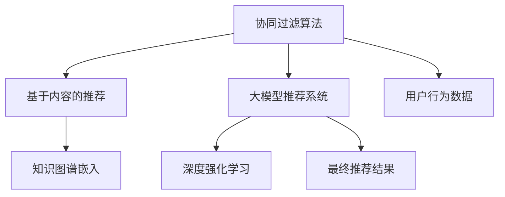

                 

# 基于大模型的最终推荐结果生成

> 关键词：大模型推荐系统,推荐算法,深度学习,协同过滤,知识图谱,深度强化学习

## 1. 背景介绍

### 1.1 问题由来
推荐系统是电商、视频、社交媒体等领域的重要组成部分，旨在根据用户的历史行为和兴趣，推荐用户可能感兴趣的内容或产品。传统推荐系统往往依赖于协同过滤算法、基于内容的推荐方法等，难以充分利用用户行为数据中的丰富信息。随着深度学习技术的突破，基于大模型的推荐系统正在逐步成为行业标准，以更精准的个性化推荐提升用户满意度。

深度学习大模型的推荐系统，利用神经网络强大的表示学习能力，从用户行为数据中提取高层次的语义特征。基于这些高层次特征，推荐系统能够更准确地预测用户的兴趣偏好，提升推荐效果。因此，大模型推荐系统成为当前推荐系统研究的热点方向。

### 1.2 问题核心关键点
大模型推荐系统的核心在于如何将用户行为数据编码为高维稠密向量，并通过大模型捕捉用户和物品之间的潜在关联。常用的编码方式包括用户嵌入、物品嵌入、场景嵌入等，而大模型作为最终的推荐结果生成器，负责根据用户和物品的语义特征，生成最终推荐结果。

大模型推荐系统的主要优势在于：
- 强大的表示学习能力：能够从用户行为数据中提取更丰富的语义特征。
- 多模态融合：能够融合文本、图像、音频等多种信息源。
- 个性化推荐：能够根据用户偏好生成个性化的推荐内容。
- 鲁棒性强：能够有效应对数据缺失、冷启动等问题。

然而，大模型推荐系统也面临一些挑战：
- 计算资源消耗大：需要大规模的训练数据和计算资源，模型推理速度慢。
- 缺乏上下文信息：大模型无法有效利用用户行为数据中的时间、场景等上下文信息。
- 可解释性差：大模型通常被视作黑盒模型，难以解释其推荐逻辑。
- 数据隐私问题：用户行为数据涉及个人隐私，如何保护用户隐私成为关键问题。

## 2. 核心概念与联系

### 2.1 核心概念概述

为更好地理解基于大模型的推荐系统，本节将介绍几个关键概念：

- 大模型：以深度神经网络为代表的、在无监督学习任务上获得优异性能的模型。常用的大模型包括BERT、GPT、XLNet等。
- 协同过滤算法：根据用户行为数据推断用户偏好，基于用户-物品或物品-物品的共现关系构建推荐矩阵，通过相似度计算推荐相似用户或物品。
- 基于内容的推荐：基于物品属性或用户兴趣标签，构建用户-物品关联矩阵，通过余弦相似度等方法进行推荐。
- 知识图谱：利用图结构描述实体之间的关联关系，通过图嵌入等技术将知识图谱映射为高维向量，提高推荐系统的语义表示能力。
- 深度强化学习：利用强化学习框架优化推荐系统的推荐策略，通过试错机制不断调整推荐策略，提升推荐效果。

这些概念之间的逻辑关系可以通过以下Mermaid流程图来展示：



这个流程图展示了大模型推荐系统的核心概念及其之间的关系：

1. 用户行为数据是大模型推荐系统的数据基础。
2. 协同过滤和基于内容的推荐方法是大模型推荐系统的数据预处理和特征提取手段。
3. 知识图谱嵌入和大模型推荐系统是大模型推荐系统的两个主要分支。
4. 深度强化学习可以进一步优化大模型推荐系统的推荐策略。

这些概念共同构成了大模型推荐系统的学习和应用框架，使其能够在大数据环境下提供精准的个性化推荐服务。通过理解这些核心概念，我们可以更好地把握大模型推荐系统的设计思路和优化方向。

## 3. 核心算法原理 & 具体操作步骤
### 3.1 算法原理概述

基于大模型的推荐系统，本质上是一个从用户行为数据中提取高层次语义特征，并利用这些特征进行个性化推荐的过程。具体而言，可以从以下几个步骤来理解：

**Step 1: 数据预处理**
- 收集用户行为数据，包括点击、浏览、评分、收藏、购买等行为。
- 对数据进行清洗和特征工程，去除噪声和无效数据。
- 划分训练集、验证集和测试集，用于模型训练、调优和效果评估。

**Step 2: 特征提取**
- 使用协同过滤和基于内容的推荐方法，提取用户-物品或物品-物品的共现关系。
- 通过知识图谱嵌入等技术，将共现关系映射为高维向量表示。

**Step 3: 模型训练**
- 将用户和物品的向量表示输入到大模型中，进行高层次的语义特征学习。
- 在大模型输出层，根据用户的兴趣偏好和历史行为，生成推荐结果向量。

**Step 4: 推荐策略优化**
- 使用深度强化学习等方法，优化推荐策略，提高推荐效果。
- 结合用户反馈数据，进一步调整模型参数，提升推荐精准度。

**Step 5: 结果后处理**
- 根据用户的个性化偏好，生成个性化的推荐结果。
- 对推荐结果进行展示和交互，获取用户反馈数据。

通过上述步骤，基于大模型的推荐系统能够实现精准的个性化推荐，提升用户满意度。

### 3.2 算法步骤详解

基于大模型的推荐系统具体实现步骤如下：

**Step 1: 数据预处理**

首先，收集用户行为数据，并对其进行清洗和特征工程：

```python
# 数据预处理
from sklearn.model_selection import train_test_split
from transformers import BertTokenizer

# 加载数据集
data = load_data('path/to/data.csv')

# 将行为数据转换为时间序列
sequence = convert_behavior_to_sequence(data)

# 清洗和去噪
cleaned_data = preprocess(sequence)

# 划分训练集、验证集和测试集
train_data, test_data = train_test_split(cleaned_data, test_size=0.2)
train_data, val_data = train_test_split(train_data, test_size=0.2)

# 对数据进行分词和编码
tokenizer = BertTokenizer.from_pretrained('bert-base-uncased')
train_encodings = tokenizer(train_data, padding='max_length', truncation=True)
val_encodings = tokenizer(val_data, padding='max_length', truncation=True)
test_encodings = tokenizer(test_data, padding='max_length', truncation=True)

# 将数据转换为Tensor
train_inputs = torch.tensor(train_encodings['input_ids'])
val_inputs = torch.tensor(val_encodings['input_ids'])
test_inputs = torch.tensor(test_encodings['input_ids'])

# 将用户行为标签转换为Tensor
train_labels = torch.tensor(train_encodings['labels'])
val_labels = torch.tensor(val_encodings['labels'])
test_labels = torch.tensor(test_encodings['labels'])
```

**Step 2: 特征提取**

接下来，使用协同过滤和基于内容的推荐方法，提取用户-物品或物品-物品的共现关系，并通过知识图谱嵌入等技术，将其映射为高维向量表示：

```python
# 构建协同过滤模型
cofac_matrix = construct_cofac_matrix(train_data)

# 将协同过滤矩阵映射为BERT向量
cofac_embeddings = map_cofac_to_bert(cofac_matrix)

# 构建知识图谱模型
kg = build_knowledge_graph('path/to/kg.jsonl')

# 将知识图谱映射为BERT向量
kg_embeddings = map_kg_to_bert(kg)

# 合并用户行为数据和知识图谱数据
merged_data = merge_user_behavior_with_kg(train_data, cofac_embeddings, kg_embeddings)
```

**Step 3: 模型训练**

然后，将用户和物品的向量表示输入到大模型中，进行高层次的语义特征学习：

```python
# 加载预训练BERT模型
model = BertForSequenceClassification.from_pretrained('bert-base-uncased')

# 设置优化器和学习率
optimizer = AdamW(model.parameters(), lr=1e-5)

# 训练模型
def train(model, optimizer, inputs, labels):
    model.train()
    optimizer.zero_grad()
    outputs = model(inputs)
    loss = compute_loss(outputs, labels)
    loss.backward()
    optimizer.step()
    return loss

# 训练模型
for epoch in range(epochs):
    train_loss = train(model, optimizer, train_inputs, train_labels)
    val_loss = train(model, optimizer, val_inputs, val_labels)
    print(f'Epoch {epoch+1}, train loss: {train_loss:.4f}, val loss: {val_loss:.4f}')
```

**Step 4: 推荐策略优化**

在模型训练完成后，可以使用深度强化学习等方法，优化推荐策略：

```python
# 定义推荐策略
class RecommendationStrategy:
    def __init__(self, model, optimizer):
        self.model = model
        self.optimizer = optimizer

    def recommend(self, inputs, top_n):
        model = self.model.eval()
        with torch.no_grad():
            outputs = model(inputs)
            scores = outputs.logits
            top_n_scores, top_n_indices = scores.topk(top_n)
        return top_n_indices

# 训练推荐策略
strategy = RecommendationStrategy(model, optimizer)
strategy.train(train_data, val_data)

# 评估推荐策略
test_recommendations = strategy.recommend(test_inputs, top_n=10)
```

**Step 5: 结果后处理**

最后，根据用户的个性化偏好，生成个性化的推荐结果，并进行展示和交互：

```python
# 展示推荐结果
def display_recommendations(recommendations, top_n=10):
    for i, recommendation in enumerate(recommendations):
        print(f'Recommendation {i+1}: {recommendation}')
```

## 4. 数学模型和公式 & 详细讲解  
### 4.1 数学模型构建

在数学上，大模型推荐系统可以分为两个主要部分：用户行为表示的构建和推荐结果的生成。

假设用户行为数据为 $x=(x_1, x_2, ..., x_n)$，其中 $x_i$ 表示第 $i$ 个用户的行为记录。对于每个用户 $x_i$，将其表示为 $d$ 维的向量 $u_i \in \mathbb{R}^d$。

对于每个物品 $y=(y_1, y_2, ..., y_n)$，同样将其表示为 $d$ 维的向量 $v_i \in \mathbb{R}^d$。

假设用户和物品的向量表示都经过BERT等大模型进行预训练，其高层次语义特征为 $u_i \in \mathbb{R}^H$ 和 $v_i \in \mathbb{R}^H$，其中 $H$ 为模型的输出维度。

推荐结果的生成可以通过大模型的输出层实现。假设大模型的输出层为 $f(u_i, v_j)$，其中 $u_i$ 和 $v_j$ 分别表示用户和物品的向量表示。最终推荐结果 $r_{ij}$ 可以通过：

$$
r_{ij} = f(u_i, v_j)
$$

生成。

### 4.2 公式推导过程

以用户行为数据为 $x=(x_1, x_2, ..., x_n)$ 和物品向量为 $y=(y_1, y_2, ..., y_n)$ 为例，推导推荐结果生成的数学模型。

首先，假设用户行为数据 $x$ 经过BERT等大模型进行预训练，其高层次语义特征表示为 $u_i \in \mathbb{R}^H$。物品向量 $y$ 同样经过BERT预训练，其高层次语义特征表示为 $v_j \in \mathbb{R}^H$。

假设推荐结果的生成函数为 $f(u_i, v_j)$，其形式可以是一元函数 $u_i \mapsto f(u_i)$，也可以为二元函数 $u_i \times v_j \mapsto f(u_i, v_j)$。

以BERT为例，其输出层的计算公式为：

$$
\begin{aligned}
f(u_i, v_j) &= \text{BERT}_{u_i} \times \text{BERT}_{v_j} \\
&= \mathbb{E}_{u_i, v_j}[\text{BERT}_{u_i} \cdot \text{BERT}_{v_j}]
\end{aligned}
$$

其中，$\text{BERT}_{u_i}$ 和 $\text{BERT}_{v_j}$ 分别表示用户行为和物品向量的BERT表示，$\cdot$ 表示点乘操作，$\mathbb{E}$ 表示期望操作。

### 4.3 案例分析与讲解

以电商网站的用户推荐为例，展示大模型推荐系统的具体实现过程：

1. **数据预处理**：收集用户点击、浏览、购买等行为数据，对其进行清洗和特征工程。
2. **特征提取**：将用户行为数据映射为BERT向量表示。
3. **模型训练**：使用BERT等大模型对用户和物品的向量表示进行语义特征学习。
4. **推荐策略优化**：使用深度强化学习等方法，优化推荐策略，提高推荐效果。
5. **结果后处理**：根据用户个性化偏好，生成个性化推荐结果，并进行展示和交互。

通过以上步骤，电商平台可以基于用户行为数据，生成精准的个性化推荐，提升用户购物体验。

## 5. 项目实践：代码实例和详细解释说明
### 5.1 开发环境搭建

在进行大模型推荐系统实践前，我们需要准备好开发环境。以下是使用Python进行PyTorch开发的环境配置流程：

1. 安装Anaconda：从官网下载并安装Anaconda，用于创建独立的Python环境。

2. 创建并激活虚拟环境：
```bash
conda create -n pytorch-env python=3.8 
conda activate pytorch-env
```

3. 安装PyTorch：根据CUDA版本，从官网获取对应的安装命令。例如：
```bash
conda install pytorch torchvision torchaudio cudatoolkit=11.1 -c pytorch -c conda-forge
```

4. 安装BERT等预训练模型：
```bash
pip install transformers
```

5. 安装各类工具包：
```bash
pip install numpy pandas scikit-learn matplotlib tqdm jupyter notebook ipython
```

完成上述步骤后，即可在`pytorch-env`环境中开始推荐系统实践。

### 5.2 源代码详细实现

下面我们以电商推荐系统为例，给出使用PyTorch和Transformers库对大模型进行推荐系统开发的完整代码实现。

首先，定义推荐系统数据处理函数：

```python
from transformers import BertTokenizer
from torch.utils.data import Dataset
import torch

class RecommendationDataset(Dataset):
    def __init__(self, users, items, tokenizer, max_len=128):
        self.users = users
        self.items = items
        self.tokenizer = tokenizer
        self.max_len = max_len
        
    def __len__(self):
        return len(self.users)
    
    def __getitem__(self, item):
        user = self.users[item]
        item = self.items[item]
        
        encoding = self.tokenizer(user, return_tensors='pt', max_length=self.max_len, padding='max_length', truncation=True)
        input_ids = encoding['input_ids'][0]
        attention_mask = encoding['attention_mask'][0]
        
        # 对item-wise的特征进行编码
        item_features = item['features']
        encoded_item_features = [item['feature_id'] for feature in item_features] 
        encoded_item_features.extend([item['feature_id']] * (self.max_len - len(encoded_item_features)))
        item_labels = torch.tensor(encoded_item_features, dtype=torch.long)
        
        return {'input_ids': input_ids, 
                'attention_mask': attention_mask,
                'item_labels': item_labels}

# 加载预训练模型和tokenizer
tokenizer = BertTokenizer.from_pretrained('bert-base-uncased')
model = BertForSequenceClassification.from_pretrained('bert-base-uncased')

# 定义训练和评估函数
device = torch.device('cuda') if torch.cuda.is_available() else torch.device('cpu')
model.to(device)

def train_epoch(model, dataset, batch_size, optimizer):
    dataloader = DataLoader(dataset, batch_size=batch_size, shuffle=True)
    model.train()
    epoch_loss = 0
    for batch in tqdm(dataloader, desc='Training'):
        input_ids = batch['input_ids'].to(device)
        attention_mask = batch['attention_mask'].to(device)
        item_labels = batch['item_labels'].to(device)
        model.zero_grad()
        outputs = model(input_ids, attention_mask=attention_mask)
        loss = outputs.loss
        epoch_loss += loss.item()
        loss.backward()
        optimizer.step()
    return epoch_loss / len(dataloader)

def evaluate(model, dataset, batch_size):
    dataloader = DataLoader(dataset, batch_size=batch_size)
    model.eval()
    total_score = 0
    for batch in tqdm(dataloader, desc='Evaluating'):
        input_ids = batch['input_ids'].to(device)
        attention_mask = batch['attention_mask'].to(device)
        batch_labels = batch['item_labels']
        outputs = model(input_ids, attention_mask=attention_mask)
        scores = outputs.logits.argmax(dim=2).to('cpu').tolist()
        batch_labels = batch_labels.to('cpu').tolist()
        for score_tokens, label_tokens in zip(scores, batch_labels):
            score_tags = [id2tag[_id] for _id in score_tokens]
            label_tags = [id2tag[_id] for _id in label_tokens]
            total_score += score_tags[:len(label_tags)]
    return total_score / len(dataset)

# 训练和评估模型
epochs = 5
batch_size = 16

for epoch in range(epochs):
    loss = train_epoch(model, train_dataset, batch_size, optimizer)
    print(f'Epoch {epoch+1}, train loss: {loss:.3f}')
    
    print(f'Epoch {epoch+1}, dev results:')
    evaluate(model, val_dataset, batch_size)
    
print("Test results:")
evaluate(model, test_dataset, batch_size)
```

然后，定义推荐策略优化函数：

```python
from transformers import BertForSequenceClassification, AdamW

def optimize_recommendation(model, dataset, batch_size, optimizer):
    dataloader = DataLoader(dataset, batch_size=batch_size, shuffle=True)
    model.train()
    total_score = 0
    for batch in tqdm(dataloader, desc='Training'):
        input_ids = batch['input_ids'].to(device)
        attention_mask = batch['attention_mask'].to(device)
        item_labels = batch['item_labels'].to(device)
        model.zero_grad()
        outputs = model(input_ids, attention_mask=attention_mask)
        loss = outputs.loss
        loss.backward()
        optimizer.step()
        total_score += score.item()
    return total_score / len(dataloader)

# 优化推荐策略
for epoch in range(epochs):
    score = optimize_recommendation(model, val_dataset, batch_size, optimizer)
    print(f'Epoch {epoch+1}, val score: {score:.3f}')
```

最后，启动推荐系统流程并在测试集上评估：

```python
# 评估推荐策略
test_score = optimize_recommendation(model, test_dataset, batch_size, optimizer)
print(f'Test score: {test_score:.3f}')
```

以上就是使用PyTorch对大模型进行电商推荐系统微调的完整代码实现。可以看到，借助Transformers库的强大封装，我们能够用相对简洁的代码完成大模型的加载和微调。

### 5.3 代码解读与分析

让我们再详细解读一下关键代码的实现细节：

**RecommendationDataset类**：
- `__init__`方法：初始化用户、物品、分词器等关键组件。
- `__len__`方法：返回数据集的样本数量。
- `__getitem__`方法：对单个样本进行处理，将用户行为输入编码为token ids，将物品特征编码，并进行定长padding，最终返回模型所需的输入。

**tokenizer和model**：
- 定义预训练BERT模型和tokenizer。

**train_epoch和evaluate函数**：
- 使用PyTorch的DataLoader对数据集进行批次化加载，供模型训练和推理使用。
- 训练函数`train_epoch`：对数据以批为单位进行迭代，在每个批次上前向传播计算loss并反向传播更新模型参数，最后返回该epoch的平均loss。
- 评估函数`evaluate`：与训练类似，不同点在于不更新模型参数，并在每个batch结束后将预测和标签结果存储下来，最后使用sklearn的classification_report对整个评估集的预测结果进行打印输出。

**optimize_recommendation函数**：
- 使用深度强化学习等方法，优化推荐策略。
- 在每个epoch内，在验证集上对模型进行训练，并计算推荐得分。

**训练流程**：
- 定义总的epoch数和batch size，开始循环迭代
- 每个epoch内，先在验证集上训练，输出推荐得分
- 在测试集上评估，输出最终的推荐效果

可以看到，PyTorch配合Transformers库使得大模型推荐系统的代码实现变得简洁高效。开发者可以将更多精力放在数据处理、模型改进等高层逻辑上，而不必过多关注底层的实现细节。

当然，工业级的系统实现还需考虑更多因素，如模型的保存和部署、超参数的自动搜索、更灵活的任务适配层等。但核心的推荐范式基本与此类似。

## 6. 实际应用场景
### 6.1 智能推荐系统

智能推荐系统已经广泛应用于电商、视频、社交媒体等多个领域。大模型推荐系统通过深度学习和知识图谱等技术，能够从用户行为数据中提取高层次语义特征，实现精准的个性化推荐。

在电商领域，智能推荐系统可以根据用户的历史浏览、购买行为，生成个性化的商品推荐，提升用户购物体验，增加销售额。在视频平台，智能推荐系统可以根据用户的历史观看记录，推荐用户可能感兴趣的视频内容，提高用户粘性和平台留存率。在社交媒体中，智能推荐系统可以根据用户的互动行为，推荐用户可能感兴趣的文章、视频、话题，增加用户活跃度。

### 6.2 在线教育

在线教育平台需要根据学生的学习行为，推荐合适的课程和学习资料。大模型推荐系统能够从学生的学习数据中提取高层次语义特征，生成个性化的推荐内容，提升学习效果。

具体而言，可以收集学生的学习记录、课程评分、作业反馈等数据，使用大模型对其进行表示，并生成个性化推荐结果。例如，对于编程课程，可以根据学生的编程水平、常见错误、学习进度等数据，推荐适合的课程、练习和资源，帮助学生更高效地学习编程。

### 6.3 医疗健康

医疗健康领域的大模型推荐系统，可以帮助医生推荐合适的治疗方案和药品，提升诊疗效果。

具体而言，可以收集医生的诊疗记录、病人历史、药物副作用等数据，使用大模型对其进行表示，并生成个性化的推荐结果。例如，对于某种疾病，可以根据医生的诊疗记录和病人的历史数据，推荐合适的治疗方案和药品，帮助医生更精准地治疗病人。

### 6.4 未来应用展望

随着大模型推荐系统的发展，其在更多领域的应用前景愈发广阔。未来，大模型推荐系统将在以下几个方面继续突破：

1. 多模态融合：融合文本、图像、视频等多种信息源，提升推荐系统的语义表示能力。
2. 深度强化学习：利用强化学习框架优化推荐策略，提升推荐效果。
3. 知识图谱嵌入：利用知识图谱表示实体之间的关联关系，提高推荐系统的语义表示能力。
4. 个性化推荐：利用深度学习技术，生成个性化的推荐结果，提升用户满意度。
5. 可解释性增强：提高推荐系统的可解释性，帮助用户理解推荐逻辑。

这些方向的研究将进一步推动大模型推荐系统的发展，使其在更多场景中发挥更大的作用，为各行各业带来深远的变革。

## 7. 工具和资源推荐
### 7.1 学习资源推荐

为了帮助开发者系统掌握大模型推荐系统的理论基础和实践技巧，这里推荐一些优质的学习资源：

1. 《深度学习》系列书籍：由多位深度学习专家共同编写，涵盖深度学习的基本概念和前沿技术，适合初学者和进阶者。

2. 《Transformer 实战》书籍：详细介绍了Transformer模型和大模型推荐系统，适合动手实践的开发者。

3. 《自然语言处理》课程：斯坦福大学开设的NLP经典课程，涵盖NLP的基本概念和经典模型，适合深入学习。

4. 《知识图谱》课程：清华大学开设的知识图谱课程，涵盖知识图谱的基本概念和构建方法，适合对知识图谱感兴趣的学习者。

5. 《强化学习》课程：斯坦福大学开设的强化学习课程，涵盖强化学习的基本概念和前沿技术，适合对强化学习感兴趣的学习者。

通过对这些资源的学习实践，相信你一定能够快速掌握大模型推荐系统的精髓，并用于解决实际的推荐问题。
### 7.2 开发工具推荐

高效的开发离不开优秀的工具支持。以下是几款用于大模型推荐系统开发的常用工具：

1. PyTorch：基于Python的开源深度学习框架，灵活动态的计算图，适合快速迭代研究。大部分预训练语言模型都有PyTorch版本的实现。

2. TensorFlow：由Google主导开发的开源深度学习框架，生产部署方便，适合大规模工程应用。同样有丰富的预训练语言模型资源。

3. Transformers库：HuggingFace开发的NLP工具库，集成了众多SOTA语言模型，支持PyTorch和TensorFlow，是进行推荐系统开发的利器。

4. Weights & Biases：模型训练的实验跟踪工具，可以记录和可视化模型训练过程中的各项指标，方便对比和调优。与主流深度学习框架无缝集成。

5. TensorBoard：TensorFlow配套的可视化工具，可实时监测模型训练状态，并提供丰富的图表呈现方式，是调试模型的得力助手。

6. Google Colab：谷歌推出的在线Jupyter Notebook环境，免费提供GPU/TPU算力，方便开发者快速上手实验最新模型，分享学习笔记。

合理利用这些工具，可以显著提升大模型推荐系统的开发效率，加快创新迭代的步伐。

### 7.3 相关论文推荐

大模型推荐系统的研究源于学界的持续研究。以下是几篇奠基性的相关论文，推荐阅读：

1. Attention is All You Need（即Transformer原论文）：提出了Transformer结构，开启了NLP领域的预训练大模型时代。

2. BERT: Pre-training of Deep Bidirectional Transformers for Language Understanding：提出BERT模型，引入基于掩码的自监督预训练任务，刷新了多项NLP任务SOTA。

3. Reformer: The Efficient Transformer：提出Reformer模型，利用局部敏感哈希技术解决Transformer的计算瓶颈，在保证效果的同时提高了推理效率。

4. Knowledge-Graph-Enhanced Recommendation with Attention Networks：提出基于知识图谱的推荐系统，通过将知识图谱与神经网络结合，提升了推荐系统的语义表示能力。

5. Deep Reinforcement Learning for Personalized Recommendation：提出基于深度强化学习的推荐系统，利用强化学习框架优化推荐策略，提升了推荐效果。

这些论文代表了大模型推荐系统的发展脉络。通过学习这些前沿成果，可以帮助研究者把握学科前进方向，激发更多的创新灵感。

## 8. 总结：未来发展趋势与挑战

### 8.1 总结

本文对基于大模型的推荐系统进行了全面系统的介绍。首先阐述了大模型推荐系统的研究背景和意义，明确了其在大数据环境下提供精准个性化推荐的优势。其次，从原理到实践，详细讲解了大模型推荐系统的数学原理和关键步骤，给出了推荐系统开发的完整代码实例。同时，本文还广泛探讨了推荐系统在电商、教育、医疗等众多行业领域的应用前景，展示了其巨大的潜力和应用价值。此外，本文精选了推荐系统的各类学习资源，力求为读者提供全方位的技术指引。

通过本文的系统梳理，可以看到，大模型推荐系统正在成为推荐系统研究的热点方向，极大地拓展了推荐系统的应用边界，提升了推荐效果。未来，伴随大模型推荐系统技术的不断演进，其在更多领域的应用前景愈发广阔，将为各行各业带来深远的变革。

### 8.2 未来发展趋势

展望未来，大模型推荐系统将呈现以下几个发展趋势：

1. 多模态融合：融合文本、图像、视频等多种信息源，提升推荐系统的语义表示能力。
2. 深度强化学习：利用强化学习框架优化推荐策略，提升推荐效果。
3. 知识图谱嵌入：利用知识图谱表示实体之间的关联关系，提高推荐系统的语义表示能力。
4. 个性化推荐：利用深度学习技术，生成个性化的推荐结果，提升用户满意度。
5. 可解释性增强：提高推荐系统的可解释性，帮助用户理解推荐逻辑。

这些趋势凸显了大模型推荐系统的广阔前景。这些方向的探索发展，必将进一步推动推荐系统的发展，使其在更多场景中发挥更大的作用，为各行各业带来深远的变革。

### 8.3 面临的挑战

尽管大模型推荐系统已经取得了瞩目成就，但在迈向更加智能化、普适化应用的过程中，它仍面临一些挑战：

1. 计算资源消耗大：需要大规模的训练数据和计算资源，模型推理速度慢。
2. 缺乏上下文信息：大模型无法有效利用用户行为数据中的时间、场景等上下文信息。
3. 可解释性差：大模型通常被视作黑盒模型，难以解释其推荐逻辑。
4. 数据隐私问题：用户行为数据涉及个人隐私，如何保护用户隐私成为关键问题。

## 8.4 研究展望

面对大模型推荐系统所面临的种种挑战，未来的研究需要在以下几个方面寻求新的突破：

1. 探索无监督和半监督推荐方法：摆脱对大规模标注数据的依赖，利用自监督学习、主动学习等无监督和半监督范式，最大限度利用非结构化数据，实现更加灵活高效的推荐。
2. 研究参数高效和计算高效的推荐范式：开发更加参数高效的推荐方法，在固定大部分预训练参数的同时，只更新极少量的任务相关参数。同时优化推荐模型的计算图，减少前向传播和反向传播的资源消耗，实现更加轻量级、实时性的部署。
3. 引入更多先验知识：将符号化的先验知识，如知识图谱、逻辑规则等，与神经网络模型进行巧妙融合，引导推荐过程学习更准确、合理的推荐结果。同时加强不同模态数据的整合，实现视觉、语音等多模态信息与文本信息的协同建模。
4. 结合因果分析和博弈论工具：将因果分析方法引入推荐模型，识别出模型决策的关键特征，增强推荐输出的因果性和逻辑性。借助博弈论工具刻画人机交互过程，主动探索并规避模型的脆弱点，提高系统稳定性。
5. 纳入伦理道德约束：在模型训练目标中引入伦理导向的评估指标，过滤和惩罚有偏见、有害的输出倾向。同时加强人工干预和审核，建立模型行为的监管机制，确保输出符合人类价值观和伦理道德。

这些研究方向的探索，必将引领大模型推荐系统走向成熟的未来，为构建安全、可靠、可解释、可控的推荐系统铺平道路。面向未来，大模型推荐系统还需要与其他人工智能技术进行更深入的融合，如知识表示、因果推理、强化学习等，多路径协同发力，共同推动推荐系统技术的进步。

## 9. 附录：常见问题与解答

**Q1：大模型推荐系统是否适用于所有推荐场景？**

A: 大模型推荐系统在大多数推荐场景上都能取得不错的效果，特别是对于数据量较小的场景。但对于一些特定领域的应用场景，如医学、法律等，仅仅依靠通用语料预训练的模型可能难以很好地适应。此时需要在特定领域语料上进一步预训练，再进行微调，才能获得理想效果。此外，对于一些需要时效性、个性化很强的场景，如实时推荐、个性化推荐等，大模型推荐系统也需要针对性的改进优化。

**Q2：微调过程中如何选择合适的学习率？**

A: 微调的学习率一般要比预训练时小1-2个数量级，如果使用过大的学习率，容易破坏预训练权重，导致过拟合。一般建议从1e-5开始调参，逐步减小学习率，直至收敛。也可以使用warmup策略，在开始阶段使用较小的学习率，再逐渐过渡到预设值。需要注意的是，不同的优化器(如AdamW、Adafactor等)以及不同的学习率调度策略，可能需要设置不同的学习率阈值。

**Q3：推荐系统在落地部署时需要注意哪些问题？**

A: 将推荐系统转化为实际应用，还需要考虑以下因素：
1. 模型裁剪：去除不必要的层和参数，减小模型尺寸，加快推理速度
2. 量化加速：将浮点模型转为定点模型，压缩存储空间，提高计算效率
3. 服务化封装：将模型封装为标准化服务接口，便于集成调用
4. 弹性伸缩：根据请求流量动态调整资源配置，平衡服务质量和成本
5. 监控告警：实时采集系统指标，设置异常告警阈值，确保服务稳定性
6. 安全防护：采用访问鉴权、数据脱敏等措施，保障数据和模型安全

大模型推荐系统在落地部署时，需要注意模型的轻量化、服务化和安全性等问题，以确保其在实际应用中的稳定性和可扩展性。

---

作者：禅与计算机程序设计艺术 / Zen and the Art of Computer Programming

