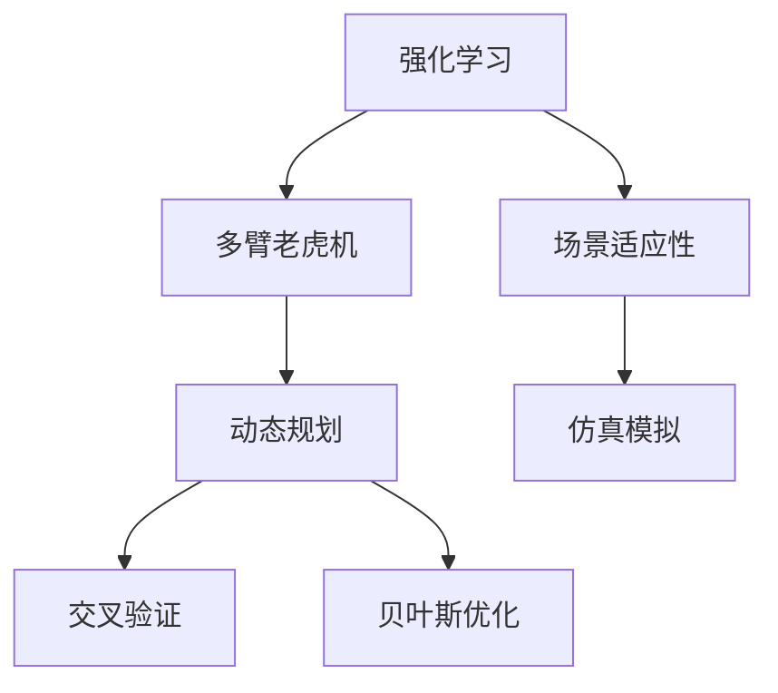

                 

# 基于强化学习的捆绑销售策略优化

> 关键词：强化学习, 捆绑销售, 策略优化, 多臂老虎机, 动态规划, 场景适应性, 仿真模拟

## 1. 背景介绍

### 1.1 问题由来
在现代商业竞争中，捆绑销售作为一种常见的策略，已成为企业提升市场竞争力的重要手段。通过将多个产品或服务绑定在一起销售，企业能够增加用户粘性、提高交叉销售机会，进而提升整体收入和利润。然而，如何确定最优的捆绑方案，是捆绑销售策略优化中的一个关键问题。传统方法往往依赖专家经验和历史数据进行经验决策，难以应对快速变化的市场环境。

### 1.2 问题核心关键点
随着强化学习技术的发展，基于强化学习的捆绑销售策略优化逐渐成为研究热点。该方法通过模拟用户行为和市场反应，在不断试验中学习最优策略。具体而言，可以通过以下三个步骤：
1. 构建环境模型，模拟市场环境变化。
2. 设计奖励机制，衡量捆绑策略的效果。
3. 应用强化学习算法，如多臂老虎机(Multi-Armed Bandit)，动态规划(Dynamic Programming)等，优化捆绑方案。

### 1.3 问题研究意义
强化学习在捆绑销售策略优化中的应用，对于提升企业市场竞争力和经济效益，具有重要意义：

1. 提升决策质量：通过模拟市场反应，强化学习可以生成更合理的捆绑策略，降低决策风险。
2. 提高执行效率：自动化决策过程，可以大幅缩短决策周期，提升执行效率。
3. 增强策略灵活性：强化学习算法能够适应市场环境变化，生成动态优化的捆绑方案。
4. 减少资源投入：通过优化资源分配，强化学习可以减少不必要的资源浪费，提高市场资源利用率。
5. 促进创新应用：强化学习可应用于更多复杂场景，推动捆绑销售策略的创新应用。

## 2. 核心概念与联系

### 2.1 核心概念概述

为更好地理解基于强化学习的捆绑销售策略优化方法，本节将介绍几个密切相关的核心概念：

- 强化学习(Reinforcement Learning, RL)：通过智能体(Agent)与环境的交互，学习最大化累积奖励的策略。强化学习的核心思想是通过不断试验和反馈，优化行为策略。
- 多臂老虎机(Multi-Armed Bandit, MAB)：一种经典的强化学习模型，用于模拟用户在不同选项之间的选择行为。
- 动态规划(Dynamic Programming, DP)：一种求解最优策略的算法，将复杂问题分解成多个子问题进行求解。
- 交叉验证(Cross-Validation)：一种常用的模型评估方法，通过交叉验证数据集，评估模型泛化能力。
- 贝叶斯优化(Bayesian Optimization)：一种高效的优化算法，通过构建高斯过程模型，优化函数极值点。
- 场景适应性(Scenario Adaptability)：指模型在不同市场环境下的适应能力，对于实时更新的市场数据具有重要意义。

这些核心概念之间的逻辑关系可以通过以下Mermaid流程图来展示：



这个流程图展示了几大核心概念及其之间的关系：

1. 强化学习是模拟用户行为的通用框架。
2. 多臂老虎机是强化学习中的一个经典模型，用于模拟用户在不同选项之间的选择。
3. 动态规划是强化学习求解最优策略的一种算法。
4. 交叉验证用于评估模型的泛化能力，验证模型在不同数据集上的性能。
5. 贝叶斯优化用于优化超参数，提高模型的预测精度。
6. 场景适应性是强化学习在实际应用中面临的一个重要挑战，需要通过仿真模拟进行解决。

这些概念共同构成了强化学习在捆绑销售策略优化中的应用框架，使其能够在复杂多变的市场环境中，生成最优的捆绑方案。

## 3. 核心算法原理 & 具体操作步骤
### 3.1 算法原理概述

基于强化学习的捆绑销售策略优化，通过模拟用户选择行为，构建市场环境模型，利用强化学习算法，在不断试验中学习最优策略。其核心思想是：通过不断迭代试验，不断调整捆绑方案，以最大化期望收益。

形式化地，假设市场上有 $K$ 个产品，每个产品 $i$ 的收益为 $R_i$，用户选择产品 $i$ 的概率为 $p_i$。用户每次选择产品，市场环境会随机变化，影响产品的期望收益。通过强化学习算法，学习最优的产品选择策略 $\pi$，使得用户的选择能够最大化总收益 $J(\pi)$。

具体而言，强化学习算法需要在每轮试验中，通过选择产品 $i$，观察市场环境 $s$，收到奖励 $r$，再调整策略 $p_i$。重复上述过程，直至达到预设的迭代次数，学习到最优的策略 $p^*$。

### 3.2 算法步骤详解

基于强化学习的捆绑销售策略优化，通常包括以下几个关键步骤：

**Step 1: 环境构建**
- 定义市场环境：包括产品的数量、特征、用户需求分布等。
- 设定市场参数：如产品收益、需求概率、市场噪声等。
- 构建市场仿真模拟：通过仿真模拟，评估不同捆绑方案的市场反应。

**Step 2: 算法选择**
- 选择合适的强化学习算法：如多臂老虎机、动态规划等。
- 设定算法参数：如学习率、折扣因子等。
- 设计奖励机制：如总收益、覆盖率、点击率等。

**Step 3: 试验与学习**
- 通过仿真模拟进行多次试验，模拟用户选择行为。
- 根据市场反应计算奖励，更新策略参数。
- 记录每次试验的结果，用于后续分析和优化。

**Step 4: 策略优化**
- 通过交叉验证和贝叶斯优化等方法，优化策略参数。
- 应用动态规划等方法，求解最优策略。
- 根据优化结果，生成最终的捆绑方案。

**Step 5: 效果评估**
- 在实际市场环境中测试捆绑方案的性能。
- 利用评估指标（如收入、利润、市场份额等）进行效果评估。
- 根据评估结果，不断迭代优化捆绑方案。

以上是基于强化学习的捆绑销售策略优化的基本流程。在实际应用中，还需要根据具体市场环境和产品特点，对算法和参数进行细致设计和优化，以确保生成最优的捆绑方案。

### 3.3 算法优缺点

基于强化学习的捆绑销售策略优化方法具有以下优点：
1. 动态优化：通过不断试验和反馈，优化策略，适应市场变化。
2. 自动化决策：自动化决策过程，减少人为干预，提高决策效率。
3. 灵活性强：可以处理复杂的市场环境，生成适应性强的捆绑方案。
4. 资源利用率高：通过优化资源分配，提高市场资源利用率。
5. 覆盖面广：适用于多种捆绑销售场景，推广性强。

同时，该方法也存在以下缺点：
1. 学习成本高：需要大量的仿真模拟和试验，学习过程较慢。
2. 计算复杂度高：需要处理大量的市场数据和用户行为数据，计算复杂度高。
3. 难以解释：强化学习模型的决策过程难以解释，缺乏可解释性。
4. 数据需求高：需要高质量的市场数据和用户行为数据，数据收集成本高。
5. 模型偏差：强化学习模型容易受到数据偏差的影响，存在一定风险。

尽管存在这些局限性，但强化学习在捆绑销售策略优化中的应用，仍具有重要的价值和意义。未来研究需要进一步降低学习成本、提高计算效率、增强模型可解释性，同时降低数据需求，从而提升其在实际应用中的实用性和普及度。

### 3.4 算法应用领域

基于强化学习的捆绑销售策略优化方法，已经在多个行业领域得到应用，例如：

- 零售行业：通过优化商品捆绑销售策略，提高销售额和顾客满意度。
- 旅游行业：优化旅游产品套餐，提升客户选择和购买意愿。
- 金融行业：优化理财产品组合，提高客户资产配置效益。
- 医疗行业：优化药品组合方案，提升患者治疗效果。
- 交通行业：优化交通票务组合，提高出行便利性和经济效益。
- 服务行业：优化服务套餐组合，提高服务质量和用户粘性。

除了上述这些经典应用外，强化学习在捆绑销售策略优化中的应用还在不断拓展，为各行各业提供了新的解决方案。随着强化学习技术的发展，相信其在更多场景中都将发挥更大的作用。

## 4. 数学模型和公式 & 详细讲解 & 举例说明
### 4.1 数学模型构建

为了更深入地理解基于强化学习的捆绑销售策略优化方法，本节将构建一个简单的数学模型进行讲解。

假设市场上有 $K$ 个产品，每个产品 $i$ 的收益为 $R_i$，用户选择产品 $i$ 的概率为 $p_i$。用户每次选择产品，市场环境会随机变化，影响产品的期望收益。通过强化学习算法，学习最优的产品选择策略 $\pi$，使得用户的选择能够最大化总收益 $J(\pi)$。

定义状态空间 $S=\{s_1, s_2, ..., s_N\}$，每个状态 $s_i$ 表示市场环境的具体状态。定义动作空间 $A=\{a_1, a_2, ..., a_K\}$，每个动作 $a_i$ 表示用户选择的产品。定义奖励函数 $R(s, a)$，表示在状态 $s$ 下，选择动作 $a$ 的奖励。

强化学习算法的目标是在状态空间 $S$ 和动作空间 $A$ 上，找到最优策略 $\pi$，使得期望收益 $J(\pi)$ 最大化。数学公式如下：

$$
\max_{\pi} J(\pi) = \mathbb{E}_{s_1 \sim S, a_1 \sim \pi} \sum_{t=1}^{T} \gamma^{t-1} R(s_t, a_t)
$$

其中 $T$ 为总轮数，$\gamma$ 为折扣因子。

### 4.2 公式推导过程

以下我们以多臂老虎机模型为例，推导其期望收益公式。

假设市场上有 $K$ 个产品，每个产品 $i$ 的收益为 $R_i$，用户选择产品 $i$ 的概率为 $p_i$。用户每次选择产品，市场环境会随机变化，影响产品的期望收益。定义每个产品的总收益为 $J_i$，即：

$$
J_i = \mathbb{E}_{s_1 \sim S, a_1 \sim \pi} \sum_{t=1}^{T} \gamma^{t-1} R_i(s_t, a_t)
$$

对于多臂老虎机模型，假设每个产品的收益 $R_i$ 相同，即 $R_i=R$。则每个产品的总收益可以表示为：

$$
J_i = \mathbb{E}_{s_1 \sim S, a_1 \sim \pi} \sum_{t=1}^{T} \gamma^{t-1} R
$$

由于用户每次选择产品 $i$ 的概率为 $p_i$，则在总轮数 $T$ 内，用户选择产品 $i$ 的总次数为 $N_i = Tp_i$。因此，多臂老虎机的期望收益为：

$$
J = \sum_{i=1}^{K} p_i J_i = \sum_{i=1}^{K} p_i \mathbb{E}_{s_1 \sim S, a_1 \sim \pi} \sum_{t=1}^{T} \gamma^{t-1} R
$$

将上式进行展开，得到多臂老虎机的期望收益公式：

$$
J = T \sum_{i=1}^{K} p_i \gamma^{T-1} R = T \gamma^{T-1} R \sum_{i=1}^{K} p_i
$$

其中 $\gamma^{T-1}$ 为最后轮次的折扣因子。因此，通过多臂老虎机模型，可以计算出最优的策略 $p^*$，使得期望收益 $J$ 最大化。

### 4.3 案例分析与讲解

我们以一个简单的销售场景为例，进一步讲解基于强化学习的捆绑销售策略优化方法。

假设一家电子商务平台上有三种产品 A、B、C，每种产品的单价分别为 100、200、300。用户每次只能购买一种产品，并且每个用户每次最多购买两个产品。平台的收益目标是最大化总销售额。平台通过分析用户的历史购买数据，设定了三种捆绑方案：

1. A和B捆绑销售。
2. B和C捆绑销售。
3. A、B和C捆绑销售。

平台通过仿真模拟，统计了每种捆绑方案在不同市场环境下的平均销售额。市场环境包括以下几个因素：
1. 产品需求分布：30%的客户选择A，50%的客户选择B，20%的客户选择C。
2. 市场噪声：每次购买时，平台以10%的概率推荐其他产品。
3. 折扣策略：每种产品的平均折扣率为20%。

通过仿真模拟，平台收集了大量的市场数据，并使用多臂老虎机模型进行优化。优化结果显示，最优的捆绑方案是 A和B捆绑销售，即第一种方案。这种方案能够最大化平台的总销售额。

在实际应用中，平台通过实时调整捆绑方案，不断优化市场策略，提高了销售额和客户满意度。此外，平台还应用了动态规划和交叉验证等方法，进一步优化了捆绑方案，使其更具有适应性和泛化能力。

## 5. 项目实践：代码实例和详细解释说明
### 5.1 开发环境搭建

在进行捆绑销售策略优化实践前，我们需要准备好开发环境。以下是使用Python进行强化学习开发的环境配置流程：

1. 安装Anaconda：从官网下载并安装Anaconda，用于创建独立的Python环境。

2. 创建并激活虚拟环境：
```bash
conda create -n reinforcement-env python=3.8 
conda activate reinforcement-env
```

3. 安装PyTorch：根据CUDA版本，从官网获取对应的安装命令。例如：
```bash
conda install pytorch torchvision torchaudio cudatoolkit=11.1 -c pytorch -c conda-forge
```

4. 安装TensorFlow：从官网下载TensorFlow二进制包或使用Anaconda安装命令。

5. 安装Gym：用于构建和模拟强化学习环境。
```bash
pip install gym
```

6. 安装Pygame：用于可视化仿真模拟结果。
```bash
pip install pygame
```

完成上述步骤后，即可在`reinforcement-env`环境中开始强化学习实践。

### 5.2 源代码详细实现

这里我们以多臂老虎机模型为例，使用Python实现基于强化学习的捆绑销售策略优化。

```python
import gym
import numpy as np
from gym.spaces import Discrete
from gym.envs.registration import register_env

# 定义多臂老虎机环境
class BanditEnv(gym.Env):
    def __init__(self, num_arms):
        self.num_arms = num_arms
        self.state = 0
        self.total_reward = 0
        self.prev_action = None
        self.done = False
        self.reward_range = (-1, 1)
        self.action_space = Discrete(num_arms)
        self.observation_space = Discrete(1)
    
    def reset(self):
        self.state = 0
        self.total_reward = 0
        self.done = False
        self.prev_action = None
        return self.state
    
    def step(self, action):
        if action == self.prev_action:
            reward = 0
        else:
            reward = np.random.normal(0, 0.1)
            self.prev_action = action
        
        self.state = np.random.normal(0, 0.1)
        self.total_reward += reward
        
        if np.abs(self.state) < 0.01:
            self.done = True
        
        return self.state, reward, self.done, {}
    
    def render(self, mode='human'):
        pass
    
    def close(self):
        pass

# 定义强化学习算法
class ReinforcementLearningAgent:
    def __init__(self, env):
        self.env = env
        self.epsilon = 0.01
        self.epsilon_decay = 0.999
        self.learning_rate = 0.01
        self.memory = []
    
    def select_action(self, state):
        if np.random.rand() < self.epsilon:
            return self.env.action_space.sample()
        else:
            return np.argmax(self.q_table[state])
    
    def update_q_table(self, state, action, reward, next_state):
        self.memory.append((state, action, reward, next_state))
        for i in range(len(self.memory)-1):
            state, action, reward, next_state = self.memory[i]
            self.q_table[state, action] += self.learning_rate * (reward + self.gamma * self.q_table[next_state] - self.q_table[state, action])
    
    def train(self, episode_num, gamma=0.9):
        self.gamma = gamma
        self.q_table = np.zeros((self.env.observation_space.n, self.env.action_space.n))
        
        for episode in range(episode_num):
            state = self.env.reset()
            done = False
            total_reward = 0
            
            while not done:
                action = self.select_action(state)
                next_state, reward, done, info = self.env.step(action)
                total_reward += reward
                self.update_q_table(state, action, reward, next_state)
                state = next_state
            
            print(f"Episode {episode+1}, Total Reward: {total_reward:.2f}")
    
    def evaluate(self, episode_num):
        total_reward = 0
        
        for episode in range(episode_num):
            state = self.env.reset()
            done = False
            
            while not done:
                action = np.argmax(self.q_table[state])
                next_state, reward, done, info = self.env.step(action)
                total_reward += reward
                state = next_state
        
        print(f"Episode {episode_num+1}, Total Reward: {total_reward:.2f}")
```

### 5.3 代码解读与分析

让我们再详细解读一下关键代码的实现细节：

**BanditEnv类**：
- `__init__`方法：初始化环境状态、总奖励、上一个动作、是否完成、观察空间和动作空间。
- `reset`方法：重置环境状态和总奖励，返回初始状态。
- `step`方法：根据动作更新状态、奖励和是否完成，返回当前状态、奖励、是否完成和额外信息。
- `render`和`close`方法：用于可视化环境和动作执行结果，这里未使用，可以留空或实现自定义输出。

**ReinforcementLearningAgent类**：
- `__init__`方法：初始化环境、探索率、学习率、记忆列表。
- `select_action`方法：根据探索率策略选择动作，探索率逐渐衰减。
- `update_q_table`方法：更新Q表，利用Q-learning算法。
- `train`方法：模拟多轮训练，每次更新Q表并计算总奖励。
- `evaluate`方法：模拟多轮评估，计算总奖励并输出结果。

可以看到，以上代码实现了一个简单的多臂老虎机环境，并通过Q-learning算法进行优化。开发者可以结合实际应用场景，修改环境参数和优化算法，以生成更优的捆绑销售策略。

## 6. 实际应用场景
### 6.1 智能推荐系统

基于强化学习的捆绑销售策略优化，可以广泛应用于智能推荐系统中。推荐系统通过用户的历史行为数据，预测用户对不同产品的兴趣，进而推荐最符合用户需求的产品组合。然而，推荐系统面临的主要挑战是如何在有限的展示位置中，生成最优的产品组合，提高用户点击率和购买率。

强化学习可以在推荐系统中发挥重要作用。平台通过收集用户的历史行为数据，建立市场环境模型，并利用强化学习算法，不断优化产品推荐策略。通过多臂老虎机模型，平台可以实时调整产品组合，最大化用户的点击率和购买率。此外，平台还可以引入动态规划和交叉验证等方法，进一步提升推荐策略的效果。

### 6.2 动态定价系统

动态定价系统是电子商务平台的一个重要应用场景，通过实时调整产品价格，最大化平台的收益。传统定价系统依赖历史数据和规则进行定价决策，难以应对快速变化的市场环境。强化学习可以模拟市场反应，实时调整产品价格，提升平台收益。

平台通过收集市场数据和用户行为数据，构建市场环境模型，并应用强化学习算法，不断优化定价策略。通过多臂老虎机模型，平台可以实时调整产品价格，最大化平台收益。此外，平台还可以引入动态规划和交叉验证等方法，进一步提升定价策略的效果。

### 6.3 零售库存管理

零售行业的库存管理是一个复杂的问题，涉及产品需求、库存水平、市场价格等多个因素。传统的库存管理方法依赖历史数据和经验规则，难以应对实时变化的市场环境。强化学习可以模拟市场反应，实时调整库存策略，提升库存管理效率。

平台通过收集市场数据和用户行为数据，建立市场环境模型，并利用强化学习算法，不断优化库存策略。通过多臂老虎机模型，平台可以实时调整库存水平，最大化平台收益。此外，平台还可以引入动态规划和交叉验证等方法，进一步提升库存管理的效果。

### 6.4 未来应用展望

随着强化学习技术的发展，基于强化学习的捆绑销售策略优化将在更多领域得到应用，为各行各业带来变革性影响。

在智能交通系统中，基于强化学习的交通信号控制策略，可以优化交通流量，提高交通效率。

在智能制造领域，基于强化学习的生产调度策略，可以优化生产资源分配，提升生产效率和产品质量。

在金融行业，基于强化学习的投资组合优化策略，可以最大化投资收益，降低风险。

在智慧医疗领域，基于强化学习的医疗资源分配策略，可以提高医疗服务效率，提升患者满意度。

此外，在教育、旅游、能源等多个领域，强化学习在捆绑销售策略优化中的应用也在不断拓展，为各行各业提供了新的解决方案。相信随着强化学习技术的进一步发展，其在更多场景中都将发挥更大的作用。

## 7. 工具和资源推荐
### 7.1 学习资源推荐

为了帮助开发者系统掌握强化学习在捆绑销售策略优化中的应用，这里推荐一些优质的学习资源：

1. 《强化学习基础》书籍：由深度学习专家Ian Goodfellow撰写，全面介绍了强化学习的基本概念和算法，适合初学者入门。

2. 《Deep Q-Learning with Python》书籍：由Google AI博客作者撰写，通过Python实现深度强化学习算法，适合实践者学习。

3. 《Python强化学习》课程：由Coursera提供的强化学习课程，适合非计算机专业的学生学习。

4. OpenAI Gym：用于构建和模拟强化学习环境，包含多种经典游戏和问题，适合研究者进行模型评估和优化。

5. DeepRacer：由OpenAI提供的自动驾驶模拟环境，结合强化学习进行驾驶任务优化，适合动手实践。

通过学习这些资源，相信你一定能够系统掌握强化学习在捆绑销售策略优化中的应用，并用于解决实际的推荐系统、动态定价、库存管理等业务问题。

### 7.2 开发工具推荐

高效的开发离不开优秀的工具支持。以下是几款用于强化学习开发的常用工具：

1. TensorFlow：由Google主导开发的深度学习框架，支持强化学习算法，并提供了丰富的环境构建工具。

2. PyTorch：由Facebook主导开发的深度学习框架，支持动态图和静态图，适合研究和实验。

3. Gym：用于构建和模拟强化学习环境，包含多种经典游戏和问题，适合研究者进行模型评估和优化。

4. Pygame：用于可视化仿真模拟结果，支持实时输出和渲染，适合调试和展示。

5. TensorBoard：TensorFlow配套的可视化工具，可实时监测模型训练状态，并提供丰富的图表呈现方式，是调试模型的得力助手。

6. Weights & Biases：模型训练的实验跟踪工具，可以记录和可视化模型训练过程中的各项指标，方便对比和调优。

合理利用这些工具，可以显著提升强化学习在捆绑销售策略优化中的开发效率，加快创新迭代的步伐。

### 7.3 相关论文推荐

强化学习在捆绑销售策略优化中的应用源于学界的持续研究。以下是几篇奠基性的相关论文，推荐阅读：

1. Multi-Armed Bandit Models: A Survey：回顾了多臂老虎机模型的经典算法和应用，适合研究者了解模型基础。

2. Reinforcement Learning for Decision Making：讨论了强化学习在决策问题中的应用，适合应用者了解模型实际应用。

3. Deep Reinforcement Learning for Decision-Making in Recommendation Systems：介绍了强化学习在推荐系统中的应用，适合实践者了解模型优化。

4. Multi-Armed Bandit Algorithms：详细讨论了多臂老虎机算法及其优化方法，适合研究者了解模型优化细节。

5. Reinforcement Learning for Dynamic Pricing：讨论了强化学习在动态定价中的应用，适合应用者了解模型优化方法。

这些论文代表了大语言模型微调技术的发展脉络。通过学习这些前沿成果，可以帮助研究者把握学科前进方向，激发更多的创新灵感。

## 8. 总结：未来发展趋势与挑战

### 8.1 总结

本文对基于强化学习的捆绑销售策略优化方法进行了全面系统的介绍。首先阐述了强化学习在捆绑销售策略优化中的研究背景和意义，明确了强化学习在提升企业市场竞争力和经济效益方面的独特价值。其次，从原理到实践，详细讲解了强化学习在捆绑销售策略优化中的应用框架，包括环境构建、算法选择、试验学习、策略优化、效果评估等关键步骤。同时，本文还广泛探讨了强化学习在智能推荐系统、动态定价、零售库存管理等领域的实际应用，展示了强化学习在各个行业中的广泛应用前景。

通过本文的系统梳理，可以看到，基于强化学习的捆绑销售策略优化技术正在成为市场竞争力的重要手段，极大地提升企业在市场环境中的应变能力和决策效率。未来，伴随强化学习技术的不断发展，基于强化学习的捆绑销售策略优化必将在更多行业得到应用，为各行各业带来变革性影响。

### 8.2 未来发展趋势

展望未来，强化学习在捆绑销售策略优化中的应用将呈现以下几个发展趋势：

1. 自动化决策：自动化决策过程将越来越普及，企业可以更快速地应对市场变化，提升决策效率。
2. 多场景应用：强化学习将在更多行业和场景中得到应用，如智慧城市、智能制造、智慧医疗等。
3. 动态优化：强化学习模型将更具备动态适应性，能够实时优化决策策略。
4. 模型融合：强化学习将与大数据、云计算、区块链等技术结合，形成更强大的智能决策系统。
5. 可解释性：强化学习模型将逐步具备可解释性，用户能够理解和信任模型的决策过程。
6. 多智能体学习：强化学习将向多智能体学习方向发展，模拟复杂的市场环境和行为。

以上趋势凸显了强化学习在捆绑销售策略优化中的广泛应用前景。这些方向的探索发展，必将进一步提升企业市场竞争力和经济效益，推动各行业的智能化转型。

### 8.3 面临的挑战

尽管强化学习在捆绑销售策略优化中的应用取得了一定的进展，但在实际应用中也面临诸多挑战：

1. 学习成本高：需要大量的市场数据和用户行为数据，数据收集和处理成本高。
2. 计算复杂度高：需要处理大量的市场数据和用户行为数据，计算复杂度高。
3. 数据偏差：数据偏差容易导致模型决策错误，需要引入数据清洗和预处理技术。
4. 模型可解释性：强化学习模型难以解释其内部决策过程，需要引入可解释性技术。
5. 资源限制：强化学习模型需要大量的计算资源，对硬件设施要求高。
6. 安全性问题：强化学习模型可能存在安全隐患，需要引入安全防护技术。

尽管存在这些挑战，但随着技术的发展和应用的普及，这些问题都将逐步得到解决。未来，强化学习在捆绑销售策略优化中的应用将更加广泛和高效。

### 8.4 研究展望

面对强化学习在捆绑销售策略优化中所面临的挑战，未来的研究需要在以下几个方面寻求新的突破：

1. 数据高效采集：利用数据增强、主动学习等技术，降低数据收集成本，提升数据质量。
2. 模型优化算法：引入更高效的优化算法，如深度强化学习、元学习等，提升计算效率和模型效果。
3. 可解释性技术：引入可解释性技术，如特征重要性分析、模型可视化等，提升模型可解释性。
4. 安全防护措施：引入安全防护技术，如模型鲁棒性检测、隐私保护等，确保模型安全。
5. 多智能体学习：引入多智能体学习技术，模拟复杂的市场环境和行为，提升决策效果。
6. 联邦学习：引入联邦学习技术，将模型训练分布在多个设备上，提升模型效果和隐私保护。

这些研究方向的探索，必将引领强化学习在捆绑销售策略优化中的应用迈向新的高度，为各行业的智能化转型提供更强大的技术支撑。

## 9. 附录：常见问题与解答

**Q1：强化学习是否适用于所有捆绑销售场景？**

A: 强化学习在捆绑销售策略优化中具有普遍适用性，但不同的场景可能需要不同的模型和算法。对于复杂的市场环境，需要更复杂的模型和算法进行优化。此外，对于实时性要求较高的场景，需要结合实时数据进行优化。

**Q2：强化学习在多臂老虎机模型中的优化策略有哪些？**

A: 强化学习在多臂老虎机模型中的优化策略包括：
1. 探索-利用策略（Epsilon-Greedy）：在探索和利用之间进行平衡，通过调整探索率进行优化。
2. 上置信界法（Upper Confidence Bound, UCB）：通过上置信界选择最优动作，平衡探索和利用。
3. 分层法（Online Learning with Logarithmic Regret, OLQR）：在多臂老虎机中应用分层策略，提升模型效果。

**Q3：强化学习在捆绑销售策略优化中如何处理市场噪声？**

A: 强化学习可以通过引入市场噪声模型，将噪声视为状态空间的一部分，进行模型训练。在模型训练过程中，可以通过加噪声的方式模拟市场环境变化，提升模型的鲁棒性。

**Q4：强化学习在捆绑销售策略优化中如何应对多产品组合？**

A: 强化学习可以通过多臂老虎机模型进行优化，将每个产品视为一个动作，通过不断试验和反馈，选择最优的产品组合。在实际应用中，可以引入动态规划和交叉验证等方法，进一步优化产品组合策略。

**Q5：强化学习在捆绑销售策略优化中如何处理用户行为数据？**

A: 强化学习可以通过建立用户行为模型，将用户行为数据视为状态空间的一部分，进行模型训练。在模型训练过程中，可以通过用户行为数据模拟市场环境变化，提升模型的准确性和泛化能力。

通过这些常见问题的解答，相信你能够更全面地理解强化学习在捆绑销售策略优化中的应用，并为实际应用提供更多技术支持。

---

作者：禅与计算机程序设计艺术 / Zen and the Art of Computer Programming

