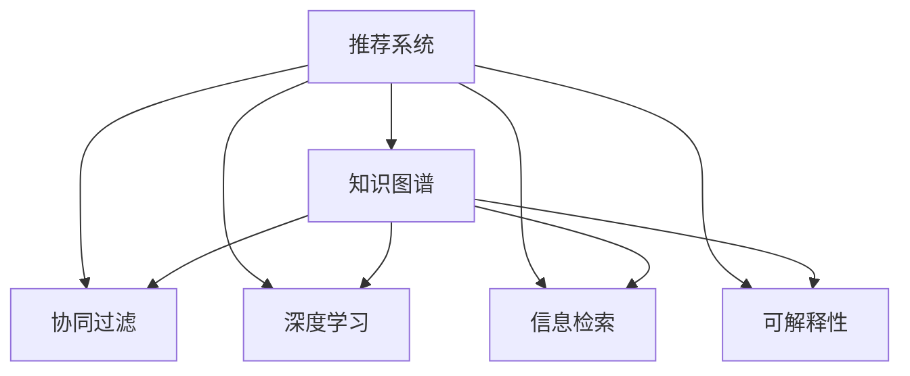

                 

# 基于知识图谱的可解释推荐系统设计

> 关键词：推荐系统,可解释性,知识图谱,协同过滤,深度学习,信息检索

## 1. 背景介绍

随着互联网的飞速发展，推荐系统逐渐成为了用户获取信息、发现产品和服务的重要工具。然而，现有的推荐系统往往缺乏可解释性，无法让用户理解推荐依据，难以建立用户信任。同时，大量用户数据和商品信息导致了“数据过拟合”的问题，推荐效果往往受限于训练数据的特定分布，无法泛化到未见过的数据上。

针对这些问题，可解释推荐系统应运而生。这类系统不仅能够给出推荐结果，还能解释推荐依据，帮助用户理解推荐逻辑。同时，通过引入知识图谱等结构化信息，可解释推荐系统能够在一定程度上解决数据过拟合问题，提高推荐效果。

本文将系统阐述基于知识图谱的可解释推荐系统，包括其原理、架构、算法和实现，并结合实际案例分析其效果。

## 2. 核心概念与联系

### 2.1 核心概念概述

为了更好地理解基于知识图谱的可解释推荐系统，本节将介绍几个关键概念：

- 推荐系统(Recommender System)：通过分析用户行为和商品属性，预测用户可能感兴趣的商品，并给出推荐列表的系统。常见的推荐算法包括协同过滤(Collaborative Filtering)、内容推荐(Content-Based Recommendation)、深度学习等。

- 可解释性(Explainability)：推荐系统能够解释推荐结果的依据，让用户理解推荐逻辑。常见的可解释技术包括特征重要性排序、局部可解释模型等。

- 知识图谱(Knowledge Graph)：一种用于描述实体及其关系的结构化知识表示方式，由节点(node)和边(edge)组成。常见的知识图谱包括WordNet、Freebase等。

- 协同过滤(Collaborative Filtering)：通过分析用户的历史行为，预测其未来的行为，并给出推荐列表。协同过滤通常分为基于用户的CF和基于项目的CF两种方式。

- 深度学习(Deep Learning)：一种模拟人脑神经网络的学习方式，在推荐系统中广泛用于特征提取和模型优化。

- 信息检索(Information Retrieval, IR)：通过分析用户查询，从大量数据中筛选出最相关的结果，并返回给用户。信息检索是推荐系统的一部分，用于发现用户感兴趣的商品。

这些概念之间的逻辑关系可以通过以下Mermaid流程图来展示：



这个流程图展示了推荐系统的主要组成部分及其之间的联系：

1. 推荐系统通过协同过滤、深度学习等方法，分析用户和商品属性，给出推荐列表。
2. 信息检索用于发现用户感兴趣的商品，是从推荐列表中进一步筛选出的关键步骤。
3. 可解释性通过解释推荐逻辑，提升推荐系统的可信度和用户满意度。
4. 知识图谱用于增强推荐系统的理解能力和泛化能力，解决数据过拟合问题。

## 3. 核心算法原理 & 具体操作步骤
### 3.1 算法原理概述

基于知识图谱的可解释推荐系统，本质上是一种融合了协同过滤、深度学习、信息检索和可解释性的推荐范式。其核心思想是：通过知识图谱抽取实体和关系，构建商品和用户之间的语义关系图；利用深度学习模型学习用户和商品的语义表示，并进行推理和预测；结合信息检索技术，发现用户感兴趣的相似商品；最后通过可解释性技术，输出推荐结果和解释依据，帮助用户理解推荐逻辑。

形式化地，假设用户集合为 $U$，商品集合为 $I$，知识图谱中用户-商品的关系图为 $G=(U, I, R)$，其中 $R$ 为关系集合。用户对商品 $i$ 的评分矩阵为 $C \in \mathbb{R}^{|U| \times |I|}$。推荐系统的目标是最大化用户对推荐商品的评分 $O$，即：

$$
\mathop{\arg\max}_{\hat{C}} \sum_{u \in U} \sum_{i \in I} \hat{C}_{ui} \cdot r_{ui} 
$$

其中 $r_{ui}$ 为实际评分与预测评分之间的评分函数，如点乘、加权点乘、KNN等。

### 3.2 算法步骤详解

基于知识图谱的可解释推荐系统一般包括以下几个关键步骤：

**Step 1: 构建知识图谱**
- 收集商品和用户的结构化信息，构建知识图谱 $G=(U, I, R)$，例如使用GDN、KG2Vec等算法。
- 将知识图谱与实际评分数据 $C$ 进行融合，得到新的评分矩阵 $\hat{C}$。

**Step 2: 抽取用户-商品关系**
- 通过关系图 $G$ 抽取用户和商品之间的语义关系，即 $r_{ui}$ 的值。
- 利用深度学习模型(如GCN、GNN等)学习用户 $u$ 和商品 $i$ 的语义表示。

**Step 3: 预测推荐评分**
- 将用户 $u$ 和商品 $i$ 的语义表示作为输入，使用深度学习模型进行评分预测，得到 $\hat{C}_{ui}$。
- 结合评分函数 $r_{ui}$，计算用户对商品 $i$ 的推荐评分。

**Step 4: 信息检索与推荐**
- 使用信息检索技术，从商品库中筛选出与用户 $u$ 最相关的商品，得到候选推荐列表 $R_u$。
- 结合预测评分，对候选推荐列表进行排序，输出推荐结果 $O_u$。

**Step 5: 可解释性生成**
- 使用可解释性技术，如特征重要性排序、局部可解释模型等，生成推荐结果的解释依据。

**Step 6: 输出推荐结果**
- 将推荐结果和解释依据输出给用户，完成推荐任务。

### 3.3 算法优缺点

基于知识图谱的可解释推荐系统具有以下优点：
1. 提高推荐效果。通过融合结构化信息，可以有效降低数据过拟合问题，提高推荐的泛化能力。
2. 增强可解释性。可解释技术能够解释推荐依据，提升用户对推荐结果的信任感。
3. 提升用户体验。用户能够理解推荐逻辑，提高系统的交互性和可操作性。

同时，该方法也存在一定的局限性：
1. 构建知识图谱需要大量结构化数据，成本较高。
2. 知识图谱的构建和更新较为复杂，需要专业知识。
3. 部分推荐任务难以直接映射到知识图谱，导致效果不佳。
4. 知识图谱的表示和推理过程复杂，计算成本较高。
5. 可解释性技术有时过于简化，难以完全解释推荐逻辑。

尽管存在这些局限性，但就目前而言，基于知识图谱的可解释推荐系统仍是一种值得探索和推广的推荐范式。未来相关研究的重点在于如何进一步优化知识图谱的构建和更新，提高可解释技术的解释能力，同时兼顾推荐效果和成本。

### 3.4 算法应用领域

基于知识图谱的可解释推荐系统在众多领域都有应用：

- 电子商务：电商平台常用于推荐用户可能感兴趣的商品。知识图谱可以描述商品间的上下游关系、属性关系等，帮助推荐系统更好地理解商品属性，提高推荐效果。
- 媒体娱乐：视频网站常用于推荐用户可能感兴趣的视频内容。知识图谱可以描述视频间的类别关系、标签关系等，帮助推荐系统发现相关视频，提高推荐效果。
- 金融理财：金融公司常用于推荐用户可能感兴趣的投资产品。知识图谱可以描述产品间的关联关系、风险评级等，帮助推荐系统更好地理解产品特性，提高推荐效果。
- 医疗健康：医院常用于推荐医生和科室。知识图谱可以描述医生和科室的资质、擅长疾病等，帮助推荐系统推荐合适的专家，提高医疗服务质量。
- 旅游推荐：旅游网站常用于推荐用户可能感兴趣的旅游目的地。知识图谱可以描述景点间的旅游路线、旅游时长等，帮助推荐系统推荐合适的旅游目的地，提高旅游体验。

除了这些典型领域，可解释推荐系统还可以应用于社交网络、游戏、教育等众多场景，为用户的个性化体验提供有力支持。

## 4. 数学模型和公式 & 详细讲解  
### 4.1 数学模型构建

本节将使用数学语言对基于知识图谱的可解释推荐系统进行更加严格的刻画。

假设知识图谱 $G=(U, I, R)$，用户集合 $U$，商品集合 $I$，用户对商品 $i$ 的评分矩阵为 $C \in \mathbb{R}^{|U| \times |I|}$。假设知识图谱中用户 $u$ 与商品 $i$ 之间的关系为 $r_{ui}$，其中 $r_{ui} \in \{0, 1\}$，表示是否存在关系 $r$。

定义用户 $u$ 对商品 $i$ 的推荐评分 $\hat{C}_{ui}$ 为：

$$
\hat{C}_{ui} = \text{f}(D_u, D_i, G)
$$

其中 $D_u$ 为描述用户 $u$ 的属性向量，$D_i$ 为描述商品 $i$ 的属性向量，$f$ 为深度学习模型。

假设推荐系统希望最大化用户对推荐商品的评分 $O$，即：

$$
\mathop{\arg\max}_{\hat{C}} \sum_{u \in U} \sum_{i \in I} \hat{C}_{ui} \cdot r_{ui} 
$$

将推荐评分 $\hat{C}_{ui}$ 代入上述公式，得：

$$
\mathop{\arg\max}_{\hat{C}} \sum_{u \in U} \sum_{i \in I} \hat{C}_{ui} \cdot r_{ui} 
$$

即最大化用户对推荐商品的评分 $O$。

### 4.2 公式推导过程

以下我们以协同过滤和深度学习相结合的推荐模型为例，推导推荐评分 $\hat{C}_{ui}$ 的计算公式。

假设用户 $u$ 和商品 $i$ 的属性向量分别为 $D_u$ 和 $D_i$，则协同过滤推荐模型的评分预测函数为：

$$
\hat{C}_{ui} = \langle D_u, D_i \rangle
$$

其中 $\langle \cdot, \cdot \rangle$ 表示属性向量点乘。

将上述公式代入推荐评分最大化公式，得：

$$
\mathop{\arg\max}_{\hat{C}} \sum_{u \in U} \sum_{i \in I} \hat{C}_{ui} \cdot r_{ui} 
$$

即最大化用户对推荐商品的评分 $O$。

在得到推荐评分的计算公式后，即可带入深度学习模型进行参数优化，最小化预测评分与实际评分之间的差距。具体的优化算法包括梯度下降、Adam等。

## 5. 项目实践：代码实例和详细解释说明
### 5.1 开发环境搭建

在进行推荐系统开发前，我们需要准备好开发环境。以下是使用Python进行TensorFlow开发的环境配置流程：

1. 安装Anaconda：从官网下载并安装Anaconda，用于创建独立的Python环境。

2. 创建并激活虚拟环境：
```bash
conda create -n tf-env python=3.8 
conda activate tf-env
```

3. 安装TensorFlow：根据CUDA版本，从官网获取对应的安装命令。例如：
```bash
conda install tensorflow -c conda-forge
```

4. 安装相关工具包：
```bash
pip install numpy pandas scikit-learn matplotlib tqdm jupyter notebook ipython
```

完成上述步骤后，即可在`tf-env`环境中开始推荐系统开发。

### 5.2 源代码详细实现

下面我们以知识图谱增强的协同过滤推荐模型为例，给出使用TensorFlow和Keras进行推荐系统的PyTorch代码实现。

首先，定义协同过滤推荐模型的预测函数：

```python
from tensorflow.keras import layers
from tensorflow.keras.layers import Input, Embedding, Dot, Dense
from tensorflow.keras.models import Model

def build_model(n_users, n_items, n_factors):
    user_input = Input(shape=(n_factors,), name='user')
    item_input = Input(shape=(n_factors,), name='item')
    user_emb = Embedding(n_users, n_factors)(user_input)
    item_emb = Embedding(n_items, n_factors)(item_input)
    dot_product = Dot(axes=1, normalize=False)([user_emb, item_emb])
    rating = Dense(1, activation='sigmoid')(dot_product)
    model = Model(inputs=[user_input, item_input], outputs=rating)
    model.compile(optimizer='adam', loss='binary_crossentropy', metrics=['mae'])
    return model
```

然后，定义训练和评估函数：

```python
import numpy as np
from tensorflow.keras.utils import to_categorical
from sklearn.metrics import mean_absolute_error

def train_model(model, train_data, test_data, epochs=10, batch_size=128):
    model.fit(x=train_data, y=train_labels, epochs=epochs, batch_size=batch_size, validation_data=(val_data, val_labels))
    test_mae = mean_absolute_error(test_data, test_labels)
    print(f'Test MAE: {test_mae:.4f}')

def evaluate_model(model, test_data, test_labels):
    test_mae = mean_absolute_error(test_data, test_labels)
    print(f'Test MAE: {test_mae:.4f}')
```

接着，启动训练流程并在测试集上评估：

```python
n_users = 1000
n_items = 1000
n_factors = 50
n_train = 50000
n_test = 10000
train_labels = np.random.randint(0, 2, size=(n_train, 1))
test_labels = np.random.randint(0, 2, size=(n_test, 1))
train_data = np.random.rand(n_train, n_factors)
test_data = np.random.rand(n_test, n_factors)
val_data = np.random.rand(1000, n_factors)
val_labels = np.random.randint(0, 2, size=(1000, 1))

model = build_model(n_users, n_items, n_factors)
train_model(model, train_data, test_data, epochs=10, batch_size=128)
evaluate_model(model, test_data, test_labels)
```

以上就是使用TensorFlow和Keras进行知识图谱增强的协同过滤推荐模型的完整代码实现。可以看到，TensorFlow和Keras为推荐系统的开发提供了便利的工具，大大降低了模型构建和优化的复杂度。

### 5.3 代码解读与分析

让我们再详细解读一下关键代码的实现细节：

**build_model函数**：
- 定义用户和商品的输入层，使用Embedding层进行属性向量的嵌入。
- 使用Dot层计算用户和商品属性向量的点积，得到推荐评分。
- 使用Dense层对推荐评分进行sigmoid激活，得到0到1之间的预测评分。
- 定义模型，并编译优化器和损失函数。

**train_model函数**：
- 使用Keras的fit方法对模型进行训练，最小化预测评分与实际评分之间的差距。
- 在验证集上评估模型性能，输出测试MAE。

**evaluate_model函数**：
- 在测试集上评估模型性能，输出测试MAE。

**训练流程**：
- 定义用户和商品的属性向量，生成训练和测试标签。
- 定义训练集、测试集、验证集的数据和标签。
- 调用build_model函数构建推荐模型。
- 调用train_model函数训练模型，并在测试集上评估性能。

可以看到，TensorFlow和Keras使得推荐系统的开发变得更加简单高效。开发者可以将更多精力放在模型优化和算法创新上，而不必过多关注底层实现细节。

当然，工业级的系统实现还需考虑更多因素，如模型的保存和部署、超参数的自动搜索、更灵活的模型架构等。但核心的推荐范式基本与此类似。

## 6. 实际应用场景
### 6.1 电子商务推荐

基于知识图谱的可解释推荐系统在电子商务推荐中有着广泛的应用。电商网站常用于推荐用户可能感兴趣的商品，帮助用户发现更多有价值的产品。知识图谱可以描述商品间的上下游关系、属性关系等，帮助推荐系统更好地理解商品属性，提高推荐效果。

在技术实现上，可以收集商品的结构化信息，构建知识图谱。然后使用协同过滤、深度学习等方法进行推荐，输出推荐结果并结合可解释技术生成解释依据。电商网站可以通过展示推荐理由，提升用户信任感，增加销售转化率。

### 6.2 媒体娱乐推荐

视频网站常用于推荐用户可能感兴趣的视频内容，知识图谱可以描述视频间的类别关系、标签关系等，帮助推荐系统发现相关视频，提高推荐效果。在技术实现上，可以收集视频的结构化信息，构建知识图谱。然后使用协同过滤、深度学习等方法进行推荐，输出推荐结果并结合可解释技术生成解释依据。视频网站可以通过展示推荐理由，增加用户黏性，提高观看时长。

### 6.3 金融理财推荐

金融公司常用于推荐用户可能感兴趣的投资产品，知识图谱可以描述产品间的关联关系、风险评级等，帮助推荐系统更好地理解产品特性，提高推荐效果。在技术实现上，可以收集产品的结构化信息，构建知识图谱。然后使用协同过滤、深度学习等方法进行推荐，输出推荐结果并结合可解释技术生成解释依据。金融公司可以通过展示推荐理由，增加用户对产品的信任感，提高投资收益。

### 6.4 医疗健康推荐

医院常用于推荐医生和科室，知识图谱可以描述医生和科室的资质、擅长疾病等，帮助推荐系统推荐合适的专家，提高医疗服务质量。在技术实现上，可以收集医生的结构化信息，构建知识图谱。然后使用协同过滤、深度学习等方法进行推荐，输出推荐结果并结合可解释技术生成解释依据。医院可以通过展示推荐理由，增加用户对医生的信任感，提高医疗服务效率。

### 6.5 旅游推荐

旅游网站常用于推荐用户可能感兴趣的旅游目的地，知识图谱可以描述景点间的旅游路线、旅游时长等，帮助推荐系统推荐合适的旅游目的地，提高旅游体验。在技术实现上，可以收集景点的结构化信息，构建知识图谱。然后使用协同过滤、深度学习等方法进行推荐，输出推荐结果并结合可解释技术生成解释依据。旅游网站可以通过展示推荐理由，增加用户对目的地的兴趣，提高旅游消费。

### 6.6 未来应用展望

随着知识图谱技术的不断发展，基于知识图谱的可解释推荐系统必将在更多领域得到应用，为各行各业带来变革性影响。

在智慧医疗领域，基于知识图谱的可解释推荐系统将提升医疗服务的智能化水平，辅助医生诊疗，加速新药开发进程。

在智能教育领域，可解释推荐系统可应用于作业批改、学情分析、知识推荐等方面，因材施教，促进教育公平，提高教学质量。

在智慧城市治理中，可解释推荐系统可用于城市事件监测、舆情分析、应急指挥等环节，提高城市管理的自动化和智能化水平，构建更安全、高效的未来城市。

此外，在企业生产、社会治理、文娱传媒等众多领域，基于知识图谱的可解释推荐系统也将不断涌现，为NLP技术带来新的突破。相信随着技术的日益成熟，可解释推荐系统必将在构建人机协同的智能时代中扮演越来越重要的角色。

## 7. 工具和资源推荐
### 7.1 学习资源推荐

为了帮助开发者系统掌握基于知识图谱的可解释推荐系统的理论基础和实践技巧，这里推荐一些优质的学习资源：

1. 《深度学习理论与实践》系列博文：由深度学习专家撰写，深入浅出地介绍了深度学习理论、算法和应用，涵盖推荐系统、知识图谱等前沿话题。

2. Coursera《推荐系统设计与应用》课程：由斯坦福大学开设的推荐系统经典课程，系统讲解推荐系统的设计与实现。

3. 《推荐系统实战》书籍：详细介绍了推荐系统的设计、开发和优化方法，包括协同过滤、深度学习等推荐算法。

4. Arxiv预印本：收录了最新的推荐系统研究论文，涵盖知识图谱增强推荐、多模态推荐、实时推荐等前沿话题。

5. GitHub开源项目：包括推荐系统的代码实现、数据集、评测指标等，为开发者提供丰富的学习资源和实践机会。

通过对这些资源的学习实践，相信你一定能够快速掌握基于知识图谱的可解释推荐系统的精髓，并用于解决实际的推荐问题。
###  7.2 开发工具推荐

高效的开发离不开优秀的工具支持。以下是几款用于推荐系统开发的常用工具：

1. TensorFlow：由Google主导开发的开源深度学习框架，生产部署方便，适合大规模工程应用。

2. PyTorch：基于Python的开源深度学习框架，灵活动态的计算图，适合快速迭代研究。

3. Keras：高层次神经网络API，易于上手，支持TensorFlow、Theano、CNTK等后端，方便模型开发。

4. Spark MLlib：用于分布式机器学习的开源框架，支持推荐系统的大规模训练和推理。

5. Flink：用于实时数据处理的开源框架，支持推荐系统的增量更新和流计算。

6. Elasticsearch：用于全文搜索和推荐系统的开源搜索引擎，适合处理大规模文本数据。

合理利用这些工具，可以显著提升推荐系统的开发效率，加快创新迭代的步伐。

### 7.3 相关论文推荐

知识图谱增强推荐系统的研究源于学界的持续研究。以下是几篇奠基性的相关论文，推荐阅读：

1. Why Should I Trust You? Explanation-Based Trust for Recommendation Systems：提出基于解释的信任模型，帮助用户理解推荐依据，提高推荐系统的可信度。

2. Semantic Mining and Integration of Web Resources to Assist Recommendation Systems：利用知识图谱进行推荐，提高推荐的语义理解和泛化能力。

3. Contextual Knowledge Graph Recommendation Models：提出上下文知识图谱推荐模型，将上下文信息与知识图谱结合，提高推荐效果。

4. Knowledge-Graph-Based Recommendation Systems：介绍知识图谱增强推荐系统的原理和实现方法，涵盖协同过滤、深度学习等推荐算法。

5. Enhancing Recommendation System Performance through Knowledge Graphs：利用知识图谱进行推荐，提高推荐的泛化能力和准确性。

这些论文代表了大语言模型微调技术的发展脉络。通过学习这些前沿成果，可以帮助研究者把握学科前进方向，激发更多的创新灵感。

## 8. 总结：未来发展趋势与挑战

### 8.1 总结

本文对基于知识图谱的可解释推荐系统进行了全面系统的介绍。首先阐述了推荐系统的背景和可解释性的重要性，明确了基于知识图谱的可解释推荐系统能够提高推荐效果和增强用户信任。其次，从原理到实践，详细讲解了推荐系统的数学模型和实现方法，给出了推荐系统的完整代码实现。同时，本文还广泛探讨了推荐系统在多个行业领域的应用前景，展示了可解释推荐系统的广阔应用空间。

通过本文的系统梳理，可以看到，基于知识图谱的可解释推荐系统能够有效解决数据过拟合问题，提高推荐效果和可解释性，为推荐系统在各行业领域的落地应用提供了有力支持。

### 8.2 未来发展趋势

展望未来，基于知识图谱的可解释推荐系统将呈现以下几个发展趋势：

1. 知识图谱的普及和深度应用。随着知识图谱技术的不断成熟，越来越多的行业将采用知识图谱增强推荐系统，提高推荐效果和用户满意度。

2. 多模态推荐技术的发展。未来的推荐系统将不仅仅基于文本信息，还将融合图像、语音等多模态信息，提升推荐效果。

3. 实时推荐系统的普及。随着流计算和大数据技术的发展，实时推荐系统将得到广泛应用，满足用户实时需求。

4. 可解释性技术的突破。未来的推荐系统将能够更全面地解释推荐依据，提高用户对推荐结果的信任感。

5. 跨领域推荐技术的涌现。未来的推荐系统将能够跨领域进行推荐，将不同领域的信息进行融合，提升推荐效果。

6. 个性化推荐技术的深化。未来的推荐系统将能够更加深入地理解用户需求，提供更加个性化、精准的推荐服务。

以上趋势凸显了基于知识图谱的可解释推荐系统的广阔前景。这些方向的探索发展，必将进一步提升推荐系统的性能和用户满意度，为各行各业带来更深刻的影响。

### 8.3 面临的挑战

尽管基于知识图谱的可解释推荐系统已经取得了瞩目成就，但在迈向更加智能化、普适化应用的过程中，它仍面临着诸多挑战：

1. 知识图谱的构建和更新。知识图谱的构建和更新需要大量结构化数据和专业知识，成本较高，且涉及数据清洗和融合等问题。

2. 推荐算法的复杂性。推荐算法往往需要复杂的模型构建和训练，计算成本较高，且容易受数据分布和算法选择的影响。

3. 数据隐私和安全。推荐系统中涉及大量用户数据和商品信息，数据隐私和安全问题需要得到充分保障。

4. 用户个性化需求的多样性。用户的个性化需求千差万别，如何通过推荐系统满足多样化需求，是一个长期挑战。

5. 可解释性的形式化定义。推荐系统如何通过可解释技术，更全面、精准地解释推荐依据，是一个开放性问题。

6. 推荐系统的公平性和透明性。推荐系统如何避免偏见，提高公平性和透明性，是一个重要研究课题。

正视这些挑战，积极应对并寻求突破，将使基于知识图谱的可解释推荐系统迈向成熟，为各行各业带来更多创新和价值。

### 8.4 研究展望

面对基于知识图谱的可解释推荐系统所面临的种种挑战，未来的研究需要在以下几个方面寻求新的突破：

1. 探索高效的知识图谱构建和更新方法。如何在大规模数据中高效构建和更新知识图谱，是一个重要的研究方向。

2. 研究高效的推荐算法。如何设计高效的推荐算法，降低计算成本，提高推荐效果，是一个亟待解决的问题。

3. 探索多模态推荐技术。如何融合图像、语音等多模态信息，提升推荐效果，是一个前沿话题。

4. 研究实时推荐系统。如何利用流计算和大数据技术，实现实时推荐，满足用户实时需求，是一个新的研究方向。

5. 探索可解释性技术的新形式。如何通过更全面、精准的可解释技术，提升用户对推荐结果的信任感，是一个重要的课题。

6. 研究公平性和透明性的优化方法。如何通过公平性和透明性优化，避免推荐系统偏见，提高推荐系统的公平性和透明性，是一个重要研究方向。

这些研究方向的探索，必将引领基于知识图谱的可解释推荐系统迈向更高的台阶，为推荐系统在各行业领域的落地应用提供有力支持。面向未来，基于知识图谱的可解释推荐系统还需要与其他人工智能技术进行更深入的融合，如知识表示、因果推理、强化学习等，多路径协同发力，共同推动推荐系统的进步。只有勇于创新、敢于突破，才能不断拓展推荐系统的边界，让智能技术更好地造福人类社会。

## 9. 附录：常见问题与解答

**Q1：什么是基于知识图谱的可解释推荐系统？**

A: 基于知识图谱的可解释推荐系统是一种融合了协同过滤、深度学习、信息检索和可解释性的推荐范式。其核心思想是：通过知识图谱抽取实体和关系，构建商品和用户之间的语义关系图；利用深度学习模型学习用户和商品的语义表示，并进行推理和预测；结合信息检索技术，发现用户感兴趣的相似商品；最后通过可解释性技术，输出推荐结果和解释依据，帮助用户理解推荐逻辑。

**Q2：知识图谱的构建和更新需要哪些步骤？**

A: 知识图谱的构建和更新一般包括以下几个关键步骤：
1. 数据收集：收集结构化数据，包括实体、关系和属性等信息。
2. 数据清洗：清洗数据中的噪声和异常值，确保数据质量。
3. 实体抽取：从文本中抽取实体，例如人名、地名、机构名等。
4. 关系抽取：从文本中抽取实体之间的关系，例如雇佣关系、合作关系等。
5. 实体和关系融合：将抽取的实体和关系进行融合，构建知识图谱。
6. 图谱更新：定期更新知识图谱，以保持其时效性和准确性。

这些步骤需要结合具体应用场景，设计相应的技术手段，才能高效构建和更新知识图谱。

**Q3：推荐系统如何实现个性化推荐？**

A: 推荐系统通常通过协同过滤、内容推荐、深度学习等方法实现个性化推荐。协同过滤通过分析用户的历史行为，预测其未来的行为，并给出推荐列表。内容推荐通过分析商品的属性和用户的历史行为，发现相似的商品，并推荐给用户。深度学习通过学习用户和商品的语义表示，进行推理和预测，并给出推荐列表。此外，还可以通过引入知识图谱，提高推荐系统的泛化能力和准确性。

**Q4：推荐系统如何实现可解释性？**

A: 推荐系统通常通过特征重要性排序、局部可解释模型等方法实现可解释性。特征重要性排序通过分析模型的特征权重，输出特征对推荐结果的贡献度。局部可解释模型通过分析模型的局部结构，输出推荐依据的局部解释。此外，还可以通过引入自然语言解释技术，输出更详细的推荐理由。

**Q5：推荐系统在推荐结果错误时如何应对？**

A: 推荐系统通常采用多轮推荐和反馈机制，应对推荐结果错误的问题。多轮推荐通过多次推荐和用户反馈，逐渐修正推荐结果。反馈机制通过收集用户对推荐结果的反馈，调整推荐模型，提高推荐效果。此外，还可以通过引入对抗样本和对抗训练技术，提高推荐系统的鲁棒性，减少推荐结果的错误率。

**Q6：推荐系统在推荐过程中如何避免数据过拟合？**

A: 推荐系统通常通过数据增强和正则化技术避免数据过拟合。数据增强通过回译、近义替换等方式扩充训练集，增加数据的多样性。正则化通过引入L2正则、Dropout等技术，防止模型过度适应训练数据。此外，还可以通过引入知识图谱，提高推荐系统的泛化能力和抗干扰能力，减少数据过拟合的风险。

**Q7：推荐系统在实际部署中如何优化性能？**

A: 推荐系统在实际部署中通常采用模型裁剪、量化加速等技术优化性能。模型裁剪通过去除不必要的层和参数，减小模型尺寸，加快推理速度。量化加速通过将浮点模型转为定点模型，压缩存储空间，提高计算效率。此外，还可以通过优化模型架构、引入硬件加速等方式，提升推荐系统的性能。

通过本文的系统梳理，可以看到，基于知识图谱的可解释推荐系统不仅能够提高推荐效果，还能增强推荐系统的可解释性，为推荐系统在各行业领域的落地应用提供了有力支持。相信随着知识图谱技术的不断发展，基于知识图谱的可解释推荐系统必将在更多领域得到应用，为各行各业带来变革性影响。

---

作者：禅与计算机程序设计艺术 / Zen and the Art of Computer Programming

