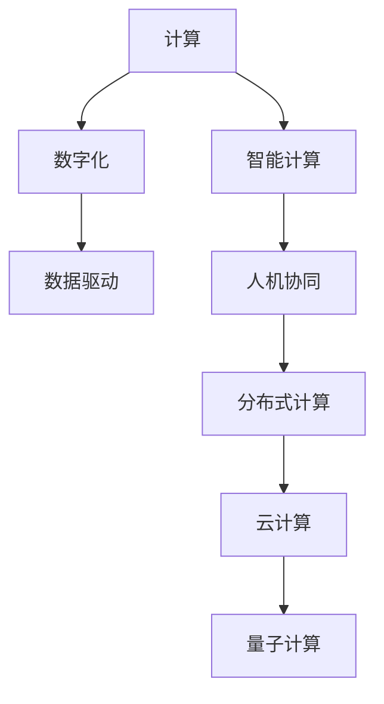

                 

# 塑造数字时代：人类计算的关键作用

## 1. 背景介绍

### 1.1 问题由来
随着数字技术的迅猛发展，人类社会的方方面面正逐渐数字化。互联网、物联网、人工智能等技术的广泛应用，极大地提高了生产效率和生活质量，也深刻改变了人类的计算模式。在这个过程中，计算的作用愈发显得重要。从早期的基于硬件的计算，到软件驱动的计算，再到今天以数据为核心的计算，计算的方式和形态不断演化，极大地推动了社会的进步。

### 1.2 问题核心关键点
计算在数字时代的演变，不仅是技术层面的变革，更是人类社会认知和文化的一次重大转变。从传统物理世界的机械计算，到信息时代的网络计算，计算的重心从物转为人。人类计算的核心作用，体现在以下几个方面：

- 计算成为数字化发展的核心驱动力。通过计算，数据被转化为有价值的信息，从而推动各行各业的数字化进程。
- 计算促进了人类认知的提升。基于计算的模型和算法，使得人类可以更深入地理解复杂的自然和人类社会现象。
- 计算变革了人类社会结构。数字化进程推动了工作模式、生活方式的变革，对社会结构和组织形式产生了深远影响。
- 计算推动了社会的创新与进步。计算能力的大幅提升，为科技创新、新产业培育提供了强大支撑。

### 1.3 问题研究意义
研究计算在数字时代的演变，不仅有助于理解技术发展背后的社会驱动力，还能指导未来的计算方向，促进技术的健康发展，助力人类社会的可持续发展。具体而言，研究的意义在于：

1. 揭示计算与社会发展之间的关系。通过分析计算对人类社会的驱动作用，可以更加全面地理解计算技术的发展方向和价值。
2. 指导未来计算技术的应用。深入探讨计算对社会结构、生活方式的影响，为未来计算技术的应用提供指导。
3. 促进跨学科融合。计算技术涉及计算机科学、社会学、经济学等多个领域，跨学科的研究可以提供更多视角，丰富研究内容。
4. 推动科技伦理与政策制定。计算在带来便利的同时，也带来诸多伦理和政策问题，需要通过研究进行系统化探讨和应对。
5. 促进计算教育的普及。理解计算在数字时代的作用，有助于提升公众对计算技术的认识，推动计算教育的普及。

## 2. 核心概念与联系

### 2.1 核心概念概述

为了深入理解计算在数字时代的核心作用，我们首先需要了解一些核心概念：

- **计算**：利用逻辑和物理手段对信息进行处理和转换的过程。
- **数字化**：将物理世界的信息转化为数字信息，便于计算机处理和传输。
- **智能计算**：结合人工智能技术，使计算过程具备智能化的特征。
- **人机协同**：人类和计算机系统在计算过程中相互配合，共同完成任务。
- **数据驱动**：计算过程中以数据为中心，通过数据来驱动决策和优化。
- **分布式计算**：将计算任务分布在多个计算节点上，共同完成计算任务。
- **云计算**：通过互联网提供计算资源和服务的计算模式。
- **量子计算**：利用量子力学原理，实现比传统计算机更快、更高效的计算。

这些概念之间的逻辑关系可以通过以下Mermaid流程图来展示：



### 2.2 核心概念原理和架构的 Mermaid 流程图

以下是对核心概念的详细解释：

**计算**：计算的本质是通过逻辑和物理手段，对输入信息进行处理和转换，得到输出结果。计算的流程通常包括数据输入、中间处理和结果输出三个阶段。

**数字化**：将物理世界的信息转化为数字信息的过程。数字化需要物理信号的采集、编码和传输等技术手段。数字化后的数据可以更加方便地在计算机中进行处理和存储。

**智能计算**：结合人工智能技术，使计算过程具备智能化的特征。智能计算包括知识表示、推理、学习等多种形式，旨在模拟人类智能的处理方式。

**人机协同**：在计算过程中，人类和计算机系统相互配合，共同完成任务。人机协同的实现方式包括机器人、增强现实(AR)、虚拟现实(VR)等多种形式。

**数据驱动**：计算过程中以数据为中心，通过数据来驱动决策和优化。数据驱动的方法包括机器学习、数据挖掘、预测建模等，在各个领域都有广泛应用。

**分布式计算**：将计算任务分布在多个计算节点上，共同完成计算任务。分布式计算能够提高计算效率，适应大规模数据的处理需求。

**云计算**：通过互联网提供计算资源和服务的计算模式。云计算能够提供弹性、按需的计算资源，支持大规模、高并发、高可用性的应用。

**量子计算**：利用量子力学原理，实现比传统计算机更快、更高效的计算。量子计算有望在多个领域取得突破，如密码学、材料科学等。

这些核心概念共同构成了计算技术的发展框架，展示了计算在数字化进程中的重要作用。

## 3. 核心算法原理 & 具体操作步骤

### 3.1 算法原理概述

计算在数字时代的核心作用，体现在以下几个方面：

- **计算的普及和提升**：从早期的机械计算到现代的智能计算，计算能力的大幅提升极大地推动了社会的发展。
- **数据处理和分析**：数字化进程中，大量的数据需要处理和分析，计算技术提供了强大的工具。
- **自动化和智能化**：通过计算技术，可以实现各种自动化和智能化系统，提高效率和精准度。
- **网络计算和分布式计算**：互联网的发展使得计算任务可以分布式处理，大幅提高了计算效率。
- **云计算和量子计算**：云计算提供了弹性的计算资源，量子计算有望突破传统计算的瓶颈。

### 3.2 算法步骤详解

以下是计算在数字时代的具体操作步骤：

**Step 1: 数据采集与处理**
- 收集原始数据，并进行清洗、去重、格式转换等预处理。
- 使用数据挖掘、统计分析等方法，对数据进行特征提取和建模。
- 在数据处理过程中，可以使用分布式计算、云计算等技术提高效率。

**Step 2: 计算模型的构建**
- 选择合适的计算模型，如决策树、神经网络、支持向量机等。
- 对模型进行训练和优化，调整超参数，提高模型精度。
- 使用分布式计算、并行计算等技术，加速模型训练过程。

**Step 3: 结果分析与应用**
- 对模型进行评估和验证，使用测试集进行性能测试。
- 将模型应用于实际问题，提供决策支持、自动化处理等功能。
- 不断优化模型，使用新的数据和算法进行迭代，提升应用效果。

**Step 4: 人机协同与智能化**
- 结合人工智能技术，如自然语言处理、计算机视觉等，提升计算的智能化水平。
- 使用增强现实、虚拟现实等技术，实现人机协同。
- 在计算过程中，引入人类智能，提高决策的准确性和可解释性。

### 3.3 算法优缺点

计算在数字时代的作用既有优点也有不足：

**优点**：
- **提升效率**：计算能够大幅提升数据处理和信息分析的效率，推动社会进步。
- **支持决策**：基于计算模型的决策，能够提供客观、准确的支持。
- **促进创新**：计算技术的发展，催生了许多新的技术和应用，推动创新。

**缺点**：
- **数据隐私问题**：大规模数据采集和使用过程中，数据隐私和安全问题需要特别关注。
- **计算资源消耗**：大规模计算需要大量的计算资源，可能会带来成本和能耗问题。
- **算法公平性**：计算模型可能会存在算法偏见，影响公平性和公正性。

### 3.4 算法应用领域

计算技术在数字时代的应用领域非常广泛，覆盖了几乎所有重要领域，具体包括：

- **医疗健康**：利用计算技术进行病患数据分析、医疗影像处理、药物研发等，提高医疗服务质量。
- **金融科技**：通过计算技术进行风险评估、投资决策、市场分析等，提升金融服务效率和精准度。
- **智慧城市**：结合计算技术进行城市管理、交通调控、公共安全等，提升城市治理水平。
- **工业制造**：通过计算技术进行生产调度、质量控制、设备维护等，提升制造业自动化水平。
- **物流供应链**：利用计算技术进行物流规划、库存管理、需求预测等，提高供应链效率。
- **教育培训**：使用计算技术进行个性化教育、智能评估、学习推荐等，提升教育质量。
- **零售电商**：通过计算技术进行用户行为分析、推荐系统优化、供应链管理等，提升零售电商体验。

## 4. 数学模型和公式 & 详细讲解 & 举例说明

### 4.1 数学模型构建

计算在数字时代的核心作用，可以从多个角度进行数学建模，以下是对几个关键领域的建模分析：

**医疗健康**：利用计算技术进行病患数据分析，可以建立如下数学模型：

$$
P(\text{疾病}) = f(X_1, X_2, \ldots, X_n)
$$

其中 $P(\text{疾病})$ 表示患病的概率，$X_1, X_2, \ldots, X_n$ 表示患者的各种特征指标，$f$ 为计算模型，如逻辑回归、随机森林等。

**金融科技**：通过计算技术进行风险评估，可以建立如下数学模型：

$$
Risk = g(X_1, X_2, \ldots, X_n)
$$

其中 $Risk$ 表示风险水平，$X_1, X_2, \ldots, X_n$ 表示借款人、贷款金额、信用评分等特征指标，$g$ 为计算模型，如支持向量机、神经网络等。

**智慧城市**：利用计算技术进行交通调控，可以建立如下数学模型：

$$
Traffic = h(V, D, T, R)
$$

其中 $Traffic$ 表示交通流量，$V$ 表示车辆数，$D$ 表示道路条件，$T$ 表示时间，$R$ 表示其他影响因素，$h$ 为计算模型，如线性回归、时空网络等。

### 4.2 公式推导过程

以下是对几个关键模型的推导过程：

**医疗健康**：假设 $X_1, X_2, \ldots, X_n$ 服从正态分布，利用逻辑回归模型进行患病概率预测：

$$
P(\text{疾病}) = \sigma(\alpha + \beta_1 X_1 + \beta_2 X_2 + \ldots + \beta_n X_n)
$$

其中 $\sigma$ 为逻辑函数，$\alpha, \beta_1, \ldots, \beta_n$ 为模型参数。

**金融科技**：利用支持向量机模型进行风险评估：

$$
Risk = \max_{i=1,\ldots,m}(-\alpha_i + \sum_{j=1}^n \alpha_{ij} Y_j X_j)
$$

其中 $Y_j$ 表示样本特征指标，$\alpha_i, \alpha_{ij}$ 为模型参数。

**智慧城市**：利用时空网络模型进行交通流量预测：

$$
Traffic = \sum_{i=1}^m \sum_{j=1}^n \omega_{ij} f_i(V, D, T, R)
$$

其中 $\omega_{ij}$ 为权重参数，$f_i$ 为不同时间、不同路段的交通流量函数。

### 4.3 案例分析与讲解

**医疗健康**：某医院利用计算技术进行病患数据分析，建立一个基于逻辑回归的模型：

$$
P(\text{疾病}) = \sigma(\alpha + \beta_1 \text{年龄} + \beta_2 \text{性别} + \ldots + \beta_n \text{血压})
$$

训练该模型，得到最优参数 $\alpha, \beta_1, \ldots, \beta_n$。然后，将新病患的年龄、性别、血压等指标代入模型，预测其患病的概率。

**金融科技**：某银行利用计算技术进行风险评估，建立一个基于支持向量机的模型：

$$
Risk = \max_{i=1,\ldots,m}(-\alpha_i + \sum_{j=1}^n \alpha_{ij} Y_j X_j)
$$

训练该模型，得到最优参数 $\alpha_i, \alpha_{ij}$。然后，将借款人的信用评分、贷款金额等指标代入模型，评估其信用风险。

**智慧城市**：某城市利用计算技术进行交通流量预测，建立一个基于时空网络模型：

$$
Traffic = \sum_{i=1}^m \sum_{j=1}^n \omega_{ij} f_i(V, D, T, R)
$$

训练该模型，得到最优参数 $\omega_{ij}$ 和 $f_i$。然后，实时输入车辆数、道路条件、时间等指标，预测交通流量，优化交通调控策略。

## 5. 项目实践：代码实例和详细解释说明

### 5.1 开发环境搭建

在进行计算项目实践前，我们需要准备好开发环境。以下是使用Python进行Scikit-learn开发的环境配置流程：

1. 安装Anaconda：从官网下载并安装Anaconda，用于创建独立的Python环境。

2. 创建并激活虚拟环境：
```bash
conda create -n sklearn-env python=3.8 
conda activate sklearn-env
```

3. 安装Scikit-learn：
```bash
pip install -U scikit-learn
```

4. 安装numpy、pandas、matplotlib等辅助工具：
```bash
pip install numpy pandas matplotlib
```

5. 启动Jupyter Notebook：
```bash
jupyter notebook
```

完成上述步骤后，即可在`sklearn-env`环境中开始计算项目实践。

### 5.2 源代码详细实现

下面我们以医疗健康领域的疾病预测为例，给出使用Scikit-learn进行逻辑回归模型微调的PyTorch代码实现。

首先，定义数据集：

```python
import pandas as pd
from sklearn.model_selection import train_test_split

# 读取数据
data = pd.read_csv('data.csv')

# 数据清洗
data = data.dropna()

# 特征工程
X = data[['age', 'gender', 'bp']]
y = data['disease']

# 划分训练集和测试集
X_train, X_test, y_train, y_test = train_test_split(X, y, test_size=0.2, random_state=42)
```

然后，定义模型和优化器：

```python
from sklearn.linear_model import LogisticRegression
from sklearn.metrics import accuracy_score

# 定义模型
model = LogisticRegression(solver='liblinear', max_iter=1000)

# 定义优化器
optimizer = 'liblinear'
```

接着，定义训练和评估函数：

```python
from sklearn.model_selection import cross_val_score
from sklearn.metrics import confusion_matrix
from sklearn.metrics import roc_auc_score
from sklearn.metrics import roc_curve
from sklearn.metrics import precision_recall_curve

def train_model(model, X_train, y_train):
    model.fit(X_train, y_train)
    return model

def evaluate_model(model, X_test, y_test):
    y_pred = model.predict(X_test)
    accuracy = accuracy_score(y_test, y_pred)
    confusion = confusion_matrix(y_test, y_pred)
    roc_auc = roc_auc_score(y_test, y_pred)
    precision, recall, thresholds = precision_recall_curve(y_test, y_pred)
    return accuracy, confusion, roc_auc, precision, recall

# 训练模型
model = train_model(model, X_train, y_train)

# 评估模型
accuracy, confusion, roc_auc, precision, recall = evaluate_model(model, X_test, y_test)

# 输出结果
print('Accuracy:', accuracy)
print('Confusion Matrix:')
print(confusion)
print('ROC-AUC:', roc_auc)
print('Precision:', precision)
print('Recall:', recall)
```

最后，启动训练流程并在测试集上评估：

```python
# 训练模型
model = train_model(model, X_train, y_train)

# 评估模型
accuracy, confusion, roc_auc, precision, recall = evaluate_model(model, X_test, y_test)

# 输出结果
print('Accuracy:', accuracy)
print('Confusion Matrix:')
print(confusion)
print('ROC-AUC:', roc_auc)
print('Precision:', precision)
print('Recall:', recall)
```

以上就是使用Scikit-learn进行逻辑回归模型微调的完整代码实现。可以看到，得益于Scikit-learn的强大封装，我们可以用相对简洁的代码完成逻辑回归模型的构建和微调。

### 5.3 代码解读与分析

让我们再详细解读一下关键代码的实现细节：

**data.csv文件**：
- 包含病患的年龄、性别、血压等特征指标以及是否患病的标签。

**train_test_split函数**：
- 用于将数据集划分为训练集和测试集，其中70%数据用于训练，30%数据用于测试。

**LogisticRegression模型**：
- 定义一个逻辑回归模型，设置求解器为liblinear，最大迭代次数为1000。

**evaluate_model函数**：
- 对模型进行评估，计算准确率、混淆矩阵、ROC曲线、精度-召回率曲线等指标。

**训练流程**：
- 在训练集上训练模型，使用liblinear求解器。
- 在测试集上评估模型，输出各项指标。

可以看到，Scikit-learn使得计算模型构建和微调的过程变得简洁高效。开发者可以将更多精力放在数据处理、模型改进等高层逻辑上，而不必过多关注底层的实现细节。

当然，工业级的系统实现还需考虑更多因素，如模型的保存和部署、超参数的自动搜索、更灵活的任务适配层等。但核心的微调范式基本与此类似。

## 6. 实际应用场景

### 6.1 智能制造

在智能制造领域，计算技术可以用于生产线优化、设备维护、质量检测等方面，推动制造业的智能化转型。

具体而言，可以采集生产线的数据，如温度、湿度、设备状态等，利用计算技术进行分析和预测。通过建立生产异常预测模型，可以提前预警并处理设备故障，避免生产停滞。同时，利用计算技术进行质量检测，可以实时监控产品质量，减少废品率。

### 6.2 智慧物流

智慧物流系统可以利用计算技术进行物流规划、仓储管理、配送优化等，提升物流效率和精准度。

具体而言，可以采集物流环节的各项数据，如货物数量、运输时间、天气情况等，利用计算技术进行分析和预测。通过建立物流路径优化模型，可以生成最优的物流方案，减少运输成本和延误。同时，利用计算技术进行仓储管理，可以优化库存分配，提高仓储效率。

### 6.3 智能交通

智能交通系统可以利用计算技术进行交通流量预测、路径规划、交通信号优化等，提升城市交通管理水平。

具体而言，可以采集交通流量数据、车辆速度、道路状况等，利用计算技术进行分析和预测。通过建立交通流量预测模型，可以实时监测交通流量，优化交通信号，缓解交通拥堵。同时，利用计算技术进行路径规划，可以提供最优的出行方案，减少拥堵和等待时间。

### 6.4 未来应用展望

随着计算技术的发展，未来的应用前景将更加广阔：

1. **智能城市**：利用计算技术进行智慧城市建设，如智能家居、智能安防、智能医疗等，提升城市生活的智能化水平。
2. **智慧农业**：利用计算技术进行农田监测、精准农业、智慧养殖等，提升农业生产的智能化和精准度。
3. **智能金融**：利用计算技术进行金融风险评估、投资决策、市场预测等，提升金融服务的智能化水平。
4. **智能零售**：利用计算技术进行客户行为分析、商品推荐、库存管理等，提升零售电商的智能化水平。
5. **智慧医疗**：利用计算技术进行病患数据分析、医疗影像处理、药物研发等，提升医疗服务的智能化水平。

## 7. 工具和资源推荐

### 7.1 学习资源推荐

为了帮助开发者系统掌握计算技术的发展和应用，这里推荐一些优质的学习资源：

1. 《深度学习》课程：斯坦福大学开设的深度学习课程，介绍了深度学习的基本概念和常用算法。
2. 《机器学习》课程：Coursera开设的机器学习课程，介绍了机器学习的基本概念和算法实现。
3. 《计算机视觉》课程：斯坦福大学开设的计算机视觉课程，介绍了计算机视觉的基本概念和算法实现。
4. 《自然语言处理》课程：Coursera开设的自然语言处理课程，介绍了自然语言处理的基本概念和算法实现。
5. 《数据科学导论》书籍：Wikipedia协作编写的数据科学导论，全面介绍了数据科学的基本概念和常用工具。

通过对这些资源的学习实践，相信你一定能够全面掌握计算技术的发展和应用，为未来的计算任务提供有力的支持。

### 7.2 开发工具推荐

高效的计算任务开发离不开优秀的工具支持。以下是几款用于计算任务开发的常用工具：

1. Scikit-learn：开源机器学习库，提供了多种常用的机器学习算法，如逻辑回归、支持向量机、随机森林等。
2. TensorFlow：由Google主导的深度学习框架，提供了强大的计算能力和丰富的算法实现。
3. PyTorch：由Facebook主导的深度学习框架，提供了动态计算图和灵活的模型构建方式。
4. Jupyter Notebook：开源笔记本环境，支持多种编程语言和数据处理工具，适合进行交互式开发。
5. Python：开源编程语言，具有丰富的第三方库和数据处理能力，适合进行多种计算任务开发。

合理利用这些工具，可以显著提升计算任务开发的效率，加快创新迭代的步伐。

### 7.3 相关论文推荐

计算技术的发展离不开学界的持续研究。以下是几篇奠基性的相关论文，推荐阅读：

1. 《深度学习》书籍：深度学习领域的经典书籍，全面介绍了深度学习的基本概念和算法实现。
2. 《机器学习》书籍：机器学习领域的经典书籍，全面介绍了机器学习的基本概念和算法实现。
3. 《计算机视觉》书籍：计算机视觉领域的经典书籍，全面介绍了计算机视觉的基本概念和算法实现。
4. 《自然语言处理》书籍：自然语言处理领域的经典书籍，全面介绍了自然语言处理的基本概念和算法实现。
5. 《数据科学导论》书籍：数据科学领域的经典书籍，全面介绍了数据科学的基本概念和常用工具。

这些论文代表了大计算技术的发展脉络。通过学习这些前沿成果，可以帮助研究者把握学科前进方向，激发更多的创新灵感。

## 8. 总结：未来发展趋势与挑战

### 8.1 总结

本文对计算在数字时代的演变进行了全面系统的介绍。首先阐述了计算在数字化发展中的核心作用，明确了计算对社会进步的驱动作用。其次，从原理到实践，详细讲解了计算技术的基本概念和操作步骤，给出了计算任务开发的完整代码实例。同时，本文还广泛探讨了计算技术在各行各业的应用前景，展示了计算技术的广阔前景。最后，本文精选了计算技术的各类学习资源，力求为读者提供全方位的技术指引。

通过本文的系统梳理，可以看到，计算技术在数字时代的作用愈发重要，推动了社会的数字化进程和智能化转型。未来，随着计算能力的提升和计算模式的创新，计算技术将带来更多新的可能性，深刻影响人类社会的各个方面。

### 8.2 未来发展趋势

展望未来，计算技术的发展趋势如下：

1. **计算能力的提升**：随着硬件性能的提升和算法的改进，计算能力将大幅提升，推动社会进步的速度将更快。
2. **计算模式的创新**：新的计算模式如量子计算、分布式计算、边缘计算等，将进一步提升计算效率和扩展性。
3. **人机协同的深入**：结合人工智能技术，使计算过程更加智能化和人性化，提升用户体验和应用效果。
4. **计算与数据科学的融合**：利用计算技术进行数据挖掘、数据分析、数据可视化等，提升数据科学的研究水平和应用效果。
5. **计算技术的普及**：计算技术将更加普及，更多的行业和企业将利用计算技术进行数字化转型。

### 8.3 面临的挑战

尽管计算技术的发展前景广阔，但在迈向更加智能化、普适化应用的过程中，它仍面临着诸多挑战：

1. **数据隐私与安全**：大规模数据采集和使用过程中，数据隐私和安全问题需要特别关注。
2. **计算资源消耗**：大规模计算需要大量的计算资源，可能会带来成本和能耗问题。
3. **算法公平性**：计算模型可能会存在算法偏见，影响公平性和公正性。
4. **计算结果的可解释性**：计算结果的复杂性可能使得结果难以解释，需要更多的可解释性技术和工具。

### 8.4 研究展望

面对计算技术面临的挑战，未来的研究需要在以下几个方面寻求新的突破：

1. **隐私保护技术**：发展数据隐私保护技术，如差分隐私、联邦学习等，保护数据隐私和安全。
2. **计算资源的优化**：发展高效的计算资源管理技术，如GPU优化、混合精度计算等，提高计算效率，降低能耗成本。
3. **算法公平性**：发展算法公平性技术，如公平学习、鲁棒性评估等，提升计算模型的公平性和公正性。
4. **计算结果的可解释性**：发展计算结果的可解释性技术，如因果分析、可解释性机器学习等，提升计算结果的透明性和可解释性。
5. **计算与伦理道德的结合**：将计算技术与伦理道德相结合，制定计算技术的伦理规范，促进计算技术的健康发展。

## 9. 附录：常见问题与解答

**Q1: 计算在数字时代的核心作用是什么？**

A: 计算在数字时代的核心作用体现在以下几个方面：
1. 提升效率：计算能够大幅提升数据处理和信息分析的效率，推动社会进步。
2. 支持决策：基于计算模型的决策，能够提供客观、准确的支持。
3. 促进创新：计算技术的发展，催生了许多新的技术和应用，推动创新。

**Q2: 计算技术如何推动社会的数字化进程？**

A: 计算技术通过以下几个方面推动社会的数字化进程：
1. 数据采集与处理：通过计算技术进行大规模数据采集和处理，提升数据利用效率。
2. 模型构建与优化：利用计算技术建立各种计算模型，提升决策和预测的准确性。
3. 自动化与智能化：结合人工智能技术，使计算过程更加智能化和自动化，提高效率和准确度。

**Q3: 计算技术在智能制造中的应用场景有哪些？**

A: 计算技术在智能制造中的应用场景包括：
1. 生产线优化：通过计算技术进行生产线优化，减少生产停滞和废品率。
2. 设备维护：利用计算技术进行设备状态监控和故障预测，提前预警并处理设备故障。
3. 质量检测：利用计算技术进行质量检测，实时监控产品质量，减少废品率。

**Q4: 计算技术在智慧物流中的应用场景有哪些？**

A: 计算技术在智慧物流中的应用场景包括：
1. 物流规划：通过计算技术进行物流规划，生成最优的物流方案，减少运输成本和延误。
2. 仓储管理：利用计算技术进行仓储管理，优化库存分配，提高仓储效率。

**Q5: 计算技术在智能交通中的应用场景有哪些？**

A: 计算技术在智能交通中的应用场景包括：
1. 交通流量预测：通过计算技术进行交通流量预测，优化交通信号，缓解交通拥堵。
2. 路径规划：利用计算技术进行路径规划，提供最优的出行方案，减少拥堵和等待时间。

总之，计算技术在数字时代的作用愈发重要，推动了社会的数字化进程和智能化转型。未来，随着计算能力的提升和计算模式的创新，计算技术将带来更多新的可能性，深刻影响人类社会的各个方面。

