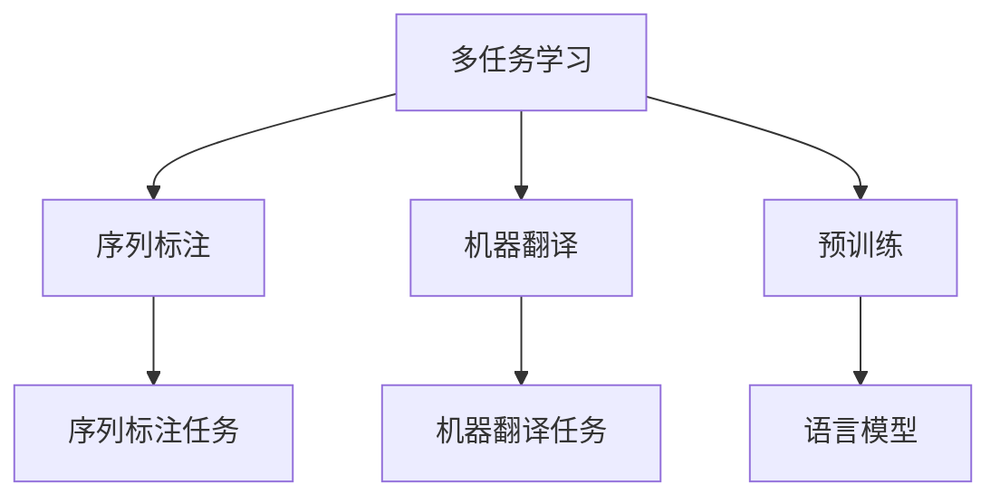

                 

# 多任务学习在NLP中的应用

> 关键词：多任务学习, 自然语言处理(NLP), 预训练, 语言模型, 序列标注, 机器翻译

## 1. 背景介绍

### 1.1 问题由来
自然语言处理（NLP）是人工智能领域中一个非常重要的研究方向，它涉及到对人类语言信息的理解、分析、生成等方面。传统NLP任务如文本分类、命名实体识别、情感分析等，通常需要分别进行单独的训练和模型构建，这种方法不仅需要大量的标注数据和计算资源，而且模型的泛化能力和鲁棒性也会受到一定的限制。多任务学习（Multi-Task Learning, MTL）是一种新兴的机器学习技术，它能够通过共同学习多个相关任务的模型参数，从而提高模型的泛化能力和利用效率。

近年来，基于Transformer等神经网络架构的大语言模型如BERT、GPT等，通过预训练和微调，已经在各种NLP任务上取得了显著的性能提升。然而，这些模型的训练成本高昂，且预训练模型对于特定任务的微调需要重新训练或调整，限制了其应用范围。而多任务学习提供了一种新的思路，即在预训练阶段同时训练多个相关任务，从而在后续微调时只需在少量标注数据上进行调整，达到更快的收敛和更好的效果。

### 1.2 问题核心关键点
多任务学习在NLP中的核心关键点在于：
1. 如何选择合适的多任务学习范式，使得多个任务之间能够相互促进，提升模型的整体性能。
2. 如何在预训练阶段同时训练多个任务，使得模型在后续微调时能够更好地泛化到新的任务。
3. 如何在微调时仅针对新任务进行参数调整，避免对预训练模型的不必要修改。
4. 如何平衡不同任务之间的资源分配，确保每个任务的性能不受其他任务的影响。
5. 如何处理不同任务之间的数据分布不均衡问题，使得模型能够均衡地学习各任务的特征。

## 2. 核心概念与联系

### 2.1 核心概念概述

为更好地理解多任务学习在NLP中的应用，本节将介绍几个密切相关的核心概念：

- 多任务学习（Multi-Task Learning, MTL）：通过共同学习多个相关任务的模型参数，使得模型在多个任务上都有良好的性能表现。
- 序列标注（Sequence Labeling）：对输入序列中的每个位置进行标注，如命名实体识别、词性标注等。
- 机器翻译（Machine Translation, MT）：将一种语言的文本翻译成另一种语言的文本，如神经机器翻译（Neural Machine Translation, NMT）。
- 预训练（Pre-training）：在大规模无标签数据上，通过自监督学习任务训练通用语言模型。
- 语言模型（Language Model, LM）：预测一个序列中下一个词或字的可能性，如基于Transformer的语言模型。

这些核心概念之间的逻辑关系可以通过以下Mermaid流程图来展示：



这个流程图展示了大语言模型在NLP领域的应用流程：

1. 在大规模无标签数据上，通过预训练获得通用语言模型。
2. 在预训练模型的基础上，通过多任务学习范式，同时训练多个相关任务，如序列标注、机器翻译等。
3. 通过微调，针对新任务进行调整，提高模型性能。
4. 在实际应用中，序列标注、机器翻译等任务均可以使用预训练-微调后的模型进行推理。

## 3. 核心算法原理 & 具体操作步骤
### 3.1 算法原理概述

多任务学习的核心思想是，在预训练阶段同时训练多个相关任务，使得模型能够更好地泛化到新的任务上。其基本原理如下：

假设在大规模无标签数据集上预训练的通用语言模型为 $M_{\theta}$，其中 $\theta$ 为模型参数。假设需要训练的多个相关任务为 $T_1, T_2, \ldots, T_n$，其中每个任务 $T_i$ 的标注数据集为 $D_i=\{(x_{i,j}, y_{i,j})\}_{j=1}^{m_i}$。多任务学习的目标是通过最小化损失函数 $\mathcal{L}(\theta)$，使得模型在多个任务上的性能均达到最优：

$$
\mathcal{L}(\theta) = \frac{1}{N} \sum_{i=1}^n \mathcal{L}_i(\theta)
$$

其中 $\mathcal{L}_i(\theta)$ 为任务 $T_i$ 的损失函数，用于衡量模型在 $T_i$ 上的性能。

多任务学习的常见范式包括：
- **串行多任务学习（Serial Multi-Task Learning, SMTL）**：按照一定顺序依次训练每个任务，每个任务之间共享预训练模型。
- **并行多任务学习（Parallel Multi-Task Learning, PMTL）**：同时训练多个任务，每个任务独立更新模型参数。
- **联合多任务学习（Joint Multi-Task Learning, JMTL）**：将多个任务的参数共享，同时更新模型参数，使得所有任务共享模型结构。

### 3.2 算法步骤详解

多任务学习的详细步骤包括：

**Step 1: 准备数据集**
- 收集多个相关任务的标注数据集 $D_i$，并进行预处理，如分词、标记化等。

**Step 2: 设计损失函数**
- 根据具体任务设计损失函数 $\mathcal{L}_i(\theta)$，例如交叉熵损失、均方误差损失等。

**Step 3: 选择多任务学习范式**
- 选择合适的多任务学习范式，如SMTL、PMTL或JMTL。

**Step 4: 设置预训练参数**
- 确定预训练模型的初始化参数，如BERT、GPT等。

**Step 5: 执行多任务学习**
- 使用多任务学习范式，将多个任务的数据集 $D_i$ 作为输入，共同训练预训练模型 $M_{\theta}$。
- 根据选择的范式，设定不同任务的损失权重和更新策略。

**Step 6: 执行微调**
- 使用微调数据集对模型进行微调，如使用训练集、验证集和测试集进行训练和评估。
- 根据微调数据集的性能，调整模型的参数，以提高在新任务上的表现。

**Step 7: 应用和部署**
- 将微调后的模型应用于实际任务中，如序列标注、机器翻译等。
- 实时收集用户反馈和数据，持续优化模型性能。

### 3.3 算法优缺点

多任务学习在NLP中的应用具有以下优点：
1. 数据共享：多个任务共享数据，可以减少数据收集成本。
2. 泛化能力：模型在多个任务上训练，能够更好地泛化到新的任务。
3. 计算效率：通过多任务学习，可以在预训练阶段同时训练多个任务，提高计算效率。

然而，多任务学习也存在一些缺点：
1. 模型复杂性：多任务学习模型通常较为复杂，训练和推理成本较高。
2. 任务间冲突：不同任务之间可能存在冲突，影响模型性能。
3. 资源分配：需要合理分配不同任务之间的资源，避免资源浪费或分配不均。
4. 模型选择：选择合适的多任务学习范式和参数更新策略，需要一定的经验和技术积累。

### 3.4 算法应用领域

多任务学习在NLP中的应用领域非常广泛，包括但不限于以下几个方面：

- **序列标注**：如命名实体识别（Named Entity Recognition, NER）、词性标注（Part-of-Speech Tagging, POS）等。通过多任务学习，同时训练多个序列标注任务，可以提升模型在不同序列标注任务上的性能。
- **机器翻译**：如神经机器翻译（Neural Machine Translation, NMT）。多任务学习可以帮助模型学习不同语言之间的映射关系，提升翻译质量。
- **文本生成**：如摘要生成、对话生成等。通过多任务学习，模型可以同时训练生成任务和分类任务，提升生成质量。
- **情感分析**：如情感分类、情感表示学习等。多任务学习可以同时训练情感分类任务和情感表示任务，提升模型对情感的感知能力。
- **问答系统**：如问答生成、知识图谱嵌入等。多任务学习可以同时训练问答生成任务和知识图谱嵌入任务，提升系统的理解和回答能力。

## 4. 数学模型和公式 & 详细讲解  
### 4.1 数学模型构建

我们以多任务学习在序列标注中的应用为例，介绍其数学模型的构建。

假设需要同时训练的多个序列标注任务为 $T_1, T_2, \ldots, T_n$，其中 $T_i$ 的标注数据集为 $D_i=\{(x_{i,j}, y_{i,j})\}_{j=1}^{m_i}$。任务 $T_i$ 的损失函数为 $\mathcal{L}_i(\theta)$，则多任务学习的损失函数为：

$$
\mathcal{L}(\theta) = \frac{1}{N} \sum_{i=1}^n \mathcal{L}_i(\theta)
$$

其中 $N$ 为总样本数，$M_{\theta}(x_{i,j})$ 为预训练模型在输入 $x_{i,j}$ 上的输出，$y_{i,j}$ 为真实标签。

## 4.2 公式推导过程

以BERT模型为例，其在预训练阶段采用的掩码语言模型（Masked Language Model, MLM）和下一句预测（Next Sentence Prediction, NSP）任务可以视为两个多任务学习的任务。在微调阶段，假设需要同时训练的序列标注任务为命名实体识别（NER），则可以通过以下公式对BERT模型进行多任务学习：

$$
\mathcal{L}_{BERT} = \frac{1}{N} \sum_{i=1}^2 \mathcal{L}_i(\theta)
$$

其中 $\mathcal{L}_1(\theta)$ 为掩码语言模型损失函数，$\mathcal{L}_2(\theta)$ 为下一句预测损失函数，$n=2$。

在微调阶段，我们通过添加任务适配层，将BERT模型的输出转换为序列标注任务的输出。假设任务 $T_i$ 的标签空间为 $C_i$，任务适配层为 $F_i$，则微调后的模型输出为：

$$
M_{\theta}(x_{i,j}) = F_i(M_{\theta}(x_{i,j}))
$$

通过上述多任务学习范式和微调过程，我们可以在大规模无标签数据上训练出性能优异的BERT模型，并在序列标注任务上进行微调，获得良好的效果。

## 5. 项目实践：代码实例和详细解释说明
### 5.1 开发环境搭建

在进行多任务学习实践前，我们需要准备好开发环境。以下是使用Python进行PyTorch开发的环境配置流程：

1. 安装Anaconda：从官网下载并安装Anaconda，用于创建独立的Python环境。

2. 创建并激活虚拟环境：
```bash
conda create -n pytorch-env python=3.8 
conda activate pytorch-env
```

3. 安装PyTorch：根据CUDA版本，从官网获取对应的安装命令。例如：
```bash
conda install pytorch torchvision torchaudio cudatoolkit=11.1 -c pytorch -c conda-forge
```

4. 安装Transformer库：
```bash
pip install transformers
```

5. 安装各类工具包：
```bash
pip install numpy pandas scikit-learn matplotlib tqdm jupyter notebook ipython
```

完成上述步骤后，即可在`pytorch-env`环境中开始多任务学习实践。

### 5.2 源代码详细实现

下面我们以BERT模型在序列标注任务上的多任务学习为例，给出使用Transformers库的PyTorch代码实现。

首先，定义序列标注任务的损失函数：

```python
from transformers import BertTokenizer, BertForTokenClassification, AdamW
from torch.utils.data import Dataset
import torch

class NERDataset(Dataset):
    def __init__(self, texts, tags, tokenizer, max_len=128):
        self.texts = texts
        self.tags = tags
        self.tokenizer = tokenizer
        self.max_len = max_len
        
    def __len__(self):
        return len(self.texts)
    
    def __getitem__(self, item):
        text = self.texts[item]
        tags = self.tags[item]
        
        encoding = self.tokenizer(text, return_tensors='pt', max_length=self.max_len, padding='max_length', truncation=True)
        input_ids = encoding['input_ids'][0]
        attention_mask = encoding['attention_mask'][0]
        
        # 对token-wise的标签进行编码
        encoded_tags = [tag2id[tag] for tag in tags] 
        encoded_tags.extend([tag2id['O']] * (self.max_len - len(encoded_tags)))
        labels = torch.tensor(encoded_tags, dtype=torch.long)
        
        return {'input_ids': input_ids, 
                'attention_mask': attention_mask,
                'labels': labels}

# 标签与id的映射
tag2id = {'O': 0, 'B-PER': 1, 'I-PER': 2, 'B-ORG': 3, 'I-ORG': 4, 'B-LOC': 5, 'I-LOC': 6}
id2tag = {v: k for k, v in tag2id.items()}

# 创建dataset
tokenizer = BertTokenizer.from_pretrained('bert-base-cased')

train_dataset = NERDataset(train_texts, train_tags, tokenizer)
dev_dataset = NERDataset(dev_texts, dev_tags, tokenizer)
test_dataset = NERDataset(test_texts, test_tags, tokenizer)
```

然后，定义模型和优化器：

```python
from transformers import BertForTokenClassification, AdamW

model = BertForTokenClassification.from_pretrained('bert-base-cased', num_labels=len(tag2id))

optimizer = AdamW(model.parameters(), lr=2e-5)
```

接着，定义训练和评估函数：

```python
from torch.utils.data import DataLoader
from tqdm import tqdm
from sklearn.metrics import classification_report

device = torch.device('cuda') if torch.cuda.is_available() else torch.device('cpu')
model.to(device)

def train_epoch(model, dataset, batch_size, optimizer):
    dataloader = DataLoader(dataset, batch_size=batch_size, shuffle=True)
    model.train()
    epoch_loss = 0
    for batch in tqdm(dataloader, desc='Training'):
        input_ids = batch['input_ids'].to(device)
        attention_mask = batch['attention_mask'].to(device)
        labels = batch['labels'].to(device)
        model.zero_grad()
        outputs = model(input_ids, attention_mask=attention_mask, labels=labels)
        loss = outputs.loss
        epoch_loss += loss.item()
        loss.backward()
        optimizer.step()
    return epoch_loss / len(dataloader)

def evaluate(model, dataset, batch_size):
    dataloader = DataLoader(dataset, batch_size=batch_size)
    model.eval()
    preds, labels = [], []
    with torch.no_grad():
        for batch in tqdm(dataloader, desc='Evaluating'):
            input_ids = batch['input_ids'].to(device)
            attention_mask = batch['attention_mask'].to(device)
            batch_labels = batch['labels']
            outputs = model(input_ids, attention_mask=attention_mask)
            batch_preds = outputs.logits.argmax(dim=2).to('cpu').tolist()
            batch_labels = batch_labels.to('cpu').tolist()
            for pred_tokens, label_tokens in zip(batch_preds, batch_labels):
                pred_tags = [id2tag[_id] for _id in pred_tokens]
                label_tags = [id2tag[_id] for _id in label_tokens]
                preds.append(pred_tags[:len(label_tags)])
                labels.append(label_tags)
                
    print(classification_report(labels, preds))
```

最后，启动训练流程并在测试集上评估：

```python
epochs = 5
batch_size = 16

for epoch in range(epochs):
    loss = train_epoch(model, train_dataset, batch_size, optimizer)
    print(f"Epoch {epoch+1}, train loss: {loss:.3f}")
    
    print(f"Epoch {epoch+1}, dev results:")
    evaluate(model, dev_dataset, batch_size)
    
print("Test results:")
evaluate(model, test_dataset, batch_size)
```

以上就是使用PyTorch对BERT模型进行序列标注任务的多任务学习代码实现。可以看到，通过添加任务适配层，我们可以将BERT模型应用于序列标注任务，并在多个任务上同时进行训练和微调，提升模型性能。

### 5.3 代码解读与分析

让我们再详细解读一下关键代码的实现细节：

**NERDataset类**：
- `__init__`方法：初始化文本、标签、分词器等关键组件。
- `__len__`方法：返回数据集的样本数量。
- `__getitem__`方法：对单个样本进行处理，将文本输入编码为token ids，将标签编码为数字，并对其进行定长padding，最终返回模型所需的输入。

**tag2id和id2tag字典**：
- 定义了标签与数字id之间的映射关系，用于将token-wise的预测结果解码回真实的标签。

**训练和评估函数**：
- 使用PyTorch的DataLoader对数据集进行批次化加载，供模型训练和推理使用。
- 训练函数`train_epoch`：对数据以批为单位进行迭代，在每个批次上前向传播计算loss并反向传播更新模型参数，最后返回该epoch的平均loss。
- 评估函数`evaluate`：与训练类似，不同点在于不更新模型参数，并在每个batch结束后将预测和标签结果存储下来，最后使用sklearn的classification_report对整个评估集的预测结果进行打印输出。

**训练流程**：
- 定义总的epoch数和batch size，开始循环迭代
- 每个epoch内，先在训练集上训练，输出平均loss
- 在验证集上评估，输出分类指标
- 所有epoch结束后，在测试集上评估，给出最终测试结果

可以看到，PyTorch配合Transformers库使得BERT多任务学习的代码实现变得简洁高效。开发者可以将更多精力放在数据处理、模型改进等高层逻辑上，而不必过多关注底层的实现细节。

当然，工业级的系统实现还需考虑更多因素，如模型的保存和部署、超参数的自动搜索、更灵活的任务适配层等。但核心的多任务学习范式基本与此类似。

## 6. 实际应用场景
### 6.1 智能客服系统

基于多任务学习的大语言模型，可以广泛应用于智能客服系统的构建。传统客服往往需要配备大量人力，高峰期响应缓慢，且一致性和专业性难以保证。而使用多任务学习的大语言模型，可以同时训练命名实体识别、情感分析等多个相关任务，提升客服系统的综合能力。

在技术实现上，可以收集企业内部的历史客服对话记录，将问题和最佳答复构建成监督数据，在此基础上对多任务学习的模型进行预训练。预训练后的模型能够自动理解用户意图，匹配最合适的答案模板进行回复。对于客户提出的新问题，还可以接入检索系统实时搜索相关内容，动态组织生成回答。如此构建的智能客服系统，能大幅提升客户咨询体验和问题解决效率。

### 6.2 金融舆情监测

金融机构需要实时监测市场舆论动向，以便及时应对负面信息传播，规避金融风险。传统的人工监测方式成本高、效率低，难以应对网络时代海量信息爆发的挑战。基于多任务学习的文本分类和情感分析技术，为金融舆情监测提供了新的解决方案。

具体而言，可以收集金融领域相关的新闻、报道、评论等文本数据，并对其进行主题标注和情感标注。在此基础上对多任务学习的模型进行预训练，使其能够自动判断文本属于何种主题，情感倾向是正面、中性还是负面。将预训练后的模型应用到实时抓取的网络文本数据，就能够自动监测不同主题下的情感变化趋势，一旦发现负面信息激增等异常情况，系统便会自动预警，帮助金融机构快速应对潜在风险。

### 6.3 个性化推荐系统

当前的推荐系统往往只依赖用户的历史行为数据进行物品推荐，无法深入理解用户的真实兴趣偏好。基于多任务学习的大语言模型可以更好地挖掘用户行为背后的语义信息，从而提供更精准、多样的推荐内容。

在实践中，可以收集用户浏览、点击、评论、分享等行为数据，提取和用户交互的物品标题、描述、标签等文本内容。将文本内容作为模型输入，用户的后续行为（如是否点击、购买等）作为监督信号，在此基础上预训练多任务学习的模型。预训练后的模型能够从文本内容中准确把握用户的兴趣点。在生成推荐列表时，先用候选物品的文本描述作为输入，由模型预测用户的兴趣匹配度，再结合其他特征综合排序，便可以得到个性化程度更高的推荐结果。

### 6.4 未来应用展望

随着多任务学习在NLP领域的研究进展，基于多任务学习的大语言模型将在更多领域得到应用，为传统行业带来变革性影响。

在智慧医疗领域，基于多任务学习的大语言模型可以同时训练医学问答、病历分析、药物研发等任务，提升医疗服务的智能化水平，辅助医生诊疗，加速新药开发进程。

在智能教育领域，多任务学习的大语言模型可应用于作业批改、学情分析、知识推荐等方面，因材施教，促进教育公平，提高教学质量。

在智慧城市治理中，多任务学习的大语言模型可应用于城市事件监测、舆情分析、应急指挥等环节，提高城市管理的自动化和智能化水平，构建更安全、高效的未来城市。

此外，在企业生产、社会治理、文娱传媒等众多领域，基于多任务学习的大语言模型也将不断涌现，为传统行业数字化转型升级提供新的技术路径。相信随着技术的日益成熟，多任务学习技术将成为NLP领域的重要范式，推动人工智能技术进一步渗透到各行各业。

## 7. 工具和资源推荐
### 7.1 学习资源推荐

为了帮助开发者系统掌握多任务学习在NLP中的理论和实践，这里推荐一些优质的学习资源：

1. 《多任务学习在NLP中的应用》系列博文：由大模型技术专家撰写，深入浅出地介绍了多任务学习原理、实践案例和前沿方向。

2. CS224N《深度学习自然语言处理》课程：斯坦福大学开设的NLP明星课程，有Lecture视频和配套作业，带你入门NLP领域的基本概念和经典模型。

3. 《Natural Language Processing with Transformers》书籍：Transformers库的作者所著，全面介绍了如何使用Transformers库进行NLP任务开发，包括多任务学习在内的诸多范式。

4. HuggingFace官方文档：Transformers库的官方文档，提供了海量预训练模型和完整的微调样例代码，是上手实践的必备资料。

5. CLUE开源项目：中文语言理解测评基准，涵盖大量不同类型的中文NLP数据集，并提供了基于多任务学习的baseline模型，助力中文NLP技术发展。

通过对这些资源的学习实践，相信你一定能够快速掌握多任务学习在NLP中的精髓，并用于解决实际的NLP问题。
###  7.2 开发工具推荐

高效的开发离不开优秀的工具支持。以下是几款用于多任务学习开发的常用工具：

1. PyTorch：基于Python的开源深度学习框架，灵活动态的计算图，适合快速迭代研究。大部分预训练语言模型都有PyTorch版本的实现。

2. TensorFlow：由Google主导开发的开源深度学习框架，生产部署方便，适合大规模工程应用。同样有丰富的预训练语言模型资源。

3. Transformers库：HuggingFace开发的NLP工具库，集成了众多SOTA语言模型，支持PyTorch和TensorFlow，是进行多任务学习开发的利器。

4. Weights & Biases：模型训练的实验跟踪工具，可以记录和可视化模型训练过程中的各项指标，方便对比和调优。与主流深度学习框架无缝集成。

5. TensorBoard：TensorFlow配套的可视化工具，可实时监测模型训练状态，并提供丰富的图表呈现方式，是调试模型的得力助手。

6. Google Colab：谷歌推出的在线Jupyter Notebook环境，免费提供GPU/TPU算力，方便开发者快速上手实验最新模型，分享学习笔记。

合理利用这些工具，可以显著提升多任务学习任务的开发效率，加快创新迭代的步伐。

### 7.3 相关论文推荐

多任务学习在NLP中的应用源于学界的持续研究。以下是几篇奠基性的相关论文，推荐阅读：

1. Improving Language Understanding by Generative Pre-Training：BERT模型提出者开发的预训练语言模型，通过掩码语言模型和下一句预测任务进行多任务学习，刷新了多项NLP任务SOTA。

2. Sequence to Sequence Learning with Neural Networks：提出使用Seq2Seq模型进行序列到序列的翻译任务，为神经机器翻译提供了基础。

3. Multi-Task Learning using Prediction Tasks：提出一种基于预测任务的多任务学习范式，通过多个预测任务的共享参数进行多任务学习。

4. Learning from Multiple Tasks with Exemplar Input Representation：提出使用多任务学习进行序列标注任务，并通过示例输入表示进行任务适配，提高模型的泛化能力。

5. Transformer-XL: Attentive Language Models beyond a Fixed-Length Context：提出使用Transformer-XL进行长文本生成任务，并通过多任务学习进行文本分类和生成任务的多模态融合。

这些论文代表了大语言模型多任务学习的发展脉络。通过学习这些前沿成果，可以帮助研究者把握学科前进方向，激发更多的创新灵感。

## 8. 总结：未来发展趋势与挑战

### 8.1 总结

本文对多任务学习在NLP中的应用进行了全面系统的介绍。首先阐述了多任务学习的背景和意义，明确了其在NLP中的独特价值。其次，从原理到实践，详细讲解了多任务学习的数学原理和关键步骤，给出了多任务学习任务开发的完整代码实例。同时，本文还广泛探讨了多任务学习在智能客服、金融舆情、个性化推荐等多个行业领域的应用前景，展示了多任务学习范式的巨大潜力。此外，本文精选了多任务学习技术的各类学习资源，力求为读者提供全方位的技术指引。

通过本文的系统梳理，可以看到，多任务学习在NLP领域的应用前景广阔，通过同时训练多个相关任务，可以显著提升模型的泛化能力和计算效率。然而，多任务学习也面临诸多挑战，如数据共享、任务冲突、资源分配等，这些问题需要在实际应用中逐步解决。未来，多任务学习有望成为NLP技术的重要范式，推动人工智能技术进一步渗透到各行各业。

### 8.2 未来发展趋势

展望未来，多任务学习在NLP中的应用将呈现以下几个发展趋势：

1. 多任务学习的规模化：随着模型参数量的增加和任务数量的增多，多任务学习的应用场景将更加广泛。超大模型的多任务学习将带来更强的泛化能力和更高效的计算效率。

2. 多任务学习的网络结构优化：未来的多任务学习模型将更多地使用模块化、层次化的结构，提高模型参数的共享和复用率，减少计算成本。

3. 多任务学习的跨模态融合：将多任务学习应用于多模态数据融合，提升模型的跨模态学习能力和多模态数据处理能力。

4. 多任务学习与因果推断的结合：通过引入因果推断方法，多任务学习将能够更好地学习因果关系，提升模型的稳定性和鲁棒性。

5. 多任务学习的跨领域迁移：未来的多任务学习模型将能够更好地适应不同领域的数据分布，提升模型的跨领域迁移能力。

6. 多任务学习与强化学习的结合：多任务学习与强化学习的结合，将能够更好地处理复杂序列预测和决策优化问题。

以上趋势凸显了多任务学习在NLP领域的应用前景。这些方向的探索发展，必将进一步提升NLP系统的性能和应用范围，为人工智能技术在更多领域的应用奠定基础。

### 8.3 面临的挑战

尽管多任务学习在NLP中的应用已经取得了一定的进展，但在迈向更加智能化、普适化应用的过程中，它仍面临着诸多挑战：

1. 数据共享问题：多任务学习模型需要同时训练多个任务，而数据分布可能存在不均衡，导致某些任务无法充分利用数据。如何平衡不同任务之间的数据需求，是一个亟待解决的问题。

2. 模型复杂性：多任务学习模型通常较为复杂，训练和推理成本较高。如何设计轻量级的多任务学习模型，降低计算成本，是一个重要的研究方向。

3. 任务冲突问题：不同任务之间可能存在冲突，影响模型性能。如何通过合理设计任务损失函数和更新策略，确保模型在多个任务上的性能，是一个关键问题。

4. 资源分配问题：多任务学习模型需要同时训练多个任务，资源分配策略直接影响模型的性能。如何优化资源分配，避免资源浪费，是一个需要深入研究的课题。

5. 模型泛化能力：多任务学习模型需要在多个任务上同时泛化，如何提高模型的泛化能力，避免过拟合，是一个重要的研究方向。

6. 多任务学习模型的可解释性：多任务学习模型通常具有较高的复杂性，如何提高模型的可解释性，使其决策过程透明化，是一个亟待解决的问题。

7. 多任务学习模型的安全性：多任务学习模型可能学习到有偏见、有害的信息，如何保障模型的安全性，避免恶意用途，是一个重要的研究方向。

这些挑战需要研究者不断探索和突破，以确保多任务学习技术能够更好地应用于实际场景，推动人工智能技术的发展。

### 8.4 研究展望

面对多任务学习面临的诸多挑战，未来的研究需要在以下几个方面寻求新的突破：

1. 探索多任务学习的新范式：研究更高效、更鲁棒的多任务学习范式，如因果推断、主动学习等，提升多任务学习的性能和鲁棒性。

2. 研究多任务学习的新算法：开发更高效、更稳定、更可解释的多任务学习算法，如注意力机制、自适应学习率等，提升多任务学习的可解释性和泛化能力。

3. 研究多任务学习的新方法：研究新的多任务学习优化方法，如模型裁剪、量化加速等，提升多任务学习的计算效率和模型性能。

4. 研究多任务学习的新应用：将多任务学习应用于新的应用场景，如金融舆情、个性化推荐、智慧医疗等，提升这些领域的多任务学习能力和应用水平。

5. 研究多任务学习的新技术：研究新的多任务学习技术，如多任务学习与强化学习结合、跨模态融合等，推动多任务学习技术在更多领域的应用。

这些研究方向的探索，必将引领多任务学习技术迈向更高的台阶，为人工智能技术的发展注入新的动力。相信随着学界和产业界的共同努力，多任务学习技术将成为NLP领域的重要范式，推动人工智能技术进一步渗透到各行各业。

## 9. 附录：常见问题与解答

**Q1：多任务学习在NLP中如何处理不同任务之间的数据不均衡问题？**

A: 处理不同任务之间的数据不均衡问题，可以通过以下几种方法：

1. 数据增强：对少数任务的数据进行数据增强，增加样本数量，平衡不同任务的数据量。

2. 任务自适应：通过调整任务之间的权重，使得模型能够根据不同任务的数据量自适应调整，平衡不同任务的重要性。

3. 多任务学习的新范式：引入新的多任务学习范式，如因果推断、主动学习等，通过更高效的数据利用方式，平衡不同任务的数据需求。

4. 多任务学习的新算法：开发新的多任务学习算法，如自适应学习率、注意力机制等，通过更智能的参数更新策略，平衡不同任务的数据量。

以上方法需要根据具体任务和数据特点进行灵活组合，只有在数据、模型、训练、推理等各环节进行全面优化，才能最大限度地发挥多任务学习的优势。

**Q2：多任务学习在NLP中如何进行多任务学习参数共享？**

A: 多任务学习参数共享是指在预训练阶段同时训练多个相关任务，使得模型能够更好地泛化到新的任务上。具体实现方法如下：

1. 选择多任务学习范式：根据具体任务选择合适的多任务学习范式，如SMTL、PMTL或JMTL。

2. 共享预训练参数：在预训练阶段，使用多任务学习范式，将多个任务的参数共享，共同训练预训练模型。

3. 添加任务适配层：在微调阶段，为每个任务添加适配层，将预训练模型输出转换为该任务所需的输出格式。

4. 更新参数：在微调阶段，只更新新任务相关参数，保留预训练模型的大部分参数不变，避免对预训练模型的不必要修改。

5. 平衡任务权重：根据不同任务的复杂度、数据量等因素，调整任务之间的权重，确保模型在多个任务上的性能。

通过上述方法，可以在预训练阶段同时训练多个相关任务，并在微调时仅针对新任务进行调整，提升模型性能。

**Q3：多任务学习在NLP中如何进行多任务学习的训练和推理？**

A: 多任务学习的训练和推理过程与单任务学习类似，但需要额外考虑多个任务的损失函数和参数更新策略。具体实现方法如下：

1. 数据集划分：将数据集按照任务进行划分，每个任务的数据集作为模型训练的数据。

2. 定义损失函数：根据具体任务定义损失函数，多个任务的损失函数加权求和。

3. 选择多任务学习范式：根据具体任务选择合适的多任务学习范式，如SMTL、PMTL或JMTL。

4. 训练模型：使用多任务学习范式，同时训练多个任务，每个任务的数据集作为模型训练的数据。

5. 微调模型：在微调阶段，只针对新任务进行调整，保留预训练模型的大部分参数不变。

6. 推理预测：在推理阶段，根据输入数据和任务，选择相应的任务适配层进行推理预测。

通过上述方法，可以在预训练阶段同时训练多个相关任务，并在微调时仅针对新任务进行调整，提升模型性能。

**Q4：多任务学习在NLP中如何提高模型的泛化能力？**

A: 提高多任务学习的泛化能力，可以通过以下几种方法：

1. 数据增强：对少数任务的数据进行数据增强，增加样本数量，平衡不同任务的数据量。

2. 正则化技术：使用L2正则、Dropout、Early Stopping等正则化技术，防止模型过度拟合，提升泛化能力。

3. 多任务学习的新范式：引入新的多任务学习范式，如因果推断、主动学习等，通过更高效的数据利用方式，提升模型的泛化能力。

4. 多任务学习的新算法：开发新的多任务学习算法，如自适应学习率、注意力机制等，通过更智能的参数更新策略，提升模型的泛化能力。

5. 多任务学习的新技术：研究新的多任务学习技术，如多任务学习与强化学习结合、跨模态融合等，提升模型的泛化能力。

通过上述方法，可以在预训练阶段同时训练多个相关任务，并在微调时仅针对新任务进行调整，提升模型性能。

---

作者：禅与计算机程序设计艺术 / Zen and the Art of Computer Programming

