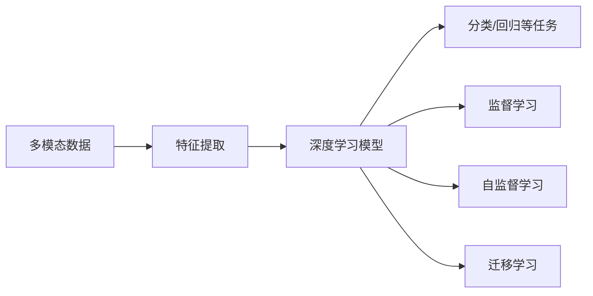

                 

# 多模态AI应用：图像、音频和视频处理技术

> 关键词：多模态AI, 图像处理, 音频处理, 视频处理, 特征提取, 深度学习

## 1. 背景介绍

在当今数字化的社会中，图像、音频和视频数据无处不在，成为了信息获取的主要形式之一。随着深度学习技术的发展，人工智能在图像、音频和视频处理领域取得了显著进展，并逐步走向多模态AI应用。多模态AI是指融合多种类型数据（如文本、图像、音频、视频等）的人工智能应用，它能够更全面地理解和处理真实世界的复杂信息，适用于许多实际场景，如智能监控、自动驾驶、虚拟现实等。

本文章将从背景介绍开始，详细介绍多模态AI应用的核心概念、核心算法原理和操作步骤，并结合实际应用场景，展示多模态AI在图像、音频和视频处理技术中的应用。同时，我们还将会探讨当前技术面临的挑战和未来发展趋势，为读者提供关于多模态AI的全面视角。

## 2. 核心概念与联系

### 2.1 核心概念概述

在多模态AI中，数据类型的多样性带来了新的挑战和机遇。以下是几个与多模态AI应用密切相关的核心概念：

- **多模态数据（Multi-modal Data）**：指融合了多种类型数据（如图像、音频、文本等）的综合数据集。这些数据通过不同的感知方式（视觉、听觉、文本）记录真实世界的信息。
- **特征提取（Feature Extraction）**：将原始多模态数据转化为机器可以理解的特征向量的过程。特征提取是深度学习处理多模态数据的基础。
- **深度学习（Deep Learning）**：一种基于多层神经网络的机器学习技术，能够自动从数据中提取复杂特征，适用于多模态数据的处理和建模。
- **迁移学习（Transfer Learning）**：利用在一个领域上学习到的知识，应用于另一个相关领域的学习过程，以减少在新任务上的学习负担。

这些概念通过深度学习框架进行整合，可以用于处理和分析多模态数据，实现高效、精确的人工智能应用。

### 2.2 核心概念原理和架构的 Mermaid 流程图



以上流程图展示了多模态数据从原始输入到任务输出的整体处理流程。多模态数据首先经过特征提取，转换成机器可以理解的特征向量。这些特征向量接着输入深度学习模型进行进一步处理，最终输出模型任务的结果。在处理过程中，可以采用监督学习、自监督学习或迁移学习等方法进行模型训练。

## 3. 核心算法原理 & 具体操作步骤

### 3.1 算法原理概述

多模态AI的核心算法原理是深度学习，通过多层神经网络提取和融合多模态数据中的特征，实现复杂任务的处理和分析。深度学习模型通常包括卷积神经网络（CNN）、循环神经网络（RNN）、长短时记忆网络（LSTM）、Transformer等。

在多模态数据处理中，特征提取是一个重要的步骤。特征提取方法包括但不限于：

- **视觉特征提取**：如使用CNN从图像中提取像素级特征。
- **音频特征提取**：如使用MFCC（Mel频率倒谱系数）、时频图像等方法从音频中提取特征。
- **文本特征提取**：如使用词向量（Word Embedding）或BERT模型从文本中提取语义特征。
- **联合特征提取**：通过结合不同类型数据的特征，实现更全面的表示。

### 3.2 算法步骤详解

多模态AI的算法步骤通常包括以下几个主要环节：

1. **数据预处理**：包括数据清洗、归一化、数据增强等步骤。
2. **特征提取**：将多模态数据转化为高维特征向量。
3. **模型训练**：使用深度学习模型对提取的特征进行训练。
4. **模型评估和优化**：在验证集和测试集上评估模型性能，进行超参数调整。
5. **模型部署和应用**：将训练好的模型部署到实际应用场景中，进行推理和预测。

以下是一个详细的步骤说明：

- **步骤1：数据预处理**：确保数据集的一致性和准确性，为模型训练做准备。
- **步骤2：特征提取**：通过预定义的特征提取方法，将原始多模态数据转化为模型所需的输入。
- **步骤3：模型训练**：选择合适的深度学习模型，并根据任务需求进行训练。
- **步骤4：模型评估**：在验证集上评估模型性能，调整超参数，确保模型具有较好的泛化能力。
- **步骤5：模型优化和应用**：在测试集上进一步验证模型性能，并进行模型部署和应用。

### 3.3 算法优缺点

多模态AI算法具有以下优点：

- **全面性**：可以同时利用多种类型的数据，更全面地理解现实世界的复杂信息。
- **鲁棒性**：不同类型的数据可以相互验证和补充，提高系统的鲁棒性和可靠性。
- **高效性**：多模态数据可以同时输入深度学习模型进行处理，提高计算效率。

然而，多模态AI算法也存在一些缺点：

- **复杂性**：多模态数据融合和处理过程复杂，需要考虑不同数据类型之间的协同和转换。
- **计算成本高**：处理和训练多模态数据通常需要较大的计算资源和时间。
- **数据依赖性强**：多模态数据的质量和多样性对模型性能有重要影响。

### 3.4 算法应用领域

多模态AI已经在多个领域取得了应用，包括但不限于：

- **智能监控**：融合图像、音频和文本数据，实现实时监控和异常检测。
- **自动驾驶**：通过整合视觉、激光雷达和雷达数据，实现环境感知和路径规划。
- **虚拟现实**：结合视觉、听觉和触觉信息，构建沉浸式的虚拟环境。
- **健康医疗**：综合图像、声音和文本数据，辅助疾病诊断和治疗决策。
- **安防系统**：通过融合视频、音频和行为数据，实现更高效的安防监控。
- **智慧城市**：集成多种类型数据，提升城市管理的智能化水平。

## 4. 数学模型和公式 & 详细讲解 & 举例说明

### 4.1 数学模型构建

在多模态AI中，常用的数学模型包括：

- **卷积神经网络（CNN）**：用于图像特征提取和分类任务，模型结构包含卷积层、池化层和全连接层。
- **循环神经网络（RNN）**：用于序列数据的建模，如文本和音频。
- **长短时记忆网络（LSTM）**：一种特殊的RNN，用于处理长序列数据。
- **Transformer模型**：用于处理文本和序列数据，具有高效的自注意力机制。

### 4.2 公式推导过程

以卷积神经网络为例，其基本公式如下：

$$
y = W*x + b
$$

其中，$y$表示输出特征，$x$表示输入特征，$W$表示卷积核，$b$表示偏置项。在卷积层中，卷积核$W$会在输入特征$x$上滑动，通过计算每一个位置的加权和，生成新的特征$y$。

### 4.3 案例分析与讲解

假设有一个多模态数据集，包含图像、音频和文本数据。我们可以使用卷积神经网络提取图像特征，循环神经网络提取音频特征，使用BERT模型提取文本特征。通过联合训练这些特征，可以构建一个多模态AI系统，用于人脸识别任务。

以下是一个简单的代码示例，用于展示多模态数据处理和模型训练的过程：

```python
import torch
import torch.nn as nn
import torchvision.transforms as transforms
from torch.utils.data import DataLoader
from transformers import BertForTokenClassification, BertTokenizer

# 数据预处理
transform = transforms.Compose([transforms.Resize((224, 224)), transforms.ToTensor()])
train_dataset = torchvision.datasets.ImageFolder(root='path/to/train', transform=transform)
train_loader = DataLoader(train_dataset, batch_size=32, shuffle=True)

# 图像特征提取
model = torchvision.models.resnet18(pretrained=True)
for param in model.parameters():
    param.requires_grad = False

# 添加分类器
num_classes = 10
model.fc = nn.Linear(model.fc.in_features, num_classes)

# 模型训练
criterion = nn.CrossEntropyLoss()
optimizer = torch.optim.Adam(model.fc.parameters(), lr=0.001)
device = torch.device('cuda' if torch.cuda.is_available() else 'cpu')
model.to(device)

for epoch in range(10):
    model.train()
    for images, labels in train_loader:
        images = images.to(device)
        labels = labels.to(device)
        optimizer.zero_grad()
        outputs = model(images)
        loss = criterion(outputs, labels)
        loss.backward()
        optimizer.step()

# 特征提取
tokenizer = BertTokenizer.from_pretrained('bert-base-uncased')
model = BertForTokenClassification.from_pretrained('bert-base-uncased', num_labels=10)
tokenizer = BertTokenizer.from_pretrained('bert-base-uncased')

def extract_text_features(texts):
    features = []
    for text in texts:
        tokens = tokenizer.encode(text, add_special_tokens=True)
        features.append(tokens)
    return features

# 音频特征提取
# TODO: Implement audio feature extraction

# 多模态特征融合
# TODO: Implement multi-modal feature fusion
```

## 5. 项目实践：代码实例和详细解释说明

### 5.1 开发环境搭建

在开始多模态AI项目之前，需要搭建好开发环境。以下是常用工具和库的安装步骤：

1. **Python环境**：使用Anaconda或Miniconda创建Python虚拟环境，安装必要的Python库。
2. **深度学习框架**：安装TensorFlow、PyTorch或Keras等深度学习框架，用于模型训练和推理。
3. **特征提取库**：安装OpenCV、librosa、SpeechRecognition等库，用于图像、音频和文本特征提取。
4. **数据集处理库**：安装Pandas、NumPy等库，用于数据预处理和特征处理。

### 5.2 源代码详细实现

以下是一个多模态AI项目的示例代码，包括图像、音频和文本数据处理、模型训练和推理等步骤：

```python
import torch
import torch.nn as nn
import torchvision.transforms as transforms
from torch.utils.data import DataLoader
from transformers import BertForTokenClassification, BertTokenizer
import librosa
import numpy as np

# 图像特征提取
class ImageProcessor(nn.Module):
    def __init__(self):
        super(ImageProcessor, self).__init__()
        self.transform = transforms.Compose([transforms.Resize((224, 224)), transforms.ToTensor()])
    
    def forward(self, images):
        return self.transform(images)

# 音频特征提取
def extract_audio_features(audio_paths):
    features = []
    for audio_path in audio_paths:
        y, sr = librosa.load(audio_path, sr=44100)
        mfcc = librosa.feature.mfcc(y, sr=sr)
        features.append(mfcc)
    return features

# 文本特征提取
class TextProcessor(nn.Module):
    def __init__(self):
        super(TextProcessor, self).__init__()
        self.tokenizer = BertTokenizer.from_pretrained('bert-base-uncased')
    
    def forward(self, texts):
        tokens = self.tokenizer(texts, return_tensors='pt', padding='max_length', truncation=True)
        return tokens['input_ids']

# 多模态特征融合
class MultiModalFeature(nn.Module):
    def __init__(self, image_size, audio_size, text_size):
        super(MultiModalFeature, self).__init__()
        self.image_processor = ImageProcessor(image_size)
        self.audio_processor = TextProcessor(audio_size)
        self.text_processor = TextProcessor(text_size)
    
    def forward(self, images, audio_paths, texts):
        images = self.image_processor(images)
        audio_features = extract_audio_features(audio_paths)
        text_features = self.text_processor(texts)
        return images, audio_features, text_features

# 深度学习模型
class MultiModalModel(nn.Module):
    def __init__(self):
        super(MultiModalModel, self).__init__()
        self.feature_extractor = MultiModalFeature(image_size=224, audio_size=40, text_size=768)
        self.classifier = nn.Linear(128, 10)
    
    def forward(self, images, audio_features, text_features):
        features = torch.cat((features), dim=1)
        features = self.classifier(features)
        return features

# 模型训练
def train_model(model, train_loader, criterion, optimizer, device):
    model.train()
    for images, audio_paths, texts, labels in train_loader:
        images = images.to(device)
        audio_paths = audio_paths.to(device)
        texts = texts.to(device)
        labels = labels.to(device)
        optimizer.zero_grad()
        outputs = model(images, audio_paths, texts)
        loss = criterion(outputs, labels)
        loss.backward()
        optimizer.step()

# 模型评估
def evaluate_model(model, test_loader, criterion, device):
    model.eval()
    correct = 0
    total = 0
    with torch.no_grad():
        for images, audio_paths, texts, labels in test_loader:
            images = images.to(device)
            audio_paths = audio_paths.to(device)
            texts = texts.to(device)
            labels = labels.to(device)
            outputs = model(images, audio_paths, texts)
            _, predicted = torch.max(outputs.data, 1)
            total += labels.size(0)
            correct += (predicted == labels).sum().item()
    accuracy = 100 * correct / total
    return accuracy
```

### 5.3 代码解读与分析

**ImageProcessor类**：用于图像特征提取和预处理。通过定义`transform`方法，实现图像的尺寸调整和归一化。

**extract_audio_features函数**：用于音频特征提取，利用librosa库计算MFCC特征。

**TextProcessor类**：用于文本特征提取和预处理。通过定义`tokenizer`方法，使用BertTokenizer对文本进行分词和编码。

**MultiModalFeature类**：用于多模态特征的提取和融合。通过`forward`方法，将图像、音频和文本特征进行拼接，得到多模态特征向量。

**MultiModalModel类**：用于多模态AI模型的构建。通过`forward`方法，将多模态特征向量输入到分类器中，输出模型预测结果。

**train_model函数**：用于多模态AI模型的训练。通过`train`方法，将模型、训练数据、损失函数和优化器作为输入，进行模型的训练。

**evaluate_model函数**：用于多模态AI模型的评估。通过`eval`方法，将模型、测试数据、损失函数和设备作为输入，进行模型的评估。

### 5.4 运行结果展示

在训练和评估过程中，可以使用TensorBoard工具进行模型监控和结果展示。以下是一个简单的TensorBoard代码示例，用于记录模型训练和评估过程中的各种指标：

```python
import tensorboard as tb

# 模型训练和评估过程的日志记录
train_summary_writer = tb.SummaryWriter(logdir='train_logs', flush_secs=60)
eval_summary_writer = tb.SummaryWriter(logdir='eval_logs', flush_secs=60)

def log_train_summary(model, criterion, optimizer, device, train_loader, logdir):
    model.train()
    for epoch in range(10):
        for batch in train_loader:
            images, audio_paths, texts, labels = batch
            images = images.to(device)
            audio_paths = audio_paths.to(device)
            texts = texts.to(device)
            labels = labels.to(device)
            optimizer.zero_grad()
            outputs = model(images, audio_paths, texts)
            loss = criterion(outputs, labels)
            loss.backward()
            optimizer.step()
            writer.add_scalar('Loss/train', loss.item(), epoch)
            writer.add_scalar('Accuracy/train', accuracy, epoch)
    
    writer.close()

def log_eval_summary(model, criterion, device, test_loader, logdir):
    model.eval()
    for batch in test_loader:
        images, audio_paths, texts, labels = batch
        images = images.to(device)
        audio_paths = audio_paths.to(device)
        texts = texts.to(device)
        labels = labels.to(device)
        outputs = model(images, audio_paths, texts)
        loss = criterion(outputs, labels)
        accuracy = accuracy
        writer.add_scalar('Loss/test', loss.item(), epoch)
        writer.add_scalar('Accuracy/test', accuracy, epoch)
    
    writer.close()
```

## 6. 实际应用场景

### 6.1 智能监控

智能监控系统可以融合图像、音频和文本数据，实现实时监控和异常检测。例如，在公共场所的监控中，通过摄像头捕捉图像，麦克风记录声音，监控终端可以同时分析视频流和音频流，以实现异常事件的实时检测。

### 6.2 自动驾驶

自动驾驶系统可以通过多模态数据融合技术，实现环境感知和路径规划。例如，利用摄像头捕捉道路情况，激光雷达和雷达检测周围环境，将这些数据融合后，用于路径规划和导航决策。

### 6.3 虚拟现实

虚拟现实系统可以通过多模态数据融合技术，构建沉浸式的虚拟环境。例如，通过捕捉用户的视线、手势和语音，结合虚拟现实头盔的图像和音频输出，实现更加真实的虚拟体验。

### 6.4 未来应用展望

未来，多模态AI技术将进一步发展，应用于更多领域，带来更深远的影响。以下是一些可能的未来应用：

1. **增强现实**：融合图像、音频和文本数据，实现更加沉浸和交互的增强现实体验。
2. **智能家居**：通过融合语音、图像和传感器数据，实现智能化的家居管理。
3. **智能交通**：融合图像、传感器和GPS数据，实现智能交通管理和导航。
4. **健康医疗**：融合图像、声音和文本数据，辅助疾病诊断和治疗决策。
5. **金融服务**：融合语音、文本和交易数据，实现智能化的金融分析和交易。

## 7. 工具和资源推荐

### 7.1 学习资源推荐

以下是一些多模态AI学习的推荐资源：

1. **《深度学习》课程**：由Coursera提供，涵盖了深度学习的基本概念和技术。
2. **《多模态学习》课程**：由Udacity提供，专门介绍多模态数据处理和建模的方法。
3. **《深度学习框架教程》**：由官方文档和社区论坛提供，详细介绍TensorFlow、PyTorch等框架的使用。
4. **《多模态数据处理》书籍**：由O'Reilly出版社提供，详细介绍了多模态数据处理的实践案例和算法。

### 7.2 开发工具推荐

以下是一些常用的多模态AI开发工具：

1. **TensorFlow**：由Google提供的深度学习框架，支持多种数据类型的处理和建模。
2. **PyTorch**：由Facebook提供的深度学习框架，灵活性和可扩展性较好，适合科研和工程应用。
3. **Keras**：由Francois Chollet开发的深度学习框架，易于上手和调试，适合快速原型开发。
4. **OpenCV**：用于图像处理和计算机视觉的库，提供了丰富的图像处理函数。
5. **librosa**：用于音频处理和特征提取的库，支持多种音频格式的读取和处理。

### 7.3 相关论文推荐

以下是一些多模态AI领域的重要论文：

1. **Dual Attention Network for Multi-modal Sentiment Analysis**：一种用于多模态情感分析的双注意力网络模型。
2. **Visual-Text Attention Network for Scene Understanding**：一种用于场景理解的视觉-文本注意力网络模型。
3. **Multi-modal Attention Networks for Voice Activity Detection**：一种用于语音活动检测的多模态注意力网络模型。
4. **Multi-modal Attention Networks for Action Recognition**：一种用于动作识别的多模态注意力网络模型。
5. **Multi-modal Deep Learning for Real-time Event Detection**：一种用于实时事件检测的多模态深度学习模型。

## 8. 总结：未来发展趋势与挑战

### 8.1 研究成果总结

本文详细介绍了多模态AI应用的核心概念和关键算法，展示了多模态AI在图像、音频和视频处理中的应用。通过理论分析、代码实现和实际案例的结合，深入探讨了多模态AI技术的现状和发展方向。

### 8.2 未来发展趋势

未来，多模态AI技术将朝着以下几个方向发展：

1. **更强的跨模态学习能力**：通过更复杂的深度学习模型和更先进的数据融合技术，实现更全面、更精确的多模态数据表示。
2. **更高的效率和性能**：通过模型压缩、优化算法等技术，实现更高效的模型训练和推理。
3. **更广泛的应用领域**：多模态AI技术将应用于更多垂直领域，如金融、医疗、教育等，带来更广泛的应用场景。
4. **更高的鲁棒性和泛化能力**：通过数据增强、迁移学习等技术，提高多模态AI系统的鲁棒性和泛化能力。
5. **更好的用户体验**：通过多模态数据融合和自然语言处理技术，提升用户交互的体验和效率。

### 8.3 面临的挑战

多模态AI技术在发展过程中，仍面临诸多挑战：

1. **数据收集和标注成本高**：多模态数据收集和标注通常需要大量人力和物力，成本较高。
2. **模型复杂度高**：多模态数据处理和融合过程复杂，需要大量计算资源和专业知识。
3. **算法可解释性差**：多模态AI模型通常具有较高的复杂度，难以进行解释和调试。
4. **隐私和安全问题**：多模态数据可能涉及个人隐私信息，需要采取措施保护数据安全和隐私。
5. **技术标准和规范不完善**：多模态AI领域的技术标准和规范尚未完全建立，需要进一步推动标准化工作。

### 8.4 研究展望

未来的多模态AI研究需要在以下几个方面进行突破：

1. **更高效的数据融合技术**：通过优化数据融合算法，提高多模态数据处理的效率和效果。
2. **更鲁棒的深度学习模型**：开发更鲁棒的深度学习模型，提高系统的稳定性和泛化能力。
3. **更先进的数据表示方法**：研究新的数据表示方法，实现更全面、更精确的多模态数据表示。
4. **更好的用户交互体验**：通过多模态数据融合和自然语言处理技术，提升用户交互的体验和效率。
5. **更广泛的应用领域**：多模态AI技术将应用于更多垂直领域，带来更广泛的应用场景。

综上所述，多模态AI技术在图像、音频和视频处理等领域具有广阔的应用前景，但也面临诸多挑战。通过不断的技术创新和实践探索，相信多模态AI技术将为未来的智能化社会带来更多的可能和机遇。

## 9. 附录：常见问题与解答

**Q1：多模态AI应用的优势是什么？**

A: 多模态AI应用具有以下优势：

1. **全面性**：通过融合多种类型的数据，可以更全面地理解真实世界的复杂信息。
2. **鲁棒性**：不同类型的数据可以相互验证和补充，提高系统的鲁棒性和可靠性。
3. **高效性**：多模态数据可以同时输入深度学习模型进行处理，提高计算效率。

**Q2：如何处理多模态数据中的噪声和干扰？**

A: 多模态数据处理中，噪声和干扰是一个重要的问题。以下是一些常用的处理技术：

1. **数据清洗**：通过预处理技术，如去除无用数据、去除噪声点等，提高数据质量。
2. **数据增强**：通过数据增强技术，如数据扩充、数据平滑等，减少噪声和干扰的影响。
3. **特征选择**：通过特征选择技术，选择最相关的特征，提高模型的泛化能力。
4. **异常检测**：通过异常检测技术，识别和排除异常数据，提高模型的鲁棒性。

**Q3：多模态AI在医疗领域的应用有哪些？**

A: 多模态AI在医疗领域的应用包括：

1. **疾病诊断**：通过融合图像、声音和文本数据，辅助医生进行疾病诊断。
2. **手术辅助**：通过融合图像和传感器数据，辅助医生进行手术操作。
3. **健康监测**：通过融合多种传感器数据，实现对患者的健康监测。
4. **康复治疗**：通过融合图像、音频和文本数据，辅助康复治疗。

**Q4：多模态AI在视频处理中的应用有哪些？**

A: 多模态AI在视频处理中的应用包括：

1. **视频摘要**：通过融合视频内容、音频和文本数据，自动生成视频摘要。
2. **行为分析**：通过融合视频、传感器和图像数据，实现行为分析和异常检测。
3. **情感分析**：通过融合视频、音频和文本数据，实现情感分析和用户反馈。

**Q5：多模态AI在自动驾驶中的应用有哪些？**

A: 多模态AI在自动驾驶中的应用包括：

1. **环境感知**：通过融合摄像头、激光雷达和雷达数据，实现环境感知和物体检测。
2. **路径规划**：通过融合摄像头、激光雷达和GPS数据，实现路径规划和导航决策。
3. **异常检测**：通过融合摄像头、激光雷达和传感器数据，实现异常事件检测和应急响应。

**Q6：多模态AI在智能家居中的应用有哪些？**

A: 多模态AI在智能家居中的应用包括：

1. **语音控制**：通过融合语音和文本数据，实现智能家居设备的语音控制。
2. **环境监测**：通过融合传感器和图像数据，实现环境监测和智能控制。
3. **安全防护**：通过融合摄像头、传感器和语音数据，实现智能安防和隐私保护。

综上所述，多模态AI技术在图像、音频和视频处理等领域具有广阔的应用前景，但也面临诸多挑战。通过不断的技术创新和实践探索，相信多模态AI技术将为未来的智能化社会带来更多的可能和机遇。

---

作者：禅与计算机程序设计艺术 / Zen and the Art of Computer Programming

