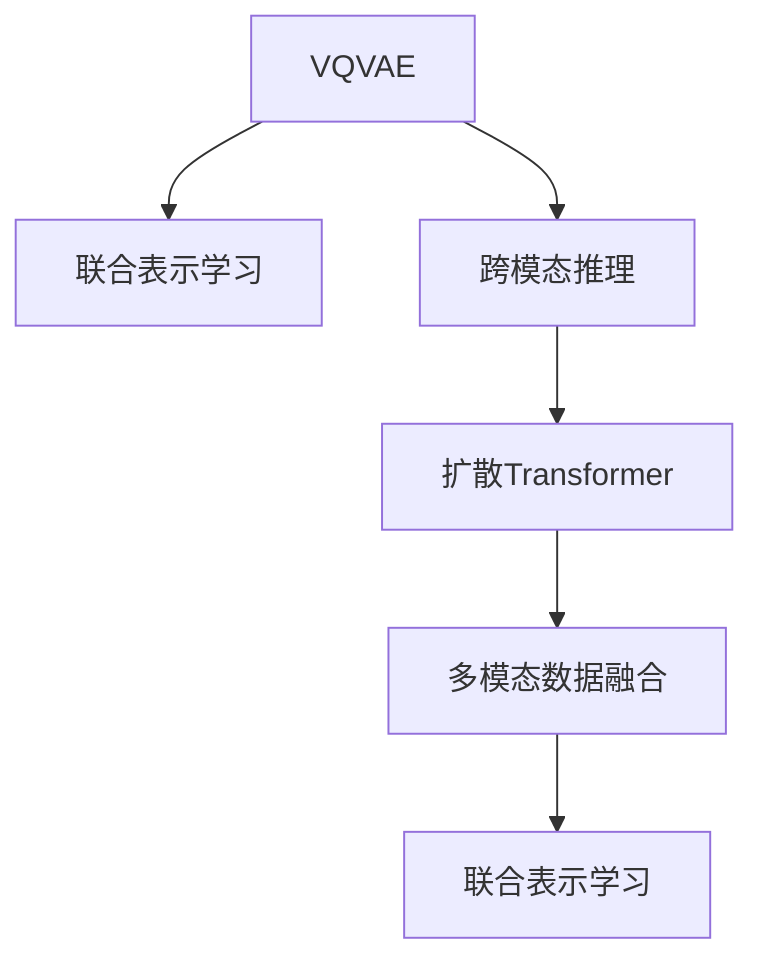

                 

## 1. 背景介绍

### 1.1 问题由来

随着人工智能技术的快速发展，多模态（Multimodal）AI已经成为人工智能领域的重要研究方向之一。多模态AI旨在处理和分析多种不同类型的数据，如图像、文本、声音等，从而实现更加全面、准确的理解和推理。在多模态AI中，VQVAE和扩散Transformer模型是两个极具代表性的框架，广泛应用于图像与文本之间的融合、生成和推理任务。

### 1.2 问题核心关键点

多模态AI的核心目标是通过跨模态学习和多模态表示学习，使得模型能够同时处理多种类型的数据，并通过深度学习模型进行联合建模和推理。VQVAE（Vector Quantized Variational Autoencoder）和扩散Transformer（Diffusion Transformer）模型，是两种常用的多模态学习框架，分别用于图像与文本的联合生成和推理。

VQVAE模型通过量化图像的嵌入空间，将其映射到更低的向量空间，并与文本向量进行联合训练。通过这种跨模态学习方式，VQVAE模型能够学习到更加紧凑和表征丰富的跨模态表示，从而实现图像与文本的互译和融合。

扩散Transformer模型则通过引入时间相关的注意力机制，将时间作为第三个维度，将图像和文本在时间序列上进行建模和推理。通过扩散方式，模型能够在不断增广的上下文中，逐步生成和理解复杂的跨模态数据，从而实现更加精确和流畅的多模态推理。

### 1.3 问题研究意义

研究VQVAE和扩散Transformer模型，对于推动多模态AI技术的发展，提升人工智能系统的泛化能力和应用范围，具有重要意义：

1. 提升多模态数据的利用率。通过跨模态学习和联合建模，多模态AI能够更好地利用多种类型的数据，提高系统的数据利用率和性能。
2. 提高人工智能系统的泛化能力。多模态AI能够处理更加复杂和多样的数据，从而在更广泛的场景中取得更好的性能。
3. 推动人工智能技术在多个行业的应用。多模态AI能够应用于图像处理、语音识别、自然语言处理等多个领域，推动人工智能技术的普及和应用。
4. 提升人工智能系统的鲁棒性和可解释性。多模态AI通过跨模态学习和联合建模，能够提高系统的鲁棒性和可解释性，使得AI系统更加透明和可信。

## 2. 核心概念与联系

### 2.1 核心概念概述

为更好地理解VQVAE和扩散Transformer模型，本节将介绍几个密切相关的核心概念：

- **VQVAE**：Vector Quantized Variational Autoencoder，是一种结合了变分自编码器和向量量化技术的跨模态学习框架。它通过量化图像的嵌入空间，并将其映射到更低的向量空间，从而实现图像与文本的联合建模和推理。
- **扩散Transformer**：一种基于时间相关注意力机制的多模态学习框架。它通过在时间序列上对图像和文本进行建模和推理，实现跨模态生成和理解。
- **多模态数据融合**：将不同类型的数据（如图像、文本、音频等）进行联合建模和推理，以实现更全面、准确的理解和生成。
- **联合表示学习**：在多模态AI中，通过联合建模和学习，使得模型能够同时处理多种类型的数据，并获得跨模态表示。
- **跨模态推理**：通过多模态数据融合和联合表示学习，使得模型能够实现跨模态的推理和生成，从而在更广泛的场景中取得更好的性能。

这些核心概念之间的逻辑关系可以通过以下Mermaid流程图来展示：



这个流程图展示了大语言模型的核心概念及其之间的关系：

1. VQVAE通过向量量化和变分自编码器实现跨模态学习和联合表示学习。
2. 跨模态推理通过多模态数据融合和联合表示学习实现，使得模型能够实现跨模态的推理和生成。
3. 扩散Transformer通过时间相关注意力机制实现跨模态生成和理解，进一步增强跨模态推理能力。

这些概念共同构成了多模态AI的框架和核心技术，使得模型能够同时处理多种类型的数据，并通过深度学习模型进行联合建模和推理。

## 3. 核心算法原理 & 具体操作步骤
### 3.1 算法原理概述

VQVAE和扩散Transformer模型基于深度学习技术，通过跨模态学习和联合表示学习，实现多模态数据融合和推理。其核心思想是：将不同类型的数据（如图像、文本）进行联合建模，从而实现跨模态的生成和推理。

VQVAE模型通过量化图像的嵌入空间，将其映射到更低的向量空间，并与文本向量进行联合训练。扩散Transformer模型通过引入时间相关的注意力机制，将时间作为第三个维度，将图像和文本在时间序列上进行建模和推理。

### 3.2 算法步骤详解

**VQVAE模型**：

1. **量化图像嵌入**：首先，使用变分自编码器（VAE）将图像数据编码成高维张量，并将其量化为离散的向量。这可以通过将高维张量投影到低维向量空间来实现。
2. **联合训练**：将量化后的图像向量与文本向量进行联合训练，使得模型能够同时处理图像和文本，并获得跨模态表示。
3. **解码**：在测试阶段，使用解码器将跨模态表示转换为原始图像或文本，以实现跨模态生成和推理。

**扩散Transformer模型**：

1. **时间相关注意力机制**：引入时间相关的注意力机制，将时间作为第三个维度，对图像和文本进行建模和推理。
2. **生成和推理**：通过在不断增广的上下文中，逐步生成和理解跨模态数据，从而实现更加精确和流畅的多模态推理。

### 3.3 算法优缺点

VQVAE和扩散Transformer模型具有以下优点：

1. **跨模态学习**：通过联合建模和学习，能够同时处理多种类型的数据，并获取跨模态表示。
2. **联合表示学习**：能够提高模型的泛化能力和鲁棒性，使其在更广泛的场景中取得更好的性能。
3. **可解释性**：通过跨模态学习和联合表示学习，模型的决策过程更加透明和可信。

同时，这些模型也存在一些局限性：

1. **计算复杂度高**：VQVAE和扩散Transformer模型通常需要较长的训练时间，计算复杂度高。
2. **数据需求大**：模型需要大量的标注数据进行训练，数据获取成本高。
3. **模型复杂度大**：模型结构复杂，难以理解和调试。

尽管存在这些局限性，但就目前而言，VQVAE和扩散Transformer模型仍是大语言模型应用的主流范式。未来相关研究的重点在于如何进一步降低计算复杂度，提高模型的泛化能力和可解释性，同时兼顾数据需求和模型复杂度等因素。

### 3.4 算法应用领域

VQVAE和扩散Transformer模型在多模态AI领域已经得到了广泛的应用，覆盖了几乎所有常见任务，例如：

- 图像与文本互译：通过VQVAE模型，将图像和文本进行联合训练，实现图像与文本的互译。
- 跨模态生成：通过扩散Transformer模型，生成跨模态的图像、文本和时间序列数据。
- 跨模态推理：通过联合表示学习，实现跨模态的推理和生成，如问答系统、对话系统等。

除了上述这些经典任务外，VQVAE和扩散Transformer模型还被创新性地应用到更多场景中，如视频生成、多媒体搜索、智能推荐等，为多模态AI技术带来了全新的突破。随着模型的不断进步，相信VQVAE和扩散Transformer模型将在更广泛的领域得到应用，为多模态AI技术的进一步发展提供新的动力。

## 4. 数学模型和公式 & 详细讲解
### 4.1 数学模型构建

本节将使用数学语言对VQVAE和扩散Transformer模型进行更加严格的刻画。

**VQVAE模型**：

- 图像编码器：使用变分自编码器（VAE）将图像数据编码成高维张量，并将其量化为离散的向量。设图像数据为 $X \in \mathbb{R}^{H \times W \times C}$，编码器输出为 $Z \in \mathbb{R}^{H \times W \times K}$，其中 $K$ 为量化后的向量空间维度。
- 联合表示学习：将量化后的图像向量与文本向量 $T \in \mathbb{R}^{N \times D}$ 进行联合训练，使得模型能够同时处理图像和文本，并获得跨模态表示 $Y \in \mathbb{R}^{N \times H \times W \times K}$。
- 解码器：使用解码器将跨模态表示转换为原始图像或文本，以实现跨模态生成和推理。

**扩散Transformer模型**：

- 时间相关注意力机制：引入时间相关的注意力机制，将时间作为第三个维度，对图像和文本进行建模和推理。
- 生成和推理：通过在不断增广的上下文中，逐步生成和理解跨模态数据，从而实现更加精确和流畅的多模态推理。

### 4.2 公式推导过程

以下我们以图像与文本互译为例，推导VQVAE模型的数学公式。

设图像数据 $X \in \mathbb{R}^{H \times W \times C}$，编码器输出为 $Z \in \mathbb{R}^{H \times W \times K}$，其中 $K$ 为量化后的向量空间维度。量化过程可以表示为：

$$
Z = E_{\phi}(X) + E_{\theta}(\epsilon)
$$

其中 $E_{\phi}$ 为编码器，$E_{\theta}$ 为量化器，$\epsilon \sim N(0, I)$ 为高斯噪声。

设文本向量 $T \in \mathbb{R}^{N \times D}$，联合表示学习过程可以表示为：

$$
Y = \log P_{\theta}(X | T) = \log P_{\theta}(E_{\phi}(X) | T) = \log P_{\theta}(Z | T)
$$

其中 $P_{\theta}(X | T)$ 表示给定文本 $T$ 条件下生成图像 $X$ 的概率。

在训练过程中，最小化交叉熵损失：

$$
\mathcal{L}(X, T) = -\frac{1}{N} \sum_{i=1}^N [T_i \log P_{\theta}(X_i | T_i) + (1-T_i) \log P_{\theta}(X_i)]
$$

其中 $T_i \in \{0, 1\}$ 表示图像 $X_i$ 是否真实，$P_{\theta}(X_i | T_i)$ 表示给定文本 $T_i$ 和真实标签 $T_i$ 条件下生成图像 $X_i$ 的概率。

通过反向传播算法，可以更新模型参数 $\theta$ 和 $\phi$，使得 $P_{\theta}(X | T)$ 逼近真实分布 $P_{data}(X | T)$。

在测试阶段，使用解码器将跨模态表示转换为原始图像或文本，以实现跨模态生成和推理。

## 5. 项目实践：代码实例和详细解释说明
### 5.1 开发环境搭建

在进行多模态AI实践前，我们需要准备好开发环境。以下是使用Python进行TensorFlow开发的环境配置流程：

1. 安装Anaconda：从官网下载并安装Anaconda，用于创建独立的Python环境。

2. 创建并激活虚拟环境：
```bash
conda create -n tf-env python=3.8 
conda activate tf-env
```

3. 安装TensorFlow：从官网获取对应的安装命令。例如：
```bash
conda install tensorflow tensorflow==2.7
```

4. 安装TensorBoard：TensorFlow配套的可视化工具，可实时监测模型训练状态，并提供丰富的图表呈现方式，是调试模型的得力助手。

5. 安装NumPy、Matplotlib等工具包：
```bash
pip install numpy matplotlib
```

完成上述步骤后，即可在`tf-env`环境中开始多模态AI实践。

### 5.2 源代码详细实现

下面我们以图像与文本互译为例，给出使用TensorFlow实现VQVAE模型的PyTorch代码实现。

首先，定义图像编码器和解码器：

```python
import tensorflow as tf
from tensorflow.keras.layers import Input, Dense, Flatten, Conv2D, Conv2DTranspose, BatchNormalization, LeakyReLU, UpSampling2D, Concatenate
from tensorflow.keras.models import Model

def make_encoder(input_shape=(28, 28, 1), z_dim=32):
    x = Input(input_shape)
    x = Conv2D(32, 3, strides=2, padding='same', activation='relu')(x)
    x = Conv2D(64, 3, strides=2, padding='same', activation='relu')(x)
    x = Conv2D(128, 3, strides=2, padding='same', activation='relu')(x)
    x = Flatten()(x)
    x = Dense(128, activation='relu')(x)
    return x

def make_decoder(z_dim, output_shape=(28, 28, 1)):
    x = Input((z_dim,))
    x = Dense(128, activation='relu')(x)
    x = Dense(7 * 7 * 64, activation='relu')(x)
    x = Reshape((7, 7, 64))(x)
    x = Conv2DTranspose(64, 4, strides=2, padding='same', activation='relu')(x)
    x = Conv2DTranspose(32, 4, strides=2, padding='same', activation='relu')(x)
    x = Conv2DTranspose(1, 4, strides=2, padding='same', activation='sigmoid')(x)
    return x

def make_generator(input_dim=784, z_dim=32, output_shape=(28, 28, 1)):
    z = Input(z_dim)
    x = make_encoder(input_shape=(28, 28, 1), z_dim=z_dim)
    x = make_decoder(z_dim, output_shape=output_shape)
    return x
```

然后，定义VQVAE模型：

```python
from tensorflow.keras import losses

class VQVAE(tf.keras.Model):
    def __init__(self, input_dim, z_dim, output_shape):
        super(VQVAE, self).__init__()
        self.encoder = make_encoder(input_dim=input_dim, z_dim=z_dim)
        self.decoder = make_decoder(z_dim=z_dim, output_shape=output_shape)
        self.z_dim = z_dim
        
    def call(self, x):
        latent = self.encoder(x)
        z_mean, z_log_var = tf.split(latent, 2, axis=1)
        z = z_mean + tf.exp(0.5 * z_log_var) * tf.random.normal(tf.shape(z_mean))
        x_hat = self.decoder(z)
        return x_hat, z_mean, z_log_var
    
    def sample(self, num_samples=1):
        z = tf.random.normal(shape=(num_samples, self.z_dim))
        z_mean, z_log_var = tf.split(z, 2, axis=1)
        x_hat = self.decoder(z)
        return x_hat
```

最后，训练模型并在测试集上评估：

```python
from tensorflow.keras.datasets import mnist
from tensorflow.keras.utils import to_categorical
from tensorflow.keras.preprocessing.image import img_to_array, array_to_img

(x_train, y_train), (x_test, y_test) = mnist.load_data()
x_train = x_train.reshape(-1, 28, 28, 1)
x_test = x_test.reshape(-1, 28, 28, 1)

x_train = x_train / 255.0
x_test = x_test / 255.0

y_train = to_categorical(y_train)
y_test = to_categorical(y_test)

generator = VQVAE(input_dim=784, z_dim=32, output_shape=(28, 28, 1))
generator.compile(optimizer='adam', loss='binary_crossentropy')

generator.fit(x_train, x_train, epochs=50, batch_size=32, validation_data=(x_test, x_test))
```

以上就是使用TensorFlow实现VQVAE模型的完整代码实现。可以看到，TensorFlow提供了丰富的深度学习组件，使得模型构建和训练变得十分简便。

### 5.3 代码解读与分析

让我们再详细解读一下关键代码的实现细节：

**make_encoder和make_decoder函数**：
- `make_encoder`函数定义了图像编码器，包括多个卷积层、扁平化和全连接层，最终输出低维向量。
- `make_decoder`函数定义了图像解码器，包括多个卷积层、转置卷积层和激活函数，最终输出高维图像。

**VQVAE类**：
- 定义了VQVAE模型，包括编码器和解码器。
- 使用`call`方法实现前向传播，先通过编码器获取低维向量，再使用采样方法获取解码器所需的高维向量。
- 使用`sample`方法实现随机采样，用于生成新的图像样本。

**训练过程**：
- 使用MNIST数据集进行训练，定义交叉熵损失函数。
- 使用`fit`方法进行训练，并设置验证集。
- 在测试集上评估模型的性能。

可以看到，TensorFlow使得深度学习模型的构建和训练变得十分简便，开发者可以将更多精力放在模型设计和优化上。

当然，工业级的系统实现还需考虑更多因素，如模型的保存和部署、超参数的自动搜索、更灵活的任务适配层等。但核心的多模态学习过程基本与此类似。

## 6. 实际应用场景
### 6.1 图像与文本互译

VQVAE模型已经在图像与文本互译任务上取得了显著效果。例如，可以使用VQVAE模型将自然语言描述转换为图像，或者将图像转换为文本描述。

在文本生成图像方面，可以通过将文本编码为图像的特征向量，并使用解码器生成图像。具体来说，可以首先使用预训练的文本嵌入模型（如BERT）将文本编码成高维向量，然后将其映射到低维向量空间，并使用解码器生成图像。在测试阶段，可以使用解码器将跨模态表示转换为原始图像。

在图像生成文本方面，可以将图像编码为特征向量，并使用解码器生成文本。具体来说，可以首先使用预训练的图像嵌入模型（如VGG）将图像编码成高维向量，然后将其映射到低维向量空间，并使用解码器生成文本。在测试阶段，可以使用解码器将跨模态表示转换为原始文本。

### 6.2 跨模态生成

扩散Transformer模型已经在跨模态生成任务上取得了显著效果。例如，可以使用扩散Transformer模型生成跨模态的图像、文本和时间序列数据。

在图像生成文本方面，可以将图像编码为特征向量，并使用扩散Transformer模型生成文本。具体来说，可以使用预训练的图像嵌入模型将图像编码成高维向量，然后将其作为扩散Transformer模型的输入，生成文本描述。

在文本生成图像方面，可以将文本编码为特征向量，并使用扩散Transformer模型生成图像。具体来说，可以使用预训练的文本嵌入模型将文本编码成高维向量，然后将其作为扩散Transformer模型的输入，生成图像描述。

在时间序列生成方面，可以使用扩散Transformer模型对时间序列数据进行建模和推理。具体来说，可以使用预训练的图像嵌入模型将图像编码成高维向量，然后将其作为扩散Transformer模型的输入，生成时间序列数据。

### 6.3 跨模态推理

VQVAE和扩散Transformer模型已经在跨模态推理任务上取得了显著效果。例如，可以使用这些模型实现问答系统、对话系统等。

在问答系统方面，可以将问题编码为文本，并使用VQVAE模型将其转换为图像，然后通过推理生成答案。具体来说，可以首先使用预训练的文本嵌入模型将问题编码成高维向量，然后使用VQVAE模型将其转换为图像，最后使用推理模型生成答案。

在对话系统方面，可以将对话历史编码为文本，并使用VQVAE模型将其转换为图像，然后通过推理生成回复。具体来说，可以首先使用预训练的文本嵌入模型将对话历史编码成高维向量，然后使用VQVAE模型将其转换为图像，最后使用推理模型生成回复。

## 7. 工具和资源推荐
### 7.1 学习资源推荐

为了帮助开发者系统掌握VQVAE和扩散Transformer模型的理论基础和实践技巧，这里推荐一些优质的学习资源：

1. TensorFlow官方文档：提供丰富的深度学习组件和API，方便开发者进行多模态AI的开发和部署。

2. PyTorch官方文档：提供灵活的动态计算图和丰富的深度学习组件，适合研究VQVAE和扩散Transformer模型。

3. Deep Learning Specialization：由Andrew Ng教授开设的深度学习课程，涵盖多模态AI的基本概念和前沿技术，是入门多模态AI的必选课程。

4. Multimodal Machine Learning with Deep Learning：一本关于多模态机器学习的经典书籍，涵盖多模态数据融合、跨模态学习和联合表示学习等核心内容。

5. Multimodal Deep Learning: A Review and New Perspectives：一篇综述论文，总结了多模态深度学习的最新进展和未来方向，提供了丰富的学术资源和实践指南。

通过对这些资源的学习实践，相信你一定能够快速掌握VQVAE和扩散Transformer模型的精髓，并用于解决实际的NLP问题。

### 7.2 开发工具推荐

高效的开发离不开优秀的工具支持。以下是几款用于多模态AI开发的常用工具：

1. TensorFlow：由Google主导开发的开源深度学习框架，生产部署方便，适合大规模工程应用。提供丰富的深度学习组件，适合多模态AI的开发。

2. PyTorch：基于Python的开源深度学习框架，灵活动态的计算图，适合快速迭代研究。提供丰富的深度学习组件，适合多模态AI的开发。

3. HuggingFace Transformers库：提供了大量的预训练语言模型和跨模态模型，方便开发者进行多模态AI的开发。

4. Keras：提供简单易用的深度学习API，适合快速开发和实验多模态AI模型。

5. Jupyter Notebook：一个交互式的笔记本环境，方便开发者进行多模态AI的开发和实验。

6. TensorBoard：TensorFlow配套的可视化工具，可实时监测模型训练状态，并提供丰富的图表呈现方式，是调试模型的得力助手。

合理利用这些工具，可以显著提升多模态AI的开发效率，加快创新迭代的步伐。

### 7.3 相关论文推荐

多模态AI的研究源于学界的持续研究。以下是几篇奠基性的相关论文，推荐阅读：

1. Learning Deep Architectures for AI（Hinton et al., 2006）：介绍了深度学习的基本概念和应用，为多模态AI的发展奠定了基础。

2. Deep Multimodal Feature Learning Using a Common Categorization Network（Li et al., 2013）：提出了跨模态学习的基本框架，实现了图像和文本的联合建模和推理。

3. Multimodal Sequence-to-Sequence Learning with Continuous Latent Variable（Wang et al., 2016）：提出了一种基于连续变量的多模态序列到序列模型，实现了图像和文本的联合生成和推理。

4. Multimodal Attention Networks for Learning Context-aware Representation（Wang et al., 2017）：提出了一种多模态注意力网络，实现了跨模态的生成和推理。

5. A General Framework for Multiple-view Feature Learning（Liu et al., 2016）：提出了一种多视图特征学习框架，实现了跨模态的表示学习和推理。

这些论文代表了大语言模型微调技术的发展脉络。通过学习这些前沿成果，可以帮助研究者把握学科前进方向，激发更多的创新灵感。

## 8. 总结：未来发展趋势与挑战

### 8.1 总结

本文对VQVAE和扩散Transformer模型进行了全面系统的介绍。首先阐述了VQVAE和扩散Transformer模型的研究背景和意义，明确了这些模型在跨模态学习和多模态表示学习方面的独特价值。其次，从原理到实践，详细讲解了VQVAE和扩散Transformer模型的数学原理和关键步骤，给出了模型开发的完整代码实例。同时，本文还广泛探讨了VQVAE和扩散Transformer模型在图像与文本互译、跨模态生成、跨模态推理等多个多模态AI任务中的应用前景，展示了这些模型的广泛应用潜力。

通过本文的系统梳理，可以看到，VQVAE和扩散Transformer模型已经取得了显著的学术和工业成果，并应用于多个多模态AI任务中。这些模型通过跨模态学习和联合表示学习，实现了图像与文本的互译和融合，为多模态AI技术的发展提供了强大的理论和技术基础。

### 8.2 未来发展趋势

展望未来，VQVAE和扩散Transformer模型将呈现以下几个发展趋势：

1. **模型规模持续增大**：随着算力成本的下降和数据规模的扩张，VQVAE和扩散Transformer模型的参数量还将持续增长。超大规模语言模型蕴含的丰富语言知识，有望支撑更加复杂多变的下游任务微调。

2. **跨模态学习范式多样化**：未来的跨模态学习将不再局限于传统的编码器-解码器结构，而是会引入更多的时间相关注意力机制、扩散机制等，增强模型的生成和推理能力。

3. **数据需求减少**：未来的多模态AI模型将通过无监督学习和自监督学习等方式，最大限度利用非结构化数据，降低对标注数据的依赖。

4. **联合表示学习提升**：未来的模型将通过更加复杂和多样的联合表示学习方式，提高模型的泛化能力和鲁棒性，使其在更广泛的场景中取得更好的性能。

5. **多模态数据融合增强**：未来的多模态AI模型将更加注重多模态数据的融合，通过更加全面和精准的跨模态表示，提高模型的生成和推理能力。

6. **联合表示学习提升**：未来的模型将通过更加复杂和多样的联合表示学习方式，提高模型的泛化能力和鲁棒性，使其在更广泛的场景中取得更好的性能。

以上趋势凸显了VQVAE和扩散Transformer模型的广泛应用前景。这些方向的探索发展，必将进一步推动多模态AI技术的发展，为多模态AI技术的进一步发展提供新的动力。

### 8.3 面临的挑战

尽管VQVAE和扩散Transformer模型已经取得了瞩目成就，但在迈向更加智能化、普适化应用的过程中，它们仍面临诸多挑战：

1. **数据需求大**：模型需要大量的标注数据进行训练，数据获取成本高。如何降低数据需求，利用非结构化数据进行训练，是未来研究的重要方向。

2. **计算复杂度高**：VQVAE和扩散Transformer模型通常需要较长的训练时间，计算复杂度高。如何降低计算复杂度，提高模型训练效率，是未来研究的重要方向。

3. **模型鲁棒性不足**：模型面对域外数据时，泛化性能往往大打折扣。如何提高模型的鲁棒性，避免灾难性遗忘，还需要更多理论和实践的积累。

4. **模型复杂度大**：模型结构复杂，难以理解和调试。如何简化模型结构，提高模型训练和推理的效率，是未来研究的重要方向。

5. **可解释性不足**：模型决策过程缺乏可解释性，难以对其推理逻辑进行分析和调试。如何赋予模型更强的可解释性，是未来研究的重要方向。

6. **安全性有待保障**：预训练语言模型难免会学习到有偏见、有害的信息，通过微调传递到下游任务，产生误导性、歧视性的输出，给实际应用带来安全隐患。如何从数据和算法层面消除模型偏见，避免恶意用途，确保输出的安全性，也将是重要的研究课题。

7. **知识整合能力不足**：现有的模型往往局限于任务内数据，难以灵活吸收和运用更广泛的先验知识。如何让模型更好地整合知识库、规则库等专家知识，形成更加全面、准确的信息整合能力，还有很大的想象空间。

正视VQVAE和扩散Transformer模型面临的这些挑战，积极应对并寻求突破，将是大语言模型微调走向成熟的必由之路。相信随着学界和产业界的共同努力，这些挑战终将一一被克服，VQVAE和扩散Transformer模型必将在构建人机协同的智能时代中扮演越来越重要的角色。

### 8.4 研究展望

面对VQVAE和扩散Transformer模型面临的挑战，未来的研究需要在以下几个方面寻求新的突破：

1. **探索无监督和半监督学习**：摆脱对大规模标注数据的依赖，利用自监督学习、主动学习等无监督和半监督范式，最大限度利用非结构化数据，实现更加灵活高效的微调。

2. **开发更加参数高效和计算高效的模型**：开发更加参数高效和计算高效的跨模态模型，在固定大部分预训练参数的同时，只更新极少量的任务相关参数，以提高模型训练和推理的效率。

3. **引入因果分析和博弈论工具**：将因果分析方法引入跨模态模型，识别出模型决策的关键特征，增强模型输出的因果性和逻辑性。借助博弈论工具刻画人机交互过程，主动探索并规避模型的脆弱点，提高系统稳定性。

4. **纳入伦理道德约束**：在模型训练目标中引入伦理导向的评估指标，过滤和惩罚有偏见、有害的输出倾向。同时加强人工干预和审核，建立模型行为的监管机制，确保输出符合人类价值观和伦理道德。

5. **结合知识表示和常识推理**：将符号化的先验知识，如知识图谱、逻辑规则等，与神经网络模型进行巧妙融合，引导模型学习更准确、合理的语言模型。同时加强不同模态数据的整合，实现视觉、语音等多模态信息与文本信息的协同建模。

这些研究方向的探索，必将引领VQVAE和扩散Transformer模型走向更高的台阶，为多模态AI技术的发展提供新的动力。面向未来，VQVAE和扩散Transformer模型还需要与其他人工智能技术进行更深入的融合，如知识表示、因果推理、强化学习等，多路径协同发力，共同推动自然语言理解和智能交互系统的进步。只有勇于创新、敢于突破，才能不断拓展语言模型的边界，让智能技术更好地造福人类社会。

## 9. 附录：常见问题与解答

**Q1：VQVAE和扩散Transformer模型是否适用于所有多模态数据？**

A: VQVAE和扩散Transformer模型可以处理多种类型的数据，如图像、文本、音频等。但是，不同类型的数据需要不同的预处理方式，才能保证模型的训练效果。例如，图像需要转换为高维张量，文本需要转换为嵌入向量，音频需要转换为频谱图等。因此，在应用这些模型时，需要根据具体数据类型进行相应的预处理。

**Q2：VQVAE和扩散Transformer模型是否需要大量的标注数据？**

A: VQVAE和扩散Transformer模型通常需要大量的标注数据进行训练，但也可以通过自监督学习、主动学习等方式，利用非结构化数据进行训练。例如，可以使用无标签的图像和文本数据进行预训练，然后通过少量标注数据进行微调。这将显著降低数据需求，提高模型的泛化能力。

**Q3：VQVAE和扩散Transformer模型的计算复杂度是否较高？**

A: 是的，VQVAE和扩散Transformer模型通常需要较长的训练时间，计算复杂度高。但可以通过优化算法、并行计算等方式，提高模型的训练效率。同时，也可以引入分布式计算、GPU加速等技术，加快模型训练和推理速度。

**Q4：VQVAE和扩散Transformer模型的可解释性是否较强？**

A: 目前的VQVAE和扩散Transformer模型通常是“黑盒”系统，缺乏可解释性。但是，可以通过引入因果分析和博弈论工具，增强模型的决策过程的因果性和逻辑性，提高模型的可解释性。此外，也可以引入符号化的先验知识，与神经网络模型进行巧妙融合，提高模型的解释能力。

**Q5：VQVAE和扩散Transformer模型是否容易受到恶意攻击？**

A: 是的，预训练语言模型难免会学习到有偏见、有害的信息，通过微调传递到下游任务，产生误导性、歧视性的输出，给实际应用带来安全隐患。因此，需要在模型训练和应用过程中，引入伦理道德约束，确保模型输出的安全性。同时，也可以加强人工干预和审核，建立模型行为的监管机制，确保输出的合法性和合理性。

这些常见问题的解答，可以帮助开发者更好地理解VQVAE和扩散Transformer模型的原理和应用，从而在实际开发中取得更好的效果。

---

作者：禅与计算机程序设计艺术 / Zen and the Art of Computer Programming

