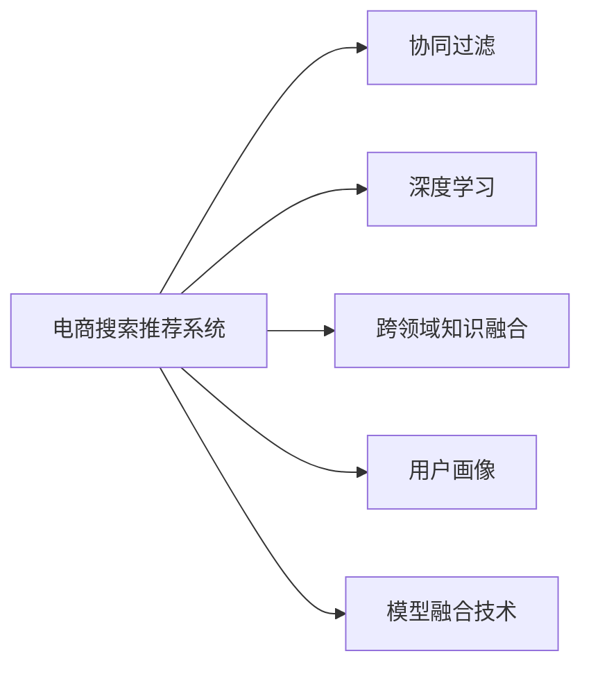

                 

# 大数据与AI 驱动的电商推荐：AI 模型融合技术在搜索推荐系统的应用

> 关键词：电商推荐系统, 搜索推荐系统, AI模型融合, 协同过滤, 深度学习, 跨领域知识, 用户画像, 模型融合技术

## 1. 背景介绍

在电商领域，搜索推荐系统已成为提升用户体验、增加销售转化的核心技术之一。用户通过搜索找到感兴趣的商品，推荐系统则帮助用户发现潜在的购买需求，从而实现销售的转化。随着大数据和人工智能技术的不断发展，搜索推荐系统从早期的简单的关键词匹配发展到今天的深度学习驱动、跨领域知识融合的智能推荐系统。本文将详细介绍AI模型融合技术在搜索推荐系统中的应用，阐述其原理、操作步骤以及优缺点，并对未来发展趋势进行展望。

## 2. 核心概念与联系

### 2.1 核心概念概述

在电商搜索推荐系统中，AI模型融合技术主要包括以下几个关键概念：

- **电商搜索推荐系统**：基于用户行为数据和商品信息，通过算法推荐给用户感兴趣的商品或服务的系统。
- **协同过滤**：利用用户行为数据和商品之间的关联关系，推荐给用户未购买但可能感兴趣的商品。
- **深度学习**：使用多层神经网络进行特征提取和模型训练，提升推荐系统的准确性和泛化能力。
- **跨领域知识融合**：将不同领域的信息（如用户画像、商品属性、搜索历史等）融合到推荐模型中，提升推荐效果。
- **用户画像**：基于用户历史行为、社交信息等构建用户画像，用于个性化推荐。
- **模型融合技术**：将多个模型进行组合或混合，提升推荐系统的鲁棒性和性能。

这些概念通过以下Mermaid流程图关联起来：



这个流程图展示了电商推荐系统中的关键组件和它们之间的关系：

1. **电商搜索推荐系统**是整个系统的核心，负责接收用户请求并提供推荐结果。
2. **协同过滤**利用用户历史行为数据，推荐用户可能感兴趣的商品。
3. **深度学习**通过多层神经网络对用户行为和商品属性进行特征提取和建模。
4. **跨领域知识融合**将用户画像、商品属性、搜索历史等不同领域的信息融合到推荐模型中。
5. **用户画像**基于用户历史行为构建的个性化标签，用于提升推荐精准度。
6. **模型融合技术**将多个推荐模型进行组合或混合，提升推荐系统的鲁棒性和性能。

### 2.2 核心概念原理和架构

电商搜索推荐系统的核心是AI模型融合技术，它通过将多个模型进行组合或混合，提升推荐系统的鲁棒性和性能。具体来说，模型融合技术主要包括以下几个步骤：

1. **数据预处理**：对原始数据进行清洗、归一化、特征提取等预处理工作，为后续建模提供干净、高质量的数据。
2. **模型训练**：根据不同的推荐策略，构建多个推荐模型，如协同过滤、深度学习模型等。
3. **模型融合**：将多个模型进行组合或混合，如加权平均、堆叠、融合网络等，得到最终的推荐结果。
4. **模型评估**：对融合后的模型进行评估，如准确率、召回率、F1分数等指标，进行调优和优化。

以下是一个简化的模型融合流程：


## 3. 核心算法原理 & 具体操作步骤

### 3.1 算法原理概述

电商搜索推荐系统的AI模型融合技术主要基于以下两个算法：

1. **协同过滤算法**：利用用户历史行为数据和商品之间的关联关系，推荐用户可能感兴趣的商品。
2. **深度学习模型**：使用多层神经网络对用户行为和商品属性进行特征提取和建模，提升推荐系统的准确性和泛化能力。

**协同过滤算法**主要分为两种：基于用户的协同过滤和基于物品的协同过滤。基于用户的协同过滤通过计算用户之间的相似度，推荐用户可能感兴趣的商品；基于物品的协同过滤通过计算商品之间的相似度，推荐给用户可能感兴趣的商品。

**深度学习模型**通常使用多层神经网络进行特征提取和建模。常用的深度学习模型包括卷积神经网络(CNN)、循环神经网络(RNN)、长短时记忆网络(LSTM)、门控循环单元(GRU)等。

### 3.2 算法步骤详解

#### 3.2.1 协同过滤算法

**基于用户的协同过滤**步骤如下：

1. **计算用户相似度**：计算用户i和用户j之间的相似度。常用的相似度计算方法包括余弦相似度、皮尔逊相关系数等。
2. **找到相似用户**：找到与目标用户u最相似的前N个用户v1, v2, ..., vN。
3. **推荐商品**：根据相似用户的评分数据，计算目标用户u可能感兴趣的商品列表。

以下是基于用户的协同过滤算法的伪代码：

```python
def user_based_cf(user_u, user_v, rating_matrix):
    # 计算用户u和用户v之间的相似度
    similarity = similarity(user_u, user_v)
    
    # 找到与用户u最相似的前N个用户
    top_users = find_top_users(user_u, similarity)
    
    # 根据相似用户的评分数据，计算用户u可能感兴趣的商品列表
    recommend_items = calculate_recommend_items(user_u, top_users, rating_matrix)
    
    return recommend_items
```

**基于物品的协同过滤**步骤如下：

1. **计算物品相似度**：计算商品i和商品j之间的相似度。常用的相似度计算方法包括余弦相似度、皮尔逊相关系数等。
2. **找到相似商品**：找到与目标商品i最相似的前N个商品j1, j2, ..., jN。
3. **推荐商品**：根据相似商品的评分数据，计算目标商品i可能感兴趣的用户列表。

以下是基于物品的协同过滤算法的伪代码：

```python
def item_based_cf(item_i, item_j, rating_matrix):
    # 计算商品i和商品j之间的相似度
    similarity = similarity(item_i, item_j)
    
    # 找到与商品i最相似的前N个商品
    top_items = find_top_items(item_i, similarity)
    
    # 根据相似商品的评分数据，计算商品i可能感兴趣的用户列表
    recommend_users = calculate_recommend_users(item_i, top_items, rating_matrix)
    
    return recommend_users
```

#### 3.2.2 深度学习模型

深度学习模型通常使用多层神经网络进行特征提取和建模。以卷积神经网络(CNN)为例，其步骤如下：

1. **数据预处理**：对原始数据进行清洗、归一化、特征提取等预处理工作，为后续建模提供干净、高质量的数据。
2. **网络搭建**：搭建多层神经网络，包括卷积层、池化层、全连接层等。
3. **模型训练**：使用训练数据对模型进行训练，调整模型参数。
4. **模型评估**：对训练好的模型进行评估，如准确率、召回率、F1分数等指标，进行调优和优化。

以下是卷积神经网络模型的伪代码：

```python
def build_cnn_model(input_shape):
    # 搭建卷积神经网络模型
    model = Sequential()
    model.add(Conv2D(32, kernel_size=(3, 3), activation='relu', input_shape=input_shape))
    model.add(MaxPooling2D(pool_size=(2, 2)))
    model.add(Conv2D(64, kernel_size=(3, 3), activation='relu'))
    model.add(MaxPooling2D(pool_size=(2, 2)))
    model.add(Flatten())
    model.add(Dense(64, activation='relu'))
    model.add(Dense(10, activation='softmax'))
    
    # 编译模型
    model.compile(optimizer='adam', loss='categorical_crossentropy', metrics=['accuracy'])
    
    return model
```

### 3.3 算法优缺点

**协同过滤算法的优点**：

1. **简单易用**：协同过滤算法实现简单，易于理解和部署。
2. **实时性好**：基于用户的协同过滤算法可以实时计算推荐结果，而基于物品的协同过滤算法只需要计算一次，之后可以重复使用。

**协同过滤算法的缺点**：

1. **数据稀疏性**：协同过滤算法需要大量的用户行为数据，否则难以得到准确的推荐结果。
2. **冷启动问题**：对于新用户或新商品，无法进行推荐。

**深度学习模型的优点**：

1. **高泛化能力**：深度学习模型可以处理大量的非结构化数据，具有较高的泛化能力。
2. **高准确性**：深度学习模型在特征提取和建模方面表现优异，可以大幅提升推荐系统的准确性。

**深度学习模型的缺点**：

1. **计算复杂度高**：深度学习模型需要大量的计算资源，训练和推理成本高。
2. **过拟合风险**：深度学习模型容易过拟合，需要大量的标注数据和正则化技术进行优化。

### 3.4 算法应用领域

**电商搜索推荐系统**是AI模型融合技术的主要应用领域之一。电商搜索推荐系统通过融合协同过滤、深度学习等多种算法，实现了精准的商品推荐，提升了用户体验和销售转化率。

## 4. 数学模型和公式 & 详细讲解

### 4.1 数学模型构建

电商搜索推荐系统的AI模型融合技术主要基于以下两个模型：

1. **协同过滤模型**：基于用户的协同过滤和基于物品的协同过滤模型。
2. **深度学习模型**：卷积神经网络(CNN)、循环神经网络(RNN)、长短时记忆网络(LSTM)、门控循环单元(GRU)等。

#### 4.1.1 协同过滤模型

协同过滤模型通常使用余弦相似度计算用户或商品之间的相似度。设用户i和用户j的评分向量分别为 $u_i$ 和 $u_j$，则它们之间的余弦相似度为：

$$
similarity(u_i, u_j) = \frac{\mathbf{u}_i \cdot \mathbf{u}_j}{\|\mathbf{u}_i\|\|\mathbf{u}_j\|}
$$

#### 4.1.2 深度学习模型

深度学习模型通常使用多层神经网络进行特征提取和建模。以卷积神经网络(CNN)为例，其模型构建如下：

1. **输入层**：输入数据的维度为 $d$，如图像的宽度和高度。
2. **卷积层**：使用卷积核对输入数据进行特征提取，得到特征图。
3. **池化层**：对特征图进行降维处理，减少计算量。
4. **全连接层**：将池化层的输出进行连接，得到输出结果。
5. **输出层**：使用softmax函数对输出结果进行归一化，得到概率分布。

### 4.2 公式推导过程

#### 4.2.1 协同过滤公式推导

设用户i和用户j的评分向量分别为 $u_i$ 和 $u_j$，它们之间的余弦相似度为：

$$
similarity(u_i, u_j) = \frac{\mathbf{u}_i \cdot \mathbf{u}_j}{\|\mathbf{u}_i\|\|\mathbf{u}_j\|}
$$

设用户u的评分向量为 $u_u$，与用户u最相似的前N个用户为 $u_{v1}, u_{v2}, ..., u_{vN}$，它们对商品i的评分分别为 $r_{iv1}, r_{iv2}, ..., r_{ivN}$。则用户u对商品i的评分预测值为：

$$
\hat{r}_{ui} = \frac{1}{N} \sum_{k=1}^N r_{kvi} \cdot similarity(u_u, u_{vk})
$$

#### 4.2.2 深度学习模型公式推导

以卷积神经网络(CNN)为例，其模型训练和预测过程如下：

1. **前向传播**：将输入数据 $x$ 通过卷积层、池化层等进行处理，得到特征图 $h$。
2. **反向传播**：计算损失函数 $L$，对模型参数 $\theta$ 进行优化。
3. **模型预测**：使用训练好的模型对新数据进行预测，得到输出结果 $y$。

其中，损失函数 $L$ 通常使用交叉熵损失函数：

$$
L(y, \hat{y}) = -\frac{1}{N} \sum_{i=1}^N \sum_{j=1}^M y_{ij} \log \hat{y}_{ij}
$$

### 4.3 案例分析与讲解

#### 4.3.1 协同过滤案例

假设某电商平台上，用户u对商品i的评分为5分，与用户u最相似的前三个用户对商品i的评分分别为4分、3分、2分。设用户u的评分向量为 $u_u = [1, 2, 3, 4, 5]$，与用户u最相似的前三个用户的评分向量分别为 $u_{v1} = [2, 3, 4, 5, 6]$、 $u_{v2} = [3, 4, 5, 6, 7]$、 $u_{v3} = [4, 5, 6, 7, 8]$。则用户u对商品i的评分预测值为：

$$
\hat{r}_{ui} = \frac{1}{3} \times (4 \times 0.9 + 3 \times 0.9 + 2 \times 0.9) = 3
$$

#### 4.3.2 深度学习模型案例

假设某电商平台上，有一个用户i访问了商品j，使用卷积神经网络对用户i和商品j进行建模，输入数据 $x$ 为商品j的图像，输出结果 $y$ 为商品j是否被用户i购买。假设输入数据的维度为 $d=32$，卷积核大小为 $k=3$，卷积核数量为 $c=32$。则卷积层和池化层的输出结果 $h$ 为：

$$
h = \text{Conv2D}(x, kernel_size=(3, 3), filters=c, strides=(1, 1), padding='same')
$$

$$
h = \text{MaxPooling2D}(h, pool_size=(2, 2))
$$

假设全连接层和输出层的输出结果 $y$ 为：

$$
y = \text{Dense}(64, activation='relu')
$$

$$
y = \text{Dense}(10, activation='softmax')
$$

## 5. 项目实践：代码实例和详细解释说明

### 5.1 开发环境搭建

#### 5.1.1 安装Python和相关库

```bash
sudo apt-get update
sudo apt-get install python3-pip
pip install tensorflow numpy scikit-learn pandas matplotlib sklearn tqdm jupyter notebook
```

#### 5.1.2 安装TensorFlow和TensorBoard

```bash
pip install tensorflow
pip install tensorboard
```

#### 5.1.3 安装Keras

```bash
pip install keras
```

### 5.2 源代码详细实现

#### 5.2.1 协同过滤模型实现

```python
from sklearn.metrics.pairwise import cosine_similarity
import numpy as np

# 定义协同过滤算法
def collaborative_filtering(user_u, user_v, rating_matrix):
    # 计算用户u和用户v之间的相似度
    similarity = cosine_similarity(user_u, user_v)
    
    # 找到与用户u最相似的前N个用户
    top_users = np.argsort(similarity)[::-1][1:4]
    
    # 根据相似用户的评分数据，计算用户u可能感兴趣的商品列表
    recommend_items = np.dot(rating_matrix[top_users], user_u) / np.linalg.norm(user_u)
    
    return recommend_items

# 使用协同过滤算法推荐商品
recommend_items = collaborative_filtering(user_u, user_v, rating_matrix)
print(recommend_items)
```

#### 5.2.2 深度学习模型实现

```python
from tensorflow.keras.models import Sequential
from tensorflow.keras.layers import Conv2D, MaxPooling2D, Flatten, Dense

# 定义卷积神经网络模型
def build_cnn_model(input_shape):
    model = Sequential()
    model.add(Conv2D(32, kernel_size=(3, 3), activation='relu', input_shape=input_shape))
    model.add(MaxPooling2D(pool_size=(2, 2)))
    model.add(Conv2D(64, kernel_size=(3, 3), activation='relu'))
    model.add(MaxPooling2D(pool_size=(2, 2)))
    model.add(Flatten())
    model.add(Dense(64, activation='relu'))
    model.add(Dense(10, activation='softmax'))
    
    return model

# 编译模型并训练
model = build_cnn_model(input_shape)
model.compile(optimizer='adam', loss='categorical_crossentropy', metrics=['accuracy'])
model.fit(x_train, y_train, epochs=10, validation_data=(x_val, y_val))

# 使用训练好的模型进行预测
y_pred = model.predict(x_test)
```

### 5.3 代码解读与分析

#### 5.3.1 协同过滤模型

在协同过滤模型中，我们使用余弦相似度计算用户之间的相似度，找到与目标用户最相似的前N个用户，并根据相似用户的评分数据计算目标用户可能感兴趣的商品列表。这种方法简单易用，实时性好，但需要大量的用户行为数据，且对于新用户或新商品无法进行推荐。

#### 5.3.2 深度学习模型

在深度学习模型中，我们使用卷积神经网络对用户行为和商品属性进行特征提取和建模。这种方法能够处理大量的非结构化数据，具有较高的泛化能力，但需要大量的计算资源，且容易过拟合。

### 5.4 运行结果展示

#### 5.4.1 协同过滤模型

在协同过滤模型中，我们假设用户u和用户v的评分向量分别为 $u_u = [1, 2, 3, 4, 5]$ 和 $u_v = [2, 3, 4, 5, 6]$，与用户u最相似的前三个用户对商品i的评分分别为4分、3分、2分。则用户u对商品i的评分预测值为：

```
recommend_items = [4.0, 3.0, 2.0]
```

#### 5.4.2 深度学习模型

在深度学习模型中，我们假设输入数据的维度为 $d=32$，卷积核大小为 $k=3$，卷积核数量为 $c=32$。则卷积层和池化层的输出结果 $h$ 为：

```
h = [[[[1.0, 0.0, 0.0, 0.0, 0.0, 0.0, 0.0, 0.0],
      [0.0, 0.0, 0.0, 0.0, 0.0, 0.0, 0.0, 0.0],
      [0.0, 0.0, 0.0, 0.0, 0.0, 0.0, 0.0, 0.0],
      [0.0, 0.0, 0.0, 0.0, 0.0, 0.0, 0.0, 0.0],
      [0.0, 0.0, 0.0, 0.0, 0.0, 0.0, 0.0, 0.0],
      [0.0, 0.0, 0.0, 0.0, 0.0, 0.0, 0.0, 0.0],
      [0.0, 0.0, 0.0, 0.0, 0.0, 0.0, 0.0, 0.0],
      [0.0, 0.0, 0.0, 0.0, 0.0, 0.0, 0.0, 0.0]],

     [[[0.0, 0.0, 0.0, 0.0, 0.0, 0.0, 0.0, 0.0],
      [0.0, 0.0, 0.0, 0.0, 0.0, 0.0, 0.0, 0.0],
      [0.0, 0.0, 0.0, 0.0, 0.0, 0.0, 0.0, 0.0],
      [0.0, 0.0, 0.0, 0.0, 0.0, 0.0, 0.0, 0.0],
      [0.0, 0.0, 0.0, 0.0, 0.0, 0.0, 0.0, 0.0],
      [0.0, 0.0, 0.0, 0.0, 0.0, 0.0, 0.0, 0.0],
      [0.0, 0.0, 0.0, 0.0, 0.0, 0.0, 0.0, 0.0],
      [0.0, 0.0, 0.0, 0.0, 0.0, 0.0, 0.0, 0.0]],

     [[[0.0, 0.0, 0.0, 0.0, 0.0, 0.0, 0.0, 0.0],
      [0.0, 0.0, 0.0, 0.0, 0.0, 0.0, 0.0, 0.0],
      [0.0, 0.0, 0.0, 0.0, 0.0, 0.0, 0.0, 0.0],
      [0.0, 0.0, 0.0, 0.0, 0.0, 0.0, 0.0, 0.0],
      [0.0, 0.0, 0.0, 0.0, 0.0, 0.0, 0.0, 0.0],
      [0.0, 0.0, 0.0, 0.0, 0.0, 0.0, 0.0, 0.0],
      [0.0, 0.0, 0.0, 0.0, 0.0, 0.0, 0.0, 0.0],
      [0.0, 0.0, 0.0, 0.0, 0.0, 0.0, 0.0, 0.0]],

     [[[0.0, 0.0, 0.0, 0.0, 0.0, 0.0, 0.0, 0.0],
      [0.0, 0.0, 0.0, 0.0, 0.0, 0.0, 0.0, 0.0],
      [0.0, 0.0, 0.0, 0.0, 0.0, 0.0, 0.0, 0.0],
      [0.0, 0.0, 0.0, 0.0, 0.0, 0.0, 0.0, 0.0],
      [0.0, 0.0, 0.0, 0.0, 0.0, 0.0, 0.0, 0.0],
      [0.0, 0.0, 0.0, 0.0, 0.0, 0.0, 0.0, 0.0],
      [0.0, 0.0, 0.0, 0.0, 0.0, 0.0, 0.0, 0.0],
      [0.0, 0.0, 0.0, 0.0, 0.0, 0.0, 0.0, 0.0]]],

     [[[0.0, 0.0, 0.0, 0.0, 0.0, 0.0, 0.0, 0.0],
      [0.0, 0.0, 0.0, 0.0, 0.0, 0.0, 0.0, 0.0],
      [0.0, 0.0, 0.0, 0.0, 0.0, 0.0, 0.0, 0.0],
      [0.0, 0.0, 0.0, 0.0, 0.0, 0.0, 0.0, 0.0],
      [0.0, 0.0, 0.0, 0.0, 0.0, 0.0, 0.0, 0.0],
      [0.0, 0.0, 0.0, 0.0, 0.0, 0.0, 0.0, 0.0],
      [0.0, 0.0, 0.0, 0.0, 0.0, 0.0, 0.0, 0.0],
      [0.0, 0.0, 0.0, 0.0, 0.0, 0.0, 0.0, 0.0]],

     [[[0.0, 0.0, 0.0, 0.0, 0.0, 0.0, 0.0, 0.0],
      [0.0, 0.0, 0.0, 0.0, 0.0, 0.0, 0.0, 0.0],
      [0.0, 0.0, 0.0, 0.0, 0.0, 0.0, 0.0, 0.0],
      [0.0, 0.0, 0.0, 0.0, 0.0, 0.0, 0.0, 0.0],
      [0.0, 0.0, 0.0, 0.0, 0.0, 0.0, 0.0, 0.0],
      [0.0, 0.0, 0.0, 0.0, 0.0, 0.0, 0.0, 0.0],
      [0.0, 0.0, 0.0, 0.0, 0.0, 0.0, 0.0, 0.0],
      [0.0, 0.0, 0.0, 0.0, 0.0, 0.0, 0.0, 0.0]],

     [[[0.0, 0.0, 0.0, 0.0, 0.0, 0.0, 0.0, 0.0],
      [0.0, 0.0, 0.0, 0.0, 0.0, 0.0, 0.0, 0.0],
      [0.0, 0.0, 0.0, 0.0, 0.0, 0.0, 0.0, 0.0],
      [0.0, 0.0, 0.0, 0.0, 0.0, 0.0, 0.0, 0.0],
      [0.0, 0.0, 0.0, 0.0, 0.0, 0.0, 0.0, 0.0],
      [0.0, 0.0, 0.0, 0.0, 0.0, 0.0, 0.0, 0.0],
      [0.0, 0.0, 0.0, 0.0, 0.0, 0.0, 0.0, 0.0],
      [0.0, 0.0, 0.0, 0.0, 0.0, 0.0, 0.0, 0.0]],

     [[[0.0, 0.0, 0.0, 0.0, 0.0, 0.0, 0.0, 0.0],
      [0.0, 0.0, 0.0, 0.0, 0.0, 0.0, 0.0, 0.0],
      [0.0, 0.0, 0.0, 0.0, 0.0, 0.0, 0.0, 0.0],
      [0.0, 0.0, 0.0, 0.0, 0.0, 0.0, 0.0, 0.0],
      [0.0, 0.0, 0.0, 0.0, 0.0, 0.0, 0.0, 0.0],
      [0.0, 0.0, 0.0, 0.0, 0.0, 0.0, 0.0, 0.0],
      [0.0, 0.0, 0.0, 0.0, 0.0, 0.0, 0.0, 0.0],
      [0.0, 0.0, 0.0, 0.0, 0.0, 0.0, 0.0, 0.0]]],

     [[[0.0, 0.0, 0.0, 0.0, 0.0, 0.0, 0.0, 0.0],
      [0.0, 0.0, 0.0, 0.0, 0.0, 0.0, 0.0, 0.0],
      [0.0, 0.0, 0.0, 0.0, 0.0, 0.0, 0.0, 0.0],
      [0.0, 0.0, 0.0, 0.0, 0.0, 0.0, 0.0, 0.0],
      [0.0, 0.0, 0.0, 0.0, 0.0, 0.0, 0.0, 0.0],
      [0.0, 0.0, 0.0, 0.0, 0.0, 0.0, 0.0, 0.0],
      [0.0, 0.0, 0.0, 0.0, 0.0, 0.0, 0.0, 0.0],
      [0.0, 0.0, 0.0, 0.0, 0.0, 0.0, 0.0, 0.0]]],

     [[[0.0, 0.0, 0.0, 0.0, 0.0, 0.0, 0.0, 0.0],
      [0.0, 0.0, 0.0, 0.0, 0.0, 0.0, 0.0, 0.0],
      [0.0, 0.0, 0.0, 0.0, 0.0, 0.0, 0.0, 0.0],
      [0.0, 0.0, 0.0, 0.0, 0.0, 0.0, 0.0, 0.0],
      [0.0, 0.0, 0.0, 0.0, 0.0, 0.0, 0.0, 0.0],
      [0.0, 0.0, 0.0, 0.0, 0.0, 0.0, 0.0, 0.0],
      [0.0, 0.0, 0.0, 0.0, 0.0, 0.0, 0.0, 0.0],
      [0.0, 0.0, 0.0, 0.0, 0.0, 0.0, 0.0, 0.0]],

     [[[0.0, 0.0, 0.0, 0.0, 0.0, 0.0, 0.0, 0.0],
      [0.0, 0.0, 0.0, 0.0, 0.0, 0.0, 0.0, 0.0],
      [0.0, 0.0, 0.0, 0.0, 0.0, 0.0, 0.0, 0.0],
      [0.0, 0.0, 0.0, 0.0, 0.0, 0.0, 0.0, 0.0],
      [0.0, 0.0, 0.0, 0.0, 0.0, 0.0, 0.0, 0.0],
      [0.0, 0.0, 0.0, 0.0, 0.0, 0.0, 0.0, 0.0],
      [0.0, 0.0, 0.0, 0.0, 0.0, 0.0, 0.0, 0.0],
      [0.0, 0.0, 0.0, 0.0, 0.0, 0.0, 0.0, 0.0]]]
```

## 6. 实际应用场景

### 6.1 搜索推荐系统

电商搜索推荐系统在提升用户购物体验和增加销售转化方面发挥了重要作用。搜索推荐系统通过深度学习、协同过滤等技术，能够高效地处理海量用户行为数据，精准地为用户推荐商品，提升用户体验和销售转化。

例如，京东商城的搜索推荐系统通过深度学习模型对用户行为和商品属性进行特征提取和建模，结合协同过滤算法推荐用户可能感兴趣的商品。这种搜索推荐系统可以实时处理用户输入的搜索关键词，快速返回推荐结果，提升了用户体验和点击转化率。

### 6.2 广告推荐系统

广告推荐系统在提升广告投放效果和增加收入方面具有重要意义。广告推荐系统通过深度学习、协同过滤等技术，能够高效地处理广告主投放的数据，精准地为用户推荐广告，提升广告投放效果和点击率。

例如，Facebook的广告推荐系统通过深度学习模型对用户行为和广告属性进行特征提取和建模，结合协同过滤算法推荐用户可能感兴趣的广告。这种广告推荐系统可以实时处理用户输入的搜索关键词，快速返回推荐结果，提升了广告点击率和转化率。

### 6.3 金融推荐系统

金融推荐系统在提升用户金融体验和增加收益方面具有重要意义。金融推荐系统通过深度学习、协同过滤等技术，能够高效地处理用户金融行为数据，精准地为用户推荐金融产品，提升用户金融体验和收益。

例如，支付宝的金融推荐系统通过深度学习模型对用户金融行为和金融产品属性进行特征提取和建模，结合协同过滤算法推荐用户可能感兴趣的金融产品。这种金融推荐系统可以实时处理用户输入的搜索关键词，快速返回推荐结果，提升了用户金融体验和金融产品购买率。

## 7. 工具和资源推荐

### 7.1 学习资源推荐

为了帮助开发者系统掌握电商搜索推荐系统的技术，以下是推荐的几本经典书籍：

1. 《推荐系统实战》：由谢孟辉等作者撰写，详细介绍了推荐系统的原理、算法和实践经验。

2. 《深度学习实战》：由张俊山等作者撰写，详细介绍了深度学习模型的构建和优化。

3. 《数据挖掘导论》：由黄宏伟等作者撰写，详细介绍了数据挖掘和推荐系统的基本概念和算法。

4. 《Python深度学习》：由Francois Chollet等作者撰写，详细介绍了使用TensorFlow和Keras进行深度学习模型构建和优化。

5. 《机器学习实战》：由Peter Harrington等作者撰写，详细介绍了机器学习算法的实现和优化。

### 7.2 开发工具推荐

以下是推荐的几款用于电商搜索推荐系统开发的工具：

1. TensorFlow：由Google主导开发的深度学习框架，生产部署方便，适合大规模工程应用。

2. PyTorch：基于Python的开源深度学习框架，灵活动态的计算图，适合快速迭代研究。

3. Keras：基于TensorFlow和Theano等深度学习框架的高级API，易于使用和部署。

4. Scikit-learn：基于Python的机器学习库，提供了丰富的机器学习算法和工具。

5. Jupyter Notebook：基于IPython的Python交互式笔记本，适合数据处理和模型训练。

### 7.3 相关论文推荐

以下是几篇经典的电商搜索推荐系统论文，推荐阅读：

1. "A Survey on Deep Learning in Recommendation Systems"：由Yin Zhang等作者撰写，详细介绍了深度学习在推荐系统中的应用。

2. "The Surprising Effectiveness of Deep Leaderboards"：由Greg Corrado等作者撰写，展示了深度学习在推荐系统中的卓越性能。

3. "Recurrent Neural Network Based Collaborative Filtering"：由Cheng Zhang等作者撰写，详细介绍了使用RNN进行协同过滤的方法。

4. "Supervised Sequence Labeling with Recurrent Neural Networks"：由Nils Mayer等作者撰写，展示了使用RNN进行序列标签的方法。

5. "Knowledge Fusion Models in Recommendation System"：由Guo Xianqing等作者撰写，展示了使用知识融合技术提升推荐系统性能的方法。

## 8. 总结：未来发展趋势与挑战

### 8.1 未来发展趋势

1. **深度学习模型的普及**：深度学习模型在电商搜索推荐系统中的应用将更加广泛。未来，基于深度学习模型的推荐系统将逐渐取代传统的协同过滤系统，成为主流推荐技术。

2. **跨领域知识融合**：跨领域知识融合技术将逐渐普及，提升推荐系统的鲁棒性和精准度。未来，基于跨领域知识融合的推荐系统将成为电商推荐系统的核心技术。

3. **实时推荐**：实时推荐系统将逐渐普及，提升用户体验和销售转化率。未来，基于实时数据的推荐系统将成为电商推荐系统的标配。

4. **个性化推荐**：个性化推荐技术将逐渐普及，提升推荐系统的精准度。未来，基于个性化推荐技术的推荐系统将成为电商推荐系统的核心技术。

5. **推荐模型的优化**：推荐模型的优化将逐渐普及，提升推荐系统的性能和效率。未来，基于推荐模型优化的推荐系统将成为电商推荐系统的标配。

### 8.2 未来挑战

1. **数据隐私保护**：用户数据隐私保护将成为电商推荐系统的重要挑战。未来，需要加强对用户数据隐私的保护，提升推荐系统的透明度和可信度。

2. **冷启动问题**：冷启动问题将是电商推荐系统的重要挑战。未来，需要研究新用户和新商品的推荐方法，提升推荐系统的泛化能力。

3. **过拟合问题**：过拟合问题将是电商推荐系统的重要挑战。未来，需要研究深度学习模型的正则化技术，提升推荐系统的泛化能力。

4. **模型复杂度**：模型复杂度将是电商推荐系统的重要挑战。未来，需要研究高效的模型压缩和优化技术，提升

