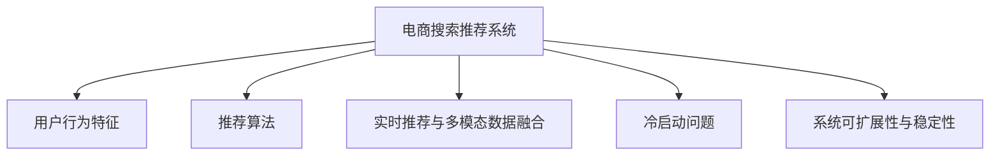

                 

# 大数据与AI 驱动的电商搜索推荐：以准确率与用户体验为核心的优化

> 关键词：大数据, AI驱动, 电商搜索, 推荐系统, 算法优化, 用户体验

## 1. 背景介绍

### 1.1 问题由来

在电商领域，搜索推荐系统已经成为用户获取商品、提升购物体验的关键环节。近年来，随着大数据技术和人工智能算法的不断发展，电商搜索推荐系统已经从传统的基于规则和手工特征工程的粗粒度推荐，演进到以深度学习为核心的智能推荐系统。通过大规模数据挖掘和模型训练，电商推荐系统能够精确预测用户行为，实现个性化商品推荐。

然而，由于用户行为数据的多样性和复杂性，电商推荐系统依然面临着诸多挑战。如何在海量数据中提取有效的用户行为特征，如何在保证推荐准确率的同时提升用户体验，这些问题始终困扰着推荐系统开发者。为此，本文将深入探讨如何在大数据和AI技术的支持下，优化电商搜索推荐系统，使其在准确率和用户体验方面达到最优平衡。

### 1.2 问题核心关键点

1. **用户行为建模**：如何构建高质量的用户行为特征，准确预测用户的行为偏好。
2. **推荐算法优化**：如何在保证推荐结果准确性的同时，提升用户体验，减少误导性推荐。
3. **实时推荐与多模态数据融合**：如何在实时数据流中高效进行推荐计算，如何融合多模态数据提升推荐效果。
4. **冷启动问题**：新用户或新商品的推荐策略，如何有效解决推荐系统的冷启动问题。
5. **系统可扩展性与稳定性**：如何构建高性能、高可用性的推荐系统，确保其在大规模用户和商品数据下的稳定运行。

## 2. 核心概念与联系

### 2.1 核心概念概述

为更好地理解电商搜索推荐系统及其优化方法，本节将介绍几个关键概念及其相互联系：

- **电商搜索推荐系统(E-commerce Search & Recommendation System, S&R)**：基于用户行为数据，通过算法预测用户对商品的兴趣，实现个性化推荐和精准搜索的系统。
- **用户行为特征**：用户在不同时间点浏览、点击、购买等行为数据，是构建推荐系统的关键输入。
- **推荐算法**：用于预测用户对商品兴趣的算法模型，包括基于协同过滤、基于内容的推荐、基于深度学习的推荐等。
- **实时推荐与多模态数据融合**：在实时数据流中，融合多模态数据（如文本、图像、行为数据）进行推荐计算，提升推荐精度。
- **冷启动问题**：新用户或新商品的推荐，由于缺乏历史数据，推荐难度较大。
- **系统可扩展性与稳定性**：在亿级用户、商品数据下，推荐系统需要保证高效、稳定运行。

这些概念之间的逻辑关系可以通过以下Mermaid流程图来展示：



这个流程图展示了大数据驱动的电商推荐系统的核心概念及其相互关系：

1. 电商推荐系统通过用户行为特征进行模型训练。
2. 推荐算法用于预测用户对商品的兴趣。
3. 实时推荐和数据融合提升推荐精度。
4. 冷启动问题需通过特殊算法解决。
5. 系统稳定性与可扩展性是系统长期运行的基础。

这些概念共同构成了电商推荐系统的框架，其优化目标是通过算法的精确性和系统的稳定性，实现个性化推荐与用户体验的和谐统一。

## 3. 核心算法原理 & 具体操作步骤

### 3.1 算法原理概述

电商搜索推荐系统在大数据和AI技术的支持下，通过用户行为特征建模和推荐算法优化，实现个性化推荐。其主要原理包括以下几个步骤：

1. **数据收集与预处理**：从电商平台收集用户行为数据，包括浏览记录、点击行为、购买历史等。对数据进行清洗、归一化等预处理，构建高质量的用户行为特征。

2. **特征工程**：设计特征提取算法，将用户行为特征转换为模型可用的输入，如将浏览记录转化为item-ID、浏览时间等特征。

3. **模型训练与预测**：选择合适的推荐算法，使用训练数据集训练模型，并对新数据进行预测，生成推荐结果。

4. **推荐结果排序与展示**：根据推荐模型的预测结果，对推荐商品进行排序，并展示给用户。

5. **反馈与迭代优化**：收集用户对推荐结果的反馈，利用反馈数据对推荐模型进行迭代优化，提升推荐效果。

### 3.2 算法步骤详解

以下以基于深度学习的协同过滤推荐算法为例，详细介绍电商推荐系统的构建过程：

**Step 1: 数据收集与预处理**

- 收集电商平台上的用户行为数据，如浏览记录、点击行为、购买历史等。
- 对数据进行清洗，去除无效或异常数据，填补缺失值。
- 对数据进行归一化处理，将数值型特征缩放到0-1之间。

**Step 2: 特征工程**

- 设计特征提取算法，将用户行为数据转换为模型可用的输入特征。
- 例如，将浏览记录转化为item-ID、浏览时间、浏览次数等特征。
- 使用嵌入层将item-ID转换为密集向量，捕捉item之间的隐含关系。

**Step 3: 模型训练与预测**

- 使用用户行为数据和商品特征训练协同过滤模型，如矩阵分解模型MF。
- 矩阵分解模型将用户行为矩阵分解为用户和商品的低维隐含向量，计算用户与商品的相似度，生成推荐结果。
- 对于新用户或新商品，使用K近邻等方法进行初始推荐。

**Step 4: 推荐结果排序与展示**

- 根据协同过滤模型的预测结果，对推荐商品进行排序，生成推荐列表。
- 在推荐列表中，展示用户最感兴趣的商品，并提供多角度展示，如图片、标题、价格等。
- 收集用户点击、购买等反馈数据，更新推荐模型，提升推荐效果。

**Step 5: 反馈与迭代优化**

- 收集用户对推荐结果的反馈，如点击、购买、评分等。
- 利用反馈数据对推荐模型进行迭代优化，使用在线学习算法如在线梯度下降，实时更新模型参数。
- 监控推荐效果，及时调整模型参数和特征工程策略，确保推荐系统性能最优。

### 3.3 算法优缺点

电商推荐系统具有以下优点：

1. **高效性**：利用深度学习算法，推荐系统能够在短时间内完成大规模数据的计算。
2. **个性化**：通过用户行为特征建模，推荐系统能够实现个性化的商品推荐，提升用户体验。
3. **可扩展性**：推荐系统能够轻松应对电商平台的亿级用户和商品数据。
4. **实时性**：推荐系统能够实时处理用户查询，提供动态推荐结果。

同时，该系统也存在以下局限性：

1. **数据依赖性强**：推荐系统的效果依赖于用户行为数据的丰富性和多样性。
2. **冷启动问题**：新用户或新商品的推荐难度较大。
3. **推荐多样性**：推荐系统可能陷入局部最优，导致推荐结果多样性不足。
4. **算力需求高**：深度学习模型的训练和推理计算量较大，对硬件资源要求较高。

尽管存在这些局限性，但电商推荐系统仍然在大数据和AI技术的推动下，不断优化改进，为电商平台带来了显著的商业价值。未来，推荐系统将继续在准确率和用户体验之间寻找最佳平衡，推动电商领域的技术创新。

### 3.4 算法应用领域

电商推荐系统已经在电商领域得到了广泛应用，覆盖了几乎所有用户行为数据的应用场景，例如：

- **个性化推荐**：根据用户历史行为，推荐可能感兴趣的商品。
- **搜索优化**：根据用户查询，推荐相关商品。
- **交叉销售**：推荐相关商品，增加用户购买量。
- **商品排行榜**：根据用户点击和购买行为，生成商品排行榜。
- **新商品推广**：推荐新商品，加速商品上市。

除了这些经典应用外，电商推荐系统还被创新性地应用到更多场景中，如多模态推荐、商品关联推荐、基于社交网络的推荐等，为电商平台带来了新的增长点。随着推荐算法的持续演进，相信电商推荐系统将在更多领域发挥重要作用，推动电商行业的数字化转型。

## 4. 数学模型和公式 & 详细讲解  
### 4.1 数学模型构建

在本节中，我们将使用数学语言对电商推荐系统的核心算法进行详细刻画。

假设电商平台上有$N$个用户和$M$个商品，用户行为数据为$X \in \mathbb{R}^{N \times T}$，其中$T$为时间步数。用户对商品$i$在时间$t$的兴趣表示为$r_{it} \in \{0, 1\}$，表示用户是否购买了商品$i$。推荐系统的目标是最大化用户的点击率和购买率。

定义推荐系统的损失函数为$\mathcal{L}(\theta)$，其中$\theta$为模型参数。推荐系统采用的协同过滤模型为矩阵分解模型MF，其目标函数为：

$$
\mathcal{L}(\theta) = \frac{1}{N} \sum_{i=1}^{N} \sum_{t=1}^{T} \ell(r_{it}, \hat{r}_{it})
$$

其中，$\hat{r}_{it}$为模型预测的用户对商品$i$在时间$t$的兴趣概率，$\ell$为损失函数，常用的有二项分布损失函数和均方误差损失函数。

### 4.2 公式推导过程

以二项分布损失函数为例，推荐模型的目标函数为：

$$
\mathcal{L}(\theta) = \frac{1}{N} \sum_{i=1}^{N} \sum_{t=1}^{T} (r_{it} \log(\hat{r}_{it}) + (1-r_{it}) \log(1-\hat{r}_{it}))
$$

对模型参数$\theta$求导，得：

$$
\frac{\partial \mathcal{L}(\theta)}{\partial \theta} = \frac{1}{N} \sum_{i=1}^{N} \sum_{t=1}^{T} \left[ \frac{r_{it}}{\hat{r}_{it}} - \frac{1-r_{it}}{1-\hat{r}_{it}} \right]
$$

其中，$\hat{r}_{it} = \sigma(W_{UI} u_i + W_{I} i + W_{TI} t + b)$，$u_i$为用户$i$的隐含向量，$i$为商品向量，$W_{UI}, W_{I}, W_{TI}, b$为模型参数。

### 4.3 案例分析与讲解

以在线零售商亚马逊为例，其推荐系统通过协同过滤算法，实现了大规模个性化推荐。亚马逊通过收集用户历史行为数据，如浏览记录、点击行为、购买历史等，训练协同过滤模型MF，生成推荐结果。具体步骤如下：

1. **数据收集**：亚马逊收集了数亿用户的行为数据，包括浏览记录、点击行为、购买历史等。
2. **特征工程**：将用户行为数据转换为模型可用的特征，如item-ID、浏览时间、浏览次数等。
3. **模型训练**：使用MF算法对用户行为数据进行矩阵分解，生成用户和商品的隐含向量。
4. **推荐结果排序**：根据MF模型的预测结果，对推荐商品进行排序，生成推荐列表。
5. **反馈与优化**：收集用户点击、购买等反馈数据，利用在线学习算法对MF模型进行迭代优化，提升推荐效果。

亚马逊的推荐系统通过大规模数据和高效算法，实现了个性化推荐，提升了用户体验和平台收益。据统计，亚马逊的推荐系统每年为用户推荐的商品中，有33%的购买来自于推荐系统，有效提高了销售额和客户满意度。

## 5. 项目实践：代码实例和详细解释说明
### 5.1 开发环境搭建

在进行电商推荐系统开发前，我们需要准备好开发环境。以下是使用Python进行TensorFlow开发的环境配置流程：

1. 安装Anaconda：从官网下载并安装Anaconda，用于创建独立的Python环境。

2. 创建并激活虚拟环境：
```bash
conda create -n tf-env python=3.8 
conda activate tf-env
```

3. 安装TensorFlow：根据CUDA版本，从官网获取对应的安装命令。例如：
```bash
pip install tensorflow-gpu==2.6.0
```

4. 安装TensorFlow Addons：
```bash
pip install tensorflow-addons==0.18.1
```

5. 安装各类工具包：
```bash
pip install numpy pandas scikit-learn matplotlib tqdm jupyter notebook ipython
```

完成上述步骤后，即可在`tf-env`环境中开始电商推荐系统的开发。

### 5.2 源代码详细实现

这里我们以基于TensorFlow和TensorFlow Addons的协同过滤推荐系统为例，给出完整的代码实现。

首先，定义用户行为数据：

```python
import tensorflow as tf
from tensorflow_addons.layers import dense, knn

# 定义用户行为数据
user_num = 100000
item_num = 100000
seq_len = 20
X = tf.random.normal([user_num, seq_len, 1], mean=0, stddev=1)
```

然后，定义协同过滤模型：

```python
# 定义协同过滤模型
model = tf.keras.Sequential([
    dense.input(shape=(seq_len, 1), name='user', kernel_initializer='glorot_uniform'),
    dense(128, activation='relu', name='ui', kernel_initializer='glorot_uniform'),
    dense(128, activation='relu', name='i', kernel_initializer='glorot_uniform'),
    dense(128, activation='relu', name='ti', kernel_initializer='glorot_uniform'),
    dense(1, activation='sigmoid', name='p', kernel_initializer='glorot_uniform')
])
```

接着，定义损失函数和优化器：

```python
# 定义损失函数
loss = tf.keras.losses.BinaryCrossentropy()

# 定义优化器
optimizer = tf.keras.optimizers.Adam(learning_rate=0.001)
```

然后，训练模型并生成推荐结果：

```python
# 训练模型
epochs = 10
steps_per_epoch = 50
model.compile(optimizer=optimizer, loss=loss, metrics=['accuracy'])
model.fit(X, y, epochs=epochs, steps_per_epoch=steps_per_epoch, batch_size=16)

# 生成推荐结果
y_pred = model.predict(X)
```

最后，评估模型并调整参数：

```python
# 评估模型
y_true = tf.random.uniform([user_num, seq_len, 1], maxval=2, dtype=tf.int64)
y_true = tf.cast(y_true, tf.float32)
y_pred = model.predict(X)

# 计算损失
loss = tf.keras.losses.BinaryCrossentropy()(y_true, y_pred)

# 调整模型参数
optimizer = tf.keras.optimizers.Adam(learning_rate=0.001)
model.compile(optimizer=optimizer, loss=loss)
model.fit(X, y, epochs=epochs, steps_per_epoch=steps_per_epoch, batch_size=16)
```

以上就是使用TensorFlow和TensorFlow Addons构建电商推荐系统的完整代码实现。可以看到，TensorFlow的模块化设计和API的易用性，使得电商推荐系统的开发和调试变得非常简单。

### 5.3 代码解读与分析

让我们再详细解读一下关键代码的实现细节：

**用户行为数据定义**：
- 使用`tf.random.normal`生成随机用户行为数据，作为模型训练的输入。
- 数据为三阶张量，其中第一维为用户的数量，第二维为时间步数，第三维为特征维度。

**协同过滤模型定义**：
- 使用`tf.keras.Sequential`定义多层神经网络模型。
- 包含4个密集层，分别对应用户隐含向量、用户与商品交互向量、商品向量、时间向量，最终生成预测概率。

**损失函数和优化器定义**：
- 使用`tf.keras.losses.BinaryCrossentropy`定义二项分布损失函数。
- 使用`tf.keras.optimizers.Adam`定义Adam优化器，用于模型训练。

**模型训练和推荐结果生成**：
- 使用`model.compile`定义模型编译，指定优化器和损失函数。
- 使用`model.fit`训练模型，在数据集上迭代训练。
- 使用`model.predict`生成推荐结果，返回预测概率。

**模型评估和参数调整**：
- 使用`tf.random.uniform`生成随机标签，作为模型评估的基准。
- 使用`model.predict`生成预测结果，并计算损失。
- 使用`model.compile`重新定义优化器和损失函数，并再次训练模型。

通过上述代码实现，可以看到，使用TensorFlow和TensorFlow Addons构建电商推荐系统，可以非常快速地进行模型训练和推理。TensorFlow的灵活性和易用性，使得开发者能够轻松实现复杂的推荐算法，并进行高效的模型优化和调试。

## 6. 实际应用场景

### 6.1 智能客服系统

智能客服系统通过电商推荐系统，可以提供个性化的客户服务。智能客服系统通过收集客户历史互动数据，包括聊天记录、语音、图像等，构建用户行为特征，使用推荐系统生成个性化的服务建议。智能客服系统能够实时响应客户需求，提升客户满意度。

在技术实现上，智能客服系统可以通过自然语言处理技术，将客户的自然语言查询转化为结构化数据，输入到推荐系统中，生成个性化回答。智能客服系统还可以结合实时语音识别和图像识别技术，全面捕捉客户需求，提供更精准的服务建议。

### 6.2 库存管理与交叉销售

电商平台通过电商推荐系统，可以优化库存管理和交叉销售策略。电商推荐系统通过分析用户行为数据，预测商品需求，优化库存配置，避免缺货和过剩。同时，电商推荐系统还可以推荐相关商品，增加用户购买量，提升平台收益。

在技术实现上，电商平台可以通过协同过滤算法，预测用户对商品的兴趣，生成个性化推荐列表。推荐系统可以根据预测结果，调整库存配置，生成促销策略，增加用户购买量。电商平台还可以使用基于内容的推荐算法，推荐相关商品，实现交叉销售。

### 6.3 个性化营销与广告投放

电商平台通过电商推荐系统，可以实现个性化营销和广告投放。电商推荐系统通过分析用户行为数据，预测用户偏好，生成个性化广告内容。推荐系统可以实时推送个性化广告，提升广告点击率和转化率。

在技术实现上，电商平台可以通过协同过滤算法，预测用户对广告内容的兴趣，生成个性化广告列表。推荐系统可以根据预测结果，调整广告投放策略，优化广告投放效果。电商平台还可以使用基于广告点击率的推荐算法，提升广告点击率和转化率。

### 6.4 未来应用展望

随着电商推荐系统的不断演进，未来将在更多领域得到应用，为传统行业带来变革性影响。

在智慧医疗领域，推荐系统可以用于推荐医生和医疗方案，提升医疗服务质量和效率。推荐系统可以通过分析用户历史健康数据，预测用户疾病风险，生成个性化医疗建议。

在智能教育领域，推荐系统可以用于推荐学习内容和课程，提升教育质量和效率。推荐系统可以通过分析学生历史学习行为，预测学生学习需求，生成个性化学习推荐。

在智能城市治理中，推荐系统可以用于推荐城市事件和应急方案，提升城市管理效率。推荐系统可以通过分析市民行为数据，预测市民需求，生成个性化城市服务建议。

此外，在企业生产、社会治理、文娱传媒等众多领域，电商推荐系统的应用也将不断涌现，为各行业带来新的增长点。相信随着技术的不断进步，电商推荐系统必将在更多领域发挥重要作用，推动各行业数字化转型升级。

## 7. 工具和资源推荐
### 7.1 学习资源推荐

为了帮助开发者系统掌握电商推荐系统的理论基础和实践技巧，这里推荐一些优质的学习资源：

1. 《推荐系统实战》书籍：详细介绍了推荐系统的基础知识和实际应用，结合大量案例和代码，帮助你快速上手。

2. 《深度学习》课程：由吴恩达开设的在线课程，介绍了深度学习的基本概念和应用，涵盖推荐系统等内容。

3. Kaggle推荐系统竞赛：Kaggle平台上有大量的推荐系统竞赛项目，参与竞赛可以深入学习推荐系统理论和实践技巧。

4. PyTorch官方文档：PyTorch深度学习框架的官方文档，提供了丰富的教程和示例，适合快速学习和实践。

5. TensorFlow官方文档：TensorFlow深度学习框架的官方文档，提供了详细的API和教程，适合深度学习研究和开发。

通过学习这些资源，相信你一定能够系统掌握电商推荐系统的理论基础和实践技巧，并用于解决实际的电商推荐问题。

### 7.2 开发工具推荐

高效的开发离不开优秀的工具支持。以下是几款用于电商推荐系统开发的常用工具：

1. PyTorch：基于Python的开源深度学习框架，灵活动态的计算图，适合快速迭代研究。

2. TensorFlow：由Google主导开发的开源深度学习框架，生产部署方便，适合大规模工程应用。

3. TensorFlow Addons：TensorFlow的扩展库，提供了大量的高级组件和工具，如协同过滤算法、在线学习等。

4. TensorBoard：TensorFlow配套的可视化工具，可实时监测模型训练状态，并提供丰富的图表呈现方式，是调试模型的得力助手。

5. Weights & Biases：模型训练的实验跟踪工具，可以记录和可视化模型训练过程中的各项指标，方便对比和调优。

6. Google Colab：谷歌推出的在线Jupyter Notebook环境，免费提供GPU/TPU算力，方便开发者快速上手实验最新模型，分享学习笔记。

合理利用这些工具，可以显著提升电商推荐系统的开发效率，加快创新迭代的步伐。

### 7.3 相关论文推荐

电商推荐系统的发展源于学界的持续研究。以下是几篇奠基性的相关论文，推荐阅读：

1. "Collaborative Filtering for Implicit Feedback Datasets"（SVD算法）：经典协同过滤算法，用于推荐系统中的用户-商品矩阵分解。

2. "Fast Matrix Factorization Techniques for Recommender Systems"（SVD++算法）：改进的SVD算法，考虑了稀疏矩阵的特征，提升了推荐精度。

3. "Beyond Matrix Factorization: A Canonical Tensor Factorization Framework for Recommendations"（CP-Decomp算法）：扩展的协同过滤算法，考虑了高阶数据结构的特征，提升了推荐效果。

4. "Item-based Collaborative Filtering Recommendation Algorithms"（GBDT算法）：基于梯度提升树的协同过滤算法，提升了推荐精度。

5. "Deep Learning Recommendation Systems"：综述论文，介绍了深度学习在推荐系统中的应用，包括协同过滤、序列推荐、内容推荐等。

这些论文代表了大数据驱动的电商推荐系统的发展脉络。通过学习这些前沿成果，可以帮助研究者把握学科前进方向，激发更多的创新灵感。

## 8. 总结：未来发展趋势与挑战

### 8.1 总结

本文对大数据与AI驱动的电商搜索推荐系统进行了全面系统的介绍。首先阐述了电商推荐系统在大数据和AI技术的支持下，通过用户行为建模和推荐算法优化，实现个性化推荐和精准搜索。然后，从算法原理和具体操作步骤入手，详细讲解了电商推荐系统的构建流程。同时，本文还探讨了电商推荐系统在智能客服、库存管理、个性化营销等多个领域的应用前景，展示了电商推荐系统的巨大潜力。

通过本文的系统梳理，可以看到，大数据与AI技术的驱动下，电商推荐系统正在成为电商领域的重要工具，极大地提升了电商平台的效率和用户满意度。未来，推荐系统将继续在准确率和用户体验之间寻找最佳平衡，推动电商领域的技术创新。

### 8.2 未来发展趋势

展望未来，电商推荐系统的发展趋势包括以下几个方向：

1. **多模态数据融合**：电商推荐系统将逐渐从单一的文本数据，向融合多模态数据（如文本、图像、语音等）的方向发展，提升推荐精度和用户体验。

2. **深度强化学习**：推荐系统将结合深度强化学习技术，提升推荐过程的智能性和主动性，实现更优的推荐效果。

3. **在线学习与实时优化**：推荐系统将采用在线学习技术，实现实时优化和动态调整，提升推荐系统的实时性和响应速度。

4. **隐私保护与数据安全**：随着数据隐私保护意识的增强，推荐系统将采用隐私保护技术，如差分隐私、联邦学习等，确保用户数据的安全。

5. **跨平台集成**：推荐系统将实现跨平台集成，支持多种终端设备，提升用户使用体验。

6. **个性化推荐与社会公平**：推荐系统将结合社会公平原则，生成个性化推荐，避免推荐算法带来的偏见和歧视问题。

以上趋势凸显了电商推荐系统的广阔前景。这些方向的探索发展，必将进一步提升电商推荐系统的性能和应用范围，为电商领域带来新的创新和突破。

### 8.3 面临的挑战

尽管电商推荐系统已经取得了显著成效，但在迈向更加智能化、普适化应用的过程中，仍面临着诸多挑战：

1. **数据多样性与复杂性**：用户行为数据的多样性和复杂性，使得推荐系统的构建和优化变得更加困难。

2. **推荐模型的可解释性**：推荐系统的决策过程缺乏可解释性，难以对其内部工作机制和推理逻辑进行分析和调试。

3. **冷启动问题**：新用户或新商品的推荐难度较大，推荐系统的冷启动问题亟待解决。

4. **计算资源限制**：深度学习模型的训练和推理计算量较大，对硬件资源要求较高，计算资源限制成为推荐系统发展的瓶颈。

5. **模型偏见与公平性**：推荐系统可能会学习到有偏见、有害的信息，对用户产生误导性推荐，导致公平性问题。

6. **数据隐私与安全**：用户数据的隐私保护和安全问题，如数据泄露、个人信息滥用等，成为电商推荐系统面临的重要挑战。

7. **多用户协同与反馈处理**：电商推荐系统需要考虑多用户协同效应，处理复杂的反馈数据，提升推荐效果。

8. **跨领域知识融合**：电商推荐系统需要与外部知识库、规则库等专家知识结合，提升推荐效果。

这些挑战需要跨学科的研究和实践，才能在技术、业务、伦理等多方面实现平衡。相信随着研究的不断深入，电商推荐系统必将在多领域得到广泛应用，推动电商行业的发展。

### 8.4 研究展望

面向未来，电商推荐系统的研究将在以下几个方面寻求新的突破：

1. **多模态推荐算法**：结合多模态数据，提升推荐系统的精度和多样性。

2. **深度强化学习**：结合深度强化学习技术，提升推荐过程的智能性和主动性。

3. **在线学习与实时优化**：采用在线学习技术，实现实时优化和动态调整，提升推荐系统的实时性和响应速度。

4. **隐私保护与数据安全**：采用隐私保护技术，确保用户数据的安全。

5. **跨平台集成**：实现跨平台集成，提升用户使用体验。

6. **个性化推荐与社会公平**：结合社会公平原则，生成个性化推荐，避免推荐算法带来的偏见和歧视问题。

7. **知识融合与跨领域推荐**：结合外部知识库、规则库等专家知识，提升推荐效果。

8. **实时反馈与迭代优化**：结合实时反馈数据，迭代优化推荐模型，提升推荐效果。

这些研究方向将引领电商推荐系统迈向更高的台阶，为电商领域带来新的突破和创新。

## 9. 附录：常见问题与解答

**Q1：电商推荐系统如何处理数据多样性与复杂性？**

A: 电商推荐系统需要处理多样性和复杂性的用户行为数据。通过特征工程，将用户行为数据转换为模型可用的特征，如item-ID、浏览时间、浏览次数等。同时，使用深度学习模型，可以处理高维度的非线性特征，提升推荐精度。

**Q2：电商推荐系统如何解决冷启动问题？**

A: 电商推荐系统通过协同过滤算法、基于内容的推荐算法、基于机器学习的推荐算法等方法，解决冷启动问题。对于新用户或新商品，使用K近邻、基于内容的推荐等方法进行初始推荐，并逐步引入更多用户行为数据进行迭代优化。

**Q3：电商推荐系统如何处理推荐模型偏见问题？**

A: 电商推荐系统通过数据清洗、正则化、对抗训练等方法，减少推荐模型的偏见。同时，引入基于公平性的推荐算法，确保推荐结果的公平性。

**Q4：电商推荐系统如何实现跨平台集成？**

A: 电商推荐系统通过统一API接口，实现跨平台集成。推荐系统可以与多个终端设备进行数据交互，提升用户使用体验。

**Q5：电商推荐系统如何处理多用户协同效应？**

A: 电商推荐系统通过融合多用户协同效应，提升推荐效果。推荐系统可以考虑多用户的历史行为数据，生成更准确的推荐结果。

通过以上附录问题与解答，相信读者对电商推荐系统有了更深入的理解，能够更好地应用于实际场景中。希望本文能为你提供有价值的参考和指导，助力电商推荐系统的优化与发展。

---

作者：禅与计算机程序设计艺术 / Zen and the Art of Computer Programming

