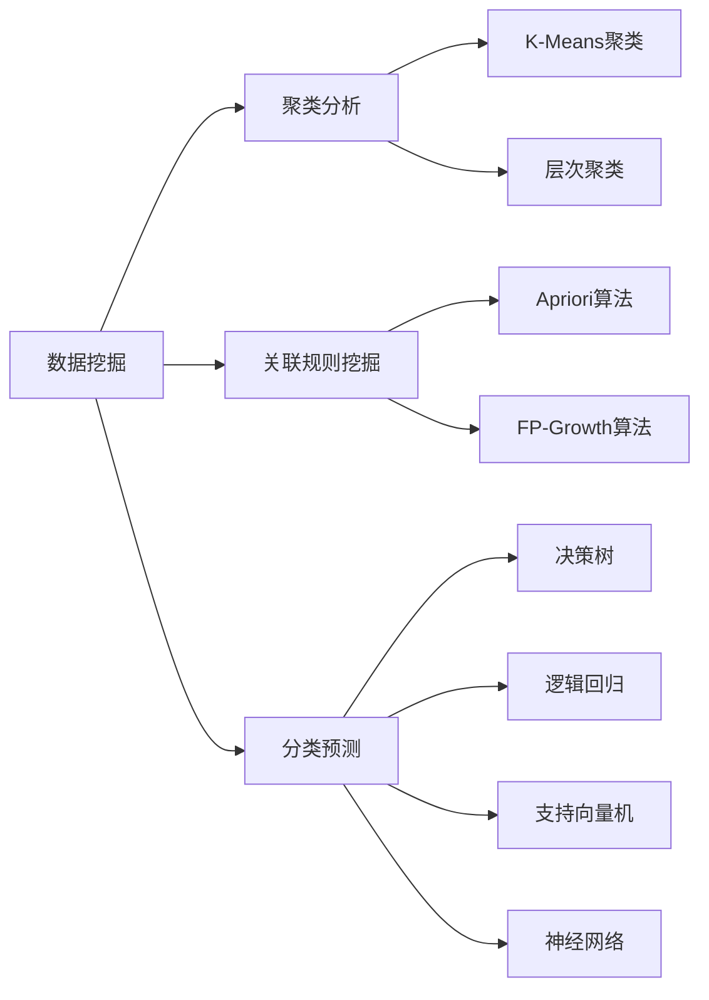
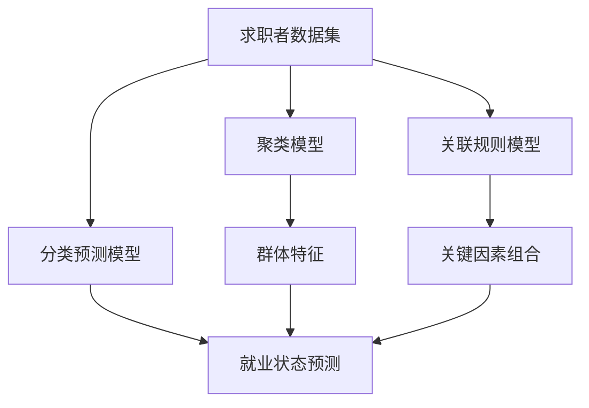

# 基于数据挖掘技术的疫情后就业情况分析

## 1. 背景介绍

### 1.1 问题的由来

2020年初,COVID-19疫情突如其来,给全球经济和就业市场带来了前所未有的冲击。疫情期间,许多企业不得不暂时停产或裁员,导致大量失业潮。随着疫情的逐步控制,经济重新复苏,就业市场也在逐步恢复。然而,疫情对就业市场的影响是深远的,不同行业、地区、群体的就业情况存在较大差异。

为了更好地了解疫情后就业市场的变化趋势,制定有针对性的政策措施,迫切需要对疫情后的就业情况进行深入分析和研究。传统的统计分析方法难以全面把握就业数据中蕴含的复杂模式和规律,因此需要借助数据挖掘技术来发掘隐藏在海量就业数据中的有价值信息。

### 1.2 研究现状

近年来,数据挖掘技术在就业市场分析领域得到了广泛应用。研究人员利用聚类算法对求职者进行分组,发现不同群体的就业偏好和特征;使用关联规则挖掘技术发现影响求职成功的关键因素;通过分类算法预测求职者的就业状态等。这些研究为就业政策的制定和人力资源的合理配置提供了有力支持。

然而,现有研究大多集中在疫情前的就业数据分析,鲜有关于疫情后就业形势的深入研究。疫情给就业市场带来了新的变化和挑战,传统的数据挖掘模型和方法可能难以完全适应疫情后的新形势,需要进行相应的改进和创新。

### 1.3 研究意义

本文旨在利用数据挖掘技术,对疫情后的就业情况进行全面分析,具有重要的理论意义和现实意义:

- 理论意义:丰富和拓展数据挖掘在就业领域的应用研究,探索疫情后就业数据的特点和规律,为相关理论模型的改进和创新提供依据。
- 现实意义:研究结果可为政府制定疫情后的就业政策提供决策依据,帮助企业优化人力资源配置,为求职者提供个性化的就业指导,促进就业市场的健康发展。

### 1.4 本文结构

本文共分为9个部分:

第1部分介绍研究背景、现状和意义;第2部分阐述核心概念;第3部分详细讲解核心算法原理和步骤;第4部分构建数学模型并推导公式;第5部分给出项目实践案例;第6部分分析实际应用场景;第7部分推荐相关工具和资源;第8部分总结研究成果并展望未来;第9部分列出常见问题解答。

## 2. 核心概念与联系

数据挖掘(Data Mining)是从大量数据中发现隐藏信息和模式的过程,在疫情后就业分析中发挥着关键作用。主要包括以下三个核心技术:

1. **聚类分析**(Cluster Analysis):根据数据对象之间的相似性将它们分为多个簇,常用算法有K-Means聚类、层次聚类等。可用于对求职者进行分组,发现不同群体的特征。

2. **关联规则挖掘**(Association Rule Mining):发现数据对象之间有趣的关联模式,常用算法有Apriori算法、FP-Growth算法等。可用于挖掘影响求职成功的关键因素组合。

3. **分类预测**(Classification Prediction):根据已知对象的特征对其进行分类,常用算法有决策树、逻辑回归、支持向量机、神经网络等。可用于预测求职者的就业状态。

上述三种技术相互关联、相辅相成,共同为疫情后就业形势分析提供了有力的数据挖掘工具。

## 3. 核心算法原理 & 具体操作步骤

### 3.1 算法原理概述

在疫情后就业分析中,K-Means聚类算法、Apriori关联规则挖掘算法和决策树分类算法是三种常用且高效的核心算法,具有重要的理论意义和应用价值。

- **K-Means聚类算法**的基本思想是:先随机选取K个初始质心,然后将每个数据对象归入与其最近的质心所对应的簇,重新计算每个簇的质心,重复上述过程直至质心不再发生变化。可用于对求职者进行分组分析。

- **Apriori关联规则挖掘算法**的核心思想是:先找出所有频繁项集,然后由频繁项集导出所有关联规则。通过设置最小支持度和最小置信度来控制规则的质量。可用于挖掘影响求职成功的关键因素组合。

- **决策树分类算法**的工作原理是:根据训练数据集构建一棵决策树模型,对新的数据对象进行自顶向下的判断,最终将其归入叶节点所属的类别。常用算法有ID3、C4.5、CART等,可用于预测求职者的就业状态。

### 3.2 算法步骤详解

#### K-Means聚类算法步骤

1) 确定聚类数K,随机选取K个初始质心。
2) 计算每个数据对象到K个质心的距离,将其归入与其最近的质心所对应的簇。
3) 对每个簇,重新计算其质心(簇内所有对象的均值向量)。
4) 重复步骤2)和3),直至质心不再发生变化。

$$
J=\sum_{i=1}^{k}\sum_{x\in C_i}||x-\mu_i||^2
$$

其中,$J$是聚类目标函数,旨在最小化所有对象到其所属簇质心的距离平方和。$C_i$是第$i$个簇,$\mu_i$是第$i$个簇的质心向量。

#### Apriori关联规则挖掘算法步骤

1) 设置最小支持度和最小置信度阈值。
2) 统计所有项集的支持度,找出所有频繁项集。
3) 由频繁项集导出所有关联规则。
4) 计算每条规则的置信度,剔除置信度低于阈值的规则。

$$
\begin{aligned}
支持度(X\Rightarrow Y)&=\frac{freq(X\cup Y)}{N}\
置信度(X\Rightarrow Y)&=\frac{freq(X\cup Y)}{freq(X)}
\end{aligned}
$$

其中,$freq(X)$表示包含项集$X$的交易数量,$N$为总交易数量。

#### 决策树分类算法步骤(以ID3算法为例)

1) 从训练数据集计算每个特征的信息增益,选择增益最大的特征作为根节点。
2) 根据该特征的不同取值,将数据集划分为若干子集。
3) 对每个子集,递归构建决策树的子树。
4) 直至所有实例属于同一类别,构建完成。

$$
\begin{aligned}
Gain(S,A)&=Entropy(S)-\sum_{v\in Values(A)}\frac{|S_v|}{|S|}Entropy(S_v)\
Entropy(S)&=-\sum_{i=1}^{c}p_ilog_2p_i
\end{aligned}
$$

其中,$Gain(S,A)$表示特征$A$对数据集$S$的信息增益,$Entropy(S)$表示$S$的熵值,$p_i$是$S$中第$i$类实例的比例。

### 3.3 算法优缺点

#### K-Means聚类算法

优点:
- 原理简单,实现方便
- 计算复杂度不高,可处理大规模数据集
- 对初始质心不太敏感

缺点:
- 需要预先确定聚类数K
- 对异常值敏感
- 簇形状只能是球形

#### Apriori关联规则挖掘算法  

优点:
- 算法容易实现
- 可设置最小支持度和置信度约束
- 适用于发现频繁模式

缺点: 
- 当频繁项集数目巨大时,算法效率低下
- 对于一些复杂的规则难以发现

#### 决策树分类算法

优点:
- 模型可解释性强
- 无需归一化处理
- 对异常值不太敏感

缺点:
- 可能产生过拟合
- 对数据的分布敏感
- 构建复杂决策树的效率低下

### 3.4 算法应用领域

- **K-Means聚类算法**广泛应用于客户细分、图像分割、基因聚类等领域。
- **Apriori关联规则挖掘算法**常用于购物篮分析、网页挖掘、科学数据分析等。
- **决策树分类算法**可用于信用评估、医学诊断、欺诈检测等领域。

在疫情后就业分析中,上述三种算法可协同应用,发挥各自的优势,为就业政策制定和人力资源优化提供数据支持。

## 4. 数学模型和公式 & 详细讲解 & 举例说明

### 4.1 数学模型构建

为了更好地分析疫情后的就业形势,我们构建了一个基于数据挖掘技术的就业预测模型。该模型包括三个主要部分:

1. **聚类模型**:利用K-Means算法对求职者进行分组,发现不同群体的特征。
2. **关联规则模型**:使用Apriori算法挖掘影响求职成功的关键因素组合。
3. **分类预测模型**:基于决策树算法预测求职者的就业状态。

### 4.2 公式推导过程

#### 聚类模型公式推导

聚类模型的目标是最小化所有对象到其所属簇质心的距离平方和,即:

$$
\begin{aligned}
J&=\sum_{i=1}^{k}\sum_{x\in C_i}||x-\mu_i||^2\
&=\sum_{i=1}^{k}\sum_{x\in C_i}\left(\sum_{j=1}^{n}(x_j-\mu_{ij})^2\right)
\end{aligned}
$$

其中,$J$是聚类目标函数,$k$是簇的数量,$C_i$是第$i$个簇,$\mu_i$是第$i$个簇的质心向量,$x$是数据对象,$n$是特征维数。

通过迭代优化,可以得到最优的聚类结果,从而发现不同群体的特征。

#### 关联规则模型公式推导

关联规则模型的目标是发现具有最小支持度和置信度的强关联规则,其中:

$$
\begin{aligned}
支持度(X\Rightarrow Y)&=\frac{freq(X\cup Y)}{N}\
置信度(X\Rightarrow Y)&=\frac{freq(X\cup Y)}{freq(X)}
\end{aligned}
$$

其中,$freq(X)$表示包含项集$X$的交易数量,$N$为总交易数量。

通过设置合理的最小支持度和置信度阈值,可以从海量数据中高效地挖掘出影响求职成功的关键因素组合。

#### 分类预测模型公式推导

分类预测模型的目标是构建一个高准确度的决策树模型,对新的数据对象进行分类预测。决策树算法(如ID3算法)选择特征划分数据集的策略是:最大化信息增益,即:

$$
\begin{aligned}
Gain(S,A)&=Entropy(S)-\sum_{v\in Values(A)}\frac{|S_v|}{|S|}Entropy(S_v)\
Entropy(S)&=-\sum_{i=1}^{c}p_ilog_2p_i
\end{aligned}
$$

其中,$Gain(S,A)$表示特征$A$对数