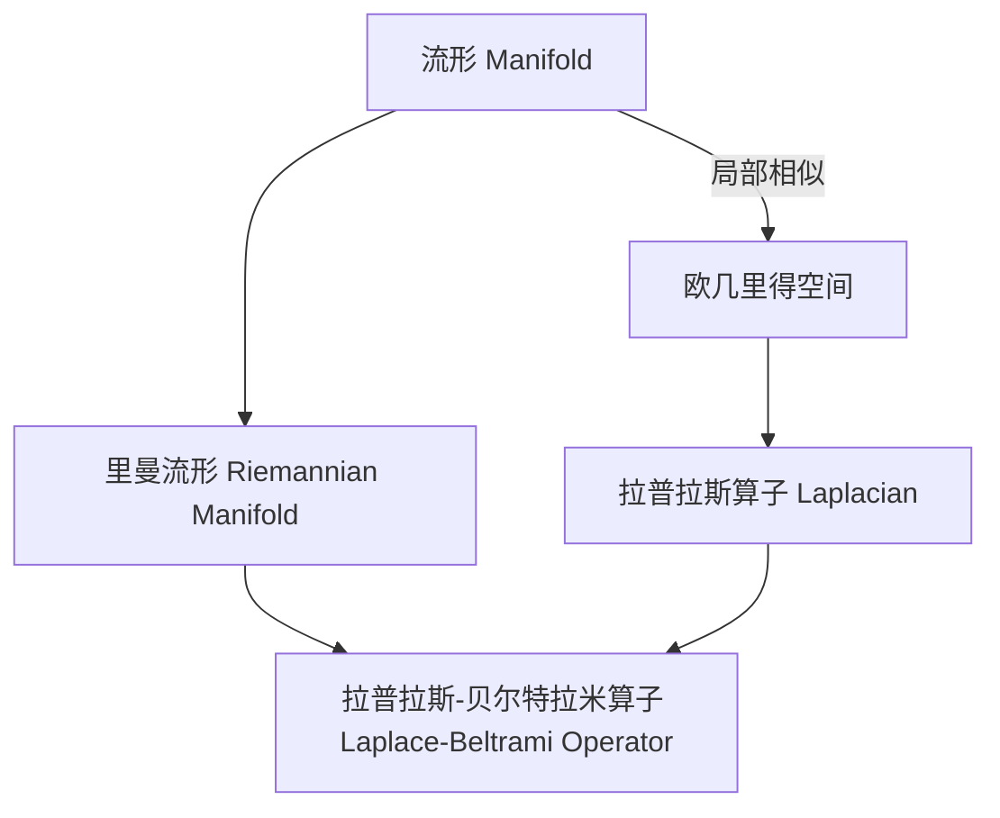

# 流形拓扑学理论与概念的实质：Laplace-Beltrami算子

## 1. 背景介绍

### 1.1 问题的由来

在许多科学和工程领域中,我们经常会遇到需要在非欧几里德空间中分析和处理数据的情况。这种非欧几里德空间可以是流形(manifold),例如球面、柱面或者任意曲面。在这些流形上,传统的欧几里德微分算子(如梯度、散度和拉普拉斯算子)并不适用,因为它们是基于欧几里德空间的假设。因此,我们需要一种新的微分算子来处理流形上的数据,这就是拉普拉斯-贝尔特拉米(Laplace-Beltrami)算子的用武之地。

### 1.2 研究现状

拉普拉斯-贝尔特拉米算子是流形上的一个基本微分算子,它扩展了欧几里德空间中的拉普拉斯算子的概念。它在许多领域都有广泛的应用,例如计算机图形学、计算机视觉、医学图像处理、流体动力学等。近年来,随着深度学习在各个领域的蓬勃发展,拉普拉斯-贝尔特拉米算子也被应用于图卷积神经网络(Graph Convolutional Networks)和几何深度学习(Geometric Deep Learning)等领域。

### 1.3 研究意义

理解和掌握拉普拉斯-贝尔特拉米算子对于处理非欧几里德空间中的数据至关重要。它不仅在理论上扩展了微分几何的概念,而且在实践中为许多应用领域提供了强大的工具。通过研究拉普拉斯-贝尔特拉米算子的理论基础、数学模型和实现方法,我们可以更好地理解和处理流形上的数据,从而推动相关领域的发展。

### 1.4 本文结构

本文将从以下几个方面全面介绍拉普拉斯-贝尔特拉米算子:

1. 核心概念与联系
2. 核心算法原理及具体操作步骤
3. 数学模型和公式详细讲解及举例说明
4. 项目实践:代码实例和详细解释说明
5. 实际应用场景
6. 工具和资源推荐
7. 总结:未来发展趋势与挑战
8. 附录:常见问题与解答

## 2. 核心概念与联系

在深入探讨拉普拉斯-贝尔特拉米算子之前,我们需要先了解一些基本概念和它们之间的联系。

### 2.1 流形(Manifold)

流形是一种拓扑空间,它在局部上类似于欧几里得空间,但在全局上可能是曲面或者更复杂的结构。流形的每个点都有一个切空间(tangent space),它是一个欧几里得空间,可以用来近似流形在该点附近的局部结构。

### 2.2 里曼流形(Riemannian Manifold)

里曼流形是一种带有内积结构的流形,它为每个切空间赋予了内积,从而定义了流形上的长度和角度概念。这使得我们可以在流形上进行微分几何计算,例如计算曲率、测地线等。

### 2.3 拉普拉斯算子(Laplacian)

在欧几里得空间中,拉普拉斯算子是一个二阶微分算子,它描述了一个函数的曲率或者说是函数值的变化率。拉普拉斯算子在许多领域都有广泛应用,例如热传导方程、波动方程等。

### 2.4 拉普拉斯-贝尔特拉米算子(Laplace-Beltrami Operator)

拉普拉斯-贝尔特拉米算子是拉普拉斯算子在里曼流形上的推广。它描述了流形上函数值的变化率,是研究流形上的微分方程和谱理论的关键工具。

这些概念之间的联系可以用下图来总结:

## 3. 核心算法原理及具体操作步骤

### 3.1 算法原理概述

拉普拉斯-贝尔特拉米算子是里曼流形上的一个基本微分算子,它描述了流形上函数值的变化率。具体来说,对于定义在流形 $M$ 上的光滑函数 $f:M\rightarrow\mathbb{R}$,拉普拉斯-贝尔特拉米算子 $\Delta_M$ 作用于 $f$ 的结果是:

$$\Delta_M f = \mathrm{div}_M(\mathrm{grad}_M f)$$

其中 $\mathrm{grad}_M f$ 是函数 $f$ 在流形 $M$ 上的梯度,而 $\mathrm{div}_M$ 是流形 $M$ 上的散度算子。

在局部坐标系下,拉普拉斯-贝尔特拉米算子可以表示为:

$$\Delta_M f = \frac{1}{\sqrt{|g|}}\sum_{i,j=1}^n\frac{\partial}{\partial x^i}\left(\sqrt{|g|}g^{ij}\frac{\partial f}{\partial x^j}\right)$$

其中 $g_{ij}$ 是流形的度量张量,而 $g^{ij}$ 是它的逆矩阵。

拉普拉斯-贝尔特拉米算子具有以下重要性质:

1. 它是一个实值椭圆型微分算子,因此满足最大值原理。
2. 它是自伴的,即对于任意光滑函数 $f,g$,有 $\int_M f\Delta_Mg\,dV = \int_M g\Delta_Mf\,dV$。
3. 它的本征函数和本征值构成了流形上的谱理论,类似于欧几里得空间中的傅里叶分析。

### 3.2 算法步骤详解

计算拉普拉斯-贝尔特拉米算子的具体步骤如下:

1. 确定流形 $M$ 及其局部坐标系 $(x^1,x^2,\dots,x^n)$。
2. 计算流形的度量张量 $g_{ij}$ 及其逆矩阵 $g^{ij}$。
3. 对于定义在 $M$ 上的光滑函数 $f$,计算它的梯度 $\mathrm{grad}_Mf = \left(\frac{\partial f}{\partial x^1},\frac{\partial f}{\partial x^2},\dots,\frac{\partial f}{\partial x^n}\right)$。
4. 计算散度项 $\mathrm{div}_M(\mathrm{grad}_Mf) = \frac{1}{\sqrt{|g|}}\sum_{i,j=1}^n\frac{\partial}{\partial x^i}\left(\sqrt{|g|}g^{ij}\frac{\partial f}{\partial x^j}\right)$。
5. 拉普拉斯-贝尔特拉米算子作用于 $f$ 的结果即为 $\Delta_Mf = \mathrm{div}_M(\mathrm{grad}_Mf)$。

这个算法的关键步骤是正确计算流形的度量张量及其逆矩阵,以及梯度和散度的推导。对于不同的流形,这些计算过程会有所不同,需要结合具体的几何结构来进行。

### 3.3 算法优缺点

拉普拉斯-贝尔特拉米算子作为一种处理流形数据的基本工具,具有以下优点:

1. 理论基础扎实,源于微分几何和谱理论。
2. 能够自然地推广欧几里得空间中的拉普拉斯算子,保留了许多良好性质。
3. 在许多应用领域具有广泛的用途,如计算机图形学、医学图像处理等。
4. 与深度学习相结合,可以发展出新的几何深度学习模型。

然而,它也存在一些缺点和挑战:

1. 计算过程相对复杂,需要对流形的几何结构有深入的理解。
2. 对于高维或者复杂的流形,计算量可能会变得很大。
3. 一些特殊的流形结构可能需要特殊处理,没有通用的解决方案。
4. 与深度学习模型相结合时,可能需要设计新的网络架构和损失函数。

### 3.4 算法应用领域

拉普拉斯-贝尔特拉米算子在许多领域都有重要应用,包括但不限于:

1. **计算机图形学**: 用于曲面参数化、网格简化、曲面光顺等问题。
2. **计算机视觉**: 用于图像分割、形状分析、特征提取等任务。
3. **医学图像处理**: 用于脑影像分析、器官分割、病变检测等应用。
4. **流体动力学**: 用于模拟流体在曲面上的运动和扩散过程。
5. **材料科学**: 用于研究材料的电子结构和输运性质。
6. **数据分析**: 用于处理非欧几里得空间中的数据,如社交网络、分子结构等。
7. **机器学习**: 与深度学习相结合,发展几何深度学习模型,处理图像、点云、网格等数据。

## 4. 数学模型和公式及详细讲解与举例说明

### 4.1 数学模型构建

为了更好地理解拉普拉斯-贝尔特拉米算子的数学模型,我们需要先介绍一些基本概念。

#### 4.1.1 流形(Manifold)

流形是一种拓扑空间,在局部上类似于欧几里得空间,但在全局上可能是曲面或者更复杂的结构。形式上,一个 $n$ 维流形 $M$ 是一个拓扑空间,对于每个点 $p\in M$,都存在一个开邻域 $U\subseteq M$,使得 $U$ 同胚于 $\mathbb{R}^n$ 的一个开子集。

#### 4.1.2 里曼流形(Riemannian Manifold)

里曼流形是一种带有内积结构的流形,它为每个切空间赋予了内积,从而定义了流形上的长度和角度概念。具体来说,一个里曼流形 $(M,g)$ 是一个流形 $M$,以及定义在 $M$ 上的一个光滑张量场 $g$,称为度量张量。对于每个点 $p\in M$,度量张量 $g_p$ 在切空间 $T_pM$ 上定义了一个内积,使得 $(T_pM,g_p)$ 成为一个欧几里得空间。

#### 4.1.3 梯度(Gradient)

对于定义在流形 $M$ 上的光滑函数 $f:M\rightarrow\mathbb{R}$,它的梯度 $\mathrm{grad}_Mf$ 是一个向量场,满足对任意向量场 $X$,有:

$$\langle\mathrm{grad}_Mf,X\rangle = Xf$$

其中 $\langle\cdot,\cdot\rangle$ 表示流形上的内积,而 $Xf$ 表示向量场 $X$ 对函数 $f$ 的方向导数。

#### 4.1.4 散度(Divergence)

对于定义在流形 $M$ 上的向量场 $X$,它的散度 $\mathrm{div}_MX$ 是一个函数,满足对任意有compact支撑的光滑函数 $f$,有:

$$\int_M f\mathrm{div}_MX\,dV = -\int_M\langle\mathrm{grad}_Mf,X\rangle\,dV$$

其中 $dV$ 表示流形上的体积形式。

有了这些基本概念,我们就可以给出拉普拉斯-贝尔特拉米算子的数学模型了。

### 4.2 公式推导过程

对于定义在流形 $M$ 上的光滑函数 $f:M\rightarrow\mathbb{R}$,拉普拉斯-贝尔特拉米算子 $\Delta_M$ 作用于 $f$ 的结果定义为:

$$\Delta_Mf = \mathrm{div}_M(\mathrm{grad}_Mf)$$

也就是说,拉普拉斯-贝尔特拉米算子是梯度算子和散度算子的复合。

为了推导出它的具体表达式,我们需要在局部坐标系