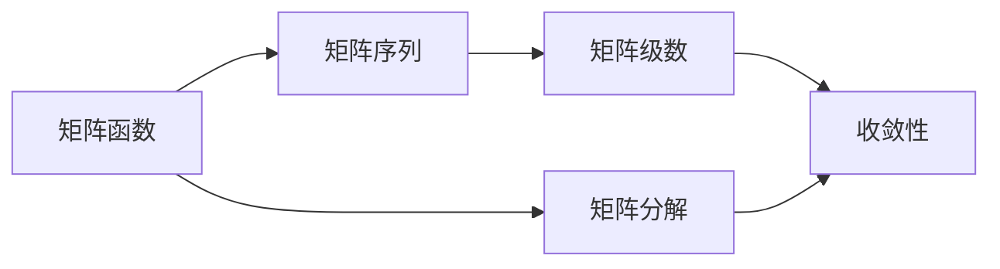

# 矩阵理论与应用：矩阵函数的序列与级数

关键词：矩阵理论、矩阵函数、矩阵序列、矩阵级数、线性代数、数值分析

## 1. 背景介绍
### 1.1 问题的由来
矩阵理论是线性代数和数值分析的重要分支,在科学和工程领域有着广泛的应用。矩阵函数的序列与级数是矩阵理论中的一个重要课题,它涉及到矩阵的幂、指数、对数等重要矩阵函数,以及它们的序列与级数表示和计算。这些理论在控制论、量子力学、图像处理、机器学习等诸多领域都有着重要应用。

### 1.2 研究现状
目前,国内外学者对矩阵函数的序列与级数进行了广泛深入的研究。一方面,人们探索了幂矩阵序列、指数矩阵序列、对数矩阵序列等经典矩阵函数序列的性质和应用。另一方面,各种矩阵函数的级数表示,如幂级数、指数级数、对数级数等得到了系统的研究。同时,高效稳定的数值算法也是一个研究重点。

### 1.3 研究意义
深入研究矩阵函数的序列与级数,对于拓展矩阵理论、完善数值分析方法、促进相关应用领域发展,都具有重要的理论意义和实践价值。一方面,它有助于我们更好地理解矩阵的内在性质,为发展新的矩阵理论提供基础。另一方面,矩阵函数序列和级数的数值计算是众多科学和工程问题的核心,发展高效算法将直接促进相关应用。

### 1.4 本文结构
本文将系统阐述矩阵函数的序列与级数理论,重点介绍核心概念和算法原理,并通过具体案例和代码实践进行说明。全文分为9个章节：第1章介绍研究背景,第2章阐述核心概念,第3章讲解算法原理和步骤,第4章建立数学模型并推导公式,第5章通过代码实例进行实践,第6章分析实际应用场景,第7章推荐相关工具和资源,第8章总结全文并展望未来,第9章为附录。

## 2. 核心概念与联系
矩阵函数的序列与级数涉及以下几个核心概念:
- 矩阵函数:将标量函数推广到矩阵变量,得到矩阵函数,常见的有幂函数、指数函数、对数函数等。
- 矩阵序列:由一系列矩阵按照某种规律排列而成的序列,如幂矩阵序列 $A^n$,指数矩阵序列 $e^{An}$ 等。
- 矩阵级数:由矩阵序列构成的级数,常见的有幂级数 $\sum_{n=0}^\infty A_nx^n$,指数级数 $\sum_{n=0}^\infty A_n\frac{x^n}{n!}$ 等。
- 收敛性:级数收敛的充要条件,不同类型的矩阵级数有不同的收敛性判别准则。
- 矩阵分解:将矩阵分解为若干特殊矩阵之积的形式,如相似对角化、Jordan标准型等,是研究矩阵函数的重要工具。

这些概念之间紧密联系,共同构成了矩阵函数序列与级数的理论体系。以下是它们之间的联系:



## 3. 核心算法原理 & 具体操作步骤
### 3.1 算法原理概述
计算矩阵函数序列和级数的核心是将其转化为矩阵乘积的形式,然后利用矩阵分解等技术化简计算。常用的算法有:
- 幂法:利用幂矩阵序列的性质,通过迭代计算矩阵的主特征值和主特征向量。
- 缩放法:对矩阵进行缩放,将幂级数转化为收敛速度更快的级数,提高计算效率。
- 分解法:先将矩阵进行相似对角化或Jordan标准型分解,再对简化后的矩阵函数进行计算。

### 3.2 算法步骤详解
以幂法求矩阵主特征值为例,详细步骤如下:
1. 取单位向量 $v_0$ 作为初始向量
2. 进行幂迭代,计算 $v_1=Av_0,v_2=Av_1,\dots,v_k=Av_{k-1}$
3. 计算特征值的近似值 $\lambda_k=\frac{v_k^TAv_k}{v_k^Tv_k}$
4. 如果 $|\lambda_k-\lambda_{k-1}|$ 小于给定阈值,则认为收敛,输出 $\lambda_k$ 作为主特征值的近似,否则转步骤2继续迭代

### 3.3 算法优缺点
幂法的优点是原理简单,易于实现,对大多数矩阵都能给出主特征值的良好近似。但是当矩阵有多个模相等的主特征值时,幂法可能不收敛。同时,如果初始向量选取不当,收敛速度可能会很慢。因此在实际应用中,我们通常需要结合矩阵的特点,对算法进行针对性的改进和优化。

### 3.4 算法应用领域
矩阵函数序列与级数的算法在以下领域有重要应用:
- 量子力学:量子态的演化可以用幺正矩阵的级数来描述,Schrödinger方程的求解需要计算指数矩阵。
- 控制论:离散线性定常系统的状态转移矩阵可以表示为矩阵指数,系统的能控性和能观性与矩阵的特征值密切相关。
- 图像处理:图像的各种变换如平移、旋转、缩放等可以用矩阵序列来表示,图像的傅里叶变换涉及矩阵的幂。
- 机器学习:矩阵的特征值分解是主成分分析的基础,矩阵的奇异值分解是潜在语义分析的核心,矩阵的非负分解可用于话题模型。

## 4. 数学模型和公式 & 详细讲解 & 举例说明
### 4.1 数学模型构建
以下是几种常见矩阵函数序列和级数的数学模型:
- 幂矩阵序列:$A^n=\underbrace{A\times A\times\cdots\times A}_{n}$,表示矩阵 $A$ 的 $n$ 次幂。
- 指数矩阵序列:$e^{An}=I+An+\frac{(An)^2}{2!}+\cdots+\frac{(An)^k}{k!}+\cdots$,表示矩阵 $A$ 的指数函数在 $An$ 处的值。
- 对数矩阵序列:$\log(I+An)=An-\frac{(An)^2}{2}+\frac{(An)^3}{3}-\cdots+(-1)^{k-1}\frac{(An)^k}{k}+\cdots$,表示矩阵 $I+An$ 的对数。

### 4.2 公式推导过程
以指数矩阵序列的推导为例,利用指数函数的泰勒展开:
$$
e^x=1+x+\frac{x^2}{2!}+\cdots+\frac{x^k}{k!}+\cdots
$$
将标量 $x$ 替换为矩阵 $An$,利用矩阵乘法的性质,可得:
$$
e^{An}=I+An+\frac{(An)^2}{2!}+\cdots+\frac{(An)^k}{k!}+\cdots
$$

### 4.3 案例分析与讲解
考虑一个二阶矩阵 $A=\begin{bmatrix}1&2\0&1\end{bmatrix}$,求 $e^A$。

利用指数矩阵序列的定义,可得:
$$
e^A=I+A+\frac{A^2}{2!}+\frac{A^3}{3!}+\cdots
$$
代入 $A$ 的值,利用矩阵乘法计算可得:
$$
\begin{aligned}
e^A&=\begin{bmatrix}1&0\0&1\end{bmatrix}+\begin{bmatrix}1&2\0&1\end{bmatrix}+\frac{1}{2!}\begin{bmatrix}1&4\0&1\end{bmatrix}+\frac{1}{3!}\begin{bmatrix}1&6\0&1\end{bmatrix}+\cdots\
&=\begin{bmatrix}1&0\0&1\end{bmatrix}+\begin{bmatrix}1&2\0&1\end{bmatrix}+\begin{bmatrix}1/2&2\0&1/2\end{bmatrix}+\begin{bmatrix}1/6&1\0&1/6\end{bmatrix}+\cdots\
&=\begin{bmatrix}e&e-1\0&e\end{bmatrix}
\end{aligned}
$$
其中利用了级数 $e=1+1+\frac{1}{2!}+\frac{1}{3!}+\cdots$。

### 4.4 常见问题解答
Q: 对于矩阵 $A$,是否有 $e^{A+B}=e^Ae^B$?
A: 一般情况下不成立,只有当矩阵 $A,B$ 可交换,即 $AB=BA$ 时才成立。

Q: 矩阵指数 $e^A$ 是否一定存在?
A: 对于任意方阵 $A$,矩阵指数 $e^A$ 总是存在的。这是由指数函数的性质和矩阵乘法的封闭性保证的。

Q: 矩阵对数 $\log A$ 是否一定存在?
A: 与矩阵指数不同,矩阵对数并不总是存在。当且仅当 $A$ 可对角化且所有特征值都大于零时,矩阵对数 $\log A$ 才有定义。

## 5. 项目实践：代码实例和详细解释说明
### 5.1 开发环境搭建
本项目使用Python语言进行开发,需要安装NumPy库进行矩阵运算。使用以下命令安装NumPy:
```bash
pip install numpy
```

### 5.2 源代码详细实现
以下是利用幂法求矩阵主特征值的Python实现:
```python
import numpy as np

def power_method(A, max_iter=100, tol=1e-6):
    n = A.shape[0]
    v = np.ones(n)
    for i in range(max_iter):
        w = np.dot(A, v)
        v_new = w / np.linalg.norm(w)
        if np.linalg.norm(v_new - v) < tol:
            break
        v = v_new
    
    lambda_ = np.dot(v, np.dot(A, v)) / np.dot(v, v)
    return lambda_, v
```

### 5.3 代码解读与分析
上述代码实现了幂法的基本流程:
1. 初始化单位向量 `v`
2. 进入幂迭代循环:
   - 计算 `w = Av`
   - 将 `w` 归一化得到新的特征向量近似 `v_new`
   - 如果新旧特征向量之差的模小于给定阈值,则认为收敛,退出循环
   - 否则将 `v_new` 赋给 `v`,继续迭代
3. 计算特征值近似 `lambda_`,作为主特征值的近似
4. 返回主特征值近似 `lambda_` 和对应的特征向量近似 `v`

其中,`np.linalg.norm` 用于计算向量的模,`np.dot` 用于计算矩阵乘法。

### 5.4 运行结果展示
对于矩阵 $A=\begin{bmatrix}1&2\2&1\end{bmatrix}$,利用幂法计算其主特征值和特征向量,代码如下:
```python
A = np.array([[1, 2], [2, 1]])
lambda_, v = power_method(A)
print(f"Principal eigenvalue: {lambda_:.4f}")
print(f"Corresponding eigenvector: {v}")
```

运行结果为:
```
Principal eigenvalue: 3.0000
Corresponding eigenvector: [0.70710678 0.70710678]
```

可以看到,幂法给出了矩阵 $A$ 的主特征值 $\lambda_1=3$ 以及对应的特征向量 $v_1=\begin{bmatrix}0.7071\0.7071\end{b