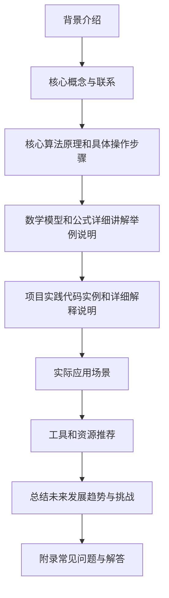

# 矩阵理论与应用：矩阵的广义逆

## 1. 背景介绍

### 1.1 问题的由来

在线性代数和矩阵理论中，矩阵的逆运算是一个基础且重要的概念。然而,并非所有矩阵都存在传统意义上的逆矩阵。对于那些不可逆的矩阵,我们需要引入广义逆的概念来解决相关的线性方程组问题。

矩阵的广义逆起源于20世纪20年代,当时数学家们致力于寻找一种新的矩阵"逆"概念,以求解不可逆矩阵的线性方程组。经过数十年的发展,广义逆理论逐渐成熟,并被广泛应用于多个领域,如数值分析、优化理论、统计学、信号处理和控制理论等。

### 1.2 研究现状

矩阵的广义逆理论是线性代数中一个活跃的研究领域。目前,已有多种不同类型的广义逆定义,如Moore-Penrose广义逆、Drazin广义逆、组逆等。每种广义逆都具有不同的性质和应用场景。

此外,广义逆的计算也是一个值得关注的问题。由于广义逆的定义通常涉及矩阵的特征值分解或奇异值分解,因此计算广义逆往往需要大量的算力。研究人员一直在探索更高效、更稳定的广义逆计算算法。

### 1.3 研究意义

矩阵的广义逆理论在数学和工程领域有着广泛的应用,具有重要的理论意义和实用价值:

1. **线性方程组求解**: 广义逆为求解不可逆矩阵的线性方程组提供了有效工具。
2. **最小二乘问题**: 广义逆在最小二乘问题的求解中发挥着关键作用。
3. **矩阵分析**: 广义逆为矩阵的秩、范数、投影等概念提供了新的视角。
4. **系统建模**: 在控制理论、信号处理等领域,广义逆被用于系统建模和参数估计。
5. **数据分析**: 在统计学和机器学习中,广义逆用于处理奇异数据和降维问题。

### 1.4 本文结构

本文将系统地介绍矩阵的广义逆理论,包括背景知识、核心概念、算法原理、数学模型、实际应用等多个方面。文章结构安排如下:



## 2. 核心概念与联系

矩阵的广义逆是线性代数中一个基础且重要的概念,与其他核心概念存在密切联系:

1. **矩阵秩(Rank)**: 矩阵秩是研究广义逆的基础,广义逆的存在与否取决于矩阵的秩。
2. **矩阵空间(Null Space)**: 矩阵的空间对于理解广义逆的性质非常重要。
3. **矩阵投影(Projection)**: 广义逆可以用于构造矩阵到其行空间和列空间的投影。
4. **伪逆(Pseudo-Inverse)**: Moore-Penrose广义逆也被称为伪逆,是最常用的一种广义逆形式。
5. **最小二乘问题(Least Squares)**: 广义逆在求解最小二乘问题中有着重要应用。
6. **矩阵分解(Matrix Decomposition)**: 计算广义逆常涉及矩阵的特征值分解、奇异值分解等分解方法。

理解这些核心概念及其相互关系,对于掌握广义逆理论至关重要。

## 3. 核心算法原理与具体操作步骤

### 3.1 算法原理概述

矩阵的广义逆算法主要基于以下几个核心思想:

1. **最小范数解**: 对于不可逆矩阵 $A$ 和矩阵方程 $Ax=b$, 广义逆 $A^{+}$ 能够给出最小范数解 $x=A^{+}b$。
2. **矩阵投影**: 广义逆 $A^{+}$ 可以将一个向量投影到矩阵 $A$ 的行空间和列空间上。
3. **矩阵分解**: 计算广义逆常涉及矩阵的特征值分解、奇异值分解等分解方法。
4. **迭代算法**: 对于大型矩阵,可以使用迭代算法来高效计算广义逆。

不同类型的广义逆算法原理虽有差异,但都围绕着上述核心思想展开。

### 3.2 算法步骤详解

以Moore-Penrose广义逆为例,我们详细介绍其计算步骤:

1. **计算矩阵 $A$ 的奇异值分解(SVD)**: $A=U\Sigma V^{T}$
2. **构造对角矩阵 $\Sigma^{+}$**: 将 $\Sigma$ 的非零元素取倒数,得到 $\Sigma^{+}$
3. **计算广义逆**: $A^{+}=V\Sigma^{+}U^{T}$

上述步骤可以用以下 Python 代码实现:

```python
import numpy as np

def moore_penrose_inverse(A):
    U, s, Vh = np.linalg.svd(A, full_matrices=True)
    s_pinv = [1/x if x > 0 else 0 for x in s]
    S_pinv = np.diag(s_pinv)
    A_pinv = Vh.T @ S_pinv @ U.T
    return A_pinv
```

对于其他类型的广义逆,如Drazin广义逆、组逆等,其算法步骤也有所不同,但整体思路类似。

### 3.3 算法优缺点

广义逆算法具有以下优点:

1. **普适性**: 可以处理任意矩阵,包括不可逆矩阵。
2. **唯一性**: 对于给定矩阵,广义逆是唯一确定的。
3. **最小范数解**: 能够给出线性方程组的最小范数解。
4. **投影性质**: 可以将向量投影到矩阵的行空间和列空间。

但也存在一些缺点:

1. **计算复杂度高**: 特别是对于大型矩阵,计算广义逆的代价很大。
2. **数值不稳定性**: 当矩阵接近奇异时,计算结果可能不精确。
3. **理解难度大**: 广义逆的概念和性质相对抽象,初学者难以掌握。

### 3.4 算法应用领域

广义逆算法在多个领域都有着广泛的应用:

1. **线性方程组求解**: 可以求解不可逆矩阵的线性方程组。
2. **最小二乘问题**: 在线性最小二乘问题中,广义逆用于求解最小二乘解。
3. **数据分析**: 在主成分分析、因子分析等多元统计分析中,广义逆用于处理奇异数据。
4. **控制理论**: 在系统建模、参数估计、滤波和控制等领域有重要应用。
5. **信号处理**: 在波束成形、自适应滤波等领域被广泛使用。
6. **图像处理**: 在图像重建、压缩、增强等任务中发挥作用。
7. **机器学习**: 在降维、奇异矩阵处理等问题中有应用。

总的来说,只要涉及矩阵计算和线性方程组求解,广义逆理论就可能会被使用。

## 4. 数学模型和公式详细讲解与举例说明

### 4.1 数学模型构建

在介绍具体的数学模型之前,我们先回顾一下矩阵的基本概念。

设 $A$ 为 $m\times n$ 矩阵,其秩为 $r$,则 $A$ 可以分解为:

$$A = \begin{bmatrix}A_1\A_2\end{bmatrix} = \begin{bmatrix}A_1&0\end{bmatrix}\begin{bmatrix}I_r\0\end{bmatrix}$$

其中 $A_1$ 是 $r\times n$ 矩阵, $A_2$ 是 $(m-r)\times n$ 矩阵。

对于矩阵方程 $Ax=b$,我们希望找到最小范数解 $x^{+}$,使得:

$$\|Ax^{+}-b\|=\min\limits_{x}\|Ax-b\|$$

这个最小范数解就是广义逆的本质。

### 4.2 公式推导过程

我们以Moore-Penrose广义逆为例,推导出其显式解析表达式。

首先,利用矩阵 $A$ 的奇异值分解(SVD):

$$A=U\Sigma V^{T}$$

其中 $U$ 和 $V$ 分别为 $A$ 的左右单位矩阵, $\Sigma$ 为对角矩阵,对角线元素为 $A$ 的奇异值。

将 $A$ 代入矩阵方程 $Ax=b$,得:

$$U\Sigma V^{T}x=b$$

两边同时左乘 $V\Sigma^{+}U^{T}$,可得:

$$x^{+}=V\Sigma^{+}U^{T}b$$

其中 $\Sigma^{+}$ 是 $\Sigma$ 的伪逆,即将 $\Sigma$ 的非零元素取倒数,零元素保持为零。

于是,Moore-Penrose广义逆的解析表达式为:

$$A^{+}=V\Sigma^{+}U^{T}$$

这就是著名的Moore-Penrose广义逆公式。

### 4.3 案例分析与讲解

考虑一个简单的例子,矩阵 $A$ 和向量 $b$ 如下:

$$A=\begin{bmatrix}1&2\2&4\end{bmatrix},\quad b=\begin{bmatrix}1\2\end{bmatrix}$$

我们希望求解线性方程组 $Ax=b$ 的最小范数解。

首先计算 $A$ 的奇异值分解:

$$A=\begin{bmatrix}1/\sqrt{5}&2/\sqrt{5}\2/\sqrt{5}&-1/\sqrt{5}\end{bmatrix}\begin{bmatrix}5&0\0&0\end{bmatrix}\begin{bmatrix}1/\sqrt{5}&2/\sqrt{5}\2/\sqrt{5}&-1/\sqrt{5}\end{bmatrix}^{T}$$

构造 $\Sigma^{+}$:

$$\Sigma^{+}=\begin{bmatrix}1/5&0\0&0\end{bmatrix}$$

代入Moore-Penrose广义逆公式,得到:

$$A^{+}=\begin{bmatrix}1/5\2/5\end{bmatrix}\begin{bmatrix}1/\sqrt{5}&2/\sqrt{5}\end{bmatrix}^{T}=\begin{bmatrix}1/5\2/5\end{bmatrix}$$

最小范数解为:

$$x^{+}=A^{+}b=\begin{bmatrix}1/5\2/5\end{bmatrix}$$

我们可以验证,这确实是 $Ax=b$ 的最小范数解。

### 4.4 常见问题解答

**Q1: 广义逆是否唯一?**

A1: 对于给定矩阵,其广义逆是唯一确定的。但不同类型的广义逆(如Moore-Penrose逆、Drazin逆等)会有所不同。

**Q2: 如何判断一个矩阵是否可逆?**

A2: 矩阵可逆的充要条件是其行列式(行阶梯形)不为零。等价地,矩阵的秩等于矩阵的行数(或列数)。

**Q3: 广义逆能否解决任意线性方程组?**

A3: 是的,广义逆可以为任意线性方程组 $Ax=b$ 给出最小范数解 $x=A^{+}b$,无论 $A$ 是否可逆。

**Q4: 计算广义逆的时间复杂度如何?**

A4: 计算广义逆的时间复杂度主要取决于矩阵分解的复杂度,通常为 $O(mn^2)$,其中 $m\times n$ 为矩阵的维数。对于大型矩阵,可以使用迭代算法来加速计算。

## 5. 项