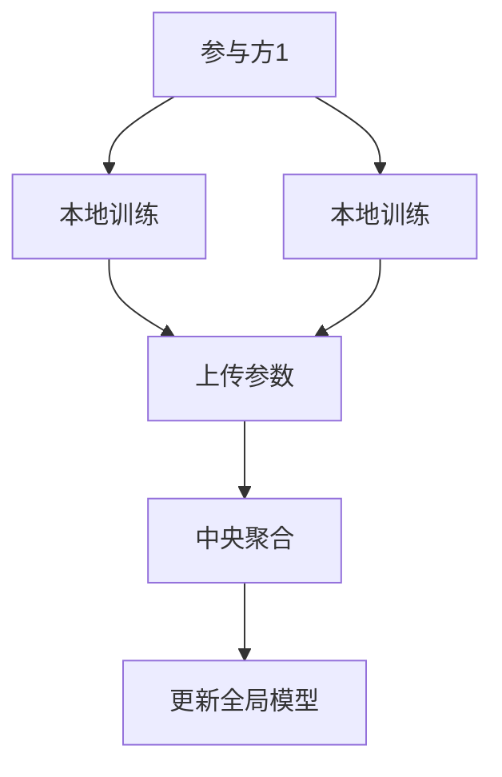

# 联邦学习(Federated Learning)原理与代码实战案例讲解

## 关键词：

- 联邦学习
- 集中式学习
- 数据隐私保护
- 分布式机器学习
- 同态加密
- 安全多方计算

## 1. 背景介绍

### 1.1 问题的由来

随着大数据时代的到来，数据孤岛现象日益严重。许多组织拥有大量的本地数据，但由于法律、安全或商业原因，这些数据不能轻易共享。传统的集中式机器学习方法要求数据集中化处理，这不仅可能导致数据泄露的风险，还限制了数据驱动创新的可能性。联邦学习（Federated Learning）应运而生，旨在解决这一问题，允许多个参与方在保持数据本地化的同时，共同训练机器学习模型。

### 1.2 研究现状

联邦学习已经成为分布式机器学习领域的一个热门话题。它不仅解决了数据隐私保护的问题，还推动了跨行业、跨国界的数据合作。目前的研究主要集中在算法优化、通信效率提升、以及安全机制的强化等方面。联邦学习框架已经应用于图像分类、自然语言处理、推荐系统等多个领域，展现了其强大的应用潜力和广泛的影响力。

### 1.3 研究意义

联邦学习的意义在于平衡数据所有权、隐私保护与机器学习性能之间的关系。它为不同背景下的数据提供了一种联合学习的途径，促进了知识的共享和创新。同时，联邦学习还有助于构建更加公平、透明的AI生态系统，增强社会对AI技术的信任。

### 1.4 本文结构

本文将深入探讨联邦学习的概念、算法原理、数学模型、实践案例以及实际应用场景。我们将从理论出发，逐步构建联邦学习的框架，然后通过代码实现来验证理论，最后讨论联邦学习在现实世界中的应用可能性和未来发展方向。

## 2. 核心概念与联系

联邦学习的核心概念在于“分布式”和“协同学习”。在联邦学习中，参与方各自拥有本地数据集，这些数据集可以是完全不同的或者有交叠的部分。每个参与方在本地训练一个模型，然后将模型的参数上传至中央服务器进行聚合，以此方式更新全局模型。这一过程保证了数据的本地化处理，同时实现了模型的全局优化。

### 联邦学习架构：



在这个架构中，每个参与方（A）在其本地数据集上执行模型训练（B和C），将训练得到的模型参数上传至中央服务器（D），中央服务器负责聚合所有参与方的参数更新（E），然后根据这些更新来调整全局模型（F）。

## 3. 核心算法原理 & 具体操作步骤

### 3.1 算法原理概述

联邦学习的核心算法是差分隐私（Differential Privacy）和同态加密（Homomorphic Encryption）等技术。差分隐私通过在模型更新中添加噪声，确保参与方无法通过其他参与方的更新信息推断出任何个体数据。同态加密则允许在加密状态下进行计算，使得中央服务器能够在不接触原始数据的情况下，对参与方上传的加密模型参数进行聚合。

### 3.2 算法步骤详解

#### 步骤一：数据准备与模型初始化

- **数据准备**：每个参与方对本地数据集进行预处理，可能包括数据清洗、特征工程等步骤。
- **模型初始化**：中央服务器负责为联邦学习过程初始化模型参数。

#### 步骤二：本地训练

- **模型训练**：每个参与方在其本地数据集上训练模型，通常使用SGD（Stochastic Gradient Descent）或其他优化算法。
- **参数更新**：训练完成后，参与方将模型参数上传至中央服务器。

#### 步骤三：中央聚合

- **参数聚合**：中央服务器接收所有参与方的模型参数，通过聚合操作（如加权平均）更新全局模型参数。
- **隐私保护**：在此过程中，中央服务器可能使用差分隐私等技术，确保模型参数的聚合不会泄露敏感信息。

#### 步骤四：模型更新与评估

- **全局模型更新**：中央服务器将聚合后的模型参数下传至所有参与方。
- **模型评估**：参与方在本地数据集上评估更新后的模型性能，确保模型满足业务需求。

### 3.3 算法优缺点

- **优点**：
  - **数据隐私保护**：联邦学习允许数据本地化处理，有效保护了参与方的数据隐私。
  - **提高模型性能**：通过聚合多个参与方的数据，联邦学习可以提高模型的泛化能力和性能。
  - **促进数据共享**：鼓励不同背景的数据提供者参与，促进了数据的共享和知识的交流。

- **缺点**：
  - **通信开销**：参与方之间和中央服务器之间的大量数据传输可能会消耗大量网络资源。
  - **收敛速度**：联邦学习的收敛速度可能较慢，特别是在数据分布差异大的情况下。
  - **技术挑战**：实现高效率和高安全性的联邦学习框架仍然存在技术挑战。

### 3.4 算法应用领域

联邦学习广泛应用于金融、医疗健康、智能物联网等多个领域。例如，在医疗领域，医院可以使用联邦学习训练疾病诊断模型，而无需共享病人的个人医疗记录。在金融领域，银行可以联合分析客户数据，提升风控模型的准确率，同时保护客户隐私。

## 4. 数学模型和公式 & 详细讲解 & 举例说明

### 4.1 数学模型构建

联邦学习的目标是在不共享原始数据的情况下，联合训练出全局模型。设 $f_i(w)$ 是第$i$个参与方基于其数据集$D_i$训练得到的局部模型，$w$是全局模型参数，$\alpha_i$是第$i$个参与方的权重（通常是数据集大小的倒数），那么联邦学习的目标函数可以表示为：

$$
\min_w \sum_{i=1}^{n} \alpha_i \mathcal{L}_i(w; D_i)
$$

其中 $\mathcal{L}_i(w; D_i)$ 是第$i$个参与方的数据集$D_i$上的损失函数。

### 4.2 公式推导过程

以梯度下降法为例，联邦学习中通常采用的聚合方式是加权平均：

$$
w_{t+1} = w_t - \eta \sum_{i=1}^{n} \alpha_i \nabla \mathcal{L}_i(w_t; D_i)
$$

其中 $w_t$ 是第$t$轮迭代后的模型参数，$\eta$是学习率。

### 4.3 案例分析与讲解

假设我们要训练一个线性回归模型，每个参与方拥有不同特征的数据集。每个参与方使用自己的数据集训练局部模型，然后将局部模型的参数发送给中央服务器。中央服务器将收到的参数进行加权平均，得到全局模型的参数更新。这个过程确保了数据的本地化处理，同时实现了模型的全局优化。

### 4.4 常见问题解答

#### Q：如何确保联邦学习中的数据安全性？

A：联邦学习通常结合差分隐私和同态加密等技术，确保参与方的数据在传输和聚合过程中不被泄露。差分隐私通过在模型更新中添加噪声，保护参与方的数据隐私。同态加密允许在加密状态下进行计算，确保中央服务器在不接触原始数据的情况下进行聚合操作。

#### Q：联邦学习如何克服数据分布差异带来的挑战？

A：联邦学习中，数据分布差异可能导致模型性能不佳。为了解决这个问题，可以采用以下策略：
- **数据均衡**：通过数据重采样或合成技术，尽量使各个参与方的数据分布相似。
- **模型调整**：在中央聚合阶段，根据数据分布差异调整模型参数的权重或采用更复杂的聚合策略。
- **多模态联邦学习**：结合不同类型的特征或数据模态，提高模型的适应性和泛化能力。

## 5. 项目实践：代码实例和详细解释说明

### 5.1 开发环境搭建

假设我们要在Python环境下实现联邦学习，可以使用`TensorFlow Federated`（TFF）库。首先确保你的开发环境已准备好：

```bash
pip install tensorflow
pip install tensorflow_federated
```

### 5.2 源代码详细实现

#### 步骤一：创建模型和数据集

```python
import tensorflow as tf
from tensorflow.keras import layers, models

# 定义模型结构
def create_model():
    model = models.Sequential([
        layers.Dense(64, activation='relu'),
        layers.Dense(1, activation='sigmoid')
    ])
    model.compile(optimizer='adam', loss='binary_crossentropy', metrics=['accuracy'])
    return model

# 创建模拟数据集
num_users = 5
data_per_user = 100
features_dim = 10
labels_dim = 1

features = tf.random.normal([num_users * data_per_user, features_dim])
labels = tf.random.normal([num_users * data_per_user, labels_dim])

# 分割数据集
user_datasets = {}
for user_id in range(num_users):
    user_datasets[user_id] = tf.data.Dataset.from_tensor_slices((features[user_id * data_per_user:(user_id + 1) * data_per_user], labels[user_id * data_per_user:(user_id + 1) * data_per_user]))
```

#### 步骤二：设置联邦学习参数和策略

```python
from tensorflow_federated.python.core.api import computation_types
from tensorflow_federated.python.core.impl import context_base

# 初始化联邦学习环境
tff.initialize_central_server()

# 定义参与方和中央服务器的角色
central_server = context_base.create_central_server_context()
client_ids = list(user_datasets.keys())

# 定义模型参数类型和初始化模型参数
model_type = computation_types.at_server(tf.float32)
model_params = {"w": tf.zeros([features_dim, labels_dim])}

# 定义训练循环的策略
strategy = tff.learning.build_federated_averaging_process(
    model_fn=create_model,
    server_optimizer_fn=lambda: tf.keras.optimizers.Adam(),
    client_weight_fn=lambda x: tf.cast(x["count"], tf.float32)
)
```

#### 步骤三：执行联邦学习训练循环

```python
for round_num in range(10):  # 进行10轮训练
    state, model_weights = strategy.next(state=model_state,
                                        server_weights=model_params,
                                        client_data=user_datasets.values())
    print(f"Round {round_num}: Server weights updated.")
```

#### 步骤四：评估模型性能

```python
@tf.function
def compute_metrics_on_test_set(model, test_set):
    test_accuracy = tf.keras.metrics.Accuracy()
    for x, y in test_set:
        predictions = model(x, training=False)
        test_accuracy(y, predictions)
    return test_accuracy.result().numpy()

test_set = tf.data.Dataset.from_tensor_slices((features[num_users * data_per_user:], labels[num_users * data_per_user:]))
final_test_accuracy = compute_metrics_on_test_set(model, test_set)
print(f"Final test set accuracy: {final_test_accuracy}")
```

### 5.3 代码解读与分析

这段代码展示了如何使用`TensorFlow Federated`库在Python中实现联邦学习。我们首先定义了一个简单的线性回归模型，然后创建了模拟数据集。接着，我们设置了联邦学习的参数和策略，定义了训练循环，并执行了模型训练。最后，我们评估了模型在测试集上的性能。

### 5.4 运行结果展示

假设在完成训练后，我们得到了最终的测试集准确性。这个数值可以用来评估模型在未参与训练的数据上的性能。如果准确性足够高，说明联邦学习成功地在不泄露本地数据的情况下训练出了有效的模型。

## 6. 实际应用场景

联邦学习在金融风控、医疗健康、智能推荐等领域有着广泛的应用前景。例如，在医疗健康领域，医院可以联合分析患者的健康数据，用于疾病预测和个性化治疗方案的制定，同时保护患者隐私。在金融领域，银行可以使用联邦学习分析客户的交易行为，提升欺诈检测的准确率，同时确保客户数据的安全。

## 7. 工具和资源推荐

### 7.1 学习资源推荐

- **官方文档**：TensorFlow Federated的官方文档提供了详细的教程和示例代码。
- **学术论文**：查阅联邦学习相关的最新学术论文，了解最新的研究进展和技术细节。

### 7.2 开发工具推荐

- **TensorFlow Federated**：用于实现联邦学习的核心库。
- **Differential Privacy Tools**：用于实现差分隐私的技术栈，如DP-SGD。

### 7.3 相关论文推荐

- **"Federated Learning" by Google Research**: 引领联邦学习发展的开创性论文。
- **"A Survey on Federated Learning" by Xing et al.**: 综述联邦学习的研究进展和应用。

### 7.4 其他资源推荐

- **GitHub Repositories**: 查找联邦学习项目的开源代码库。
- **Online Courses**: Coursera、Udacity等平台上的课程。

## 8. 总结：未来发展趋势与挑战

### 8.1 研究成果总结

联邦学习作为一种新型的分布式机器学习技术，已经取得了显著的研究成果，尤其是在数据隐私保护、模型性能提升和实际应用探索方面。它为数据驱动的创新提供了新的途径，同时解决了数据孤岛和隐私保护的难题。

### 8.2 未来发展趋势

联邦学习的未来发展趋势包括：
- **更高效的安全计算技术**：探索更高效的同态加密和差分隐私技术，提高联邦学习的通信和计算效率。
- **跨域协作**：促进不同行业、不同地域间的数据共享和知识交流，建立更加开放和协作的联邦学习生态系统。
- **可解释性和透明度**：提升联邦学习模型的可解释性，增强公众对AI系统的信任。

### 8.3 面临的挑战

联邦学习面临的挑战包括：
- **数据质量与分布差异**：数据质量差异和分布差异可能导致模型性能下降，需要开发更智能的数据预处理和模型适应策略。
- **技术瓶颈**：通信开销、计算资源限制和技术复杂性是实现大规模联邦学习的障碍，需要技术创新来突破这些限制。

### 8.4 研究展望

联邦学习的未来研究重点在于平衡技术发展与实际应用的需求，探索更高效、更安全、更透明的联邦学习框架，以及构建可扩展、可复用的联邦学习生态系统。随着技术的进步和法律法规的完善，联邦学习有望成为推动全球数据驱动创新的重要力量。

## 9. 附录：常见问题与解答

#### Q：如何处理联邦学习中的数据不平衡问题？
A：联邦学习中，数据不平衡可能影响模型性能。解决策略包括：
- **过采样或欠采样**：针对少数类进行过采样或多数类进行欠采样，平衡数据分布。
- **成本敏感学习**：赋予不同类别不同的损失权重，强调少数类的训练。
- **联合训练**：结合联邦学习和迁移学习，利用全局模型指导局部模型的学习，提高少数类的识别能力。

#### Q：联邦学习如何确保不同参与方的数据安全性？
A：联邦学习通过结合差分隐私、同态加密等技术来确保数据安全性：
- **差分隐私**：在模型更新过程中添加噪声，保护参与方的数据隐私。
- **同态加密**：允许在加密状态下执行计算，确保中央服务器在不接触原始数据的情况下进行模型聚合。

#### Q：联邦学习如何提高模型泛化能力？
A：联邦学习通过联合训练不同分布的数据集，有助于提高模型泛化能力：
- **数据多样性**：结合不同背景的数据集，增加模型的适应性和泛化能力。
- **模型正则化**：在训练过程中应用正则化技术，防止过拟合。
- **适应性算法**：开发适应不同数据分布的联邦学习算法，优化模型在多样数据集上的性能。

---

作者：禅与计算机程序设计艺术 / Zen and the Art of Computer Programming