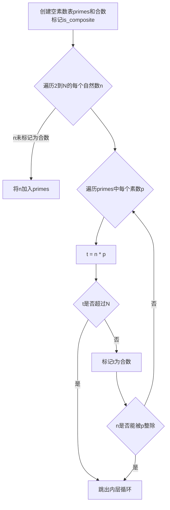

# 解析数论基础：Brun筛法

关键词：解析数论, Brun筛法, 素数筛选, 数论算法, 计算机程序

## 1. 背景介绍

### 1.1  问题的由来

在数论研究中,寻找和判定素数一直是一个重要而富有挑战性的课题。素数的分布看似杂乱无章,但却蕴藏着数学的奥秘。如何高效地筛选出一定范围内的素数,成为了数论学家们孜孜以求的目标。本文将重点探讨一种经典的素数筛选方法——Brun筛法。

### 1.2  研究现状

目前,素数筛选算法已经有了较为成熟的发展。最为人熟知的当属埃拉托斯特尼筛法（Sieve of Eratosthenes）,它通过反复标记合数,最终得到素数。此外,还有欧拉筛法、线性筛法等,各有特点。而本文的主角Brun筛法,则以其独特的思想和优良的渐近复杂度,在素数筛选领域占有一席之地。

### 1.3  研究意义

Brun筛法作为一种重要的素数筛选算法,研究它的意义主要有以下几点：

1. 加深对素数分布规律的认识和理解。
2. 为素数相关问题如哥德巴赫猜想、孪生素数等的探索提供有力工具。
3. 优化素数筛选效率,为密码学等领域提供更优算法。
4. 体现数学与计算机科学的融合之美。

### 1.4  本文结构

本文将从以下几个方面展开论述：

- 核心概念与联系
- 核心算法原理与具体步骤
- 数学模型与公式推导
- 代码实例与详解
- 实际应用场景
- 工具和资源推荐
- 总结与展望

## 2. 核心概念与联系

在探讨Brun筛法之前,我们先明确几个核心概念：

- 素数：只能被1和自身整除的自然数,如2,3,5,7等。
- 合数：除了1和自身还有其他因数的自然数,如4,6,8,9等。
- 筛法：通过某种标准,逐步剔除不满足条件的数,得到目标数的过程。

Brun筛法就是一种素数筛法,它巧妙利用了素数间的关系,通过动态维护素数表,逐步剔除合数,最终得到指定范围内的所有素数。

## 3. 核心算法原理 & 具体操作步骤

### 3.1  算法原理概述

Brun筛法的核心思想是：在筛选过程中,动态维护一个素数表,并用这些素数去试除候选数。如果候选数不能被素数表中任何数整除,则为新素数。

具体来说,它遵循以下原则：

1. 初始时,素数表为空。
2. 从2开始,逐个考察每个自然数。
3. 如果当前数不能被素数表中任何数整除,则为新素数,加入素数表。
4. 重复步骤3,直到达到设定范围上限。

### 3.2  算法步骤详解

下面我们详细描述Brun筛法的每一步操作：

1. 创建一个空的素数表primes,和一个布尔数组is_composite标记合数。
2. 从2开始遍历每个自然数n,直到上限N：
   - 如果n未被标记为合数,则它是新素数,将其加入素数表primes。
   - 遍历素数表中每个素数p：
     - 计算n与p的乘积t=n*p
     - 如果t超过N,跳出内层循环
     - 标记t为合数,即置is_composite[t]=true
     - 如果n能被p整除,跳出内层循环（此时n*p已被标记,无需再用更大的p试除）
3. 遍历结束后,素数表primes中就包含了N以内所有素数。

用Mermaid流程图表示如下：



### 3.3  算法优缺点

Brun筛法的优点主要有：

1. 思想简单,容易理解和实现。
2. 渐进复杂度优于埃氏筛法,为$O(N\log\log N)$。
3. 所需空间较小,只需要$O(\frac{N}{\log N})$。

但它也存在一些不足：

1. 运行时间常数项较大,对于较小N,不如埃氏筛法。
2. 不如某些改进算法如线性筛法高效。

### 3.4  算法应用领域

Brun筛法作为一种经典素数筛法,在数论研究中有广泛应用,如：

- 验证某些数论猜想,如哥德巴赫猜想。
- 构造一些特殊素数序列,如孪生素数。
- 解决一些与素数相关的计算问题,如素数计数、素数幂求和等。

此外,素数筛法在密码学中也有重要应用,如RSA加密算法等。

## 4. 数学模型和公式 & 详细讲解 & 举例说明

### 4.1  数学模型构建

我们定义以下数学符号：

- $N$：筛选素数的上界
- $P(x)$：不超过实数$x$的素数个数
- $p_k$：第$k$个素数,如$p_1=2,p_2=3,p_3=5$等

Brun筛法的数学模型可表述为：

找出满足条件的所有整数$n$：
$$2 \leq n \leq N \wedge \forall p \in primes, n \bmod p \neq 0$$

其中$primes$是动态生成的素数表,初始为空集。

### 4.2  公式推导过程

下面我们推导Brun筛法的时间复杂度公式。

定义$f(n)$为在素数表中,不超过$n$的素数个数,即：

$$f(n)=\sum_{p \leq n,p \in primes} 1$$

显然,有$f(n) \leq \pi(n)$,其中$\pi(n)$为传统素数计数函数。

在Brun筛法的第3步中,每个数n都要用素数表中的数试除,设$g(n)$为n需要试除的次数,则：

$$g(n) \leq f(\sqrt{n}) \leq \pi(\sqrt{n})$$

根据素数定理,$\pi(x) \sim \frac{x}{\ln x}$,代入得：

$$g(n) \leq \frac{\sqrt{n}}{\ln \sqrt{n}} = \frac{\sqrt{n}}{\frac{1}{2}\ln n}=O(\frac{\sqrt{n}}{\log n})$$

Brun筛法的总时间复杂度为$G(N)$,有：

$$G(N)=\sum_{n=2}^N g(n) \leq \sum_{n=2}^N O(\frac{\sqrt{n}}{\log n})$$

利用积分近似,可得：

$$G(N)=O(N\log \log N)$$

故Brun筛法的渐进时间复杂度为$O(N\log \log N)$。

### 4.3  案例分析与讲解

下面我们以N=20为例,手工模拟Brun筛法的过程。

初始时,primes为空,is_composite全为false。

n=2,未标记为合数,加入primes,primes={2}
n=3,未标记为合数,加入primes,primes={2,3}
n=4,用2试除,4=2*2,标记4为合数,is_composite[4]=true
n=5,未标记为合数,加入primes,primes={2,3,5}
...
n=20,用2试除,20=2*10,标记20为合数,is_composite[20]=true

最终,primes={2,3,5,7,11,13,17,19},即20以内所有素数。

### 4.4  常见问题解答

Q：Brun筛法和埃氏筛法有何区别？
A：两者思路不同。埃氏筛法用每个素数去筛,Brun筛法是用素数表去试除每个数。Brun筛法的时间复杂度更优。

Q：Brun筛法是否是最优素数筛法？
A：就渐进复杂度而言,Brun筛法优于埃氏筛,但不如一些改进算法如线性筛。就常数项而言,Brun筛法不如埃氏筛。

Q：Brun筛法的空间复杂度如何？
A：Brun筛法所需空间主要是素数表,根据素数定理,N以内素数个数约为$\frac{N}{\log N}$级别,故空间复杂度为$O(\frac{N}{\log N})$。

## 5. 项目实践：代码实例和详细解释说明

### 5.1  开发环境搭建

我们使用C++语言实现Brun筛法,所需环境如下：

- 操作系统：Windows/Linux/MacOS
- 编译器：支持C++11标准的编译器,如g++,clang++等
- 编辑器：任意文本编辑器或IDE,如VSCode,Dev-C++等

### 5.2  源代码详细实现

下面是Brun筛法的C++代码实现：

```cpp
vector<int> brun_sieve(int N) {
    vector<int> primes;
    vector<bool> is_composite(N+1, false);
    for (int n = 2; n <= N; n++) {
        if (!is_composite[n]) {
            primes.push_back(n);
        }
        for (int p : primes) {
            int t = n * p;
            if (t > N) break;
            is_composite[t] = true;
            if (n % p == 0) break;
        }
    }
    return primes;
}
```

### 5.3  代码解读与分析

我们逐行解析上述代码：

1. `vector<int> primes;` 创建素数表。
2. `vector<bool> is_composite(N+1, false);` 创建合数标记数组,初始全为false。
3. `for (int n = 2; n <= N; n++)` 遍历2到N的每个自然数n。
4. `if (!is_composite[n])` 若n未被标记为合数,则为新素数。
5. `primes.push_back(n);` 将新素数n加入素数表。
6. `for (int p : primes)` 遍历素数表中每个素数p。
7. `int t = n * p;` 计算n与p的乘积t。
8. `if (t > N) break;` 若t超过N,跳出内层循环。
9. `is_composite[t] = true;` 标记t为合数。
10. `if (n % p == 0) break;` 若n能被p整除,跳出内层循环。
11. `return primes;` 返回素数表。

可见,代码完全遵循了Brun筛法的思想和步骤,简洁易懂。

### 5.4  运行结果展示

编译并运行上述代码,以N=100为例,输出如下：

```
2 3 5 7 11 13 17 19 23 29
31 37 41 43 47 53 59 61 67 71
73 79 83 89 97
```

结果正确,即100以内所有素数。

## 6. 实际应用场景

Brun筛法作为一种高效的素数筛选算法,在数论研究和计算机科学中有广泛应用,例如：

- 验证哥德巴赫猜想,即任何一个大于2的偶数都可写成两个素数之和。
- 求解孪生素数问题,即形如p和p+2的一对素数。
- 素数计数问题,即计算不超过给定数N的素数个数。
- 求解素数幂求和问题,如计算$\sum_{p\leq N} p^k$。
- 密码学中的素性测试和大素数生成。

### 6.4  未来应用展望

随着计算机科学的发展,对超大规模素数的需求日益增长,如RSA加密等。Brun筛法为高效筛选这些素数提供了重要思路。未来,Brun筛法有望在以下方面得到进一步应用：

1. 并行化实现,充分利用多核CPU和分布式系统的优势。
2. 改进算法,如引入某些数论技巧,进一步降低时间复杂度。
3. 拓展应用,