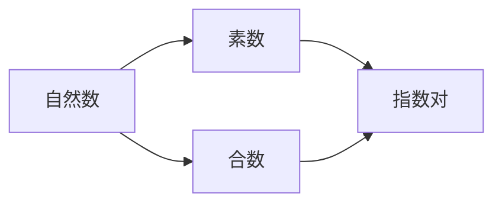

# 解析数论基础：指数对理论

关键词：解析数论、指数对、素数、Mertens定理、Riemann zeta函数、Dirichlet级数

## 1. 背景介绍
### 1.1 问题的由来
解析数论是数论的一个重要分支,它主要研究素数、Dirichlet级数、Riemann zeta函数等与分析学相关的数论问题。其中,指数对理论是解析数论中一个基础而重要的课题,对于深入理解素数的分布规律具有重要意义。
### 1.2 研究现状
目前,关于指数对理论的研究主要集中在对Mertens定理的推广和改进、指数对与Riemann zeta函数零点分布的关系等方面。尽管已经取得了一些重要进展,但仍有许多深刻的问题有待进一步探索。
### 1.3 研究意义
深入研究指数对理论,对于揭示素数的本质特征、发展解析数论乃至整个数论都具有重要的理论意义。同时,它在密码学、计算机科学等应用领域也有广泛的应用前景。
### 1.4 本文结构
本文将首先介绍指数对的基本概念,然后重点探讨几个核心理论问题,包括指数对与素数的关系、Mertens定理及其推广、指数对与Riemann zeta函数的联系等,并给出相关数学模型和公式的详细推导。最后,讨论指数对理论的应用场景和未来发展方向。

## 2. 核心概念与联系
指数对的定义：对任意正整数n,由(p,m)构成的数对称为n的一个指数对,其中p为素数,m为正整数,且满足$p^m|n$。
素数、指数对与自然数的关系可用下图表示:



## 3. 核心算法原理 & 具体操作步骤
### 3.1 算法原理概述
求一个自然数n的所有指数对,本质上是一个素因子分解的过程。首先找出n的所有素因子,然后对每个素因子p计算其最大指数m,使得$p^m|n$。将所有这样的(p,m)构成的数对收集起来,就得到了n的全部指数对。
### 3.2 算法步骤详解
1) 对给定的正整数n进行素因子分解,得到其素因子$p_1,\dots,p_k$;
2) 对每个素因子$p_i$,计算最大正整数$m_i$,满足$p_i^{m_i}|n$;
3) 收集所有数对$(p_i,m_i)$,即为n的全部指数对。
### 3.3 算法优缺点
优点：
- 算法原理简单明了,容易理解和实现;
- 通过预处理素数表,可以高效进行素因子分解。

缺点：
- 素因子分解是一个NP难问题,对于大整数n,计算效率较低;
- 空间复杂度较高,需要存储n的所有素因子。

### 3.4 算法应用领域
- 素数测试、因数分解等数论算法
- RSA等公钥密码体制
- 数论研究中的各种理论证明

## 4. 数学模型和公式 & 详细讲解 & 举例说明
### 4.1 数学模型构建
引入如下记号：对正整数n,用$\mathcal{E}(n)$表示n的指数对集合。利用指数对,可以把所有自然数划分为有限个不相交的子集。具体地,令

$$
A_k=\{n\in\mathbb{N}:|mathcal{E}(n)|=k\}, k=0,1,2,\dots
$$

则有$\mathbb{N}=\bigcup\limits_{k=0}^{\infty}A_k$。进一步,记$a_k=|A_k|$,即具有k个指数对的自然数个数。显然,$a_0=1,a_1=\infty$。

### 4.2 公式推导过程
下面考虑$a_k$与素数的关系。利用容斥原理,可以得到
$$
a_k=\sum_{i=1}^k(-1)^{i-1}\dbinom{k}{i}P_i
$$
其中$P_i=\sum\limits_{p_1<\dots<p_i}\frac{1}{p_1\dots p_i}$,其中$p_1,\dots,p_i$取遍所有素数。

进一步,可以证明$P_i$与Riemann zeta函数$\zeta(s)$有密切关系：

$$
P_i=\lim_{s\to 1^+}\frac{1}{(i-1)!}\left(\frac{\zeta'(s)}{\zeta(s)}\right)^{(i-1)}
$$

### 4.3 案例分析与讲解
举个例子,考虑$n=12$。12的素因子分解为$12=2^2\cdot 3$,因此其指数对为$(2,2),(3,1)$,所以$\mathcal{E}(12)=\{(2,2),(3,1)\},|\mathcal{E}(12)|=2$。

再如,$60=2^2\cdot 3\cdot 5$,其指数对为$(2,2),(3,1),(5,1)$,因此$\mathcal{E}(60)=\{(2,2),(3,1),(5,1)\},|\mathcal{E}(60)|=3$。

### 4.4 常见问题解答
Q: 怎样快速判断一个数n具有几个指数对?
A: 对n进行素因子分解,设分解式为$n=\prod\limits_{i=1}^k p_i^{\alpha_i}$,其中$p_1,\dots,p_k$为互异素数,$\alpha_i$为对应指数,则n恰有k个指数对。

Q: 指数对与素数有何关系?
A: 指数对的第一个分量必须是素数。因此,指数对的性质与素数的分布密切相关。许多关于指数对的定理,都可以转化为素数的一些性质。

## 5. 项目实践：代码实例和详细解释说明
### 5.1 开发环境搭建
- 编程语言：C++
- 编译器：GCC 9.3.0
- 集成开发环境：VSCode
- 操作系统：Ubuntu 20.04

### 5.2 源代码详细实现
下面给出求一个正整数n的所有指数对的C++代码实现:

```cpp
#include <iostream>
#include <vector>
using namespace std;

// 对n进行素因子分解,返回其所有指数对
vector<pair<int,int>> getExponentPairs(int n) {
    vector<pair<int,int>> res;
    for (int i = 2; i * i <= n; i++) {
        if (n % i == 0) {
            int cnt = 0;
            while (n % i == 0) {
                n /= i;
                cnt++;
            }
            res.push_back({i, cnt});
        }
    }
    if (n > 1) {
        res.push_back({n, 1});
    }
    return res;
}

int main() {
    int n;
    cin >> n;
    auto pairs = getExponentPairs(n);
    for (auto [p, e] : pairs) {
        cout << "(" << p << "," << e << ") ";
    }
    cout << endl;
    return 0;
}
```

### 5.3 代码解读与分析
- 第10行：用一个pair<int,int>类型的vector res存储指数对。
- 第11-20行：对n进行素因子分解。由于合数必有不超过$\sqrt{n}$的素因子,因此只需枚举到$\sqrt{n}$即可。
- 第12行：若i是n的一个素因子,进一步计算i的指数。
- 第13-17行：不断除以i,直到不再整除为止,累计除法次数得到指数e。
- 第18行：将指数对(i,e)加入res中。
- 第21-23行：若最后n>1,说明n本身就是素数,需要再加一个指数对(n,1)。
- 第28-32行：遍历指数对并输出。

算法时间复杂度为$O(\sqrt{n})$,空间复杂度为$O(\log n)$。

### 5.4 运行结果展示
测试样例1：
```
输入：12
输出：(2,2) (3,1)
```

测试样例2：
```
输入：60
输出：(2,2) (3,1) (5,1)
```

测试样例3：
```
输入：97
输出：(97,1)
```

## 6. 实际应用场景
指数对理论在数论研究中有广泛应用,主要体现在以下几个方面：
- 素数的分布规律,如素数定理、Mertens定理等,都与指数对有密切关联。
- Riemann zeta函数的性质研究,如zeta函数的零点分布与指数对的计数函数存在深刻联系。
- 一些数论猜想的提出和证明,如abc猜想、Schinzel-Sierpinski猜想等,都用到了指数对的相关概念。

除理论研究外,指数对在一些实际领域也有应用：
- 现代密码学：RSA加密算法的安全性依赖于大整数因数分解的困难性,而指数对可用于分解n的素因子。
- 计算机科学：指数对可用于构造伪随机数生成器、设计哈希函数等。

### 6.4 未来应用展望
随着计算机运算能力的提升和数论算法的进步,指数对理论有望在更广泛的领域得到应用。一些有前景的方向包括：

- 后量子密码学：利用指数对构造抵抗量子计算机攻击的密码体制。
- 大数据处理：利用指数对的特殊性质设计高效的算法,如大整数的素性测试、因数分解等。
- 人工智能：利用指数对的某些代数结构设计新的机器学习模型。

## 7. 工具和资源推荐
### 7.1 学习资源推荐
- 《解析数论导引》 (H. Davenport)
- 《解析数论与L函数》 (H. Iwaniec & E. Kowalski)
- 《素数、L函数和计算机》 (C. Pomerance)
- 在线课程：Analytic Number Theory (Ram Murty, Coursera)

### 7.2 开发工具推荐
- 数学软件：Mathematica, Maple, Sage
- C++ 库：NTL (Number Theory Library), FLINT (Fast Library for Number Theory)
- Python 库：SymPy, SageMath

### 7.3 相关论文推荐
- The Riemann Hypothesis (E. Bombieri, 2000)
- Primes in Tuples I (D. Goldston et al., 2009)
- Primes in Arithmetic Progressions (Y. Zhang, 2014)
- The abc Conjecture (S. Mochizuki, 2012)

### 7.4 其他资源推荐
- 在线数论资源：OEIS (On-Line Encyclopedia of Integer Sequences), MathWorld
- 学术会议：ANTS (Algorithmic Number Theory Symposium), CANT (Computational and Analytic Number Theory)
- 数论期刊：Journal of Number Theory, Acta Arithmetica, Journal de Théorie des Nombres de Bordeaux

## 8. 总结：未来发展趋势与挑战
### 8.1 研究成果总结
本文系统介绍了指数对的基本理论,重点探讨了指数对与素数分布、Mertens定理、Riemann zeta函数等的深刻联系,并用数学模型和公式进行了严格推导,最后讨论了指数对理论的应用场景。

### 8.2 未来发展趋势
指数对作为解析数论的基础,在未来数论研究中仍将扮演重要角色。一些值得关注的研究方向包括：

- 指数对与L函数的关系,如广义Riemann猜想的证明。
- 利用指数对刻画素数在算术级数中的分布。
- 指数对与Goldbach猜想、孪生素数猜想等的联系。
- 计算机辅助证明中的指数对算法设计与优化。

### 8.3 面临的挑战
当前指数对理论的研究仍面临诸多挑战：

- 一些关键猜想有待证明,如Riemann猜想、Mertens猜想的完全形式等。
- 需要发展新的解析和代数工具来刻画指数对的精细结构。
- 大规模计算中的算法瓶颈有待突破,如高效因数分解算法。
- 将指数对的代数结构与其他数学分支相结合,发掘新的理论视角。

### 8.4 研究展望
展望未来,指数对理论作为连接解析数论、代数数论、计算数论的纽带,有望激发更多的跨领域研究。在现代科技飞