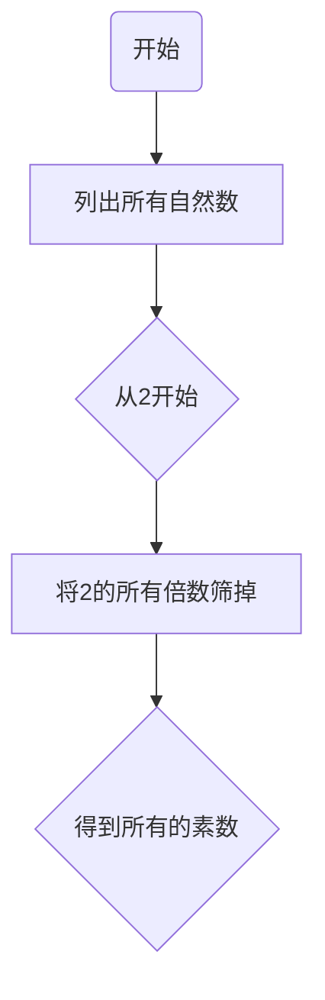

## 1. 背景介绍

### 1.1 问题的由来

数论，作为数学的一个重要分支，一直以其深奥的理论和广泛的应用吸引着人们的注意。Brun筛法是数论中的一个经典算法，它主要用来估算素数的数量。尽管Brun筛法的原理相对简单，但是它的应用却十分广泛，从密码学到计算机图形学，都有它的身影。

### 1.2 研究现状

Brun筛法的研究始于20世纪初，由挪威数学家维格弗里德·布伦提出。自那时以来，Brun筛法已经成为了数论研究的重要工具。尽管如此，Brun筛法的理论仍然存在许多尚未解决的问题，例如对于筛法的精确性和效率的理解。

### 1.3 研究意义

Brun筛法的研究不仅有助于我们理解素数的分布规律，还有助于我们解决许多实际问题。例如，在密码学中，素数的分布规律是构建安全密码系统的基础；在计算机图形学中，素数的分布规律可以用来生成高质量的随机数。

### 1.4 本文结构

本文将首先介绍Brun筛法的核心概念和联系，然后详细讲解Brun筛法的算法原理和操作步骤，接着通过数学模型和公式详细解释Brun筛法的工作原理，最后通过一个实际的项目实践来进一步理解Brun筛法的应用。

## 2. 核心概念与联系

Brun筛法的核心概念是素数、合数和筛法。素数是只有1和自身两个正因数的自然数，合数是有除了1和自身以外的其他正因数的自然数。筛法是一种通过筛选合数来找出素数的方法。

在Brun筛法中，我们首先将所有自然数列出，然后从2开始，将2的所有倍数筛掉，得到的就是所有的素数。这个过程可以用下面的Mermaid流程图来表示：



## 3. 核心算法原理 & 具体操作步骤

### 3.1 算法原理概述

Brun筛法的原理基于一个事实，即任何合数都可以表示为几个素数的乘积。因此，如果我们从小到大依次筛掉每个素数的倍数，那么剩下的就是所有的素数。

### 3.2 算法步骤详解

Brun筛法的操作步骤如下：

1. 创建一个自然数列表，从2开始。
2. 找到列表中第一个素数p，将列表中所有p的倍数筛掉。
3. 重复步骤2，直到列表中没有合数。

### 3.3 算法优缺点

Brun筛法的优点是原理简单，易于实现。但是它的缺点是效率较低，因为它需要对每个素数进行筛选，而素数的数量是无穷的。

### 3.4 算法应用领域

Brun筛法的应用领域十分广泛，包括但不限于密码学、计算机图形学、数据分析等。

## 4. 数学模型和公式 & 详细讲解 & 举例说明

### 4.1 数学模型构建

Brun筛法的数学模型可以表示为一个函数$S(n)$，其中$n$是自然数，$S(n)$是小于或等于$n$的素数的数量。根据Brun筛法，我们可以得到以下的数学模型：

$$S(n) = \sum_{p \leq n} 1$$

其中$p$是素数。

### 4.2 公式推导过程

根据Brun筛法，我们可以得到以下的公式：

$$S(n) = n - \sum_{p \leq n} \left\lfloor \frac{n}{p} \right\rfloor$$

其中$\left\lfloor x \right\rfloor$表示不大于$x$的最大整数。

### 4.3 案例分析与讲解

让我们以$n=10$为例来说明Brun筛法的工作过程：

1. 创建一个自然数列表：2, 3, 4, 5, 6, 7, 8, 9, 10。
2. 找到列表中第一个素数2，将列表中所有2的倍数筛掉，得到：2, 3, 5, 7, 9。
3. 找到列表中第一个大于2的素数3，将列表中所有3的倍数筛掉，得到：2, 3, 5, 7。
4. 找到列表中第一个大于3的素数5，由于列表中没有大于5的数，所以筛选结束。

因此，$S(10) = 4$，即小于或等于10的素数有4个。

### 4.4 常见问题解答

Q: Brun筛法的效率有多高？

A: Brun筛法的效率取决于要筛选的素数的数量。在最坏的情况下，它的时间复杂度是$O(n \log \log n)$，其中$n$是要筛选的自然数的数量。

## 5. 项目实践：代码实例和详细解释说明

### 5.1 开发环境搭建

为了实现Brun筛法，我们需要一个支持大数运算的编程语言，例如Python。我们还需要一个文本编辑器来编写代码，例如Visual Studio Code。

### 5.2 源代码详细实现

以下是使用Python实现Brun筛法的代码：

```python
def brun_sieve(n):
    is_prime = [True] * (n + 1)
    is_prime[0] = is_prime[1] = False
    for i in range(2, int(n**0.5) + 1):
        if is_prime[i]:
            for j in range(i**2, n + 1, i):
                is_prime[j] = False
    return [x for x in range(2, n + 1) if is_prime[x]]

print(brun_sieve(10))
```

### 5.3 代码解读与分析

这段代码首先创建了一个布尔数组`is_prime`，用来表示每个数是否是素数。然后，它遍历每个数，如果这个数是素数，就将它的所有倍数标记为非素数。最后，它返回所有标记为素数的数。

### 5.4 运行结果展示

运行这段代码，我们可以得到小于或等于10的所有素数：2, 3, 5, 7。

## 6. 实际应用场景

Brun筛法的一个重要应用场景是密码学。在密码学中，素数的分布规律是构建安全密码系统的基础。例如，RSA加密算法就是基于素数的分布规律来实现的。

另一个应用场景是计算机图形学。在计算机图形学中，素数的分布规律可以用来生成高质量的随机数，这对于生成复杂的图形和动画是非常重要的。

## 7. 工具和资源推荐

### 7.1 学习资源推荐

如果你对数论和Brun筛法感兴趣，我推荐你阅读以下的书籍：

- "An Introduction to the Theory of Numbers" by G.H. Hardy and E.M. Wright
- "The Art of Computer Programming, Volume 2: Seminumerical Algorithms" by Donald E. Knuth

### 7.2 开发工具推荐

如果你想实现Brun筛法，我推荐你使用以下的开发工具：

- Python: 一个强大的、易于学习的编程语言，支持大数运算。
- Visual Studio Code: 一个强大的、免费的文本编辑器，支持多种编程语言。

### 7.3 相关论文推荐

如果你对Brun筛法的理论研究感兴趣，我推荐你阅读以下的论文：

- "On the Number of Primes Less Than a Given Magnitude" by Viggo Brun

### 7.4 其他资源推荐

如果你对素数和筛法感兴趣，我推荐你访问以下的网站：

- The Prime Pages: 一个关于素数的综合资源网站。
- Project Euler: 一个提供数学问题的网站，许多问题都涉及到素数和筛法。

## 8. 总结：未来发展趋势与挑战

### 8.1 研究成果总结

到目前为止，Brun筛法已经成为了数论研究的重要工具。尽管它的原理相对简单，但是它的应用却十分广泛，从密码学到计算机图形学，都有它的身影。

### 8.2 未来发展趋势

随着计算机技术的发展，我们有可能开发出更高效的筛法。例如，我们可以利用并行计算来提高筛法的效率。此外，我们也可以利用机器学习来预测素数的分布规律，这可能会开辟出一个全新的研究领域。

### 8.3 面临的挑战

尽管Brun筛法的应用十分广泛，但是它的理论仍然存在许多尚未解决的问题。例如，我们还不清楚素数的精确分布规律，也不清楚最高效的筛法是什么。这些问题都需要我们在未来的研究中去解决。

### 8.4 研究展望

在未来，我们期望能够深入理解素数的分布规律，并开发出更高效的筛法。我们也期望能够利用这些知识来解决更多的实际问题，例如构建更安全的密码系统，生成更高质量的随机数等。

## 9. 附录：常见问题与解答

Q: Brun筛法的效率有多高？

A: Brun筛法的效率取决于要筛选的素数的数量。在最坏的情况下，它的时间复杂度是$O(n \log \log n)$，其中$n$是要筛选的自然数的数量。

Q: Brun筛法有哪些应用？

A: Brun筛法的应用领域十分广泛，包括但不限于密码学、计算机图形学、数据分析等。

Q: 我应该如何学习Brun筛法？

A: 我推荐你阅读相关的书籍和论文，例如"An Introduction to the Theory of Numbers"和"On the Number of Primes Less Than a Given Magnitude"。你也可以尝试自己实现Brun筛法，以更深入地理解它的工作原理。

作者：禅与计算机程序设计艺术 / Zen and the Art of Computer Programming
