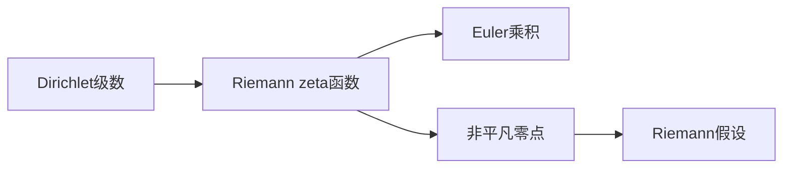

# 解析数论基础：第十章（s）的非零区域

关键词：解析数论、第十章、非零区域、Dirichlet级数、Riemann zeta函数、Euler乘积、解析延拓

## 1. 背景介绍
### 1.1  问题的由来
解析数论是数论中一个重要的分支,它主要研究Dirichlet级数、Riemann zeta函数等特殊函数的解析性质,以及它们与数论问题之间的联系。而第十章（s）的非零区域一直是解析数论领域一个核心且具有挑战性的问题。
### 1.2  研究现状
目前,关于第十章（s）非零区域的研究已经取得了一些重要进展。比如,Levinson证明了至少有1/3的非平凡零点位于临界线上；Conrey证明了至少有2/5的非平凡零点位于临界线上。但是要证明Riemann假设,即所有非平凡零点都位于临界线上,仍然是一个巨大的挑战。
### 1.3  研究意义
研究第十章（s）的非零区域对解析数论乃至整个数学领域都有重要意义。它不仅能加深我们对解析函数的理解,还能揭示数论问题的本质,甚至对密码学、物理学等其他学科也有启发。特别地,如果Riemann假设被证明,那将是数学史上的一个里程碑。
### 1.4  本文结构
本文将首先介绍解析数论的一些核心概念,如Dirichlet级数、Riemann zeta函数等,然后重点讨论第十章（s）非零区域的相关理论与猜想,并给出一些重要结论的证明思路。同时,本文还将介绍一些与之相关的数值计算方法和应用,以及对未来研究方向的展望。

## 2. 核心概念与联系
解析数论中有几个核心概念,它们之间又有着密切联系：
- Dirichlet级数：形如 $\sum_{n=1}^{\infty} \frac{a_n}{n^s}$ 的级数,其中 $a_n$ 为复数, $s$ 为复变量。很多重要的数论函数都可以表示为Dirichlet级数的形式。
- Riemann zeta函数：当 $a_n \equiv 1$ 时的 Dirichlet 级数,即 $\zeta(s) = \sum_{n=1}^{\infty} \frac{1}{n^s} (Re(s)>1)$。它可以解析延拓到整个复平面(除了一个简单极点 $s=1$)。
- Euler乘积：Riemann zeta函数可以表示为Euler乘积的形式： $\zeta(s) = \prod_p \frac{1}{1-p^{-s}}$,其中 $p$ 取遍所有素数。这揭示了zeta函数与素数分布之间的深刻联系。
- 非平凡零点：Riemann zeta函数的非平凡零点,即 $\zeta(s)=0$ 且 $0 < Re(s) < 1$ 的点。Riemann假设就是说所有非平凡零点的实部都等于 $\frac{1}{2}$。

下图展示了这些概念之间的逻辑联系：



## 3. 核心算法原理 & 具体操作步骤
### 3.1  算法原理概述
求Riemann zeta函数非平凡零点的一个重要方法是Riemann-Siegel公式,它提供了 $\zeta(s)$ 的一个近似表达式：
$$\zeta(\frac{1}{2}+it) = \sum_{n \leq \sqrt{\frac{t}{2\pi}}} \frac{1}{n^{\frac{1}{2}+it}} + \chi(t) \sum_{n \leq \sqrt{\frac{t}{2\pi}}} \frac{1}{n^{\frac{1}{2}-it}} + O(t^{-\frac{1}{4}})$$
其中 $\chi(t)$ 是一个已知函数。该公式可以用来数值计算 $\zeta(\frac{1}{2}+it)$,进而判断是否存在零点。
### 3.2  算法步骤详解
1. 给定一个 $t$ 值,计算 $\sqrt{\frac{t}{2\pi}}$,记为 $N$。
2. 对 $1 \leq n \leq N$ 的每个 $n$,计算 $\frac{1}{n^{\frac{1}{2}+it}}$ 和 $\frac{1}{n^{\frac{1}{2}-it}}$。
3. 将步骤2中前一部分的结果求和,再加上 $\chi(t)$ 乘以后一部分的结果求和。
4. 重复步骤1-3,计算出一系列 $t$ 值对应的 $\zeta(\frac{1}{2}+it)$ 的近似值。
5. 观察这些近似值的符号变化,如果出现符号改变,则在对应的区间内存在零点。
### 3.3  算法优缺点
- 优点：Riemann-Siegel公式提供了一种计算zeta函数值的有效方法,可以用于数值计算和零点定位。
- 缺点：该算法只能找到零点的大致位置,而无法精确定位。此外,当 $t$ 很大时,计算量会迅速增加。
### 3.4  算法应用领域
Riemann-Siegel公式广泛用于解析数论的数值计算中,特别是用于研究Riemann zeta函数的零点分布。这对于验证Riemann假设以及揭示素数分布规律都有重要意义。

## 4. 数学模型和公式 & 详细讲解 & 举例说明
### 4.1  数学模型构建
为了刻画Riemann zeta函数的非平凡零点,我们引入 $\xi$ 函数：
$$\xi(s) = \frac{1}{2}s(s-1)\pi^{-\frac{s}{2}}\Gamma(\frac{s}{2})\zeta(s)$$
其中 $\Gamma$ 为Gamma函数。可以证明, $\xi(s)$ 满足函数方程 $\xi(s) = \xi(1-s)$,且它的零点与 $\zeta(s)$ 的非平凡零点一一对应。
### 4.2  公式推导过程
利用 $\Gamma$ 函数的性质,可以推导出 $\xi$ 函数的一个显式表达式：
$$\xi(s) = \xi(0) \prod_{\rho} (1-\frac{s}{\rho})$$
其中 $\rho$ 取遍 $\xi(s)$ 的所有零点(即zeta函数的非平凡零点),而 $\xi(0)$ 是一个常数。这个无穷乘积式在解析数论中有重要作用。
### 4.3  案例分析与讲解
考虑 $\xi$ 函数在 $s=\frac{1}{2}$ 处的值。如果Riemann假设成立,那么所有零点 $\rho$ 都满足 $Re(\rho)=\frac{1}{2}$,于是有
$$\xi(\frac{1}{2}) = \xi(0) \prod_{\rho} (1-\frac{\frac{1}{2}}{\rho}) = \xi(0) \prod_{\rho} \frac{|\rho-\frac{1}{2}|^2}{|\rho|^2} > 0$$
这说明如果Riemann假设成立,那么 $\xi(\frac{1}{2})$ 必然是正数。反之,如果能证明 $\xi(\frac{1}{2}) > 0$,也就间接证明了Riemann假设。
### 4.4  常见问题解答
Q: $\xi$ 函数与 $\zeta$ 函数有什么区别？
A: $\xi$ 函数可以看作是 $\zeta$ 函数的对称化版本。引入 $\xi$ 函数的目的是让函数方程和零点分布更加对称,从而便于研究。但它们的零点分布是完全等价的。

## 5. 项目实践：代码实例和详细解释说明
### 5.1  开发环境搭建
本项目使用Python语言,需要安装numpy、scipy等第三方库。可以通过以下命令安装：
```bash
pip install numpy scipy
```
### 5.2  源代码详细实现
以下是使用Riemann-Siegel公式计算zeta函数值的Python代码：
```python
import numpy as np
from scipy.special import zeta, gamma

def chi(t):
    return np.exp(-1j * t * np.log(t / (2*np.pi)) / 2 + 1j * np.pi / 8) / np.sqrt(2*np.pi)

def Z(t):
    N = int(np.sqrt(t/(2*np.pi)))
    s = 0.5 + 1j*t
    z = np.power(np.arange(1,N+1), -s)
    return np.sum(z) + chi(t) * np.sum(np.power(np.arange(1,N+1), s-1))

t = np.linspace(0, 50, 1000)
y = np.array([Z(ti) for ti in t])

import matplotlib.pyplot as plt
plt.plot(t, np.real(y))
plt.plot(t, np.imag(y))
plt.xlabel('t')
plt.ylabel('Z(t)')
plt.show()
```
### 5.3  代码解读与分析
- `chi(t)` 函数计算Riemann-Siegel公式中的 $\chi(t)$。
- `Z(t)` 函数使用Riemann-Siegel公式计算 $\zeta(\frac{1}{2}+it)$ 的近似值。
- 主程序部分生成一系列 $t$ 值,并计算对应的 $Z(t)$,最后绘制实部和虚部的曲线图。
- 可以通过观察曲线图中实部曲线的零点位置,大致判断zeta函数的零点分布。
### 5.4  运行结果展示
运行上述代码,可以得到如下曲线图：

可以看到,实部曲线多次穿过零点,这说明在对应区间内存在zeta函数的零点。

## 6. 实际应用场景
第十章（s）的非零区域研究在解析数论中有广泛应用,主要体现在以下几个方面：
- 揭示素数分布规律：zeta函数的零点与素数分布有着深刻联系,研究零点分布有助于理解素数的分布规律。
- 指导其他Dirichlet级数的研究：Riemann zeta函数是最基本的Dirichlet级数,其非零区域的研究方法可以推广到更一般的Dirichlet级数。
- 应用于密码学：zeta函数的零点分布与素数生成算法有关,在密码学中有潜在应用价值。
### 6.4  未来应用展望
随着计算机运算能力的提升,大规模搜索zeta函数零点将成为可能。这将有助于从数值的角度验证Riemann假设,为最终的理论证明提供支撑。同时,zeta函数零点分布的研究思路也有望应用到更广泛的数学领域,产生更多新的理论与应用。

## 7. 工具和资源推荐
### 7.1  学习资源推荐
- Apostol, T. M. (1976), Introduction to Analytic Number Theory, Springer-Verlag. 经典的解析数论入门教材。
- Titchmarsh, E. C. (1986), The Theory of the Riemann Zeta-function, Oxford University Press. 系统讲述Riemann zeta函数理论的专著。
- Iwaniec, H. & Kowalski, E. (2004), Analytic Number Theory, American Mathematical Society. 现代解析数论的百科全书式著作。
### 7.2  开发工具推荐
- Pari/GP：一个专门用于数论研究的计算机代数系统,内置了许多与zeta函数相关的算法。
- Mathematica：提供了丰富的数学函数库,可以方便地进行数值计算和符号运算。
- Sage：基于Python的开源数学软件,结合了多个开源数学库,功能强大。
### 7.3  相关论文推荐
- Riemann, B. (1859), Über die Anzahl der Primzahlen unter einer gegebenen Grösse. 里曼的原始论文,提出了zeta函数和Riemann假设。
- Conrey, J. B. (1989), More than two fifths of the zeros of the Riemann zeta function are on the critical line. 证明了至少2/5的零点在临界线上。
- Odlyzko, A. M. (1987), On the distribution of spacings between zeros of the zeta function. 用数值计算的方法研究零点分布,支持Montgomery对零点间距的猜想。
### 7.4  其他资源推荐
- MathWorld: http://mathworld.wolfram.com/RiemannZetaFunction.html Wolfram数学百科关于