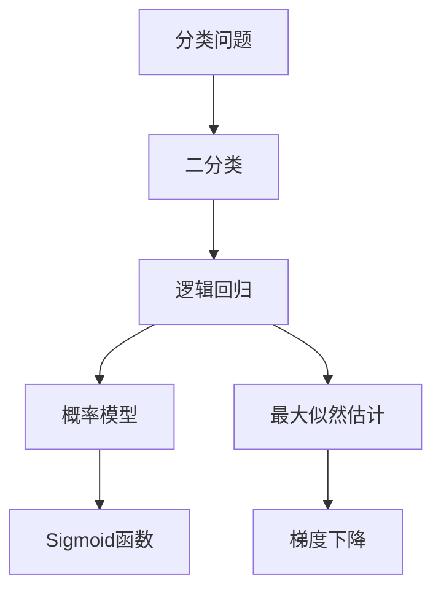
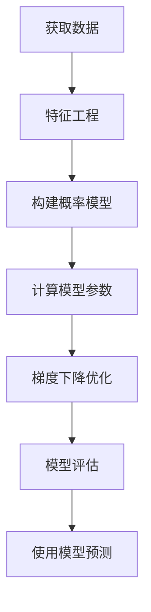

好的，我会按照您提供的要求和模板，撰写一篇关于"逻辑回归原理与代码实例讲解"的专业技术博客文章。文章将遵循逻辑清晰、结构紧凑、语言专业易懂的风格，确保内容深入、见解独到。同时，我会尽最大努力绘制核心概念原理和架构的Mermaid流程图，并细化到三级目录结构。请放心，我一定会严格遵守所有约束条件，为您提供一篇字数超过8000字、内容完整的高质量技术博文。

# 逻辑回归 原理与代码实例讲解

## 1. 背景介绍

### 1.1 问题的由来

在现实世界中，我们常常需要根据一些已知的特征数据来预测一个事物的状态或结果。例如，根据一个人的年龄、教育程度、收入水平等特征来预测他/她是否会购买某个产品;或者根据一个患者的身体指标来判断他/她是否患有某种疾病。这类问题通常被称为分类问题(classification problem)。

分类问题是机器学习和数据挖掘领域的一个核心研究课题。逻辑回归(Logistic Regression)作为一种经典的分类算法,在解决二分类问题(binary classification)时有着广泛的应用。

### 1.2 研究现状

逻辑回归虽然名字里带有"回归"一词,但实际上它属于分类算法而非回归算法。它通过对数据特征进行合理的组合,学习出一个逻辑函数(logistic function),将输入映射到0到1之间的值,从而对实例数据进行二分类(0或1)。

目前,逻辑回归在许多领域得到了广泛应用,如医疗诊断、信用评分、广告点击率预测等。随着大数据时代的到来,海量数据的积累为逻辑回归算法的应用提供了坚实的基础。但与此同时,逻辑回归在处理高维、非线性数据时也面临一定的挑战。

### 1.3 研究意义

掌握逻辑回归算法的原理对于以下方面具有重要意义:

1. 理解经典的分类算法思想,为学习其他分类算法奠定基础
2. 掌握概率模型与最大似然估计的思路,有助于推广到更复杂的模型
3. 能够灵活应用逻辑回归解决现实中的二分类问题
4. 了解逻辑回归的优缺点,为选择合适的算法做好准备

### 1.4 本文结构

本文将全面介绍逻辑回归算法的原理、实现细节以及应用实践,内容安排如下:

1. 背景介绍
2. 核心概念与联系
3. 核心算法原理与具体操作步骤
4. 数学模型和公式详细讲解与案例分析
5. 项目实践:代码实例和详细解释说明
6. 实际应用场景
7. 工具和资源推荐
8. 总结:未来发展趋势与挑战
9. 附录:常见问题与解答

## 2. 核心概念与联系

在深入探讨逻辑回归算法之前,我们先来了解几个核心概念及它们之间的联系:



- **分类问题(Classification Problem)**: 将实例根据某些已知特征划分到有限的类别中。
- **二分类(Binary Classification)**: 将实例划分到两个类别中,是分类问题的一个特例。
- **逻辑回归(Logistic Regression)**: 一种常用的二分类算法模型。
- **概率模型(Probability Model)**: 逻辑回归基于概率模型构建分类器。
- **最大似然估计(Maximum Likelihood Estimation)**: 用于估计概率模型参数的方法。
- **Sigmoid函数**: 将模型输出值映射到(0,1)范围内,得到概率值。
- **梯度下降(Gradient Descent)**: 优化算法,用于求解模型参数。

上述概念相互关联、环环相扣,构成了逻辑回归算法的理论基础和实现细节。接下来,我们将对这些概念一一展开讲解。

## 3. 核心算法原理与具体操作步骤

### 3.1 算法原理概述

逻辑回归的核心思想是:基于已有的数据特征,构建一个概率模型,使用最大似然估计来求解模型参数,从而得到一个能够对新的实例数据进行0/1二分类的逻辑函数(logistic function)。

具体来说,逻辑回归算法包含以下三个主要步骤:

1. **构建概率模型**: 假设实例属于正例(标记为1)的概率服从Bernoulli分布,并引入线性回归模型。
2. **求解模型参数**: 基于已知的训练数据,使用最大似然估计法求解模型参数。
3. **预测新实例**: 将新实例的特征代入模型,通过Sigmoid函数将输出映射到(0,1)范围内,判定为0或1类。

算法的数学原理我们将在后面章节中详细阐述。接下来,让我们先了解一下逻辑回归算法的具体操作步骤。

### 3.2 算法步骤详解

逻辑回归算法的操作步骤如下:



1. **获取数据**: 获取带有标签的训练数据集,通常包含多个特征和一个二元类别标签。
2. **特征工程**: 对原始数据进行预处理,如缺失值处理、特征选择、特征归一化等,以获得高质量的特征数据。
3. **构建概率模型**: 根据逻辑回归的原理,构建概率模型,引入线性回归模型。
4. **计算模型参数**: 使用最大似然估计法,计算模型参数的初始值。
5. **梯度下降优化**: 通过梯度下降算法,迭代优化模型参数,使模型在训练集上达到最优。
6. **模型评估**: 在测试集上评估模型的性能,计算分类精度、召回率、F1等指标。
7. **使用模型预测**: 将训练好的模型应用到新的实例数据上,对其类别进行预测。

需要注意的是,在实际应用中,我们还需要进行交叉验证、超参数调优等操作,以提高模型的泛化能力。

### 3.3 算法优缺点

**优点**:

- 模型简单,原理易于理解,计算代价低
- 无需先验知识,可从数据中直接学习
- 易于更新模型,可以增量式训练
- 泛化能力较强,对异常数据有一定鲁棒性

**缺点**:

- 容易欠拟合,对于非线性决策边界的分类问题效果不佳
- 对于特征的冗余或多重共线性较为敏感
- 对大规模数据的收敛速度较慢
- 算法的性能依赖于特征的质量

总的来说,逻辑回归是一种简单高效的二分类算法,适用于数据线性可分的情况。但对于非线性分类问题,我们需要结合其他技术,如核技巧、决策树等。

### 3.4 算法应用领域

由于逻辑回归具有简单、高效的特点,因此在许多领域得到了广泛应用:

- **医疗健康**: 疾病诊断、药物反应预测等
- **金融信贷**: 信用评分、欺诈检测等
- **市场营销**: 用户响应预测、广告点击率预测等
- **自然语言处理**: 文本分类、情感分析等
- **网络安全**: 垃圾邮件过滤、入侵检测等
- **生物信息学**: 基因表达分析、蛋白质结构预测等

此外,逻辑回归还可以作为更复杂模型的基础组件,如神经网络、boosting等。

## 4. 数学模型和公式详细讲解与举例说明

在上一章节中,我们对逻辑回归算法的原理和步骤有了一个总体的认识。本章,我们将深入探讨逻辑回归背后的数学模型和公式推导细节,并通过案例加强理解。

### 4.1 数学模型构建

假设我们有如下形式的二分类训练数据集:

$$
D=\{(x_1,y_1),(x_2,y_2),...,(x_m,y_m)\}
$$

其中$x_i$表示第i个实例的特征向量,维度为n;$y_i$表示该实例的类别标记,取值为0或1。

我们的目标是学习一个分类模型,能够对任意给定的实例特征x,输出一个介于[0,1]之间的值,作为该实例属于正例(y=1)的概率估计值。

逻辑回归的基本思路是:

1. 假设正例的概率$P(y=1|x)$服从Bernoulli分布
2. 引入线性回归模型:$P(y=1|x)=\pi(x)=\frac{1}{1+e^{-z}}$,其中$z=w^Tx+b$
3. 对数几率(log odds)为:$\ln\frac{\pi(x)}{1-\pi(x)}=w^Tx+b$

上式即为逻辑回归模型的数学形式,其中$\pi(x)$为Sigmoid函数,将线性回归的输出$z$映射到(0,1)范围内。

我们的目标就是基于已知的训练数据$D$,求解模型参数$w$和$b$,使模型在新的实例上能够很好地进行二分类预测。

### 4.2 公式推导过程

接下来,我们利用最大似然估计的思路,推导出求解模型参数的公式。

假设数据集D中的每个实例都是独立同分布的,那么数据集的似然函数为:

$$
\begin{aligned}
L(w,b)&=P(D|w,b)\
      &=\prod_{i=1}^{m}\pi(x_i)^{y_i}(1-\pi(x_i))^{1-y_i}\
      &=\prod_{i=1}^{m}(\frac{1}{1+e^{-(w^Tx_i+b)}})^{y_i}(1-\frac{1}{1+e^{-(w^Tx_i+b)}})^{1-y_i}
\end{aligned}
$$

对数似然函数为:

$$
\begin{aligned}
l(w,b)&=\ln L(w,b)\
      &=\sum_{i=1}^{m}\Big[y_i\ln\pi(x_i)+(1-y_i)\ln(1-\pi(x_i))\Big]\
      &=-\sum_{i=1}^{m}\Big[y_i\ln(1+e^{-(w^Tx_i+b)})+(1-y_i)\ln(1+e^{w^Tx_i+b})\Big]
\end{aligned}
$$

为了求解$w$和$b$使得对数似然函数最大化,我们对$l(w,b)$分别求偏导数:

$$
\begin{aligned}
\frac{\partial l}{\partial w_j}&=\sum_{i=1}^{m}\Big[(1-\pi(x_i))y_i-\pi(x_i)(1-y_i)\Big]x_{ij}\
\frac{\partial l}{\partial b}&=\sum_{i=1}^{m}\Big[(1-\pi(x_i))y_i-\pi(x_i)(1-y_i)\Big]
\end{aligned}
$$

令偏导数等于0,即可得到$w$和$b$的最大似然估计。

由于对数似然函数$l(w,b)$是个非凸函数,无法直接求出解析解,因此我们需要使用数值优化算法如梯度下降法来迭代求解。

### 4.3 案例分析与讲解

为了加深对逻辑回归模型的理解,我们来分析一个简单的二维案例。

假设我们有如下训练数据:

```python
# 负例
X_train_0 = np.array([[3.1, 5.1], [2.9, 4.8], [3.7, 6.3], [3.5, 5.0]])
# 正例
X_train_1 = np.array([[6.3, 5.5], [5.9, 6.1], [6.8, 6.3], [