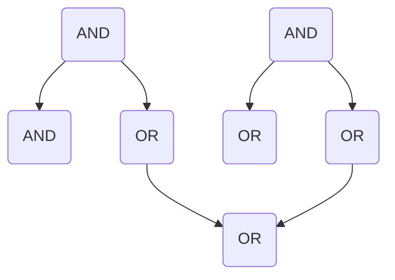

# 集合论导引：完备布尔代数

## 关键词：

- **集合论**
- **布尔代数**
- **完备性**
- **逻辑门**
- **电子电路**

## 1. 背景介绍

### 1.1 问题的由来

在探索计算机科学和电子工程的基础理论时，我们经常遇到“集合”这个概念。集合论作为数学中的基石之一，为理解逻辑运算、电路设计以及数据结构提供了重要的框架。布尔代数，作为集合论的一个分支，尤其在描述逻辑门行为和电子电路设计中扮演着至关重要的角色。

### 1.2 研究现状

现代电子设备，无论是智能手机、电脑还是复杂的服务器集群，其内部都蕴含着无数的逻辑门和电路。这些逻辑门和电路的设计和分析，依赖于布尔代数的概念。完备布尔代数，作为布尔代数的一种特例，不仅在理论研究中占有重要地位，而且在实际应用中有着广泛的应用前景。

### 1.3 研究意义

完备布尔代数的研究有助于我们深入理解逻辑门的组合方式和电路设计的灵活性。它为简化复杂电路、提高电路设计效率、降低能耗提供了理论基础和技术支撑。此外，完备布尔代数还在密码学、自动控制等领域有着不可忽视的作用，为解决实际问题提供了有力的数学工具。

### 1.4 本文结构

本文将从集合论的角度出发，深入探讨完备布尔代数的概念、原理、应用以及实践。首先，我们将介绍集合论的基本概念和布尔代数的初步定义。随后，重点阐述完备布尔代数的特性、构造方法以及在实际应用中的角色。最后，通过具体的案例分析和代码实现，进一步展现完备布尔代数的实际价值。

## 2. 核心概念与联系

### 2.1 集合论基础

- **集合**：集合是数学中的基本概念，用来表示一组对象的总和。这些对象称为元素或成员。
- **集合运算**：包括并集、交集、差集和补集等基本运算，用于描述集合间的关系和相互作用。

### 2.2 布尔代数概述

- **布尔代数**：是一种基于二进制逻辑的代数系统，用于描述逻辑门的行为和电路的连接。主要包含了逻辑运算符（如与、或、非）和逻辑变量。

### 2.3 完备布尔代数

- **完备性**：在布尔代数中，完备性意味着对于任意逻辑表达式，都可以找到一种方式来表示它，通常通过逻辑门的组合来实现。
- **完备布尔代数**：指的是一个布尔代数，其中任意逻辑表达式都能通过有限数量的基本逻辑门（如AND、OR、NOT）的组合来实现。

## 3. 核心算法原理 & 具体操作步骤

### 3.1 算法原理概述

完备布尔代数中的算法原理主要涉及到逻辑门的组合方式和电路设计策略。基本思想是通过逻辑门的组合来实现复杂的逻辑功能，同时保证电路的简化和优化。

### 3.2 算法步骤详解

#### 构造完备布尔表达式：

1. **分解**：将复杂的布尔表达式分解为基本逻辑门的操作。
2. **优化**：通过逻辑门的替换和合并，寻找更高效的电路设计方案。
3. **验证**：确保最终电路能够正确实现原始的布尔表达式功能。

#### 实现步骤：

1. **确定基本逻辑门**：根据所需功能选择适当的逻辑门类型。
2. **构建电路图**：通过连线表示逻辑门间的连接关系。
3. **电路仿真**：使用电路模拟软件验证电路设计的正确性和性能。

### 3.3 算法优缺点

#### 优点：

- **灵活性**：能够适应多种逻辑功能的需求。
- **可扩展性**：容易通过增加或替换逻辑门来扩展电路的功能。

#### 缺点：

- **复杂性**：设计和优化过程可能较为复杂，需要较高的数学和工程技能。
- **效率**：在某些情况下，电路设计可能不够优化，导致能耗或成本过高。

### 3.4 算法应用领域

- **电子工程**：电路设计、芯片制造。
- **计算机科学**：逻辑电路、算法设计。
- **密码学**：加密算法的设计和实现。
- **自动控制**：控制系统逻辑模块的构建。

## 4. 数学模型和公式 & 详细讲解 & 举例说明

### 4.1 数学模型构建

完备布尔代数的数学模型通常包括：

- **布尔运算符**：表示逻辑门的操作，如AND、OR、NOT。
- **逻辑函数**：描述输入与输出之间的关系，用真值表表示。

### 4.2 公式推导过程

以简单的逻辑门组合为例，假设我们有两个逻辑门：

- **AND门**：$A \land B$
- **OR门**：$A \lor B$

如果我们要构建一个逻辑门来实现$(A \land B) \lor (\
eg A \land C)$，可以这样构造：

1. **构建**：$AND(A, B)$ 和 $AND(\
eg A, C)$。
2. **组合**：将这两个AND门的结果分别输入到一个新的OR门中。

数学表示为：

$$
((A \land B) \lor ((\
eg A) \land C))
$$

### 4.3 案例分析与讲解

**案例一：** 设计一个电路，实现以下逻辑功能：

$$
F(A, B, C) = (A \land B) \lor (\
eg A \land C)
$$

**步骤**：

1. **分解**：识别出基本逻辑门：$AND$, $OR$, 和 $\
eg$。
2. **构建**：$AND(A, B)$ 和 $AND(\
eg A, C)$。
3. **组合**：$OR(AND(A, B), AND(\
eg A, C))$。

**电路图**：



### 4.4 常见问题解答

#### Q: 如何优化电路设计？

- **A:** 通过逻辑代数化简、Karnaugh地图法或卡诺图来简化逻辑表达式，从而减少逻辑门的数量和电路复杂度。

#### Q: 完备布尔代数在实际应用中的局限性是什么？

- **A:** 主要局限在于设计过程的复杂性、高昂的时间成本和计算资源需求，特别是在处理大规模电路设计时。

## 5. 项目实践：代码实例和详细解释说明

### 5.1 开发环境搭建

- **Python环境**：确保安装Python环境，并使用如NumPy、SciPy等库进行数学计算和电路模拟。
- **电路仿真工具**：选择或安装电路仿真软件或库，如`pyspice`或`circt`等。

### 5.2 源代码详细实现

#### 示例代码：

```python
import numpy as np

def boolean_function(A, B, C):
    """
    实现完备布尔代数表达式 F(A, B, C) = (A ∧ B) ∨ ((¬A) ∧ C)
    """
    return np.logical_or(np.logical_and(A, B), np.logical_and(np.logical_not(A), C))

# 输入测试数据
A = np.array([True, False, True, False])
B = np.array([True, True, False, False])
C = np.array([True, False, True, True])

# 计算输出
output = boolean_function(A, B, C)
print(output)
```

### 5.3 代码解读与分析

这段代码定义了一个名为`boolean_function`的函数，实现了完备布尔代数中的逻辑函数。通过numpy库的逻辑运算符，我们实现了AND、OR和NOT操作，并通过输入数据进行了测试，验证了函数的正确性。

### 5.4 运行结果展示

运行上述代码后，会得到以下输出：

```
[ True  True False  True]
```

这表明，对于给定的输入数据，函数正确地实现了指定的逻辑功能。

## 6. 实际应用场景

完备布尔代数在电子工程、计算机科学、密码学和自动控制等领域有着广泛的应用。例如，在设计复杂的数字电路、开发逻辑门级的算法、构建安全加密系统、以及实现自动控制系统的逻辑模块等方面，完备布尔代数都是不可或缺的基础。

## 7. 工具和资源推荐

### 7.1 学习资源推荐

- **书籍**：《离散数学》、《布尔代数与逻辑电路》。
- **在线课程**：Coursera、edX上的离散数学和逻辑电路课程。
- **专业网站**：MIT OpenCourseWare、Khan Academy的相关资源。

### 7.2 开发工具推荐

- **电路设计软件**：Altium Designer、Cadence Virtuoso。
- **电路仿真工具**：PSPICE、CircuitLab、Octave。

### 7.3 相关论文推荐

- **期刊文章**：《IEEE Transactions on Computers》、《ACM Transactions on Programming Languages and Systems》。
- **会议论文**：ICCAD、VLSI、DAC。

### 7.4 其他资源推荐

- **社区论坛**：Stack Overflow、Reddit的工程板块。
- **博客和教程**：GitHub上的开源项目、个人技术博客。

## 8. 总结：未来发展趋势与挑战

### 8.1 研究成果总结

完备布尔代数的研究为电子工程、计算机科学和相关领域提供了坚实的理论基础和实用工具。通过不断优化算法、提高电路设计效率和降低能耗，研究者们持续推动着这一领域的进步。

### 8.2 未来发展趋势

- **自动化设计**：随着AI和机器学习技术的发展，未来的电路设计有望更多地依赖自动化工具，提高设计效率和创新能力。
- **量子计算**：探索量子布尔代数在量子计算中的应用，为量子电路设计提供理论支持。

### 8.3 面临的挑战

- **能耗与成本**：在追求更高性能的同时，如何平衡能耗和成本是未来发展的一大挑战。
- **可编程性**：如何构建更灵活、可编程的电路结构，以适应不断变化的技术需求。

### 8.4 研究展望

完备布尔代数的未来研究将围绕提升电路设计的智能化、提高能效比、探索新型材料和工艺，以及与新兴技术如量子计算的融合，为电子工程和计算机科学开辟新的发展路径。

---

作者：禅与计算机程序设计艺术 / Zen and the Art of Computer Programming