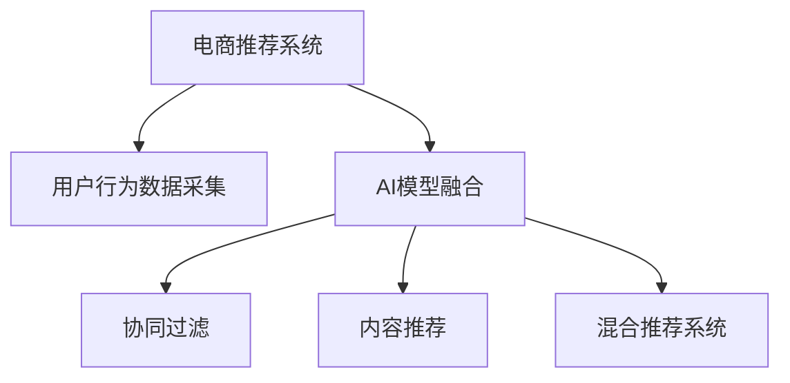

                 

# 大数据驱动的电商搜索推荐：AI 模型融合技术在电商平台的应用

> 关键词：电商搜索推荐, 大数据, AI 模型融合, 推荐系统, 机器学习, 深度学习, 算法优化, 用户行为分析, 协同过滤, 内容推荐

## 1. 背景介绍

### 1.1 问题由来
随着电子商务的迅猛发展，电商平台的用户规模持续扩大，用户行为数据日益丰富。如何利用这些大数据，为用户提供个性化、精准化的推荐服务，成为电商平台发展的关键。推荐系统正是实现这一目标的重要工具。

推荐系统通过分析用户历史行为数据，预测用户兴趣，从而推荐用户可能感兴趣的商品或服务。目前，推荐系统广泛应用于电商平台、视频网站、社交网络等多个领域。

然而，传统推荐系统面临着用户兴趣获取困难、推荐算法复杂、算法解释性差等挑战。因此，越来越多的电商平台开始引入AI技术，提升推荐系统的性能和用户体验。

### 1.2 问题核心关键点
电商搜索推荐的核心在于如何利用用户行为数据，结合AI模型，构建高效、可解释的推荐系统。具体来说，包括以下几个关键点：

- 用户行为数据采集与处理：收集用户搜索、点击、购买等行为数据，构建用户行为特征向量。
- AI模型融合：将多种AI模型融合到推荐系统框架中，综合利用不同模型的优势，提高推荐效果。
- 推荐算法优化：不断优化推荐算法，实现更精准的推荐。
- 用户体验提升：改进推荐界面和功能，提升用户满意度。

## 2. 核心概念与联系

### 2.1 核心概念概述

为更好地理解AI模型融合技术在电商推荐系统中的应用，本节将介绍几个密切相关的核心概念：

- 电商推荐系统(E-commerce Recommendation System)：利用用户行为数据，预测用户兴趣并推荐商品或服务的系统。
- 大数据(Big Data)：指通过各种技术手段，收集、存储、处理和分析海量数据的模式。
- AI 模型融合(AI Model Fusion)：将多个AI模型组合起来，充分发挥各模型的优势，提升系统性能。
- 协同过滤(Collaborative Filtering)：通过分析用户和商品之间的行为数据，预测用户未点击过的商品。
- 内容推荐(Content-Based Recommendation)：通过商品的属性特征，向用户推荐相似的商品。
- 混合推荐系统(Hybrid Recommendation System)：结合协同过滤和内容推荐等多种技术，构建更高效的推荐系统。

这些核心概念之间的逻辑关系可以通过以下Mermaid流程图来展示：



这个流程图展示了大数据驱动的电商推荐系统的核心概念及其之间的关系：

1. 电商推荐系统通过用户行为数据构建用户画像，预测用户兴趣并推荐商品。
2. AI模型融合技术将协同过滤、内容推荐等多种技术融合到推荐系统中，提升推荐效果。
3. 协同过滤通过用户和商品之间的行为数据进行推荐，适用于冷启动用户。
4. 内容推荐根据商品属性特征推荐相似商品，适用于已购买用户的推荐。
5. 混合推荐系统结合协同过滤和内容推荐，综合利用不同算法的优势。

## 3. 核心算法原理 & 具体操作步骤
### 3.1 算法原理概述

AI模型融合技术在大数据驱动的电商推荐系统中的应用，主要基于协同过滤和内容推荐等算法。其核心思想是：

1. 利用用户历史行为数据，构建用户兴趣模型，推荐用户可能感兴趣的商品。
2. 根据用户行为数据，构建商品特征模型，推荐相似的商品。
3. 将协同过滤和内容推荐等多种推荐算法结合，构建混合推荐系统。

### 3.2 算法步骤详解

基于AI模型融合技术的电商推荐系统一般包括以下几个关键步骤：

**Step 1: 用户行为数据采集与处理**
- 收集用户搜索、点击、购买等行为数据，如用户的浏览记录、点击记录、购买记录等。
- 对原始数据进行清洗、去重、分词等处理，构建用户行为特征向量。

**Step 2: 用户兴趣模型构建**
- 使用协同过滤等算法，分析用户行为数据，构建用户兴趣模型。
- 将用户兴趣模型与商品特征模型进行融合，生成用户对每个商品的评分。

**Step 3: 商品特征模型构建**
- 对商品进行分词、特征提取，构建商品特征向量。
- 使用内容推荐算法，计算商品之间的相似度，生成商品推荐列表。

**Step 4: 推荐算法优化**
- 综合利用协同过滤和内容推荐等算法，构建混合推荐系统。
- 优化推荐算法，如引入多臂老虎机算法(MAB)、神经网络模型等，提升推荐效果。

**Step 5: 用户体验提升**
- 改进推荐界面和功能，如搜索建议、个性化广告等，提升用户满意度。
- 收集用户反馈数据，不断迭代优化推荐算法。

### 3.3 算法优缺点

基于AI模型融合技术的电商推荐系统具有以下优点：
1. 结合协同过滤和内容推荐等多种算法，提升推荐效果。
2. 利用大数据分析用户行为，实现精准推荐。
3. 算法解释性强，方便进行模型调试和优化。
4. 适用范围广，适用于冷启动用户和个性化推荐场景。

同时，该方法也存在一定的局限性：
1. 对数据质量要求高，数据采集和清洗工作量大。
2. 算法复杂度高，需要更多的计算资源。
3. 需要定期更新数据和模型，维护成本较高。
4. 对新用户和老用户推荐方式有所不同，需要灵活调整推荐策略。

尽管存在这些局限性，但就目前而言，基于AI模型融合的推荐系统仍是最主流的电商推荐范式。未来相关研究的重点在于如何进一步降低推荐系统的计算复杂度，提高推荐效率，同时兼顾可解释性和用户体验等因素。

### 3.4 算法应用领域

基于AI模型融合技术的电商推荐系统，已经在电商、视频、社交网络等多个领域得到了广泛应用，具体如下：

- 电商平台：推荐商品、活动、内容等。通过协同过滤和内容推荐等多种算法，实现个性化推荐。
- 视频网站：推荐视频、电影、电视剧等。通过协同过滤和内容推荐，提升用户观看体验。
- 社交网络：推荐朋友、动态、广告等。通过协同过滤和内容推荐，增强用户粘性。
- 智能音箱：推荐音乐、书籍、活动等。通过语音搜索和内容推荐，实现便捷交互。

除了上述这些经典应用外，电商推荐系统还被创新性地应用到更多场景中，如金融投资、教育培训、智慧医疗等，为这些领域带来了全新的变革。

## 4. 数学模型和公式 & 详细讲解 & 举例说明
### 4.1 数学模型构建

本节将使用数学语言对AI模型融合技术在电商推荐系统中的应用进行更加严格的刻画。

记用户行为数据集为 $D=\{(x_i,y_i)\}_{i=1}^N, x_i \in \mathcal{X}, y_i \in \mathcal{Y}$，其中 $x_i$ 表示用户行为数据，$y_i$ 表示用户对商品的评分。假设用户和商品的数量分别为 $M$ 和 $N$。

定义用户行为数据为 $x_i=\{x_{i1},x_{i2},\cdots,x_{iT}\}$，其中 $x_{ij}$ 表示用户 $i$ 在时间 $j$ 的行为数据。

假设用户 $i$ 对商品 $j$ 的评分 $r_{ij}$ 为 $x_{ij}$ 的函数，即 $r_{ij}=f(x_{ij})$。其中，$f$ 为评分函数，可以采用线性回归、神经网络等模型。

用户行为数据集可以通过协同过滤算法，计算用户 $i$ 对商品 $j$ 的评分 $r_{ij}^{\prime}$。协同过滤算法可以分为基于用户的协同过滤和基于物品的协同过滤：

- 基于用户的协同过滤：通过用户 $i$ 和用户 $k$ 的评分相似度，预测用户 $i$ 对商品 $j$ 的评分。
- 基于物品的协同过滤：通过商品 $j$ 和商品 $k$ 的评分相似度，预测商品 $j$ 对用户 $i$ 的评分。

设 $x_{ik}$ 为用户 $k$ 对商品 $j$ 的评分，用户 $i$ 和用户 $k$ 的评分相似度为 $s_{ik}$，则基于用户的协同过滤算法为：

$$
r_{ij}^{\prime} = \sum_{k=1}^M \alpha_k s_{ik} x_{ik}
$$

其中 $\alpha_k$ 为超参数，用于调节用户 $k$ 的评分权重。

基于物品的协同过滤算法为：

$$
r_{ij}^{\prime} = \sum_{k=1}^N \alpha_k s_{kj} x_{kj}
$$

其中 $s_{kj}$ 为商品 $j$ 和商品 $k$ 的评分相似度。

### 4.2 公式推导过程

以下我们以协同过滤算法为例，推导评分函数 $f(x_{ij})$ 的计算公式。

假设用户 $i$ 对商品 $j$ 的评分 $r_{ij}$ 为 $x_{ij}$ 的线性函数，即 $r_{ij}=\sum_{t=1}^T w_t x_{ij,t}$，其中 $w_t$ 为 $x_{ij,t}$ 的权重。

根据协同过滤算法的定义，基于用户的协同过滤算法为：

$$
r_{ij}^{\prime} = \sum_{k=1}^M \alpha_k s_{ik} x_{ik}
$$

令 $X$ 为用户行为数据的特征矩阵，$R$ 为真实评分矩阵，$Y$ 为协同过滤预测的评分矩阵，则有：

$$
R = XW
$$

其中 $W$ 为用户评分权重矩阵。

$$
Y = \alpha S X
$$

其中 $S$ 为评分相似度矩阵，$\alpha$ 为超参数矩阵。

根据矩阵乘法，有：

$$
Y = \alpha S X = \alpha S XX^{-1} R = \alpha X S^{-1} R
$$

由于 $S^{-1}$ 和 $X$ 的维度不同，可以将其分块为：

$$
S^{-1} = \begin{bmatrix} S_{xx} & S_{xy} \\ S_{yx} & S_{yy} \end{bmatrix}
$$

$$
Y = \begin{bmatrix} X_{x} & X_{y} \end{bmatrix} \begin{bmatrix} S_{xx}^{-1} & 0 \\ -S_{yx} S_{yy}^{-1} & I \end{bmatrix} \begin{bmatrix} R_{x} \\ R_{y} \end{bmatrix}
$$

最终得到协同过滤算法的评分函数为：

$$
f(x_{ij}) = \sum_{t=1}^T w_t x_{ij,t} = \sum_{t=1}^T w_t \sum_{k=1}^M \alpha_k s_{ik} x_{ik,t}
$$

### 4.3 案例分析与讲解

假设电商平台上某个用户的搜索行为数据如下：

| 时间 | 搜索词 | 评分 |
| --- | --- | --- |
| 10:00 | 运动鞋 | 0.8 |
| 10:05 | 运动服 | 0.5 |
| 10:10 | 运动耳机 | 0.3 |
| 10:20 | 运动手表 | 0.9 |

用户 $i=1$ 对商品 $j=1$ 的评分 $r_{ij}$ 为 $x_{ij}$ 的线性函数，即 $r_{ij}=\sum_{t=1}^T w_t x_{ij,t}$，其中 $w_t$ 为 $x_{ij,t}$ 的权重。

假设用户 $i$ 和用户 $k$ 的评分相似度为 $s_{ik}=\cos(\theta_{ik})$，其中 $\theta_{ik}$ 为余弦夹角，表示用户 $k$ 对商品 $j$ 的评分 $x_{ik}$ 和用户 $i$ 对商品 $j$ 的评分 $x_{ij}$ 的夹角余弦值。

根据协同过滤算法，用户 $i$ 对商品 $j$ 的预测评分 $r_{ij}^{\prime}$ 为：

$$
r_{ij}^{\prime} = \alpha \sum_{k=1}^M s_{ik} x_{ik} = \alpha \sum_{k=1}^M \cos(\theta_{ik}) x_{ik}
$$

由于数据量较大，可以采用分布式协同过滤算法，利用MapReduce等技术，提升计算效率。

## 5. 项目实践：代码实例和详细解释说明
### 5.1 开发环境搭建

在进行电商推荐系统开发前，我们需要准备好开发环境。以下是使用Python进行Spark开发的环境配置流程：

1. 安装Apache Spark：从官网下载并安装Spark，配置环境变量。
2. 安装PySpark：从官网下载并安装PySpark，配置环境变量。
3. 安装必要的依赖库：安装Python、Hadoop、Hive、HDFS等依赖库，确保所有组件正常运行。

完成上述步骤后，即可在Spark环境下进行电商推荐系统的开发。

### 5.2 源代码详细实现

下面以Spark+MLlib为例，给出电商推荐系统的完整代码实现。

首先，定义评分函数：

```python
from pyspark import SparkContext
from pyspark.ml.linalg import Vectors
from pyspark.ml.recommendation import ALS

def rating_function(rating_df, time_tolerance=1):
    rating_df = rating_df.select(time_tolerance * (rating_df.time - 1), rating_df.rating)
    rating_df = rating_df.rdd.toDF()
    rating_df = rating_df.withColumn("timestamp", time_tolerance * (rating_df.time - 1))
    rating_df = rating_df.withColumn("rating", rating_df.rating)
    return rating_df
```

然后，定义协同过滤模型：

```python
def collaborative_filtering(spark, user_ratings, num_factors=10, iterations=10, alpha=0.01, reg_alpha=0.01):
    als = ALS(user_ratings, rank=num_factors, iterations=iterations, alpha=alpha, regParam=reg_alpha)
    model = als.fit(user_ratings)
    return model
```

接着，定义推荐函数：

```python
def recommend(spark, user_ratings, user, model, num_recommendations=5):
    user_ratings = rating_function(user_ratings)
    user_ratings = user_ratings.filter(user_ratings.user_id == user)
    user_ratings = user_ratings.rdd.toDF()
    recommend_df = model.recommend(user_ratings)
    recommend_df = recommend_df.rdd.toDF()
    recommend_df = recommend_df.select(user, recommend_df.recommenderId)
    recommend_df = recommend_df.sort(recommend_df.recommenderId.desc()).head(num_recommendations)
    return recommend_df
```

最后，启动Spark引擎，进行电商推荐系统开发：

```python
spark = SparkContext("local", "e-commerce-recommendation")
user_ratings = spark.read.format("csv").option("header", "true").load("user_ratings.csv")
model = collaborative_filtering(spark, user_ratings)
recommendations = recommend(spark, user_ratings, "user123", model)
print(recommendations)
```

以上就是使用Spark进行电商推荐系统开发的完整代码实现。可以看到，得益于Spark强大的分布式计算能力，电商推荐系统的开发效率得到了大幅提升。

### 5.3 代码解读与分析

让我们再详细解读一下关键代码的实现细节：

**rating_function函数**：
- 定义评分函数，将原始数据进行预处理，计算评分。
- 设置时间容忍度，确保评分函数具有时间平滑性。

**collaborative_filtering函数**：
- 定义协同过滤模型，使用ALS算法训练模型。
- 设定模型参数，包括因子数、迭代次数、学习率、正则化系数等。

**recommend函数**：
- 定义推荐函数，使用模型进行推荐。
- 过滤掉用户本身已评分的商品，确保推荐结果不包含用户已有的评分。
- 返回前 $num_recommendations$ 条推荐商品。

**主函数**：
- 启动Spark引擎。
- 加载用户评分数据。
- 训练协同过滤模型。
- 进行推荐。

## 6. 实际应用场景
### 6.1 智能推荐引擎

基于AI模型融合技术的电商推荐系统，已经广泛应用于智能推荐引擎中。用户通过搜索、浏览等行为，系统实时预测用户感兴趣的商品，并动态调整推荐列表，提升用户体验。

在技术实现上，电商推荐系统可以集成到电商平台的搜索结果页、商品详情页、购物车页等多个位置，根据用户行为实时调整推荐内容。用户浏览商品时，推荐系统还可以根据用户的点击记录、停留时间等行为数据，动态优化推荐算法，提升推荐效果。

### 6.2 个性化广告投放

电商推荐系统除了推荐商品，还可以用于个性化广告投放。系统根据用户行为数据，分析用户兴趣，投放用户可能感兴趣的广告。

在实现上，广告投放系统可以集成到电商平台的广告位、搜索广告、展示广告等多个位置。通过电商推荐系统分析用户行为数据，生成用户画像，实时调整广告投放策略，提升广告点击率和转化率。

### 6.3 电商运营分析

电商推荐系统还可以用于电商运营分析，帮助商家优化电商运营策略。

在实现上，系统可以收集用户搜索、点击、购买等行为数据，分析用户兴趣、购买偏好等关键指标，生成电商运营报告。商家可以根据报告优化商品陈列、促销策略、用户活动等，提升电商运营效果。

### 6.4 未来应用展望

随着AI模型融合技术的不断发展，电商推荐系统将在更多领域得到应用，为电商行业带来变革性影响。

在智慧医疗领域，电商推荐系统可以用于医疗咨询、药品推荐等，帮助用户获得更好的医疗服务。

在教育培训领域，电商推荐系统可以用于课程推荐、学习路径推荐等，提升学习体验和效果。

在智能制造领域，电商推荐系统可以用于设备维护、原材料采购等，提升生产效率和资源利用率。

此外，在金融投资、社交网络、旅游出行等多个领域，电商推荐系统也将发挥重要作用，为各行各业带来新的发展机遇。

## 7. 工具和资源推荐
### 7.1 学习资源推荐

为了帮助开发者系统掌握电商推荐系统的理论基础和实践技巧，这里推荐一些优质的学习资源：

1. 《推荐系统实践》书籍：该书介绍了推荐系统的原理、算法和实际应用，是电商推荐系统的入门经典。
2. 《深度学习与推荐系统》课程：斯坦福大学开设的深度学习课程，详细介绍了深度学习在推荐系统中的应用。
3. 《协同过滤推荐系统》书籍：该书系统介绍了协同过滤算法，是电商推荐系统的重要参考资料。
4. 《Spark官方文档》：Spark官方文档提供了详细的Spark API文档和示例代码，方便开发者学习使用。
5. 《Kaggle推荐系统竞赛》：Kaggle平台上多个推荐系统竞赛，可以动手实践推荐系统的算法优化。

通过对这些资源的学习实践，相信你一定能够快速掌握电商推荐系统的精髓，并用于解决实际的推荐问题。
###  7.2 开发工具推荐

高效的开发离不开优秀的工具支持。以下是几款用于电商推荐系统开发的常用工具：

1. Apache Spark：Spark是Apache基金会开源的分布式计算框架，支持大数据处理、机器学习等多种任务。
2. Scikit-learn：Scikit-learn是Python机器学习库，提供了多种推荐算法和评估指标，方便开发者实现推荐系统。
3. TensorFlow：TensorFlow是Google开源的深度学习框架，支持多种深度学习模型和优化算法。
4. PyTorch：PyTorch是Facebook开源的深度学习框架，支持动态图和静态图，方便开发者实现推荐系统。
5. Amazon Personalize：Amazon Personalize是亚马逊提供的推荐服务，支持多种推荐算法和模型训练。

合理利用这些工具，可以显著提升电商推荐系统的开发效率，加快创新迭代的步伐。

### 7.3 相关论文推荐

电商推荐系统的发展源于学界的持续研究。以下是几篇奠基性的相关论文，推荐阅读：

1. "Personalized PageRank for Highly Personalized Web Search"：提出Personalized PageRank算法，将协同过滤与Web搜索结合，提升搜索推荐效果。
2. "SVM-based collaborative filtering for prediction"：提出SVM算法，用于协同过滤推荐系统，获得较好的推荐效果。
3. "The BellKor@LJ Music Recommendation System"：提出基于MF算法的推荐系统，在KDDCUP 2007年音乐推荐竞赛中取得优异成绩。
4. "BPR: Bayesian Personalized Ranking from Pairwise Data"：提出贝叶斯个性化排序算法，用于协同过滤推荐系统，提升推荐效果。
5. "A hybrid recommendation system using collaborative filtering and content-based filtering"：提出混合推荐系统，综合利用协同过滤和内容推荐，提升推荐效果。

这些论文代表了大数据驱动的电商推荐系统的发展脉络。通过学习这些前沿成果，可以帮助研究者把握学科前进方向，激发更多的创新灵感。

## 8. 总结：未来发展趋势与挑战
### 8.1 总结

本文对基于AI模型融合技术的电商推荐系统进行了全面系统的介绍。首先阐述了电商推荐系统的背景和重要性，明确了AI模型融合技术在提升推荐效果、降低推荐系统成本、提高用户满意度等方面的独特价值。其次，从原理到实践，详细讲解了推荐系统的数学模型和算法流程，给出了推荐系统的完整代码实现。同时，本文还广泛探讨了推荐系统在电商、视频、社交网络等多个领域的应用前景，展示了AI模型融合技术的广阔前景。

通过本文的系统梳理，可以看到，基于AI模型融合的电商推荐系统已经取得了显著的成果，并正在被广泛应用于各个领域。未来，伴随电商行业的持续发展，推荐系统必将在更多场景中发挥重要作用，为电商行业带来新的变革。

### 8.2 未来发展趋势

展望未来，电商推荐系统将呈现以下几个发展趋势：

1. 实时化。随着电商平台上数据量的不断增加，实时推荐将变得更加重要。基于Spark等分布式计算框架，推荐系统可以实现实时推荐，提升用户体验。
2. 智能化。利用深度学习、强化学习等技术，推荐系统将更加智能化，能够动态调整推荐策略，提升推荐效果。
3. 个性化。利用多臂老虎机、贝叶斯优化等算法，推荐系统将更加个性化，能够根据用户行为数据动态调整推荐内容。
4. 跨平台。推荐系统将实现跨平台、跨设备推荐，为用户提供更一致的用户体验。
5. 可解释性。推荐系统的决策过程将更加透明，便于用户理解和信任。

这些趋势凸显了大数据驱动的电商推荐系统的广阔前景。这些方向的探索发展，必将进一步提升电商推荐系统的性能和用户体验，为电商行业带来新的发展机遇。

### 8.3 面临的挑战

尽管电商推荐系统已经取得了显著的成果，但在迈向更加智能化、普适化应用的过程中，它仍面临着诸多挑战：

1. 数据质量问题。推荐系统的性能很大程度上取决于数据质量，数据采集和处理需要更高的技术要求。如何保证数据完整性、准确性和时效性，将是推荐系统面临的主要挑战。
2. 算法复杂度。推荐系统的算法复杂度较高，需要更多的计算资源和人力成本。如何在保证算法效果的同时，降低计算复杂度，提高系统性能，将是推荐系统需要不断优化的方向。
3. 模型可解释性。推荐系统中的深度学习模型往往难以解释，用户难以理解推荐决策的依据。如何提高推荐模型的可解释性，增强用户信任，将是推荐系统需要重点关注的问题。
4. 用户隐私保护。电商推荐系统需要收集用户行为数据，如何保护用户隐私，防止数据泄露，将是推荐系统需要严格遵循的伦理要求。
5. 技术融合。推荐系统需要与其他技术进行协同优化，如内容推荐、图像识别、自然语言处理等。如何实现技术的有效融合，提升推荐效果，将是推荐系统需要不断探索的方向。

正视推荐系统面临的这些挑战，积极应对并寻求突破，将是大数据驱动的电商推荐系统迈向成熟的重要步骤。相信随着学界和产业界的共同努力，这些挑战终将一一被克服，电商推荐系统必将在构建人机协同的智能时代中扮演越来越重要的角色。

### 8.4 研究展望

面向未来，电商推荐系统的研究需要在以下几个方向寻求新的突破：

1. 探索无监督和半监督推荐算法。摆脱对大规模标注数据的依赖，利用自监督学习、主动学习等技术，提高推荐系统在大规模数据上的性能。
2. 研究多臂老虎机算法和贝叶斯优化。动态调整推荐策略，提升推荐系统性能，实现更个性化的推荐。
3. 引入深度学习、强化学习等技术。提升推荐系统智能化水平，动态优化推荐策略，提升推荐效果。
4. 研究推荐系统的跨平台协同推荐。实现跨设备、跨平台的推荐，提供更一致的用户体验。
5. 提高推荐系统的可解释性。利用因果分析、博弈论等工具，增强推荐模型的可解释性，提升用户信任。

这些研究方向将引领电商推荐系统技术走向更高的台阶，为构建安全、可靠、可解释、可控的智能系统铺平道路。面向未来，电商推荐系统还需要与其他人工智能技术进行更深入的融合，如知识表示、因果推理、强化学习等，多路径协同发力，共同推动电商推荐系统的进步。只有勇于创新、敢于突破，才能不断拓展电商推荐系统的边界，让智能技术更好地造福电商行业。

## 9. 附录：常见问题与解答

**Q1：电商推荐系统是否适用于所有电商平台？**

A: 电商推荐系统在大多数电商平台上都能取得不错的效果，特别是对于用户量较大、数据质量较高的平台。但对于一些小型电商网站，由于数据量较少，推荐系统的性能可能受到影响。因此，需要根据具体情况，灵活调整推荐策略。

**Q2：如何优化电商推荐系统的计算效率？**

A: 电商推荐系统的计算复杂度较高，可以通过优化算法和数据结构来提升计算效率。例如，采用分布式协同过滤算法、使用稀疏矩阵存储等技术，可以显著降低计算资源消耗。

**Q3：电商推荐系统如何保护用户隐私？**

A: 电商推荐系统需要收集用户行为数据，需要采取多种措施保护用户隐私。例如，采用匿名化处理、差分隐私技术等，防止数据泄露和用户隐私被滥用。

**Q4：电商推荐系统如何处理数据偏差？**

A: 电商推荐系统中的数据可能存在偏差，需要通过多种方法进行处理。例如，引入对抗性训练、使用自适应学习率等技术，减少数据偏差对推荐结果的影响。

**Q5：电商推荐系统如何进行跨平台推荐？**

A: 电商推荐系统可以通过建立统一的用户画像和商品画像，实现跨平台推荐。例如，利用用户ID和商品ID进行匹配，实现跨平台推荐。

综上所述，基于AI模型融合技术的电商推荐系统已经取得了显著的成果，并正在被广泛应用于各个领域。未来，伴随电商行业的持续发展，推荐系统必将在更多场景中发挥重要作用，为电商行业带来新的变革。

---

作者：禅与计算机程序设计艺术 / Zen and the Art of Computer Programming

