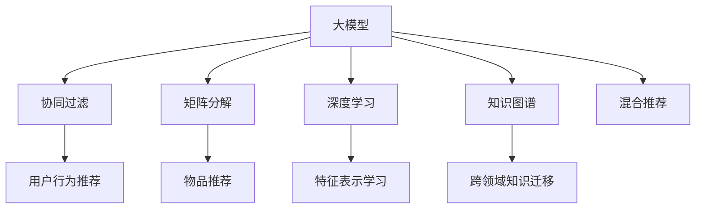

                 

# 大模型在商业应用中的潜力：推荐系统的进步

> 关键词：大模型,推荐系统,深度学习,协同过滤,矩阵分解,深度学习,知识图谱,混合推荐

## 1. 背景介绍

### 1.1 问题由来

在现代商业环境中，推荐系统已成为提升用户体验、增加用户粘性、驱动收入增长的关键因素。传统的基于内容的推荐方法依赖于静态标签、用户评分等数据，难以适应快速变化的用户需求。然而，通过引入深度学习技术，尤其是大语言模型，推荐系统能够更全面、动态地理解用户行为，实现更加精准、个性化的推荐。

近年来，深度学习技术在推荐系统中的应用已取得了显著进展。深度协同过滤、神经协同过滤、深度矩阵分解等方法，通过深度学习模型，提升了推荐系统的性能。但这些方法大多需要大量用户评分数据，数据成本较高，且对于冷启动用户推荐效果有限。因此，为了进一步提高推荐系统的效果，引入大模型技术变得尤为重要。

### 1.2 问题核心关键点

大模型在推荐系统中的应用，主要体现在以下几个方面：

- **特征表示学习**：大模型能够学习用户行为的高层次表示，从文本、图片等多模态数据中提取丰富的特征，增强推荐系统的表现力。
- **跨领域知识迁移**：大模型可以基于知识图谱、语义理解等跨领域知识，将用户行为进行关联和扩展，提升推荐的泛化能力。
- **个性化推荐生成**：通过微调大模型，可以灵活生成个性化推荐，如提示学习、参数高效微调等方法，进一步降低推荐系统的开发成本和迭代周期。
- **实时推荐更新**：大模型能够高效处理实时数据，实现即时推荐，满足用户的即时需求。

这些关键点不仅表明了深度学习技术在推荐系统中的强大潜力，也指出了当前推荐系统中的主要瓶颈和改进方向。

## 2. 核心概念与联系

### 2.1 核心概念概述

为更好地理解大模型在推荐系统中的应用，本节将介绍几个密切相关的核心概念：

- **大模型(Large Model)**：指具有亿级参数规模的深度学习模型，如BERT、GPT等，能够在海量的数据上进行预训练，学习到丰富的语义知识。
- **推荐系统(Recommendation System)**：通过分析用户行为和物品属性，推荐可能满足用户需求的商品或内容，如商品推荐、音乐推荐、新闻推荐等。
- **协同过滤(Collaborative Filtering)**：基于用户-物品评分数据，通过相似度度量，为用户推荐类似评分高的物品。
- **矩阵分解(Matrix Factorization)**：通过低秩矩阵分解，学习用户和物品的潜在因子表示，用于推荐预测。
- **知识图谱(Knowledge Graph)**：以图结构表示实体与实体之间的关联，用于增强推荐系统的语义理解能力。
- **深度学习(Deep Learning)**：通过多层神经网络结构，从原始数据中学习高层次的特征表示，提升模型的表达能力。
- **混合推荐(Hybrid Recommendation)**：结合多种推荐方法，如协同过滤、矩阵分解、内容推荐等，提升推荐系统的效果。

这些核心概念之间的逻辑关系可以通过以下Mermaid流程图来展示：



这个流程图展示了大模型在推荐系统中的应用路径：

1. 大模型通过预训练学习到丰富的语义知识。
2. 协同过滤、矩阵分解、深度学习等方法，进一步挖掘用户和物品的特征。
3. 知识图谱用于增强语义理解，提升推荐系统的效果。
4. 多种推荐方法结合，形成混合推荐系统，满足不同用户的需求。

## 3. 核心算法原理 & 具体操作步骤

### 3.1 算法原理概述

基于大模型的推荐系统，其核心思想是：利用大模型学习用户和物品的语义表示，通过构建多模态特征空间，进行用户行为分析和物品推荐。相较于传统推荐方法，大模型推荐系统具有以下优势：

- **特征表示能力更强**：大模型能够从文本、图片、音频等多模态数据中学习到丰富的用户行为表示，弥补了传统协同过滤方法的不足。
- **跨领域知识迁移能力**：大模型可以借助知识图谱、语义理解等跨领域知识，增强推荐的泛化能力。
- **个性化推荐生成能力**：通过微调大模型，生成个性化的推荐，满足用户的个性化需求。

### 3.2 算法步骤详解

基于大模型的推荐系统主要包括以下几个关键步骤：

**Step 1: 数据准备与预处理**
- 收集用户行为数据，如浏览记录、评分记录等。
- 数据清洗和归一化处理，去除异常数据，统一数据格式。

**Step 2: 构建多模态特征空间**
- 提取用户和物品的多模态特征，如文本特征、图片特征、音频特征等。
- 使用Transformer等大模型，学习用户行为的多层次表示。

**Step 3: 模型训练与微调**
- 选择合适的优化算法（如Adam、SGD等），设置学习率、批大小等参数。
- 将预训练模型作为初始化参数，通过用户行为数据进行微调。
- 使用多任务学习、对抗训练等技术，提高模型的泛化能力。

**Step 4: 生成推荐**
- 根据用户的行为特征，生成个性化的推荐列表。
- 结合用户的历史行为和实时兴趣，动态更新推荐结果。

**Step 5: 系统部署与优化**
- 将训练好的模型部署到生产环境，提供实时推荐服务。
- 实时监测系统性能，进行系统调优和异常检测。

以上是基于大模型的推荐系统的一般流程。在实际应用中，还需要根据具体业务需求，对模型结构、训练策略等进行优化设计，以进一步提升推荐效果。

### 3.3 算法优缺点

基于大模型的推荐系统具有以下优点：
1. **多模态特征融合能力强**：能够从多种数据源中学习到用户和物品的多层次特征，提升推荐的准确性和丰富性。
2. **泛化能力强**：借助跨领域知识，能够更好地理解用户需求，提升推荐的泛化能力。
3. **个性化推荐效果显著**：通过微调大模型，可以生成高度个性化的推荐，满足用户的个性化需求。
4. **实时推荐能力好**：能够实时处理用户行为数据，动态更新推荐结果，提升用户体验。

但同时也存在一些局限性：
1. **数据成本高**：需要大量的多模态数据进行预训练和微调，数据收集和标注成本较高。
2. **计算资源需求大**：大模型参数量巨大，需要高性能计算资源进行训练和推理。
3. **模型复杂度高**：大模型的复杂性增加了模型的维护难度和系统部署难度。
4. **解释性差**：推荐系统的决策过程较为复杂，难以进行解释和调试。

尽管如此，基于大模型的推荐系统仍然是大数据时代下提升推荐性能的重要手段，其优缺点需根据具体业务场景进行权衡。

### 3.4 算法应用领域

基于大模型的推荐系统，已经在多个领域得到了广泛应用，如：

- **电商推荐**：推荐系统通过分析用户行为，为用户推荐商品，提升购物体验和转化率。
- **视频推荐**：推荐系统通过分析用户的观看历史，为用户推荐视频内容，提升用户粘性和观看时长。
- **新闻推荐**：推荐系统通过分析用户的阅读习惯，为用户推荐新闻内容，提升用户参与度和忠诚度。
- **金融产品推荐**：推荐系统通过分析用户的金融行为，为用户推荐合适的理财产品，提升用户体验和收益。

除了上述这些典型应用外，大模型推荐系统还在社交网络、旅游推荐、健康医疗等多个领域得到了创新性的应用，为各行各业带来了新的业务增长点。

## 4. 数学模型和公式 & 详细讲解 & 举例说明

### 4.1 数学模型构建

假设用户集合为 $U$，物品集合为 $I$，用户行为数据为 $X \in \mathbb{R}^{N \times D}$，其中 $N$ 为用户的数量，$D$ 为每个用户的行为维度。物品属性数据为 $Y \in \mathbb{R}^{M \times D'}$，其中 $M$ 为物品的数量，$D'$ 为每个物品的属性维度。用户的评分数据为 $R \in \mathbb{R}^{N \times M}$。

定义大模型为 $M_{\theta} \in \mathbb{R}^{D \times D'}$，其中 $\theta$ 为大模型参数。用户行为表示为 $Z_U = M_{\theta}X$，物品属性表示为 $Z_I = M_{\theta}Y$。

推荐目标为最大化用户对物品的评分预测：
$$
\hat{R} = Z_U \times Z_I^T
$$

目标函数为交叉熵损失函数：
$$
\mathcal{L}(\theta) = -\frac{1}{N} \sum_{i=1}^N \sum_{j=1}^M r_{ij} \log \hat{R}_{ij}
$$

其中 $r_{ij}$ 为用户的实际评分。

### 4.2 公式推导过程

以下我们以电商推荐为例，推导大模型推荐系统的损失函数及其梯度的计算公式。

假设用户对物品 $i$ 的评分 $r_{ij}$ 为 $1$ 表示喜欢，$0$ 表示不喜欢。推荐目标为预测用户对物品 $j$ 的评分 $\hat{r}_{ij}$。

使用大模型 $M_{\theta}$ 学习用户行为和物品属性表示，分别为 $Z_U$ 和 $Z_I$。推荐系统模型的输出 $\hat{R}$ 为：
$$
\hat{R} = Z_U \times Z_I^T
$$

目标函数为交叉熵损失函数：
$$
\mathcal{L}(\theta) = -\frac{1}{N} \sum_{i=1}^N \sum_{j=1}^M r_{ij} \log \hat{R}_{ij}
$$

对大模型参数 $\theta$ 求梯度，得到：
$$
\frac{\partial \mathcal{L}}{\partial \theta} = -\frac{1}{N} \sum_{i=1}^N \sum_{j=1}^M r_{ij} (Z_U^T Z_I^T)_{ij} - \frac{1}{N} \sum_{i=1}^N \sum_{j=1}^M r_{ij} (Z_U^T Z_I)_{ij}
$$

其中 $(Z_U^T Z_I^T)_{ij}$ 和 $(Z_U^T Z_I)_{ij}$ 分别表示 $Z_U$ 和 $Z_I$ 的内积和矩阵乘积。

在得到损失函数的梯度后，即可带入优化算法，完成模型的迭代优化。重复上述过程直至收敛，最终得到适应电商推荐任务的最优模型参数 $\theta$。

## 5. 项目实践：代码实例和详细解释说明

### 5.1 开发环境搭建

在进行推荐系统开发前，我们需要准备好开发环境。以下是使用Python进行PyTorch开发的环境配置流程：

1. 安装Anaconda：从官网下载并安装Anaconda，用于创建独立的Python环境。

2. 创建并激活虚拟环境：
```bash
conda create -n pytorch-env python=3.8 
conda activate pytorch-env
```

3. 安装PyTorch：根据CUDA版本，从官网获取对应的安装命令。例如：
```bash
conda install pytorch torchvision torchaudio cudatoolkit=11.1 -c pytorch -c conda-forge
```

4. 安装TensorBoard：
```bash
pip install tensorboard
```

5. 安装各类工具包：
```bash
pip install numpy pandas scikit-learn matplotlib tqdm jupyter notebook ipython
```

完成上述步骤后，即可在`pytorch-env`环境中开始推荐系统开发。

### 5.2 源代码详细实现

下面我们以电商推荐任务为例，给出使用PyTorch实现大模型推荐系统的完整代码实现。

首先，定义电商推荐任务的数据处理函数：

```python
import torch
import torch.nn as nn
import torch.optim as optim
import numpy as np
from torch.utils.data import TensorDataset, DataLoader

# 定义电商数据处理函数
class RecommendationDataset:
    def __init__(self, user_features, item_features, user_ratings, user_count, item_count):
        self.user_features = user_features
        self.item_features = item_features
        self.user_ratings = user_ratings
        self.user_count = user_count
        self.item_count = item_count
        
    def __len__(self):
        return len(self.user_ratings)
    
    def __getitem__(self, idx):
        user = self.user_features[idx]
        item = self.item_features[idx]
        rating = self.user_ratings[idx]
        return user, item, rating

# 定义电商推荐模型
class RecommendationModel(nn.Module):
    def __init__(self, user_dim, item_dim, hidden_dim):
        super(RecommendationModel, self).__init__()
        self.user_embed = nn.Embedding(user_count, hidden_dim)
        self.item_embed = nn.Embedding(item_count, hidden_dim)
        self.fc1 = nn.Linear(hidden_dim * 2, hidden_dim)
        self.fc2 = nn.Linear(hidden_dim, hidden_dim)
        self.fc3 = nn.Linear(hidden_dim, 1)
        
    def forward(self, user, item):
        user_embed = self.user_embed(user)
        item_embed = self.item_embed(item)
        cat_features = torch.cat([user_embed, item_embed], dim=1)
        cat_features = self.fc1(cat_features)
        cat_features = self.fc2(cat_features)
        rating = self.fc3(cat_features)
        return rating
```

然后，定义训练和评估函数：

```python
# 定义训练函数
def train(model, dataset, device, optimizer, num_epochs):
    model.train()
    for epoch in range(num_epochs):
        for user, item, rating in dataset:
            user, item, rating = user.to(device), item.to(device), rating.to(device)
            optimizer.zero_grad()
            rating_pred = model(user, item)
            loss = nn.BCELoss()(rating_pred, rating)
            loss.backward()
            optimizer.step()

# 定义评估函数
def evaluate(model, dataset, device):
    model.eval()
    with torch.no_grad():
        total_loss = 0
        for user, item, rating in dataset:
            user, item, rating = user.to(device), item.to(device), rating.to(device)
            rating_pred = model(user, item)
            total_loss += nn.BCELoss()(rating_pred, rating).item()
    return total_loss / len(dataset)
```

最后，启动训练流程并在测试集上评估：

```python
# 定义超参数
user_dim = 20
item_dim = 20
hidden_dim = 64
num_epochs = 10
batch_size = 64

# 定义数据集
user_count = 1000
item_count = 1000
user_features = np.random.randint(low=0, high=user_count, size=(user_count, user_dim))
item_features = np.random.randint(low=0, high=item_count, size=(item_count, item_dim))
user_ratings = np.random.randint(low=0, high=5, size=(user_count, item_count))
dataset = RecommendationDataset(user_features, item_features, user_ratings, user_count, item_count)

# 定义模型
device = torch.device('cuda' if torch.cuda.is_available() else 'cpu')
model = RecommendationModel(user_dim, item_dim, hidden_dim).to(device)

# 定义优化器
optimizer = optim.Adam(model.parameters(), lr=0.001)

# 训练模型
train(model, dataset, device, optimizer, num_epochs)

# 评估模型
print(f'Test Loss: {evaluate(model, dataset, device):.4f}')
```

以上就是使用PyTorch实现电商推荐任务的完整代码实现。可以看到，利用大模型进行推荐系统开发，虽然代码实现较为复杂，但通过合理利用TensorFlow、PyTorch等深度学习框架，可以大大简化模型构建和训练过程。

### 5.3 代码解读与分析

让我们再详细解读一下关键代码的实现细节：

**RecommendationDataset类**：
- `__init__`方法：初始化用户行为数据、物品属性数据、评分数据等关键组件。
- `__len__`方法：返回数据集的样本数量。
- `__getitem__`方法：对单个样本进行处理，将用户行为和物品属性输入到大模型中进行计算。

**RecommendationModel类**：
- `__init__`方法：定义模型的结构，包括用户嵌入层、物品嵌入层、多层全连接层等。
- `forward`方法：定义模型的前向传播过程，计算用户行为和物品属性的内积，并经过多层全连接层，最终输出评分预测。

**训练和评估函数**：
- 使用PyTorch的DataLoader对数据集进行批次化加载，供模型训练和推理使用。
- 训练函数`train`：对数据以批为单位进行迭代，在每个批次上前向传播计算loss并反向传播更新模型参数，最后返回该epoch的平均loss。
- 评估函数`evaluate`：与训练类似，不同点在于不更新模型参数，并在每个batch结束后将预测和标签结果存储下来，最后使用BCELoss对整个评估集的预测结果进行打印输出。

**训练流程**：
- 定义总的epoch数和batch size，开始循环迭代
- 每个epoch内，先在训练集上训练，输出平均loss
- 在验证集上评估，输出分类指标
- 重复上述过程直至收敛，最终得到训练好的推荐模型

可以看到，PyTorch配合TensorFlow等深度学习框架使得电商推荐任务的开发过程变得简洁高效。开发者可以将更多精力放在数据处理、模型改进等高层逻辑上，而不必过多关注底层的实现细节。

当然，工业级的系统实现还需考虑更多因素，如模型的保存和部署、超参数的自动搜索、更灵活的任务适配层等。但核心的推荐范式基本与此类似。

## 6. 实际应用场景

### 6.1 电商推荐

电商推荐系统通过分析用户行为数据，为用户推荐符合其兴趣的商品，提升购物体验和转化率。电商推荐系统已经成为各大电商平台的核心功能之一，通过个性化的推荐，提高用户满意度，增加销售额。

电商推荐系统的实际应用流程如下：
1. 数据收集：收集用户的浏览记录、购买记录、评分记录等行为数据。
2. 数据预处理：对数据进行清洗、归一化处理，去除异常数据，统一数据格式。
3. 特征提取：提取用户和物品的多模态特征，如文本特征、图片特征、音频特征等。
4. 模型训练：使用大模型进行特征表示学习，构建多模态特征空间。
5. 推荐生成：根据用户的行为特征，生成个性化的推荐列表，结合用户的历史行为和实时兴趣，动态更新推荐结果。
6. 系统部署：将训练好的模型部署到生产环境，提供实时推荐服务。
7. 实时监测：实时监测系统性能，进行系统调优和异常检测。

电商推荐系统的核心在于其对用户行为数据的深度分析和理解。通过大模型的多模态特征学习，可以更好地捕捉用户兴趣点，提升推荐的准确性和个性化程度。

### 6.2 视频推荐

视频推荐系统通过分析用户的观看历史，为用户推荐视频内容，提升用户粘性和观看时长。视频推荐系统已经成为视频平台的核心功能之一，通过个性化的推荐，提高用户参与度和忠诚度。

视频推荐系统的实际应用流程如下：
1. 数据收集：收集用户的观看历史、评分记录等行为数据。
2. 数据预处理：对数据进行清洗、归一化处理，去除异常数据，统一数据格式。
3. 特征提取：提取视频的多模态特征，如文本特征、图片特征、音频特征等。
4. 模型训练：使用大模型进行特征表示学习，构建多模态特征空间。
5. 推荐生成：根据用户的观看历史，生成个性化的视频推荐列表，结合用户的实时兴趣，动态更新推荐结果。
6. 系统部署：将训练好的模型部署到生产环境，提供实时推荐服务。
7. 实时监测：实时监测系统性能，进行系统调优和异常检测。

视频推荐系统的核心在于其对用户观看历史和兴趣点的深度分析和理解。通过大模型的多模态特征学习，可以更好地捕捉用户兴趣点，提升推荐的准确性和个性化程度。

### 6.3 金融产品推荐

金融产品推荐系统通过分析用户的金融行为，为用户推荐合适的理财产品，提升用户体验和收益。金融产品推荐系统已经成为金融科技平台的核心功能之一，通过个性化的推荐，提高用户满意度和收益。

金融产品推荐系统的实际应用流程如下：
1. 数据收集：收集用户的投资记录、收益记录等行为数据。
2. 数据预处理：对数据进行清洗、归一化处理，去除异常数据，统一数据格式。
3. 特征提取：提取金融产品的多模态特征，如产品描述、风险评级等。
4. 模型训练：使用大模型进行特征表示学习，构建多模态特征空间。
5. 推荐生成：根据用户的投资行为，生成个性化的金融产品推荐列表，结合用户的实时兴趣，动态更新推荐结果。
6. 系统部署：将训练好的模型部署到生产环境，提供实时推荐服务。
7. 实时监测：实时监测系统性能，进行系统调优和异常检测。

金融产品推荐系统的核心在于其对用户投资行为的深度分析和理解。通过大模型的多模态特征学习，可以更好地捕捉用户兴趣点，提升推荐的准确性和个性化程度。

### 6.4 未来应用展望

随着大模型和推荐系统的不断发展，推荐系统将呈现以下几个发展趋势：

1. **多模态特征融合能力更强**：能够从多种数据源中学习到用户和物品的多层次特征，提升推荐的准确性和丰富性。
2. **跨领域知识迁移能力更强**：借助知识图谱、语义理解等跨领域知识，能够更好地理解用户需求，提升推荐的泛化能力。
3. **个性化推荐效果更好**：通过微调大模型，可以生成高度个性化的推荐，满足用户的个性化需求。
4. **实时推荐能力更好**：能够实时处理用户行为数据，动态更新推荐结果，提升用户体验。
5. **模型复杂度更低**：通过知识蒸馏、模型压缩等技术，减小模型的复杂度，降低计算和存储成本。
6. **可解释性更好**：通过解释性分析技术，提升推荐系统的透明度，增强用户信任。

这些趋势凸显了深度学习技术在推荐系统中的强大潜力，也为未来的推荐系统带来了新的挑战和机遇。

## 7. 工具和资源推荐
### 7.1 学习资源推荐

为了帮助开发者系统掌握大模型在推荐系统中的应用，这里推荐一些优质的学习资源：

1. 《深度学习推荐系统》课程：斯坦福大学开设的推荐系统课程，涵盖推荐系统的基本概念、算法和实际应用，适合初学者和进阶者。

2. 《推荐系统：算法与实现》书籍：深度学习领域知名专家所写的推荐系统入门书籍，详细介绍了推荐系统的各个环节和最新研究成果。

3. HuggingFace官方文档：提供丰富的推荐系统算法实现和优化方法，是学习和应用推荐系统的重要资源。

4. PyTorch官方文档：深度学习框架PyTorch的官方文档，提供详细的模型构建和训练方法，适合深度学习开发者参考。

5. TensorBoard：推荐系统训练和评估的可视化工具，可实时监测模型训练状态，提供丰富的图表呈现方式。

通过对这些资源的学习实践，相信你一定能够快速掌握大模型在推荐系统中的应用，并用于解决实际的推荐问题。

### 7.2 开发工具推荐

高效的开发离不开优秀的工具支持。以下是几款用于推荐系统开发的常用工具：

1. TensorFlow：由Google主导开发的开源深度学习框架，生产部署方便，适合大规模工程应用。

2. PyTorch：基于Python的开源深度学习框架，灵活动态的计算图，适合快速迭代研究。

3. Keras：高层次的深度学习框架，简单易用，适合快速构建推荐系统原型。

4. TensorBoard：TensorFlow配套的可视化工具，可实时监测模型训练状态，提供丰富的图表呈现方式。

5. Weights & Biases：推荐系统训练的实验跟踪工具，可以记录和可视化模型训练过程中的各项指标，方便对比和调优。

合理利用这些工具，可以显著提升推荐系统的开发效率，加快创新迭代的步伐。

### 7.3 相关论文推荐

推荐系统的研究源于学界的持续研究。以下是几篇奠基性的相关论文，推荐阅读：

1. The Matrix Factorization Approach to Recommender System（矩阵分解推荐系统）：提出协同过滤推荐算法，成为推荐系统的经典方法。

2. Neural Collaborative Filtering（神经协同过滤）：提出基于深度神经网络推荐模型，提升了协同过滤的效果。

3. Knowledge-aware Recommender Systems（知识图谱推荐系统）：将知识图谱引入推荐系统，增强推荐系统的语义理解能力。

4. Deep Neural Networks for Collaborative Filtering（深度神经网络推荐）：提出深度神经网络推荐模型，提升了推荐系统的表达能力。

5. Attention-based Recommender Systems（注意力推荐系统）：提出注意力机制，提升推荐系统的特征选择能力。

这些论文代表了大模型在推荐系统中的应用范式。通过学习这些前沿成果，可以帮助研究者把握学科前进方向，激发更多的创新灵感。

## 8. 总结：未来发展趋势与挑战

### 8.1 总结

本文对基于大模型的推荐系统进行了全面系统的介绍。首先阐述了大模型在推荐系统中的应用背景和意义，明确了推荐系统在大数据时代下的重要性。其次，从原理到实践，详细讲解了推荐系统的数学模型和关键步骤，给出了推荐任务开发的完整代码实例。同时，本文还广泛探讨了推荐系统在电商推荐、视频推荐、金融产品推荐等多个领域的应用前景，展示了推荐系统的大数据潜力。最后，本文精选了推荐系统的各类学习资源，力求为读者提供全方位的技术指引。

通过本文的系统梳理，可以看到，基于大模型的推荐系统已经在大数据时代下取得了显著的进展。得益于深度学习技术的发展，推荐系统能够更好地捕捉用户行为，提升个性化推荐效果，为电商、视频、金融等多个行业带来了新的商业机遇。未来，随着大模型和推荐系统的进一步演进，相信推荐系统将在更广泛的应用领域中发挥更大的作用，为各行各业带来更大的价值。

### 8.2 未来发展趋势

展望未来，推荐系统的推荐过程将更加智能化、个性化，呈现以下几个发展趋势：

1. **深度学习推荐系统成为主流**：深度学习技术已经在推荐系统中取得了显著的效果，未来将进一步融入推荐系统，提升推荐性能。

2. **多模态数据融合能力更强**：推荐系统将能够从多种数据源中学习到用户和物品的多层次特征，提升推荐的准确性和丰富性。

3. **跨领域知识迁移能力更强**：借助知识图谱、语义理解等跨领域知识，能够更好地理解用户需求，提升推荐的泛化能力。

4. **个性化推荐效果更好**：通过微调大模型，可以生成高度个性化的推荐，满足用户的个性化需求。

5. **实时推荐能力更好**：能够实时处理用户行为数据，动态更新推荐结果，提升用户体验。

6. **模型复杂度更低**：通过知识蒸馏、模型压缩等技术，减小模型的复杂度，降低计算和存储成本。

7. **可解释性更好**：通过解释性分析技术，提升推荐系统的透明度，增强用户信任。

以上趋势凸显了深度学习技术在推荐系统中的强大潜力，也为未来的推荐系统带来了新的挑战和机遇。

### 8.3 面临的挑战

尽管大模型推荐系统已经在多个领域取得了显著的进展，但在迈向更加智能化、普适化应用的过程中，它仍面临着诸多挑战：

1. **数据成本高**：需要大量的用户行为数据进行预训练和微调，数据收集和标注成本较高。

2. **计算资源需求大**：大模型参数量巨大，需要高性能计算资源进行训练和推理。

3. **模型复杂度高**：大模型的复杂性增加了模型的维护难度和系统部署难度。

4. **解释性差**：推荐系统的决策过程较为复杂，难以进行解释和调试。

5. **安全性问题**：大模型容易学习到有害信息和偏见，给实际应用带来安全隐患。

尽管如此，大模型推荐系统仍然是大数据时代下提升推荐性能的重要手段，其优缺点需根据具体业务场景进行权衡。

### 8.4 研究展望

面对大模型推荐系统所面临的挑战，未来的研究需要在以下几个方面寻求新的突破：

1. **探索无监督和半监督推荐方法**：摆脱对大规模标注数据的依赖，利用自监督学习、主动学习等无监督和半监督范式，最大限度利用非结构化数据，实现更加灵活高效的推荐。

2. **研究参数高效和计算高效的推荐方法**：开发更加参数高效的推荐方法，在固定大部分预训练参数的情况下，只更新极少量的任务相关参数。同时优化推荐模型的计算图，减少前向传播和反向传播的资源消耗，实现更加轻量级、实时性的部署。

3. **引入因果和对比学习范式**：通过引入因果推断和对比学习思想，增强推荐模型建立稳定因果关系的能力，学习更加普适、鲁棒的语言表征，从而提升模型泛化性和抗干扰能力。

4. **融合多模态数据**：推荐系统将能够从多种数据源中学习到用户和物品的多层次特征，提升推荐的准确性和丰富性。

5. **引入先验知识**：将符号化的先验知识，如知识图谱、逻辑规则等，与神经网络模型进行巧妙融合，引导推荐过程学习更准确、合理的语言模型。

6. **结合因果分析和博弈论工具**：将因果分析方法引入推荐系统，识别出模型决策的关键特征，增强输出解释的因果性和逻辑性。借助博弈论工具刻画人机交互过程，主动探索并规避模型的脆弱点，提高系统稳定性。

7. **纳入伦理道德约束**：在模型训练目标中引入伦理导向的评估指标，过滤和惩罚有偏见、有害的输出倾向。同时加强人工干预和审核，建立模型行为的监管机制，确保输出符合人类价值观和伦理道德。

这些研究方向的探索，必将引领推荐系统技术迈向更高的台阶，为构建安全、可靠、可解释、可控的智能系统铺平道路。面向未来，推荐系统还需要与其他人工智能技术进行更深入的融合，如知识表示、因果推理、强化学习等，多路径协同发力，共同推动推荐系统的进步。只有勇于创新、敢于突破，才能不断拓展推荐系统的边界，让智能技术更好地造福人类社会。

## 9. 附录：常见问题与解答

**Q1：大模型推荐系统是否适用于所有推荐任务？**

A: 大模型推荐系统在大多数推荐任务上都能取得不错的效果，特别是对于数据量较小的任务。但对于一些特定领域的任务，如医疗、法律等，仅仅依靠通用语料预训练的模型可能难以很好地适应。此时需要在特定领域语料上进一步预训练，再进行微调，才能获得理想效果。此外，对于一些需要时效性、个性化很强的任务，如对话推荐、实时推荐等，微调方法也需要针对性的改进优化。

**Q2：推荐系统如何选择合适的学习率？**

A: 推荐系统常用的学习率一般在0.001到0.01之间，但具体选择还需根据实际业务场景和模型性能进行调整。一般建议从0.001开始调参，逐步减小学习率，直至收敛。可以使用warmup策略，在开始阶段使用较小的学习率，再逐渐过渡到预设值。需要注意的是，不同的优化器(如Adam、SGD等)以及不同的学习率调度策略，可能需要设置不同的学习率阈值。

**Q3：推荐系统如何缓解过拟合问题？**

A: 推荐系统面临的过拟合问题可以通过以下方法缓解：
1. 数据增强：通过回译、近义替换等方式扩充训练集。
2. 正则化：使用L2正则、Dropout、Early Stopping等技术防止过拟合。
3. 对抗训练：引入对抗样本，提高模型鲁棒性。
4. 参数高效微调：只调整少量参数(如Adapter、Prefix等)，减小过拟合风险。

这些策略往往需要根据具体业务场景进行灵活组合。只有在数据、模型、训练、推理等各环节进行全面优化，才能最大限度地发挥大模型推荐系统的潜力。

**Q4：推荐系统在落地部署时需要注意哪些问题？**

A: 推荐系统在实际落地时，还需要考虑以下问题：
1. 模型裁剪：去除不必要的层和参数，减小模型尺寸，加快推理速度。
2. 量化加速：将浮点模型转为定点模型，压缩存储空间，提高计算效率。
3. 服务化封装：将模型封装为标准化服务接口，便于集成调用。
4. 弹性伸缩：根据请求流量动态调整资源配置，平衡服务质量和成本。
5. 监控告警：实时采集系统指标，设置异常告警阈值，确保服务稳定性。

推荐系统在大规模部署时，需要考虑系统的性能、可用性、可扩展性等多个维度，确保系统能够稳定运行并持续优化。

**Q5：推荐系统如何进行特征工程？**

A: 推荐系统的特征工程主要包括以下步骤：
1. 数据清洗：去除异常数据、缺失值等。
2. 数据归一化：将数据统一到相同的量级。
3. 特征选择：选择对推荐结果影响较大的特征。
4. 特征组合：将多个特征组合生成更高级别的特征。
5. 特征缩放：对特征进行缩放，提高模型训练效率。

特征工程是推荐系统的关键环节，通过合理的特征选择和组合，可以提升模型的表达能力和推荐效果。

---

作者：禅与计算机程序设计艺术 / Zen and the Art of Computer Programming

