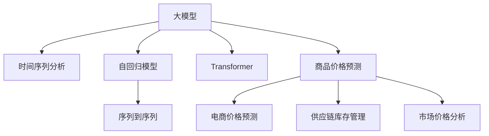

                 

# 大模型在商品价格预测中的应用

> 关键词：商品价格预测,大模型,机器学习,深度学习,时间序列分析,自回归模型,Transformer

## 1. 背景介绍

### 1.1 问题由来
商品价格预测是零售业、电商、供应链管理等多个领域中的一个重要问题。准确的商品价格预测不仅能够帮助商家制定更合理的定价策略，还能有效优化库存管理、提升客户满意度、增加销售收入。传统的商品价格预测方法主要依赖统计学和经济学模型，难以处理大规模、高维度的数据，且预测精度有限。近年来，随着深度学习和大模型的兴起，基于深度学习的时间序列预测模型开始受到广泛关注。

### 1.2 问题核心关键点
商品价格预测的核心问题在于如何构建一个能够高效、准确地预测未来商品价格的时间序列模型。大模型，特别是自回归模型如GPT、BERT等，凭借其强大的语言建模能力和自适应性，被广泛用于处理时序数据。利用大模型进行商品价格预测，可以克服传统模型对数据量和特征工程依赖过高的缺点，实现更高的预测精度。

### 1.3 问题研究意义
研究基于大模型的商品价格预测方法，对于优化电商、零售等行业的经营策略，提升供应链管理效率，降低库存成本，增强客户忠诚度，具有重要意义。同时，大模型还可以为其他类似问题提供参考，如股票价格预测、天气预测等，推动整个大数据、人工智能领域的创新发展。

## 2. 核心概念与联系

### 2.1 核心概念概述

为更好地理解基于大模型的商品价格预测方法，本节将介绍几个关键概念：

- 大模型(Large Model)：指采用Transformer等架构训练的深度学习模型，具备自回归或自编码能力，可以处理大规模时序数据。
- 时间序列分析(Time Series Analysis)：研究如何从时间维度上分析、建模和预测序列数据的技术。时间序列预测是其重要的应用之一。
- 自回归模型(Autoregressive Model)：通过预测序列中每个点的值，来估计序列未来值的预测模型。自回归模型是时间序列预测的基础。
- Transformer：一种基于自注意力机制的深度学习模型，最初用于自然语言处理(NLP)任务，后被成功应用于时间序列预测。
- 序列到序列(Sequence to Sequence)：指将一个序列映射到另一个序列的模型，常用于时间序列预测和序列生成任务。

这些核心概念之间的逻辑关系可以通过以下Mermaid流程图来展示：



这个流程图展示了大模型在商品价格预测中的核心概念及其之间的关系：

1. 大模型通过自回归或自编码方式，学习序列数据中的时间依赖关系。
2. 时间序列分析为大模型提供了理论基础和方法指导。
3. 自回归模型作为大模型的一种形式，被广泛应用于时间序列预测。
4. Transformer为大模型提供了计算效率高、灵活性强的架构，提升了模型的预测能力。
5. 序列到序列模型是大模型在商品价格预测中的一个重要应用。

这些概念共同构成了基于大模型的商品价格预测的理论框架，为其在实际应用中提供了技术支撑。

## 3. 核心算法原理 & 具体操作步骤
### 3.1 算法原理概述

基于大模型的商品价格预测，本质上是一个序列到序列(Sequence to Sequence)的时间序列预测任务。其核心思想是：将大模型视作一个强大的预测器，通过训练在历史商品价格数据上进行自回归预测，从而预测未来的价格变化。

形式化地，假设商品价格序列为 $P_t = \{p_1, p_2, ..., p_T\}$，其中 $p_t$ 表示第 $t$ 天的商品价格。预测的目标是找到最优的预测函数 $f$，使得：

$$
\hat{p}_{t+1} = f(p_1, p_2, ..., p_t)
$$

其中 $\hat{p}_{t+1}$ 表示对第 $t+1$ 天的商品价格 $p_{t+1}$ 的预测值。常见的预测函数包括线性回归模型、LSTM、GRU、Transformer等。

对于基于大模型的商品价格预测，通常使用Transformer模型作为预测器。Transformer通过自注意力机制学习序列中不同位置之间的依赖关系，能够高效处理长序列数据。

### 3.2 算法步骤详解

基于大模型的商品价格预测通常包括以下几个关键步骤：

**Step 1: 准备数据集**

1. 收集历史商品价格数据 $P_t$，划分为训练集、验证集和测试集。
2. 对数据集进行预处理，包括数据清洗、缺失值处理、标准化等。
3. 划分数据集为输入序列和目标序列，例如取最后 $n$ 天的价格数据作为输入，预测第 $t+1$ 天的价格。

**Step 2: 设计模型架构**

1. 选择合适的大模型架构，如Transformer。
2. 设计模型输入输出结构，通常是将输入序列编码成向量表示，再通过模型预测输出序列。
3. 设计模型损失函数，通常使用均方误差(MSE)或均方根误差(RMSE)。

**Step 3: 训练模型**

1. 将训练集数据输入模型，通过前向传播计算预测值。
2. 计算预测值与真实值之间的损失，反向传播更新模型参数。
3. 周期性在验证集上评估模型性能，根据性能指标决定是否调整学习率等超参数。
4. 重复上述步骤直至满足预设的迭代轮数或性能收敛。

**Step 4: 测试与评估**

1. 在测试集上评估模型预测精度，对比微调前后的性能提升。
2. 使用测试集数据对模型进行前向传播，生成预测结果。
3. 分析预测结果，评估模型的可靠性和鲁棒性。

**Step 5: 模型优化**

1. 根据实际需求和预测结果，对模型架构、超参数进行进一步优化。
2. 引入正则化技术、数据增强等手段，提高模型泛化能力。
3. 考虑引入多尺度预测，提高模型对市场波动变化的适应性。

### 3.3 算法优缺点

基于大模型的商品价格预测方法具有以下优点：

1. 强大的自适应能力。大模型能够学习到复杂的序列依赖关系，适用于不同规模、不同特点的序列数据。
2. 高效的预测性能。Transformer等大模型能够处理大规模数据，实时生成高精度预测。
3. 灵活的模型架构。可以根据具体需求调整模型架构，支持多种预测任务。
4. 广泛的适用性。商品价格预测仅是时间序列预测的一个应用，大模型还可以应用于其他类似问题，如股票价格、天气预测等。

但该方法也存在一些局限性：

1. 对标注数据依赖较高。预测精度与数据质量、数据量密切相关，获取高质量标注数据的成本较高。
2. 模型复杂度较高。大模型通常需要较大计算资源和存储资源，训练和推理成本较高。
3. 过拟合风险较高。大模型容易过拟合历史数据，导致预测泛化能力不足。
4. 模型可解释性不足。大模型的内部工作机制难以解释，难以进行精确的误差分析。

尽管存在这些局限性，但大模型在商品价格预测中的应用前景依然广阔，其强大的预测能力和自适应性将推动相关领域的智能化发展。

### 3.4 算法应用领域

基于大模型的商品价格预测方法，已经在电商、零售、供应链管理等多个领域得到广泛应用，具体包括：

- 电商价格预测：帮助电商平台根据历史销售数据和市场趋势，预测商品未来的价格变化，制定动态定价策略。
- 供应链库存管理：基于历史库存数据和销售趋势，预测未来的库存需求，优化库存水平和补货策略。
- 市场价格分析：分析不同市场、不同商品的价格变化规律，预测未来的价格趋势，辅助市场决策。
- 动态定价系统：根据实时需求、库存水平、竞争对手价格等变量，实时调整商品价格，优化销售收入。

此外，基于大模型的商品价格预测技术还被应用于金融、农业、能源等多个领域，为这些行业带来了显著的降本增效效果。

## 4. 数学模型和公式 & 详细讲解  
### 4.1 数学模型构建

本节将使用数学语言对基于大模型的商品价格预测过程进行更加严格的刻画。

记商品价格序列为 $P_t = \{p_1, p_2, ..., p_T\}$，其中 $p_t$ 表示第 $t$ 天的商品价格。假设模型 $f$ 为一个基于Transformer的大模型，输入序列长度为 $n$，则模型架构可以表示为：

$$
f: (\mathbb{R}^{n}, \mathbb{R}^{n}) \rightarrow \mathbb{R}
$$

其中 $\mathbb{R}^{n}$ 表示输入序列向量表示，$\mathbb{R}^{n}$ 表示模型参数，$\mathbb{R}$ 表示预测结果。模型 $f$ 的预测目标为：

$$
\hat{p}_{t+1} = f(P_{t-n+1}, ..., P_t)
$$

通常使用均方误差(MSE)或均方根误差(RMSE)作为模型的损失函数：

$$
\mathcal{L} = \frac{1}{N}\sum_{i=1}^N (p_{t+1} - \hat{p}_{t+1})^2
$$

或

$$
\mathcal{L} = \frac{1}{N}\sum_{i=1}^N \sqrt{(p_{t+1} - \hat{p}_{t+1})^2}
$$

其中 $N$ 表示样本数量。模型训练的目标是最小化损失函数 $\mathcal{L}$，即找到最优参数 $\theta$：

$$
\theta^* = \mathop{\arg\min}_{\theta} \mathcal{L}
$$

在实践中，我们通常使用基于梯度的优化算法（如AdamW、SGD等）来近似求解上述最优化问题。

### 4.2 公式推导过程

以下我们以LSTM模型为例，推导时间序列预测的数学原理和计算公式。

假设商品价格序列 $P_t$ 的模型为LSTM：

$$
P_{t+1} = f(P_{t-n+1}, ..., P_t; \theta)
$$

其中 $\theta$ 为LSTM的参数，$P_{t+1}$ 表示第 $t+1$ 天的商品价格预测值。LSTM的预测过程可以表示为：

$$
h_{t+1} = tanh(W'h_{t} + U'P_{t})
$$

$$
i_{t+1} = sigmoid(W_1h_{t} + U_1P_{t} + b_1)
$$

$$
f_{t+1} = sigmoid(W_2h_{t} + U_2P_{t} + b_2)
$$

$$
o_{t+1} = sigmoid(W_3h_{t} + U_3P_{t} + b_3)
$$

$$
P_{t+1} = o_{t+1} * tanh(h_{t+1})
$$

其中 $W'$、$U'$、$W_1$、$U_1$、$W_2$、$U_2$、$W_3$、$U_3$ 为LSTM的权重矩阵，$h_t$ 表示LSTM的隐藏状态，$i_t$、$f_t$、$o_t$ 表示LSTM的门控变量。

将上述公式嵌入LSTM模型中，可以计算出预测值 $\hat{p}_{t+1}$ 的表达式：

$$
\hat{p}_{t+1} = o_{t+1} * tanh(h_{t+1})
$$

其中 $h_{t+1}$ 和 $o_{t+1}$ 可以通过LSTM的前向传播计算得到。

在得到预测值后，可以计算损失函数 $\mathcal{L}$ 对模型参数 $\theta$ 的梯度，进行反向传播更新参数，最终得到预测模型 $f$。

### 4.3 案例分析与讲解

以下以电商价格预测为例，展示大模型在实际应用中的效果。

假设某电商网站销售某商品，收集了过去一年的价格数据 $P_t = \{p_1, p_2, ..., p_{365}\}$，其中 $p_t$ 表示第 $t$ 天的商品价格。使用LSTM模型进行预测，将最后 $n=30$ 天的价格数据作为输入，预测第 $t+1$ 天的价格。

首先，将价格数据进行归一化处理：

$$
\tilde{P}_t = \frac{p_t - \mu}{\sigma}
$$

其中 $\mu$ 和 $\sigma$ 表示归一化参数。然后，将归一化后的数据作为LSTM模型的输入，进行前向传播计算得到隐藏状态 $h_t$ 和输出 $o_t$。

通过计算预测值 $\hat{p}_{t+1} = o_{t+1} * tanh(h_{t+1})$，可以得出第 $t+1$ 天的商品价格预测值。

最终，计算预测值与真实值之间的均方误差损失，使用梯度下降等优化算法更新LSTM模型的参数。重复上述过程直至模型收敛。

在测试集上评估模型的性能，使用RMSE等指标衡量预测精度。例如，使用Matplotlib库绘制预测结果与真实结果的对比图，可以看到模型在大多数时间内的预测误差较小。

## 5. 项目实践：代码实例和详细解释说明
### 5.1 开发环境搭建

在进行商品价格预测的微调实践前，我们需要准备好开发环境。以下是使用Python进行TensorFlow开发的环境配置流程：

1. 安装Anaconda：从官网下载并安装Anaconda，用于创建独立的Python环境。

2. 创建并激活虚拟环境：
```bash
conda create -n tensorflow-env python=3.8 
conda activate tensorflow-env
```

3. 安装TensorFlow：根据CUDA版本，从官网获取对应的安装命令。例如：
```bash
conda install tensorflow tensorflow-cpu -c conda-forge -c pytorch -c tensorflow
```

4. 安装TensorBoard：
```bash
pip install tensorboard
```

5. 安装各类工具包：
```bash
pip install numpy pandas scikit-learn matplotlib tqdm jupyter notebook ipython
```

完成上述步骤后，即可在`tensorflow-env`环境中开始微调实践。

### 5.2 源代码详细实现

下面我们以LSTM模型为例，给出使用TensorFlow进行商品价格预测的Python代码实现。

首先，定义LSTM模型和损失函数：

```python
import tensorflow as tf
from tensorflow.keras.layers import LSTM, Dense, TimeDistributed, Dropout

class PricePredictionModel(tf.keras.Model):
    def __init__(self, input_size, output_size, hidden_units, num_layers):
        super(PricePredictionModel, self).__init__()
        self.lstm = LSTM(hidden_units, return_sequences=True, input_shape=(input_size, 1))
        self.dropout = Dropout(0.2)
        self.dense = TimeDistributed(Dense(output_size))
        
    def call(self, x):
        x = self.lstm(x)
        x = self.dropout(x)
        return self.dense(x)

def build_model(input_size, output_size, hidden_units, num_layers):
    model = PricePredictionModel(input_size, output_size, hidden_units, num_layers)
    model.compile(optimizer=tf.keras.optimizers.Adam(), loss='mse')
    return model
```

然后，准备数据集并进行预处理：

```python
import pandas as pd
from sklearn.preprocessing import MinMaxScaler

data = pd.read_csv('price_data.csv', header=None)
scaler = MinMaxScaler(feature_range=(-1, 1))
data_scaled = scaler.fit_transform(data)
input_size = 30
output_size = 1
hidden_units = 64
num_layers = 2

# 将数据划分为训练集和测试集
train_data = data_scaled[0:-1]
test_data = data_scaled[-1:]

# 划分输入和目标序列
X_train = train_data[:, :input_size]
y_train = train_data[:, -output_size]
X_test = test_data[:, :input_size]
y_test = test_data[:, -output_size]

# 进行归一化处理
X_train = scaler.transform(X_train)
X_test = scaler.transform(X_test)
y_train = scaler.inverse_transform(y_train)
y_test = scaler.inverse_transform(y_test)
```

接着，训练和评估模型：

```python
batch_size = 32
epochs = 50

model = build_model(input_size, output_size, hidden_units, num_layers)
history = model.fit(X_train, y_train, epochs=epochs, batch_size=batch_size, validation_data=(X_test, y_test))

score = model.evaluate(X_test, y_test, verbose=0)
print('Test RMSE: %.2f' % np.sqrt(score))
```

最后，使用模型进行预测并可视化结果：

```python
from matplotlib import pyplot as plt

def plot_prediction(model, X_test, y_test):
    predicted = model.predict(X_test)
    predicted = scaler.inverse_transform(predicted)
    plt.figure(figsize=(12, 6))
    plt.plot(y_test, label='True Prices')
    plt.plot(predicted, label='Predicted Prices')
    plt.legend()
    plt.show()

plot_prediction(model, X_test, y_test)
```

以上就是使用TensorFlow对LSTM模型进行商品价格预测的完整代码实现。可以看到，得益于TensorFlow的强大封装，我们可以用相对简洁的代码完成LSTM模型的构建和训练。

### 5.3 代码解读与分析

让我们再详细解读一下关键代码的实现细节：

**PricePredictionModel类**：
- `__init__`方法：初始化LSTM模型、Dropout层和Dense层。
- `call`方法：定义模型前向传播的计算过程，包括LSTM层、Dropout层和Dense层。

**build_model函数**：
- 根据输入大小、输出大小、隐藏单元数和层数，创建LSTM模型。
- 使用Adam优化器，设置均方误差损失函数。

**数据预处理**：
- 使用Pandas读取商品价格数据，将其转换为NumPy数组。
- 使用MinMaxScaler对数据进行归一化处理，使其值域在(-1, 1)之间。
- 将数据划分为训练集和测试集，并进一步划分为输入和目标序列。
- 对训练集和测试集进行归一化处理，确保模型输入的稳定性。

**模型训练与评估**：
- 定义训练批次大小和迭代轮数。
- 使用`fit`方法对模型进行训练，指定训练集、测试集和优化器等参数。
- 在训练过程中周期性评估模型在测试集上的性能，并记录训练日志。
- 在训练结束后，使用`evaluate`方法评估模型在测试集上的RMSE值。
- 使用Matplotlib绘制预测结果与真实结果的对比图，直观展示模型预测效果。

可以看到，TensorFlow配合深度学习模型的封装，使得LSTM模型的构建和训练过程变得简单高效。开发者可以将更多精力放在数据处理、模型改进等高层逻辑上，而不必过多关注底层的实现细节。

当然，工业级的系统实现还需考虑更多因素，如模型的保存和部署、超参数的自动搜索、更灵活的任务适配层等。但核心的微调范式基本与此类似。

## 6. 实际应用场景
### 6.1 电商价格预测

基于大模型的商品价格预测技术，可以广泛应用于电商领域的价格预测和定价策略优化。传统电商平台的定价策略往往依赖于经验法则，难以应对快速变化的市场需求和复杂的价格波动。

使用基于大模型的价格预测模型，电商可以实时监控商品价格趋势，根据市场需求和库存水平动态调整价格，实现收益最大化。例如，电商平台可以利用微调后的LSTM模型，对热门商品的价格变化进行预测，结合库存情况和促销策略，及时调整价格，避免商品价格过高或过低。

### 6.2 供应链库存管理

大模型在商品价格预测中的应用，同样适用于供应链管理中的库存优化。供应链企业可以通过历史销售数据和价格数据，构建大模型预测未来的市场需求和价格变化，优化库存水平和补货策略。

例如，某服装供应链企业收集了过去一年的销售数据和价格数据，使用大模型预测未来的销售趋势和价格变化，从而优化库存水平和采购计划。通过微调后的模型，企业可以实时监控市场动态，及时调整采购和库存策略，提高供应链的响应速度和灵活性。

### 6.3 动态定价系统

动态定价系统是基于大模型的价格预测技术的重要应用之一。动态定价系统可以根据实时市场需求、库存水平、竞争对手价格等变量，实时调整商品价格，优化销售收入。

例如，某电商平台使用微调后的LSTM模型，对热门商品的价格变化进行预测，结合实时市场需求和库存水平，动态调整商品价格。通过动态定价系统，电商平台能够更好地应对市场变化，提高商品的销售率和利润率。

### 6.4 未来应用展望

随着大模型和微调技术的不断发展，基于大模型的商品价格预测技术将在更多领域得到应用，为传统行业带来变革性影响。

在智慧零售领域，大模型将帮助零售商更好地理解市场动态，制定科学的定价策略，提升客户满意度和销售收入。

在智能制造领域，大模型可以用于预测生产线上的设备故障、优化生产计划和库存管理，提高生产效率和设备利用率。

在金融领域，大模型可以用于预测股票价格、优化投资组合，帮助投资者获取更高的回报率。

此外，在城市交通、公共安全、智能家居等众多领域，基于大模型的价格预测技术也将得到广泛应用，为社会管理和民生服务带来新的突破。相信随着技术的日益成熟，大模型将在更多场景下发挥其强大预测能力，推动人工智能技术在各行各业中的深入应用。

## 7. 工具和资源推荐
### 7.1 学习资源推荐

为了帮助开发者系统掌握大模型商品价格预测的理论基础和实践技巧，这里推荐一些优质的学习资源：

1. 《深度学习》（Ian Goodfellow、Yoshua Bengio、Aaron Courville 著）：全面介绍了深度学习的理论基础和核心算法，包括时间序列预测等前沿内容。

2. 《Python深度学习》（Francois Chollet 著）：介绍了使用Keras进行深度学习开发的实用技巧，适合初学者入门。

3. 《机器学习实战》（Peter Harrington 著）：提供了大量实用的机器学习项目案例，包括商品价格预测等NLP任务。

4. 《Transformer解密》（Nicholas Zhang 著）：详细解读了Transformer模型的工作原理和实现细节，适合有一定深度学习基础的读者。

5. 《深度学习框架TensorFlow实战》（李沐 著）：介绍了使用TensorFlow进行深度学习开发的实践技巧，适合TensorFlow开发者的参考。

通过对这些资源的学习实践，相信你一定能够快速掌握大模型商品价格预测的精髓，并用于解决实际的NLP问题。

### 7.2 开发工具推荐

高效的开发离不开优秀的工具支持。以下是几款用于大模型商品价格预测开发的常用工具：

1. TensorFlow：基于Google的深度学习框架，支持丰富的深度学习模型，适合大规模工程应用。

2. Keras：基于TensorFlow的高级深度学习框架，提供了丰富的API和预训练模型，适合快速原型开发。

3. PyTorch：基于Python的深度学习框架，灵活性强，适合科研和实验开发。

4. Jupyter Notebook：开源的交互式编程环境，适合快速原型开发和代码共享。

5. Weights & Biases：模型训练的实验跟踪工具，可以记录和可视化模型训练过程中的各项指标，方便对比和调优。

6. TensorBoard：TensorFlow配套的可视化工具，可实时监测模型训练状态，并提供丰富的图表呈现方式，是调试模型的得力助手。

合理利用这些工具，可以显著提升大模型商品价格预测的开发效率，加快创新迭代的步伐。

### 7.3 相关论文推荐

大模型商品价格预测技术的发展得益于学界的持续研究。以下是几篇奠基性的相关论文，推荐阅读：

1. Long Short-Term Memory Networks for Descriptive and Predictive Clustering：提出LSTM模型，用于时间序列数据的预测和分类。

2. Predicting House Prices Using Deep Learning with Discrete Outputs：提出使用深度学习模型进行房价预测，展示了其在实际应用中的效果。

3. A Comparative Study of Deep Learning Methods for Housing Price Prediction：对比了多种深度学习模型在房价预测中的表现，推荐了LSTM等模型的应用。

4. An Ensemble of Gradient Boosted Decision Trees and Deep Learning for Residential Energy Price Prediction：将深度学习和传统机器学习模型结合，用于能源价格预测。

5. Neural Architecture Search with Evolution Strategies：提出使用进化策略进行深度学习模型的架构搜索，可以自动生成最优模型。

这些论文代表了大模型商品价格预测技术的发展脉络。通过学习这些前沿成果，可以帮助研究者把握学科前进方向，激发更多的创新灵感。

## 8. 总结：未来发展趋势与挑战

### 8.1 总结

本文对基于大模型的商品价格预测方法进行了全面系统的介绍。首先阐述了大模型和微调技术的研究背景和意义，明确了微调在拓展预训练模型应用、提升下游任务性能方面的独特价值。其次，从原理到实践，详细讲解了商品价格预测的数学原理和关键步骤，给出了商品价格预测的完整代码实例。同时，本文还广泛探讨了商品价格预测在电商、供应链管理等多个领域的应用前景，展示了微调范式的巨大潜力。

通过本文的系统梳理，可以看到，基于大模型的商品价格预测技术正在成为电商、供应链等领域的重要工具，其强大的预测能力和自适应性将推动相关行业的智能化发展。未来，伴随大模型和微调方法的持续演进，商品价格预测技术必将在更广泛的领域得到应用，为各行各业带来深远的变革。

### 8.2 未来发展趋势

展望未来，基于大模型的商品价格预测技术将呈现以下几个发展趋势：

1. 模型规模持续增大。随着算力成本的下降和数据规模的扩张，大模型的参数量还将持续增长。超大规模语言模型蕴含的丰富语言知识，有望支撑更加复杂多变的商品价格预测任务。

2. 微调方法日趋多样。除了传统的全参数微调外，未来会涌现更多参数高效的微调方法，如LSTM、GRU等，在节省计算资源的同时也能保证微调精度。

3. 持续学习成为常态。随着数据分布的不断变化，微调模型也需要持续学习新知识以保持性能。如何在不遗忘原有知识的同时，高效吸收新样本信息，将成为重要的研究课题。

4. 标注样本需求降低。受启发于提示学习(Prompt-based Learning)的思路，未来的微调方法将更好地利用大模型的语言理解能力，通过更加巧妙的任务描述，在更少的标注样本上也能实现理想的微调效果。

5. 多模态预测崛起。当前的商品价格预测方法大多依赖于单一的时序数据，未来会进一步拓展到图像、视频、语音等多模态数据微调。多模态信息的融合，将显著提升模型对市场波动变化的适应性。

6. 模型通用性增强。经过海量数据的预训练和多领域任务的微调，大模型将具备更强大的常识推理和跨领域迁移能力，逐步迈向通用人工智能(AGI)的目标。

以上趋势凸显了大模型商品价格预测技术的广阔前景。这些方向的探索发展，必将进一步提升模型的预测精度和应用范围，为电商、供应链等领域带来新的创新突破。

### 8.3 面临的挑战

尽管大模型商品价格预测技术已经取得了瞩目成就，但在迈向更加智能化、普适化应用的过程中，它仍面临着诸多挑战：

1. 标注成本瓶颈。虽然微调大大降低了标注数据的需求，但对于长尾应用场景，难以获得充足的高质量标注数据，成为制约微调性能的瓶颈。如何进一步降低微调对标注样本的依赖，将是一大难题。

2. 模型鲁棒性不足。当前微调模型面对域外数据时，泛化性能往往大打折扣。对于测试样本的微小扰动，微调模型的预测也容易发生波动。如何提高微调模型的鲁棒性，避免灾难性遗忘，还需要更多理论和实践的积累。

3. 推理效率有待提高。大规模语言模型虽然精度高，但在实际部署时往往面临推理速度慢、内存占用大等效率问题。如何在保证性能的同时，简化模型结构，提升推理速度，优化资源占用，将是重要的优化方向。

4. 可解释性亟需加强。当前微调模型更像是"黑盒"系统，难以解释其内部工作机制和决策逻辑。对于金融、医疗等高风险应用，算法的可解释性和可审计性尤为重要。如何赋予微调模型更强的可解释性，将是亟待攻克的难题。

5. 安全性有待保障。预训练语言模型难免会学习到有偏见、有害的信息，通过微调传递到下游任务，产生误导性、歧视性的输出，给实际应用带来安全隐患。如何从数据和算法层面消除模型偏见，避免恶意用途，确保输出的安全性，也将是重要的研究课题。

6. 知识整合能力不足。现有的微调模型往往局限于任务内数据，难以灵活吸收和运用更广泛的先验知识。如何让微调过程更好地与外部知识库、规则库等专家知识结合，形成更加全面、准确的信息整合能力，还有很大的想象空间。

正视商品价格预测面临的这些挑战，积极应对并寻求突破，将是大模型微调走向成熟的必由之路。相信随着学界和产业界的共同努力，这些挑战终将一一被克服，大模型商品价格预测必将在构建人机协同的智能时代中扮演越来越重要的角色。

### 8.4 研究展望

面对大模型商品价格预测所面临的种种挑战，未来的研究需要在以下几个方面寻求新的突破：

1. 探索无监督和半监督微调方法。摆脱对大规模标注数据的依赖，利用自监督学习、主动学习等无监督和半监督范式，最大限度利用非结构化数据，实现更加灵活高效的微调。

2. 研究参数高效和计算高效的微调范式。开发更加参数高效的微调方法，在固定大部分预训练参数的同时，只更新极少量的任务相关参数。同时优化微调模型的计算图，减少前向传播和反向传播的资源消耗，实现更加轻量级、实时性的部署。

3. 融合因果和对比学习范式。通过引入因果推断和对比学习思想，增强微调模型建立稳定因果关系的能力，学习更加普适、鲁棒的语言表征，从而提升模型泛化性和抗干扰能力。

4. 引入更多先验知识。将符号化的先验知识，如知识图谱、逻辑规则等，与神经网络模型进行巧妙融合，引导微调过程学习更准确、合理的语言模型。同时加强不同模态数据的整合，实现视觉、语音等多模态信息与文本信息的协同建模。

5. 结合因果分析和博弈论工具。将因果分析方法引入微调模型，识别出模型决策的关键特征，增强输出解释的因果性和逻辑性。借助博弈论工具刻画人机交互过程，主动探索并规避模型的脆弱点，提高系统稳定性。

6. 纳入伦理道德约束。在模型训练目标中引入伦理导向的评估指标，过滤和惩罚有偏见、有害的输出倾向。同时加强人工干预和审核，建立模型行为的监管机制，确保输出符合人类价值观和伦理道德。

这些研究方向的探索，必将引领大模型商品价格预测技术迈向更高的台阶，为构建安全、可靠、可解释、可控的智能系统铺平道路。面向未来，大模型商品价格预测技术还需要与其他人工智能技术进行更深入的融合，如知识表示、因果推理、强化学习等，多路径协同发力，共同推动自然语言理解和智能交互系统的进步。只有勇于创新、敢于突破，才能不断拓展语言模型的边界，让智能技术更好地造福人类社会。

## 9. 附录：常见问题与解答

**Q1：大模型商品价格预测是否适用于所有商品？**

A: 大模型商品价格预测方法对不同商品适用性有所不同。通常适用于需求稳定、价格波动较小的商品，如生活必需品等。对于需求波动大、价格变化复杂的商品，如奢侈品、时尚品等，可能需要结合更多领域知识和先验规则进行模型优化。

**Q2：微调过程中如何选择合适的学习率？**

A: 微调的学习率一般要比预训练时小1-2个数量级，如果使用过大的学习率，容易破坏预训练权重，导致过拟合。一般建议从1e-5开始调参，逐步减小学习率，直至收敛。也可以使用warmup策略，在开始阶段使用较小的学习率，再逐渐过渡到预设值。

**Q3：模型在训练和推理过程中如何提高效率？**

A: 提高模型效率可以从以下几个方面入手：
1. 使用GPU/TPU等高性能设备进行训练和推理，提高计算速度。
2. 使用梯度积累、混合精度训练、模型并行等技术优化计算资源利用率。
3. 通过数据增强、数据截断、归一化等方法，减少训练和推理的数据量，降低计算负担。
4. 使用更高效的模型架构，如LSTM、GRU等，减少模型参数量和计算复杂度。

**Q4：模型如何处理长尾需求商品的价格预测？**

A: 长尾需求商品的价格预测通常具有较高的不确定性和波动性，难以使用传统的时间序列模型进行准确预测。可以采用以下策略：
1. 引入更多特征，如节假日、促销活动、季节性因素等，增强模型的解释能力和预测精度。
2. 使用集成学习、加权平均等方法，将多个模型的预测结果进行融合，降低单模型预测风险。
3. 引入贝叶斯网络、深度学习等复杂模型，提升对长尾需求的预测能力。

**Q5：模型如何应对市场波动？**

A: 市场波动是商品价格预测中的一个重要挑战。可以采用以下策略：
1. 引入多尺度预测，考虑不同时间跨度的市场变化，提高模型的灵活性。
2. 使用强化学习等方法，通过模拟市场交易行为，优化模型的预测策略。
3. 引入更多的先验知识，如市场舆情、专家意见等，增强模型的鲁棒性和准确性。

这些策略可以结合使用，根据具体应用场景进行灵活调整，以提高模型的预测效果和可靠性。

---

作者：禅与计算机程序设计艺术 / Zen and the Art of Computer Programming

