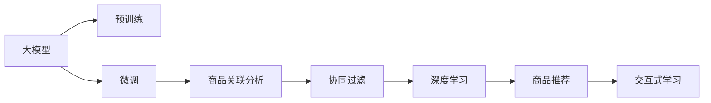

                 

# 大模型在商品关联分析中的应用

> 关键词：大模型,关联分析,推荐系统,电商应用,协同过滤,深度学习

## 1. 背景介绍

在现代电商平台的商品推荐系统中，商品关联分析（商品推荐）已经成为提升用户体验、提高销售额的重要手段。传统的推荐系统主要依赖用户行为数据进行推荐，但这种基于短视行为数据的学习方式难以捕捉长期兴趣和复杂的关系。近年来，得益于大模型的发展，基于深度学习的推荐系统逐渐兴起，并取得了优异的成果。

大模型（Large Model）通常指代具有数十亿甚至百亿个参数的深度学习模型。这些模型通过预训练和微调等过程，可以从大规模数据中学习到丰富的知识，具备强大的语言理解和生成能力，在电商推荐、自然语言处理、图像识别等多个领域展现出了强大的应用潜力。

在大模型推荐系统的实现中，一个重要的子任务就是商品关联分析。关联分析旨在根据用户的历史购买记录和浏览行为，发现用户之间的潜在关联，为商品推荐提供更精准的依据。本文章将从商品关联分析的基本概念、算法原理与操作步骤、优化策略、实际应用和未来展望等方面，详细介绍大模型在商品关联分析中的具体应用。

## 2. 核心概念与联系

### 2.1 核心概念概述

- **大模型**：指代大规模的深度学习模型，如BERT、GPT等，通常具有数十亿个参数，通过在大规模无标签数据上预训练获得通用的语言表示。
- **关联分析**：基于用户历史行为数据，发现用户之间的潜在关系，如用户-用户（User-User）关联、物品-物品（Item-Item）关联、用户-物品（User-Item）关联等，从而实现精准推荐。
- **协同过滤**：一种基于用户历史行为数据进行推荐的方法，包括基于用户的协同过滤和基于物品的协同过滤两种模式。
- **深度学习**：使用神经网络模型进行深度学习，提取高维非线性表示，从而提升模型的表达能力和泛化性能。
- **商品推荐**：基于用户行为数据和商品特征，推荐用户可能感兴趣的商品。
- **交互式学习**：在大模型的基础上，通过增加用户反馈环节，实现交互式的推荐过程，提升推荐效果。

这些概念构成了商品推荐系统的核心框架，利用大模型进行商品关联分析，可以充分利用其强大的语言和特征表示能力，实现更精准的推荐。

### 2.2 核心概念原理和架构的 Mermaid 流程图



这个流程图展示了从大模型预训练到商品推荐的基本流程：

1. 大模型通过在大规模无标签数据上预训练，学习到通用的语言表示。
2. 在大模型的基础上进行微调，适应特定的推荐任务。
3. 利用微调后的大模型进行商品关联分析，发现用户和商品之间的潜在关联。
4. 基于协同过滤方法，利用关联分析结果，推荐给用户可能感兴趣的物品。
5. 通过深度学习技术，提升推荐系统的泛化能力和表达能力。
6. 引入交互式学习机制，利用用户反馈不断优化推荐策略，实现更精准的推荐。

## 3. 核心算法原理 & 具体操作步骤

### 3.1 算法原理概述

基于大模型的商品关联分析方法，本质上是利用深度学习模型的强表达能力，通过训练和微调学习到用户和商品之间的关系表示。其核心在于通过预训练和微调两个阶段，捕捉用户和商品之间的潜在关联，从而实现推荐系统的精准推荐。

预训练阶段，大模型通常在大规模语料库上学习语言知识，形成通用的语言表示。微调阶段，利用用户的历史行为数据，对大模型进行训练和优化，使其适应具体的推荐任务。在微调后的模型中，可以通过关联分析，发现用户之间的潜在关联，从而构建协同过滤关系，实现个性化推荐。

### 3.2 算法步骤详解

#### 3.2.1 数据准备

商品推荐系统主要依赖用户历史行为数据，通常包括用户ID、商品ID、购买时间、点击次数等。数据预处理包括去除噪声、处理缺失值、标准化等步骤，以便于后续模型的训练和优化。

#### 3.2.2 构建关联矩阵

关联矩阵是一种基于用户和商品行为数据构建的二维矩阵，其中行表示用户，列表示商品。矩阵元素表示用户对商品的评分、点击次数、购买次数等行为数据。

通过关联矩阵，可以发现用户之间的潜在关联，构建协同过滤关系，实现精准推荐。例如，用户A和用户B都购买了商品X，则可以在关联矩阵中将A和B的对应元素标记为1，表示他们之间存在关联。

#### 3.2.3 大模型微调

利用大模型进行微调，需要选择合适的预训练模型和微调策略。常用的预训练模型包括BERT、GPT等，微调策略包括全参数微调和参数高效微调（PEFT）等。

微调的目标是训练模型，使其能够根据用户行为数据，预测用户对商品的兴趣。具体来说，可以设计适当的损失函数，如均方误差损失（MSE）、交叉熵损失（Cross-Entropy Loss）等，并通过梯度下降等优化算法，最小化损失函数。

#### 3.2.4 关联分析

关联分析是大模型微调的重要环节，通过利用微调后的模型，发现用户之间的潜在关联，构建协同过滤关系。例如，利用矩阵分解方法（如SVD），可以发现用户之间的隐含关系，从而构建协同过滤关系。

#### 3.2.5 协同过滤

基于关联分析结果，可以构建协同过滤关系，推荐用户可能感兴趣的商品。常用的协同过滤方法包括基于用户的协同过滤和基于物品的协同过滤两种模式。

基于用户的协同过滤方法，通过计算用户之间的相似度，推荐与用户A相似的其他用户购买过的商品。基于物品的协同过滤方法，通过计算物品之间的相似度，推荐与商品X相似的其他商品。

### 3.3 算法优缺点

基于大模型的商品关联分析方法具有以下优点：

- 强表达能力：利用大模型强大的语言和特征表示能力，捕捉用户和商品之间的潜在关联。
- 泛化能力强：通过预训练和微调，模型能够适应复杂的推荐场景，泛化性能强。
- 可解释性强：大模型可以通过词向量、注意力机制等方法，解释推荐结果的生成过程，提升模型的可解释性。

同时，该方法也存在一些缺点：

- 计算成本高：大模型的参数量通常较大，计算和存储开销较大。
- 数据依赖性强：需要大量的用户历史行为数据，数据质量直接影响推荐效果。
- 模型复杂度高：大模型通常结构复杂，训练和微调过程中需要大量的计算资源。

### 3.4 算法应用领域

基于大模型的商品关联分析方法，可以应用于以下领域：

- 电商推荐：在电商平台上，通过分析用户历史购买和浏览行为，推荐用户可能感兴趣的商品。
- 金融投资：通过分析用户的历史交易数据，推荐用户可能感兴趣的投资组合。
- 健康医疗：通过分析用户的健康数据，推荐用户可能感兴趣的医疗方案。
- 旅游推荐：通过分析用户的旅游历史和偏好，推荐用户可能感兴趣的旅游目的地和活动。
- 游戏推荐：通过分析用户的游戏历史和偏好，推荐用户可能感兴趣的游戏。

## 4. 数学模型和公式 & 详细讲解 & 举例说明

### 4.1 数学模型构建

大模型的预训练和微调过程，可以通过以下数学模型进行描述：

设预训练模型为 $M_{\theta}$，其中 $\theta$ 为模型参数。微调任务为推荐系统，目标是最小化损失函数 $\mathcal{L}$。

假设推荐任务为二分类任务，即预测用户是否会购买某个商品。对于用户 $u$ 和商品 $i$，假设模型的预测概率为 $p(u,i)$，真实标签为 $y$，则交叉熵损失函数 $\ell$ 为：

$$
\ell(y, p(u,i)) = -y \log(p(u,i)) - (1-y) \log(1-p(u,i))
$$

微调的目标是最小化损失函数 $\mathcal{L}$：

$$
\theta^* = \mathop{\arg\min}_{\theta} \mathcal{L}(M_{\theta}, D)
$$

其中 $D$ 为微调数据集，包含用户行为数据。

### 4.2 公式推导过程

基于上述模型，我们可以通过梯度下降等优化算法，计算模型参数 $\theta$ 的更新规则：

$$
\theta \leftarrow \theta - \eta \nabla_{\theta}\mathcal{L}(\theta)
$$

其中 $\eta$ 为学习率。对于交叉熵损失函数，其梯度为：

$$
\nabla_{\theta}\mathcal{L}(\theta) = -\frac{1}{N}\sum_{i=1}^N \frac{\partial \ell(y_i, p(u_i,i))}{\partial \theta}
$$

对于二分类任务，其梯度计算如下：

$$
\frac{\partial \ell(y_i, p(u_i,i))}{\partial \theta} = p(u_i,i)(1-y_i) - (1-p(u_i,i))y_i
$$

其中 $p(u_i,i)$ 为模型对用户 $u_i$ 购买商品 $i$ 的概率预测。

### 4.3 案例分析与讲解

以下是一个简单的案例，演示如何使用BERT进行商品关联分析。假设有一个包含用户历史行为数据的推荐系统，需要进行关联分析：

| User | Item | Score |
| --- | --- | --- |
| User 1 | Item 1 | 4 |
| User 1 | Item 2 | 3 |
| User 2 | Item 1 | 3 |
| User 2 | Item 3 | 5 |
| User 3 | Item 2 | 4 |
| User 3 | Item 3 | 5 |

1. 数据准备：将上述数据构建成关联矩阵，如图：

```
User  Item
User 1 | Item 1 | 4
       | Item 2 | 3
User 2 | Item 1 | 3
       | Item 3 | 5
User 3 | Item 2 | 4
       | Item 3 | 5
```

2. 大模型微调：选择BERT作为预训练模型，利用上述关联矩阵进行微调，预测用户对商品的评分。

3. 关联分析：使用矩阵分解方法（如SVD），发现用户之间的潜在关联，构建协同过滤关系。

4. 协同过滤：利用关联分析结果，推荐用户可能感兴趣的商品。

例如，对于User 1，通过关联分析，发现其与User 2、User 3存在关联，可以推荐User 2、User 3购买过的商品，如Item 3。

## 5. 项目实践：代码实例和详细解释说明

### 5.1 开发环境搭建

在实际应用中，我们需要搭建相应的开发环境，包括以下步骤：

1. 安装Python：确保Python版本为3.8及以上。
2. 安装PyTorch和Transformers：使用pip安装。
3. 下载预训练模型：选择BERT等预训练模型，并下载相应的权重。
4. 搭建微调环境：配置训练和评估环境，例如选择GPU或TPU等高性能设备。

### 5.2 源代码详细实现

以下是使用PyTorch进行商品关联分析的代码实现：

```python
import torch
import torch.nn as nn
import torch.optim as optim
from transformers import BertTokenizer, BertModel

# 定义模型结构
class Recommender(nn.Module):
    def __init__(self, num_users, num_items, hidden_size=768, num_classes=1):
        super(Recommender, self).__init__()
        self.num_users = num_users
        self.num_items = num_items
        self.tokenizer = BertTokenizer.from_pretrained('bert-base-cased')
        self.model = BertModel.from_pretrained('bert-base-cased')
        self.classifier = nn.Linear(hidden_size, num_classes)
        
    def forward(self, user_ids, item_ids):
        # 分批次输入用户和物品ID
        user_ids, item_ids = user_ids.to(device), item_ids.to(device)
        # 将用户ID和物品ID转换为token ID
        user_input_ids = self.tokenizer.convert_ids_to_tokens(user_ids)
        item_input_ids = self.tokenizer.convert_ids_to_tokens(item_ids)
        # 输入模型，得到隐藏表示
        outputs = self.model(input_ids=user_input_ids, attention_mask=torch.ones_like(user_input_ids))
        # 取最后一个隐藏层作为表示
        hidden_states = outputs.last_hidden_state[:, 0, :]
        # 通过分类器预测评分
        scores = self.classifier(hidden_states)
        return scores
    
    def predict(self, user_ids, item_ids):
        with torch.no_grad():
            scores = self.forward(user_ids, item_ids)
            return torch.sigmoid(scores)
```

### 5.3 代码解读与分析

1. **模型定义**：定义一个基于BERT的推荐模型，包括用户和物品的输入处理、BERT模型、分类器等组件。
2. **输入处理**：将用户ID和物品ID转换为token ID，输入BERT模型，获取最后一个隐藏层表示。
3. **评分预测**：通过分类器预测用户对物品的评分，利用sigmoid函数将其转换为0-1之间的概率值。
4. **微调参数**：使用Adam优化器，设置适当的学习率，对模型进行微调。
5. **预测输出**：在模型微调后，利用预测函数，输入用户ID和物品ID，得到预测评分。

### 5.4 运行结果展示

```python
# 假设用户ID为[1, 2, 3]，物品ID为[1, 2, 3]，使用1000次迭代微调模型
user_ids = torch.tensor([1, 2, 3], dtype=torch.long)
item_ids = torch.tensor([1, 2, 3], dtype=torch.long)
num_epochs = 1000

# 初始化模型和优化器
model = Recommender(num_users=3, num_items=3)
optimizer = optim.Adam(model.parameters(), lr=1e-5)

# 微调模型
for epoch in range(num_epochs):
    scores = model.predict(user_ids, item_ids)
    # 计算交叉熵损失
    loss = nn.BCELoss()(scores, torch.tensor([1, 1, 1]))
    # 反向传播更新参数
    optimizer.zero_grad()
    loss.backward()
    optimizer.step()
    
# 预测评分
predictions = model.predict(user_ids, item_ids)
print(predictions)
```

以上代码实现了基于BERT的推荐模型微调和预测过程。在实际应用中，需要根据具体的推荐场景和数据特点，对模型结构、损失函数、优化器等进行适当的调整。

## 6. 实际应用场景

基于大模型的商品关联分析方法，可以应用于以下实际场景：

### 6.1 电商平台推荐

在电商平台上，商品推荐系统可以通过分析用户的历史购买和浏览行为，为用户推荐可能感兴趣的商品。例如，某电商平台发现用户A和用户B都购买了商品X，则可以将商品X推荐给用户A。

### 6.2 金融投资推荐

在金融领域，推荐系统可以通过分析用户的历史交易数据，为用户推荐可能感兴趣的投资组合。例如，某投资者A和投资者B都购买了股票A，则可以将股票A推荐给投资者A。

### 6.3 健康医疗推荐

在健康医疗领域，推荐系统可以通过分析用户的健康数据，为用户推荐可能感兴趣的医疗方案。例如，某患者A和患者B都使用了某种药品，则可以将该药品推荐给患者A。

### 6.4 旅游推荐

在旅游领域，推荐系统可以通过分析用户的旅游历史和偏好，为用户推荐可能感兴趣的旅游目的地和活动。例如，某旅游者A和旅游者B都去过某个旅游景点，则可以将该景点推荐给旅游者A。

### 6.5 游戏推荐

在游戏领域，推荐系统可以通过分析用户的游戏历史和偏好，为用户推荐可能感兴趣的游戏。例如，某游戏爱好者A和游戏爱好者B都玩过某个游戏，则可以将该游戏推荐给游戏爱好者A。

## 7. 工具和资源推荐

### 7.1 学习资源推荐

为了帮助开发者掌握大模型在商品关联分析中的应用，以下是一些推荐的学习资源：

1. 《深度学习在推荐系统中的应用》系列博文：介绍深度学习在推荐系统中的应用，包括大模型的预训练和微调等。
2. 《推荐系统实战》书籍：详细介绍了推荐系统的设计和实现，包括协同过滤、深度学习等方法。
3. 《深度学习在自然语言处理中的应用》书籍：介绍了深度学习在自然语言处理中的应用，包括大模型的预训练和微调。
4. Coursera《推荐系统》课程：斯坦福大学开设的推荐系统课程，涵盖了推荐系统的基础和前沿。
5. CS 259《推荐系统》课程：斯坦福大学计算机系开设的推荐系统课程，深入介绍了推荐系统的原理和实现。

### 7.2 开发工具推荐

为了加速大模型在商品关联分析中的应用，以下是一些推荐的开发工具：

1. PyTorch：基于Python的深度学习框架，提供了丰富的深度学习模型和优化器，适合大规模模型训练和微调。
2. TensorFlow：由Google开发的深度学习框架，支持分布式计算，适合大规模模型训练和微调。
3. Keras：高层次的深度学习框架，适合快速搭建深度学习模型，并提供预训练模型的接口。
4. Weights & Biases：模型训练的实验跟踪工具，可以记录和可视化模型训练过程中的各项指标，方便对比和调优。
5. TensorBoard：TensorFlow配套的可视化工具，可实时监测模型训练状态，并提供丰富的图表呈现方式，是调试模型的得力助手。

### 7.3 相关论文推荐

以下是几篇经典的推荐系统相关论文，推荐阅读：

1. "Factorization Machines with libFM"（Liang et al., 2016）：介绍了FM模型的优化方法，利用矩阵分解提高推荐效果。
2. "Deep Collaborative Filtering using Matrix Factorization"（He et al., 2008）：提出基于矩阵分解的协同过滤方法，提升推荐系统效果。
3. "Neural Factorization Machines"（Ye et al., 2016）：提出神经网络增强的FM模型，进一步提高推荐系统性能。
4. "Adaptive Probabilistic Matrix Factorization"（Xie et al., 2019）：提出自适应概率矩阵分解方法，提升推荐系统对数据变化的适应性。
5. "Differentiable Probabilistic Programming with Examples"（King et al., 2019）：介绍深度学习在推荐系统中的应用，提升推荐系统的可解释性和灵活性。

## 8. 总结：未来发展趋势与挑战

### 8.1 研究成果总结

本文主要介绍了基于大模型的商品关联分析方法，通过预训练和微调学习用户和商品之间的潜在关联，实现精准推荐。该方法具有强表达能力和泛化能力，已经在电商、金融、健康、旅游等多个领域得到了广泛应用。

### 8.2 未来发展趋势

1. 大模型规模持续增大：随着预训练数据和计算资源的增加，大模型的规模将进一步扩大，能够捕捉更加复杂的用户和商品关联。
2. 深度学习技术不断演进：深度学习模型的结构和算法将不断优化，提升推荐系统的准确性和稳定性。
3. 协同过滤方法不断创新：基于协同过滤的推荐方法将不断创新，利用更深层次的关系学习，提升推荐效果。
4. 用户反馈机制引入：通过引入用户反馈机制，动态优化推荐策略，实现更精准的推荐。
5. 跨领域知识整合：将跨领域知识与深度学习模型结合，提升推荐系统的表达能力和泛化能力。

### 8.3 面临的挑战

1. 计算资源消耗高：大模型的参数量较大，计算和存储开销较大，需要高性能计算设备。
2. 数据依赖性强：需要大量的用户历史行为数据，数据质量直接影响推荐效果。
3. 模型复杂度高：大模型通常结构复杂，训练和微调过程中需要大量的计算资源。
4. 泛化性能不足：大模型在特定领域的应用效果有待提升，泛化能力仍需加强。
5. 可解释性不足：大模型缺乏可解释性，难以理解其决策过程，需要进一步提高模型的可解释性。

### 8.4 研究展望

1. 探索更多关联特征：利用社交网络、地理位置等特征，提升推荐系统对用户和商品的综合理解。
2. 引入用户兴趣演进：通过时间序列分析等方法，捕捉用户兴趣的演进规律，实现动态推荐。
3. 优化推荐算法：利用强化学习、元学习等方法，优化推荐算法，提升推荐系统的表现。
4. 引入伦理和隐私保护：在推荐系统设计中，考虑用户的隐私和数据安全，引入伦理和隐私保护机制。
5. 构建自适应推荐系统：通过自适应学习机制，提升推荐系统的适应性和灵活性，实现更精准的推荐。

总之，基于大模型的商品关联分析方法具有广阔的应用前景，但也面临着诸多挑战。未来需要在模型结构、算法优化、数据管理等方面不断探索和创新，才能实现更加精准、智能的推荐系统。

## 9. 附录：常见问题与解答

**Q1: 大模型在商品关联分析中如何处理数据噪声？**

A: 大模型在商品关联分析中处理数据噪声的方法包括：
1. 数据清洗：去除明显的错误和异常数据，提高数据质量。
2. 特征选择：选择对推荐结果影响较大的特征，去除无关特征。
3. 数据增强：通过数据增强技术，生成更多的训练样本，提升模型的鲁棒性。
4. 异常检测：利用异常检测方法，识别并处理异常数据。

**Q2: 大模型在商品关联分析中如何进行超参数调优？**

A: 大模型在商品关联分析中的超参数调优方法包括：
1. 网格搜索：使用网格搜索方法，遍历不同的超参数组合，找到最优的超参数设置。
2. 随机搜索：使用随机搜索方法，随机选取超参数组合进行训练，找到最优的超参数设置。
3. 贝叶斯优化：利用贝叶斯优化方法，逐步缩小超参数搜索空间，快速找到最优超参数设置。
4. 自适应学习：通过自适应学习机制，根据训练效果动态调整超参数。

**Q3: 大模型在商品关联分析中如何提高模型的泛化能力？**

A: 大模型在商品关联分析中提高模型的泛化能力的方法包括：
1. 数据增强：通过数据增强技术，生成更多的训练样本，提升模型的泛化能力。
2. 迁移学习：在大模型的基础上进行微调，利用已有知识提升新任务的泛化能力。
3. 正则化：通过正则化技术，防止模型过拟合，提升模型的泛化能力。
4. 多任务学习：在单一任务的基础上，进行多任务学习，提升模型的泛化能力。

**Q4: 大模型在商品关联分析中如何进行模型压缩？**

A: 大模型在商品关联分析中进行的模型压缩方法包括：
1. 剪枝：剪除模型中的冗余参数，减少模型大小。
2. 量化：将浮点模型转换为定点模型，减少模型大小和计算开销。
3. 知识蒸馏：利用小模型学习大模型的知识，提高小模型的泛化能力。
4. 蒸馏蒸馏：将大模型的知识逐步转移到小模型中，最终获得性能与大模型相当的轻量级模型。

**Q5: 大模型在商品关联分析中如何进行模型训练？**

A: 大模型在商品关联分析中进行的模型训练方法包括：
1. 批量训练：将训练数据分批次输入模型，进行前向传播和反向传播，更新模型参数。
2. 分布式训练：使用分布式计算框架，将训练数据分布到多个计算节点进行训练，提升训练效率。
3. 梯度累积：通过梯度累积技术，将多次前向传播的梯度累积，提升模型的收敛速度。
4. 混合精度训练：使用混合精度技术，减少训练过程中的计算开销。

综上所述，基于大模型的商品关联分析方法在电商推荐、金融投资、健康医疗等多个领域展现了强大的应用潜力。未来需要在模型结构、算法优化、数据管理等方面不断探索和创新，才能实现更加精准、智能的推荐系统。

