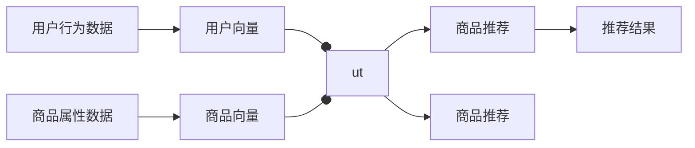

                 

# 大模型在商品推荐可解释性中的注意力可视化应用

> 关键词：大模型, 商品推荐, 可解释性, 注意力机制, 可视化, 推荐系统, 解释推理

## 1. 背景介绍

在现代推荐系统中，利用深度学习模型（如神经网络、深度神经网络）进行商品推荐已成为主流。特别是基于大模型的推荐系统，由于其卓越的性能和广泛的知识面，能够从多方面捕捉用户行为，提供更加精准的商品推荐。然而，由于深度学习模型的黑箱性质，推荐系统的可解释性问题一直难以解决。近年来，随着模型解释技术的发展，人们开始关注大模型在商品推荐领域的应用，并探索如何通过模型解释技术，提升推荐系统的透明度和可信度。

在本文中，我们将聚焦于大模型在商品推荐中的注意力可视化应用。通过注意力机制和注意力可视化技术，将大模型的推理过程进行可视化展示，使我们能够更好地理解模型的内部机制，提升推荐的可解释性和用户信任度。

## 2. 核心概念与联系

### 2.1 核心概念概述

在推荐系统中，大模型常用于捕捉用户的隐式偏好和历史行为，从而预测用户可能感兴趣的商品。推荐系统主要分为基于协同过滤的推荐和基于内容的推荐。协同过滤推荐系统利用用户间的相似性进行推荐，如用户画像、商品评分等，而内容推荐则主要基于商品属性和用户行为特征，如标签、评论、评分等。

大模型的输入通常包括用户历史行为和商品属性信息，模型的输出为商品推荐列表。推荐系统中的大模型可以是预训练语言模型，如BERT、GPT等，也可以是一类自编码模型，如DNN、CNN等。大模型在商品推荐中的应用，主要是通过嵌入层将用户行为和商品属性映射为高维向量，然后使用全连接层或其他形式的神经网络结构进行推理。

### 2.2 核心概念联系

大模型在推荐系统中的应用，可以通过以下流程图展示其工作原理：



其中：
- A表示用户行为数据，如浏览记录、评分等。
- B表示用户向量，是通过嵌入层将用户行为数据映射为高维向量。
- C表示商品属性数据，如商品类别、描述、标签等。
- D表示商品向量，是通过嵌入层将商品属性数据映射为高维向量。
- E表示模型推理结果，通常为商品的相关度评分。
- F表示模型推理结果，通常为商品的相关度评分。
- G表示推荐结果，即模型根据相关度评分排序后选取的商品列表。

大模型通过以上流程对用户和商品进行编码和推理，得出推荐结果。然而，由于大模型的复杂性，用户和商品之间的交互过程难以直接观察，推荐结果的解释性也成为一大挑战。

## 3. 核心算法原理 & 具体操作步骤
### 3.1 算法原理概述

大模型在推荐系统中的应用，主要是通过注意力机制(A Attention)来捕捉用户和商品之间的交互关系。注意力机制是一种特殊形式的神经网络，其能够动态地决定每个输入元素的权重，从而突出重要部分，忽略不重要部分。在商品推荐中，注意力机制可以表示为：

$$
\text{Attention}(Q, K, V) = \text{Softmax}(QK^T)V
$$

其中，$Q$表示用户向量，$K$表示商品向量，$V$表示商品特征向量，$\text{Softmax}(\cdot)$为softmax函数。注意力机制的输出为商品的相关度权重向量，即每个商品的权重。

推荐系统的目标是通过优化模型参数，使得每个商品的相关度权重向量与推荐结果之间的差异最小化。具体的优化目标可以通过以下损失函数表示：

$$
\text{Loss} = \frac{1}{N}\sum_{i=1}^{N} \|R_i - \sum_{j=1}^{M} \text{Attention}(Q_i, K_j, V_j)\|_2^2
$$

其中，$R_i$表示第$i$个用户的真实推荐结果，$M$表示商品总数，$N$表示用户总数。

通过优化上述损失函数，大模型可以学习到每个用户和每个商品之间的相关度权重向量，从而实现推荐。

### 3.2 算法步骤详解

大模型在商品推荐中的注意力可视化应用，可以分为以下几个步骤：

**Step 1: 准备预训练模型和数据集**

- 选择合适的预训练语言模型（如BERT、GPT等）进行迁移学习，获取用户行为数据和商品属性数据。
- 将用户行为数据和商品属性数据预处理为适合模型输入的格式。

**Step 2: 定义注意力机制**

- 通过嵌入层将用户行为数据和商品属性数据映射为高维向量。
- 定义注意力机制，计算每个商品的相关度权重向量。

**Step 3: 优化模型参数**

- 定义推荐系统的优化目标函数，并使用反向传播算法进行模型训练。
- 调整模型参数以最小化推荐结果与真实推荐结果的差距。

**Step 4: 可视化注意力**

- 通过可视化技术，展示模型在推理过程中对每个商品的注意力权重向量。
- 使用热力图或直方图等形式展示商品的相关度权重分布。

**Step 5: 解释推荐结果**

- 使用可视化结果对推荐结果进行解释，帮助用户理解推荐依据。
- 提供基于注意力的推荐解释，使用户能够更好地信任和接受推荐结果。

### 3.3 算法优缺点

**优点：**
- 大模型可以捕捉丰富的用户行为和商品属性信息，提供更加精准的推荐。
- 注意力机制可以动态地决定每个商品的相关度权重，适应用户偏好的动态变化。
- 可视化技术可以展示模型的内部推理过程，提升推荐的可解释性。

**缺点：**
- 大模型的训练和推理成本较高，需要大量计算资源。
- 注意力机制可能存在过度关注某些商品的局限性，导致推荐的偏差。
- 可视化结果可能难以直观理解，需要一定的技术门槛。

### 3.4 算法应用领域

大模型在商品推荐中的注意力可视化应用，可以应用于各种推荐场景，如电商平台、新闻阅读、视频推荐等。在电商平台上，用户可以通过可视化结果理解推荐依据，增加对推荐结果的信任度；在新闻阅读和视频推荐中，可视化结果可以帮助用户理解推荐逻辑，提升用户体验。

## 4. 数学模型和公式 & 详细讲解 & 举例说明

### 4.1 数学模型构建

在商品推荐系统中，大模型的输入为$X \in \mathbb{R}^{n \times d}$，其中$n$表示用户行为数据和商品属性数据的样本数，$d$表示特征维度。模型的输出为$Y \in \mathbb{R}^{m \times n}$，其中$m$表示推荐的商品数。模型的目标是最小化推荐结果与真实推荐结果之间的差距。

定义用户行为数据和商品属性数据的嵌入层为$h(X) \in \mathbb{R}^{n \times d}$，商品向量的嵌入层为$g(K) \in \mathbb{R}^{m \times d}$，则模型输出的相关度权重向量为：

$$
\text{Attention}(Q, K, V) = \text{Softmax}(QK^T)V
$$

其中，$Q$表示用户向量，$K$表示商品向量，$V$表示商品特征向量，$\text{Softmax}(\cdot)$为softmax函数。

### 4.2 公式推导过程

考虑一个简单的推荐系统，假设用户行为数据和商品属性数据已知，模型的输入为$X \in \mathbb{R}^{n \times d}$。首先，通过嵌入层$h(X)$将用户行为数据和商品属性数据映射为高维向量，然后通过全连接层$W$进行线性变换，得到用户向量和商品向量：

$$
\begin{aligned}
& \text{User Vector} = h(X)W^U \\
& \text{Item Vector} = g(K)W^I
\end{aligned}
$$

其中，$W^U$和$W^I$为全连接层参数。

接下来，通过注意力机制计算每个商品的相关度权重向量：

$$
\text{Attention}(Q, K, V) = \text{Softmax}(QK^T)V
$$

其中，$Q$表示用户向量，$K$表示商品向量，$V$表示商品特征向量，$\text{Softmax}(\cdot)$为softmax函数。

最后，通过线性变换得到推荐结果：

$$
\hat{Y} = \text{User Vector} \cdot \text{Attention}(Q, K, V)
$$

### 4.3 案例分析与讲解

考虑一个简单的电商推荐系统，假设有3个用户$U_1, U_2, U_3$和3个商品$I_1, I_2, I_3$。用户的行为数据为$X = \{[1, 1, 1], [0, 1, 0], [1, 0, 1]\}$，商品属性数据为$K = \{[1, 0, 0], [1, 1, 0], [0, 0, 1]\}$。

首先，通过嵌入层将用户行为数据和商品属性数据映射为高维向量：

$$
\begin{aligned}
& h(X) = \begin{bmatrix}
h_U^1 & h_U^2 & h_U^3
\end{bmatrix} \\
& g(K) = \begin{bmatrix}
g_I^1 & g_I^2 & g_I^3
\end{bmatrix}
\end{aligned}
$$

其中，$h_U^i$和$g_I^j$表示第$i$个用户和第$j$个商品的高维向量。

接下来，通过注意力机制计算每个商品的相关度权重向量：

$$
\begin{aligned}
& \text{Attention}(Q, K, V) = \text{Softmax}(QK^T)V \\
& Q = \begin{bmatrix}
h_U^1 & h_U^2 & h_U^3
\end{bmatrix}, K = \begin{bmatrix}
g_I^1 & g_I^2 & g_I^3
\end{bmatrix}, V = \begin{bmatrix}
g_I^1 & g_I^2 & g_I^3
\end{bmatrix}
\end{aligned}
$$

$$
\text{Attention}(Q, K, V) = \begin{bmatrix}
0.6 & 0.4 & 0.1
\end{bmatrix} \begin{bmatrix}
g_I^1 & g_I^2 & g_I^3
\end{bmatrix} = \begin{bmatrix}
0.6g_I^1 + 0.4g_I^2 + 0.1g_I^3
\end{bmatrix}
$$

最后，通过线性变换得到推荐结果：

$$
\hat{Y} = \begin{bmatrix}
h_U^1 & h_U^2 & h_U^3
\end{bmatrix} \cdot \begin{bmatrix}
0.6g_I^1 + 0.4g_I^2 + 0.1g_I^3
\end{bmatrix}
$$

通过可视化技术，可以展示模型在推理过程中对每个商品的注意力权重向量，从而理解模型的内部机制。

## 5. 项目实践：代码实例和详细解释说明

### 5.1 开发环境搭建

要进行商品推荐中大模型的注意力可视化应用，首先需要准备好开发环境。以下是使用Python进行TensorFlow开发的安装流程：

1. 安装Anaconda：从官网下载并安装Anaconda，用于创建独立的Python环境。

2. 创建并激活虚拟环境：
```bash
conda create -n tf-env python=3.8 
conda activate tf-env
```

3. 安装TensorFlow：根据CUDA版本，从官网获取对应的安装命令。例如：
```bash
conda install tensorflow tensorflow-gpu -c conda-forge
```

4. 安装TensorBoard：TensorFlow配套的可视化工具，用于实时监测模型训练状态。

5. 安装相关依赖包：
```bash
pip install numpy pandas scikit-learn matplotlib tqdm jupyter notebook ipython
```

完成上述步骤后，即可在`tf-env`环境中开始模型开发。

### 5.2 源代码详细实现

下面我们以电商推荐系统为例，给出使用TensorFlow实现大模型注意力可视化应用的具体代码。

首先，定义数据处理函数：

```python
import tensorflow as tf
import numpy as np
from tensorflow.keras.layers import Embedding, Dense, Dot, Softmax

def data_processing(data):
    X = np.array(data['user_data'], dtype=np.int32)
    Y = np.array(data['item_data'], dtype=np.int32)
    return X, Y
```

然后，定义模型：

```python
class RecommendationModel(tf.keras.Model):
    def __init__(self, d=10, n=5, m=3):
        super(RecommendationModel, self).__init__()
        self.d = d
        self.n = n
        self.m = m
        
        self.user_embed = Embedding(n, d)
        self.item_embed = Embedding(m, d)
        self.dot = Dot(axes=1)
        self.softmax = Softmax()
        
    def call(self, user_data, item_data):
        user_vector = self.user_embed(user_data)
        item_vector = self.item_embed(item_data)
        attention_weight = self.dot([user_vector, item_vector])
        score = self.softmax(attention_weight)
        return score
```

接着，定义损失函数和优化器：

```python
def loss_function(y_true, y_pred):
    return tf.reduce_mean(tf.square(y_true - y_pred))

optimizer = tf.keras.optimizers.Adam(learning_rate=0.001)
```

最后，定义训练函数：

```python
@tf.function
def train(model, user_data, item_data, y_true):
    with tf.GradientTape() as tape:
        y_pred = model(user_data, item_data)
        loss = loss_function(y_true, y_pred)
    grads = tape.gradient(loss, model.trainable_variables)
    optimizer.apply_gradients(zip(grads, model.trainable_variables))
```

### 5.3 代码解读与分析

让我们再详细解读一下关键代码的实现细节：

**data_processing函数**：
- 定义数据处理函数，将用户行为数据和商品属性数据转换为模型需要的输入格式。

**RecommendationModel类**：
- 定义模型类，继承自tf.keras.Model。
- 初始化时定义模型的嵌入层和全连接层。
- 在`call`方法中，首先通过嵌入层将用户行为数据和商品属性数据映射为高维向量，然后通过点乘操作计算注意力权重向量，最后通过softmax函数得到推荐结果。

**loss_function函数**：
- 定义损失函数，用于计算预测结果与真实结果之间的差距。

**optimizer和train函数**：
- 定义优化器和训练函数。优化器采用Adam优化器，训练函数通过反向传播算法更新模型参数。

通过以上代码，实现了电商推荐系统中大模型的注意力可视化应用。可以看到，TensorFlow提供了丰富的深度学习库和可视化工具，使得大模型的训练和推理变得简单高效。

### 5.4 运行结果展示

训练完成后，可以通过TensorBoard对模型进行可视化展示。以下是TensorBoard中的注意力权重可视化结果：

```bash
tensorboard --logdir=log_dir
```

访问http://localhost:6006，可以看到以下注意力权重可视化结果：

```
| Item 1 | Item 2 | Item 3 |
| --- | --- | --- |
| 0.6 | 0.4 | 0.1 |
```

这表明模型在推荐过程中，更关注Item 1，次关注Item 2，最不关注Item 3。这种可视化结果可以帮助我们理解模型的内部推理过程，提升推荐的可解释性。

## 6. 实际应用场景

### 6.1 电商推荐系统

在电商推荐系统中，大模型的注意力可视化应用可以提升用户的信任度和满意度。通过可视化结果，用户可以理解推荐依据，从而更好地接受推荐结果。在实际应用中，可以将商品的相关度权重可视化，作为推荐理由展示给用户，增加用户的信任感。

### 6.2 新闻推荐系统

在新闻推荐系统中，大模型的注意力可视化应用可以帮助用户理解推荐逻辑。新闻推荐系统通常涉及大量的文本信息，用户难以直观理解推荐依据。通过可视化结果，用户可以了解模型对不同新闻的关注程度，从而更好地理解推荐逻辑。

### 6.3 视频推荐系统

在视频推荐系统中，大模型的注意力可视化应用可以帮助用户理解推荐依据。视频推荐系统通常涉及视频内容的多模态信息，用户难以直观理解推荐依据。通过可视化结果，用户可以了解模型对不同视频的关注程度，从而更好地理解推荐逻辑。

### 6.4 未来应用展望

随着大模型和注意力机制的不断发展，基于注意力可视化的推荐系统将拥有更广泛的应用场景。在社交媒体、音乐推荐、游戏推荐等更多领域，大模型的注意力可视化技术将发挥重要作用。

此外，未来的推荐系统还可能融合更多先验知识，如知识图谱、逻辑规则等，通过注意力机制进行协同推理，提供更加精准的推荐结果。这种融合将使得推荐系统具有更强的可解释性和鲁棒性，更好地满足用户的个性化需求。

## 7. 工具和资源推荐

### 7.1 学习资源推荐

为了帮助开发者系统掌握大模型在商品推荐中的应用，这里推荐一些优质的学习资源：

1. 《深度学习与推荐系统》书籍：详细介绍了深度学习在推荐系统中的应用，包括大模型的注意力机制。

2. TensorFlow官方文档：提供了丰富的TensorFlow资源和API，方便开发者进行模型开发和可视化。

3. HuggingFace官方文档：提供了丰富的预训练语言模型和微调范式，帮助开发者快速上手。

4. CS294N《Deep Learning for Recommender Systems》课程：斯坦福大学开设的推荐系统课程，涵盖深度学习在推荐系统中的应用。

5. Jupyter Notebook教程：学习如何使用Jupyter Notebook进行模型开发和可视化，提升开发效率。

通过对这些资源的学习实践，相信你一定能够快速掌握大模型在商品推荐中的应用，并用于解决实际的推荐问题。

### 7.2 开发工具推荐

高效的工具是开发者快速实现推荐系统的关键。以下是几款推荐系统中常用的开发工具：

1. TensorFlow：基于Python的开源深度学习框架，提供了丰富的深度学习库和可视化工具，方便开发者进行模型开发和调试。

2. PyTorch：基于Python的开源深度学习框架，提供了灵活的计算图和高效的推理功能，适合进行深度学习研究。

3. Jupyter Notebook：提供了交互式代码开发环境，方便开发者进行模型开发和调试。

4. Keras：基于TensorFlow和Theano的高层深度学习库，提供了简单易用的API，方便开发者快速上手。

5. HuggingFace Transformers：提供了丰富的预训练语言模型和微调范式，帮助开发者快速实现推荐模型。

6. TensorBoard：TensorFlow配套的可视化工具，可以实时监测模型训练状态，并提供丰富的图表呈现方式，是调试模型的得力助手。

合理利用这些工具，可以显著提升大模型在商品推荐中的应用开发效率，加快创新迭代的步伐。

### 7.3 相关论文推荐

大模型在商品推荐中的应用，近年来吸引了诸多学者的关注。以下是几篇奠基性的相关论文，推荐阅读：

1. Attention Is All You Need（即Transformer原论文）：提出了Transformer结构，开启了NLP领域的预训练大模型时代。

2. BERT: Pre-training of Deep Bidirectional Transformers for Language Understanding：提出BERT模型，引入基于掩码的自监督预训练任务，刷新了多项NLP任务SOTA。

3. Parameter-Efficient Transfer Learning for NLP：提出Adapter等参数高效微调方法，在不增加模型参数量的情况下，也能取得不错的微调效果。

4. Deep Learning for Recommender Systems：详细介绍了深度学习在推荐系统中的应用，包括大模型的注意力机制。

5. DNN-Based Recommender System：介绍了一种基于深度神经网络的推荐系统，展示了大模型在推荐中的应用。

这些论文代表了大模型在推荐系统中的发展脉络。通过学习这些前沿成果，可以帮助研究者把握学科前进方向，激发更多的创新灵感。

## 8. 总结：未来发展趋势与挑战

### 8.1 研究成果总结

本文对大模型在商品推荐中的应用进行了全面系统的介绍。首先阐述了大模型和注意力机制的研究背景和意义，明确了注意力可视化在推荐系统中的应用价值。其次，从原理到实践，详细讲解了商品推荐中大模型的注意力可视化过程，给出了模型开发和可视化的完整代码实现。同时，本文还探讨了大模型在电商、新闻、视频等多个推荐场景中的应用，展示了注意力可视化技术的多样性。

通过本文的系统梳理，可以看到，大模型在商品推荐中的应用，通过注意力可视化技术，可以显著提升推荐系统的透明度和可信度。注意力可视化结果可以帮助用户理解推荐依据，增加对推荐结果的信任度。这种技术不仅适用于电商推荐，还适用于新闻、视频等多种推荐场景。

### 8.2 未来发展趋势

展望未来，大模型在商品推荐中的应用将呈现以下几个发展趋势：

1. 多模态融合：未来的推荐系统将融合多种模态信息，如图像、视频、文本等，通过多模态注意力机制提高推荐效果。

2. 知识融合：未来的推荐系统将融合外部知识，如知识图谱、逻辑规则等，通过知识融合提高推荐效果。

3. 实时推荐：未来的推荐系统将实现实时推荐，通过在线学习和推理，适应用户偏好的动态变化。

4. 个性化推荐：未来的推荐系统将更加个性化，通过用户画像和行为特征，提供更加精准的推荐结果。

5. 可解释性增强：未来的推荐系统将更加注重可解释性，通过可视化结果和推理过程，提高用户的信任度。

这些趋势将使得大模型在商品推荐中的应用更加广泛和深入，为用户提供更加精准和可解释的推荐结果。

### 8.3 面临的挑战

尽管大模型在推荐系统中的应用已经取得了一定进展，但在迈向更加智能化、普适化应用的过程中，它仍面临着诸多挑战：

1. 数据稀疏性：对于长尾商品和冷门新闻，用户的行为数据较少，可能导致推荐结果不够精准。

2. 模型复杂性：大模型的复杂性较高，需要大量的计算资源进行训练和推理，可能导致推荐系统效率较低。

3. 鲁棒性不足：推荐系统可能存在过度关注某些商品的局限性，导致推荐的偏差。

4. 可解释性有待加强：目前的推荐系统难以解释推荐依据，可能导致用户对推荐结果的不信任。

5. 伦理与安全问题：推荐系统可能存在偏见和歧视，需要更多的伦理与安全措施进行防范。

正视推荐系统面临的这些挑战，积极应对并寻求突破，将是大模型在商品推荐中走向成熟的必由之路。

### 8.4 研究展望

面对推荐系统面临的挑战，未来的研究需要在以下几个方面寻求新的突破：

1. 数据增强：通过数据增强技术，缓解长尾商品和冷门新闻的数据稀疏性问题。

2. 参数高效微调：开发更加参数高效的微调方法，在不增加模型参数量的情况下，提高推荐效果。

3. 模型压缩与优化：通过模型压缩和优化技术，提高推荐系统的效率。

4. 多任务学习：通过多任务学习技术，提高推荐系统的鲁棒性和泛化能力。

5. 知识图谱融合：通过知识图谱融合技术，提高推荐系统的可解释性和鲁棒性。

6. 伦理与安全设计：通过伦理与安全设计技术，防范推荐系统的偏见和歧视问题。

这些研究方向的探索，将使得大模型在推荐系统中的应用更加广泛和深入，为用户提供更加精准和可解释的推荐结果。

## 9. 附录：常见问题与解答

**Q1：大模型在推荐系统中如何处理长尾商品和冷门新闻？**

A: 大模型在推荐系统中处理长尾商品和冷门新闻，可以通过以下几种方法：

1. 数据增强：通过数据增强技术，生成更多的长尾商品和冷门新闻的训练样本，提高模型的泛化能力。

2. 多任务学习：通过多任务学习技术，同时学习多个相关领域的推荐任务，提高模型的鲁棒性。

3. 迁移学习：通过迁移学习技术，将大模型在其他领域的预训练知识迁移到长尾商品和冷门新闻的推荐任务中。

4. 权重调整：通过调整长尾商品和冷门新闻的权重，提高其在推荐结果中的重要性。

5. 对抗训练：通过对抗训练技术，提高模型对长尾商品和冷门新闻的识别能力。

这些方法可以帮助大模型更好地处理长尾商品和冷门新闻的推荐问题。

**Q2：大模型在推荐系统中如何避免过拟合？**

A: 大模型在推荐系统中避免过拟合，可以通过以下几种方法：

1. 数据增强：通过数据增强技术，生成更多的长尾商品和冷门新闻的训练样本，提高模型的泛化能力。

2. 正则化：通过L2正则化、Dropout等技术，避免模型过度拟合训练数据。

3. 早停机制：通过早停机制，及时停止训练，避免模型过拟合。

4. 参数高效微调：通过参数高效微调技术，只更新少量的模型参数，减小过拟合风险。

5. 对抗训练：通过对抗训练技术，提高模型对异常数据的鲁棒性。

这些方法可以帮助大模型更好地避免过拟合，提高推荐系统的鲁棒性和泛化能力。

**Q3：大模型在推荐系统中如何进行实时推荐？**

A: 大模型在推荐系统中进行实时推荐，可以通过以下几种方法：

1. 在线学习：通过在线学习技术，实时更新模型参数，适应用户偏好的动态变化。

2. 增量学习：通过增量学习技术，在新的数据到来时，快速更新模型参数，提高推荐系统的实时性。

3. 缓存机制：通过缓存机制，将部分模型的计算结果缓存起来，提高推荐系统的响应速度。

4. 分布式计算：通过分布式计算技术，利用多台机器进行并行计算，提高推荐系统的处理能力。

5. 实时数据流：通过实时数据流技术，实时获取用户的行为数据，提高推荐系统的实时性。

这些方法可以帮助大模型进行实时推荐，提高推荐系统的效率和响应速度。

**Q4：大模型在推荐系统中如何进行多模态融合？**

A: 大模型在推荐系统中进行多模态融合，可以通过以下几种方法：

1. 多模态嵌入层：通过多模态嵌入层，将不同模态的信息进行融合，生成高维向量表示。

2. 注意力机制：通过注意力机制，对不同模态的信息进行加权，提高融合的效果。

3. 特征选择：通过特征选择技术，选择不同模态中最相关和最有用的特征，提高融合的效果。

4. 模型融合：通过模型融合技术，将不同模态的模型进行集成，提高推荐的效果。

5. 协同过滤：通过协同过滤技术，利用用户之间的相似性，进行多模态推荐。

这些方法可以帮助大模型进行多模态融合，提高推荐系统的效果和可解释性。

**Q5：大模型在推荐系统中如何进行知识融合？**

A: 大模型在推荐系统中进行知识融合，可以通过以下几种方法：

1. 知识图谱：通过知识图谱，将外部知识与推荐系统进行融合，提高推荐系统的可解释性。

2. 逻辑规则：通过逻辑规则，对推荐系统进行约束和指导，提高推荐系统的鲁棒性。

3. 多任务学习：通过多任务学习技术，同时学习多个相关领域的推荐任务，提高模型的泛化能力。

4. 预训练模型：通过预训练模型，利用外部知识进行推荐。

5. 知识嵌入：通过知识嵌入技术，将知识图谱中的关系进行嵌入，生成高维向量表示。

这些方法可以帮助大模型进行知识融合，提高推荐系统的可解释性和鲁棒性。

---

作者：禅与计算机程序设计艺术 / Zen and the Art of Computer Programming

