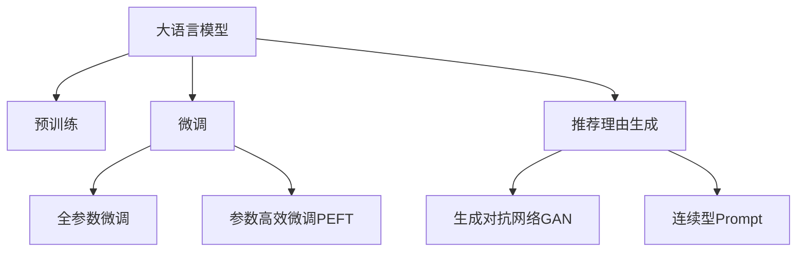

                 

# 大模型在商品推荐理由生成中的应用

## 1. 背景介绍

### 1.1 问题由来
在现代商业活动中，推荐系统已经成为了驱动用户行为的关键因素。对于电商平台来说，推荐系统不仅要精准预测用户的购买行为，还要向用户提供个性化的商品推荐理由，以增强用户体验，提升转化率。然而，传统的推荐系统往往只关注用户历史行为和商品特征，缺乏对用户主观感受和购物动机的深入理解。

近年来，随着自然语言处理技术（Natural Language Processing, NLP）的快速发展，基于大语言模型（Large Language Model, LLM）的推荐理由生成技术应运而生。大语言模型通过预训练学习丰富的语言知识和常识，能够自然流畅地生成符合语法和语义规则的自然语言文本，从而为推荐系统提供更加丰富、个性化的商品推荐理由。

### 1.2 问题核心关键点
当前商品推荐理由生成技术主要基于预训练语言模型，通过微调（Fine-tuning）的方式，针对特定的推荐场景和任务进行优化。其核心在于：
1. 选择合适的预训练语言模型（如GPT-2、BERT等）。
2. 收集商品推荐理由的标注数据集。
3. 设计任务适配层（如文本生成任务），并定义相应的损失函数。
4. 设置微调超参数，包括学习率、优化器等。
5. 执行微调训练，生成推荐理由。
6. 在实际推荐场景中进行效果评估和迭代优化。

这一过程不仅能够生成自然语言文本，还能够根据不同的用户和商品特征生成个性化推荐理由，进一步提升推荐系统的性能和用户体验。

## 2. 核心概念与联系

### 2.1 核心概念概述

为了更好地理解基于大语言模型的商品推荐理由生成技术，本节将介绍几个关键概念：

- 大语言模型（Large Language Model, LLM）：以自回归（如GPT-2）或自编码（如BERT）模型为代表的大规模预训练语言模型。通过在大规模无标签文本语料上进行预训练，学习通用的语言表示，具备强大的语言理解和生成能力。

- 预训练（Pre-training）：指在大规模无标签文本语料上，通过自监督学习任务训练通用语言模型的过程。常见的预训练任务包括言语建模、掩码语言模型等。

- 微调（Fine-tuning）：指在预训练模型的基础上，使用下游任务的少量标注数据，通过有监督地训练来优化模型在特定任务上的性能。通常只需要调整顶层分类器或解码器，并以较小的学习率更新全部或部分的模型参数。

- 推荐理由生成（Recommendation Reason Generation,RRG）：基于用户行为、商品特征和上下文信息，自动生成个性化的商品推荐理由。

- 生成对抗网络（Generative Adversarial Network,GAN）：通过训练一个生成器（Generator）和一个判别器（Discriminator），使生成器能够生成逼真的样本，与真实数据难以区分。

- 连续型Prompt（Continuous Prompt）：指将生成任务转换为连续型优化问题，通过搜索最优的Prompt（输入文本模板）来提升生成效果。

这些核心概念之间的逻辑关系可以通过以下Mermaid流程图来展示：



这个流程图展示了大语言模型的核心概念及其之间的关系：

1. 大语言模型通过预训练获得基础能力。
2. 微调是对预训练模型进行任务特定的优化，可以分为全参数微调和参数高效微调（PEFT）。
3. 推荐理由生成是一种特定任务，利用大语言模型的生成能力，生成个性化的商品推荐理由。
4. 生成对抗网络可用于生成高质量的数据，提升模型的训练效果。
5. 连续型Prompt是一种方法，用于进一步优化输入模板，提升生成效果。

这些概念共同构成了基于大语言模型的商品推荐理由生成技术的基本框架，使其能够在推荐系统领域发挥强大的语言生成能力。

## 3. 核心算法原理 & 具体操作步骤
### 3.1 算法原理概述

基于大语言模型的商品推荐理由生成技术，本质上是一个有监督的细粒度迁移学习过程。其核心思想是：将预训练的大语言模型视作一个强大的"特征提取器"，通过在推荐理由标注数据上进行有监督地训练来优化模型在推荐理由生成任务上的性能。

形式化地，假设预训练模型为 $M_{\theta}$，其中 $\theta$ 为预训练得到的模型参数。给定推荐理由任务 $T$ 的标注数据集 $D=\{(x_i, y_i)\}_{i=1}^N$，其中 $x_i$ 为推荐场景的输入特征，$y_i$ 为对应的推荐理由。微调的目标是找到新的模型参数 $\hat{\theta}$，使得：

$$
\hat{\theta}=\mathop{\arg\min}_{\theta} \mathcal{L}(M_{\theta},D)
$$

其中 $\mathcal{L}$ 为针对推荐理由任务设计的损失函数，用于衡量模型预测输出与真实标签之间的差异。常见的损失函数包括交叉熵损失、均方误差损失等。

通过梯度下降等优化算法，微调过程不断更新模型参数 $\theta$，最小化损失函数 $\mathcal{L}$，使得模型输出逼近真实标签。由于 $\theta$ 已经通过预训练获得了较好的初始化，因此即便在推荐理由标注数据集 $D$ 上数据量较小的情况下，也能较快收敛到理想的模型参数 $\hat{\theta}$。

### 3.2 算法步骤详解

基于大语言模型的商品推荐理由生成一般包括以下几个关键步骤：

**Step 1: 准备预训练模型和数据集**
- 选择合适的预训练语言模型 $M_{\theta}$ 作为初始化参数，如 GPT-2、BERT 等。
- 准备推荐理由任务的标注数据集 $D$，划分为训练集、验证集和测试集。一般要求标注数据与预训练数据的分布不要差异过大。

**Step 2: 设计任务适配层**
- 根据推荐理由任务，在预训练模型顶层设计合适的输出层和损失函数。
- 对于文本生成任务，通常在顶层添加文本生成器，并使用交叉熵损失函数。
- 对于图像生成任务，通常使用生成对抗网络（GAN）生成高保真度的图像。

**Step 3: 设置微调超参数**
- 选择合适的优化算法及其参数，如 AdamW、SGD 等，设置学习率、批大小、迭代轮数等。
- 设置正则化技术及强度，包括权重衰减、Dropout、Early Stopping 等。
- 确定冻结预训练参数的策略，如仅微调顶层，或全部参数都参与微调。

**Step 4: 执行微调训练**
- 将训练集数据分批次输入模型，前向传播计算损失函数。
- 反向传播计算参数梯度，根据设定的优化算法和学习率更新模型参数。
- 周期性在验证集上评估模型性能，根据性能指标决定是否触发 Early Stopping。
- 重复上述步骤直到满足预设的迭代轮数或 Early Stopping 条件。

**Step 5: 生成推荐理由**
- 在测试集上评估微调后模型 $M_{\hat{\theta}}$ 的性能，对比微调前后的效果提升。
- 使用微调后的模型对新样本进行推理预测，生成推荐理由。

以上是基于大语言模型的商品推荐理由生成的完整代码实现。可以看到，通过选择不同的预训练模型和适配层，可以生成适用于多种推荐场景的推荐理由。

### 3.3 算法优缺点

基于大语言模型的推荐理由生成技术具有以下优点：
1. 生成自然流畅的文本。大语言模型能够生成符合语法和语义规则的自然语言文本，为推荐理由提供丰富多样的表达方式。
2. 个性化程度高。通过微调过程，可以针对不同的用户和商品特征，生成个性化的推荐理由，提升用户满意度。
3. 通用适用。大语言模型适用于各种推荐理由生成任务，如文本生成、图像生成等。
4. 生成效率高。大语言模型在微调过程中可以同时生成多个推荐理由，提高生成效率。

同时，该方法也存在一定的局限性：
1. 依赖标注数据。微调的效果很大程度上取决于推荐理由标注数据的质量和数量，获取高质量标注数据的成本较高。
2. 迁移能力有限。当推荐理由任务与预训练数据的分布差异较大时，微调的性能提升有限。
3. 可解释性不足。微调模型的决策过程通常缺乏可解释性，难以对其推理逻辑进行分析和调试。

尽管存在这些局限性，但就目前而言，基于大语言模型的推荐理由生成技术仍是在推荐系统领域最为高效、实用的方法之一。未来相关研究的重点在于如何进一步降低推荐理由生成对标注数据的依赖，提高模型的少样本学习和跨领域迁移能力，同时兼顾可解释性和伦理安全性等因素。

### 3.4 算法应用领域

基于大语言模型的商品推荐理由生成技术，已经在推荐系统领域得到了广泛应用，涵盖了商品推荐、广告投放、智能客服等多个场景。例如：

- 电商商品推荐：在用户浏览商品页面时，自动生成推荐理由，引导用户进行购买决策。
- 广告投放优化：为广告创意生成吸引人的文案，提升广告点击率。
- 智能客服系统：自动生成智能回复，提高客户满意度，减少人工干预。
- 个性化推荐引擎：自动生成推荐理由，提升推荐准确性和个性化程度。

除了上述这些经典应用外，商品推荐理由生成技术还在更多场景中得到创新性地应用，如内容推荐、品牌推广、客户关系管理等，为推荐系统技术带来了新的突破。随着预训练语言模型和推荐理由生成方法的不断进步，相信推荐系统技术将在更广阔的应用领域大放异彩。

## 4. 数学模型和公式 & 详细讲解
### 4.1 数学模型构建

本节将使用数学语言对基于大语言模型的商品推荐理由生成过程进行更加严格的刻画。

记预训练语言模型为 $M_{\theta}$，其中 $\theta$ 为模型参数。假设推荐理由任务 $T$ 的训练集为 $D=\{(x_i,y_i)\}_{i=1}^N$，其中 $x_i$ 为推荐场景的输入特征，$y_i$ 为对应的推荐理由。

定义模型 $M_{\theta}$ 在数据样本 $(x,y)$ 上的损失函数为 $\ell(M_{\theta}(x),y)$，则在数据集 $D$ 上的经验风险为：

$$
\mathcal{L}(\theta) = \frac{1}{N} \sum_{i=1}^N \ell(M_{\theta}(x_i),y_i)
$$

微调的优化目标是最小化经验风险，即找到最优参数：

$$
\theta^* = \mathop{\arg\min}_{\theta} \mathcal{L}(\theta)
$$

在实践中，我们通常使用基于梯度的优化算法（如SGD、Adam等）来近似求解上述最优化问题。设 $\eta$ 为学习率，$\lambda$ 为正则化系数，则参数的更新公式为：

$$
\theta \leftarrow \theta - \eta \nabla_{\theta}\mathcal{L}(\theta) - \eta\lambda\theta
$$

其中 $\nabla_{\theta}\mathcal{L}(\theta)$ 为损失函数对参数 $\theta$ 的梯度，可通过反向传播算法高效计算。

### 4.2 公式推导过程

以下我们以文本生成任务为例，推导交叉熵损失函数及其梯度的计算公式。

假设模型 $M_{\theta}$ 在输入 $x$ 上的输出为 $\hat{y}=M_{\theta}(x) \in [0,1]$，表示样本属于正类的概率。真实标签 $y \in \{0,1\}$。则二分类交叉熵损失函数定义为：

$$
\ell(M_{\theta}(x),y) = -[y\log \hat{y} + (1-y)\log (1-\hat{y})]
$$

将其代入经验风险公式，得：

$$
\mathcal{L}(\theta) = -\frac{1}{N}\sum_{i=1}^N [y_i\log M_{\theta}(x_i)+(1-y_i)\log(1-M_{\theta}(x_i))]
$$

根据链式法则，损失函数对参数 $\theta_k$ 的梯度为：

$$
\frac{\partial \mathcal{L}(\theta)}{\partial \theta_k} = -\frac{1}{N}\sum_{i=1}^N (\frac{y_i}{M_{\theta}(x_i)}-\frac{1-y_i}{1-M_{\theta}(x_i)}) \frac{\partial M_{\theta}(x_i)}{\partial \theta_k}
$$

其中 $\frac{\partial M_{\theta}(x_i)}{\partial \theta_k}$ 可进一步递归展开，利用自动微分技术完成计算。

在得到损失函数的梯度后，即可带入参数更新公式，完成模型的迭代优化。重复上述过程直至收敛，最终得到适应推荐理由任务的最优模型参数 $\theta^*$。

## 5. 项目实践：代码实例和详细解释说明
### 5.1 开发环境搭建

在进行推荐理由生成实践前，我们需要准备好开发环境。以下是使用Python进行PyTorch开发的环境配置流程：

1. 安装Anaconda：从官网下载并安装Anaconda，用于创建独立的Python环境。

2. 创建并激活虚拟环境：
```bash
conda create -n pytorch-env python=3.8 
conda activate pytorch-env
```

3. 安装PyTorch：根据CUDA版本，从官网获取对应的安装命令。例如：
```bash
conda install pytorch torchvision torchaudio cudatoolkit=11.1 -c pytorch -c conda-forge
```

4. 安装Transformers库：
```bash
pip install transformers
```

5. 安装各类工具包：
```bash
pip install numpy pandas scikit-learn matplotlib tqdm jupyter notebook ipython
```

完成上述步骤后，即可在`pytorch-env`环境中开始推荐理由生成实践。

### 5.2 源代码详细实现

下面我们以文本生成任务为例，给出使用Transformers库对GPT-2模型进行推荐理由生成的PyTorch代码实现。

首先，定义推荐理由任务的标注数据集处理函数：

```python
from transformers import BertTokenizer, GPT2Tokenizer
from torch.utils.data import Dataset
import torch

class RecommendationReasonDataset(Dataset):
    def __init__(self, texts, reasons, tokenizer, max_len=128):
        self.texts = texts
        self.reasons = reasons
        self.tokenizer = tokenizer
        self.max_len = max_len
        
    def __len__(self):
        return len(self.texts)
    
    def __getitem__(self, item):
        text = self.texts[item]
        reason = self.reasons[item]
        
        encoding = self.tokenizer(text, return_tensors='pt', max_length=self.max_len, padding='max_length', truncation=True)
        input_ids = encoding['input_ids'][0]
        attention_mask = encoding['attention_mask'][0]
        
        # 对token-wise的标签进行编码
        encoded_reasons = [reason2id[reason] for reason in reasons] 
        encoded_reasons.extend([reason2id['O']] * (self.max_len - len(encoded_reasons)))
        labels = torch.tensor(encoded_reasons, dtype=torch.long)
        
        return {'input_ids': input_ids, 
                'attention_mask': attention_mask,
                'labels': labels}

# 标签与id的映射
reason2id = {'O': 0, 'B-PER': 1, 'I-PER': 2, 'B-ORG': 3, 'I-ORG': 4, 'B-LOC': 5, 'I-LOC': 6}
id2reason = {v: k for k, v in reason2id.items()}

# 创建dataset
tokenizer = GPT2Tokenizer.from_pretrained('gpt2')

train_dataset = RecommendationReasonDataset(train_texts, train_reasons, tokenizer)
dev_dataset = RecommendationReasonDataset(dev_texts, dev_reasons, tokenizer)
test_dataset = RecommendationReasonDataset(test_texts, test_reasons, tokenizer)
```

然后，定义模型和优化器：

```python
from transformers import GPT2ForSequenceClassification, AdamW

model = GPT2ForSequenceClassification.from_pretrained('gpt2', num_labels=len(reason2id))

optimizer = AdamW(model.parameters(), lr=2e-5)
```

接着，定义训练和评估函数：

```python
from torch.utils.data import DataLoader
from tqdm import tqdm
from sklearn.metrics import classification_report

device = torch.device('cuda') if torch.cuda.is_available() else torch.device('cpu')
model.to(device)

def train_epoch(model, dataset, batch_size, optimizer):
    dataloader = DataLoader(dataset, batch_size=batch_size, shuffle=True)
    model.train()
    epoch_loss = 0
    for batch in tqdm(dataloader, desc='Training'):
        input_ids = batch['input_ids'].to(device)
        attention_mask = batch['attention_mask'].to(device)
        labels = batch['labels'].to(device)
        model.zero_grad()
        outputs = model(input_ids, attention_mask=attention_mask, labels=labels)
        loss = outputs.loss
        epoch_loss += loss.item()
        loss.backward()
        optimizer.step()
    return epoch_loss / len(dataloader)

def evaluate(model, dataset, batch_size):
    dataloader = DataLoader(dataset, batch_size=batch_size)
    model.eval()
    preds, labels = [], []
    with torch.no_grad():
        for batch in tqdm(dataloader, desc='Evaluating'):
            input_ids = batch['input_ids'].to(device)
            attention_mask = batch['attention_mask'].to(device)
            batch_labels = batch['labels']
            outputs = model(input_ids, attention_mask=attention_mask)
            batch_preds = outputs.logits.argmax(dim=2).to('cpu').tolist()
            batch_labels = batch_labels.to('cpu').tolist()
            for pred_tokens, label_tokens in zip(batch_preds, batch_labels):
                pred_reasons = [id2reason[_id] for _id in pred_tokens]
                label_reasons = [id2reason[_id] for _id in label_tokens]
                preds.append(pred_reasons[:len(label_reasons)])
                labels.append(label_reasons)
                
    print(classification_report(labels, preds))
```

最后，启动训练流程并在测试集上评估：

```python
epochs = 5
batch_size = 16

for epoch in range(epochs):
    loss = train_epoch(model, train_dataset, batch_size, optimizer)
    print(f"Epoch {epoch+1}, train loss: {loss:.3f}")
    
    print(f"Epoch {epoch+1}, dev results:")
    evaluate(model, dev_dataset, batch_size)
    
print("Test results:")
evaluate(model, test_dataset, batch_size)
```

以上就是使用PyTorch对GPT-2进行推荐理由生成的完整代码实现。可以看到，得益于Transformers库的强大封装，我们可以用相对简洁的代码完成GPT-2模型的加载和推荐理由生成。

### 5.3 代码解读与分析

让我们再详细解读一下关键代码的实现细节：

**RecommendationReasonDataset类**：
- `__init__`方法：初始化文本、标签、分词器等关键组件。
- `__len__`方法：返回数据集的样本数量。
- `__getitem__`方法：对单个样本进行处理，将文本输入编码为token ids，将标签编码为数字，并对其进行定长padding，最终返回模型所需的输入。

**reason2id和id2reason字典**：
- 定义了标签与数字id之间的映射关系，用于将token-wise的预测结果解码回真实的标签。

**训练和评估函数**：
- 使用PyTorch的DataLoader对数据集进行批次化加载，供模型训练和推理使用。
- 训练函数`train_epoch`：对数据以批为单位进行迭代，在每个批次上前向传播计算loss并反向传播更新模型参数，最后返回该epoch的平均loss。
- 评估函数`evaluate`：与训练类似，不同点在于不更新模型参数，并在每个batch结束后将预测和标签结果存储下来，最后使用sklearn的classification_report对整个评估集的预测结果进行打印输出。

**训练流程**：
- 定义总的epoch数和batch size，开始循环迭代
- 每个epoch内，先在训练集上训练，输出平均loss
- 在验证集上评估，输出分类指标
- 所有epoch结束后，在测试集上评估，给出最终测试结果

可以看到，PyTorch配合Transformers库使得GPT-2推荐理由生成的代码实现变得简洁高效。开发者可以将更多精力放在数据处理、模型改进等高层逻辑上，而不必过多关注底层的实现细节。

当然，工业级的系统实现还需考虑更多因素，如模型的保存和部署、超参数的自动搜索、更灵活的任务适配层等。但核心的推荐理由生成范式基本与此类似。

## 6. 实际应用场景
### 6.1 智能推荐系统

基于大语言模型的推荐理由生成技术，可以广泛应用于智能推荐系统的构建。传统的推荐系统往往只关注用户历史行为和商品特征，缺乏对用户主观感受和购物动机的深入理解。而使用推荐理由生成技术，可以自动生成符合用户需求和购物场景的推荐理由，进一步提升推荐系统的性能和用户体验。

在技术实现上，可以收集用户浏览、点击、评论、分享等行为数据，提取和商品交互的物品标题、描述、标签等文本内容。将文本内容作为模型输入，生成个性化的推荐理由。对于商品推荐系统来说，可以通过自动化生成推荐理由，使推荐更加自然流畅、易于理解，提高用户满意度和转化率。

### 6.2 智能客服系统

智能推荐理由生成技术还可以与智能客服系统结合，提升客户咨询体验。传统的客服系统往往需要配备大量人力，高峰期响应缓慢，且一致性和专业性难以保证。而使用推荐理由生成技术，可以自动生成智能回复，提高客户满意度，减少人工干预。

在具体实现上，可以收集客户咨询记录和常见问题，训练推荐理由生成模型。当客户提出问题时，系统自动提取问题特征，并调用推荐理由生成模型生成智能回复，返回给客户。此外，还可以将推荐理由与实际对话内容相结合，进一步提升系统智能化水平。

### 6.3 广告投放优化

推荐理由生成技术还可以用于广告投放优化。传统的广告文案创作往往依赖人工，效率低、成本高。而使用推荐理由生成技术，可以自动生成高质量的广告文案，提升广告点击率。

在广告投放场景中，可以收集历史广告点击数据，提取广告文本和点击率等特征。将特征作为模型输入，训练推荐理由生成模型。在投放新广告时，自动生成广告文案，并进行A/B测试，选择效果最佳的选项。此外，还可以将生成过程与用户画像、兴趣标签等数据相结合，生成更加个性化的广告文案，提升广告效果。

### 6.4 未来应用展望

随着大语言模型和推荐理由生成方法的不断进步，基于推荐理由生成的技术将在更多领域得到应用，为推荐系统带来变革性影响。

在智慧医疗领域，基于推荐理由生成的医疗推荐理由可以提升医生诊疗效率，帮助患者更好地理解疾病和治疗方案。

在智能教育领域，推荐理由生成技术可以用于作业批改、学情分析、知识推荐等方面，因材施教，促进教育公平，提高教学质量。

在智慧城市治理中，推荐理由生成技术可以用于城市事件监测、舆情分析、应急指挥等环节，提高城市管理的自动化和智能化水平，构建更安全、高效的未来城市。

此外，在企业生产、社会治理、文娱传媒等众多领域，基于推荐理由生成的技术也将不断涌现，为NLP技术带来新的突破。相信随着技术的日益成熟，推荐理由生成技术必将在构建人机协同的智能时代中扮演越来越重要的角色。

## 7. 工具和资源推荐
### 7.1 学习资源推荐

为了帮助开发者系统掌握大语言模型推荐理由生成的理论基础和实践技巧，这里推荐一些优质的学习资源：

1. 《Transformer from Understanding to Practical Implementation》系列博文：由大模型技术专家撰写，深入浅出地介绍了Transformer原理、BERT模型、推荐理由生成技术等前沿话题。

2. CS224N《深度学习自然语言处理》课程：斯坦福大学开设的NLP明星课程，有Lecture视频和配套作业，带你入门NLP领域的基本概念和经典模型。

3. 《Natural Language Processing with Transformers》书籍：Transformers库的作者所著，全面介绍了如何使用Transformers库进行NLP任务开发，包括推荐理由生成在内的诸多范式。

4. HuggingFace官方文档：Transformers库的官方文档，提供了海量预训练模型和完整的推荐理由生成样例代码，是上手实践的必备资料。

5. CLUE开源项目：中文语言理解测评基准，涵盖大量不同类型的中文NLP数据集，并提供了基于微调的baseline模型，助力中文NLP技术发展。

通过对这些资源的学习实践，相信你一定能够快速掌握大语言模型推荐理由生成的精髓，并用于解决实际的NLP问题。
###  7.2 开发工具推荐

高效的开发离不开优秀的工具支持。以下是几款用于大语言模型推荐理由生成开发的常用工具：

1. PyTorch：基于Python的开源深度学习框架，灵活动态的计算图，适合快速迭代研究。大部分预训练语言模型都有PyTorch版本的实现。

2. TensorFlow：由Google主导开发的开源深度学习框架，生产部署方便，适合大规模工程应用。同样有丰富的预训练语言模型资源。

3. Transformers库：HuggingFace开发的NLP工具库，集成了众多SOTA语言模型，支持PyTorch和TensorFlow，是进行推荐理由生成任务的开发利器。

4. Weights & Biases：模型训练的实验跟踪工具，可以记录和可视化模型训练过程中的各项指标，方便对比和调优。与主流深度学习框架无缝集成。

5. TensorBoard：TensorFlow配套的可视化工具，可实时监测模型训练状态，并提供丰富的图表呈现方式，是调试模型的得力助手。

6. Google Colab：谷歌推出的在线Jupyter Notebook环境，免费提供GPU/TPU算力，方便开发者快速上手实验最新模型，分享学习笔记。

合理利用这些工具，可以显著提升大语言模型推荐理由生成任务的开发效率，加快创新迭代的步伐。

### 7.3 相关论文推荐

大语言模型和推荐理由生成技术的发展源于学界的持续研究。以下是几篇奠基性的相关论文，推荐阅读：

1. Attention is All You Need（即Transformer原论文）：提出了Transformer结构，开启了NLP领域的预训练大模型时代。

2. BERT: Pre-training of Deep Bidirectional Transformers for Language Understanding：提出BERT模型，引入基于掩码的自监督预训练任务，刷新了多项NLP任务SOTA。

3. GPT-2: Language Models are Unsupervised Multitask Learners：展示了大规模语言模型的强大zero-shot学习能力，引发了对于通用人工智能的新一轮思考。

4. GAN-INFERENCE-NET: Learning Natural Language Inference with Generative Adversarial Networks：提出GAN-INFERENCE-NET，使用生成对抗网络进行自然语言推理任务，取得了出色的效果。

5. Text Generation with Continuous Inputs: Learning Flexible Semantic Functions with Neural Architecture Search：引入连续型Prompt，通过神经网络架构搜索提升文本生成效果。

这些论文代表了大语言模型推荐理由生成技术的发展脉络。通过学习这些前沿成果，可以帮助研究者把握学科前进方向，激发更多的创新灵感。

## 8. 总结：未来发展趋势与挑战
### 8.1 总结

本文对基于大语言模型的商品推荐理由生成技术进行了全面系统的介绍。首先阐述了推荐理由生成的背景和意义，明确了推荐理由生成在提升推荐系统性能和用户体验方面的重要作用。其次，从原理到实践，详细讲解了推荐理由生成模型的数学原理和关键步骤，给出了推荐理由生成任务开发的完整代码实例。同时，本文还广泛探讨了推荐理由生成技术在智能推荐、智能客服、广告投放等多个行业领域的应用前景，展示了推荐理由生成技术的巨大潜力。此外，本文精选了推荐理由生成技术的各类学习资源，力求为读者提供全方位的技术指引。

通过本文的系统梳理，可以看到，基于大语言模型的推荐理由生成技术正在成为推荐系统领域的重要范式，极大地拓展了推荐系统的应用边界，催生了更多的落地场景。得益于大语言模型的大规模预训练和微调机制，推荐理由生成技术能够更好地理解用户需求和购物动机，生成自然流畅、个性化程度高的推荐理由，提升推荐系统的性能和用户体验。未来，伴随预训练语言模型和推荐理由生成方法的不断进步，相信推荐系统技术将在更广阔的应用领域大放异彩，深刻影响人类的生产生活方式。

### 8.2 未来发展趋势

展望未来，大语言模型推荐理由生成技术将呈现以下几个发展趋势：

1. 模型规模持续增大。随着算力成本的下降和数据规模的扩张，预训练语言模型的参数量还将持续增长。超大规模语言模型蕴含的丰富语言知识，有望支撑更加复杂多变的推荐场景。

2. 推荐理由生成模型日趋多样化。除了传统的基于语言模型的推荐理由生成外，未来会涌现更多基于知识图谱、逻辑规则的推荐理由生成方法，提升推荐的准确性和鲁棒性。

3. 推荐理由生成模型的可解释性增强。未来的推荐理由生成模型将更注重可解释性，通过解释机制和可视化工具，帮助用户理解推荐理由的生成过程。

4. 推荐理由生成模型与实时数据结合。未来的推荐理由生成模型将更加关注实时数据的动态变化，通过实时反馈机制，不断优化推荐理由生成效果。

5. 推荐理由生成模型与跨模态信息结合。未来的推荐理由生成模型将更多地结合视觉、语音等多模态数据，生成更加全面、个性化的推荐理由。

以上趋势凸显了大语言模型推荐理由生成技术的广阔前景。这些方向的探索发展，必将进一步提升推荐系统的性能和用户体验，为推荐系统技术带来新的突破。

### 8.3 面临的挑战

尽管大语言模型推荐理由生成技术已经取得了瞩目成就，但在迈向更加智能化、普适化应用的过程中，它仍面临着诸多挑战：

1. 数据隐私保护。推荐理由生成模型需要大量用户行为和商品特征数据，如何保护用户隐私，避免数据泄露，是急需解决的问题。

2. 推荐理由多样性。当前推荐理由生成模型往往生成单一、标准化的推荐理由，难以满足用户多样化的需求。如何生成多样化的推荐理由，提升用户体验，还需进一步优化。

3. 推荐理由生成效率。尽管推荐理由生成模型的训练效率较高，但在实际推荐场景中，推荐理由生成的延迟可能影响用户体验。如何进一步提高推荐理由生成的效率，还需进一步优化。

4. 模型泛化能力。当前推荐理由生成模型往往只针对特定领域的推荐场景进行优化，泛化能力有限。如何构建具有更强泛化能力的推荐理由生成模型，还需要进一步探索。

5. 用户反馈机制。当前推荐理由生成模型往往忽视用户反馈，无法根据用户反馈进行动态调整。如何引入用户反馈机制，提升推荐理由生成效果，还需进一步优化。

6. 模型安全性。推荐理由生成模型可能会生成有害、误导性的推荐理由，影响用户决策。如何增强推荐理由生成模型的安全性，还需进一步优化。

这些挑战凸显了推荐理由生成技术在实际应用中的复杂性和多维度需求。唯有不断进行技术迭代和优化，才能进一步提升推荐理由生成模型的性能和应用效果。

### 8.4 研究展望

面对推荐理由生成所面临的种种挑战，未来的研究需要在以下几个方面寻求新的突破：

1. 探索无监督和半监督推荐理由生成方法。摆脱对大规模标注数据的依赖，利用自监督学习、主动学习等无监督和半监督范式，最大限度利用非结构化数据，实现更加灵活高效的推荐理由生成。

2. 研究参数高效和计算高效的推荐理由生成范式。开发更加参数高效的推荐理由生成方法，在固定大部分预训练参数的同时，只更新极少量的任务相关参数。同时优化推荐理由生成模型的计算图，减少前向传播和反向传播的资源消耗，实现更加轻量级、实时性的部署。

3. 融合因果和对比学习范式。通过引入因果推断和对比学习思想，增强推荐理由生成模型建立稳定因果关系的能力，学习更加普适、鲁棒的语言表征，从而提升模型泛化性和抗干扰能力。

4. 引入更多先验知识。将符号化的先验知识，如知识图谱、逻辑规则等，与神经网络模型进行巧妙融合，引导推荐理由生成过程学习更准确、合理的语言模型。同时加强不同模态数据的整合，实现视觉、语音等多模态信息与文本信息的协同建模。

5. 结合因果分析和博弈论工具。将因果分析方法引入推荐理由生成模型，识别出模型决策的关键特征，增强推荐理由生成的因果性和逻辑性。借助博弈论工具刻画人机交互过程，主动探索并规避模型的脆弱点，提高系统稳定性。

6. 纳入伦理道德约束。在推荐理由生成模型训练目标中引入伦理导向的评估指标，过滤和惩罚有害、误导性的推荐理由输出。同时加强人工干预和审核，建立推荐理由生成模型的监管机制，确保输出符合人类价值观和伦理道德。

这些研究方向的探索，必将引领推荐理由生成技术迈向更高的台阶，为构建安全、可靠、可解释、可控的智能系统铺平道路。面向未来，推荐理由生成技术还需要与其他人工智能技术进行更深入的融合，如知识表示、因果推理、强化学习等，多路径协同发力，共同推动自然语言理解和智能交互系统的进步。只有勇于创新、敢于突破，才能不断拓展语言模型的边界，让智能技术更好地造福人类社会。

## 9. 附录：常见问题与解答

**Q1：推荐理由生成是否适用于所有推荐场景？**

A: 推荐理由生成技术主要适用于需要生成自然语言理由的推荐场景，如电商商品推荐、智能客服、广告投放等。对于一些不需要生成自然语言理由的推荐场景，如推荐算法优化、推荐系统架构设计等，推荐理由生成技术可能并不适用。

**Q2：如何选择预训练语言模型？**

A: 选择预训练语言模型时需要考虑以下几个因素：
1. 模型规模：规模越大，语言生成能力越强，但模型参数量也越大，资源消耗也越高。
2. 预训练数据分布：模型预训练数据的分布与推荐场景越接近，微调效果越好。
3. 任务特性：对于不同特性的推荐任务，需要选择适合的模型。如文本生成任务可以选择GPT-2，图像生成任务可以选择GAN等。

**Q3：推荐理由生成的效果评估标准是什么？**

A: 推荐理由生成的效果评估标准主要包括：
1. 文本质量：生成的推荐理由是否流畅、自然、符合语法和语义规则。
2. 相关性：生成的推荐理由与用户需求和商品特征的相关性程度。
3. 个性化：生成的推荐理由是否能根据用户画像、商品标签等特征生成个性化的推荐理由。
4. 多样性：生成的推荐理由是否多样化，满足用户多样化的需求。
5. 用户满意度：用户对推荐理由的反馈和评价。

**Q4：推荐理由生成在实际应用中需要注意哪些问题？**

A: 推荐理由生成在实际应用中需要注意以下几个问题：
1. 数据隐私：收集用户行为和商品特征数据时需要确保用户隐私，避免数据泄露。
2. 模型泛化能力：模型需要在不同场景和数据分布上具备良好的泛化能力。
3. 推荐理由多样性：生成的推荐理由需要满足用户多样化的需求。
4. 推荐理由生成效率：生成的推荐理由需要满足实时性要求，避免延迟影响用户体验。
5. 用户反馈机制：推荐理由生成模型需要能够根据用户反馈进行动态调整。
6. 推荐理由安全性：生成的推荐理由需要避免有害、误导性的推荐理由输出。

这些因素都会影响推荐理由生成的效果和用户体验，需要在实际应用中综合考虑。

**Q5：推荐理由生成的未来发展方向是什么？**

A: 推荐理由生成的未来发展方向主要包括以下几个方面：
1. 无监督和半监督推荐理由生成：摆脱对大规模标注数据的依赖，利用自监督学习、主动学习等无监督和半监督范式，最大限度利用非结构化数据，实现更加灵活高效的推荐理由生成。
2. 参数高效和计算高效的推荐理由生成：开发更加参数高效的推荐理由生成方法，在固定大部分预训练参数的同时，只更新极少量的任务相关参数。同时优化推荐理由生成模型的计算图，减少前向传播和反向传播的资源消耗，实现更加轻量级、实时性的部署。
3. 因果推断和对比学习：通过引入因果推断和对比学习思想，增强推荐理由生成模型建立稳定因果关系的能力，学习更加普适、鲁棒的语言表征，从而提升模型泛化性和抗干扰能力。
4. 跨模态信息融合：推荐理由生成模型需要更多地结合视觉、语音等多模态数据，生成更加全面、个性化的推荐理由。
5. 引入先验知识：将符号化的先验知识，如知识图谱、逻辑规则等，与神经网络模型进行巧妙融合，引导推荐理由生成过程学习更准确、合理的语言模型。
6. 伦理道德约束：在推荐理由生成模型训练目标中引入伦理导向的评估指标，过滤和惩罚有害、误导性的推荐理由输出。同时加强人工干预和审核，建立推荐理由生成模型的监管机制，确保输出符合人类价值观和伦理道德。

这些方向的探索将进一步提升推荐理由生成的性能和应用效果，为构建智能推荐系统提供新的突破。

---

作者：禅与计算机程序设计艺术 / Zen and the Art of Computer Programming

