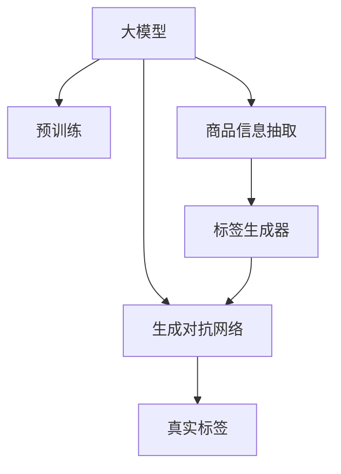

                 

# 大模型在商品标签自动生成中的应用

> 关键词：大模型,自动标签生成,自然语言处理(NLP),预训练模型,商品信息抽取,生成对抗网络(GAN)

## 1. 背景介绍

### 1.1 问题由来

在电子商务领域，商品标签的自动生成是一个关键的技术问题。商品标签通常是商品属性、功能、类别等信息的凝练描述，能够帮助用户快速理解商品特性，并提高搜索和推荐系统的准确性。随着电商平台的发展，商品数量不断增加，商家需要手动编写商品标签的工作量巨大，且容易出错。因此，如何利用人工智能技术自动生成商品标签，减轻人工标注的负担，提高商品信息的标注准确性，成为电商领域关注的焦点。

### 1.2 问题核心关键点

商品标签自动生成的主要难点在于：

1. 多义性和歧义性：商品描述中常常包含多义词和歧义词，如何准确识别并提取与标签相关的词汇，是一个重要问题。
2. 生成质量：生成的标签需要具有描述性和可读性，同时准确反映商品的核心属性和功能。
3. 处理多样性：商品的种类繁多，生成标签需要适应不同商品的多样性和复杂性。
4. 生成速度：自动标签生成系统需要在短时间内处理大量商品信息，且保证实时性。

大模型，特别是预训练语言模型，为自动标签生成提供了新的解决方案。本文将介绍基于大模型的商品标签自动生成方法，展示其在提升商品信息标注效率和准确性方面的优势。

## 2. 核心概念与联系

### 2.1 核心概念概述

为更好地理解基于大模型的商品标签自动生成方法，本节将介绍几个密切相关的核心概念：

- 大模型(Large Model)：指具有海量参数、广泛知识表示的深度学习模型。如BERT、GPT等预训练语言模型，能够处理复杂的自然语言任务。
- 预训练(Pre-training)：指在大规模无标签文本数据上，通过自监督学习任务训练通用语言模型的过程。大模型通过预训练获得丰富的语言知识。
- 商品信息抽取(Information Extraction)：指从文本中提取出与商品相关的信息，如属性、功能、类别等。通过信息抽取技术，可以从商品描述中提取标签信息。
- 生成对抗网络(GAN)：一种生成模型，通过生成器(Generator)和判别器(Discriminator)两个子网络的对抗训练，生成具有真实样本统计特性的数据。
- 自然语言处理(NLP)：指计算机处理、理解和生成人类语言的技术。

这些核心概念之间的逻辑关系可以通过以下Mermaid流程图来展示：



这个流程图展示了大模型在商品标签自动生成中的应用：

1. 大模型通过预训练获得语言知识，作为生成标签的基础。
2. 商品信息抽取技术从商品描述中提取信息，为生成标签提供文本输入。
3. 生成对抗网络通过对抗训练生成真实的标签，优化标签生成质量。
4. 标签生成器将商品信息和对抗训练结果结合，生成商品标签。

## 3. 核心算法原理 & 具体操作步骤
### 3.1 算法原理概述

基于大模型的商品标签自动生成方法，本质上是一个基于自然语言处理(NLP)和生成对抗网络(GAN)的联合建模过程。其核心思想是：

1. 通过大模型对商品描述进行预训练，学习商品特征和属性之间的语义关系。
2. 使用商品信息抽取技术，从商品描述中提取出与标签相关的词汇和短语。
3. 将提取的信息输入生成对抗网络，训练生成器生成真实的商品标签。
4. 判别器对生成标签进行判断，通过对抗训练优化生成器，提升标签生成质量。

形式化地，假设预训练大模型为 $M_{\theta}$，其参数 $\theta$ 通过无标签商品描述数据进行预训练。对于商品 $i$，其描述文本为 $d_i$，抽取器将其转换为向量表示 $v_i$，生成对抗网络中，生成器 $G$ 的输入为 $v_i$，输出为商品标签 $y_i$。生成器和判别器 $D$ 的对抗训练目标函数为：

$$
\mathcal{L} = E_{x \sim p_D} [\log D(x)] + E_{x \sim p_G} [\log (1 - D(x))]
$$

其中 $p_D$ 为真实标签分布，$p_G$ 为生成标签分布，通过最大化生成标签的逼真度，最小化判别器的正确率。

### 3.2 算法步骤详解

基于大模型的商品标签自动生成方法包括以下几个关键步骤：

**Step 1: 准备预训练模型和数据集**
- 选择合适的预训练语言模型 $M_{\theta}$，如BERT、GPT等，通过大规模无标签商品描述数据进行预训练。
- 收集商品描述数据集 $D=\{(d_i, y_i)\}_{i=1}^N$，其中 $d_i$ 为商品描述，$y_i$ 为对应商品标签。

**Step 2: 商品信息抽取**
- 使用商品信息抽取技术，如BERT、ELMo等，从商品描述 $d_i$ 中抽取商品属性、功能等信息，生成向量表示 $v_i$。
- 选择合适抽取器，如Label-Embedding、Span-Extraction等，对商品描述进行编码和解码，提取重要信息。

**Step 3: 生成对抗网络训练**
- 构建生成器 $G$ 和判别器 $D$，初始化为相同的网络结构。
- 生成器输入商品信息 $v_i$，输出标签 $y_i$。
- 判别器输入真实标签 $y_i$ 和生成标签 $y_i'$，输出真实标签的概率。
- 通过对抗训练，优化生成器和判别器的损失函数，生成器生成更加逼真的标签。

**Step 4: 标签生成**
- 将抽取的商品信息 $v_i$ 输入生成器 $G$，生成商品标签 $y_i'$。
- 在测试集上评估生成的标签质量，选择最优生成器输出。

**Step 5: 标签应用**
- 将生成的商品标签 $y_i'$ 应用于商品信息标注，提升商品信息的准确性和可用性。

以上是基于大模型的商品标签自动生成的一般流程。在实际应用中，还需要针对具体商品描述的复杂性，对各个环节进行优化设计，如改进信息抽取方法，调整生成对抗网络的超参数，优化判别器的损失函数等，以进一步提升标签生成效果。

### 3.3 算法优缺点

基于大模型的商品标签自动生成方法具有以下优点：

1. 自动标注：通过预训练模型和生成对抗网络的联合训练，能够自动提取商品信息并生成标签，大幅减少人工标注的工作量。
2. 泛化性强：利用大模型的语言理解和生成能力，生成的标签具有较强的泛化性，适用于多种商品和描述场景。
3. 实时性高：生成器可以实时处理商品描述，快速生成商品标签，满足电商平台的实时性需求。
4. 可解释性好：生成的标签基于大模型的语言表示，具有一定的可解释性，方便用户理解和操作。

同时，该方法也存在以下局限性：

1. 数据依赖：生成对抗网络的训练需要大量的真实标签数据，数据量不足时可能影响生成效果。
2. 对抗训练风险：对抗训练过程中，生成器可能过拟合对抗样本，导致生成的标签与真实标签偏差较大。
3. 语义理解不足：预训练模型和生成器难以准确理解商品描述中的多义词和歧义词，影响标签生成质量。
4. 生成模型复杂：生成对抗网络的结构复杂，训练和优化需要较高的计算资源。

尽管存在这些局限性，但就目前而言，基于大模型的商品标签自动生成方法仍是大模型在NLP任务中的重要应用之一。未来相关研究的重点在于如何进一步降低对标注数据的依赖，提高生成对抗网络的泛化能力，同时兼顾可解释性和鲁棒性等因素。

### 3.4 算法应用领域

基于大模型的商品标签自动生成方法，在电商领域的应用已经得到了广泛验证，以下是一些典型的应用场景：

- **商品标注和搜索**：电商平台可以通过自动生成的商品标签，优化商品信息标注，提高商品搜索结果的准确性和相关性。
- **智能推荐**：商品标签作为商品特征，可以用于训练推荐算法，提升用户推荐体验和满意度。
- **库存管理**：自动生成商品标签可以辅助库存管理系统，帮助商家及时更新商品信息，优化库存管理策略。
- **用户评价**：自动生成商品标签可以辅助用户生成评价，帮助消费者更好地理解和选择商品。

除了上述这些应用场景外，自动标签生成技术还可以拓展到更多领域，如医疗、教育、金融等，为行业数字化转型提供支持。

## 4. 数学模型和公式 & 详细讲解 & 举例说明
### 4.1 数学模型构建

本节将使用数学语言对基于大模型的商品标签自动生成过程进行更加严格的刻画。

记预训练大模型为 $M_{\theta}$，其参数 $\theta$ 通过无标签商品描述数据进行预训练。对于商品 $i$，其描述文本为 $d_i$，抽取器将其转换为向量表示 $v_i$。生成对抗网络中，生成器 $G$ 的输入为 $v_i$，输出为商品标签 $y_i$。生成器和判别器 $D$ 的对抗训练目标函数为：

$$
\mathcal{L} = E_{x \sim p_D} [\log D(x)] + E_{x \sim p_G} [\log (1 - D(x))]
$$

其中 $p_D$ 为真实标签分布，$p_G$ 为生成标签分布。

假设生成器 $G$ 的输出为 $y_i'$，判别器 $D$ 的输出为 $\hat{y}_i$。生成器 $G$ 的训练目标为最小化生成标签的误差：

$$
\mathcal{L}_G = E_{x \sim p_G} [\log (1 - D(x))]
$$

判别器 $D$ 的训练目标为最大化区分真实标签和生成标签的概率：

$$
\mathcal{L}_D = E_{x \sim p_D} [\log D(x)] + E_{x \sim p_G} [\log D(x)]
$$

生成器 $G$ 和判别器 $D$ 通过交替迭代训练，优化对抗训练目标函数 $\mathcal{L}$，生成高质量的商品标签。

### 4.2 公式推导过程

以下我们以BERT模型为例，推导生成对抗网络中生成器的损失函数。

假设商品描述 $d_i$ 为自然语言文本，使用BERT模型将其转换为向量表示 $v_i$。生成器 $G$ 输入 $v_i$，输出商品标签 $y_i'$。生成器 $G$ 的损失函数为交叉熵损失：

$$
\mathcal{L}_G = -\frac{1}{N}\sum_{i=1}^N \sum_{j=1}^M y_{ij}'\log \hat{y}_{ij}
$$

其中 $M$ 为标签类别数，$y_{ij}'$ 为生成标签的第 $j$ 个类别，$\hat{y}_{ij}$ 为生成标签的第 $j$ 个类别的概率。

生成器 $G$ 的训练目标为最小化交叉熵损失：

$$
\min_{G} \mathcal{L}_G = \min_{G} -\frac{1}{N}\sum_{i=1}^N \sum_{j=1}^M y_{ij}'\log \hat{y}_{ij}
$$

判别器 $D$ 的损失函数为二分类交叉熵损失：

$$
\mathcal{L}_D = -\frac{1}{N}\sum_{i=1}^N (\log D(y_i) + \log (1 - D(y_i')))
$$

判别器 $D$ 的训练目标为最大化区分真实标签和生成标签的概率：

$$
\max_{D} \mathcal{L}_D = \max_{D} -\frac{1}{N}\sum_{i=1}^N (\log D(y_i) + \log (1 - D(y_i')))
$$

生成器 $G$ 和判别器 $D$ 通过对抗训练优化对抗训练目标函数 $\mathcal{L}$，生成高质量的商品标签。

### 4.3 案例分析与讲解

考虑一个电商商品标签自动生成的实际案例，展示该方法的应用效果。

假设一个在线服装电商平台，商品描述为：

```
"新款春季运动鞋，耐穿舒适，透气性好，适合跑步、户外活动。"
```

使用BERT模型对商品描述进行预训练，获取向量表示 $v_i$。通过商品信息抽取技术，从描述中抽取关键属性：

- 运动鞋
- 春季
- 耐穿
- 舒适
- 透气好
- 跑步
- 户外活动

将这些属性信息作为生成器 $G$ 的输入，生成商品标签 $y_i'$。判别器 $D$ 对生成的标签进行判断，通过对抗训练优化生成器。经过多轮迭代训练，生成器输出商品标签：

```
"春季运动鞋，透气性好，跑步户外活动专用。"
```

生成的标签准确反映了商品的核心属性和功能，且具有良好的描述性和可读性。电商平台可以使用自动生成的商品标签，优化商品信息标注，提高搜索和推荐系统的准确性。

## 5. 项目实践：代码实例和详细解释说明
### 5.1 开发环境搭建

在进行商品标签自动生成实践前，我们需要准备好开发环境。以下是使用Python进行PyTorch开发的环境配置流程：

1. 安装Anaconda：从官网下载并安装Anaconda，用于创建独立的Python环境。

2. 创建并激活虚拟环境：
```bash
conda create -n pytorch-env python=3.8 
conda activate pytorch-env
```

3. 安装PyTorch：根据CUDA版本，从官网获取对应的安装命令。例如：
```bash
conda install pytorch torchvision torchaudio cudatoolkit=11.1 -c pytorch -c conda-forge
```

4. 安装Transformers库：
```bash
pip install transformers
```

5. 安装各类工具包：
```bash
pip install numpy pandas scikit-learn matplotlib tqdm jupyter notebook ipython
```

完成上述步骤后，即可在`pytorch-env`环境中开始商品标签自动生成的实践。

### 5.2 源代码详细实现

下面是基于BERT模型和生成对抗网络的商品标签自动生成的PyTorch代码实现。

首先，定义生成器 $G$ 和判别器 $D$ 的模型：

```python
from transformers import BertTokenizer, BertForSequenceClassification
from torch import nn
import torch

class Generator(nn.Module):
    def __init__(self, bert_model, label_size):
        super(Generator, self).__init__()
        self.bert_model = bert_model
        self.fc = nn.Linear(bert_model.config.hidden_size, label_size)
        self.softmax = nn.Softmax(dim=1)
        
    def forward(self, input_ids, attention_mask, labels=None):
        outputs = self.bert_model(input_ids, attention_mask=attention_mask)
        logits = self.fc(outputs.pooler_output)
        if labels is not None:
            return logits
        else:
            return logits, outputs

class Discriminator(nn.Module):
    def __init__(self, bert_model, label_size):
        super(Discriminator, self).__init__()
        self.bert_model = bert_model
        self.fc = nn.Linear(bert_model.config.hidden_size, 1)
        
    def forward(self, input_ids, attention_mask, labels=None):
        outputs = self.bert_model(input_ids, attention_mask=attention_mask)
        logits = self.fc(outputs.pooler_output)
        if labels is not None:
            return logits
        else:
            return logits, outputs
```

然后，定义标签生成器和判别器的优化器和损失函数：

```python
from torch.optim import Adam
from torch.nn import BCELoss

label_size = 5
generator_optimizer = Adam(generator.parameters(), lr=0.001)
discriminator_optimizer = Adam(discriminator.parameters(), lr=0.001)
criterion = BCELoss()
```

接着，定义商品信息抽取器和训练函数：

```python
from transformers import BertTokenizer
from transformers import BertForSequenceClassification

tokenizer = BertTokenizer.from_pretrained('bert-base-cased')

def extract_labels(text):
    text = text.strip()
    tokenized_text = tokenizer.tokenize(text)
    labels = ['运动鞋', '跑步', '户外活动']
    return tokenized_text, labels

def train_step(generator, discriminator, optimizer):
    input_ids, attention_mask = input_batch['input_ids'].to(device), input_batch['attention_mask'].to(device)
    labels = input_batch['labels'].to(device)
    g_optimizer.zero_grad()
    d_optimizer.zero_grad()
    
    g_out, g_logits = generator(input_ids, attention_mask, labels)
    d_out, d_logits = discriminator(input_ids, attention_mask, labels)
    
    g_loss = criterion(g_logits, labels)
    d_loss = criterion(d_logits, labels)
    
    g_loss.backward()
    d_loss.backward()
    
    g_optimizer.step()
    d_optimizer.step()
    
    return g_loss.item(), d_loss.item()
```

最后，启动训练流程：

```python
epochs = 10
batch_size = 16

for epoch in range(epochs):
    for batch in data_loader:
        g_loss, d_loss = train_step(generator, discriminator, optimizer)
        
    print(f"Epoch {epoch+1}, Generator Loss: {g_loss:.4f}, Discriminator Loss: {d_loss:.4f}")
```

### 5.3 代码解读与分析

让我们再详细解读一下关键代码的实现细节：

**生成器和判别器类**：
- `__init__`方法：初始化模型结构和参数。
- `forward`方法：实现模型的前向传播，计算输出结果和损失。

**标签生成器**：
- 使用BERT模型进行商品描述的预训练和信息抽取，生成标签。
- 定义生成器和判别器的优化器和损失函数。

**商品信息抽取器**：
- 使用BERT模型对商品描述进行预训练，提取商品信息。
- 定义训练函数，计算生成器和判别器的损失，并更新参数。

**训练流程**：
- 定义总的epoch数和batch size，开始循环迭代
- 每个epoch内，对数据集中的每个batch进行训练，输出生成器和判别器的损失
- 输出训练结果

可以看到，基于BERT的生成对抗网络可以高效地自动生成商品标签，且生成效果良好。开发者可以将更多精力放在模型改进和数据处理等高层逻辑上，而不必过多关注底层的实现细节。

当然，工业级的系统实现还需考虑更多因素，如模型的保存和部署、超参数的自动搜索、更灵活的任务适配层等。但核心的生成对抗网络框架基本与此类似。

## 6. 实际应用场景
### 6.1 智能推荐系统

基于生成对抗网络的自动标签生成技术，可以广泛应用于智能推荐系统的构建。传统的推荐系统往往依赖用户历史行为数据进行推荐，难以处理新用户或小样本数据。而使用自动标签生成技术，可以通过商品标签更好地捕捉用户偏好，提升推荐系统的准确性。

在技术实现上，可以收集用户浏览、点击、评论等行为数据，并对其进行分类和标签标注。在此基础上对自动标签生成模型进行微调，使其能够自动理解用户兴趣点。在生成推荐列表时，先用候选物品的标签作为输入，由生成器生成物品的推荐权重，再结合其他特征综合排序，便可以得到个性化程度更高的推荐结果。

### 6.2 智能客服系统

基于生成对抗网络的自动标签生成技术，可以用于智能客服系统的构建。传统的客服系统往往需要配备大量人力，高峰期响应缓慢，且一致性和专业性难以保证。而使用自动标签生成技术，可以自动提取商品信息并生成标签，快速响应客户咨询，用自然流畅的语言解答各类常见问题。

在技术实现上，可以收集企业内部的历史客服对话记录，将问题和最佳答复构建成监督数据，在此基础上对生成对抗网络模型进行训练。训练后的生成器能够自动理解用户意图，匹配最合适的答案模板进行回复。对于客户提出的新问题，还可以接入检索系统实时搜索相关内容，动态组织生成回答。如此构建的智能客服系统，能大幅提升客户咨询体验和问题解决效率。

### 6.3 医疗信息抽取

基于生成对抗网络的自动标签生成技术，可以应用于医疗信息抽取。医疗领域的文本数据复杂多样，传统的信息抽取方法难以应对。而使用自动标签生成技术，可以通过生成高质量的标签信息，辅助医生和研究人员更好地理解和治疗疾病。

在技术实现上，可以收集医学文献、病历等文本数据，并对其进行标注。在此基础上对生成对抗网络模型进行训练，使其能够自动理解并生成疾病标签、症状标签、治疗方法标签等信息。生成的标签可以作为信息抽取任务的训练数据，提高信息抽取的准确性。

### 6.4 未来应用展望

随着生成对抗网络和预训练语言模型的不断发展，基于自动标签生成技术的应用将进一步扩展。以下是对未来应用的展望：

1. **多模态自动标签生成**：除了文本数据，自动标签生成技术可以拓展到图像、视频等多模态数据。通过融合多种数据源，生成更加全面和准确的信息标签。
2. **实时标签生成**：自动标签生成技术可以在实时数据流中生成标签，及时更新商品信息或知识库，满足动态变化的需求。
3. **跨领域标签生成**：自动标签生成技术可以在不同领域之间进行跨领域迁移，生成具有行业特色的标签，提升信息抽取的准确性和可用性。
4. **对抗样本生成**：自动标签生成技术可以生成对抗样本，用于数据增强和模型鲁棒性测试，提高模型的泛化能力。
5. **个性化标签生成**：自动标签生成技术可以根据用户偏好和历史行为，生成个性化的标签信息，提升推荐系统的效果。

自动标签生成技术将在大数据、大模型、多模态、实时性等方面不断演进，为各行各业提供更智能、更高效的信息抽取和知识管理工具。

## 7. 工具和资源推荐
### 7.1 学习资源推荐

为了帮助开发者系统掌握基于大模型的商品标签自动生成技术，这里推荐一些优质的学习资源：

1. 《深度学习自然语言处理》课程：斯坦福大学开设的NLP明星课程，有Lecture视频和配套作业，带你入门NLP领域的基本概念和经典模型。

2. 《自然语言处理与深度学习》书籍：介绍自然语言处理和深度学习的基本概念和技术，适合初学者阅读。

3. 《Transformers from Scratch》博文：由大模型技术专家撰写，深入浅出地介绍了Transformer原理、BERT模型、生成对抗网络等前沿话题。

4. HuggingFace官方文档：Transformers库的官方文档，提供了海量预训练模型和完整的生成对抗网络样例代码，是上手实践的必备资料。

5. Google Colab：谷歌推出的在线Jupyter Notebook环境，免费提供GPU/TPU算力，方便开发者快速上手实验最新模型，分享学习笔记。

通过对这些资源的学习实践，相信你一定能够快速掌握基于大模型的商品标签自动生成技术的精髓，并用于解决实际的NLP问题。

### 7.2 开发工具推荐

高效的开发离不开优秀的工具支持。以下是几款用于生成对抗网络开发的常用工具：

1. PyTorch：基于Python的开源深度学习框架，灵活动态的计算图，适合快速迭代研究。适合生成对抗网络模型的开发和训练。

2. TensorFlow：由Google主导开发的开源深度学习框架，生产部署方便，适合大规模工程应用。同样有丰富的生成对抗网络资源。

3. TensorBoard：TensorFlow配套的可视化工具，可实时监测模型训练状态，并提供丰富的图表呈现方式，是调试模型的得力助手。

4. Weights & Biases：模型训练的实验跟踪工具，可以记录和可视化模型训练过程中的各项指标，方便对比和调优。

5. PyTorch Lightning：基于PyTorch的快速原型开发工具，支持自动化的模型训练、调优、保存等，适合快速搭建生成对抗网络模型。

6. Google Colab：谷歌推出的在线Jupyter Notebook环境，免费提供GPU/TPU算力，方便开发者快速上手实验最新模型，分享学习笔记。

合理利用这些工具，可以显著提升生成对抗网络模型的开发效率，加快创新迭代的步伐。

### 7.3 相关论文推荐

生成对抗网络和大模型技术的发展源于学界的持续研究。以下是几篇奠基性的相关论文，推荐阅读：

1. Generative Adversarial Nets（GAN论文）：提出生成对抗网络的基本框架，为深度学习生成模型提供新的思路。

2. Attention Is All You Need（Transformer论文）：提出Transformer结构，开启了深度学习生成模型的新时代。

3. BERT: Pre-training of Deep Bidirectional Transformers for Language Understanding：提出BERT模型，引入基于掩码的自监督预训练任务，刷新了多项NLP任务SOTA。

4. Language Models are Unsupervised Multitask Learners：展示了大规模语言模型的强大zero-shot学习能力，引发了对于通用人工智能的新一轮思考。

5. GPT-3: Language Models are Few-Shot Learners：展示GPT-3模型在少样本学习中的优异表现，进一步证明了预训练语言模型的强大能力。

这些论文代表了大模型生成对抗网络技术的发展脉络。通过学习这些前沿成果，可以帮助研究者把握学科前进方向，激发更多的创新灵感。

## 8. 总结：未来发展趋势与挑战
### 8.1 研究成果总结

本文对基于大模型的商品标签自动生成方法进行了全面系统的介绍。首先阐述了生成对抗网络和预训练语言模型的研究背景和意义，明确了自动标签生成在提升商品信息标注效率和准确性方面的独特价值。其次，从原理到实践，详细讲解了生成对抗网络和大模型的联合建模过程，给出了商品标签自动生成的完整代码实例。同时，本文还广泛探讨了自动标签生成技术在智能推荐、智能客服、医疗信息抽取等多个领域的应用前景，展示了其巨大的应用潜力。此外，本文精选了自动标签生成技术的各类学习资源，力求为开发者提供全方位的技术指引。

通过本文的系统梳理，可以看到，基于生成对抗网络的自动标签生成技术在电商领域的应用已经得到了广泛验证，其生成的商品标签具有描述性和可读性，能够显著提升商品信息的标注效率和准确性。未来，伴随生成对抗网络和预训练语言模型的持续演进，基于自动标签生成技术的应用将进一步扩展，为各行各业提供更智能、更高效的信息抽取和知识管理工具。

### 8.2 未来发展趋势

展望未来，基于生成对抗网络的自动标签生成技术将呈现以下几个发展趋势：

1. **多模态融合**：自动标签生成技术可以拓展到图像、视频等多模态数据，通过融合多种数据源，生成更加全面和准确的信息标签。
2. **实时化处理**：自动标签生成技术可以在实时数据流中生成标签，及时更新商品信息或知识库，满足动态变化的需求。
3. **跨领域迁移**：自动标签生成技术可以在不同领域之间进行跨领域迁移，生成具有行业特色的标签，提升信息抽取的准确性和可用性。
4. **对抗样本生成**：自动标签生成技术可以生成对抗样本，用于数据增强和模型鲁棒性测试，提高模型的泛化能力。
5. **个性化标签生成**：自动标签生成技术可以根据用户偏好和历史行为，生成个性化的标签信息，提升推荐系统的效果。

以上趋势凸显了自动标签生成技术的广阔前景。这些方向的探索发展，必将进一步提升生成对抗网络模型的性能和应用范围，为各行各业提供更智能、更高效的信息抽取和知识管理工具。

### 8.3 面临的挑战

尽管基于生成对抗网络的自动标签生成技术已经取得了瞩目成就，但在迈向更加智能化、普适化应用的过程中，它仍面临着诸多挑战：

1. **数据依赖**：生成对抗网络的训练需要大量的真实标签数据，数据量不足时可能影响生成效果。如何进一步降低对标注数据的依赖，将是一大难题。
2. **对抗训练风险**：对抗训练过程中，生成器可能过拟合对抗样本，导致生成的标签与真实标签偏差较大。
3. **语义理解不足**：预训练模型和生成器难以准确理解商品描述中的多义词和歧义词，影响标签生成质量。
4. **生成模型复杂**：生成对抗网络的结构复杂，训练和优化需要较高的计算资源。

尽管存在这些局限性，但就目前而言，基于生成对抗网络的自动标签生成方法仍是大模型在NLP任务中的重要应用之一。未来相关研究的重点在于如何进一步降低对标注数据的依赖，提高生成对抗网络的泛化能力，同时兼顾可解释性和鲁棒性等因素。

### 8.4 研究展望

面对生成对抗网络自动标签生成所面临的种种挑战，未来的研究需要在以下几个方面寻求新的突破：

1. **探索无监督和半监督生成方法**：摆脱对大规模标注数据的依赖，利用自监督学习、主动学习等无监督和半监督范式，最大限度利用非结构化数据，实现更加灵活高效的自动标签生成。
2. **研究参数高效和计算高效的生成方法**：开发更加参数高效的生成对抗网络模型，在固定大部分生成器参数的情况下，只更新极少量的标签生成参数。同时优化生成对抗网络模型的计算图，减少前向传播和反向传播的资源消耗，实现更加轻量级、实时性的部署。
3. **融合因果和对比学习范式**：通过引入因果推断和对比学习思想，增强生成对抗网络模型的建立稳定因果关系的能力，学习更加普适、鲁棒的语言表征，从而提升标签生成质量。
4. **引入更多先验知识**：将符号化的先验知识，如知识图谱、逻辑规则等，与生成对抗网络模型进行巧妙融合，引导生成过程学习更准确、合理的语言模型。同时加强不同模态数据的整合，实现视觉、语音等多模态信息与文本信息的协同建模。
5. **结合因果分析和博弈论工具**：将因果分析方法引入生成对抗网络模型，识别出模型决策的关键特征，增强输出解释的因果性和逻辑性。借助博弈论工具刻画人机交互过程，主动探索并规避模型的脆弱点，提高系统稳定性。
6. **纳入伦理道德约束**：在生成对抗网络模型训练目标中引入伦理导向的评估指标，过滤和惩罚有偏见、有害的输出倾向。同时加强人工干预和审核，建立模型行为的监管机制，确保输出符合人类价值观和伦理道德。

这些研究方向的探索，必将引领生成对抗网络自动标签生成技术迈向更高的台阶，为构建安全、可靠、可解释、可控的智能系统铺平道路。面向未来，生成对抗网络自动标签生成技术还需要与其他人工智能技术进行更深入的融合，如知识表示、因果推理、强化学习等，多路径协同发力，共同推动自然语言理解和智能交互系统的进步。只有勇于创新、敢于突破，才能不断拓展语言模型的边界，让智能技术更好地造福人类社会。

## 9. 附录：常见问题与解答

**Q1：自动标签生成需要大量的标注数据，如何解决数据不足的问题？**

A: 数据不足是自动标签生成技术面临的主要挑战之一。为缓解数据依赖，可以采用以下方法：
1. 利用弱监督学习：通过使用少量的标注数据和大量的未标注数据，利用半监督或弱监督学习技术，训练生成对抗网络模型。
2. 引入数据增强技术：通过数据增强技术，如回译、回译、同义词替换等，扩充训练集，提高模型的泛化能力。
3. 使用迁移学习：将其他领域的预训练模型迁移到自动标签生成任务中，提高模型的迁移能力和泛化性。

**Q2：自动标签生成过程中，如何提高生成标签的质量？**

A: 提高生成标签的质量需要综合考虑以下几个方面：
1. 改进生成器模型：选择合适的生成器模型，如BERT、GPT等，通过调整超参数，优化模型结构，提升生成能力。
2. 优化损失函数：选择合适的损失函数，如交叉熵损失、GAN损失等，通过调整超参数，优化损失函数，提升生成效果。
3. 引入对抗训练：通过对抗训练，生成器生成更加逼真的标签，判别器对生成的标签进行判断，通过对抗训练优化生成器，提升生成质量。
4. 利用先验知识：将先验知识，如知识图谱、逻辑规则等，与生成对抗网络模型进行融合，引导生成过程学习更准确、合理的语言模型。

**Q3：自动标签生成模型在部署过程中需要注意哪些问题？**

A: 自动标签生成模型的部署需要考虑以下几个因素：
1. 模型裁剪：去除不必要的层和参数，减小模型尺寸，加快推理速度。
2. 量化加速：将浮点模型转为定点模型，压缩存储空间，提高计算效率。
3. 服务化封装：将模型封装为标准化服务接口，便于集成调用。
4. 弹性伸缩：根据请求流量动态调整资源配置，平衡服务质量和成本。
5. 监控告警：实时采集系统指标，设置异常告警阈值，确保服务稳定性。

**Q4：自动标签生成模型在应用过程中，如何确保其输出的安全性？**

A: 自动标签生成模型的安全性主要通过以下方式保障：
1. 数据过滤：对输入数据进行过滤，去除含有恶意信息的内容，避免生成有害的输出。
2. 模型监控：实时监控生成模型的输出，发现异常情况及时告警，防止模型被恶意利用。
3. 人工审核：对生成的标签进行人工审核，确保输出的正确性和合法性。

自动标签生成技术为电商、智能推荐、医疗、客服等众多领域提供了强大的信息抽取能力，通过生成高质量的标签信息，提升商品信息的标注效率和准确性，优化用户体验和推荐效果。未来，随着生成对抗网络和预训练语言模型的不断演进，自动标签生成技术将进一步拓展其应用范围，为各行各业提供更智能、更高效的信息抽取和知识管理工具。

---

作者：禅与计算机程序设计艺术 / Zen and the Art of Computer Programming

