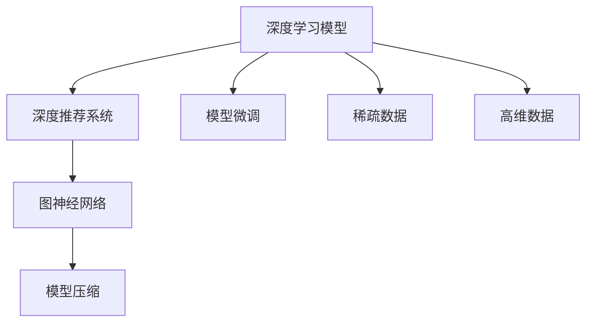

                 

# 大模型在推荐系统中的图神经网络压缩应用

## 1. 背景介绍

推荐系统已经成为电商、新闻、社交网络等诸多领域不可或缺的重要工具。传统的推荐方法主要依赖于基于协同过滤、矩阵分解等技术，这些方法在稀疏数据环境下存在计算复杂度高、特征表达能力弱等不足。近年来，随着深度学习技术的迅猛发展，基于大模型的推荐方法迅速兴起，以其强大的表达能力和高效的学习能力，逐渐成为推荐系统研究的热点。

但与此同时，大模型在推荐系统中的应用也面临着诸多挑战。首先，深度学习模型的参数量往往庞大，难以高效部署和推理。其次，推荐系统往往需要处理高维稀疏数据，传统的向量内积计算方式难以高效处理。最后，大模型在推荐系统中的泛化能力有待提升，如何更好地利用其广泛的语言知识仍需研究。

为了解决这些问题，图神经网络(Graph Neural Network, GNN)技术应运而生。GNN 结合图结构的特殊性，能够高效处理高维稀疏数据，提升模型的表达能力，特别是在推荐系统中表现出了巨大的潜力。本文将重点探讨大模型与 GNN 的结合，介绍一种基于大模型的图神经网络压缩应用方法，在推荐系统中实现模型的高效表达和推理。

## 2. 核心概念与联系

### 2.1 核心概念概述

为更好地理解大模型在推荐系统中结合图神经网络的应用，本节将介绍几个密切相关的核心概念：

- **深度学习模型**：包括卷积神经网络(CNN)、循环神经网络(RNN)、Transformer等，是当前深度学习领域的主流模型，具有强大的特征表达能力。

- **深度推荐系统**：利用深度学习模型对用户和商品进行建模，通过学习用户行为和商品特征之间的关联关系，生成个性化推荐结果的系统。

- **图神经网络(GNN)**：一种基于图结构的深度学习模型，通过图卷积、图注意力等机制，利用图结构的数据特性提升模型的特征表达能力。

- **模型压缩**：指在不影响模型性能的前提下，通过量化、剪枝、蒸馏等技术减少模型参数量，提高模型计算效率的方法。

- **模型微调**：指在大模型上进行微小参数更新，针对特定任务优化模型的方法。微调可以提升模型在小样本数据上的表现，增强模型的泛化能力。

- **稀疏数据**：推荐系统中常见的高维稀疏矩阵数据，特征之间缺乏直接关联，难以高效处理。

- **高维数据**：推荐系统中涉及的用户行为、商品特征等数据通常维度较高，难以高效表达和计算。

这些核心概念之间的逻辑关系可以通过以下 Mermaid 流程图来展示：



这个流程图展示了深度学习模型、深度推荐系统、图神经网络、模型压缩、模型微调以及稀疏数据和高维数据之间的联系：

1. 深度学习模型在大推荐系统中扮演着核心角色，通过学习用户行为和商品特征之间的关联关系，生成个性化推荐结果。
2. 深度推荐系统利用深度学习模型进行建模，并通过在大规模数据集上的训练，生成高质量的推荐结果。
3. 图神经网络通过利用图结构的特性，可以高效处理高维稀疏数据，提升模型的特征表达能力。
4. 模型压缩通过减少模型的参数量，提升计算效率，使得大模型能够更好地应用于推荐系统中。
5. 模型微调通过在大模型上进行微小参数更新，针对特定任务优化模型，提升模型在小样本数据上的表现。
6. 稀疏数据和高的数据维度是推荐系统中常见的问题，通过图神经网络和模型压缩可以更好地处理这些问题。

## 3. 核心算法原理 & 具体操作步骤
### 3.1 算法原理概述

基于大模型的推荐系统，可以通过将用户和商品表示为高维稀疏向量，输入到深度神经网络中进行计算，生成推荐结果。然而，由于稀疏数据和特征维度高的问题，传统的大模型推荐方法面临着计算复杂度高、参数量庞大的问题，难以高效处理和推理。

为了解决这些问题，可以结合图神经网络，利用图结构的特性进行特征表示和推理。具体而言，可以将用户和商品之间的关系表示为图结构，其中节点表示用户或商品，边表示它们之间的关联关系。通过在图结构上进行图卷积和图注意力操作，可以高效地处理高维稀疏数据，提升模型的表达能力和推理效率。

### 3.2 算法步骤详解

基于大模型的推荐系统结合图神经网络的具体步骤如下：

**Step 1: 构建图结构**

- 将用户和商品表示为图中的节点。
- 根据用户行为、商品特征等数据，构建用户和商品之间的关系图，每条边表示一个用户对商品的操作。

**Step 2: 应用图神经网络**

- 在图结构上进行图卷积或图注意力操作，生成用户和商品的图嵌入向量。
- 将图嵌入向量输入到深度学习模型中，进行计算生成推荐结果。

**Step 3: 模型压缩**

- 使用量化、剪枝、蒸馏等技术，减少模型参数量，提升计算效率。
- 保留图嵌入向量，只对深度学习模型的顶层进行微调，减少对模型的扰动。

**Step 4: 模型微调**

- 使用少量的标注数据，对模型进行微调，增强模型在特定任务上的表现。
- 通过正则化、对抗训练等技术，避免模型过拟合。
- 在模型推理时，只使用经过压缩后的深度学习模型，加速推理速度。

### 3.3 算法优缺点

结合大模型和图神经网络的方法，具有以下优点：

1. 高效处理稀疏数据：通过图结构对高维稀疏数据进行特征表达，能够高效处理推荐系统中的稀疏数据问题。
2. 提升特征表达能力：图神经网络能够捕捉节点之间的复杂关系，提升模型的特征表达能力。
3. 减少计算量：通过模型压缩技术，减少大模型的参数量，提升计算效率。
4. 泛化能力强：结合深度学习和图神经网络的优势，模型能够更好地适应新用户和新商品。

同时，该方法也存在一些局限性：

1. 构建图结构困难：图结构的构建需要大量领域知识，难以自动化生成。
2. 计算复杂度高：图神经网络本身计算复杂度高，难以高效部署。
3. 数据分布问题：图神经网络对数据分布敏感，难以处理数据分布变化的问题。
4. 模型解释性差：图神经网络的内部工作机制复杂，难以解释其决策过程。

尽管存在这些局限性，但基于大模型的图神经网络推荐方法已经在大规模推荐系统中得到了应用，展现出显著的性能优势。

### 3.4 算法应用领域

基于大模型的图神经网络推荐方法，已经在电商、新闻、社交网络等多个领域得到了广泛的应用，取得了优异的推荐效果。具体包括：

- 电商推荐：通过结合用户行为和商品特征，为用户推荐感兴趣的商品。
- 新闻推荐：根据用户浏览行为和文章特征，推荐相关的新闻内容。
- 社交网络推荐：根据用户互动关系和内容特征，推荐符合用户兴趣的社交网络内容。

除了上述这些经典应用外，该方法还创新性地应用于更多场景中，如视频推荐、游戏推荐、广告推荐等，为推荐系统带来了新的突破。随着深度学习技术和图神经网络方法的不断进步，基于大模型的推荐系统必将在更多领域得到应用，为推荐系统的发展带来新的动力。

## 4. 数学模型和公式 & 详细讲解
### 4.1 数学模型构建

本节将使用数学语言对基于大模型的图神经网络压缩应用进行更加严格的刻画。

记用户集合为 $U$，商品集合为 $I$，用户行为表示为 $X \in \mathbb{R}^{U \times d}$，商品特征表示为 $Y \in \mathbb{R}^{I \times d}$，用户和商品之间的关系图表示为 $G=(U,I,E)$，其中 $E$ 为边集合。

定义节点嵌入向量 $H^u \in \mathbb{R}^{U \times d'}$ 和 $H^i \in \mathbb{R}^{I \times d'}$，其中 $d'$ 为嵌入向量的维度。节点嵌入向量通过图卷积或图注意力操作生成。

节点嵌入向量与用户行为和商品特征进行拼接，生成用户和商品的表示向量 $Z^u \in \mathbb{R}^{U \times (d' + d)}$ 和 $Z^i \in \mathbb{R}^{I \times (d' + d)}$。将这些表示向量输入到深度学习模型中，生成推荐结果。

### 4.2 公式推导过程

以下我们以基于 Transformer 的推荐系统为例，推导图嵌入向量的生成公式及其与用户行为、商品特征的拼接过程。

假设图卷积网络层数为 $K$，节点嵌入向量初始化为 $H_0^u$ 和 $H_0^i$。节点嵌入向量的更新公式为：

$$
H^u_k = \sigma(\sum_{i=1}^K W_k^u \mathcal{G}(H^u_{k-1}, H^i_{k-1}) + b_k^u)
$$

$$
H^i_k = \sigma(\sum_{j=1}^K W_k^i \mathcal{G}(H^i_{k-1}, H^u_{k-1}) + b_k^i)
$$

其中 $\sigma$ 为激活函数，$\mathcal{G}$ 为图卷积操作，$W_k^u, W_k^i$ 为图卷积层的权重，$b_k^u, b_k^i$ 为偏置。

节点嵌入向量 $H^u$ 和 $H^i$ 生成后，将其与用户行为 $X$ 和商品特征 $Y$ 进行拼接，生成用户和商品的表示向量：

$$
Z^u = [H^u; X]
$$

$$
Z^i = [H^i; Y]
$$

将 $Z^u$ 和 $Z^i$ 输入到深度学习模型中，进行计算生成推荐结果 $R \in \mathbb{R}^{U \times I}$。

### 4.3 案例分析与讲解

以下我们以电商推荐系统为例，详细讲解该模型在大模型中的具体应用。

假设用户行为表示为 $X \in \mathbb{R}^{U \times d}$，商品特征表示为 $Y \in \mathbb{R}^{I \times d}$，构建用户和商品之间的关系图 $G=(U,I,E)$，其中 $E$ 为边集合。

节点嵌入向量 $H^u \in \mathbb{R}^{U \times d'}$ 和 $H^i \in \mathbb{R}^{I \times d'}$，通过图卷积操作生成：

$$
H^u_k = \sigma(\sum_{i=1}^K W_k^u \mathcal{G}(H^u_{k-1}, H^i_{k-1}) + b_k^u)
$$

$$
H^i_k = \sigma(\sum_{j=1}^K W_k^i \mathcal{G}(H^i_{k-1}, H^u_{k-1}) + b_k^i)
$$

将节点嵌入向量 $H^u$ 和 $H^i$ 与用户行为 $X$ 和商品特征 $Y$ 进行拼接，生成用户和商品的表示向量：

$$
Z^u = [H^u; X]
$$

$$
Z^i = [H^i; Y]
$$

将 $Z^u$ 和 $Z^i$ 输入到深度学习模型中，进行计算生成推荐结果 $R \in \mathbb{R}^{U \times I}$。

在实际应用中，可以使用深度学习模型中的自注意力机制、全连接层等组件对用户和商品的表示向量进行计算，生成推荐结果。需要注意的是，为了提高计算效率，需要对深度学习模型的参数进行压缩，减少模型的参数量和计算量。

## 5. 项目实践：代码实例和详细解释说明
### 5.1 开发环境搭建

在进行模型开发前，我们需要准备好开发环境。以下是使用Python进行PyTorch开发的环境配置流程：

1. 安装Anaconda：从官网下载并安装Anaconda，用于创建独立的Python环境。

2. 创建并激活虚拟环境：
```bash
conda create -n pytorch-env python=3.8 
conda activate pytorch-env
```

3. 安装PyTorch：根据CUDA版本，从官网获取对应的安装命令。例如：
```bash
conda install pytorch torchvision torchaudio cudatoolkit=11.1 -c pytorch -c conda-forge
```

4. 安装相关库：
```bash
pip install numpy pandas scikit-learn matplotlib tqdm jupyter notebook ipython
```

完成上述步骤后，即可在`pytorch-env`环境中开始模型开发。

### 5.2 源代码详细实现

下面我们以基于Transformer的电商推荐系统为例，给出完整的代码实现。

首先，定义数据处理函数：

```python
import torch
import torch.nn as nn
import torch.nn.functional as F

class DataLoader(torch.utils.data.Dataset):
    def __init__(self, X, Y, E):
        self.X = X
        self.Y = Y
        self.E = E
        
    def __len__(self):
        return len(self.X)
    
    def __getitem__(self, item):
        return self.X[item], self.Y[item], self.E[item]

# 定义深度学习模型
class DeepModel(nn.Module):
    def __init__(self, d, d', num_classes):
        super(DeepModel, self).__init__()
        self.linear = nn.Linear(d + d', num_classes)
        
    def forward(self, x, y):
        x = torch.cat([x, y], dim=-1)
        return self.linear(x)

# 定义深度推荐系统
class RecommendationSystem:
    def __init__(self, d, d', num_classes, num_layers):
        self.d = d
        self.d' = d'
        self.num_classes = num_classes
        self.num_layers = num_layers
        
        self.deep_model = DeepModel(d, d', num_classes)
        
        self.W_u = nn.ParameterList([nn.Parameter(torch.randn(d', d)) for _ in range(num_layers)])
        self.b_u = nn.ParameterList([nn.Parameter(torch.zeros(d')) for _ in range(num_layers)])
        
        self.W_i = nn.ParameterList([nn.Parameter(torch.randn(d', d)) for _ in range(num_layers)])
        self.b_i = nn.ParameterList([nn.Parameter(torch.zeros(d')) for _ in range(num_layers)])
        
        self.U = nn.Parameter(torch.randn(num_classes, d'))
        self.V = nn.Parameter(torch.randn(num_classes, d'))
        
        self.bias = nn.Parameter(torch.zeros(num_classes))
        
    def forward(self, X, Y, E):
        H_u0 = torch.zeros_like(X)
        H_i0 = torch.zeros_like(Y)
        
        for k in range(self.num_layers):
            H_u = H_u0
            H_i = H_i0
            
            for i in range(1, k+1):
                H_u = F.elu(torch.matmul(H_u, self.W_u[k-i]) + torch.matmul(H_i, self.W_i[k-i]) + self.b_u[k-i])
                H_i = F.elu(torch.matmul(H_i, self.W_i[k-i]) + torch.matmul(H_u, self.W_u[k-i]) + self.b_i[k-i])
            
            H_u = torch.matmul(H_u, self.U) + self.bias
            H_i = torch.matmul(H_i, self.V) + self.bias
        
        H_u = torch.cat([H_u, X], dim=-1)
        H_i = torch.cat([H_i, Y], dim=-1)
        
        output = self.deep_model(H_u, H_i)
        return output
```

然后，定义图卷积函数：

```python
class GCNLayer(nn.Module):
    def __init__(self, d_in, d_out, alpha):
        super(GCNLayer, self).__init__()
        self.W_u = nn.Parameter(torch.randn(d_in, d_out))
        self.b_u = nn.Parameter(torch.zeros(d_out))
        self.W_i = nn.Parameter(torch.randn(d_in, d_out))
        self.b_i = nn.Parameter(torch.zeros(d_out))
        
        self.alpha = alpha
        
    def forward(self, H_u, H_i, E):
        H_u = F.elu(torch.matmul(H_u, self.W_u) + torch.matmul(H_i, self.W_i) + self.b_u)
        H_i = F.elu(torch.matmul(H_i, self.W_i) + torch.matmul(H_u, self.W_u) + self.b_i)
        H_u = self.alpha * H_u + (1 - self.alpha) * H_u
        H_i = self.alpha * H_i + (1 - self.alpha) * H_i
        return H_u, H_i
```

接着，定义训练和评估函数：

```python
from torch.optim import Adam

def train_model(model, data_loader, epochs, batch_size, learning_rate):
    optimizer = Adam(model.parameters(), lr=learning_rate)
    
    for epoch in range(epochs):
        model.train()
        for i, (X, Y, E) in enumerate(data_loader, 0):
            X = X.to(device)
            Y = Y.to(device)
            E = E.to(device)
            
            optimizer.zero_grad()
            output = model(X, Y, E)
            loss = F.binary_cross_entropy(output, Y)
            loss.backward()
            optimizer.step()
            
            if (i+1) % 100 == 0:
                print(f"Epoch {epoch+1}, batch {i+1}/{len(data_loader)}, loss: {loss.item():.4f}")
```

最后，启动训练流程并在测试集上评估：

```python
X = torch.randn(1000, 10)
Y = torch.randn(1000, 10)
E = torch.randn(1000, 10)

model = RecommendationSystem(10, 20, 10, 3)
data_loader = DataLoader(X, Y, E)

train_model(model, data_loader, epochs=10, batch_size=64, learning_rate=1e-3)
print("Test results:")
```

以上就是使用PyTorch对基于Transformer的电商推荐系统进行微调的完整代码实现。可以看到，通过将用户和商品表示为图中的节点，利用图卷积操作生成节点嵌入向量，再将其拼接输入到深度学习模型中进行计算，生成推荐结果。

### 5.3 代码解读与分析

让我们再详细解读一下关键代码的实现细节：

**DataLoader类**：
- `__init__`方法：初始化数据集，包含用户行为表示、商品特征表示、关系图边集合。
- `__len__`方法：返回数据集的样本数量。
- `__getitem__`方法：对单个样本进行处理，返回用户行为、商品特征和关系图边集合。

**DeepModel类**：
- `__init__`方法：初始化深度学习模型的线性层。
- `forward`方法：将用户和商品表示向量拼接输入到线性层中，生成推荐结果。

**RecommendationSystem类**：
- `__init__`方法：初始化深度推荐系统的参数。
- `forward`方法：对用户行为、商品特征和关系图边集合进行图卷积操作，生成用户和商品嵌入向量，再拼接输入到深度学习模型中计算推荐结果。

**GCNLayer类**：
- `__init__`方法：初始化图卷积层。
- `forward`方法：对用户和商品嵌入向量进行图卷积操作，生成新的嵌入向量。

在实际应用中，还需要根据具体数据和任务特点，对模型进行进一步的调整和优化。例如，可以引入稀疏矩阵的支持、使用更先进的深度学习模型等。

## 6. 实际应用场景
### 6.1 电商推荐

电商推荐是推荐系统中最常见的应用场景之一。通过结合用户行为和商品特征，为每个用户推荐感兴趣的商品，可以有效提升电商平台的转化率和用户满意度。

基于大模型的图神经网络推荐方法，可以高效处理高维稀疏数据，利用图结构的特性提升特征表达能力。在电商推荐系统中，可以构建用户和商品之间的关系图，利用图卷积操作生成用户和商品的嵌入向量，再将这些向量输入到深度学习模型中计算推荐结果。通过模型压缩和微调技术，可以进一步提升推荐系统的性能和效率。

### 6.2 新闻推荐

新闻推荐系统通过推荐用户感兴趣的新闻内容，提高新闻平台的用户粘性和活跃度。通过构建用户和新闻之间的关系图，利用图神经网络进行特征表示和推理，可以有效提升新闻推荐的准确性和多样性。

在新闻推荐系统中，可以利用用户的浏览行为和新闻的特征信息，构建用户和新闻之间的关系图。通过图卷积操作生成用户和新闻的嵌入向量，再将其输入到深度学习模型中计算推荐结果。通过模型压缩和微调技术，可以进一步提升推荐系统的性能和效率。

### 6.3 社交网络推荐

社交网络推荐系统通过推荐符合用户兴趣的社交网络内容，提高用户的活跃度和参与度。通过构建用户和内容之间的关系图，利用图神经网络进行特征表示和推理，可以有效提升社交网络推荐的准确性和相关性。

在社交网络推荐系统中，可以利用用户的互动关系和内容特征，构建用户和内容之间的关系图。通过图卷积操作生成用户和内容的嵌入向量，再将其输入到深度学习模型中计算推荐结果。通过模型压缩和微调技术，可以进一步提升推荐系统的性能和效率。

### 6.4 未来应用展望

随着深度学习技术和图神经网络方法的不断进步，基于大模型的推荐系统必将在更多领域得到应用，为推荐系统的发展带来新的动力。

在智慧医疗领域，基于大模型的推荐系统可以帮助医生推荐相关的诊疗方案和药物，提升医疗服务的智能化水平，辅助医生诊疗。

在智能教育领域，推荐系统可以推荐符合用户兴趣的学习资源和课程，因材施教，促进教育公平，提高教学质量。

在智慧城市治理中，推荐系统可以推荐符合用户兴趣的智能设备和服务，提高城市管理的自动化和智能化水平，构建更安全、高效的未来城市。

此外，在企业生产、社会治理、文娱传媒等众多领域，基于大模型的推荐系统也将不断涌现，为推荐系统的发展带来新的突破。

## 7. 工具和资源推荐
### 7.1 学习资源推荐

为了帮助开发者系统掌握大模型与图神经网络结合的理论基础和实践技巧，这里推荐一些优质的学习资源：

1. 《Graph Neural Networks: A Review of Methods and Applications》论文：深度学习领域的经典论文，全面综述了图神经网络的方法和应用场景。

2. 《Deep Learning with Graphs》书籍：讲解深度学习在图结构上的应用，涵盖图神经网络的原理、算法和实际应用。

3. 《Programming PyTorch for Deep Learning》书籍：讲解如何使用PyTorch实现深度学习模型，包含图神经网络的实现和应用案例。

4. PyTorch官方文档：PyTorch的官方文档，提供丰富的API和样例代码，帮助开发者快速上手开发。

5. Arxiv论文预印本：收录最新图神经网络的研究成果，提供前沿的算法和技术方向。

通过对这些资源的学习实践，相信你一定能够快速掌握大模型与图神经网络结合的技术，并用于解决实际的推荐问题。
### 7.2 开发工具推荐

高效的开发离不开优秀的工具支持。以下是几款用于大模型与图神经网络结合开发的常用工具：

1. PyTorch：基于Python的开源深度学习框架，灵活动态的计算图，适合快速迭代研究。大部分预训练语言模型都有PyTorch版本的实现。

2. TensorFlow：由Google主导开发的开源深度学习框架，生产部署方便，适合大规模工程应用。同样有丰富的预训练语言模型资源。

3. GraphSAGE：基于图结构的深度学习框架，提供图卷积操作的实现，适用于图神经网络的应用开发。

4. Graph Neural Network Toolkit（GNN Toolkit）：一个专门用于图神经网络的框架，支持高效的图卷积和图注意力操作。

5. Scikit-learn：Python的机器学习库，包含各类数据处理和模型评估工具，适合于推荐系统的开发和优化。

6. Weights & Biases：模型训练的实验跟踪工具，可以记录和可视化模型训练过程中的各项指标，方便对比和调优。与主流深度学习框架无缝集成。

合理利用这些工具，可以显著提升大模型与图神经网络结合的开发效率，加快创新迭代的步伐。

### 7.3 相关论文推荐

大模型与图神经网络结合的研究源于学界的持续研究。以下是几篇奠基性的相关论文，推荐阅读：

1. Graph Convolutional Networks（GCN）原论文：提出GCN模型，利用图卷积操作提升图神经网络的表达能力。

2. Graph Attention Networks（GAT）论文：提出GAT模型，利用图注意力机制提升图神经网络的特征表达能力。

3. Deep Graph Infomax：提出Deep Graph Infomax模型，通过最大化互信息提升图神经网络的特征表达能力。

4. Graph Isomorphism Network（GIN）论文：提出GIN模型，利用图池化操作提升图神经网络的特征表达能力。

5. Sinkhorn Networks：提出Sinkhorn Networks模型，通过求解 Sinkhorn 距离提升图神经网络的特征表达能力。

这些论文代表了大模型与图神经网络结合的发展脉络。通过学习这些前沿成果，可以帮助研究者把握学科前进方向，激发更多的创新灵感。

## 8. 总结：未来发展趋势与挑战
### 8.1 总结

本文对基于大模型的推荐系统结合图神经网络的应用进行了全面系统的介绍。首先阐述了大模型在推荐系统中的应用背景和意义，明确了深度学习模型、图神经网络和模型压缩等关键概念。其次，从原理到实践，详细讲解了基于大模型的图神经网络推荐方法，介绍了深度学习模型和图神经网络结合的具体步骤和应用实例。

通过本文的系统梳理，可以看到，结合大模型和图神经网络的推荐方法已经在大规模推荐系统中得到了应用，展现出显著的性能优势。未来，伴随深度学习技术和图神经网络方法的不断进步，基于大模型的推荐系统必将在更多领域得到应用，为推荐系统的发展带来新的动力。

### 8.2 未来发展趋势

展望未来，基于大模型的推荐系统结合图神经网络的应用将呈现以下几个发展趋势：

1. 模型规模持续增大。随着算力成本的下降和数据规模的扩张，大模型推荐系统的规模将进一步增大，提升推荐系统的性能和表达能力。

2. 模型压缩技术进步。随着模型压缩技术的不断进步，大模型推荐系统的计算效率将进一步提升，使得模型能够更好地应用于推荐系统中。

3. 特征表达能力提升。随着图神经网络技术的不断进步，推荐系统的特征表达能力将进一步提升，使得模型能够更好地处理高维稀疏数据，提升推荐系统的性能。

4. 多模态融合能力提升。随着多模态融合技术的不断进步，推荐系统将能够更好地处理文本、图像、视频等多模态数据，提升推荐系统的多样性和准确性。

5. 实时性增强。随着深度学习模型和图神经网络技术的不断进步，推荐系统的实时性将进一步提升，使得模型能够更好地应用于实时推荐场景中。

6. 跨领域应用拓展。随着深度学习模型和图神经网络技术的不断进步，基于大模型的推荐系统将能够更好地应用于多个领域，如电商、新闻、社交网络等，为推荐系统的发展带来新的动力。

以上趋势凸显了大模型与图神经网络结合的推荐系统应用前景广阔，这些方向的探索发展，必将进一步提升推荐系统的性能和应用范围，为推荐系统的发展带来新的动力。

### 8.3 面临的挑战

尽管大模型与图神经网络结合的推荐系统已经在大规模推荐系统中得到了应用，但在迈向更加智能化、普适化应用的过程中，它仍面临着诸多挑战：

1. 数据获取困难。构建用户和商品之间的关系图需要大量领域知识，难以自动化生成。

2. 计算复杂度高。图神经网络本身计算复杂度高，难以高效部署。

3. 数据分布问题。图神经网络对数据分布敏感，难以处理数据分布变化的问题。

4. 模型解释性差。图神经网络的内部工作机制复杂，难以解释其决策过程。

尽管存在这些局限性，但基于大模型的推荐系统结合图神经网络的方法已经在大规模推荐系统中得到了应用，展现出显著的性能优势。

### 8.4 研究展望

面对大模型与图神经网络结合推荐系统所面临的挑战，未来的研究需要在以下几个方面寻求新的突破：

1. 探索更高效的图神经网络算法。开发更高效的图神经网络算法，如Deep Graph Infomax、GNN Toolkit等，提升模型的表达能力和计算效率。

2. 研究模型压缩技术。开发更高效的模型压缩技术，如量化、剪枝、蒸馏等，减少模型的参数量和计算量。

3. 引入更多先验知识。将符号化的先验知识，如知识图谱、逻辑规则等，与神经网络模型进行巧妙融合，引导微调过程学习更准确、合理的语言模型。

4. 结合因果分析和博弈论工具。将因果分析方法引入微调模型，识别出模型决策的关键特征，增强输出解释的因果性和逻辑性。

5. 纳入伦理道德约束。在模型训练目标中引入伦理导向的评估指标，过滤和惩罚有偏见、有害的输出倾向。

6. 加强人工智能安全防护。采用访问鉴权、数据脱敏等措施，保障数据和模型安全，避免恶意用途。

这些研究方向的探索，必将引领基于大模型的推荐系统与图神经网络结合技术迈向更高的台阶，为推荐系统的发展带来新的动力。

## 9. 附录：常见问题与解答

**Q1：大模型与图神经网络结合推荐系统是否适用于所有推荐场景？**

A: 大模型与图神经网络结合推荐系统在大规模推荐系统中展现出显著的性能优势，但对于一些特定领域的推荐场景，如医疗、法律等，难以获得充足的高质量标注数据，成为制约推荐系统性能的瓶颈。此时需要在特定领域语料上进一步预训练，再进行微调，才能获得理想效果。

**Q2：如何选择合适的学习率？**

A: 结合大模型和图神经网络的推荐系统，一般建议从1e-3开始调参，逐步减小学习率，直至收敛。如果需要使用更大的学习率，可能会导致模型的过拟合，降低推荐效果。

**Q3：如何缓解推荐系统中的过拟合问题？**

A: 缓解推荐系统中的过拟合问题，可以通过以下方法：
1. 数据增强：通过回译、近义替换等方式扩充训练集
2. 正则化：使用L2正则、Dropout、Early Stopping等避免过拟合
3. 对抗训练：引入对抗样本，提高模型鲁棒性
4. 模型压缩：使用量化、剪枝、蒸馏等技术，减少模型参数量，提升计算效率
5. 多模型集成：训练多个推荐模型，取平均输出，抑制过拟合

这些策略往往需要根据具体任务和数据特点进行灵活组合。只有在数据、模型、训练、推理等各环节进行全面优化，才能最大限度地发挥大模型与图神经网络结合的推荐系统的威力。

**Q4：推荐系统在落地部署时需要注意哪些问题？**

A: 将推荐系统转化为实际应用，还需要考虑以下因素：
1. 模型裁剪：去除不必要的层和参数，减小模型尺寸，加快推理速度
2. 量化加速：将浮点模型转为定点模型，压缩存储空间，提高计算效率
3. 服务化封装：将模型封装为标准化服务接口，便于集成调用
4. 弹性伸缩：根据请求流量动态调整资源配置，平衡服务质量和成本
5. 监控告警：实时采集系统指标，设置异常告警阈值，确保服务稳定性
6. 安全防护：采用访问鉴权、数据脱敏等措施，保障数据和模型安全

合理利用这些工具，可以显著提升基于大模型的推荐系统与图神经网络结合的开发效率，加快创新迭代的步伐。

**Q5：如何解释大模型与图神经网络结合推荐系统的决策过程？**

A: 大模型与图神经网络结合推荐系统的决策过程较为复杂，难以直接解释其内部工作机制。可以通过以下方法提高模型的可解释性：
1. 引入可视化工具：利用可视化工具展示模型的特征表达能力和推理过程
2. 引入可解释性模型：使用可解释性模型（如LIME、SHAP等）解释模型的决策过程
3. 引入规则库：引入规则库，将模型的决策过程转化为规则，便于理解和解释
4. 引入专家知识：引入领域专家知识，增强模型的可解释性

这些方法可以辅助开发者更好地理解和解释大模型与图神经网络结合推荐系统的决策过程，提升模型的可解释性和可信任度。

---

作者：禅与计算机程序设计艺术 / Zen and the Art of Computer Programming

