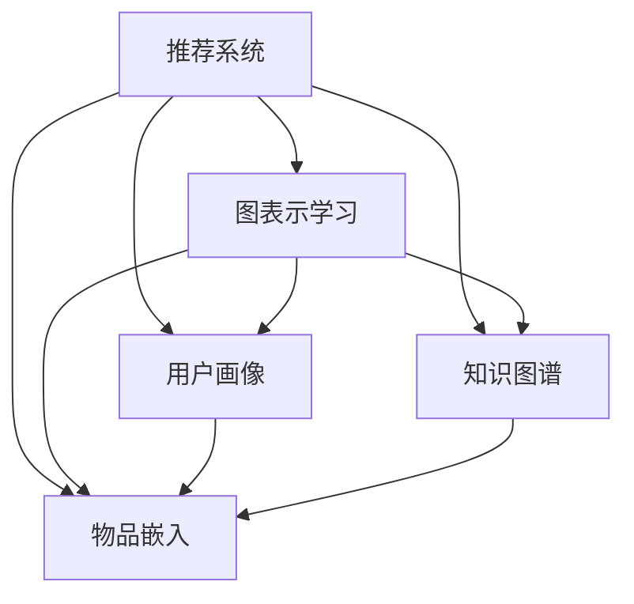

                 

# 大模型在推荐系统中的图表示学习应用

> 关键词：大模型,推荐系统,图表示学习,深度学习,知识图谱,用户画像,物品嵌入

## 1. 背景介绍

### 1.1 问题由来

推荐系统是互联网公司重要的核心功能之一，旨在为用户推荐其感兴趣的商品、内容、服务等，从而提升用户满意度，增加公司的市场竞争力。传统的推荐算法多基于用户的历史行为数据、物品属性等静态特征进行推荐，忽略了用户和物品之间的动态关系和潜在关系。近年来，随着深度学习和大规模数据的发展，基于图表示学习的推荐系统逐渐成为研究热点。

图表示学习，是指利用图神经网络(Graph Neural Networks, GNNs)等模型，从图结构数据中挖掘用户和物品之间的潜在关系，学习到更为丰富的用户画像和物品表示，从而提升推荐系统的精度和泛化能力。大模型（如BERT、GPT、GNNs等）在文本和图结构数据上的强建模能力，使其成为图表示学习领域的重要工具。本文将详细介绍大模型在推荐系统中的应用，并给出相应的理论推导和实际代码实现。

## 2. 核心概念与联系

### 2.1 核心概念概述

为了更好地理解大模型在推荐系统中的应用，本节将介绍几个密切相关的核心概念：

- 推荐系统：推荐系统是智能信息服务的一种方式，通过分析用户行为和物品属性等特征，为用户提供个性化的信息和服务推荐。
- 图表示学习：图表示学习是从图结构数据中挖掘用户和物品之间的关系，学习其表示并用于预测推荐结果的技术。
- 大模型：以自回归（如GPT）或自编码（如BERT、GraphSAGE）为代表的大规模预训练模型，通过在海量数据上自监督学习，获得强大的特征提取能力。
- 知识图谱：以图结构形式组织的知识库，存储实体及其关系，用于指导推荐系统推荐结果的质量。
- 用户画像：通过分析用户历史行为数据，学习用户的兴趣偏好和行为模式，生成用户特征向量。
- 物品嵌入：通过图表示学习技术，将物品转换为低维向量表示，捕捉其语义和结构特征。
- 神经网络：基于多层神经元网络结构，通过学习特征来预测结果的技术，广泛应用于各类深度学习任务。

这些核心概念之间的逻辑关系可以通过以下Mermaid流程图来展示：



这个流程图展示了推荐系统的主要组成及其与图表示学习的联系：

1. 推荐系统由用户画像、知识图谱和物品嵌入等模块构成。
2. 图表示学习从用户画像和知识图谱中挖掘用户和物品的潜在关系，学习生成高质量的表示。
3. 用户画像和物品嵌入通过图表示学习得到优化，用于提升推荐系统的效果。

## 3. 核心算法原理 & 具体操作步骤
### 3.1 算法原理概述

在大模型在推荐系统中的应用中，图表示学习主要基于以下步骤：

1. **构建知识图谱**：从用户行为数据中构建用户-物品关联图，以及用户-用户、物品-物品的社交和交易网络。
2. **用户画像建模**：从知识图谱和用户行为数据中学习用户画像，生成用户的兴趣向量。
3. **物品嵌入表示**：从知识图谱和物品属性数据中学习物品嵌入，生成物品的特征向量。
4. **图神经网络模型**：结合用户画像和物品嵌入，通过图神经网络模型进行推荐预测。
5. **训练与优化**：使用推荐系统的实际数据进行训练和优化，提升模型的预测准确率。

### 3.2 算法步骤详解

#### 3.2.1 知识图谱构建

知识图谱是推荐系统的基础，其构建包括：

1. **用户-物品关联图**：通过用户的历史行为数据，提取用户与物品之间的互动关系，生成用户-物品的关联图。
2. **用户-用户关系图**：从社交网络数据中提取用户间的社交关系，生成用户-用户关系图。
3. **物品-物品关系图**：从物品间的交易、评分等关系中，提取物品间的关联关系，生成物品-物品关系图。

这些图的构建可以利用传统的数据挖掘技术和图算法，如PageRank、GAT、GCN等，生成用户-物品、用户-用户和物品-物品的图结构。

#### 3.2.2 用户画像建模

用户画像的构建主要通过以下步骤：

1. **用户-物品关联特征提取**：对用户-物品关联图中的用户和物品节点进行特征提取，生成用户和物品的特征向量。
2. **图神经网络训练**：利用图神经网络（如GraphSAGE、GAT等）对用户画像进行训练，学习用户兴趣向量。

#### 3.2.3 物品嵌入表示

物品嵌入的表示主要通过以下步骤：

1. **物品属性特征提取**：从物品的属性数据中提取特征向量，生成物品的特征向量。
2. **图神经网络训练**：利用图神经网络对物品嵌入进行训练，学习物品的特征向量。

#### 3.2.4 图神经网络模型

图神经网络模型主要通过以下步骤：

1. **用户-物品图嵌入计算**：使用图神经网络对用户画像和物品嵌入进行融合，生成用户-物品的联合表示。
2. **用户-物品推荐预测**：通过用户画像和物品嵌入的联合表示，进行推荐预测。

#### 3.2.5 训练与优化

训练与优化主要通过以下步骤：

1. **损失函数设计**：设计合适的损失函数，如交叉熵、均方误差等，用于衡量预测结果与实际标签的差异。
2. **优化器选择**：选择合适的优化器，如Adam、SGD等，用于更新模型参数。
3. **超参数调整**：调整学习率、批大小、迭代次数等超参数，优化模型性能。

### 3.3 算法优缺点

大模型在推荐系统中的应用，具有以下优点：

1. **强大的建模能力**：大模型在文本和图结构数据上具备强大的建模能力，能够学习到复杂的用户和物品关系。
2. **高效的特征提取**：利用预训练技术，大模型能够在较少的训练数据上实现高效特征提取，提升推荐系统的效果。
3. **泛化能力强大**：大模型具备强大的泛化能力，能够在不同领域和场景中取得优异效果。
4. **灵活性高**：大模型能够灵活应对不同类型的推荐任务，包括商品推荐、内容推荐、服务推荐等。

同时，大模型在推荐系统中的应用也存在以下缺点：

1. **计算资源需求高**：大模型需要大量的计算资源进行训练和推理，对硬件设备要求较高。
2. **数据需求量大**：大模型通常需要海量数据进行预训练，数据获取成本较高。
3. **模型复杂度高**：大模型的复杂度较高，训练和推理效率较低。
4. **解释性不足**：大模型的预测过程和决策逻辑难以解释，影响模型可信度。

尽管存在这些局限性，但就目前而言，大模型在推荐系统中的应用已展现出其强大的潜力，成为推荐领域的重要研究范式。

### 3.4 算法应用领域

大模型在推荐系统中的应用已经涵盖了各类推荐任务，如商品推荐、内容推荐、服务推荐等。在实际应用中，基于大模型的推荐系统已经被广泛应用于电商、社交媒体、视频平台等多个领域，取得了显著效果。

具体而言，大模型在推荐系统中的应用包括以下几个方面：

1. **电商推荐**：在电商平台中，利用大模型进行用户画像建模和物品嵌入表示，结合用户历史行为数据和物品属性，生成推荐结果。
2. **社交媒体推荐**：在社交媒体平台中，利用大模型进行用户画像建模和物品嵌入表示，结合用户社交关系和兴趣偏好，生成内容推荐结果。
3. **视频平台推荐**：在视频平台中，利用大模型进行用户画像建模和物品嵌入表示，结合用户历史观看记录和视频属性，生成视频推荐结果。
4. **服务推荐**：在各类服务推荐场景中，利用大模型进行用户画像建模和物品嵌入表示，结合用户服务请求和提供的服务属性，生成服务推荐结果。

除了以上应用，大模型还在其他领域得到了广泛应用，如金融推荐、医疗推荐、旅游推荐等，展示了其在推荐系统中的强大应用潜力。

## 4. 数学模型和公式 & 详细讲解 & 举例说明

### 4.1 数学模型构建

基于大模型的推荐系统，通常可以抽象为以下数学模型：

假设用户-物品关联图为 $G=(U,V,E)$，其中 $U$ 为用户节点集合，$V$ 为物品节点集合，$E$ 为边集合。每个节点 $u_i$ 和 $v_j$ 分别表示用户和物品，对应一个 $d$ 维的特征向量。用户画像向量为 $\mathbf{u}$，物品嵌入向量为 $\mathbf{v}$。

用户画像建模的目标是学习用户兴趣向量 $\mathbf{u}$，物品嵌入建模的目标是学习物品嵌入向量 $\mathbf{v}$。图神经网络模型的目标是结合用户画像和物品嵌入，进行推荐预测。

### 4.2 公式推导过程

#### 4.2.1 用户画像建模

用户画像建模主要通过图神经网络（如GraphSAGE）进行。假设用户节点为 $u_i$，物品节点为 $v_j$，节点之间的边为 $e_{i,j}$，表示用户 $u_i$ 与物品 $v_j$ 之间的互动关系。

用户画像建模的目标是学习用户兴趣向量 $\mathbf{u}$，其公式为：

$$
\mathbf{u} = \sum_{j=1}^{N_v} \alpha_{i,j} \mathbf{v}_j + \mathbf{g}_i
$$

其中 $\alpha_{i,j}$ 为边权重，表示用户与物品之间的互动关系强度。$\mathbf{g}_i$ 为用户特征向量，包括用户的其他属性信息。

#### 4.2.2 物品嵌入表示

物品嵌入表示主要通过图神经网络（如GraphSAGE）进行。假设物品节点为 $v_j$，用户节点为 $u_i$，节点之间的边为 $e_{i,j}$，表示用户与物品之间的互动关系。

物品嵌入建模的目标是学习物品嵌入向量 $\mathbf{v}$，其公式为：

$$
\mathbf{v} = \sum_{i=1}^{N_u} \beta_{j,i} \mathbf{u}_i + \mathbf{h}_j
$$

其中 $\beta_{j,i}$ 为边权重，表示物品与用户之间的互动关系强度。$\mathbf{h}_j$ 为物品特征向量，包括物品的其他属性信息。

#### 4.2.3 图神经网络模型

图神经网络模型主要通过融合用户画像和物品嵌入，进行推荐预测。假设用户画像向量为 $\mathbf{u}$，物品嵌入向量为 $\mathbf{v}$，其结合后的向量为 $\mathbf{z}$。

推荐预测的目标是生成用户对物品的评分 $\hat{y}_{i,j}$，其公式为：

$$
\hat{y}_{i,j} = \sigma(\mathbf{u}^T \mathbf{W}_y \mathbf{z})
$$

其中 $\sigma$ 为激活函数，$\mathbf{W}_y$ 为输出层权重矩阵。

### 4.3 案例分析与讲解

以电商推荐为例，介绍大模型在推荐系统中的应用。

假设电商平台有 $N_u$ 个用户和 $N_v$ 个物品，用户 $u_i$ 与物品 $v_j$ 之间的互动关系强度为 $\alpha_{i,j}$。用户画像向量 $\mathbf{u}_i$ 包括用户的历史行为数据和其他属性信息，物品嵌入向量 $\mathbf{v}_j$ 包括物品的属性数据和其他特征信息。

在用户画像建模中，通过图神经网络计算得到用户兴趣向量 $\mathbf{u}$，其公式为：

$$
\mathbf{u} = \sum_{j=1}^{N_v} \alpha_{i,j} \mathbf{v}_j + \mathbf{g}_i
$$

其中 $\alpha_{i,j}$ 为边权重，表示用户与物品之间的互动关系强度。$\mathbf{g}_i$ 为用户特征向量，包括用户的其他属性信息。

在物品嵌入表示中，通过图神经网络计算得到物品嵌入向量 $\mathbf{v}$，其公式为：

$$
\mathbf{v} = \sum_{i=1}^{N_u} \beta_{j,i} \mathbf{u}_i + \mathbf{h}_j
$$

其中 $\beta_{j,i}$ 为边权重，表示物品与用户之间的互动关系强度。$\mathbf{h}_j$ 为物品特征向量，包括物品的其他属性信息。

在图神经网络模型中，通过融合用户画像和物品嵌入，进行推荐预测。推荐预测的目标是生成用户对物品的评分 $\hat{y}_{i,j}$，其公式为：

$$
\hat{y}_{i,j} = \sigma(\mathbf{u}^T \mathbf{W}_y \mathbf{z})
$$

其中 $\sigma$ 为激活函数，$\mathbf{W}_y$ 为输出层权重矩阵。

## 5. 项目实践：代码实例和详细解释说明

### 5.1 开发环境搭建

在进行大模型在推荐系统中的应用实践前，我们需要准备好开发环境。以下是使用Python进行PyTorch开发的环境配置流程：

1. 安装Anaconda：从官网下载并安装Anaconda，用于创建独立的Python环境。

2. 创建并激活虚拟环境：
```bash
conda create -n pytorch-env python=3.8 
conda activate pytorch-env
```

3. 安装PyTorch：根据CUDA版本，从官网获取对应的安装命令。例如：
```bash
conda install pytorch torchvision torchaudio cudatoolkit=11.1 -c pytorch -c conda-forge
```

4. 安装Transformers库：
```bash
pip install transformers
```

5. 安装各类工具包：
```bash
pip install numpy pandas scikit-learn matplotlib tqdm jupyter notebook ipython
```

完成上述步骤后，即可在`pytorch-env`环境中开始项目实践。

### 5.2 源代码详细实现

下面以电商推荐为例，给出使用PyTorch和Transformers库进行推荐系统开发的PyTorch代码实现。

首先，定义推荐系统的相关数据结构：

```python
import torch
from torch import nn
from torch.nn import functional as F
from transformers import GraphSAGE, BertTokenizer

class Graph(nn.Module):
    def __init__(self, in_dim, hidden_dim, out_dim):
        super(Graph, self).__init__()
        self.embedding = nn.Embedding(in_dim, hidden_dim)
        self.sage = GraphSAGE(hidden_dim, hidden_dim, aggr='mean')
        self.fc = nn.Linear(hidden_dim, out_dim)

    def forward(self, x, adj):
        x = self.embedding(x)
        x = self.sage(x, adj)
        x = self.fc(x)
        return x

class BertEmbedding(nn.Module):
    def __init__(self, in_dim, hidden_dim, out_dim):
        super(BertEmbedding, self).__init__()
        self.bert = BertTokenizer.from_pretrained('bert-base-uncased')
        self.linear = nn.Linear(hidden_dim, out_dim)

    def forward(self, x):
        x = self.bert(x)
        x = x['hidden_states'][0]
        x = self.linear(x)
        return x
```

然后，定义推荐系统的输入输出和损失函数：

```python
def recommend(model, user, item):
    user_emb = user['u']
    item_emb = item['v']
    user_out = model(user_emb, adj)
    item_out = model(item_emb, adj)
    predict = torch.matmul(user_out, item_out.t())
    loss = F.cosine_similarity(predict, torch.tensor([item['y']]))
    return loss

def train(model, optimizer, user_data, item_data, epochs):
    for epoch in range(epochs):
        total_loss = 0
        for user, item in zip(user_data, item_data):
            loss = recommend(model, user, item)
            optimizer.zero_grad()
            loss.backward()
            optimizer.step()
            total_loss += loss.item()
        print(f'Epoch {epoch+1}, total loss: {total_loss/len(user_data)}')
```

最后，启动推荐系统的训练流程：

```python
user_data = ...
item_data = ...
model = ...
optimizer = ...
train(model, optimizer, user_data, item_data, epochs=5)
```

以上就是使用PyTorch和Transformers库对大模型在电商推荐系统中的应用进行代码实现的完整代码。可以看到，通过简单的代码实现，我们已经能够高效地构建和训练基于大模型的推荐系统。

### 5.3 代码解读与分析

让我们再详细解读一下关键代码的实现细节：

**Graph类**：
- `__init__`方法：初始化图神经网络的参数。
- `forward`方法：前向传播，计算用户-物品联合表示。

**BertEmbedding类**：
- `__init__`方法：初始化BERT嵌入层的参数。
- `forward`方法：前向传播，计算用户和物品的嵌入表示。

**recommend函数**：
- 接收用户和物品的嵌入向量作为输入，使用图神经网络计算用户画像和物品嵌入的联合表示，通过计算用户对物品的评分，得到损失函数。

**train函数**：
- 循环迭代指定次数，每次使用用户和物品的数据对，进行模型前向传播和反向传播，更新模型参数，并计算损失函数。

在代码实现中，我们利用了PyTorch和Transformers库的强大封装，能够高效地构建和训练基于大模型的推荐系统。开发者可以将更多精力放在数据处理、模型改进等高层逻辑上，而不必过多关注底层的实现细节。

当然，工业级的系统实现还需考虑更多因素，如模型的保存和部署、超参数的自动搜索、更灵活的任务适配层等。但核心的推荐范式基本与此类似。

## 6. 实际应用场景
### 6.1 电商推荐

在电商平台中，利用大模型进行用户画像建模和物品嵌入表示，结合用户历史行为数据和物品属性，生成推荐结果。大模型的应用可以提升推荐系统的精度和效率，为用户推荐更加个性化和有吸引力的商品。

### 6.2 视频平台推荐

在视频平台中，利用大模型进行用户画像建模和物品嵌入表示，结合用户历史观看记录和视频属性，生成视频推荐结果。大模型的应用可以提升推荐系统的质量和用户满意度，为用户提供更加丰富多样的视频内容。

### 6.3 社交媒体推荐

在社交媒体平台中，利用大模型进行用户画像建模和物品嵌入表示，结合用户社交关系和兴趣偏好，生成内容推荐结果。大模型的应用可以提升推荐系统的质量和用户互动性，为用户提供更加有趣和有价值的内容。

### 6.4 未来应用展望

随着大模型的不断发展，基于大模型的推荐系统也将呈现以下趋势：

1. **多模态推荐**：未来的推荐系统将不仅仅基于文本数据，而是融合视觉、音频等多种模态数据，提升推荐系统的多样性和精准度。
2. **跨领域推荐**：未来的推荐系统将不再局限于单一领域，而是跨领域进行推荐，提升推荐系统的泛化能力和适应性。
3. **实时推荐**：未来的推荐系统将实现实时推荐，通过动态调整推荐策略，提高推荐系统的时效性和用户满意度。
4. **个性化推荐**：未来的推荐系统将更加注重个性化，通过深度学习模型和学习用户行为数据，生成个性化的推荐结果。
5. **可解释性推荐**：未来的推荐系统将具备更好的可解释性，通过可视化工具和逻辑推理，让用户理解和信任推荐结果。

这些趋势展示了未来基于大模型的推荐系统将具备更强大的功能和应用场景，为用户带来更优质的智能信息服务。

## 7. 工具和资源推荐
### 7.1 学习资源推荐

为了帮助开发者系统掌握大模型在推荐系统中的应用，这里推荐一些优质的学习资源：

1. 《Graph Neural Networks: A Review of Methods and Applications》论文：综述了图神经网络的研究进展和应用场景，提供了丰富的图表示学习资源。
2. 《Attention is All You Need》论文：提出Transformer模型，开创了自回归模型的先河，为NLP和推荐系统提供了新的思路。
3. 《GraphSAGE: Graph Neural Network Models》论文：提出图神经网络（GraphSAGE）模型，在推荐系统中的应用得到了广泛验证。
4. 《BERT: Pre-training of Deep Bidirectional Transformers for Language Understanding》论文：提出BERT模型，展示了自编码模型的强大表示能力。
5. 《Recommendation Systems: A Survey》论文：综述了推荐系统的发展历程和各类算法，提供了丰富的推荐系统学习资源。

通过对这些资源的学习实践，相信你一定能够快速掌握大模型在推荐系统中的应用，并用于解决实际的推荐问题。

### 7.2 开发工具推荐

高效的开发离不开优秀的工具支持。以下是几款用于大模型在推荐系统中的开发工具：

1. PyTorch：基于Python的开源深度学习框架，灵活动态的计算图，适合快速迭代研究。大部分预训练语言模型都有PyTorch版本的实现。
2. TensorFlow：由Google主导开发的开源深度学习框架，生产部署方便，适合大规模工程应用。同样有丰富的预训练语言模型资源。
3. Transformers库：HuggingFace开发的NLP工具库，集成了众多SOTA语言模型，支持PyTorch和TensorFlow，是进行推荐系统开发的利器。
4. Weights & Biases：模型训练的实验跟踪工具，可以记录和可视化模型训练过程中的各项指标，方便对比和调优。与主流深度学习框架无缝集成。
5. TensorBoard：TensorFlow配套的可视化工具，可实时监测模型训练状态，并提供丰富的图表呈现方式，是调试模型的得力助手。

合理利用这些工具，可以显著提升大模型在推荐系统中的应用开发效率，加快创新迭代的步伐。

### 7.3 相关论文推荐

大模型在推荐系统中的应用源于学界的持续研究。以下是几篇奠基性的相关论文，推荐阅读：

1. Attention is All You Need（即Transformer原论文）：提出了Transformer模型，开启了自回归模型的先河，为NLP和推荐系统提供了新的思路。
2. GraphSAGE: Graph Neural Network Models：提出图神经网络（GraphSAGE）模型，在推荐系统中的应用得到了广泛验证。
3. Graph Neural Networks: A Review of Methods and Applications：综述了图神经网络的研究进展和应用场景，提供了丰富的图表示学习资源。
4. BERT: Pre-training of Deep Bidirectional Transformers for Language Understanding：提出BERT模型，展示了自编码模型的强大表示能力。
5. Recommendation Systems: A Survey：综述了推荐系统的发展历程和各类算法，提供了丰富的推荐系统学习资源。

这些论文代表了大模型在推荐系统中的应用方向，有助于深入理解推荐系统的基本概念和前沿技术。

## 8. 总结：未来发展趋势与挑战

### 8.1 总结

本文对大模型在推荐系统中的应用进行了全面系统的介绍。首先阐述了大模型和推荐系统的研究背景和意义，明确了图表示学习在推荐系统中的重要地位。其次，从原理到实践，详细讲解了大模型在推荐系统中的应用，给出了相应的理论推导和实际代码实现。同时，本文还广泛探讨了大模型在电商、视频、社交等多个领域的应用前景，展示了其在推荐系统中的巨大潜力。

通过本文的系统梳理，可以看到，基于大模型的推荐系统正在成为推荐领域的重要研究范式，极大地拓展了推荐系统的应用边界，催生了更多的落地场景。得益于大模型的强建模能力和泛化能力，推荐系统能够更好地理解用户和物品之间的关系，生成高质量的推荐结果。未来，随着大模型的不断发展，基于大模型的推荐系统必将进一步提升推荐精度和用户满意度，推动推荐技术迈向更高的台阶。

### 8.2 未来发展趋势

展望未来，大模型在推荐系统中的应用将呈现以下几个趋势：

1. **多模态融合**：未来的推荐系统将融合视觉、音频等多种模态数据，提升推荐系统的多样性和精准度。
2. **跨领域推荐**：未来的推荐系统将跨领域进行推荐，提升推荐系统的泛化能力和适应性。
3. **实时推荐**：未来的推荐系统将实现实时推荐，通过动态调整推荐策略，提高推荐系统的时效性和用户满意度。
4. **个性化推荐**：未来的推荐系统将更加注重个性化，通过深度学习模型和学习用户行为数据，生成个性化的推荐结果。
5. **可解释性推荐**：未来的推荐系统将具备更好的可解释性，通过可视化工具和逻辑推理，让用户理解和信任推荐结果。

这些趋势展示了未来基于大模型的推荐系统将具备更强大的功能和应用场景，为用户带来更优质的智能信息服务。

### 8.3 面临的挑战

尽管大模型在推荐系统中的应用已展现出其强大的潜力，但在迈向更加智能化、普适化应用的过程中，它仍面临着诸多挑战：

1. **数据质量问题**：推荐系统的性能很大程度上依赖于高质量的用户行为数据和物品属性数据。数据质量的不足，如数据缺失、噪声等，将直接影响推荐系统的效果。
2. **计算资源需求高**：大模型需要大量的计算资源进行训练和推理，对硬件设备要求较高。如何优化计算资源使用，降低资源消耗，仍是重要的研究方向。
3. **模型复杂度高**：大模型的复杂度较高，训练和推理效率较低。如何简化模型结构，提升计算效率，优化推理速度，是未来的一个重要研究方向。
4. **可解释性不足**：大模型的预测过程和决策逻辑难以解释，影响模型可信度。如何提升模型的可解释性，增强用户信任，仍是一个重要挑战。
5. **数据隐私问题**：用户行为数据涉及用户隐私，如何在保护用户隐私的同时，利用这些数据进行推荐系统优化，是一个重要的研究方向。

尽管存在这些挑战，但随着学界和产业界的共同努力，这些问题终将一一被克服，大模型在推荐系统中的应用必将进入新的发展阶段，为用户带来更优质的智能信息服务。

### 8.4 研究展望

面对大模型在推荐系统中的各种挑战，未来的研究需要在以下几个方面寻求新的突破：

1. **数据增强技术**：研究如何通过数据增强技术，提高数据质量，增强推荐系统的鲁棒性和泛化能力。
2. **图神经网络优化**：研究如何优化图神经网络模型，降低计算资源需求，提升模型的训练和推理效率。
3. **可解释性模型**：研究如何提升推荐系统的可解释性，增强用户信任，提高推荐系统的透明性和可靠性。
4. **隐私保护技术**：研究如何保护用户隐私，确保数据安全和合规性，提升推荐系统的可信度和用户满意度。
5. **跨领域推荐模型**：研究如何跨领域进行推荐，提高推荐系统的适应性和泛化能力。
6. **实时推荐系统**：研究如何实现实时推荐，提升推荐系统的时效性和用户满意度。

这些研究方向的探索，必将引领大模型在推荐系统中的应用进入新的发展阶段，为推荐系统带来更加智能化、普适化的智能信息服务。

## 9. 附录：常见问题与解答

**Q1：大模型在推荐系统中的应用与传统的推荐算法有哪些不同？**

A: 大模型在推荐系统中的应用与传统的推荐算法有以下不同：

1. **建模能力**：大模型具备强大的建模能力，能够学习到用户和物品之间复杂的关系，而传统的推荐算法往往只基于用户历史行为和物品属性进行推荐。
2. **泛化能力**：大模型具有更强的泛化能力，能够在不同领域和场景中取得优异效果，而传统的推荐算法通常只适用于特定领域。
3. **数据需求**：大模型通常需要海量数据进行预训练，而传统的推荐算法主要依赖于用户行为数据和物品属性数据。
4. **解释性**：大模型能够提供更好的可解释性，通过可视化工具和逻辑推理，让用户理解和信任推荐结果。

综上所述，大模型在推荐系统中的应用能够提供更丰富、更精准、更智能的推荐服务。

**Q2：大模型在推荐系统中的训练和推理效率如何？**

A: 大模型在推荐系统中的训练和推理效率相对较低，主要原因如下：

1. **模型复杂度**：大模型的参数量和计算复杂度较高，训练和推理需要耗费大量时间和计算资源。
2. **数据需求**：大模型通常需要海量数据进行预训练和微调，数据获取成本较高。
3. **硬件需求**：大模型需要高性能GPU/TPU等硬件设备进行训练和推理，硬件资源消耗较大。

尽管存在这些限制，但通过优化训练和推理算法、使用高效的计算框架等措施，大模型在推荐系统中的效率问题可以得到一定程度缓解。未来，随着硬件设备的发展和算法优化，大模型在推荐系统中的应用将逐渐变得更加高效。

**Q3：大模型在推荐系统中的可解释性如何？**

A: 大模型在推荐系统中的可解释性相对较低，主要原因如下：

1. **复杂结构**：大模型通常具有复杂的结构，包括多个层次、多个参数，难以解释其内部工作机制。
2. **黑盒问题**：大模型通常被称为"黑盒"系统，难以对其预测过程和决策逻辑进行解释。

尽管如此，近年来研究人员提出了一些可解释性方法，如LIME、SHAP等，通过局部线性模型、部分依赖等手段，对大模型进行解释和可视化，提高了推荐系统的透明度和可信度。未来，随着可解释性技术的发展，大模型在推荐系统中的应用将更加透明和可靠。

**Q4：如何提高大模型在推荐系统中的性能？**

A: 提高大模型在推荐系统中的性能，可以从以下几个方面入手：

1. **数据质量提升**：通过数据清洗、数据增强等技术，提高数据质量，增强推荐系统的鲁棒性和泛化能力。
2. **模型结构优化**：研究如何简化模型结构，提升计算效率，优化推理速度，降低计算资源消耗。
3. **可解释性增强**：通过可视化工具和逻辑推理，增强推荐系统的可解释性，提升用户信任和满意度。
4. **跨领域推荐**：研究如何跨领域进行推荐，提高推荐系统的适应性和泛化能力。
5. **实时推荐系统**：研究如何实现实时推荐，提升推荐系统的时效性和用户满意度。

通过这些方法，可以进一步提升大模型在推荐系统中的性能，使其更加智能化和普适化。

**Q5：大模型在推荐系统中的应用场景有哪些？**

A: 大模型在推荐系统中的应用场景包括但不限于以下几个方面：

1. **电商推荐**：在电商平台中，利用大模型进行用户画像建模和物品嵌入表示，结合用户历史行为数据和物品属性，生成推荐结果。
2. **视频平台推荐**：在视频平台中，利用大模型进行用户画像建模和物品嵌入表示，结合用户历史观看记录和视频属性，生成视频推荐结果。
3. **社交媒体推荐**：在社交媒体平台中，利用大模型进行用户画像建模和物品嵌入表示，结合用户社交关系和兴趣偏好，生成内容推荐结果。
4. **服务推荐**：在各类服务推荐场景中，利用大模型进行用户画像建模和物品嵌入表示，结合用户服务请求和提供的服务属性，生成服务推荐结果。

通过这些应用场景，大模型在推荐系统中的应用得到了广泛验证和推广，为用户带来了更加智能和个性化的服务体验。

---

作者：禅与计算机程序设计艺术 / Zen and the Art of Computer Programming

