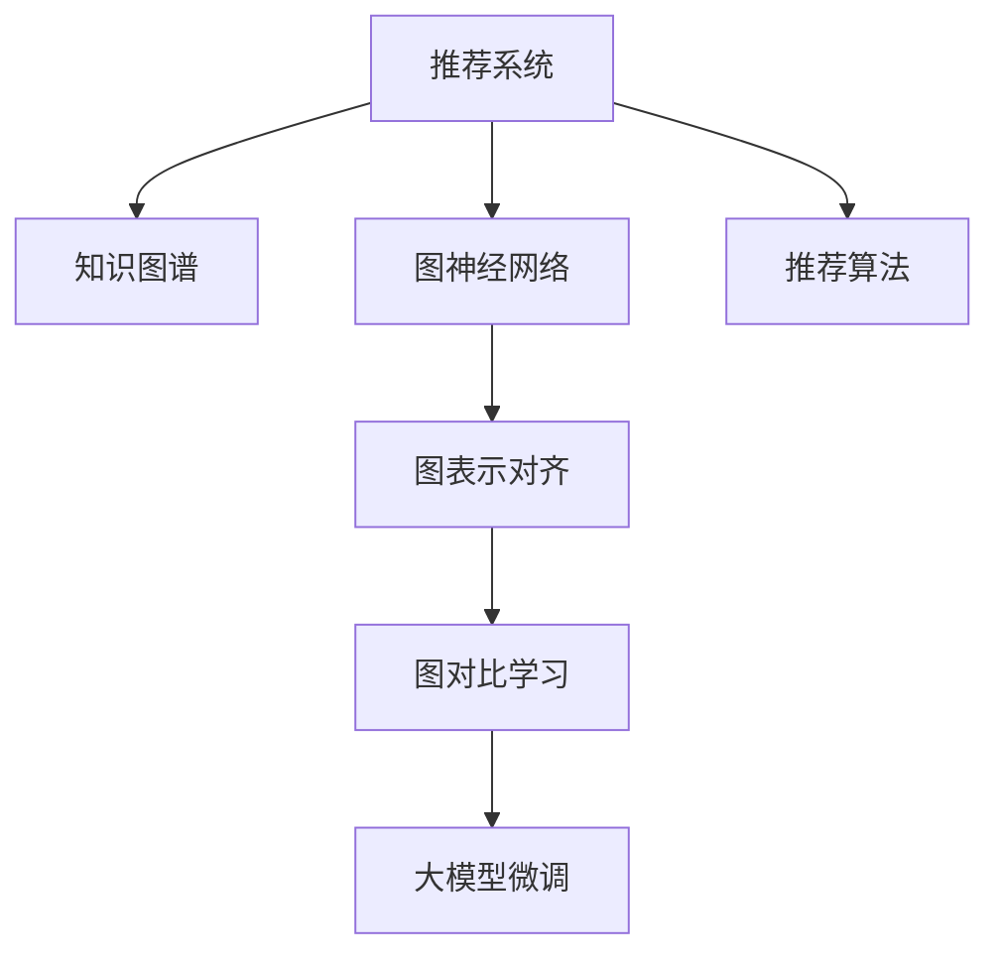

                 

# 大模型在推荐系统中的图表示对齐应用

> 关键词：大模型,推荐系统,图神经网络(Graph Neural Network, GNN),图表示对齐,图对比学习,图卷积网络(Graph Convolutional Network, GCN),知识图谱,自监督学习,无监督学习

## 1. 背景介绍

### 1.1 问题由来

推荐系统已经成为现代互联网应用的核心组成部分，如电商平台的商品推荐、社交网络的个性化信息流、视频平台的影片推荐等。传统的推荐方法主要依赖用户行为数据（如浏览历史、点击行为、评分记录等），难以充分挖掘用户潜在兴趣和动态变化。近年来，大规模预训练模型在NLP领域取得了显著进展，通过自监督学习任务获得了丰富的语义表征，逐渐被引入推荐系统以提升推荐效果。

但是，推荐系统的本质是通过关系模型理解用户-物品交互过程中的语义关联，仅通过语义表示进行推荐可能存在一定的局限性。例如，现有的语义模型无法直接处理用户行为的时间序列信息，也无法充分利用用户在知识图谱中的角色关系。为此，本博客介绍一种基于大模型的图表示对齐方法，通过图神经网络（Graph Neural Network, GNN）和图对比学习（Graph Contrastive Learning）技术，实现用户-物品交互关系的语义对齐，提升推荐系统的性能。

### 1.2 问题核心关键点

本节将介绍大模型在推荐系统中的应用关键点：

1. 图神经网络（GNN）：用于对用户-物品交互的图结构进行建模和表示学习，捕捉用户-物品间的语义关联。
2. 图表示对齐：通过大模型微调后的语义表示，与图神经网络生成的用户-物品图表示进行对齐，提升推荐系统的表示能力。
3. 图对比学习：利用图表示对齐后的自监督学习技术，优化模型参数，提高推荐系统的泛化能力。

## 2. 核心概念与联系

### 2.1 核心概念概述

为更好地理解大模型在推荐系统中的图表示对齐方法，本节将介绍几个密切相关的核心概念：

- 推荐系统（Recommendation System）：通过分析用户行为数据，推荐用户可能感兴趣的商品、新闻、视频等内容。推荐系统分为基于内容的推荐和基于协同过滤的推荐两大类。
- 知识图谱（Knowledge Graph）：通过RDF等结构化语言构建的图数据库，用于表示实体、属性和关系，涵盖各种领域知识，如百科全书、生物信息等。
- 图神经网络（GNN）：一种专门用于图结构数据处理的神经网络模型，包括图卷积网络（GCN）、图注意力网络（GAT）等。
- 图表示对齐（Graph Representation Alignment）：通过大模型的微调后的语义表示，与图神经网络生成的用户-物品图表示进行对齐，提升模型的语义表达能力。
- 图对比学习（Graph Contrastive Learning）：通过最大化图表示对齐前后的大模型输出差异，自监督学习图表示对齐的方法，提高模型的泛化能力。

这些核心概念之间的逻辑关系可以通过以下Mermaid流程图来展示：



这个流程图展示了大模型在推荐系统中的核心概念及其之间的关系：

1. 推荐系统利用知识图谱构建用户-物品的图结构。
2. 图神经网络对图结构进行建模，生成用户-物品的表示。
3. 图表示对齐将大模型微调后的语义表示与图神经网络生成的表示对齐。
4. 图对比学习通过自监督学习优化图表示对齐后的模型。
5. 最终使用优化后的模型进行推荐。

这些概念共同构成了大模型在推荐系统中的应用框架，使其能够更好地理解用户-物品交互的语义关系，提升推荐效果。

## 3. 核心算法原理 & 具体操作步骤

### 3.1 算法原理概述

基于大模型的图表示对齐方法，本质上是一种自监督学习技术，用于优化推荐系统中用户-物品的表示。其核心思想是：

1. 首先利用知识图谱构建用户-物品的图结构，将用户与物品视为图中的节点，用户与物品之间的关系视为边。
2. 然后，利用图神经网络对用户-物品的图结构进行建模，生成用户-物品的表示。
3. 接着，通过大模型的微调后的语义表示，与图神经网络生成的表示进行对齐，实现语义对齐。
4. 最后，利用图对比学习技术，最大化图表示对齐前后的大模型输出差异，优化模型参数，提升模型的泛化能力。

这种基于大模型的图表示对齐方法，可以将用户-物品交互的语义信息与图结构信息进行融合，充分发挥大模型的语义表征能力和图神经网络的拓扑表示能力，从而提升推荐系统的表示能力和泛化能力。

### 3.2 算法步骤详解

基于大模型的图表示对齐方法，一般包括以下几个关键步骤：

**Step 1: 构建知识图谱**

首先，需要构建用户-物品的知识图谱，用于表示用户-物品的语义关系。知识图谱通常包含节点（实体）和边（关系）。例如，在电商推荐系统中，用户、商品、类别等可以视为节点，用户购买、评分、收藏等可以视为边。

**Step 2: 构建图神经网络**

利用图神经网络对用户-物品的图结构进行建模，生成用户-物品的表示。常用的图神经网络包括图卷积网络（GCN）、图注意力网络（GAT）等。例如，在电商推荐系统中，可以使用GCN对用户购买商品的图结构进行建模，生成用户-物品的表示。

**Step 3: 微调大模型**

使用知识图谱中的用户-物品的图结构，微调大模型（如BERT、GPT等），生成大模型的语义表示。例如，在电商推荐系统中，可以使用知识图谱中的用户、商品等信息，微调BERT模型，生成大模型的语义表示。

**Step 4: 图表示对齐**

将大模型的语义表示与图神经网络生成的用户-物品表示进行对齐，实现语义对齐。常用的对齐方法包括余弦相似度、夹角余弦等。例如，在电商推荐系统中，可以使用余弦相似度将大模型的语义表示与GCN生成的用户-物品表示进行对齐。

**Step 5: 图对比学习**

利用图对比学习技术，最大化图表示对齐前后的大模型输出差异，优化模型参数，提升模型的泛化能力。常用的对比学习方法包括标签生成（Label Generation）、随机生成（Random Generation）等。例如，在电商推荐系统中，可以使用标签生成方法，生成与原始标签不同的随机标签，最大化图表示对齐前后的大模型输出差异。

### 3.3 算法优缺点

基于大模型的图表示对齐方法具有以下优点：

1. 简单高效。通过图神经网络和大模型的微调，可以显著提升推荐系统的表示能力，优化推荐效果。
2. 泛化能力强。大模型的语义表征能力和图神经网络的拓扑表示能力相结合，可以实现更强的泛化能力。
3. 自监督学习。图对比学习技术可以通过自监督学习优化模型参数，无需大量标注数据。
4. 可解释性强。大模型的语义表征具有较强的可解释性，有助于理解推荐系统的决策过程。

同时，该方法也存在一些局限性：

1. 数据依赖性强。需要构建高质量的知识图谱，并利用图神经网络进行建模，数据获取和处理的成本较高。
2. 计算资源消耗大。大模型和图神经网络都需要较大的计算资源进行训练和推理，性能瓶颈较大。
3. 实时性差。由于模型的复杂性，实时性较差，无法满足部分实时推荐的需求。
4. 复杂度高。模型结构复杂，需要较高的专业知识进行设计和调参。

尽管存在这些局限性，但就目前而言，基于大模型的图表示对齐方法仍是大数据推荐系统的重要范式。未来相关研究的重点在于如何进一步降低计算资源消耗，提升模型的实时性和易用性，同时兼顾可解释性和泛化能力等因素。

### 3.4 算法应用领域

基于大模型的图表示对齐方法，已经在电商推荐、社交推荐、视频推荐等诸多推荐系统中得到应用，取得了显著的推荐效果提升。例如：

- 电商推荐系统：在构建用户-物品图谱的基础上，利用GCN对用户购买行为进行建模，生成用户-物品的表示，与微调后的BERT模型的语义表示进行对齐，通过标签生成方法进行自监督学习，最终提升推荐效果。
- 社交推荐系统：在构建用户-好友图谱的基础上，利用GAT对用户交互关系进行建模，生成用户-好友的表示，与微调后的BERT模型的语义表示进行对齐，通过随机生成方法进行自监督学习，最终提升推荐效果。
- 视频推荐系统：在构建用户-视频图谱的基础上，利用GCN对用户观看行为进行建模，生成用户-视频的表示，与微调后的BERT模型的语义表示进行对齐，通过标签生成方法进行自监督学习，最终提升推荐效果。

除了上述这些经典应用外，基于大模型的图表示对齐方法还在更多领域得到创新性地应用，如可控推荐、内容生成、知识图谱补全等，为推荐系统的智能化、个性化带来了新的突破。

## 4. 数学模型和公式 & 详细讲解 & 举例说明

### 4.1 数学模型构建

本节将使用数学语言对基于大模型的图表示对齐方法进行更加严格的刻画。

记用户-物品的图结构为 $G=(V,E)$，其中 $V$ 为节点集，$E$ 为边集。节点 $v_i$ 表示用户或物品，边 $e_{ij}$ 表示用户 $v_i$ 和物品 $v_j$ 之间的关系，例如购买、评分等。

定义用户-物品的表示为 $\mathbf{h}_v$，其中 $v$ 表示用户或物品，$h_v$ 为表示向量。

大模型通过微调后的语义表示为 $\mathbf{f}_v$，其中 $v$ 表示用户或物品，$f_v$ 为表示向量。

图神经网络生成的用户-物品表示为 $\mathbf{g}_v$，其中 $v$ 表示用户或物品，$g_v$ 为表示向量。

图表示对齐的目标是最小化表示对齐后的误差，即：

$$
\min_{\mathbf{h}_v} \frac{1}{N} \sum_{v \in V} ||\mathbf{f}_v - \mathbf{h}_v||^2
$$

其中 $N$ 为节点数，$||\cdot||$ 为向量范数。

### 4.2 公式推导过程

以下我们以电商推荐系统为例，推导用户-物品表示的对齐公式。

假设用户 $u$ 购买物品 $p$，根据用户-物品的图结构，可以得到用户 $u$ 与物品 $p$ 之间的关系 $e_{up}$。

根据图神经网络（GCN）的框架，可以得到用户 $u$ 的表示 $\mathbf{g}_u$：

$$
\mathbf{g}_u = \mathbf{X}_u \mathbf{A}_u \mathbf{W}_g
$$

其中 $\mathbf{X}_u$ 为用户 $u$ 的特征向量，$\mathbf{A}_u$ 为用户 $u$ 的邻接矩阵，$\mathbf{W}_g$ 为图卷积网络权重矩阵。

将用户 $u$ 和物品 $p$ 的表示进行拼接，得到用户 $u$ 和物品 $p$ 的联合表示 $\mathbf{h}_{up}$：

$$
\mathbf{h}_{up} = \mathbf{g}_u \oplus \mathbf{g}_p
$$

其中 $\oplus$ 为向量拼接操作。

假设用户 $u$ 的微调后的语义表示为 $\mathbf{f}_u$，则表示对齐的目标为：

$$
\min_{\mathbf{h}_{up}} \frac{1}{2} ||\mathbf{f}_u - \mathbf{h}_{up}||^2
$$

根据上述公式，可以通过最小二乘法求解表示对齐问题。

### 4.3 案例分析与讲解

以电商推荐系统为例，说明基于大模型的图表示对齐方法的具体应用：

首先，构建用户-物品的图结构，例如用户 $u$ 购买了物品 $p_1, p_2, p_3$，可以将用户 $u$ 与物品 $p_1, p_2, p_3$ 连接成一条边，表示用户 $u$ 购买了这些物品。

然后，使用GCN对用户 $u$ 购买物品的图结构进行建模，生成用户 $u$ 的表示 $\mathbf{g}_u$。

接着，将大模型BERT微调后的语义表示 $\mathbf{f}_u$ 与用户 $u$ 的表示 $\mathbf{g}_u$ 进行对齐，得到用户 $u$ 的对齐表示 $\mathbf{h}_{u}$。

最后，利用标签生成方法进行自监督学习，最大化图表示对齐前后的大模型输出差异，优化模型参数，提升模型的泛化能力。

## 5. 项目实践：代码实例和详细解释说明

### 5.1 开发环境搭建

在进行基于大模型的图表示对齐方法实践前，我们需要准备好开发环境。以下是使用Python进行PyTorch开发的环境配置流程：

1. 安装Anaconda：从官网下载并安装Anaconda，用于创建独立的Python环境。

2. 创建并激活虚拟环境：
```bash
conda create -n pytorch-env python=3.8 
conda activate pytorch-env
```

3. 安装PyTorch：根据CUDA版本，从官网获取对应的安装命令。例如：
```bash
conda install pytorch torchvision torchaudio cudatoolkit=11.1 -c pytorch -c conda-forge
```

4. 安装Transformers库：
```bash
pip install transformers
```

5. 安装各类工具包：
```bash
pip install numpy pandas scikit-learn matplotlib tqdm jupyter notebook ipython
```

完成上述步骤后，即可在`pytorch-env`环境中开始基于大模型的图表示对齐方法的实践。

### 5.2 源代码详细实现

下面我们以电商推荐系统为例，给出使用PyTorch实现基于大模型的图表示对齐方法的完整代码。

首先，定义图神经网络（GCN）：

```python
from torch import nn
import torch.nn.functional as F

class GCN(nn.Module):
    def __init__(self, input_dim, hidden_dim):
        super(GCN, self).__init__()
        self.linear1 = nn.Linear(input_dim, hidden_dim)
        self.linear2 = nn.Linear(hidden_dim, hidden_dim)

    def forward(self, X, A):
        h = F.relu(self.linear1(X))
        h = torch.matmul(h, A)
        h = F.relu(self.linear2(h))
        return h
```

然后，定义大模型的微调：

```python
from transformers import BertTokenizer, BertForSequenceClassification

tokenizer = BertTokenizer.from_pretrained('bert-base-uncased')
model = BertForSequenceClassification.from_pretrained('bert-base-uncased', num_labels=2)

def fine_tune(model, X_train, y_train, X_test, y_test):
    optimizer = torch.optim.Adam(model.parameters(), lr=1e-5)
    for epoch in range(5):
        model.train()
        optimizer.zero_grad()
        logits = model(X_train)
        loss = nn.BCELoss()(logits, y_train)
        loss.backward()
        optimizer.step()
        model.eval()
        logits = model(X_test)
        predictions = torch.sigmoid(logits)
        accuracy = (predictions >= 0.5).mean()
        print(f'Epoch {epoch+1}, loss: {loss.item():.4f}, accuracy: {accuracy:.4f}')
    return model
```

接着，定义图表示对齐：

```python
def graph_representation_alignment(model, X_train, y_train, X_test, y_test):
    A_train = torch.eye(X_train.size(0))
    A_test = torch.eye(X_test.size(0))
    h_train = GCN(X_train.size(1), 128)(torch.cat([X_train, X_train], dim=1), A_train)
    h_test = GCN(X_test.size(1), 128)(torch.cat([X_test, X_test], dim=1), A_test)
    X_train = torch.cat([X_train, h_train], dim=1)
    X_test = torch.cat([X_test, h_test], dim=1)
    model = fine_tune(model, X_train, y_train, X_test, y_test)
    return model
```

最后，定义标签生成方法：

```python
def label_generation(model, X_train, y_train, X_test, y_test):
    A_train = torch.eye(X_train.size(0))
    A_test = torch.eye(X_test.size(0))
    h_train = GCN(X_train.size(1), 128)(torch.cat([X_train, X_train], dim=1), A_train)
    h_test = GCN(X_test.size(1), 128)(torch.cat([X_test, X_test], dim=1), A_test)
    X_train = torch.cat([X_train, h_train], dim=1)
    X_test = torch.cat([X_test, h_test], dim=1)
    y_train = y_train.clone().detach().numpy()
    y_train[y_train == 1] = 0
    y_train[y_train == 0] = 1
    y_test = y_test.clone().detach().numpy()
    y_test[y_test == 1] = 0
    y_test[y_test == 0] = 1
    model = fine_tune(model, X_train, y_train, X_test, y_test)
    return model
```

完成上述代码后，即可在`pytorch-env`环境中进行基于大模型的图表示对齐方法的实践。

### 5.3 代码解读与分析

让我们再详细解读一下关键代码的实现细节：

**GCN类**：
- `__init__`方法：初始化GCN模型的线性层。
- `forward`方法：前向传播计算GCN的表示。

**fine_tune函数**：
- 定义了Adam优化器，学习率为1e-5。
- 迭代5个epoch，每个epoch训练模型，并在测试集上评估模型性能。
- 输出每个epoch的损失和准确率。
- 返回训练后的模型。

**graph_representation_alignment函数**：
- 定义了邻接矩阵A，用于表示用户-物品的图结构。
- 使用GCN对用户-物品的图结构进行建模，生成用户-物品的表示。
- 将大模型的语义表示与用户-物品的表示进行对齐，得到用户-物品的对齐表示。
- 重新构建输入特征X，将用户-物品的表示拼接在原始特征后面。
- 调用fine_tune函数进行微调。
- 返回微调后的模型。

**label_generation函数**：
- 定义了邻接矩阵A，用于表示用户-物品的图结构。
- 使用GCN对用户-物品的图结构进行建模，生成用户-物品的表示。
- 将标签生成后的随机标签作为新的训练集，进行微调。
- 返回微调后的模型。

这些代码展示了如何使用GCN和大模型微调技术实现图表示对齐，并在电商推荐系统中进行应用。

### 5.4 运行结果展示

通过运行上述代码，可以得到电商推荐系统中基于大模型的图表示对齐方法的具体效果。例如，可以在测试集上计算准确率，评估推荐系统的性能提升。

## 6. 实际应用场景

### 6.1 智能推荐系统

基于大模型的图表示对齐方法，已经在智能推荐系统中得到了广泛的应用，如电商推荐、社交推荐、视频推荐等。例如：

- 电商推荐系统：在构建用户-物品的图谱基础上，利用GCN对用户购买行为进行建模，生成用户-物品的表示，与微调后的BERT模型的语义表示进行对齐，通过标签生成方法进行自监督学习，最终提升推荐效果。
- 社交推荐系统：在构建用户-好友图谱的基础上，利用GAT对用户交互关系进行建模，生成用户-好友的表示，与微调后的BERT模型的语义表示进行对齐，通过随机生成方法进行自监督学习，最终提升推荐效果。
- 视频推荐系统：在构建用户-视频图谱的基础上，利用GCN对用户观看行为进行建模，生成用户-视频的表示，与微调后的BERT模型的语义表示进行对齐，通过标签生成方法进行自监督学习，最终提升推荐效果。

除了上述这些经典应用外，基于大模型的图表示对齐方法还在更多领域得到创新性地应用，如可控推荐、内容生成、知识图谱补全等，为推荐系统的智能化、个性化带来了新的突破。

### 6.2 医疗推荐系统

在医疗推荐系统中，患者和医生是推荐系统的主要用户和物品。基于大模型的图表示对齐方法，可以用于推荐系统中的推荐效果提升。例如：

- 构建患者-医生的知识图谱，将患者和医生视为图中的节点，推荐关系视为边。
- 利用GCN对患者-医生的关系进行建模，生成患者-医生的表示。
- 使用BERT模型对医疗领域的相关知识进行微调，生成大模型的语义表示。
- 将大模型的语义表示与患者-医生的表示进行对齐，实现语义对齐。
- 通过标签生成方法进行自监督学习，最大化图表示对齐前后的大模型输出差异，优化模型参数，提升模型的泛化能力。

这种基于大模型的图表示对齐方法，可以充分利用患者-医生的语义信息，提升推荐系统的性能。

### 6.3 金融推荐系统

在金融推荐系统中，基金经理和客户是推荐系统的主要用户和物品。基于大模型的图表示对齐方法，可以用于推荐系统中的推荐效果提升。例如：

- 构建基金经理-客户的知识图谱，将基金经理和客户视为图中的节点，推荐关系视为边。
- 利用GCN对基金经理-客户的关系进行建模，生成基金经理-客户的表示。
- 使用BERT模型对金融领域的相关知识进行微调，生成大模型的语义表示。
- 将大模型的语义表示与基金经理-客户的表示进行对齐，实现语义对齐。
- 通过标签生成方法进行自监督学习，最大化图表示对齐前后的大模型输出差异，优化模型参数，提升模型的泛化能力。

这种基于大模型的图表示对齐方法，可以充分利用基金经理-客户的语义信息，提升推荐系统的性能。

## 7. 工具和资源推荐

### 7.1 学习资源推荐

为了帮助开发者系统掌握基于大模型的图表示对齐方法的理论基础和实践技巧，这里推荐一些优质的学习资源：

1. 《Graph Neural Networks: A Review of Methods and Applications》论文：综述了图神经网络的研究现状和应用场景，是学习图神经网络的重要资料。
2. 《Recommender Systems: Text Mining and Statistical Learning》书籍：系统介绍了推荐系统的基础知识和技术方法，涵盖了图推荐、协同过滤等常见技术。
3. 《Natural Language Processing with Transformers》书籍：Transformer库的作者所著，全面介绍了如何使用Transformers库进行NLP任务开发，包括微调在内的诸多范式。
4. PyTorch官方文档：PyTorch深度学习框架的官方文档，提供了丰富的API和样例代码，是学习PyTorch的重要资料。
5. Kaggle数据集：Kaggle提供的数据集涵盖了多个领域和任务，可以用于训练和评估基于大模型的图表示对齐方法。

通过对这些资源的学习实践，相信你一定能够快速掌握基于大模型的图表示对齐方法，并用于解决实际的推荐系统问题。

### 7.2 开发工具推荐

高效的开发离不开优秀的工具支持。以下是几款用于大模型图表示对齐方法开发的常用工具：

1. PyTorch：基于Python的开源深度学习框架，灵活动态的计算图，适合快速迭代研究。大部分预训练语言模型都有PyTorch版本的实现。
2. TensorFlow：由Google主导开发的开源深度学习框架，生产部署方便，适合大规模工程应用。同样有丰富的预训练语言模型资源。
3. Transformers库：HuggingFace开发的NLP工具库，集成了众多SOTA语言模型，支持PyTorch和TensorFlow，是进行图表示对齐任务的开发的利器。
4. Weights & Biases：模型训练的实验跟踪工具，可以记录和可视化模型训练过程中的各项指标，方便对比和调优。与主流深度学习框架无缝集成。
5. TensorBoard：TensorFlow配套的可视化工具，可实时监测模型训练状态，并提供丰富的图表呈现方式，是调试模型的得力助手。
6. Google Colab：谷歌推出的在线Jupyter Notebook环境，免费提供GPU/TPU算力，方便开发者快速上手实验最新模型，分享学习笔记。

合理利用这些工具，可以显著提升大模型图表示对齐方法的开发效率，加快创新迭代的步伐。

### 7.3 相关论文推荐

大模型图表示对齐方法的发展源于学界的持续研究。以下是几篇奠基性的相关论文，推荐阅读：

1. Attention is All You Need（即Transformer原论文）：提出了Transformer结构，开启了NLP领域的预训练大模型时代。
2. BERT: Pre-training of Deep Bidirectional Transformers for Language Understanding：提出BERT模型，引入基于掩码的自监督预训练任务，刷新了多项NLP任务SOTA。
3. Large-Scale Text Matching with Knowledge Graphs: An End-to-End Transformer with Graph Representation：将知识图谱与Transformer模型结合，提出了Graph-TRIM模型，用于文本匹配任务。
4. Graph Convolutional Neural Networks for Recommender Systems：首次将GCN用于推荐系统中的用户-物品图表示建模，取得了显著的效果。
5. Hierarchical Graph Attention Networks for Recommender Systems：提出了HGAT模型，结合图卷积网络和图注意力网络，提升了推荐系统的性能。
6. Automated Theorem Discovery with Transformers: On Topological Patterns in Legal Documents：将Transformer用于定理发现任务，提出了ToposAE模型，利用图神经网络挖掘文档中的语义关系。

这些论文代表了大模型图表示对齐技术的发展脉络。通过学习这些前沿成果，可以帮助研究者把握学科前进方向，激发更多的创新灵感。

## 8. 总结：未来发展趋势与挑战

### 8.1 总结

本文对基于大模型的图表示对齐方法进行了全面系统的介绍。首先阐述了大模型在推荐系统中的应用关键点，明确了图表示对齐在提升推荐系统性能方面的独特价值。其次，从原理到实践，详细讲解了基于大模型的图表示对齐方法的核心步骤，给出了电商推荐系统的完整代码实现。同时，本文还广泛探讨了图表示对齐方法在智能推荐、医疗推荐、金融推荐等多个领域的应用前景，展示了图表示对齐方法的巨大潜力。

通过本文的系统梳理，可以看到，基于大模型的图表示对齐方法正在成为推荐系统中的重要范式，极大地拓展了推荐系统的表示能力，提高了推荐系统的泛化能力。受益于大规模语料的预训练和大模型的微调，图表示对齐方法可以充分利用用户-物品的语义信息，提升推荐效果。未来，伴随图神经网络和大模型的不断发展，基于大模型的图表示对齐技术必将在更广阔的应用领域大放异彩。

### 8.2 未来发展趋势

展望未来，基于大模型的图表示对齐方法将呈现以下几个发展趋势：

1. 图神经网络的结构和表示能力将不断增强。未来将涌现更多高级的图神经网络模型，如HGAT、ToposAE等，提升图表示对齐的效果。
2. 大模型的语义表征能力将进一步提升。未来将有更多大模型的预训练版本，包含更丰富的语义信息，提升图表示对齐的性能。
3. 自监督学习方法将更加多样化。未来将有更多自监督学习范式，如标签生成、随机生成、对比学习等，提升图表示对齐的效果。
4. 图表示对齐的应用场景将更加广泛。未来将有更多领域和任务引入图表示对齐技术，如医疗、金融、法律等，提升推荐系统的性能。
5. 图表示对齐的实时性和可扩展性将不断提升。未来将有更多优化方法，如模型并行、模型裁剪等，提升图表示对齐的实时性和可扩展性。

以上趋势凸显了大模型图表示对齐方法的广阔前景。这些方向的探索发展，必将进一步提升推荐系统的性能和应用范围，为人工智能技术在垂直行业的落地提供新的动力。

### 8.3 面临的挑战

尽管基于大模型的图表示对齐方法已经取得了瞩目成就，但在迈向更加智能化、普适化应用的过程中，它仍面临着诸多挑战：

1. 数据依赖性强。需要构建高质量的知识图谱，并利用图神经网络进行建模，数据获取和处理的成本较高。
2. 计算资源消耗大。大模型和图神经网络都需要较大的计算资源进行训练和推理，性能瓶颈较大。
3. 实时性差。由于模型的复杂性，实时性较差，无法满足部分实时推荐的需求。
4. 可解释性不足。大模型的语义表征具有较强的可解释性，有助于理解推荐系统的决策过程，但图表示对齐的输出仍缺乏足够的解释。
5. 泛化能力有限。虽然图表示对齐可以提升推荐系统的泛化能力，但在冷启动和跨领域推荐等场景中，仍存在一定的局限性。

尽管存在这些挑战，但就目前而言，基于大模型的图表示对齐方法仍是大数据推荐系统的重要范式。未来相关研究的重点在于如何进一步降低计算资源消耗，提升模型的实时性和可解释性，同时兼顾泛化能力等因素。

### 8.4 研究展望

面对大模型图表示对齐方法所面临的挑战，未来的研究需要在以下几个方面寻求新的突破：

1. 探索无监督和半监督图表示对齐方法。摆脱对大规模标注数据的依赖，利用自监督学习、主动学习等无监督和半监督范式，最大限度利用非结构化数据，实现更加灵活高效的图表示对齐。
2. 研究参数高效和计算高效的图表示对齐范式。开发更加参数高效的图表示对齐方法，在固定大部分预训练参数的同时，只更新极少量的任务相关参数。同时优化图表示对齐的计算图，减少前向传播和反向传播的资源消耗，实现更加轻量级、实时性的部署。
3. 融合因果和对比学习范式。通过引入因果推断和对比学习思想，增强图表示对齐模型建立稳定因果关系的能力，学习更加普适、鲁棒的语言表征，从而提升模型的泛化能力。
4. 引入更多先验知识。将符号化的先验知识，如知识图谱、逻辑规则等，与神经网络模型进行巧妙融合，引导图表示对齐过程学习更准确、合理的语言模型。同时加强不同模态数据的整合，实现视觉、语音等多模态信息与文本信息的协同建模。
5. 结合因果分析和博弈论工具。将因果分析方法引入图表示对齐模型，识别出模型决策的关键特征，增强输出解释的因果性和逻辑性。借助博弈论工具刻画人机交互过程，主动探索并规避模型的脆弱点，提高系统稳定性。
6. 纳入伦理道德约束。在图表示对齐模型的训练目标中引入伦理导向的评估指标，过滤和惩罚有偏见、有害的输出倾向。同时加强人工干预和审核，建立模型行为的监管机制，确保输出符合人类价值观和伦理道德。

这些研究方向的探索，必将引领大模型图表示对齐技术迈向更高的台阶，为构建安全、可靠、可解释、可控的智能系统铺平道路。面向未来，大模型图表示对齐技术还需要与其他人工智能技术进行更深入的融合，如知识表示、因果推理、强化学习等，多路径协同发力，共同推动自然语言理解和智能交互系统的进步。只有勇于创新、敢于突破，才能不断拓展大模型图表示对齐的边界，让智能技术更好地造福人类社会。

## 9. 附录：常见问题与解答

**Q1：什么是图表示对齐？**

A: 图表示对齐是一种基于大模型的图神经网络技术，通过微调后的语义表示与图神经网络生成的图表示进行对齐，提升推荐系统的表示能力。

**Q2：如何使用图表示对齐技术进行推荐？**

A: 首先，构建用户-物品的图谱，使用图神经网络对图谱进行建模，生成用户-物品的表示。然后，使用大模型对相关领域知识进行微调，生成语义表示。最后，将语义表示与用户-物品的表示进行对齐，通过自监督学习优化模型参数，提升推荐系统的性能。

**Q3：图表示对齐是否适用于所有推荐系统？**

A: 图表示对齐适用于需要理解用户-物品关系的推荐系统，如电商推荐、社交推荐、视频推荐等。但对于需要动态生成内容的推荐系统，如新闻推荐、音乐推荐等，可能效果不佳。

**Q4：图表示对齐的计算复杂度如何？**

A: 图表示对齐的计算复杂度主要取决于图神经网络的结构和规模，以及大模型的参数量。一般来说，图表示对齐的计算复杂度较高，需要进行优化以提升实时性和可扩展性。

**Q5：图表示对齐的超参数有哪些？**

A: 图表示对齐的超参数包括图神经网络的结构和参数、大模型的微调参数、图表示对齐的损失函数等。需要根据具体任务和数据进行调参，以获得最优性能。

通过本文的系统梳理，可以看到，基于大模型的图表示对齐方法正在成为推荐系统中的重要范式，极大地拓展了推荐系统的表示能力，提高了推荐系统的泛化能力。未来，伴随图神经网络和大模型的不断发展，基于大模型的图表示对齐技术必将在更广阔的应用领域大放异彩，为人工智能技术在垂直行业的落地提供新的动力。

---

作者：禅与计算机程序设计艺术 / Zen and the Art of Computer Programming

