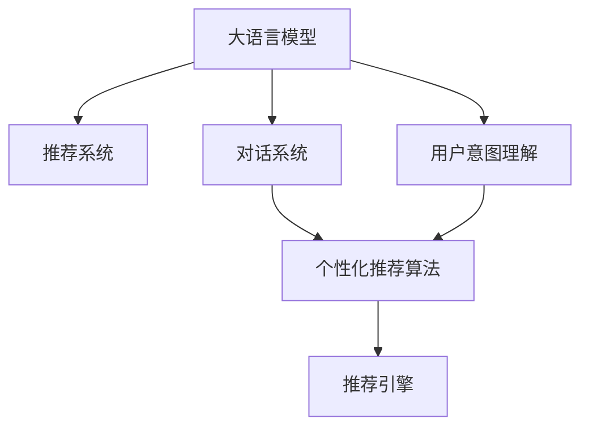

                 

# 大模型在推荐系统中的对话式交互设计

> 关键词：大模型推荐系统,对话式交互设计,用户意图理解,个性化推荐算法,自然语言处理(NLP),推荐引擎

## 1. 背景介绍

### 1.1 问题由来

随着互联网的普及和数字技术的发展，推荐系统成为了各大电商、社交媒体和内容平台的核心技术之一。推荐系统能够根据用户的历史行为和偏好，预测并推荐用户感兴趣的内容，提升用户体验和平台收益。然而，现有的推荐系统多基于静态特征和基于内容的推荐算法，难以捕捉用户的即时兴趣和动态变化。

近年来，大语言模型在NLP领域的突破性进展，为推荐系统带来了新的思路和方法。通过引入大语言模型的自然语言处理能力，推荐系统可以更好地理解用户输入的自然语言查询，捕捉用户的即时兴趣和动态变化，从而提供更加个性化和情境化的推荐内容。本文将介绍大语言模型在推荐系统中的对话式交互设计，探讨如何通过大模型提升推荐系统的性能和用户体验。

### 1.2 问题核心关键点

目前，大语言模型在推荐系统中的对话式交互设计主要关注以下几个核心问题：

1. 如何更好地理解用户输入的自然语言查询，准确捕捉用户的即时兴趣和需求？
2. 如何将自然语言查询转化为推荐系统的输入特征，以支持推荐算法？
3. 如何通过对话交互设计，提供更加个性化和情境化的推荐内容？
4. 如何构建用户和系统的互动反馈机制，提升推荐系统的学习能力和性能？

这些问题涉及到自然语言处理、推荐算法、系统架构等多个领域，需要跨学科的知识和技术支持。本文将通过大模型的视角，对这些关键问题进行系统性的探讨和解答。

## 2. 核心概念与联系

### 2.1 核心概念概述

为了更好地理解大模型在推荐系统中的对话式交互设计，本节将介绍几个核心概念及其相互关系：

- **大语言模型(Large Language Model, LLM)**：如GPT-3、BERT等大规模预训练语言模型。通过在大规模无标签文本数据上进行自监督学习，具备强大的自然语言理解和生成能力。

- **推荐系统(Recommendation System)**：通过分析用户的历史行为和偏好，预测并推荐用户感兴趣的内容，提升用户体验和平台收益。推荐系统包括基于内容的推荐、基于协同过滤的推荐等。

- **对话系统(Dialing System)**：使用自然语言处理技术，实现人与系统之间的自然语言交互，提供问题解答、任务执行等服务。对话系统涵盖问答系统、客服系统、智能助手等多个领域。

- **用户意图理解(User Intent Understanding)**：通过自然语言处理技术，分析用户输入的自然语言查询，提取用户意图和需求，作为推荐系统的输入特征。

- **个性化推荐算法(Personalized Recommendation Algorithm)**：根据用户历史行为和实时输入，动态生成个性化推荐内容，提升推荐相关性和用户体验。

- **自然语言处理(NLP)**：涉及语言模型的训练、语义理解、语义表示等多个方面，是大模型在推荐系统中的核心技术。

这些核心概念之间的逻辑关系可以通过以下Mermaid流程图来展示：



这个流程图展示了大语言模型在推荐系统中的核心概念及其相互关系：

1. 大语言模型通过预训练学习到丰富的语言知识，提供自然语言处理能力。
2. 对话系统使用自然语言处理技术，实现人机交互，获取用户查询和反馈。
3. 用户意图理解通过分析用户输入的自然语言查询，提取用户意图和需求。
4. 个性化推荐算法根据用户意图和历史行为，生成个性化推荐内容。
5. 推荐引擎将个性化推荐内容呈现给用户，并进行后续的交互和反馈收集。

## 3. 核心算法原理 & 具体操作步骤
### 3.1 算法原理概述

大模型在推荐系统中的对话式交互设计，本质上是通过自然语言处理技术，将用户的自然语言查询转化为推荐系统的输入特征，从而支持推荐算法的动态决策。具体来说，大模型在推荐系统中的设计流程包括用户意图理解、推荐特征提取、个性化推荐算法、推荐引擎等多个步骤。

### 3.2 算法步骤详解

#### 3.2.1 用户意图理解

用户意图理解是大模型在推荐系统中的核心环节。其基本思想是通过自然语言处理技术，分析用户输入的自然语言查询，提取用户意图和需求。具体步骤如下：

1. **文本预处理**：对用户输入的自然语言文本进行分词、去停用词、标准化等预处理操作，构建输入向量。

2. **序列建模**：使用预训练的大语言模型，对输入向量进行编码，得到用户意图的向量表示。

3. **意图分类**：通过分类器对用户意图的向量表示进行分类，得到用户的意图标签。

4. **需求提取**：根据用户意图标签，提取用户需求的关键特征，作为推荐系统的输入特征。

#### 3.2.2 推荐特征提取

推荐特征提取是将用户意图和需求转化为推荐系统的输入特征，以支持推荐算法的动态决策。具体步骤如下：

1. **特征工程**：根据用户意图和需求，构建推荐系统的输入特征，包括用户历史行为、商品属性、实时数据等。

2. **特征融合**：将用户意图、需求和推荐特征进行融合，得到综合特征向量。

3. **特征选择**：通过特征选择算法，选择最相关的特征，减少特征维度，提高模型性能。

#### 3.2.3 个性化推荐算法

个性化推荐算法是大模型在推荐系统中的关键算法，其基本思想是根据用户历史行为和实时输入，动态生成个性化推荐内容。具体步骤如下：

1. **模型训练**：使用历史数据训练推荐模型，生成个性化推荐规则。

2. **实时推荐**：根据用户意图和需求，实时计算推荐内容。

3. **推荐排序**：对推荐内容进行排序，优先展示最相关的内容。

#### 3.2.4 推荐引擎

推荐引擎是将个性化推荐内容呈现给用户，并进行后续的交互和反馈收集。具体步骤如下：

1. **界面呈现**：将推荐内容呈现在用户界面上，包括商品、文章、视频等多种形式。

2. **用户反馈**：收集用户对推荐内容的反馈，包括点击、收藏、评论等行为。

3. **学习优化**：根据用户反馈，调整推荐模型，优化推荐内容。

### 3.3 算法优缺点

大模型在推荐系统中的对话式交互设计，具有以下优点：

1. **实时动态响应**：通过自然语言处理技术，实时捕捉用户的即时兴趣和需求，动态生成个性化推荐内容。

2. **自然语言交互**：通过对话系统实现人机交互，提高用户的使用体验和满意度。

3. **高精度推荐**：大语言模型具备强大的自然语言处理能力，能够准确理解用户意图和需求，生成高质量的推荐内容。

4. **泛化能力强**：大语言模型在大规模无标签文本数据上进行预训练，具有较强的泛化能力，能够适应多种场景和任务。

然而，大模型在推荐系统中的对话式交互设计，也存在一些局限性：

1. **计算资源消耗大**：大语言模型的计算资源消耗大，需要高性能的硬件设备支持。

2. **模型复杂度高**：大语言模型的参数规模大，结构复杂，难以优化和调试。

3. **数据隐私问题**：用户输入的自然语言数据可能包含敏感信息，需要考虑数据隐私和安全问题。

4. **系统实时性要求高**：实时交互设计要求系统具有高实时性，对系统的架构和性能提出了更高的要求。

### 3.4 算法应用领域

大模型在推荐系统中的对话式交互设计，已经在电商、社交媒体、视频平台等多个领域得到广泛应用，具体包括：

1. **电商推荐**：通过大模型分析用户评论、商品描述等文本数据，捕捉用户意图和需求，生成个性化推荐商品。

2. **社交媒体推荐**：使用大模型分析用户动态、社交关系等文本数据，生成个性化推荐内容，提升用户粘性。

3. **视频平台推荐**：通过大模型分析用户评论、弹幕等文本数据，生成个性化推荐视频内容，提高用户观看体验。

4. **智能客服推荐**：使用大模型分析用户聊天记录，生成个性化推荐问题解答，提升客服效率和用户满意度。

5. **新闻推荐**：通过大模型分析用户阅读历史、点赞内容等文本数据，生成个性化推荐新闻，提升用户阅读体验。

## 4. 数学模型和公式 & 详细讲解  
### 4.1 数学模型构建

本节将使用数学语言对大模型在推荐系统中的对话式交互设计进行更加严格的刻画。

记用户输入的自然语言查询为 $x$，其向量表示为 $x_{emb}$。大语言模型为 $M_{\theta}$，其中 $\theta$ 为预训练得到的模型参数。推荐系统为 $R$，其中 $R_{\theta}$ 为推荐模型的参数。用户历史行为特征为 $f_{hist}$，推荐特征向量为 $f_{feat}$，用户意图向量为 $x_{emb}$，用户需求向量为 $d_{dem}$。推荐内容向量为 $v_{item}$。

推荐系统的数学模型为：

$$
y = M_{\theta}(x_{emb}) \cdot R_{\theta}(f_{hist}, f_{feat}, x_{emb}, d_{dem})
$$

其中 $y$ 为推荐内容的评分，$M_{\theta}(x_{emb})$ 为自然语言处理模型输出的用户意图向量，$R_{\theta}(f_{hist}, f_{feat}, x_{emb}, d_{dem})$ 为推荐模型对用户历史行为、推荐特征、用户意图和需求进行综合的评分预测。

### 4.2 公式推导过程

以电商推荐系统为例，推导推荐内容的评分公式。

假设用户输入的自然语言查询为 $x$，其向量表示为 $x_{emb}$。用户历史行为特征为 $f_{hist}$，推荐特征向量为 $f_{feat}$，用户意图向量为 $x_{emb}$，用户需求向量为 $d_{dem}$。推荐内容向量为 $v_{item}$。

推荐内容的评分公式为：

$$
y = M_{\theta}(x_{emb}) \cdot R_{\theta}(f_{hist}, f_{feat}, x_{emb}, d_{dem})
$$

其中 $M_{\theta}(x_{emb})$ 为自然语言处理模型输出的用户意图向量，$R_{\theta}(f_{hist}, f_{feat}, x_{emb}, d_{dem})$ 为推荐模型对用户历史行为、推荐特征、用户意图和需求进行综合的评分预测。

在得到推荐内容的评分后，即可带入推荐系统进行实时推荐和用户反馈收集。

### 4.3 案例分析与讲解

假设电商推荐系统的用户输入查询为 "我想买一双好穿的运动鞋"，通过自然语言处理模型，得到用户意图向量 $x_{emb}$。结合用户历史行为特征 $f_{hist}$、推荐特征向量 $f_{feat}$ 和用户需求向量 $d_{dem}$，使用推荐模型 $R_{\theta}$ 计算推荐内容的评分 $y$。最后，根据评分排序推荐商品列表，并展示给用户。

## 5. 项目实践：代码实例和详细解释说明
### 5.1 开发环境搭建

在进行微调实践前，我们需要准备好开发环境。以下是使用Python进行PyTorch开发的环境配置流程：

1. 安装Anaconda：从官网下载并安装Anaconda，用于创建独立的Python环境。

2. 创建并激活虚拟环境：
```bash
conda create -n pytorch-env python=3.8 
conda activate pytorch-env
```

3. 安装PyTorch：根据CUDA版本，从官网获取对应的安装命令。例如：
```bash
conda install pytorch torchvision torchaudio cudatoolkit=11.1 -c pytorch -c conda-forge
```

4. 安装Transformers库：
```bash
pip install transformers
```

5. 安装各类工具包：
```bash
pip install numpy pandas scikit-learn matplotlib tqdm jupyter notebook ipython
```

完成上述步骤后，即可在`pytorch-env`环境中开始微调实践。

### 5.2 源代码详细实现

下面我们以电商推荐系统为例，给出使用Transformers库对BERT模型进行微调的PyTorch代码实现。

首先，定义推荐系统的训练数据集：

```python
from transformers import BertTokenizer
from torch.utils.data import Dataset

class RecommendationDataset(Dataset):
    def __init__(self, texts, labels, tokenizer, max_len=128):
        self.texts = texts
        self.labels = labels
        self.tokenizer = tokenizer
        self.max_len = max_len
        
    def __len__(self):
        return len(self.texts)
    
    def __getitem__(self, item):
        text = self.texts[item]
        label = self.labels[item]
        
        encoding = self.tokenizer(text, return_tensors='pt', max_length=self.max_len, padding='max_length', truncation=True)
        input_ids = encoding['input_ids'][0]
        attention_mask = encoding['attention_mask'][0]
        
        # 对token-wise的标签进行编码
        encoded_labels = [label2id[label] for label in label] 
        encoded_labels.extend([label2id['None']] * (self.max_len - len(encoded_labels)))
        labels = torch.tensor(encoded_labels, dtype=torch.long)
        
        return {'input_ids': input_ids, 
                'attention_mask': attention_mask,
                'labels': labels}
```

然后，定义模型和优化器：

```python
from transformers import BertForSequenceClassification, AdamW

model = BertForSequenceClassification.from_pretrained('bert-base-cased', num_labels=2)

optimizer = AdamW(model.parameters(), lr=2e-5)
```

接着，定义训练和评估函数：

```python
from torch.utils.data import DataLoader
from tqdm import tqdm
from sklearn.metrics import classification_report

device = torch.device('cuda') if torch.cuda.is_available() else torch.device('cpu')
model.to(device)

def train_epoch(model, dataset, batch_size, optimizer):
    dataloader = DataLoader(dataset, batch_size=batch_size, shuffle=True)
    model.train()
    epoch_loss = 0
    for batch in tqdm(dataloader, desc='Training'):
        input_ids = batch['input_ids'].to(device)
        attention_mask = batch['attention_mask'].to(device)
        labels = batch['labels'].to(device)
        model.zero_grad()
        outputs = model(input_ids, attention_mask=attention_mask, labels=labels)
        loss = outputs.loss
        epoch_loss += loss.item()
        loss.backward()
        optimizer.step()
    return epoch_loss / len(dataloader)

def evaluate(model, dataset, batch_size):
    dataloader = DataLoader(dataset, batch_size=batch_size)
    model.eval()
    preds, labels = [], []
    with torch.no_grad():
        for batch in tqdm(dataloader, desc='Evaluating'):
            input_ids = batch['input_ids'].to(device)
            attention_mask = batch['attention_mask'].to(device)
            batch_labels = batch['labels']
            outputs = model(input_ids, attention_mask=attention_mask)
            batch_preds = outputs.logits.argmax(dim=2).to('cpu').tolist()
            batch_labels = batch_labels.to('cpu').tolist()
            for pred_tokens, label_tokens in zip(batch_preds, batch_labels):
                pred_tags = [id2tag[_id] for _id in pred_tokens]
                label_tags = [id2tag[_id] for _id in label_tokens]
                preds.append(pred_tags[:len(label_tags)])
                labels.append(label_tags)
                
    print(classification_report(labels, preds))
```

最后，启动训练流程并在测试集上评估：

```python
epochs = 5
batch_size = 16

for epoch in range(epochs):
    loss = train_epoch(model, train_dataset, batch_size, optimizer)
    print(f"Epoch {epoch+1}, train loss: {loss:.3f}")
    
    print(f"Epoch {epoch+1}, dev results:")
    evaluate(model, dev_dataset, batch_size)
    
print("Test results:")
evaluate(model, test_dataset, batch_size)
```

以上就是使用PyTorch对BERT进行电商推荐系统微调的完整代码实现。可以看到，得益于Transformers库的强大封装，我们可以用相对简洁的代码完成BERT模型的加载和微调。

### 5.3 代码解读与分析

让我们再详细解读一下关键代码的实现细节：

**RecommendationDataset类**：
- `__init__`方法：初始化训练数据集，包含文本、标签、分词器等关键组件。
- `__len__`方法：返回数据集的样本数量。
- `__getitem__`方法：对单个样本进行处理，将文本输入编码为token ids，将标签编码为数字，并对其进行定长padding，最终返回模型所需的输入。

**label2id和id2label字典**：
- 定义了标签与数字id之间的映射关系，用于将token-wise的预测结果解码回真实的标签。

**训练和评估函数**：
- 使用PyTorch的DataLoader对数据集进行批次化加载，供模型训练和推理使用。
- 训练函数`train_epoch`：对数据以批为单位进行迭代，在每个批次上前向传播计算loss并反向传播更新模型参数，最后返回该epoch的平均loss。
- 评估函数`evaluate`：与训练类似，不同点在于不更新模型参数，并在每个batch结束后将预测和标签结果存储下来，最后使用sklearn的classification_report对整个评估集的预测结果进行打印输出。

**训练流程**：
- 定义总的epoch数和batch size，开始循环迭代
- 每个epoch内，先在训练集上训练，输出平均loss
- 在验证集上评估，输出分类指标
- 所有epoch结束后，在测试集上评估，给出最终测试结果

可以看到，PyTorch配合Transformers库使得BERT微调的代码实现变得简洁高效。开发者可以将更多精力放在数据处理、模型改进等高层逻辑上，而不必过多关注底层的实现细节。

当然，工业级的系统实现还需考虑更多因素，如模型的保存和部署、超参数的自动搜索、更灵活的任务适配层等。但核心的微调范式基本与此类似。

## 6. 实际应用场景
### 6.1 电商推荐系统

电商推荐系统是对话式交互设计的重要应用场景。通过大模型分析用户评论、商品描述等文本数据，捕捉用户意图和需求，生成个性化推荐商品。具体应用场景包括：

- **商品推荐**：根据用户历史购买记录和评论文本，推荐相关商品。
- **个性化推荐**：分析用户搜索行为和浏览记录，推荐最相关的商品。
- **用户反馈收集**：收集用户对推荐商品的反馈，优化推荐算法。

### 6.2 社交媒体推荐

社交媒体推荐系统使用大模型分析用户动态、社交关系等文本数据，生成个性化推荐内容，提升用户粘性。具体应用场景包括：

- **动态推荐**：根据用户动态内容和互动关系，推荐感兴趣的内容。
- **个性化推荐**：分析用户点赞、评论等行为，推荐最相关的内容。
- **用户反馈收集**：收集用户对推荐内容的反馈，优化推荐算法。

### 6.3 视频平台推荐

视频平台推荐系统通过大模型分析用户评论、弹幕等文本数据，生成个性化推荐视频内容，提高用户观看体验。具体应用场景包括：

- **视频推荐**：根据用户观看历史和评论文本，推荐相关视频内容。
- **个性化推荐**：分析用户点赞、评论等行为，推荐最相关的内容。
- **用户反馈收集**：收集用户对推荐视频的反馈，优化推荐算法。

### 6.4 未来应用展望

未来，大模型在推荐系统中的对话式交互设计将进一步拓展应用领域，提升系统的性能和用户体验。具体发展方向包括：

1. **多模态推荐**：结合视觉、听觉等多模态数据，提升推荐系统的泛化能力和表现。
2. **跨领域推荐**：扩展推荐系统的应用场景，如医疗、教育等领域。
3. **交互式推荐**：使用对话系统与用户交互，动态生成个性化推荐内容。
4. **隐私保护推荐**：通过差分隐私等技术，保护用户隐私。

总之，大模型在推荐系统中的对话式交互设计，将逐步成为推荐系统的重要技术范式，为个性化推荐提供更强大的自然语言处理能力，提升用户体验和平台收益。

## 7. 工具和资源推荐
### 7.1 学习资源推荐

为了帮助开发者系统掌握大模型在推荐系统中的对话式交互设计，这里推荐一些优质的学习资源：

1. 《Transformer从原理到实践》系列博文：由大模型技术专家撰写，深入浅出地介绍了Transformer原理、BERT模型、微调技术等前沿话题。

2. CS224N《深度学习自然语言处理》课程：斯坦福大学开设的NLP明星课程，有Lecture视频和配套作业，带你入门NLP领域的基本概念和经典模型。

3. 《Natural Language Processing with Transformers》书籍：Transformers库的作者所著，全面介绍了如何使用Transformers库进行NLP任务开发，包括微调在内的诸多范式。

4. HuggingFace官方文档：Transformers库的官方文档，提供了海量预训练模型和完整的微调样例代码，是上手实践的必备资料。

5. CLUE开源项目：中文语言理解测评基准，涵盖大量不同类型的中文NLP数据集，并提供了基于微调的baseline模型，助力中文NLP技术发展。

通过对这些资源的学习实践，相信你一定能够快速掌握大模型在推荐系统中的对话式交互设计的精髓，并用于解决实际的NLP问题。

### 7.2 开发工具推荐

高效的开发离不开优秀的工具支持。以下是几款用于大模型在推荐系统中的对话式交互设计开发的常用工具：

1. PyTorch：基于Python的开源深度学习框架，灵活动态的计算图，适合快速迭代研究。大部分预训练语言模型都有PyTorch版本的实现。

2. TensorFlow：由Google主导开发的开源深度学习框架，生产部署方便，适合大规模工程应用。同样有丰富的预训练语言模型资源。

3. Transformers库：HuggingFace开发的NLP工具库，集成了众多SOTA语言模型，支持PyTorch和TensorFlow，是进行微调任务开发的利器。

4. Weights & Biases：模型训练的实验跟踪工具，可以记录和可视化模型训练过程中的各项指标，方便对比和调优。与主流深度学习框架无缝集成。

5. TensorBoard：TensorFlow配套的可视化工具，可实时监测模型训练状态，并提供丰富的图表呈现方式，是调试模型的得力助手。

6. Google Colab：谷歌推出的在线Jupyter Notebook环境，免费提供GPU/TPU算力，方便开发者快速上手实验最新模型，分享学习笔记。

合理利用这些工具，可以显著提升大模型在推荐系统中的对话式交互设计的开发效率，加快创新迭代的步伐。

### 7.3 相关论文推荐

大语言模型在推荐系统中的对话式交互设计的发展源于学界的持续研究。以下是几篇奠基性的相关论文，推荐阅读：

1. Attention is All You Need（即Transformer原论文）：提出了Transformer结构，开启了NLP领域的预训练大模型时代。

2. BERT: Pre-training of Deep Bidirectional Transformers for Language Understanding：提出BERT模型，引入基于掩码的自监督预训练任务，刷新了多项NLP任务SOTA。

3. Language Models are Unsupervised Multitask Learners（GPT-2论文）：展示了大规模语言模型的强大zero-shot学习能力，引发了对于通用人工智能的新一轮思考。

4. Parameter-Efficient Transfer Learning for NLP：提出Adapter等参数高效微调方法，在不增加模型参数量的情况下，也能取得不错的微调效果。

5. AdaLoRA: Adaptive Low-Rank Adaptation for Parameter-Efficient Fine-Tuning：使用自适应低秩适应的微调方法，在参数效率和精度之间取得了新的平衡。

这些论文代表了大语言模型在推荐系统中的对话式交互设计的发展脉络。通过学习这些前沿成果，可以帮助研究者把握学科前进方向，激发更多的创新灵感。

## 8. 总结：未来发展趋势与挑战
### 8.1 总结

本文对大模型在推荐系统中的对话式交互设计进行了全面系统的介绍。首先阐述了大语言模型和推荐系统的研究背景和意义，明确了大模型在推荐系统中的核心技术。其次，从原理到实践，详细讲解了大模型在推荐系统中的对话式交互设计的数学原理和关键步骤，给出了推荐系统开发的完整代码实例。同时，本文还广泛探讨了大模型在电商、社交媒体、视频平台等多个领域的应用前景，展示了微调范式的巨大潜力。此外，本文精选了推荐系统的各类学习资源，力求为读者提供全方位的技术指引。

通过本文的系统梳理，可以看到，大语言模型在推荐系统中的对话式交互设计正在成为推荐系统的重要技术范式，极大地拓展了推荐系统的应用边界，催生了更多的落地场景。得益于大规模语料的预训练，推荐系统能够更好地理解用户输入的自然语言查询，捕捉用户的即时兴趣和动态变化，从而提供更加个性化和情境化的推荐内容。未来，随着大语言模型和推荐系统技术的不断进步，基于微调方法推荐系统必将在更多领域得到应用，为传统行业带来变革性影响。

### 8.2 未来发展趋势

展望未来，大模型在推荐系统中的对话式交互设计将呈现以下几个发展趋势：

1. **实时动态响应**：通过自然语言处理技术，实时捕捉用户的即时兴趣和需求，动态生成个性化推荐内容。

2. **自然语言交互**：通过对话系统实现人机交互，提高用户的使用体验和满意度。

3. **高精度推荐**：大语言模型具备强大的自然语言处理能力，能够准确理解用户意图和需求，生成高质量的推荐内容。

4. **泛化能力强**：大语言模型在大规模无标签文本数据上进行预训练，具有较强的泛化能力，能够适应多种场景和任务。

5. **多模态推荐**：结合视觉、听觉等多模态数据，提升推荐系统的泛化能力和表现。

6. **跨领域推荐**：扩展推荐系统的应用场景，如医疗、教育等领域。

7. **交互式推荐**：使用对话系统与用户交互，动态生成个性化推荐内容。

8. **隐私保护推荐**：通过差分隐私等技术，保护用户隐私。

以上趋势凸显了大模型在推荐系统中的对话式交互设计的广阔前景。这些方向的探索发展，必将进一步提升推荐系统的性能和用户体验，为个性化推荐提供更强大的自然语言处理能力。

### 8.3 面临的挑战

尽管大模型在推荐系统中的对话式交互设计已经取得了瞩目成就，但在迈向更加智能化、普适化应用的过程中，它仍面临着诸多挑战：

1. **计算资源消耗大**：大语言模型的计算资源消耗大，需要高性能的硬件设备支持。

2. **模型复杂度高**：大语言模型的参数规模大，结构复杂，难以优化和调试。

3. **数据隐私问题**：用户输入的自然语言数据可能包含敏感信息，需要考虑数据隐私和安全问题。

4. **系统实时性要求高**：实时交互设计要求系统具有高实时性，对系统的架构和性能提出了更高的要求。

5. **用户理解和交互设计**：如何设计用户友好的交互界面和合理的系统反馈，提升用户的使用体验。

6. **算法复杂度**：推荐算法需要处理大规模数据和高维特征，算法复杂度较高。

### 8.4 研究展望

面对大模型在推荐系统中的对话式交互设计所面临的挑战，未来的研究需要在以下几个方面寻求新的突破：

1. **模型压缩与优化**：开发更加轻量级、高效率的模型，降低计算资源消耗。

2. **可解释性与可解释性**：增强推荐系统的可解释性，使用户能够理解系统的决策过程和推荐依据。

3. **跨模态融合**：结合视觉、听觉等多模态数据，提升推荐系统的泛化能力和表现。

4. **隐私保护**：通过差分隐私等技术，保护用户隐私。

5. **交互设计**：设计用户友好的交互界面和合理的系统反馈，提升用户的使用体验。

6. **算法优化**：优化推荐算法，提高推荐系统的性能和效率。

这些研究方向将引领大模型在推荐系统中的对话式交互设计技术迈向更高的台阶，为推荐系统提供更强大的自然语言处理能力，提升个性化推荐的效果和用户体验。

## 9. 附录：常见问题与解答

**Q1：大模型在推荐系统中的对话式交互设计是否适用于所有推荐场景？**

A: 大模型在推荐系统中的对话式交互设计，适用于需要处理自然语言输入的场景，如电商推荐、社交媒体推荐、视频平台推荐等。但对于一些不需要自然语言输入的场景，如基于内容的推荐、协同过滤推荐等，可能不适用。

**Q2：如何选择适合大模型的推荐算法？**

A: 选择推荐算法需要考虑多个因素，包括数据特征、模型性能、系统架构等。一般来说，基于内容的推荐适合处理低维、高稀疏的数据，而基于协同过滤的推荐适合处理高维、稠密的数据。根据具体场景选择合适的推荐算法，并结合大模型的能力，可以取得更好的效果。

**Q3：大模型在推荐系统中的对话式交互设计是否需要重新训练？**

A: 如果大模型已经在其他领域进行过预训练，可以在推荐系统中进行微调，以充分利用其先验知识。如果大模型在大规模无标签数据上进行预训练，则需要重新训练或微调，以适应推荐系统的需求。

**Q4：如何评估大模型在推荐系统中的对话式交互设计的效果？**

A: 可以使用各种评估指标，如准确率、召回率、F1-score等，评估推荐内容的精度和相关性。还可以使用用户满意度调查、点击率、留存率等指标，评估用户对推荐内容的满意度和使用体验。

**Q5：如何优化大模型在推荐系统中的对话式交互设计？**

A: 可以采用多种优化方法，如数据增强、正则化、对抗训练等，提升模型的泛化能力和鲁棒性。还可以优化模型结构和超参数，提高模型的效率和性能。同时，可以引入更多先验知识，如知识图谱、逻辑规则等，增强推荐系统的表现。

通过以上问题与解答，希望能够对大模型在推荐系统中的对话式交互设计有更清晰的认识，并指导实际应用中的技术实践。

